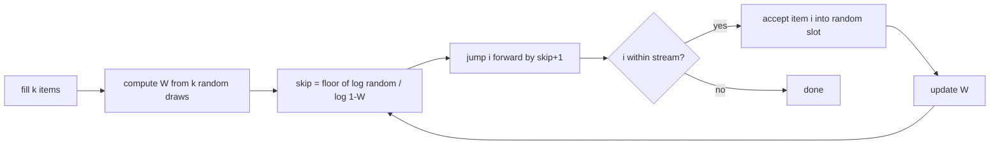

# Reservoir Sampling — Middle Level

> **One-line summary:** Algorithm R does one RNG draw per item and keeps item `i` with probability `k/i`. That is wasteful when `n ≫ k`, because almost every draw is "discard." **Algorithm L** fixes this by computing, in one geometric jump, *how many items to skip* before the next accepted one — turning `O(n)` random draws into `O(k·(1 + log(n/k)))`. And when items have **weights**, the **A-Res / Efraimidis-Spirakis** scheme assigns each item a key `u^(1/w)` (with `u` uniform in `(0,1)`) and keeps the `k` largest keys — a one-pass, weighted, uniform-without-replacement sample.

---

## Table of Contents

1. [Introduction](#introduction)
2. [Why Algorithm R Works (the invariant)](#why-algorithm-r-works-the-invariant)
3. [Comparison with Alternatives](#comparison-with-alternatives)
4. [Algorithm L — skip-based optimization](#algorithm-l--skip-based-optimization)
5. [Weighted Reservoir Sampling (A-Res / Efraimidis-Spirakis)](#weighted-reservoir-sampling)
6. [Reservoir Sampling vs the Naive Shuffle, in Depth](#reservoir-sampling-vs-the-naive-shuffle-in-depth)
7. [A Worked Weighted Example (Efraimidis-Spirakis keys)](#a-worked-weighted-example-efraimidis-spirakis-keys)
8. [Code Examples](#code-examples)
7. [Error Handling](#error-handling)
8. [Performance Analysis](#performance-analysis)
9. [Best Practices](#best-practices)
10. [Visual Animation](#visual-animation)
11. [Summary](#summary)

---

## Introduction

> Focus: "Why does it work?" and "When should I choose this variant?"

At the junior level you saw **Algorithm R**: fill `k` slots, then keep the `i`-th item with probability `k/i`. It is correct and `O(1)` per item, but it pays a hidden tax — it calls the random number generator **once per item**, even though when `n ≫ k` the vast majority of those draws end in "discard." If you are sampling `k = 100` items from a stream of a billion, you make a billion RNG calls to keep a hundred items.

This level answers three questions:

1. **Why** is keeping item `i` with probability `k/i` exactly right? (The reservoir maintains an invariant: after `i` items, it is a uniform `k`-sample of those `i`.)
2. **How** do we avoid the wasted draws? (**Algorithm L** computes how far to skip ahead before the next accepted item, in `O(k log(n/k))` random draws.)
3. **What if items have weights** — some should be sampled more often than others? (**Weighted reservoir sampling** via the Efraimidis-Spirakis key trick `u^(1/w)`.)

We will also nail down why the naive *"collect everything and shuffle"* is the wrong tool for streams, even though it gives the same distribution.

---

## Why Algorithm R Works (the invariant)

The correctness rests on a single **loop invariant**:

> **Invariant I(i):** After processing the first `i` items, the reservoir contains a *uniform random subset of size* `min(k, i)` of those `i` items — i.e. every `k`-subset is equally likely, and (equivalently) each of the `i` items is in the reservoir with probability `k/i`.

**Base case.** After `i = k` items, the reservoir is all `k` of them — the only `k`-subset of `k` items, trivially uniform. Each is present with probability `k/k = 1`. ✓

**Inductive step.** Assume `I(i)` holds. Item `i+1` arrives. With probability `k/(i+1)` it enters the reservoir, evicting a uniformly chosen slot; with probability `1 - k/(i+1)` it is discarded.

- **New item `x_{i+1}`** ends in the reservoir with probability `k/(i+1)` — exactly its fair share. ✓
- **An old item `x_m` (`m ≤ i`)** was in the reservoir with probability `k/i` (by `I(i)`). It stays unless `x_{i+1}` enters *and* evicts its slot: `P(evicted) = (k/(i+1)) · (1/k) = 1/(i+1)`. So:

```
P(x_m in reservoir after i+1) = (k/i) · (1 - 1/(i+1))
                              = (k/i) · (i/(i+1))
                              = k/(i+1).   ✓
```

Every item — old and new — has probability `k/(i+1)`. `I(i+1)` holds. By induction `I(n)` gives each item probability `k/n`. (The full subset-uniformity proof is in `professional.md`.)

This is the same telescoping cancellation from the junior walkthrough, now stated as an invariant you can carry through the loop. The `k/i` is not a magic constant — it is precisely the value that keeps the invariant true at every step.

---

## Comparison with Alternatives

| Attribute | Algorithm R | Algorithm L | Naive shuffle | Weighted (A-Res) |
|-----------|-------------|-------------|---------------|------------------|
| Memory | O(k) | O(k) | **O(n)** | O(k) (a heap) |
| Passes | 1 | 1 | 1 (+shuffle) | 1 |
| Needs `n` in advance? | No | No | **Yes (stores all)** | No |
| RNG calls | **O(n)** | **O(k·(1+log(n/k)))** | O(n) | O(n) (one key each) |
| Per-item time | O(1) | O(1) amortized | O(1) collect | O(log k) heap push |
| Weighted? | No | No | No (uniform) | **Yes** |
| Without replacement? | Yes | Yes | Yes | Yes |

**Choose Algorithm R when:** simplicity matters and `n` is not enormous, or per-item cost is dominated by reading the item anyway.
**Choose Algorithm L when:** `n ≫ k` and RNG/branch cost per item is significant (high-throughput pipelines).
**Choose the naive shuffle when:** the data already fits in memory and `n` is known — there is no reason to stream.
**Choose A-Res when:** items have weights and you want each picked in proportion to its weight, still in one pass.

---

## Algorithm L — skip-based optimization

The insight: in Algorithm R, consecutive items are independently *accepted* or *rejected*. Instead of flipping a coin for each item, ask **"how many items will I skip before the next acceptance?"** — a geometric-like quantity you can sample in *one* draw, then jump directly to that item.

Vitter's **Algorithm L** maintains a value `W` and, after each acceptance, computes the number of items to skip:

```text
init: fill reservoir with first k items
W = exp(log(random()) / k)          # random() uniform in (0,1)
loop:
    skip = floor( log(random()) / log(1 - W) )   # number of items to skip
    i += skip + 1
    if i <= n:
        reservoir[ randInt(0, k-1) ] = item_i     # accept item i, random slot
        W *= exp(log(random()) / k)
    else:
        stop
```

Each accepted item costs `O(1)` and consumes a constant number of RNG calls; the number of acceptances over the whole stream is `O(k·(1 + log(n/k)))` in expectation (the reservoir gets "refreshed" about `k ln(n/k)` times). So instead of `n` random draws you make roughly `k log(n/k)` of them — a massive saving when `n` is billions and `k` is hundreds.



Algorithm L produces **exactly the same uniform distribution** as Algorithm R — it just samples the gaps between acceptances directly instead of testing every item. (There is an even older Algorithm Z that is asymptotically optimal; L is the simplest near-optimal one and the usual choice.)

---

## Weighted Reservoir Sampling

Sometimes items are not equal: item with weight `w` should appear in the sample with probability proportional to `w`. The classic Algorithm R has no notion of weight. The elegant fix is the **Efraimidis-Spirakis** scheme (often called **A-Res**, "Algorithm for Reservoir sampling, weighted").

**The key trick.** For each item with weight `w_i`, draw a uniform `u_i ∈ (0, 1)` and compute a **key**:

```
key_i = u_i^(1 / w_i)
```

Then keep the `k` items with the **largest keys**. That single rule yields a *weighted random sample without replacement*: the probability item `i` is in the sample is proportional to its weight in the precise A-Res sense.

**Why a max-heap of size `k`.** You cannot store all keys (`O(k)` memory!). Maintain a **min-heap** of the current top-`k` keys. For each new item:

- compute its key;
- if the heap has fewer than `k` items, push it;
- otherwise, if the new key is larger than the heap's smallest key, pop the smallest and push the new one.

This keeps the `k` largest keys seen so far, in one pass, with `O(log k)` per item.

```mermaid
graph TD
    A[item i with weight w_i] --> B[u = random in 0..1]
    B --> C[key = u^(1/w_i)]
    C --> D{heap size < k?}
    D -->|yes| E[push key into min-heap]
    D -->|no| F{key > heap.min?}
    F -->|yes| G[pop min, push key]
    F -->|no| H[discard]
```

**Intuition for `u^(1/w)`.** A larger weight `w` makes `1/w` smaller, so `u^(1/w)` is pushed *closer to 1* — heavier items tend to get larger keys and are more likely to survive in the top-`k`. The exact distribution of `u^(1/w)` is engineered so the top-`k` selection matches the desired weighted-sampling probabilities. (The correctness proof is in `professional.md`.) A common refinement, **A-ExpJ**, applies the same skip idea as Algorithm L to the weighted case for fewer RNG calls.

---

## Reservoir Sampling vs the Naive Shuffle, in Depth

It is worth being precise about *why* the naive "collect everything, shuffle, take `k`" approach is the wrong tool for streams, because the two methods produce the **same distribution** — the difference is entirely operational.

The naive method:

```text
naive_sample(stream, k):
    all = list(stream)        # O(n) memory — must hold everything
    shuffle(all)              # Fisher-Yates, O(n) time
    return all[:k]
```

Both reservoir sampling and the naive shuffle return a uniform `k`-subset. But:

| Dimension | Naive shuffle | Reservoir sampling |
|-----------|---------------|--------------------|
| Memory | `O(n)` — the whole stream is materialized | `O(k)` — only the reservoir + a counter |
| Needs `n` known up front? | Effectively yes (you store all of it) | No — works on unbounded streams |
| Can start emitting before the stream ends? | No — must see everything first | The reservoir is a valid sample at *every* prefix |
| Works on an infinite stream? | No — `O(n)` blows up | Yes — memory stays fixed |
| Passes over data | 1 to collect + 1 to shuffle | 1 |
| Distribution | uniform `k`-subset | identical uniform `k`-subset |

The deep connection: **reservoir sampling is a streaming, memory-bounded partial Fisher-Yates shuffle.** In Fisher-Yates you walk the array and swap each position with a random earlier-or-equal position; in reservoir sampling you do the same "swap into one of the first `k` slots with the right probability" decision, but you only *keep* the first `k` slots and discard the rest as you go. If you could afford `O(n)` memory and knew `n`, you would just shuffle. The entire reason reservoir sampling exists is to drop the `O(n)` memory and the need to know `n` — at zero cost to correctness. So the rule of thumb is simple: **if the data already fits in memory and `n` is known, shuffle; otherwise, stream with a reservoir.**

A subtle but important consequence of "valid at every prefix": you can stop a reservoir sampler at *any* moment — after a timeout, a budget, or a signal — and the reservoir you have is a correct uniform sample of everything seen so far. The naive shuffle has no such property; interrupt it mid-collection and you have a biased prefix of the stream.

---

## A Worked Weighted Example (Efraimidis-Spirakis keys)

Let us make `u^(1/w)` concrete. Suppose `k = 1` (pick a single weighted item) and three items with weights `w = [1, 1, 4]`. Item 3 should be picked four times as often as item 1 or item 2 — i.e. with probability `4/6 = 2/3`, versus `1/6` each for items 1 and 2.

For each item we draw a uniform `u ∈ (0,1)` and form the key `u^(1/w)`:

```
item 1 (w=1): key1 = u1^(1/1) = u1
item 2 (w=1): key2 = u2^(1/1) = u2
item 3 (w=4): key3 = u3^(1/4)   (a fourth root — pulled toward 1)
```

We keep the item with the **largest** key. Why does item 3 win `2/3` of the time? Because `u3^(1/4)` is the fourth root of a number in `(0,1)`, which is always closer to `1` than `u3` itself — a heavy weight systematically inflates the key. The exact distribution of `u^(1/w)` is engineered so that `P(key_i is the maximum)` equals `w_i / Σ w_j`. You can confirm this empirically:

```python
import random
from collections import Counter

def weighted_pick_once(weights):
    best_key, best = -1.0, None
    for i, w in enumerate(weights):
        key = random.random() ** (1.0 / w)
        if key > best_key:
            best_key, best = key, i
    return best

counts = Counter(weighted_pick_once([1, 1, 4]) for _ in range(300_000))
print(counts)   # item 2 (index) ≈ 200k, items 0 and 1 ≈ 50k each
```

The output shows item index `2` chosen about `2/3` of the time, exactly matching `w_3 / Σw = 4/6`. For `k > 1` the same keys are used — you simply keep the top-`k` largest keys instead of the single maximum, and you maintain them in a size-`k` min-heap so memory stays `O(k)`. This is the whole A-Res scheme.

**A practical note on numerical stability.** For large weights or very many items, `u^(1/w)` can underflow to `0.0` in floating point (every key rounds to zero and ties break arbitrarily, destroying the weighting). The fix is to compare in **log space**: instead of the key `u^(1/w)`, store and compare `log(u) / w`. Since `log` is monotonic, the top-`k` by `log(u)/w` is exactly the top-`k` by `u^(1/w)`, but the arithmetic never underflows. Production weighted samplers almost always use the log-space form.

---

## Code Examples

### Example 1: Algorithm L (skip-based, unweighted)

#### Go

```go
package main

import (
	"fmt"
	"math"
	"math/rand"
)

// ReservoirSampleL implements Vitter's Algorithm L: same uniform result as
// Algorithm R, but ~O(k log(n/k)) random draws instead of O(n).
func ReservoirSampleL(stream []int, k int) []int {
	n := len(stream)
	if n <= k {
		out := make([]int, n)
		copy(out, stream)
		return out
	}
	reservoir := make([]int, k)
	copy(reservoir, stream[:k])

	w := math.Exp(math.Log(rand.Float64()) / float64(k))
	i := k - 1 // 0-based index of last processed item
	for {
		skip := int(math.Floor(math.Log(rand.Float64()) / math.Log(1-w)))
		i += skip + 1
		if i >= n {
			break
		}
		reservoir[rand.Intn(k)] = stream[i] // accept into a random slot
		w *= math.Exp(math.Log(rand.Float64()) / float64(k))
	}
	return reservoir
}

func main() {
	stream := make([]int, 1000)
	for i := range stream {
		stream[i] = i
	}
	fmt.Println(ReservoirSampleL(stream, 5)) // 5 uniform samples from 0..999
}
```

#### Java

```java
import java.util.*;

public class ReservoirL {
    static int[] sampleL(int[] stream, int k) {
        int n = stream.length;
        if (n <= k) return Arrays.copyOf(stream, n);
        int[] reservoir = Arrays.copyOf(stream, k);
        Random rnd = new Random();

        double w = Math.exp(Math.log(rnd.nextDouble()) / k);
        int i = k - 1;
        while (true) {
            int skip = (int) Math.floor(Math.log(rnd.nextDouble()) / Math.log(1 - w));
            i += skip + 1;
            if (i >= n) break;
            reservoir[rnd.nextInt(k)] = stream[i];
            w *= Math.exp(Math.log(rnd.nextDouble()) / k);
        }
        return reservoir;
    }

    public static void main(String[] args) {
        int[] stream = new int[1000];
        for (int i = 0; i < 1000; i++) stream[i] = i;
        System.out.println(Arrays.toString(sampleL(stream, 5)));
    }
}
```

#### Python

```python
import math
import random


def reservoir_sample_l(stream, k):
    """Algorithm L: same uniform result as R, ~O(k log(n/k)) random draws."""
    reservoir = []
    it = iter(stream)
    for _ in range(k):                       # fill phase
        try:
            reservoir.append(next(it))
        except StopIteration:
            return reservoir                 # n < k

    w = math.exp(math.log(random.random()) / k)
    i = k - 1
    items = list(stream)                     # for index access in this demo
    n = len(items)
    while True:
        skip = math.floor(math.log(random.random()) / math.log(1 - w))
        i += skip + 1
        if i >= n:
            break
        reservoir[random.randrange(k)] = items[i]
        w *= math.exp(math.log(random.random()) / k)
    return reservoir


if __name__ == "__main__":
    print(reservoir_sample_l(range(1000), 5))
```

**What it does:** fills `k` slots, then repeatedly samples a geometric "skip" gap to jump straight to the next accepted item, replacing a random slot. Same distribution as Algorithm R, far fewer RNG calls.

### Example 2: Weighted reservoir sampling (A-Res with a heap)

#### Go

```go
package main

import (
	"container/heap"
	"fmt"
	"math"
	"math/rand"
)

type keyed struct {
	key  float64
	item int
}
type minHeap []keyed

func (h minHeap) Len() int            { return len(h) }
func (h minHeap) Less(i, j int) bool  { return h[i].key < h[j].key }
func (h minHeap) Swap(i, j int)       { h[i], h[j] = h[j], h[i] }
func (h *minHeap) Push(x interface{}) { *h = append(*h, x.(keyed)) }
func (h *minHeap) Pop() interface{} {
	old := *h
	n := len(old)
	x := old[n-1]
	*h = old[:n-1]
	return x
}

// WeightedSample keeps the k items with the largest keys u^(1/w).
func WeightedSample(items []int, weights []float64, k int) []int {
	h := &minHeap{}
	heap.Init(h)
	for idx, it := range items {
		key := math.Pow(rand.Float64(), 1.0/weights[idx])
		if h.Len() < k {
			heap.Push(h, keyed{key, it})
		} else if key > (*h)[0].key {
			heap.Pop(h)
			heap.Push(h, keyed{key, it})
		}
	}
	out := make([]int, 0, h.Len())
	for _, e := range *h {
		out = append(out, e.item)
	}
	return out
}

func main() {
	items := []int{1, 2, 3, 4, 5}
	weights := []float64{1, 1, 1, 10, 10} // 4 and 5 favored
	fmt.Println(WeightedSample(items, weights, 2))
}
```

#### Java

```java
import java.util.*;

public class WeightedReservoir {
    record Keyed(double key, int item) {}

    static List<Integer> weightedSample(int[] items, double[] w, int k) {
        PriorityQueue<Keyed> heap =
            new PriorityQueue<>(Comparator.comparingDouble(Keyed::key)); // min-heap
        Random rnd = new Random();
        for (int idx = 0; idx < items.length; idx++) {
            double key = Math.pow(rnd.nextDouble(), 1.0 / w[idx]);
            if (heap.size() < k) {
                heap.add(new Keyed(key, items[idx]));
            } else if (key > heap.peek().key()) {
                heap.poll();
                heap.add(new Keyed(key, items[idx]));
            }
        }
        List<Integer> out = new ArrayList<>();
        for (Keyed e : heap) out.add(e.item());
        return out;
    }

    public static void main(String[] args) {
        int[] items = {1, 2, 3, 4, 5};
        double[] w = {1, 1, 1, 10, 10};
        System.out.println(weightedSample(items, w, 2));
    }
}
```

#### Python

```python
import heapq
import random


def weighted_sample(items, weights, k):
    """A-Res: keep the k items with the largest keys u^(1/w)."""
    heap = []  # min-heap of (key, item)
    for it, w in zip(items, weights):
        key = random.random() ** (1.0 / w)
        if len(heap) < k:
            heapq.heappush(heap, (key, it))
        elif key > heap[0][0]:
            heapq.heapreplace(heap, (key, it))
    return [item for _, item in heap]


if __name__ == "__main__":
    items = [1, 2, 3, 4, 5]
    weights = [1, 1, 1, 10, 10]   # 4 and 5 favored
    print(weighted_sample(items, weights, 2))
```

**What it does:** assigns each item a key `u^(1/w)` and keeps the `k` largest via a size-`k` min-heap — a one-pass weighted sample without replacement.

---

## Error Handling

| Scenario | What goes wrong | Correct approach |
|----------|----------------|------------------|
| `log(1 - w)` with `w = 1` | `w` reaches 1, `log(0)` → `-inf`, skip becomes huge/NaN. | Clamp `random()` away from 0/1, or special-case `w ≥ 1`. |
| Zero weight in A-Res | `1/w` divides by zero. | Reject or skip items with `w ≤ 0` (zero-weight items can never be sampled). |
| Heap comparator inverted | Keeping the *smallest* keys instead of largest. | Use a **min-heap** and replace its min only when the new key is **larger**. |
| `random()` returns exactly 0 | `log(0) = -inf`, key `0^(1/w) = 0`. | Use a generator that returns values in `(0, 1)` or re-draw on 0. |
| Algorithm L on `n ≤ k` | Skip loop runs on too-short stream. | Short-circuit: if `n ≤ k`, return all items. |
| Float precision for tiny weights | `u^(1/w)` underflows for huge `w`. | Work in log space: compare `log(u)/w` instead of `u^(1/w)`. |

---

## Performance Analysis

The dominant cost difference between R and L is **RNG calls**, not arithmetic. Below is a micro-benchmark skeleton for the per-item throughput.

#### Go

```go
package main

import (
	"fmt"
	"time"
)

func benchmark() {
	sizes := []int{1000, 10000, 100000, 1000000}
	k := 100
	for _, n := range sizes {
		data := make([]int, n)
		for i := range data {
			data[i] = i
		}
		start := time.Now()
		for r := 0; r < 20; r++ {
			_ = ReservoirSampleL(data, k) // compare against Algorithm R
		}
		fmt.Printf("n=%8d: %.3f ms\n", n, float64(time.Since(start).Milliseconds())/20.0)
	}
}
```

#### Java

```java
public static void benchmark() {
    int[] sizes = {1000, 10000, 100000, 1000000};
    int k = 100;
    for (int n : sizes) {
        int[] data = java.util.stream.IntStream.range(0, n).toArray();
        long start = System.nanoTime();
        for (int r = 0; r < 20; r++) {
            ReservoirL.sampleL(data, k);
        }
        long elapsed = System.nanoTime() - start;
        System.out.printf("n=%8d: %.3f ms%n", n, elapsed / 20.0 / 1_000_000);
    }
}
```

#### Python

```python
import timeit

k = 100
for n in (1_000, 10_000, 100_000, 1_000_000):
    data = list(range(n))
    t = timeit.timeit(lambda: reservoir_sample_l(data, k), number=20)
    print(f"n={n:>8}: {t/20*1000:.3f} ms")
```

**Expected shape:** Algorithm R's RNG calls grow linearly with `n`; Algorithm L's grow like `k log(n/k)`, so the gap widens dramatically as `n` increases with `k` fixed. The A-Res heap adds `O(log k)` per *kept* candidate, negligible when `k` is small.

| Variant | RNG calls | Per-item time | Memory |
|---------|-----------|---------------|--------|
| Algorithm R | `n` | `O(1)` | `O(k)` |
| Algorithm L | `≈ k·(1 + ln(n/k))` | `O(1)` amortized | `O(k)` |
| A-Res (weighted) | `n` (one key each) | `O(log k)` worst | `O(k)` |
| A-ExpJ (weighted+skip) | `≈ k·(1 + ln(n/k))` | `O(log k)` | `O(k)` |

---

## Best Practices

- Use **Algorithm R** for clarity and moderate `n`; switch to **Algorithm L** only when profiling shows RNG/branch cost matters at large `n`.
- For weighted sampling, prefer the **log-space key** `log(u)/w` over `u^(1/w)` to avoid underflow with large weights or many items.
- Maintain weighted samples with a **size-`k` min-heap**; never store all keys.
- Validate any variant **against Algorithm R empirically**: over many runs each item's inclusion frequency should match `k/n` (or the weighted target).
- Seed the RNG explicitly in tests for reproducibility; use a fresh, well-seeded RNG in production.
- Keep the fill phase, the accept rule, and the skip computation as separate, individually tested pieces.
- Document the guarantee: uniform-without-replacement (R/L) vs weighted-without-replacement (A-Res).

---

## Visual Animation

> See [`animation.html`](./animation.html) for interactive visualization.
>
> Middle-level relevance:
> - Watch the `k/i` acceptance probability shrink as `i` grows (why later items are rarer to accept)
> - See how few items Algorithm L actually "lands on" versus how many Algorithm R inspects
> - Observe the reservoir staying a uniform sample at every prefix (the invariant)

---

## Summary

At the middle level, reservoir sampling is understood through its **invariant** — after `i` items the reservoir is a uniform `k`-sample of those `i` — which is exactly why the acceptance probability must be `k/i`. Two practical refinements matter: **Algorithm L** samples the *gap* to the next accepted item, cutting RNG calls from `O(n)` to `O(k·(1 + log(n/k)))` while producing the identical distribution; and **weighted reservoir sampling** (A-Res / Efraimidis-Spirakis) assigns each item the key `u^(1/w)` and keeps the `k` largest via a min-heap, giving a one-pass weighted sample without replacement. The naive *collect-and-shuffle* matches the distribution but needs `O(n)` memory and a known `n`, so it is the wrong tool for true streams.

---

Next step: [senior.md](./senior.md)
