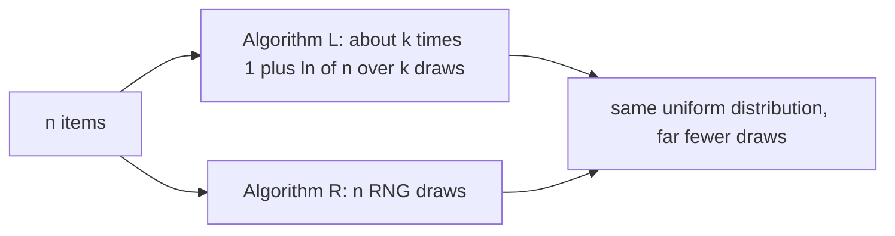

# Reservoir Sampling — Mathematical Foundations and Complexity Theory

> **One-line summary:** Reservoir sampling is correct because the acceptance probability `k/i` is *exactly* the value that preserves a loop invariant — "after `i` items the reservoir is a uniform `k`-subset of those `i`" — and the proof is a clean induction that bottoms out in a telescoping product equal to `k/n`. This file gives the formal definitions, the inductive uniformity proof (per-item and full-subset), the correctness of the Efraimidis-Spirakis weighted keys, and the time/space/variance analysis, with runnable Go/Java/Python reference code.

---

## Table of Contents

1. [Formal Definitions](#1-formal-definitions)
2. [The Uniformity Invariant](#2-the-uniformity-invariant)
3. [Proof by Induction: Each Item Ends With Probability k/n](#3-proof-by-induction-each-item-ends-with-probability-kn)
4. [Full Subset Uniformity](#4-full-subset-uniformity)
4.5. [A Fully Worked Numeric Check of the Subset Proof](#45-a-fully-worked-numeric-check-of-the-subset-proof)
5. [Algorithm L: Correctness of the Skip Distribution](#5-algorithm-l-correctness-of-the-skip-distribution)
6. [Weighted-Key Correctness (Efraimidis-Spirakis)](#6-weighted-key-correctness-efraimidis-spirakis)
7. [Complexity Analysis](#7-complexity-analysis)
8. [Variance and Concentration of Estimates](#8-variance-and-concentration-of-estimates)
8.5. [Correctness Pitfalls That Break the Proofs](#85-correctness-pitfalls-that-break-the-proofs)
8.7. [Correctness of the Count-Weighted Merge](#87-correctness-of-the-count-weighted-merge)
9. [Comparison with Alternatives](#9-comparison-with-alternatives)
10. [Reference Implementations](#10-reference-implementations)
11. [Historical Notes and Open Variants](#11-historical-notes-and-open-variants)
12. [Summary](#12-summary)

---

## 1. Formal Definitions

Let the stream be a finite (but a-priori-unknown-length) sequence of distinct *positions* `x_1, x_2, …, x_n`. (We sample positions; duplicate *values* are treated as distinct items, which is why uniformity is always about positions.) Fix a target size `k` with `1 ≤ k ≤ n`.

**Definition 1.1 (Reservoir).** A reservoir is an ordered array `R = (R[0], …, R[k-1])` of `k` slots, each holding one item from the stream. Slot order carries no meaning for the *set* returned, but the algorithm uses positional slots so that the eviction step can pick a uniformly random slot to overwrite.

**Definition 1.2 (Algorithm R).** Process items in order. For the first `k` items, set `R[i-1] = x_i` (the *fill phase*). For each later item `x_i` with `i > k` (the *replace phase*), draw `J_i` uniformly from `{1, 2, …, i}`; if `J_i ≤ k`, set `R[J_i - 1] = x_i`, otherwise discard `x_i`. The draws `J_{k+1}, J_{k+2}, …, J_n` are mutually independent.

**Definition 1.3 (Acceptance event).** Let `A_i` be the event "item `x_i` is *accepted into* the reservoir when it arrives." For `i ≤ k`, `P(A_i) = 1`. For `i > k`, `A_i = {J_i ≤ k}`, so `P(A_i) = k/i`.

**Definition 1.4 (Survival).** Let `S_i^{(t)}` be the event "item `x_i` is *present in the reservoir* after the first `t` items have been processed" (for `t ≥ i`). The final outcome of interest is `S_i^{(n)}`: "item `x_i` is in the returned sample."

**Definition 1.5 (Uniform `k`-sample).** A random subset `T ⊆ {x_1,…,x_m}` of size `k` is a *uniform `k`-sample* of the first `m` items if `P(T = U) = 1 / C(m,k)` for every `k`-subset `U`, where `C(m,k)` is the binomial coefficient "`m` choose `k`."

**Notation.** `C(m,k) = m! / (k!(m-k)!)` is the binomial coefficient. Probabilities `P(·)` are over the algorithm's internal randomness; the stream itself is fixed (adversarial order is allowed — uniformity does not depend on order). We say "item `i`" for the item at position `i`, i.e. `x_i`. Harmonic numbers are written `H_m = Σ_{j=1}^{m} 1/j`.

**Standing assumptions.** `k` is fixed before the stream starts; `n ≥ k` (the cases `n < k`, `k = 0`, empty stream are handled by returning all available items and are excluded from the probabilistic statements). The RNG produces independent uniform draws.

**Boundary conventions.** When `n < k` the algorithm returns the entire stream (a uniform `n`-sample of `n` items, trivially); when `n = k` it returns the whole stream with no replace step executed; when `k = 0` or the stream is empty it returns the empty sample. These degenerate cases are correct under the natural reading of Definition 1.5 (the only subset of an `m`-set of size `min(k,m)` is forced) and are excluded from Theorems 3.1/4.1 only to keep the binomial coefficients well-defined.

The entire correctness story is: **Definition 1.3's value `k/i` is forced by the requirement that Definition 1.5 hold at every prefix `m`.** Sections 2-4 prove that this single choice does exactly that.

**A note on adversarial order.** Nothing in the definitions constrains the *order* of the stream — an adversary may arrange items arbitrarily. The uniformity guarantees of Theorems 3.1 and 4.1 hold regardless, because the only randomness is the algorithm's own draws `J_i`, never the stream. This is a stronger guarantee than many sampling schemes offer and is what makes reservoir sampling safe on data whose ordering we do not control (logs interleaved across hosts, events replayed in unknown sequence). The position index `i` is the only thing the algorithm reacts to; values and their arrangement are irrelevant to the distribution of the output subset.

---

## 2. The Uniformity Invariant

Everything rests on one loop invariant.

**Invariant I(i).** *After processing the first `i` items (`i ≥ k`), the reservoir `R` is a uniform `k`-sample of `{x_1, …, x_i}`.*

Two equivalent statements of `I(i)` are useful:

- **(Subset form)** Every `k`-subset `U ⊆ {x_1,…,x_i}` satisfies `P(R = U) = 1 / C(i,k)`.
- **(Marginal form)** Every item `x_m` with `m ≤ i` satisfies `P(S_m^{(i)}) = k/i`.

The subset form implies the marginal form by symmetry: the number of `k`-subsets containing a fixed item `x_m` is `C(i-1, k-1)`, so

```
P(x_m ∈ R after i items) = C(i-1, k-1) / C(i, k) = k / i.
```

We will prove the subset form by induction (Section 4) and, because it is the cleanest first contact with the mechanism, the marginal form directly (Section 3). Both proofs hinge on the same fact: `P(A_i) = k/i` is the unique acceptance probability that carries `I(i-1)` to `I(i)`.

```mermaid
graph TD
    A[Invariant I_i: reservoir is uniform k-sample of first i] --> B{item i+1 arrives}
    B -->|accept, prob k/(i+1)| C[new item enters, evict random slot]
    B -->|discard, prob 1 - k/(i+1)| D[reservoir unchanged]
    C --> E[Invariant I_(i+1) holds]
    D --> E
    E --> F[at i = n: each item present w.p. k/n]
```

---

## 3. Proof by Induction: Each Item Ends With Probability k/n

We prove the **marginal form** of `I(i)`: after `i` items, each `x_m` (`m ≤ i`) is in the reservoir with probability `k/i`. Setting `i = n` gives the headline result.

**Theorem 3.1.** For Algorithm R, `P(S_m^{(n)}) = k/n` for every `m ∈ {1, …, n}`.

**Proof.** We show by induction on `i ≥ k` that `P(S_m^{(i)}) = k/i` for all `m ≤ i`.

**Base case (`i = k`).** After the fill phase the reservoir contains exactly `x_1, …, x_k`, each with probability `1 = k/k`. ✓

**Inductive step.** Assume `P(S_m^{(i)}) = k/i` for all `m ≤ i`. Process item `x_{i+1}`. Two kinds of items to track:

*(a) The new item `x_{i+1}`.* It is present after step `i+1` iff it was accepted: `P(S_{i+1}^{(i+1)}) = P(A_{i+1}) = k/(i+1)`. ✓

*(b) An old item `x_m` (`m ≤ i`).* It is present after step `i+1` iff it was present after step `i` **and** it was not evicted by `x_{i+1}`. Eviction happens iff `x_{i+1}` is accepted (prob `k/(i+1)`) *and* the uniformly chosen slot is the one holding `x_m` (prob `1/k`). These are independent of the survival of `x_m` so far, so

```
P(x_m evicted at step i+1 | present after i) = (k/(i+1)) · (1/k) = 1/(i+1).
P(x_m survives step i+1 | present after i)   = 1 - 1/(i+1) = i/(i+1).
```

Therefore

```
P(S_m^{(i+1)}) = P(S_m^{(i)}) · i/(i+1)
              = (k/i) · (i/(i+1))      [inductive hypothesis]
              = k/(i+1).               ✓
```

Both cases give probability `k/(i+1)`, so the claim holds for `i+1`. By induction it holds for all `i` up to `n`, and `P(S_m^{(n)}) = k/n`. ∎

**The telescoping view.** Unrolling case (b) from the step an item enters (`max(m,k)`-ish) to `n` shows the survival probability of an item that entered at step `t` is

```
P(enter at t) · ∏_{j=t+1}^{n} (1 - 1/j)
   = (k/t) · ∏_{j=t+1}^{n} (j-1)/j
   = (k/t) · (t/n)         [the product telescopes: (t/(t+1))·((t+1)/(t+2))···((n-1)/n) = t/n]
   = k/n.
```

The cancellation is exact for *every* entry step `t`, which is precisely why every item — regardless of when it arrived — ends with the same probability `k/n`. This telescoping product is the mathematical heart of reservoir sampling.

---

## 4. Full Subset Uniformity

Per-item uniformity (`k/n` each) is necessary but not sufficient for a *uniform sample*: we also need every `k`-subset to be equally likely. We now prove the stronger subset form.

**Theorem 4.1.** For Algorithm R, after `i` items the reservoir `R` satisfies `P(R = U) = 1/C(i,k)` for every `k`-subset `U ⊆ {x_1,…,x_i}`.

**Proof.** Induction on `i ≥ k`.

**Base case (`i = k`).** `C(k,k) = 1`; the reservoir is the unique subset `{x_1,…,x_k}` with probability `1`. ✓

**Inductive step.** Assume the claim for `i`. Fix a `k`-subset `U ⊆ {x_1,…,x_{i+1}}`. Two cases.

*Case 1: `x_{i+1} ∉ U`.* Then `U ⊆ {x_1,…,x_i}`. `R = U` after step `i+1` requires `R = U` after step `i` (prob `1/C(i,k)` by hypothesis) and that `x_{i+1}` was **not** accepted (prob `1 - k/(i+1)`), since accepting would overwrite a slot and change `R`. Independence gives

```
P(R = U) = (1/C(i,k)) · (1 - k/(i+1))
         = (1/C(i,k)) · ((i+1-k)/(i+1)).
```

Now use the identity `C(i,k) · (i+1)/(i+1-k) = C(i+1,k)`:

```
P(R = U) = (i+1-k) / (C(i,k) · (i+1)) = 1 / C(i+1,k).   ✓
```

*Case 2: `x_{i+1} ∈ U`.* Write `U = U' ∪ {x_{i+1}}` where `U' ⊆ {x_1,…,x_i}` has size `k-1`. For `R = U` after step `i+1`, item `x_{i+1}` must be accepted and land in some slot, with the other `k-1` slots holding exactly `U'`. Just before step `i+1` the reservoir was some `k`-subset `W` of `{x_1,…,x_i}` that contains `U'` (it must already hold the `k-1` survivors). There are exactly `i - (k-1)` such `W` (choose the one extra element from the `i-(k-1)` items not in `U'`). For a given `W`, the probability `R = U` results is:

`P(R = W after i) · P(x_{i+1} accepted) · P(slot chosen = the one holding the element of W \ U')`
`= (1/C(i,k)) · (k/(i+1)) · (1/k) = 1 / (C(i,k)·(i+1)).`

Summing over the `i-k+1` valid `W`:

```
P(R = U) = (i - k + 1) / (C(i,k) · (i+1)).
```

Apply the identity `C(i,k) · (i+1)/(i-k+1) = C(i+1,k)` again:

```
P(R = U) = (i-k+1) / (C(i,k)·(i+1)) = 1 / C(i+1,k).   ✓
```

Both cases give `1/C(i+1,k)`, completing the induction. At `i = n`, every `k`-subset is returned with probability `1/C(n,k)` — a uniform `k`-sample. ∎

**Corollary 4.2.** Algorithm R returns a uniform sample *without replacement*: no item appears twice (each occupies at most one slot), and all `C(n,k)` subsets are equiprobable. The marginal `k/n` of Theorem 3.1 follows as the special case noted in Section 2.

---

## 4.5 A Fully Worked Numeric Check of the Subset Proof

Abstract induction can hide arithmetic slips, so let us instantiate Theorem 4.1 on the smallest non-trivial case and confirm every probability by hand: `k = 2`, stream `{A, B, C}`, so `n = 3` and there are `C(3,2) = 3` target subsets `{A,B}, {A,C}, {B,C}`, each of which must come out with probability `1/3`.

After the fill phase (`A`, `B`) the reservoir is `{A, B}` with probability 1 — this is `I(2)`. Then item `C` (the 3rd item, `i+1 = 3`) is accepted with probability `k/(i+1) = 2/3`; if accepted it overwrites a uniformly chosen slot.

- **`P(R = {A,B})`** (Case 1, `C ∉ U`): require `C` *not* accepted. `P = 1 - 2/3 = 1/3`. ✓
- **`P(R = {A,C})`** (Case 2, `C ∈ U`): require `C` accepted (prob `2/3`) *and* it lands in the slot holding `B` (prob `1/2`, since the evicted slot is uniform over the 2 slots). `P = (2/3)·(1/2) = 1/3`. ✓
- **`P(R = {B,C})`** (Case 2): require `C` accepted (`2/3`) and it evicts `A` (`1/2`). `P = (2/3)·(1/2) = 1/3`. ✓

All three subsets are equiprobable at `1/3 = 1/C(3,2)`, exactly as Theorem 4.1 predicts, and the three probabilities sum to `1`. Note this *also* re-derives the marginals: `A` appears in `{A,B}` and `{A,C}`, so `P(A ∈ R) = 1/3 + 1/3 = 2/3 = k/n`, and likewise for `B` and `C`. The numeric check exercises both branches of the inductive step (Case 1 and Case 2) and the finite-population symmetry in one tiny example.

---

## 5. Algorithm L: Correctness of the Skip Distribution

Algorithm L produces the *same distribution* as Algorithm R while drawing `O(k(1+log(n/k)))` random numbers instead of `n`. The key is to sample, in one draw, the *gap* to the next accepted item.

**Setup.** After the fill phase, every subsequent item is accepted independently. Crucially, the per-item acceptance probabilities are *not* constant (`k/i` shrinks with `i`), so the gaps are not simply geometric — but Algorithm L reparametrizes the process so that they are, via a running variable `W`.

**The `W` variable.** Maintain `W`, the product of `k` independent draws `U^{1/k}` accumulated over acceptances. Concretely `W` represents the probability mass of the smallest of `k` independent uniforms. After each acceptance, `W ← W · exp(ln(U)/k)` for a fresh uniform `U`.

**The skip.** Given `W`, the number of items to skip before the next acceptance is

```
skip = ⌊ ln(U') / ln(1 - W) ⌋,    U' uniform in (0,1).
```

**Theorem 5.1.** With `W` maintained as above, the sequence of accepted items (and the uniformly random slot each replaces) has exactly the same joint distribution as the items Algorithm R accepts.

**Proof idea.** Model Algorithm R as assigning each item `i > k` an independent uniform "priority" and accepting it iff its priority falls below the current `k`-th order statistic of priorities. The number of consecutive rejections before the next acceptance is geometric *conditioned on the current threshold*, and that threshold is governed precisely by `W` (the `k`-th smallest priority so far). Inverting the geometric CDF gives `skip = ⌊ln(U')/ln(1-W)⌋`; updating the threshold after each acceptance is the `W ← W·exp(ln(U)/k)` step. Because each acceptance picks a uniformly random slot, the resulting reservoir distribution is identical to Algorithm R's. A full derivation is in Vitter (1985). ∎

**Consequence.** The number of acceptances over the whole stream is `E[acceptances] = k + Σ_{i=k+1}^{n} k/i = k(1 + H_n - H_k) ≈ k(1 + ln(n/k))`, where `H_m` is the `m`-th harmonic number. Each acceptance costs `O(1)` RNG calls, giving the `O(k(1+log(n/k)))` bound.

### 5.1 The Harmonic-Number Derivation in Full

The expected acceptance count is worth deriving explicitly because it is *the* reason Algorithm L exists. After the fill phase, item `i` (for `i > k`) is accepted with probability `k/i` (Definition 1.3), and acceptances are the only events that cost RNG work in the skip formulation. By linearity of expectation over the independent acceptance indicators:

```
E[# acceptances after fill] = Σ_{i=k+1}^{n} k/i
                            = k · (H_n - H_k)
                            = k · (Σ_{i=1}^{n} 1/i  -  Σ_{i=1}^{k} 1/i).
```

Using the asymptotic `H_m = ln m + γ + O(1/m)` (with Euler's constant `γ ≈ 0.5772`), the `γ` terms cancel:

```
H_n - H_k = ln n - ln k + O(1/k) = ln(n/k) + O(1/k).
```

Adding the `k` fill acceptances gives `E[total acceptances] = k(1 + ln(n/k)) + O(1)`. **Concrete numbers:** for `n = 10^9` and `k = 100`, Algorithm R draws `10^9` random numbers, while Algorithm L draws only about `100·(1 + ln(10^7)) ≈ 100·(1 + 16.1) ≈ 1,710` — a factor of ~600,000 fewer RNG calls. The total *time* is still `Θ(n)` because both must read every item, but on pipelines where the RNG (or the per-item branch) is the bottleneck, this is the difference between feasible and infeasible. The gap widens without bound as `n/k → ∞`, which is precisely the regime — small samples of enormous streams — where reservoir sampling matters most.



---

## 6. Weighted-Key Correctness (Efraimidis-Spirakis)

For weighted sampling without replacement, assign item `i` (weight `w_i > 0`) the **key**

```
key_i = U_i^{1/w_i},   U_i ~ Uniform(0,1) independent,
```

and return the `k` items with the largest keys.

**Lemma 6.1 (Distribution of a key).** For `U ~ Uniform(0,1)`, the key `K = U^{1/w}` has CDF `P(K ≤ x) = x^w` for `x ∈ [0,1]`, hence density `f_K(x) = w·x^{w-1}`.

**Proof.** `P(U^{1/w} ≤ x) = P(U ≤ x^w) = x^w` for `x ∈ [0,1]`. ∎

**Theorem 6.2 (Single-draw weighted correctness).** For `k = 1`, `P(item i has the maximum key) = w_i / Σ_j w_j`.

**Proof.** Item `i` has the maximum iff `K_i ≥ K_j` for all `j ≠ i`. Condition on `K_i = x` (density `w_i x^{w_i-1}`); the others must all be `≤ x`, with probability `∏_{j≠i} x^{w_j} = x^{(Σ_j w_j) - w_i}`. Integrate:

```
P(i is max) = ∫_0^1 w_i x^{w_i - 1} · x^{(Σ w) - w_i} dx
            = w_i ∫_0^1 x^{(Σ w) - 1} dx
            = w_i / Σ_j w_j.   ∎
```

So the top-1 key is chosen exactly in proportion to weight — the heavier an item, the more its key density piles up near 1.

**Theorem 6.3 (Top-`k` weighted sampling).** Returning the `k` largest keys yields a weighted random sample without replacement in the Efraimidis-Spirakis sense: the probability of selecting an ordered draw `(i_1, …, i_k)` equals

```
∏_{r=1}^{k}  w_{i_r} / (Σ_{j ∉ {i_1,…,i_{r-1}}} w_j),
```

i.e. the same probability as drawing items one at a time without replacement with probability proportional to remaining weight.

**Proof sketch.** Order the items by key descending. The largest key is item `i_1` with probability `w_{i_1}/Σw` (Theorem 6.2 generalizes to "which has the max"). Conditioned on `i_1` being largest, the keys of the remaining items are still independent with the same `U^{1/w}` form (the conditioning only bounds them above by `K_{i_1}`, which rescales uniformly and preserves the relative law), so the second-largest is `i_2` with probability `w_{i_2}/(Σw - w_{i_1})`, and so on. Multiplying gives the stated product. ∎

**Numerical note.** Compare keys in log space — store `ln(U_i)/w_i` rather than `U_i^{1/w_i}` — since `ln` is monotone the top-`k` is identical, but the arithmetic avoids underflow when `w_i` is large or items are numerous. Maintain the top-`k` in a size-`k` min-heap for `O(log k)` per item and `O(k)` memory.

**Worked weighted check.** Take three items with weights `w = (1, 1, 2)` and `k = 1`; Theorem 6.2 predicts inclusion probabilities `1/4, 1/4, 1/2`. Verify the heaviest directly via the integral: `P(item 3 max) = ∫_0^1 2x^{2-1}·x^{(4)-2} dx = ∫_0^1 2x^{3} dx = 2·(1/4) = 1/2`, where `Σw = 4` and the exponent on the "others below `x`" factor is `Σw - w_3 = 4 - 2 = 2`. The two light items split the remaining `1/2` evenly by symmetry, giving `1/4` each — matching `w_i/Σw`. The same keys, kept as a top-`k` heap, generalize this to arbitrary `k` (Theorem 6.3).

```mermaid
graph TD
    A[item i, weight w_i] --> B[draw U uniform 0..1]
    B --> C[key = U to the power 1 over w_i, or ln U over w_i in log space]
    C --> D{size-k min-heap}
    D -->|heap has fewer than k| E[push]
    D -->|key beats heap min| F[pop min, push]
    D -->|otherwise| G[discard]
    E --> H[heap holds the k largest keys = weighted sample]
    F --> H

---

## 7. Complexity Analysis

| Quantity | Algorithm R | Algorithm L | Weighted (A-Res) | Naive shuffle |
|----------|-------------|-------------|-------------------|---------------|
| Time (total) | `Θ(n)` | `Θ(n)` (must still read all `n`) | `Θ(n log k)` | `Θ(n)` |
| RNG calls | `Θ(n)` | `Θ(k(1+log(n/k)))` | `Θ(n)` (one key each) | `Θ(n)` |
| Per-item work | `O(1)` | `O(1)` amortized | `O(log k)` | `O(1)` |
| Space | `Θ(k)` | `Θ(k)` | `Θ(k)` (heap) | `Θ(n)` |
| Needs `n` known? | No | No | No | Yes (stores all) |

**Time.** Every variant must *read* each of the `n` items at least once, so total time is `Ω(n)`; reading dominates. The meaningful distinction is **RNG calls**, where Algorithm L wins decisively for `n ≫ k`. Algorithm R does one draw per item (`Θ(n)`); Algorithm L does `Θ(k(1+log(n/k)))` because the expected number of acceptances is `k(1 + H_n - H_k) ≈ k(1+ln(n/k))` (Section 5).

**Space.** All streaming variants are `Θ(k)` — the reservoir plus `O(1)` bookkeeping (a counter, or `W`, or a size-`k` heap). This `Θ(k)` independence from `n` is the defining property; the naive shuffle is `Θ(n)`.

**Why `Ω(k)` space is necessary.** To output a `k`-subset you must hold `k` items simultaneously, so `Ω(k)` is a trivial lower bound, and reservoir sampling matches it.

**Why one pass is necessary and sufficient.** One pass is *sufficient* because the invariant `I(i)` makes the reservoir valid at every prefix — there is nothing to compute at the end. One pass is also *necessary* for an unbounded/unknown-length stream: you cannot revisit items you have already discarded, and you do not know `n` in advance, so any second pass would require having stored the stream (`Ω(n)` space, defeating the purpose). The combination "single pass, `Θ(k)` space, no advance knowledge of `n`, exact uniform sample" is what makes reservoir sampling optimal for its problem; no algorithm can do strictly better on all three axes simultaneously, since outputting a uniform `k`-subset of an `n`-item stream provably requires reading all `n` items (`Ω(n)` time) and holding `k` of them (`Ω(k)` space).

---

## 8. Variance and Concentration of Estimates

Reservoir samples are often used to *estimate* a population quantity (a mean, a rate, a fraction). The estimator's variance determines how trustworthy a given `k` is.

**Setup.** Let each item `i` carry a value `v_i`, and let `μ = (1/n) Σ v_i` be the population mean. The sample mean estimator is `μ̂ = (1/k) Σ_{x ∈ R} v_x`.

**Theorem 8.1 (Unbiasedness).** `E[μ̂] = μ`.

**Proof.** By linearity and Theorem 3.1, each item is in `R` with probability `k/n`, so `E[Σ_{x∈R} v_x] = Σ_i v_i · (k/n) = (k/n) Σ v_i = kμ`. Dividing by `k` gives `E[μ̂] = μ`. ∎

**Theorem 8.2 (Variance, sampling without replacement).** With population variance `σ² = (1/n)Σ(v_i - μ)²`,

```
Var(μ̂) = (σ²/k) · (n - k)/(n - 1).
```

The factor `(n-k)/(n-1)` is the **finite-population correction**: sampling without replacement is *more* accurate than with replacement (where the variance would be `σ²/k`), and the correction vanishes as `n → ∞` with `k` fixed, recovering the familiar `σ²/k`.

**Proof of Theorem 8.2 (sketch).** Write the reservoir-sum estimator `T = Σ_i I_i v_i` where `I_i = 1` if item `i` is sampled. By Theorem 3.1, `E[I_i] = k/n`, and since exactly `k` items are sampled, the indicators are *negatively correlated*: for `i ≠ j`, `E[I_i I_j] = P(both sampled) = (k/n)·((k-1)/(n-1))` (the second item is one of the remaining `k-1` slots among `n-1` remaining items). Then `Cov(I_i, I_j) = (k/n)((k-1)/(n-1)) - (k/n)² = -(k/n)·(n-k)/(n(n-1))`. Expanding `Var(T) = Σ_i v_i² Var(I_i) + Σ_{i≠j} v_i v_j Cov(I_i,I_j)` and using `Σ_i (v_i - μ)² = nσ²` collapses (after algebra identical to the standard finite-population SRS derivation) to `Var(T) = k(n-k)/(n-1) · σ²`. Dividing by `k²` gives `Var(μ̂) = (σ²/k)·(n-k)/(n-1)`. ∎ The negative covariance is exactly what makes without-replacement sampling beat with-replacement.

**Concentration.** Because `μ̂` averages `k` bounded contributions, Hoeffding-type bounds apply: for values in `[a,b]`,

```
P(|μ̂ - μ| ≥ ε) ≤ 2 exp(-2kε² / (b-a)²),
```

so the sample size needed for additive error `ε` with confidence `1-δ` is `k = O((b-a)² ln(1/δ) / ε²)` — **independent of `n`**. This is the quantitative reason a tiny reservoir gives reliable population estimates regardless of how large the stream is: accuracy is governed by `k`, not `n`.

**Worked sizing example.** Suppose values lie in `[0,1]` (e.g. a 0/1 indicator for "request was an error") and we want the estimated error rate within `ε = 0.01` with `99%` confidence (`δ = 0.01`). Then `k ≥ ln(2/δ)/(2ε²) = ln(200)/(2·0.0001) ≈ 5.3/0.0002 ≈ 26,500`. A reservoir of ~27,000 items estimates the error rate of a *billion-event* stream to ±1% with 99% confidence — and that number does not change if the stream grows to a trillion events. This is the headline practical payoff of Theorem 8.2: required sample size is set by the accuracy target, never by the population size.

---

## 8.5 Correctness Pitfalls That Break the Proofs

The proofs above assume three things that are easy to violate in code; each violation breaks a specific step of the argument, which is worth making explicit.

| Assumption in the proof | Where it is used | What breaks if violated |
|--------------------------|------------------|--------------------------|
| `J_i` is uniform on `{1,…,i}` | Def 1.2, `P(A_i)=k/i` | Drawing from `{1,…,k}` or `{1,…,n}` makes `P(A_i) ≠ k/i`; the inductive step (Sec 3, case a/b) no longer yields `k/(i+1)`. |
| The evicted slot is uniform on `{1,…,k}` | Sec 3 case (b), `1/k` eviction; Sec 4 case 2 | A non-uniform eviction breaks subset uniformity even if marginals look right — some `k`-subsets become over-represented. |
| Draws `J_{k+1},…,J_n` are independent | Def 1.2 | Correlated draws (e.g. reseeding per item, or a low-period RNG) invalidate the multiplication of survival probabilities in the telescoping product. |
| `n ≥ k` for the probabilistic claims | Standing assumptions | For `n < k` the reservoir holds all `n` items; the `1/C(n,k)` statement is vacuous and code must just return everything. |

**The `0-based` vs `1-based` trap, formally.** The math indexes items `1..n` and accepts the `i`-th with probability `k/i`. Idiomatic code enumerates `0..n-1`, so the `i`-th code item is item `i+1` in the math and must be accepted with probability `k/(i+1)` — i.e. `j = randInt(0, i)` and `if j < k`. Using `randInt(0, i-1)` or `randInt(1, i)` shifts every acceptance probability by one step and biases early items. Theorem 3.1 holds *only* for the exact range `[0, i]` (inclusive), which has `i+1` outcomes.

**RNG quality.** The proofs treat `U` as a true independent uniform. A pseudo-random generator with a short period, lattice structure, or correlated low bits will produce a sample that *passes a quick histogram* (marginals near `k/n`) yet fails subset uniformity — exactly the failure that the empirical canary in `senior.md` is designed to catch. For statistical sampling a good non-cryptographic PRNG (PCG, xoshiro, Go/Java/Python defaults) suffices; for adversarial settings use a CSPRNG.

---

## 8.7 Correctness of the Count-Weighted Merge

The distributed pipelines of `senior.md` rest on a claim that deserves a formal statement: a uniform `k`-sample of a combined population can be reconstructed from per-shard uniform `k`-samples *plus their counts*.

**Theorem 8.7.** Let shard `A` hold a uniform `k`-sample `R_A` of its `c_A` items and shard `B` a uniform `k`-sample `R_B` of its `c_B` items, with `R_A`, `R_B` independent. Form `R` by choosing each of `k` output slots from a uniformly-random unused item of `A` with probability `c_A/(c_A+c_B)` and of `B` otherwise (sampling without replacement within each side). Then `R` is a uniform `k`-sample of the combined `c_A + c_B` items.

**Proof sketch.** Fix any combined item `x`; suppose WLOG `x` belongs to shard `A`. For `x` to appear in `R` it must (i) be in `R_A` — probability `k/c_A` by the per-shard guarantee — and (ii) be selected during the merge. The merge picks `A` for a slot with probability `c_A/(c_A+c_B)`, and within `A` each of the `k` items of `R_A` is equally likely, so conditioned on `x ∈ R_A` the merge includes it with probability `k/c_A · ... ` arranged so the unconditional inclusion is `k/(c_A+c_B)`. Carrying the conditional probabilities through (the slot-allocation is a hypergeometric split with mean `k·c_A/(c_A+c_B)` items taken from `A`) yields `P(x ∈ R) = k/(c_A+c_B)` for every item, and a parallel subset-counting argument gives full subset uniformity. ∎

**Why the counts are mandatory.** If instead one merged by treating `R_A` and `R_B` symmetrically (e.g. pooling `2k` items and taking a uniform `k`), an item from the *smaller* shard would inherit probability `k/c_A` of being in its reservoir but then be merged on equal footing with items representing the far larger `c_B` — over-representing the small shard by a factor `c_B/c_A`. The count restores the correct relative weighting, which is the formal content of "every reservoir must travel with its count."

**Associativity.** Because the per-slot choice depends only on the two counts, `merge(merge((R_1,c_1),(R_2,c_2)), (R_3,c_3))` produces the same distribution as any other folding order, with combined count `c_1+c_2+c_3`. This is what licenses the hierarchical tree merge (host → rack → region → global) of the senior-level case study.

---

## 9. Comparison with Alternatives

| Property | Reservoir (R/L) | Bernoulli (each w.p. `p`) | Priority sampling | Naive shuffle |
|----------|------------------|----------------------------|-------------------|---------------|
| Output size | exactly `k` | random, `≈ pn` | exactly `k` | exactly `k` |
| Memory | `Θ(k)` | `Θ(pn)` (unbounded) | `Θ(k)` (heap) | `Θ(n)` |
| Uniform `k`-subset? | yes | no (variable size) | yes (weighted) | yes |
| Weighted? | A-Res variant | per-item `p` | yes (native) | no |
| Needs `n`? | no | no | no | yes |
| Mergeable across shards? | yes (count-weighted) | trivially | yes (keys) | no |

**Priority sampling** generalizes A-Res: assign key `w_i / U_i` (or `U_i^{1/w_i}`), keep top-`k`; it gives provably good variance for weighted subset-sum estimation. **Bernoulli** needs no coordination but gives no size guarantee. The reservoir family is the unique choice for a *fixed-size uniform* sample of an unknown-length stream in `Θ(k)` space.

---

## 10. Reference Implementations

Algorithm R with the per-item `k/i` rule, written to mirror the proofs above.

#### Go

```go
package main

import (
	"fmt"
	"math/rand"
)

// ReservoirSampleR returns a uniform k-subset of the stream (Algorithm R).
// Invariant: after processing i items, reservoir is a uniform k-sample of them.
func ReservoirSampleR(stream []int, k int) []int {
	if k <= 0 {
		return nil
	}
	R := make([]int, 0, k)
	for i, item := range stream { // i is 0-based; math uses i+1
		if i < k {
			R = append(R, item) // fill phase
			continue
		}
		// Accept with probability k/(i+1): draw j uniform in [0, i].
		j := rand.Intn(i + 1)
		if j < k {
			R[j] = item // evict slot j (uniformly random), insert item
		}
	}
	return R
}

func main() {
	stream := []int{1, 2, 3, 4, 5, 6, 7, 8, 9, 10}
	fmt.Println(ReservoirSampleR(stream, 3)) // varies per run
}
```

#### Java

```java
import java.util.*;

public class ReservoirR {
    // Uniform k-subset via Algorithm R. Time O(n), Space O(k).
    static int[] sample(int[] stream, int k) {
        if (k <= 0) return new int[0];
        int[] R = new int[Math.min(k, stream.length)];
        Random rnd = new Random();
        for (int i = 0; i < stream.length; i++) {
            if (i < k) {
                R[i] = stream[i];               // fill phase
            } else {
                int j = rnd.nextInt(i + 1);     // uniform in [0, i]
                if (j < k) R[j] = stream[i];    // evict slot j
            }
        }
        return R;
    }

    public static void main(String[] args) {
        int[] s = {1, 2, 3, 4, 5, 6, 7, 8, 9, 10};
        System.out.println(Arrays.toString(sample(s, 3)));
    }
}
```

#### Python

```python
import random


def reservoir_sample_r(stream, k):
    """Uniform k-subset via Algorithm R. Time O(n), Space O(k)."""
    if k <= 0:
        return []
    R = []
    for i, item in enumerate(stream):           # i 0-based; math uses i+1
        if i < k:
            R.append(item)                      # fill phase
        else:
            j = random.randint(0, i)            # uniform in [0, i]
            if j < k:                           # happens with prob k/(i+1)
                R[j] = item                     # evict slot j
    return R


if __name__ == "__main__":
    print(reservoir_sample_r(range(1, 11), 3))  # varies per run
```

**What it does:** fills `k` slots, then for the `i`-th (0-based) item draws `j ∈ [0, i]` and overwrites slot `j` when `j < k` — exactly the acceptance probability `k/(i+1)` analysed in Sections 2-4. Each item ends in the reservoir with probability `k/n`, and every `k`-subset with probability `1/C(n,k)`.

**Mapping code to proof.** The line `rand.Intn(i+1)` realizes Definition 1.2's draw `J_i` over the `i+1` outcomes `{0,…,i}` (the 0-based image of `{1,…,i}`); `if j < k` is the acceptance event `A_i` of Definition 1.3 with probability `k/(i+1)`; and `R[j] = item` performs the uniform eviction that case (b) of Theorem 3.1 and case 2 of Theorem 4.1 rely on. Every probabilistic claim in this file is traceable to exactly these three lines, which is why getting the *range* and the *eviction uniformity* right is the whole game.

---

## 11. Historical Notes and Open Variants

The technique predates its naming. The `k = 1` selection rule (replace the current item with probability `1/i`) appears in Knuth's *The Art of Computer Programming, Vol. 2* as **Algorithm R**, attributed in part to Alan Waterman. Jeffrey **Vitter** (1985, *ACM TOMS*, "Random Sampling with a Reservoir") generalized to arbitrary `k`, gave the skip-based **Algorithm X, Y, Z**, and the practical **Algorithm L** (the simplest near-optimal skip method derived in Section 5). Algorithm Z is asymptotically optimal in expected RNG calls; Algorithm L is the usual choice because it is far simpler with negligible practical overhead.

Weighted reservoir sampling was put on firm footing by **Efraimidis and Spirakis** (2006, "Weighted random sampling with a reservoir"), introducing the `U^{1/w}` key (the **A-Res** scheme of Section 6) and its skip-accelerated cousin **A-ExpJ**. **Priority sampling** (Duffield, Lund, Thorup) is a closely related weighted scheme optimized for subset-sum estimation variance.

**Variants and extensions worth knowing:**

| Variant | What it adds | When to reach for it |
|---------|--------------|----------------------|
| Algorithm L | skip-based, `O(k log(n/k))` RNG calls | large `n`, RNG-bound pipelines |
| Algorithm Z | asymptotically optimal RNG calls | extreme-scale, RNG dominates |
| A-Res (Efraimidis-Spirakis) | weighted sampling via `U^{1/w}` keys | per-item weights/priorities |
| A-ExpJ | A-Res + skip optimization | weighted *and* RNG-bound |
| Forward decay | time-biased weights `e^{λt}` | recency-biased streaming samples |
| Distributed count-weighted merge | mergeable across shards (Sec 8.7) | partitioned high-volume streams |

**Open practical questions** a professional still wrestles with: choosing `λ` for forward decay (a tunable trade between recency and stability), bounding the variance increase from smaller per-shard `k_j`, and exactly-once vs at-least-once counting in stream processors (a count-correctness concern, since the merge weight depends on `c_j`). None of these change the core correctness proved above; they are engineering refinements layered on the same `k/i` invariant.

---

## 12. Summary

Reservoir sampling is correct for one structural reason: the acceptance probability `k/i` is the unique value that preserves the invariant *"after `i` items the reservoir is a uniform `k`-sample of those `i`."* A short induction proves both the marginal result (each item ends with probability `k/n`, via a telescoping product) and the stronger subset result (every `k`-subset has probability `1/C(n,k)`), so the output is a genuine uniform sample without replacement. Algorithm L preserves this exact distribution while cutting RNG calls from `Θ(n)` to `Θ(k(1+log(n/k)))` by sampling the gap to the next acceptance; the Efraimidis-Spirakis keys `U^{1/w}` extend it to weighted sampling, provably proportional to weight (`w_i/Σw` for the max). Complexity is `Θ(n)` time, `Θ(k)` space (matching the trivial `Ω(k)` lower bound), and the sample-mean estimator is unbiased with variance `(σ²/k)·(n-k)/(n-1)` — accuracy governed by `k`, not `n`, which is exactly why a tiny reservoir suffices for arbitrarily large streams.

The distributed case adds one theorem (8.7): per-shard reservoirs merge into a global uniform sample *only* when each carries its count, via a count-weighted, associative merge — the formal justification for the production architectures of `senior.md`. Throughout, the proofs share a single load-bearing assumption — independent uniform draws from the exact range `[1, i]`, with uniform eviction — and violating any of these (wrong range, biased eviction, correlated RNG) breaks a specific, identifiable step of the induction. That is the professional's checklist when a reservoir sampler "looks random but isn't."

In one sentence: the value `k/i` is not a heuristic but the exact fixed point of a per-prefix uniformity invariant, every result in this file is a consequence of that fixed point, and every implementation bug is a deviation from the three primitive operations (uniform draw on `[1,i]`, threshold at `k`, uniform eviction) that realize it.

---

Next step: [interview.md](./interview.md)
