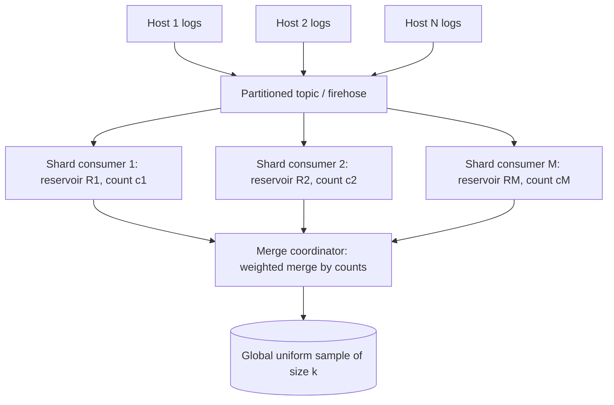
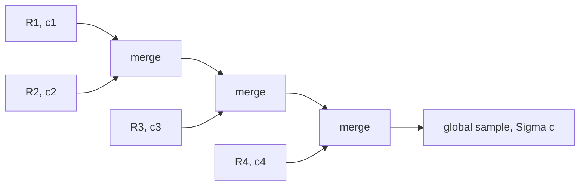
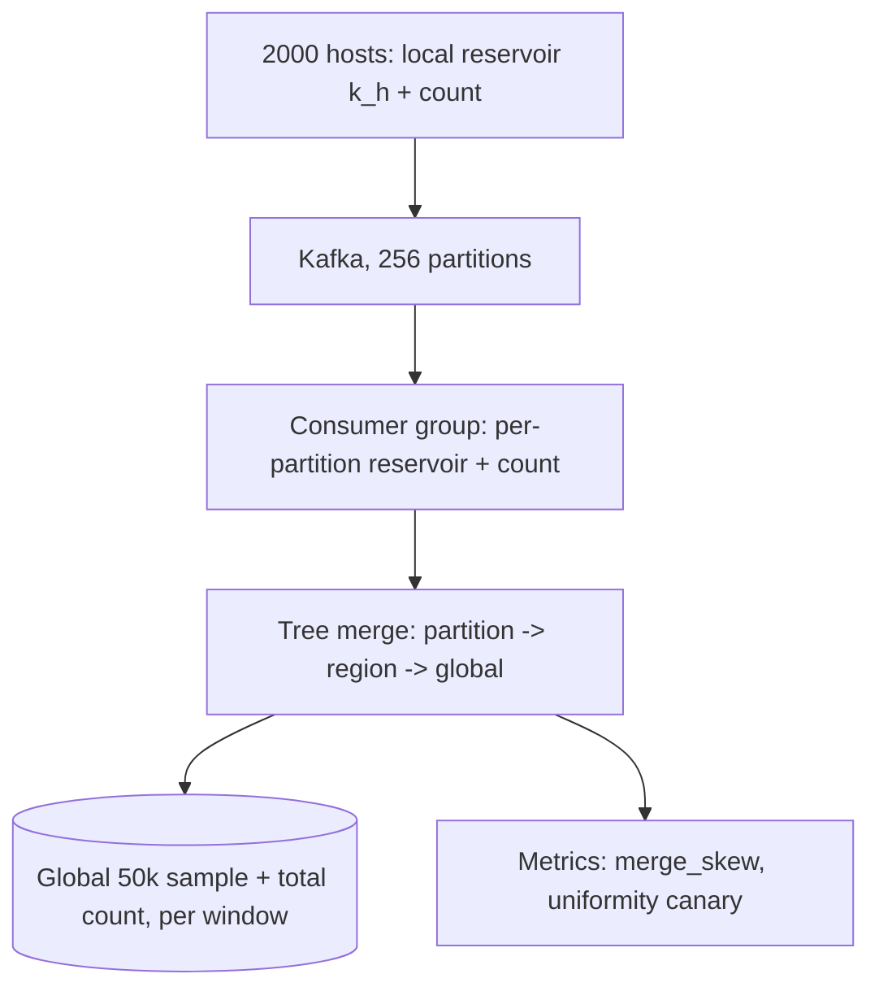
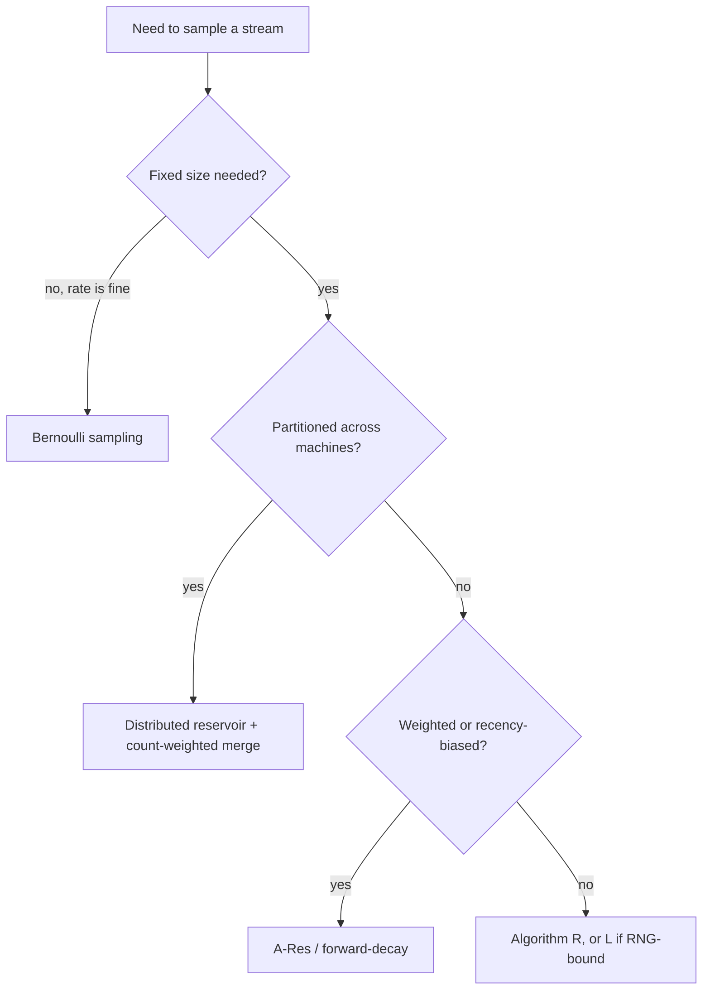

# Reservoir Sampling — Senior Level

> **One-line summary:** In real systems you rarely sample one stream on one machine. You sample **logs across a fleet**, partition a firehose over many shards, and need to **merge** per-shard reservoirs into a single uniform sample of the *whole* stream. The senior skill is knowing that you cannot just concatenate sub-samples — you must merge them **weighted by how many items each shard actually saw** (or carry the keys from a weighted scheme). This level covers distributed log/analytics sampling architectures, correct reservoir merging, throughput/memory budgets, and the sampling guarantees you can promise downstream.

---

## Table of Contents

1. [Introduction](#introduction)
2. [System Design: Distributed Log & Analytics Sampling](#system-design-distributed-log--analytics-sampling)
3. [Merging Reservoirs Correctly](#merging-reservoirs-correctly)
4. [Comparison with Alternatives](#comparison-with-alternatives)
5. [Architecture Patterns](#architecture-patterns)
6. [Code Examples](#code-examples)
7. [Sampling Guarantees You Can Promise Downstream](#sampling-guarantees-you-can-promise-downstream)
8. [Throughput, Memory & Cost](#throughput-memory--cost)
9. [Case Study: A Production Log-Sampling Pipeline](#case-study-a-production-log-sampling-pipeline)
10. [Observability](#observability)
11. [Checkpointing and Exactly-Once Concerns](#checkpointing-and-exactly-once-concerns)
12. [Failure Modes](#failure-modes)
13. [Decision Framework: Picking the Right Sampler](#decision-framework-picking-the-right-sampler)
14. [Summary](#summary)

---

## Introduction

> Focus: "How do I run reservoir sampling across a distributed system, correctly and cheaply?"

A single-process reservoir is `O(k)` memory and one pass — trivial. The senior problems appear when the stream is too big, too fast, or too spread out for one process:

- **Throughput:** a firehose emits millions of events per second; one consumer cannot keep up, so the stream is partitioned across `m` shards/consumers.
- **Locality:** logs are produced on thousands of hosts; you want a global random sample without shipping every line to one place.
- **Aggregation windows:** you sample per-minute or per-region, then need to roll those up into per-hour or global samples.

Each shard can run its own reservoir cheaply. The trap is the *merge*: a uniform sample of the whole stream is **not** the union of uniform sub-samples unless you account for **how many items each shard saw**. A shard that processed a billion events and a shard that processed ten must not contribute equally to the final `k` slots. Getting this weighting right — and the failure modes when shards die, lag, or rebalance — is the core of this level.

---

## System Design: Distributed Log & Analytics Sampling

A typical "random sample of production logs" pipeline:



Each shard consumer:

- keeps a reservoir `R_j` of size `k` (or a smaller `k_j`) and a **count `c_j`** of items it has seen;
- runs Algorithm R or L locally — `O(k)` memory, `O(1)` per event;
- periodically emits `(R_j, c_j)` to a coordinator.

The coordinator merges `{(R_j, c_j)}` into one uniform sample of all `Σ c_j` items. This is the **map (per-shard sample) → reduce (weighted merge)** pattern, and it is associative, so you can merge hierarchically (per-host → per-rack → per-region → global) — essential at fleet scale.

**Why sample logs at all?** Storing every log line is expensive and most are uninteresting. A uniform 0.1% sample preserves statistical properties (error-rate estimates, latency distributions, top-N approximations) at 1/1000th the storage, and reservoir sampling gives that sample in one pass without knowing the day's total volume in advance.

---

## Merging Reservoirs Correctly

Suppose shard A saw `c_A` items and produced reservoir `R_A` (a uniform `k`-sample of its `c_A` items), and shard B saw `c_B` with `R_B`. We want a uniform `k`-sample of all `c_A + c_B` items.

**The wrong way:** take `k/2` from each, or randomly pick `k` from `R_A ∪ R_B` uniformly. Both bias toward the *smaller* shard, because each shard's `k` items represent very different population sizes.

**The right way (count-weighted merge).** Each item in `R_A` represents a `1/c_A` "share" of shard A; each in `R_B` a `1/c_B` share of B. To build the merged reservoir, decide for each of the `k` output slots which shard it comes from in proportion to the **counts**:

```text
merge(R_A, c_A, R_B, c_B, k):
    out = empty reservoir of size k
    for slot in 1..k:
        with probability c_A / (c_A + c_B):
            take a uniformly random (unused) item from R_A
        else:
            take a uniformly random (unused) item from R_B
    return (out, c_A + c_B)
```

Sampling without replacement within each side keeps the result a clean uniform `k`-subset. A simpler, fully-uniform variant: pool the two reservoirs, but give each item from A a multiplicity weight `c_A/k` and each from B weight `c_B/k`, then run a **weighted** reservoir merge (A-Res) over the pooled `2k` items. Because reservoir merging is associative, you fold shards pairwise: `merge(merge(R1,R2), R3) …`.



**Key invariant for merging:** every emitted reservoir must travel with its **count `c_j`**. A reservoir without its count cannot be correctly merged — this is the single most common distributed reservoir-sampling bug. For *weighted* sampling, ship the **keys** (`u^(1/w)`) alongside items so the global top-`k` is just the top-`k` of all shipped keys — weighted merge becomes trivially "keep the largest keys," which is naturally associative.

---

## Comparison with Alternatives

| Attribute | Distributed reservoir (count-weighted) | Centralized single reservoir | Bernoulli (per-item p) sampling | Count-min / sketches |
|-----------|----------------------------------------|------------------------------|---------------------------------|----------------------|
| Sample size | exactly `k` (global) | exactly `k` | random (`≈ p·n`) | n/a (frequency, not sample) |
| Needs `n`/counts? | counts per shard | no | no | no |
| Parallelizable | **yes, associative merge** | no (single consumer) | yes (trivially) | yes (mergeable) |
| Memory | `O(m·k)` total, `O(k)` per shard | `O(k)` | `O(p·n)` (unbounded) | `O(1/ε)` |
| Uniform fixed-size sample? | **yes** | yes | no (variable size) | no |
| Weighted? | yes (ship keys) | yes (A-Res) | only via per-item `p` | n/a |

**Choose count-weighted distributed reservoir when:** you need an exact-size, uniform (or weighted) sample of a *partitioned* high-volume stream.
**Choose Bernoulli sampling when:** a fixed *rate* (not a fixed *count*) is acceptable and a variable, possibly large, sample is fine — it needs no coordination but no size guarantee.
**Choose sketches when:** you want frequencies/quantiles, not an item sample.

---

## Architecture Patterns

### Pattern: streaming sampler as a stateful consumer

```mermaid
sequenceDiagram
    participant Stream as Partition p
    participant Worker as Sampler worker (R_p, c_p)
    participant Coord as Merge coordinator
    participant Sink as Sample store
    Stream->>Worker: event
    Worker->>Worker: c_p++; Algorithm R/L update R_p
    Note over Worker: every flush interval
    Worker->>Coord: emit (R_p, c_p), then reset/keep
    Coord->>Coord: weighted-merge across partitions
    Coord->>Sink: write global size-k sample + total count
```

Design choices a senior makes:

- **Per-shard `k` vs global `k`:** each shard keeps a full `k` (more network, exact merge) or a smaller `k_j` (less network, slightly more variance). Keeping `k` per shard and merging down is the safe default.
- **Flush cadence:** trade freshness vs overhead — emit reservoirs every `N` seconds; merging is cheap (`O(m·k)`).
- **Tumbling vs sliding windows:** reset reservoirs per window (tumbling) or maintain decay (sliding needs time-biased / forward-decay sampling).
- **Exactly-once vs at-least-once:** double-counted events inflate `c_j` and skew the merge weight; idempotent counting (dedupe by event id) matters more than for sketches.

---

## Code Examples

### Mergeable reservoir (thread-safe shard + count-weighted merge)

#### Go

```go
package main

import (
	"fmt"
	"math/rand"
	"sync"
)

// Shard is a thread-safe reservoir that also tracks the count it has seen.
type Shard struct {
	mu        sync.Mutex
	reservoir []int
	k         int
	count     int64
}

func NewShard(k int) *Shard { return &Shard{k: k} }

func (s *Shard) Add(item int) {
	s.mu.Lock()
	defer s.mu.Unlock()
	s.count++
	if len(s.reservoir) < s.k {
		s.reservoir = append(s.reservoir, item)
		return
	}
	j := rand.Int63n(s.count) // uniform in [0, count)
	if j < int64(s.k) {
		s.reservoir[j] = item
	}
}

func (s *Shard) Snapshot() ([]int, int64) {
	s.mu.Lock()
	defer s.mu.Unlock()
	cp := make([]int, len(s.reservoir))
	copy(cp, s.reservoir)
	return cp, s.count
}

// MergeTwo builds a uniform k-sample of the combined population, weighting each
// side by the number of items it actually saw.
func MergeTwo(ra []int, ca int64, rb []int, cb int64, k int) ([]int, int64) {
	out := make([]int, 0, k)
	ai, bi := 0, 0
	rand.Shuffle(len(ra), func(i, j int) { ra[i], ra[j] = ra[j], ra[i] })
	rand.Shuffle(len(rb), func(i, j int) { rb[i], rb[j] = rb[j], rb[i] })
	for len(out) < k && (ai < len(ra) || bi < len(rb)) {
		takeA := false
		if ai < len(ra) && bi < len(rb) {
			takeA = rand.Int63n(ca+cb) < ca // probability ca/(ca+cb)
		} else {
			takeA = ai < len(ra)
		}
		if takeA {
			out = append(out, ra[ai]); ai++
		} else {
			out = append(out, rb[bi]); bi++
		}
	}
	return out, ca + cb
}

func main() {
	a := NewShard(3)
	b := NewShard(3)
	for i := 0; i < 1000; i++ { a.Add(i) }      // shard A saw 1000
	for i := 1000; i < 1010; i++ { b.Add(i) }   // shard B saw 10
	ra, ca := a.Snapshot()
	rb, cb := b.Snapshot()
	merged, total := MergeTwo(ra, ca, rb, cb, 3)
	fmt.Println(merged, "from total", total) // A items dominate, as they should
}
```

#### Java

```java
import java.util.*;

public class MergeableReservoir {
    private final int k;
    private final List<Integer> reservoir = new ArrayList<>();
    private long count = 0;
    private final Random rnd = new Random();

    public MergeableReservoir(int k) { this.k = k; }

    public synchronized void add(int item) {
        count++;
        if (reservoir.size() < k) { reservoir.add(item); return; }
        long j = Math.floorMod(rnd.nextLong(), count); // uniform [0, count)
        if (j < k) reservoir.set((int) j, item);
    }

    public synchronized int[] snapshot() {
        return reservoir.stream().mapToInt(Integer::intValue).toArray();
    }
    public synchronized long count() { return count; }

    // Count-weighted merge of two snapshots.
    static int[] merge(int[] ra, long ca, int[] rb, long cb, int k, Random rnd) {
        List<Integer> a = new ArrayList<>(); for (int x : ra) a.add(x);
        List<Integer> b = new ArrayList<>(); for (int x : rb) b.add(x);
        Collections.shuffle(a, rnd); Collections.shuffle(b, rnd);
        List<Integer> out = new ArrayList<>();
        int ai = 0, bi = 0;
        while (out.size() < k && (ai < a.size() || bi < b.size())) {
            boolean takeA;
            if (ai < a.size() && bi < b.size())
                takeA = Math.floorMod(rnd.nextLong(), ca + cb) < ca;
            else
                takeA = ai < a.size();
            if (takeA) out.add(a.get(ai++)); else out.add(b.get(bi++));
        }
        return out.stream().mapToInt(Integer::intValue).toArray();
    }

    public static void main(String[] args) {
        MergeableReservoir a = new MergeableReservoir(3), b = new MergeableReservoir(3);
        for (int i = 0; i < 1000; i++) a.add(i);
        for (int i = 1000; i < 1010; i++) b.add(i);
        System.out.println(Arrays.toString(
            merge(a.snapshot(), a.count(), b.snapshot(), b.count(), 3, new Random())));
    }
}
```

#### Python

```python
import random
import threading


class Shard:
    """Thread-safe reservoir that tracks the count it has seen (for merging)."""
    def __init__(self, k):
        self.k = k
        self.reservoir = []
        self.count = 0
        self._lock = threading.Lock()

    def add(self, item):
        with self._lock:
            self.count += 1
            if len(self.reservoir) < self.k:
                self.reservoir.append(item)
            else:
                j = random.randrange(self.count)   # uniform [0, count)
                if j < self.k:
                    self.reservoir[j] = item

    def snapshot(self):
        with self._lock:
            return list(self.reservoir), self.count


def merge(ra, ca, rb, cb, k):
    """Count-weighted merge -> uniform k-sample of the combined population."""
    a, b = list(ra), list(rb)
    random.shuffle(a); random.shuffle(b)
    out, ai, bi = [], 0, 0
    while len(out) < k and (ai < len(a) or bi < len(b)):
        if ai < len(a) and bi < len(b):
            take_a = random.randrange(ca + cb) < ca   # prob ca/(ca+cb)
        else:
            take_a = ai < len(a)
        if take_a:
            out.append(a[ai]); ai += 1
        else:
            out.append(b[bi]); bi += 1
    return out, ca + cb


if __name__ == "__main__":
    A, B = Shard(3), Shard(3)
    for i in range(1000): A.add(i)
    for i in range(1000, 1010): B.add(i)
    print(merge(*A.snapshot(), *B.snapshot(), 3))
```

**What it does:** each shard runs a thread-safe Algorithm R and tracks its count; the merge picks each output slot from a shard with probability proportional to that shard's count, yielding a uniform global sample. Fold pairwise for many shards.

---

## Sampling Guarantees You Can Promise Downstream

When a sampling service feeds dashboards, alerting, or ML training, the consumers need to know *exactly* what statistical contract they are getting. A senior states these guarantees precisely rather than hand-waving "it's random."

| Guarantee | What it means | What it does NOT mean |
|-----------|---------------|------------------------|
| **Uniform inclusion** | Each item from the global stream is in the final sample with probability `k/n`. | It does **not** mean a fixed *rate*; the rate is `k/n` and shrinks as `n` grows within a window. |
| **Fixed sample size** | The output is exactly `k` items (when `n ≥ k`). | Unlike Bernoulli sampling, you never get a surprise 10× sample on a traffic spike. |
| **Subset uniformity** | Every `k`-subset of the window is equally likely. | Not "every item independently"; reservoir sampling is *without replacement*. |
| **Weighted inclusion** (A-Res) | Inclusion probability is proportional to weight in the Efraimidis-Spirakis sense. | Not exactly `k·w_i/Σw` for all settings — it is the A-Res top-`k`-keys distribution. |
| **Window scoping** | Guarantees hold *within the defined window* (tumbling/sliding), not across windows. | A per-minute sample is not a per-hour sample; you must merge. |

The single most important thing to communicate: reservoir sampling gives a **fixed-size** sample with a **per-item probability that depends on the window's total count `n`**. Teams that expect a fixed *rate* (e.g. "always 0.1% of traffic") want **Bernoulli sampling** instead, and confusing the two is a common source of "the sample looks too small during quiet periods" tickets. Document the contract in the schema of the emitted sample (carry `n`, `k`, window bounds, and the variant).

### Time-biased and sliding-window sampling

Classic reservoir sampling treats every item in the window equally — a log line from an hour ago is as likely to be sampled as one from a second ago. Many production systems instead want **recency bias**: recent events should be over-represented because they are more operationally relevant. Two approaches:

- **Tumbling windows.** Reset the reservoir at each window boundary (e.g. every minute). Simple, exact within the window, but loses cross-boundary smoothness and double-buffers at edges.
- **Forward-decay / exponentially-weighted sampling.** Assign each item a weight that grows with its timestamp (e.g. `w = e^(λ·t)`) and run *weighted* reservoir sampling (A-Res). Recent items get larger keys and dominate the reservoir, with an exponential decay you tune via `λ`. This is the streaming analogue of an exponentially-weighted moving sample and avoids the boundary discontinuity of tumbling windows.

```mermaid
graph LR
    A[event at time t] --> B[weight w = exp of lambda times t]
    B --> C[key = u^(1/w), forward-decay]
    C --> D[size-k min-heap of keys]
    D --> E[recent items dominate the reservoir]
```

The cost is that forward-decay weights `e^(λ·t)` grow without bound, so you must periodically rebase the time origin (landmark windows) to avoid overflow — exactly the kind of operational detail that separates a textbook reservoir from a production one.

---

## Throughput, Memory & Cost

| Resource | Per shard | Global (m shards) |
|----------|-----------|-------------------|
| Memory | `O(k)` reservoir + `O(1)` count | `O(m·k)` during merge |
| Per-event CPU | `O(1)` (R) or `O(1)` amortized (L) | — |
| Network (per flush) | `O(k)` items + 1 count | `O(m·k)` to coordinator |
| Merge CPU | — | `O(m·k)` (associative, parallelizable as a tree) |

Throughput levers a senior pulls:

- **Algorithm L per shard** when per-event RNG cost shows up in flame graphs — only `~k log(c_j/k)` draws instead of `c_j`.
- **Lock-free / sharded counters** when one shard is itself multi-threaded; per-thread sub-reservoirs merged at flush avoid mutex contention (the `sync.Mutex`/`synchronized` above is fine for moderate rates, a bottleneck at millions/sec).
- **Smaller `k_j` per shard** if network is the constraint, accepting slightly higher variance.
- **Hierarchical merge** to bound coordinator load: combine in a tree so no single node merges all `m`.
- **Sample on the producer** (host-local reservoir) to cut bytes on the wire before they ever hit the pipeline.

A concrete budget: `m = 1000` shards, `k = 10_000`, 8 bytes/item → each flush ships `~80 KB`/shard, `~80 MB` total, merged in `O(10^7)` ops — sub-second, every flush interval. Memory per shard is ~80 KB regardless of whether that shard saw a thousand or a trillion events.

---

## Case Study: A Production Log-Sampling Pipeline

To make the moving parts concrete, walk through a realistic design for "keep a uniform 0.01% sample of all application logs for ad-hoc debugging," across a 2,000-host fleet emitting ~5 million log lines per second at peak.

**Requirements.**
- A *fixed-size* sample per 5-minute window (`k = 50,000` lines) so storage is predictable.
- Uniform across the whole fleet, not biased toward chatty hosts.
- Survive host restarts and partition rebalances without silently biasing the sample.
- Sub-second merge so the sample is queryable shortly after each window closes.

**Design.**



1. **Host-local pre-sampling.** Each host runs a small reservoir (say `k_h = 1,000`) over its own logs and ships only `(reservoir, count)` per window. This cuts wire bytes from millions of lines/sec to ~1,000 lines/host/window before anything hits the pipeline — the cheapest possible place to sample.
2. **Partition-level reservoirs.** Kafka consumers each keep a reservoir over their partition's incoming host-samples, weighting by the host counts so a host that logged a billion lines counts more than one that logged ten.
3. **Tree merge.** A coordinator folds partition reservoirs pairwise (partition → region → global) using the **count-weighted merge** from earlier. Because merging is associative, the tree parallelizes and no single node merges all 256 partitions.
4. **Output contract.** The window's artifact is `(50,000 sampled lines, total_count n, window_start, window_end)`. Downstream queries that need rate estimates multiply by `n / k`.

**What this buys.** Memory is `O(k)` everywhere — a host holds ~1,000 lines regardless of how much it logs, and the coordinator holds `O(partitions · k)` only transiently during the merge. The sample is uniform across the fleet because every reservoir travels with its count. And because each reservoir is valid at every prefix, a late or crashed host simply under-contributes its window rather than corrupting the result.

**The three mistakes this design specifically avoids.** (a) Concatenating host samples without counts — which would over-weight quiet hosts. (b) Sampling a fixed *rate* per host — which would blow up storage during a traffic spike. (c) Merging on wall-clock instead of event-time windows — which would mix lines from different windows. Each maps directly to a failure mode in the next section.

**A back-of-envelope budget.** Peak 5M lines/sec over a 5-minute window is `1.5×10^9` lines. Host-local pre-sampling drops the wire volume to `2000 hosts × 1000 lines = 2×10^6` lines/window — a 750× reduction before the pipeline. The merge tree folds 256 partition reservoirs of `k = 50,000` each, so the coordinator touches `256 × 50,000 ≈ 1.3×10^7` items per window, completing in well under a second on a single core. End-to-end memory anywhere in the system is bounded by `O(k)` per node plus the transient merge buffer — none of it grows with the `1.5×10^9` lines the window actually saw. That invariance to stream size is the entire reason the architecture scales.

---

## Observability

| Metric | Why | Alert threshold |
|--------|-----|-----------------|
| `items_seen_total` per shard (`c_j`) | merge weights depend on it; also volume health | sudden drop → upstream loss |
| `reservoir_fill_ratio` | should be 1.0 once `c_j ≥ k` | `< 1` long after start → shard starved |
| `merge_skew` = max `c_j` / median `c_j` | hot partition detection | `> 10×` → rebalance keys |
| `sample_inclusion_uniformity` (canary keys) | catches biased merges | KS-test p-value `< 0.01` |
| `flush_lag` | stale reservoirs skew freshness | `> 2× interval` |
| `rng_calls_per_event` | confirms Algorithm L is actually skipping | `≈ 1.0` means L is misconfigured |

A useful validation harness: inject known canary items at a controlled rate and verify their long-run inclusion frequency matches `k/n` (or the weighted target). A drift here is the earliest signal of a merge-weight or RNG bug.

Treat the canary as a continuous integration test for the *running system*, not just for the code: emit synthetic events tagged with a known per-window expected inclusion probability, then assert (with a chi-square or Kolmogorov-Smirnov test over a rolling window) that observed inclusion matches expectation. Because biased merges and seed collisions produce a slow, statistically-detectable drift long before they produce visibly wrong dashboards, this canary is often the only alert that fires *before* a stakeholder notices the numbers look off.

---

## Checkpointing and Exactly-Once Concerns

A reservoir is in-memory state, and in a long-running stream processor that state must survive restarts or you silently lose a shard's contribution to the merge. The standard pattern is to **checkpoint the reservoir together with its count and the stream offset** it has consumed up to.

```text
checkpoint = {
    reservoir: [...k items...],
    count:     c_j,            # MUST be persisted with the reservoir
    offset:    last_consumed,  # stream/partition offset
    rng_state: ...             # optional, for reproducibility
}
```

On recovery, the worker reloads the checkpoint and resumes consuming from `offset`. The two subtle correctness traps:

- **Count/offset consistency.** The persisted `count` must correspond exactly to the persisted `offset`. If you checkpoint the reservoir but recompute the count from a stale offset, the merge weight is wrong. Persist them atomically.
- **At-least-once replay.** Most stream processors guarantee *at-least-once*, so after a crash some items between the last checkpoint and the failure are replayed. For a *counting* reservoir, replays inflate `c_j` and over-weight the shard. Either checkpoint frequently enough that replay windows are tiny, dedupe by event id, or accept a bounded, measured skew. Unlike a sketch (which is often idempotent under merge), a counting reservoir is sensitive to double-counting, so this needs an explicit decision.

For windowed pipelines, the cleanest approach is to align checkpoints with window boundaries: at each tumbling-window close, emit and persist `(reservoir, count)`, then reset. A crash mid-window then loses at most one window's partial sample rather than corrupting a long-lived reservoir — usually an acceptable trade for ad-hoc sampling, and far simpler than per-event exactly-once.

---

## Failure Modes

- **Merging without counts** — the #1 bug: concatenating per-shard reservoirs biases toward small shards. Always carry `c_j` (or keys for weighted).
- **Hot partition** — one shard sees most traffic; its reservoir dominates correctly, but its single-thread sampler may be the throughput bottleneck. Sub-shard it.
- **Shard restart / state loss** — a crashed sampler loses its in-memory reservoir and count; the merge then under-weights that shard. Mitigate with periodic checkpointing or accept the window's loss.
- **Double counting (at-least-once delivery)** — replays inflate `c_j` and over-weight that shard. Dedupe by event id, or accept bounded skew.
- **Window misalignment** — shards flushing on different clocks merge mismatched windows. Use event-time windows and watermarks, not wall-clock.
- **Rebalancing** — partition reassignment mid-window splits a logical stream across two reservoirs; ensure counts move with the partition or reset cleanly at window boundaries.
- **RNG correlation across shards** — seeding every shard identically makes their "random" choices correlated, subtly biasing the merge. Seed per-shard from distinct entropy.
- **Silent reservoir-never-filled** — if `k` is set larger than a shard ever sees (`c_j < k`), that shard contributes fewer than `k` items, and a naive merge that assumes full reservoirs miscounts. Always size the merge by actual reservoir length, not `k`.
- **Lost counts on the wire** — a serialization that ships the reservoir items but drops the `count` field (e.g. a schema change) reintroduces the #1 bug invisibly. Make `count` a required field and assert it on receipt.

---

## Decision Framework: Picking the Right Sampler

When a team asks "how should we sample this stream?", the senior answer is a small decision tree, not a reflex. The questions, in order:

1. **Fixed count or fixed rate?** If downstream needs an exact-size artifact (storage budgets, fixed-size training batches), use a reservoir. If a fixed *fraction* is fine and a variable, possibly large, sample is acceptable, use **Bernoulli sampling** (keep each item with probability `p`) — it needs no coordination at all.
2. **Is the stream partitioned across machines?** If yes, you need the **count-weighted distributed merge**; a single reservoir is impossible above one consumer's throughput. If no, a single in-process reservoir is the whole solution.
3. **Equal items or weighted?** Equal → Algorithm R/L. Weighted (priority, recency, business value) → **A-Res** with `u^(1/w)` keys (log-space for stability).
4. **Recency matters?** If recent items should dominate, use **forward-decay weighted** sampling or **tumbling windows**; otherwise plain uniform.
5. **Is RNG cost showing up in profiles?** Only then reach for **Algorithm L**; for moderate `n` Algorithm R's simplicity wins.
6. **Do you actually want a sample, or a statistic?** If the real question is "how many distinct?", "top-`k` frequent?", or "p99 latency?", a **sketch** (HyperLogLog, Count-Min, t-digest) is far cheaper than sampling. Reservoir sampling is for when you need *the actual items*.



The cross-cutting senior judgment: do not over-engineer. Most teams reach for Algorithm L and distributed merges before they have profiled anything; a single-process Algorithm R on a pre-sampled, host-local feed solves the majority of real "sample our logs" requests at a fraction of the operational complexity.

A final tie-breaker worth internalizing: prefer the design whose *failure mode* is "slightly higher variance" over one whose failure mode is "silently biased." A smaller per-shard `k_j`, an occasional dropped window, or an extra merge level all only widen the confidence interval; a lost count or a fixed-rate-where-fixed-size-was-needed quietly produces wrong answers. Variance is honest and shrinks with more data; bias is dishonest and does not. When in doubt, choose the honest failure.

---

## Summary

At the senior level, reservoir sampling stops being a one-liner and becomes a **distributed map-reduce**: each shard runs a cheap `O(k)` local reservoir (Algorithm R or L) and tracks the **count** it saw; a coordinator performs a **count-weighted merge** — never a plain concatenation — to produce a uniform (or weighted, via shipped keys) global sample of exact size `k`. Merging is associative, so it scales hierarchically across hosts, racks, and regions. The architecture's correctness hinges on one discipline — every reservoir travels with its count (or keys) — and its reliability on watching for hot partitions, lost shard state, double counting, and misaligned windows. Memory stays `O(k)` per shard no matter how large the stream grows, which is exactly why this technique underpins production log sampling and streaming analytics.

The senior mindset, distilled: reservoir sampling is the *mechanism*, but the engineering is in the contract and the operations. Promise consumers a precise guarantee (fixed-size, uniform `k/n` per window, or weighted), carry the count (or keys) with every reservoir so merges stay correct, checkpoint state so restarts do not silently bias the sample, and watch the canary uniformity metric so a regression surfaces as an alert rather than as wrong numbers on a dashboard. Reach for Algorithm L, distributed merges, and forward-decay only when a profile or requirement demands them — most "sample our stream" asks are solved by a small host-local reservoir feeding a simple count-weighted merge.

---

Next step: [professional.md](./professional.md)
