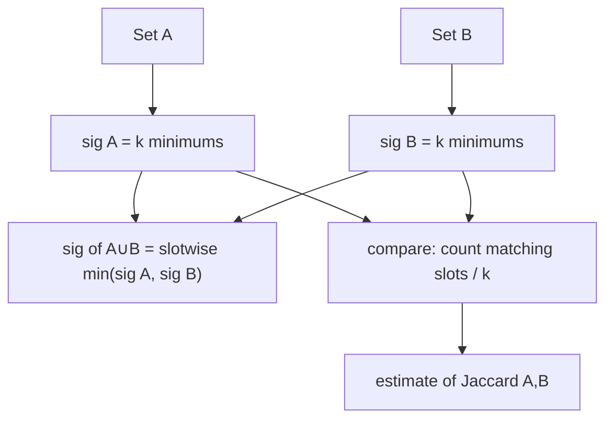

# MinHash — Junior Level

> **One-line summary:** To estimate how similar two **sets** are without comparing them element by element, give every set a tiny "fingerprint": for each of `k` random hash functions, keep only the **smallest hash value** of the set's elements. The fraction of the `k` slots where two fingerprints **agree** is an estimate of the **Jaccard similarity** `|A∩B| / |A∪B|` — because a single random minimum collides with probability *exactly* the Jaccard.

---

## Table of Contents

1. [Introduction](#introduction)
2. [Prerequisites](#prerequisites)
3. [Glossary](#glossary)
4. [Core Concepts](#core-concepts)
5. [Big-O Summary](#big-o-summary)
6. [Real-World Analogies](#real-world-analogies)
7. [Pros & Cons](#pros--cons)
8. [Step-by-Step Walkthrough](#step-by-step-walkthrough)
9. [Code Examples](#code-examples)
10. [Coding Patterns](#coding-patterns)
11. [Error Handling](#error-handling)
12. [Performance Tips](#performance-tips)
13. [Best Practices](#best-practices)
14. [Edge Cases & Pitfalls](#edge-cases--pitfalls)
15. [Common Mistakes](#common-mistakes)
16. [Cheat Sheet](#cheat-sheet)
17. [Visual Animation](#visual-animation)
18. [Summary](#summary)
19. [Further Reading](#further-reading)

---

## Introduction

Imagine you run a search engine and you have crawled a billion web pages. Many of them are **near-duplicates** — the same article copied across mirror sites, a product page repeated with tiny edits, or a blog post scraped by spammers. You want to find these duplicates so you do not show the user the same thing ten times. How do you measure "how similar are these two documents"?

A natural way is to turn each document into a **set** of features — for example the set of distinct words, or the set of overlapping word-triples ("shingles") — and then ask: *what fraction of features do the two sets share?* That fraction is the **Jaccard similarity**:

```
Jaccard(A, B) = |A ∩ B| / |A ∪ B|
```

If `A` and `B` are identical sets, Jaccard is `1`. If they share nothing, it is `0`. A pair sharing most of their words might be `0.9`.

The problem: computing `|A ∩ B|` exactly means storing every element of every set and intersecting them. With a billion documents each holding thousands of shingles, that is far too much memory, and comparing every pair of documents is `O(N²)` set intersections — utterly hopeless at scale.

**MinHash** is the trick that makes this cheap. Instead of keeping the whole set, you keep a tiny fixed-size **signature** — say 128 numbers — for each set. The signatures are built so that the chance two signatures agree in a given slot is *exactly* the Jaccard similarity of the original sets. So you can estimate Jaccard by comparing two short signatures instead of two giant sets. The signature is small, fixed-size, and (crucially) lets you reuse it for *every* future comparison.

The single idea at the heart of everything is this:

> **If you hash every element of a set and keep the minimum hash, then for two sets `A` and `B`, the probability that `min-hash(A) == min-hash(B)` equals `Jaccard(A, B)`.**

This file builds that idea from scratch, shows a tiny worked example by hand, and gives you a working MinHash in Go, Java, and Python.

---

## Prerequisites

Before reading this file you should be comfortable with:

- **Sets** — collections of distinct elements; what union (`A ∪ B`) and intersection (`A ∩ B`) mean.
- **Hash functions** — a function that maps any input (a string, a number) to a fixed-range integer in a "random-looking" way; equal inputs always give equal outputs.
- **Basic probability** — what "probability `p`" means, and that the *average* of many independent estimates gets closer to the true value.
- **Arrays / loops** — iterating over a set and keeping a running minimum.
- **Big-O notation** — `O(n)`, `O(k)`, and what "size of a set" means.

Optional but helpful:

- A peek at **near-duplicate detection** (why exact comparison is too slow).
- The sibling topic [`../10-locality-sensitive-hashing`](../10-locality-sensitive-hashing) — MinHash signatures plug directly into LSH for searching at scale.

---

## Glossary

| Term | Meaning |
|------|---------|
| **Set** | An unordered collection of distinct elements (e.g. the distinct words of a document). |
| **Shingle (k-gram)** | A contiguous group of `k` tokens; documents are turned into the *set of their shingles*. |
| **Jaccard similarity** | `J(A,B) = |A∩B| / |A∪B|`, a number in `[0,1]` measuring set overlap. |
| **Hash function** | A deterministic map from elements to integers that "scrambles" the input. |
| **MinHash** | For one hash function `h`, the value `min over x in A of h(x)` — the smallest hash in the set. |
| **Signature** | The vector of `k` MinHash values (one per hash function) representing a set. |
| **Signature agreement** | The fraction of the `k` slots where two signatures hold the same value. |
| **Estimator** | A computed value (signature agreement) used to *approximate* a true value (Jaccard). |
| **Permutation** | A reordering of the universe of elements; classic MinHash uses a random permutation, but a random hash function imitates one. |
| **Collision** | Two sets having the *same* MinHash value for a given hash function. |

---

## Core Concepts

### 1. Documents become sets of shingles

To compare text with set math, first turn each document into a **set**. A common recipe is **shingling**: slide a window of `k` words (say `k=3`) across the text and collect every distinct triple. The document *"the cat sat on the mat"* with `k=3` becomes:

```
{ "the cat sat", "cat sat on", "sat on the", "on the mat" }
```

Two documents that share most of their text will share most of their shingles, so their Jaccard similarity will be high. From here on we only talk about **sets**; how you built the set (words, shingles, user IDs, product IDs) does not change the algorithm.

### 2. Jaccard similarity is the target

`Jaccard(A,B) = |A∩B| / |A∪B|` is what we *want*. Computing it exactly requires both full sets. MinHash will **estimate** it from tiny signatures. Two facts to keep in mind: Jaccard ignores how many times an element appears (sets, not multisets), and it ranges from `0` (disjoint) to `1` (identical).

### 3. The MinHash of a set

Pick one hash function `h` that maps each element to an integer. Apply it to every element of the set and keep only the **minimum**:

```
minhash_h(A) = min{ h(x) : x in A }
```

That single number is a "summary" of the set under hash `h`. Different sets usually get different minimums; **similar** sets often get the *same* minimum, and that is exactly the property we exploit.

### 4. The magic property: P(collision) = Jaccard

Here is the whole reason MinHash works. Think of `h` as assigning every element of the combined universe `A ∪ B` a random rank. The element with the **smallest** hash in `A ∪ B` is equally likely to be *any* of the `|A∪B|` elements (the hash is random). MinHash of `A` equals MinHash of `B` **exactly when** that overall-smallest element happens to lie in the **intersection** `A ∩ B` — because then it is the minimum for *both* sets. The chance of that is:

```
P[ minhash_h(A) == minhash_h(B) ] = |A∩B| / |A∪B| = Jaccard(A, B)
```

So *one* MinHash slot is a coin flip that comes up "match" with probability equal to the Jaccard. (The full proof is in [`professional.md`](./professional.md).)

### 5. From one coin flip to a good estimate: k hashes

One coin flip tells you almost nothing — it is either `0` or `1`. So we use `k` **independent** hash functions, producing a length-`k` signature. Comparing two signatures slot by slot gives `k` coin flips. The **fraction that match** is our estimate:

```
estimate of Jaccard = (number of matching slots) / k
```

By the law of large numbers, more slots means a tighter estimate. The typical error shrinks like `O(1/√k)`: `k=100` gives error around `±0.05`, `k=400` gives around `±0.025`. (Why `1/√k`? See [`middle.md`](./middle.md) and [`professional.md`](./professional.md).)

### 6. Signatures, not sets, are stored

Once you have computed a `k`-number signature for each set, you **throw the sets away**. To compare any two sets later, you only compare their two signatures — `O(k)` work, fixed-size memory, no matter how big the original sets were. This is the engineering win: a 10,000-element set is summarized by, say, 128 integers.

---

## Big-O Summary

Let `n = |A|` be the set size and `k` the number of hash functions (signature length).

| Operation | Time | Space | Notes |
|-----------|------|-------|-------|
| Exact Jaccard of two sets | O(\|A\| + \|B\|) | O(\|A\| + \|B\|) | Must store/scan both sets. |
| Build a MinHash signature | **O(n · k)** | O(k) | Hash each of `n` elements with `k` functions, keep `k` minimums. |
| Compare two signatures | **O(k)** | O(1) | Count matching slots; independent of set size! |
| Estimate Jaccard for all pairs | O(N · n · k) build + O(N² · k) compare | O(N · k) | Still `N²` to compare *all* pairs — fix with LSH. |
| Estimation error | — | — | About **O(1/√k)** standard error. |

The headline: building a signature costs `O(n·k)` once, but **every comparison afterward is `O(k)`**, regardless of how large the sets were. Comparing all pairs is still quadratic in the number of sets `N`; that final bottleneck is removed by combining MinHash with **LSH banding** (see [`senior.md`](./senior.md) and [`../10-locality-sensitive-hashing`](../10-locality-sensitive-hashing)).

---

## Real-World Analogies

| Concept | Analogy |
|---------|---------|
| A set of shingles | A bag of distinctive ingredients in a recipe. Two recipes are "similar" if they share ingredients. |
| Jaccard similarity | The fraction of ingredients two recipes share out of all ingredients either one uses. |
| One MinHash | "Of all our combined ingredients, which one is alphabetically first?" — a single quick question. |
| P(collision) = Jaccard | If the alphabetically-first combined ingredient happens to be in *both* recipes, both answer the same. The more they overlap, the likelier that is. |
| k hashes | Asking the same kind of question `k` different ways (first alphabetically, first by a scrambled order, etc.) and counting how often the answers agree. |
| Signature | A short "fingerprint card" summarizing a recipe, so you can compare cards instead of re-reading recipes. |

Where the analogy breaks: real ingredient lists are short, but MinHash shines precisely when the sets are *huge* and you have *millions* of them. Also, "alphabetically first" is not random enough — a real hash scrambles the order so every element is equally likely to be the minimum.

---

## Pros & Cons

| Pros | Cons |
|------|------|
| Tiny fixed-size signature (`k` numbers) summarizes a set of any size. | Only an *estimate* of Jaccard, with error around `±O(1/√k)`. |
| Comparing two sets becomes `O(k)`, independent of set size. | Building each signature costs `O(n·k)` — `k` hashes over every element. |
| Signatures are computed **once** and reused for every future comparison. | Measures **Jaccard** (set overlap) only — not cosine, not edit distance. |
| Plugs directly into **LSH** to avoid all-pairs comparison at scale. | Sensitive to *how you build the set* (shingle size, tokenization). |
| Easy to parallelize and to merge across machines (min is associative). | `k` independent hashes can be slow; needs fast hashing or one-permutation tricks. |

**When to use:** estimating set similarity at scale — near-duplicate document detection, plagiarism checking, clustering similar items, recommendation ("users who liked similar sets"), deduplicating crawl data.

**When NOT to use:** when sets are small enough to compare exactly; when you need a *different* similarity (cosine → use SimHash/random projections; edit distance → use string algorithms); when you need the exact Jaccard with zero error.

---

## Step-by-Step Walkthrough

Let us estimate the Jaccard of two small sets *by hand*.

```
A = {1, 2, 3, 4}
B = {2, 3, 5}
```

First the **true** Jaccard, so we know the answer:

```
A ∩ B = {2, 3}        |A ∩ B| = 2
A ∪ B = {1,2,3,4,5}   |A ∪ B| = 5
Jaccard(A, B) = 2 / 5 = 0.4
```

Now MinHash. We use `k = 4` simple hash functions of the form `h(x) = (a·x + b) mod 7` (the modulus 7 is bigger than our values; real code uses 64-bit hashes). We compute each function on every element and keep the minimum.

**Hash 1: `h(x) = (1·x + 0) mod 7` = x mod 7.**

```
A: h(1)=1, h(2)=2, h(3)=3, h(4)=4  -> min = 1
B: h(2)=2, h(3)=3, h(5)=5          -> min = 2
slot 1: 1 vs 2  -> NO MATCH
```

**Hash 2: `h(x) = (3·x + 1) mod 7`.**

```
A: 3·1+1=4, 3·2+1=0, 3·3+1=3, 3·4+1=6  -> values {4,0,3,6} -> min = 0
B: 3·2+1=0, 3·3+1=3, 3·5+1=2           -> values {0,3,2} -> min = 0
slot 2: 0 vs 0  -> MATCH
```

**Hash 3: `h(x) = (2·x + 5) mod 7`.**

```
A: 2·1+5=0, 2·2+5=2, 2·3+5=4, 2·4+5=6  -> {0,2,4,6} -> min = 0
B: 2·2+5=2, 2·3+5=4, 2·5+5=1           -> {2,4,1} -> min = 1
slot 3: 0 vs 1  -> NO MATCH
```

**Hash 4: `h(x) = (5·x + 2) mod 7`.**

```
A: 5·1+2=0, 5·2+2=5, 5·3+2=3, 5·4+2=1  -> {0,5,3,1} -> min = 0
B: 5·2+2=5, 5·3+2=3, 5·5+2=6           -> {5,3,6} -> min = 3
slot 4: 0 vs 3  -> NO MATCH
```

**Signatures and estimate:**

```
sig(A) = [1, 0, 0, 0]
sig(B) = [2, 0, 1, 3]
matching slots = 1 (only slot 2)
estimate = 1 / 4 = 0.25
```

The true Jaccard is `0.4`; our estimate from only 4 hashes is `0.25`. With just 4 hashes the estimate is noisy — that is expected. Use `k = 100` or `k = 400` real hash functions and the estimate closes in on `0.4` with high confidence. The takeaway: **each slot is an independent coin that matches with probability `0.4`; averaging more coins gives a better estimate.**

---

## Code Examples

### Example: Build MinHash signatures and estimate Jaccard

We use the practical **k-hash** scheme: `k` hash functions of the form `h_i(x) = (a_i · x + b_i) mod p`, where `p` is a large prime and `a_i, b_i` are random. The signature's `i`-th slot is the minimum of `h_i` over the set.

#### Go

```go
package main

import "fmt"

const prime uint64 = 4294967311 // a prime > 2^32

// MinHasher holds k random (a, b) pairs defining k hash functions.
type MinHasher struct {
	a, b []uint64
	k    int
}

func NewMinHasher(k int, seed uint64) *MinHasher {
	mh := &MinHasher{k: k, a: make([]uint64, k), b: make([]uint64, k)}
	r := seed | 1
	next := func() uint64 { // tiny deterministic PRNG (xorshift-ish)
		r ^= r << 13
		r ^= r >> 7
		r ^= r << 17
		return r
	}
	for i := 0; i < k; i++ {
		mh.a[i] = next()%(prime-1) + 1 // a != 0
		mh.b[i] = next() % prime
	}
	return mh
}

// Signature returns the length-k MinHash signature of a set of element-hashes.
func (mh *MinHasher) Signature(elements []uint64) []uint64 {
	sig := make([]uint64, mh.k)
	for i := range sig {
		sig[i] = ^uint64(0) // +infinity
	}
	for _, x := range elements {
		for i := 0; i < mh.k; i++ {
			hv := (mh.a[i]*x + mh.b[i]) % prime
			if hv < sig[i] {
				sig[i] = hv
			}
		}
	}
	return sig
}

// EstimateJaccard counts matching slots between two signatures.
func EstimateJaccard(s1, s2 []uint64) float64 {
	match := 0
	for i := range s1 {
		if s1[i] == s2[i] {
			match++
		}
	}
	return float64(match) / float64(len(s1))
}

func main() {
	mh := NewMinHasher(256, 12345)
	A := []uint64{1, 2, 3, 4}
	B := []uint64{2, 3, 5}
	sigA := mh.Signature(A)
	sigB := mh.Signature(B)
	fmt.Printf("estimate=%.3f true=%.3f\n", EstimateJaccard(sigA, sigB), 2.0/5.0)
}
```

#### Java

```java
import java.util.*;

public class MinHash {
    static final long PRIME = 4294967311L; // prime > 2^32
    final long[] a, b;
    final int k;

    MinHash(int k, long seed) {
        this.k = k;
        this.a = new long[k];
        this.b = new long[k];
        long r = seed | 1;
        for (int i = 0; i < k; i++) {
            r ^= r << 13; r ^= r >>> 7; r ^= r << 17;
            a[i] = Math.floorMod(r, PRIME - 1) + 1;
            r ^= r << 13; r ^= r >>> 7; r ^= r << 17;
            b[i] = Math.floorMod(r, PRIME);
        }
    }

    long[] signature(long[] elements) {
        long[] sig = new long[k];
        Arrays.fill(sig, Long.MAX_VALUE);
        for (long x : elements) {
            for (int i = 0; i < k; i++) {
                long hv = Math.floorMod(a[i] * x + b[i], PRIME);
                if (hv < sig[i]) sig[i] = hv;
            }
        }
        return sig;
    }

    static double estimateJaccard(long[] s1, long[] s2) {
        int match = 0;
        for (int i = 0; i < s1.length; i++) if (s1[i] == s2[i]) match++;
        return (double) match / s1.length;
    }

    public static void main(String[] args) {
        MinHash mh = new MinHash(256, 12345);
        long[] A = {1, 2, 3, 4};
        long[] B = {2, 3, 5};
        long[] sigA = mh.signature(A);
        long[] sigB = mh.signature(B);
        System.out.printf("estimate=%.3f true=%.3f%n",
                estimateJaccard(sigA, sigB), 2.0 / 5.0);
    }
}
```

#### Python

```python
import random

PRIME = 4294967311  # prime > 2^32


class MinHash:
    def __init__(self, k, seed=12345):
        self.k = k
        rng = random.Random(seed)
        self.a = [rng.randrange(1, PRIME) for _ in range(k)]
        self.b = [rng.randrange(0, PRIME) for _ in range(k)]

    def signature(self, elements):
        sig = [float("inf")] * self.k
        for x in elements:
            for i in range(self.k):
                hv = (self.a[i] * x + self.b[i]) % PRIME
                if hv < sig[i]:
                    sig[i] = hv
        return sig


def estimate_jaccard(s1, s2):
    match = sum(1 for u, v in zip(s1, s2) if u == v)
    return match / len(s1)


if __name__ == "__main__":
    mh = MinHash(256)
    A = [1, 2, 3, 4]
    B = [2, 3, 5]
    sig_a = mh.signature(A)
    sig_b = mh.signature(B)
    print(f"estimate={estimate_jaccard(sig_a, sig_b):.3f} true={2/5:.3f}")
```

**What it does:** builds a 256-slot signature for each set using `k` random hash functions, then estimates Jaccard as the fraction of agreeing slots. With `k=256` the estimate lands near the true `0.4`.
**Run:** `go run main.go` | `javac MinHash.java && java MinHash` | `python minhash.py`

---

## Coding Patterns

### Pattern 1: Exact Jaccard oracle (test against this)

**Intent:** Before trusting MinHash, compare it to the slow, obviously-correct exact Jaccard on small sets.

```python
def exact_jaccard(A, B):
    sa, sb = set(A), set(B)
    if not sa and not sb:
        return 1.0
    return len(sa & sb) / len(sa | sb)
# Estimate should approach this as k grows.
```

### Pattern 2: Shingling text into a set

**Intent:** Turn a document into the set of feature-hashes MinHash consumes.

```python
def shingles(text, k=3):
    words = text.split()
    grams = {" ".join(words[i:i+k]) for i in range(len(words) - k + 1)}
    return {hash(g) & 0xFFFFFFFF for g in grams}  # hash each shingle to an int
```

### Pattern 3: Merging signatures (associativity of min)

**Intent:** The MinHash of `A ∪ B` is the slot-wise min of `sig(A)` and `sig(B)` — so signatures combine cheaply and in any order.



---

## Error Handling

| Error | Cause | Fix |
|-------|-------|-----|
| Estimate always `1.0` | Both signatures filled with the "infinity" sentinel (empty sets). | Special-case empty sets; define Jaccard of two empty sets as `1` (or skip). |
| Estimate wildly off | Too few hashes `k`, or hashes not independent (same `a,b`). | Increase `k`; ensure each `(a_i, b_i)` is distinct and random. |
| Overflow in `a*x + b` | 64-bit multiply wraps before `mod`. | Use a 128-bit intermediate, or keep `a, x, p` small enough; reduce `x %= p` first. |
| All slots match for unrelated sets | Hash range too small → frequent collisions. | Use a large prime `p` and 64-bit hashes; never `mod 7` in production. |
| Different `k` between signatures | Comparing signatures of mismatched length. | Compare only signatures built by the *same* MinHasher (same `k`, same `a,b`). |
| Element identity bug | Same logical element hashed to different ints in `A` vs `B`. | Hash elements *canonically* (same string → same int everywhere). |

---

## Performance Tips

- **Choose `k` for your accuracy target:** error ≈ `1/√k`. Need `±0.05`? Use `k ≈ 400`. Need `±0.025`? Use `k ≈ 1600`. Do not pay for more slots than you need.
- **Hash each element once**, then derive `k` values cheaply (affine `a_i·x + b_i`) instead of running `k` heavyweight hash functions.
- **Reduce `x %= p` once** before the inner loop so the multiply stays in range.
- **Store signatures as fixed-width integers** (e.g. `uint32`) when the hash range fits — half the memory of `uint64`.
- **Build signatures once, compare many times** — never rebuild a signature to answer a new comparison.
- For *huge* element counts, consider **bottom-k** or **one-permutation MinHash** (covered in [`middle.md`](./middle.md)) to avoid the `n·k` cost.

---

## Best Practices

- Always validate against the **exact Jaccard** on small sets before trusting MinHash at scale.
- Use a **large prime modulus** and well-mixed hash constants; tiny moduli cause spurious collisions.
- Keep the **same `k` and the same hash family** for every signature you will ever compare.
- Hash elements **canonically** — the identical shingle must map to the identical integer in every document.
- Document the **expected error** (`≈ 1/√k`) next to your `k` so future readers know the precision.
- Treat the **empty set** explicitly; it has no minimum and breaks the collision argument.

---

## Edge Cases & Pitfalls

- **Empty set** — no element to take a minimum over; the signature stays "infinity." Decide a convention up front.
- **One set empty, the other not** — true Jaccard is `0`; make sure your estimate returns `0`, not `1`.
- **Identical sets** — every slot matches, estimate `1.0` (correct).
- **Tiny sets (1–2 elements)** — Jaccard is coarse (only a few possible values); MinHash error is relatively large.
- **Huge sets with small `k`** — signature builds fast to compare but the estimate is noisy; raise `k`.
- **Hash collisions in a small range** — unrelated elements share a hash, inflating apparent similarity; use 64-bit hashes.
- **Non-canonical elements** — "Cat" vs "cat" treated as different shingles silently lowers similarity.

---

## Common Mistakes

1. **Using too few hashes** and trusting a noisy estimate — `k=4` is for hand examples, not production.
2. **Reusing the same `(a, b)`** across slots — the `k` estimates become identical, not independent, so averaging does nothing.
3. **A tiny modulus** (like `mod 7`) — frequent collisions make everything look similar.
4. **Forgetting to canonicalize elements** — case, whitespace, or encoding differences split shingles apart.
5. **Comparing signatures of different lengths or different hash families** — meaningless agreement counts.
6. **Mishandling empty sets** — returning `1.0` for "both empty" but forgetting "one empty" should be `0`.
7. **Confusing Jaccard with cosine/overlap** — MinHash estimates Jaccard specifically; another metric needs a different sketch (e.g. SimHash for cosine).

---

## Cheat Sheet

| Question | Tool | Key idea |
|----------|------|----------|
| How similar are two sets? | Jaccard `|A∩B|/|A∪B|` | the target metric |
| Estimate it cheaply? | MinHash signature | `k` minimums, compare slot-wise |
| Why does it work? | P(collision)=Jaccard | smallest combined element lies in `A∩B` |
| How accurate? | error ≈ `1/√k` | more hashes → tighter estimate |
| Compare cost? | `O(k)` | independent of set size |
| Build cost? | `O(n·k)` | hash `n` elements with `k` functions |
| Scale to many sets? | + LSH banding | see `../10-locality-sensitive-hashing` |

Core algorithm:

```
buildSignature(set, k hash functions h_1..h_k):
    sig[i] = +infinity for all i
    for each element x in set:
        for i in 1..k:
            sig[i] = min(sig[i], h_i(x))
    return sig

estimateJaccard(sigA, sigB):
    return (count of i where sigA[i] == sigB[i]) / k
# build: O(n·k);  compare: O(k);  error ≈ 1/√k
```

---

## Visual Animation

> See [`animation.html`](./animation.html) for an interactive visualization.
>
> The animation demonstrates:
> - Two editable sets `A` and `B` shown as colored chips
> - Applying each of `k` hash functions to every element
> - Taking the per-hash **minimum** to fill each signature slot
> - Highlighting slots where the two signatures **agree** (collisions)
> - The running **estimate** (matching slots / k) converging toward the true Jaccard
> - Step / Run / Reset controls and a live Big-O table

---

## Summary

MinHash answers "how similar are these two sets?" without storing or comparing the sets directly. You turn each set into a tiny **signature** of `k` numbers, where slot `i` is the **minimum** of hash function `h_i` over the set. The one fact that makes it all work: **a single random MinHash of `A` and `B` collides with probability exactly `Jaccard(A,B)`**, because the smallest element of `A∪B` is equally likely to be anywhere, and a match happens precisely when it falls in `A∩B`. Averaging `k` such coin flips gives an estimate with error about `1/√k`. Signatures are computed once, are fixed-size, and compare in `O(k)` regardless of set size — and they plug straight into **LSH** (see [`../10-locality-sensitive-hashing`](../10-locality-sensitive-hashing)) to find near-duplicates among millions of sets without comparing every pair.

---

## Further Reading

- *Mining of Massive Datasets* (Leskovec, Rajaraman, Ullman) — Chapter 3, "Finding Similar Items" (shingling, MinHash, LSH).
- Broder, A. (1997) — "On the resemblance and containment of documents" (the original MinHash idea).
- Sibling topic [`../10-locality-sensitive-hashing`](../10-locality-sensitive-hashing) — turning signatures into a sublinear near-duplicate search.
- Sibling topic [`../01-reservoir-sampling`](../01-reservoir-sampling) — another small-memory randomized sketch.
- cp-algorithms.com / Wikipedia — "MinHash" and "Jaccard index" for concise references.
- Go: `hash/fnv`, `hash/maphash`; Java: `java.util.Random`, `MessageDigest`; Python: `datasketch` library (production MinHash + LSH).

---

Next step: [`middle.md`](./middle.md) — why the estimator is unbiased, the `1/√k` error, and k-hash vs bottom-k vs one-permutation MinHash.
