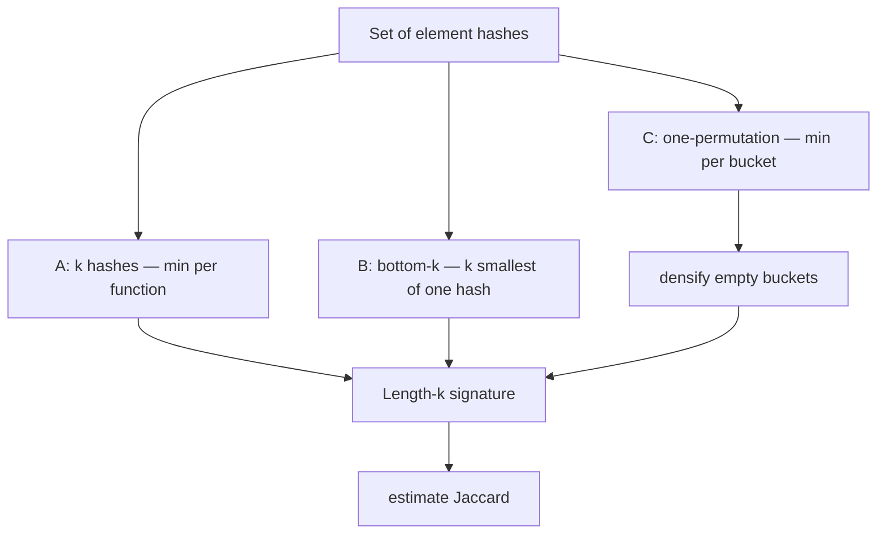
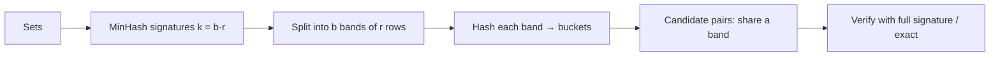

# MinHash — Middle Level

> **Focus:** *Why* MinHash works as an estimator and *when* to choose each variant. The signature-agreement count is an **unbiased estimator** of Jaccard with variance `J(1−J)/k`, so its standard error is `O(1/√k)`. We compare the three practical schemes — **k independent hashes**, **bottom-k (k-minimum-values)**, and **one-permutation MinHash** — on accuracy, build cost, and signature size, and connect signatures to LSH banding for near-duplicate search.

---

## Table of Contents

1. [Introduction](#introduction)
2. [Deeper Concepts](#deeper-concepts)
3. [The Estimator: Unbiasedness and Variance](#the-estimator)
4. [Comparison with Alternatives](#comparison-with-alternatives)
5. [Three MinHash Schemes](#three-minhash-schemes)
6. [Choosing k and Signature Size](#choosing-k-and-signature-size)
7. [Connecting to LSH Banding](#connecting-to-lsh-banding)
8. [Code Examples](#code-examples)
9. [Error Handling](#error-handling)
10. [Performance Analysis](#performance-analysis)
11. [Best Practices](#best-practices)
12. [Visual Animation](#visual-animation)
13. [Summary](#summary)

---

## Introduction

> Focus: "Why does it work?" and "When should I choose this?"

At the junior level you learned the recipe: hash, take minimums, count agreements. The middle level explains *why that count is a good number to trust* and *which of several MinHash designs* you should reach for. Three questions drive this file:

1. **Is the estimate right on average?** Yes — signature agreement is an *unbiased* estimator of Jaccard. Its expected value is exactly `J`.
2. **How wrong can it be?** Its variance is `J(1−J)/k`, so the standard error is `√(J(1−J)/k) ≤ 1/(2√k)`. This is the famous `O(1/√k)` rule, and it tells you how to pick `k`.
3. **Which scheme?** Running `k` independent hash functions is the textbook method but costs `O(n·k)`. **Bottom-k** keeps the `k` smallest values of *one* hash. **One-permutation MinHash** hashes each element *once* and bins the results. They trade accuracy, speed, and simplicity differently.

Understanding these lets you size a MinHash system correctly and avoid the classic mistakes: too few hashes (noisy), correlated hashes (no real averaging), or a scheme whose build cost dominates your pipeline.

---

## Deeper Concepts

### Invariant: each slot is an independent Bernoulli(J) trial

For the k-hash scheme, slot `i` holds `min_x h_i(x)`. Define the indicator `X_i = 1` if `sig_A[i] == sig_B[i]`, else `0`. The collision argument (junior §4, proof in `professional.md`) gives:

```
E[X_i] = P[ sig_A[i] == sig_B[i] ] = J(A,B)
```

Because the `k` hash functions are independent, `X_1, …, X_k` are independent `Bernoulli(J)` trials. The estimator is their average:

```
Ĵ = (1/k) Σ X_i = (matching slots) / k
```

This single fact — *each slot is an independent coin with bias `J`* — is the invariant that everything else (unbiasedness, variance, LSH banding) is built on. If your hashes are *not* independent (e.g. you reused the same `(a,b)`), the trials correlate, the averaging stops helping, and the variance no longer shrinks like `1/k`.

### Why the minimum, and not (say) the maximum or the median?

Any *order statistic of a random permutation* would work in principle, but the minimum is special because it is **cheap to maintain incrementally** (`running_min = min(running_min, h(x))`), **associative** (so signatures merge by slot-wise min, enabling distributed/streaming computation), and **monotone under union** (`sig(A∪B) = min(sig(A), sig(B))`). The maximum has the same theory by symmetry, but minimum is the convention.

### Densification and the empty-bin problem (preview)

One-permutation MinHash splits the hash range into `k` bins and takes the min within each bin. A small set may leave some bins **empty** — a slot with no value. Naively this biases the estimate; "densification" fills empty bins by borrowing from neighbors in a way that preserves unbiasedness. We sketch it in §5.

---

## The Estimator

### Unbiasedness

`Ĵ = (1/k) Σ X_i` with `E[X_i] = J`. By linearity of expectation:

```
E[Ĵ] = (1/k) Σ E[X_i] = (1/k) · k · J = J.
```

So the estimator is **unbiased**: no matter what `k` you pick, on average you get the true Jaccard. Increasing `k` does not move the *center* of the estimate — it shrinks the *spread*.

### Variance and standard error

Each `X_i` is `Bernoulli(J)`, so `Var(X_i) = J(1−J)`. With independent trials:

```
Var(Ĵ) = (1/k²) Σ Var(X_i) = (1/k²) · k · J(1−J) = J(1−J)/k.
```

The standard error (typical deviation) is:

```
SE(Ĵ) = √( J(1−J)/k ).
```

Because `J(1−J) ≤ 1/4` for any `J ∈ [0,1]` (max at `J = 0.5`), we get the worst-case bound:

```
SE(Ĵ) ≤ 1 / (2√k).
```

This is the **`O(1/√k)`** rule. It is *square-root* slow: to halve the error you must *quadruple* `k`. The table below makes the trade-off concrete.

| `k` | worst-case SE `1/(2√k)` | rough 95% error `±2·SE` |
|----:|------------------------:|------------------------:|
| 16  | 0.125 | ±0.25 |
| 64  | 0.0625 | ±0.125 |
| 100 | 0.050 | ±0.100 |
| 256 | 0.0313 | ±0.0625 |
| 400 | 0.025 | ±0.050 |
| 1024 | 0.0156 | ±0.0313 |
| 4096 | 0.0078 | ±0.0156 |

### Chernoff/Hoeffding tail bound (how many slots for a guarantee)

Beyond the average error, you often want: *"with probability `≥ 1−δ`, the estimate is within `ε` of `J`."* Since `Ĵ` is an average of `k` independent `[0,1]` variables, Hoeffding's inequality gives:

```
P[ |Ĵ − J| ≥ ε ] ≤ 2 · exp(−2 k ε²).
```

Solving for `k`:

```
k ≥ (1 / (2ε²)) · ln(2/δ).
```

Example: for `ε = 0.05` and `δ = 0.01` (99% confidence within `±0.05`), `k ≥ (1/0.005)·ln(200) ≈ 200·5.3 ≈ 1060`. So roughly a thousand hashes give a tight, high-confidence estimate. The full Chernoff treatment is in [`professional.md`](./professional.md).

---

## Comparison with Alternatives

| Attribute | MinHash (k-hash) | SimHash | Exact Jaccard | Bloom-filter intersect |
|-----------|------------------|---------|---------------|------------------------|
| Estimates | **Jaccard** of sets | **cosine** / angular sim. | Jaccard (exact) | set membership / size |
| Sketch size | `k` integers | `b` bits (e.g. 64) | full set | `m` bits |
| Build time | `O(n·k)` | `O(n·b)` | `O(n)` | `O(n)` |
| Compare time | `O(k)` | `O(b)` (popcount) | `O(\|A\|+\|B\|)` | `O(m)` |
| Error | `O(1/√k)` unbiased | depends on bits | none | biased |
| Mergeable | yes (slot-wise min) | yes (sum then sign) | n/a | yes (OR) |
| Best for | set overlap at scale | weighted/text vectors | small sets | membership, not similarity |

**Choose MinHash when:** the similarity you care about is **Jaccard** (set overlap), sets are large, and you have many of them.
**Choose SimHash when:** you have **weighted feature vectors** and want **cosine** similarity (e.g. TF-IDF document vectors); SimHash's bit-flip probability tracks the angle, not the Jaccard. (Detailed SimHash-vs-MinHash contrast is in [`professional.md`](./professional.md).)
**Choose exact Jaccard when:** sets are small enough that storing and intersecting them is cheap and you cannot tolerate any error.

---

## Three MinHash Schemes

There are three common ways to produce a `k`-length signature. They agree in the limit but differ in cost, accuracy, and edge-case behavior.

### Scheme A — k independent hashes (classic)

Use `k` independent hash functions `h_1, …, h_k`; slot `i` is `min_x h_i(x)`. This is the cleanest theory (each slot is an exact independent `Bernoulli(J)`), but it costs **`k` hash evaluations per element** → `O(n·k)` build time. For `k = 256` and large sets, that is the dominant cost.

### Scheme B — bottom-k (k-minimum-values, KMV)

Use **one** hash function `h`; keep the `k` **smallest distinct** hash values of the set (e.g. in a max-heap of size `k`). Two facts:

- Build is `O(n log k)` with **one** hash per element — far cheaper than Scheme A.
- The estimator for Jaccard is *not* "fraction of matching slots." Instead, merge the two bottom-k sets, take the `k` smallest overall, and estimate `J` as the fraction of *those* `k` that appear in **both** bottom-k sets. KMV also doubles as a **distinct-count (cardinality) estimator** (`(k−1)/v_k`, where `v_k` is the k-th smallest normalized hash).

Bottom-k has slightly different variance behavior and is the basis of practical libraries' "MinHash LSH" and of cardinality sketches. Use it when the `n·k` build cost of Scheme A hurts.

### Scheme C — one-permutation MinHash (OPH)

Hash each element **once** with a single function, then **bin** the hash range into `k` equal buckets; slot `i` is the minimum hash that fell into bucket `i`. Build is `O(n + k)` — *one* hash per element, the cheapest of all. The catch: small sets leave **empty bins**. A naive empty bin breaks unbiasedness; **densification** (Shrivastava–Li) fills each empty bin by copying from the nearest non-empty bin under a fixed rule, restoring an unbiased estimator. OPH with densification is the method of choice when build throughput matters and `k` is large.

### Scheme comparison

| Scheme | Hashes / element | Build time | Signature | Accuracy notes | Best for |
|--------|------------------|-----------|-----------|----------------|----------|
| A: k independent | `k` | `O(n·k)` | `k` ints | cleanest, exact Bernoulli(J) per slot | small/medium `k`, correctness-critical |
| B: bottom-k (KMV) | `1` | `O(n log k)` | `k` ints | great; also gives cardinality | cheap build, also need set sizes |
| C: one-permutation | `1` | `O(n + k)` | `k` ints | needs densification for small sets | huge `k`, max throughput |



---

## Choosing k and Signature Size

Pick `k` from your accuracy requirement, then pick the integer width from your hash range:

1. **Accuracy → k.** Decide the tolerable error `ε` and confidence. Quick rule: `k ≈ 1/ε²` for a rough `±ε` at modest confidence; use the Hoeffding formula `k ≥ ln(2/δ)/(2ε²)` for a guarantee. Typical production values: `k = 128` (fast, ±0.04 territory) to `k = 256` (±0.03).
2. **Hash range → width.** If hashes fit in 32 bits, store `uint32` slots; a `k=128` signature is then `512 bytes`. With 64-bit slots it is `1 KiB`. Across a billion documents, that width choice is hundreds of gigabytes either way.
3. **b-bit MinHash.** You can store only the **low `b` bits** of each slot (e.g. `b=1` or `b=2`). This shrinks signatures dramatically; the estimator is adjusted for the chance of *random* low-bit agreement. `b=1` MinHash packs a slot into a single bit, trading a small accuracy loss for `~32×` space savings — popular at web scale.

| Signature design | bytes for k=128 | relative space | note |
|------------------|----------------:|---------------:|------|
| 64-bit slots | 1024 | 1× | simplest |
| 32-bit slots | 512 | 0.5× | hash range ≤ 2³² |
| b=2 bit MinHash | 32 | 1/32× | adjusted estimator |
| b=1 bit MinHash | 16 | 1/64× | most compact; small accuracy hit |

---

## Connecting to LSH Banding

A `k`-slot signature still leaves an `O(N²)` problem: comparing *all pairs* of `N` signatures. **LSH banding** removes it. Split each signature into `b` **bands** of `r` rows each (`k = b·r`). Hash each band to a bucket; two signatures that are identical in **any** band land in the same bucket and become a **candidate pair**. The probability two sets with Jaccard `J` become candidates is:

```
P[candidate] = 1 − (1 − J^r)^b
```

This is an **S-curve** in `J`: nearly `0` below a threshold and nearly `1` above it, with the threshold approximately `(1/b)^(1/r)`. Tuning `b` and `r` lets you target "report pairs with `J ≥ 0.8`" while examining only a tiny fraction of all pairs — turning all-pairs `O(N²)` into near-linear candidate generation. The full banding analysis lives in the sibling topic [`../10-locality-sensitive-hashing`](../10-locality-sensitive-hashing); MinHash is the *signature source* that LSH bands.



---

## Code Examples

### Full Implementation — k-hash signatures + bottom-k + LSH banding

#### Go

```go
package main

import (
	"fmt"
	"sort"
)

const prime uint64 = 4294967311

// ---- Scheme A: k independent hashes ----
type MinHasher struct{ a, b []uint64; k int }

func NewMinHasher(k int, seed uint64) *MinHasher {
	mh := &MinHasher{k: k, a: make([]uint64, k), b: make([]uint64, k)}
	r := seed | 1
	nx := func() uint64 { r ^= r << 13; r ^= r >> 7; r ^= r << 17; return r }
	for i := 0; i < k; i++ {
		mh.a[i] = nx()%(prime-1) + 1
		mh.b[i] = nx() % prime
	}
	return mh
}

func (mh *MinHasher) Sign(elems []uint64) []uint64 {
	sig := make([]uint64, mh.k)
	for i := range sig {
		sig[i] = ^uint64(0)
	}
	for _, x := range elems {
		for i := 0; i < mh.k; i++ {
			if hv := (mh.a[i]*x + mh.b[i]) % prime; hv < sig[i] {
				sig[i] = hv
			}
		}
	}
	return sig
}

func EstimateJaccard(s1, s2 []uint64) float64 {
	m := 0
	for i := range s1 {
		if s1[i] == s2[i] {
			m++
		}
	}
	return float64(m) / float64(len(s1))
}

// ---- Scheme B: bottom-k with one hash ----
func bottomK(elems []uint64, k int, a, b uint64) []uint64 {
	seen := map[uint64]bool{}
	var vals []uint64
	for _, x := range elems {
		h := (a*x + b) % prime
		if !seen[h] {
			seen[h] = true
			vals = append(vals, h)
		}
	}
	sort.Slice(vals, func(i, j int) bool { return vals[i] < vals[j] })
	if len(vals) > k {
		vals = vals[:k]
	}
	return vals
}

// EstimateBottomK: fraction of the k smallest merged values present in both.
func EstimateBottomK(b1, b2 []uint64, k int) float64 {
	in1 := map[uint64]bool{}
	for _, v := range b1 {
		in1[v] = true
	}
	merged := append(append([]uint64{}, b1...), b2...)
	sort.Slice(merged, func(i, j int) bool { return merged[i] < merged[j] })
	// dedup
	uniq := merged[:0]
	var prev uint64 = ^uint64(0)
	for _, v := range merged {
		if v != prev {
			uniq = append(uniq, v)
			prev = v
		}
	}
	if len(uniq) > k {
		uniq = uniq[:k]
	}
	in2 := map[uint64]bool{}
	for _, v := range b2 {
		in2[v] = true
	}
	both := 0
	for _, v := range uniq {
		if in1[v] && in2[v] {
			both++
		}
	}
	return float64(both) / float64(len(uniq))
}

// ---- LSH banding: candidate iff any band matches ----
func bandKeys(sig []uint64, bands, rows int) []uint64 {
	keys := make([]uint64, bands)
	for bnd := 0; bnd < bands; bnd++ {
		var h uint64 = 1469598103934665603 // FNV offset
		for r := 0; r < rows; r++ {
			h = (h ^ sig[bnd*rows+r]) * 1099511628211
		}
		keys[bnd] = h
	}
	return keys
}

func main() {
	mh := NewMinHasher(120, 99)
	A := []uint64{1, 2, 3, 4, 5, 6, 7, 8}
	B := []uint64{3, 4, 5, 6, 7, 8, 9, 10}
	sa, sb := mh.Sign(A), mh.Sign(B)
	fmt.Printf("k-hash estimate=%.3f true=%.3f\n", EstimateJaccard(sa, sb), 6.0/10.0)

	b1, b2 := bottomK(A, 8, mh.a[0], mh.b[0]), bottomK(B, 8, mh.a[0], mh.b[0])
	fmt.Printf("bottom-k estimate=%.3f\n", EstimateBottomK(b1, b2, 8))

	ka, kb := bandKeys(sa, 20, 6), bandKeys(sb, 20, 6)
	cand := false
	for i := range ka {
		if ka[i] == kb[i] {
			cand = true
		}
	}
	fmt.Println("LSH candidate pair:", cand)
}
```

#### Java

```java
import java.util.*;

public class MinHashMid {
    static final long PRIME = 4294967311L;
    final long[] a, b; final int k;

    MinHashMid(int k, long seed) {
        this.k = k; a = new long[k]; b = new long[k];
        long r = seed | 1;
        for (int i = 0; i < k; i++) {
            r ^= r << 13; r ^= r >>> 7; r ^= r << 17; a[i] = Math.floorMod(r, PRIME - 1) + 1;
            r ^= r << 13; r ^= r >>> 7; r ^= r << 17; b[i] = Math.floorMod(r, PRIME);
        }
    }

    long[] sign(long[] e) {
        long[] s = new long[k]; Arrays.fill(s, Long.MAX_VALUE);
        for (long x : e)
            for (int i = 0; i < k; i++) {
                long h = Math.floorMod(a[i] * x + b[i], PRIME);
                if (h < s[i]) s[i] = h;
            }
        return s;
    }

    static double estimate(long[] s1, long[] s2) {
        int m = 0;
        for (int i = 0; i < s1.length; i++) if (s1[i] == s2[i]) m++;
        return (double) m / s1.length;
    }

    // LSH band key
    static long[] bandKeys(long[] sig, int bands, int rows) {
        long[] keys = new long[bands];
        for (int bnd = 0; bnd < bands; bnd++) {
            long h = 1469598103934665603L;
            for (int r = 0; r < rows; r++) h = (h ^ sig[bnd * rows + r]) * 1099511628211L;
            keys[bnd] = h;
        }
        return keys;
    }

    public static void main(String[] args) {
        MinHashMid mh = new MinHashMid(120, 99);
        long[] A = {1,2,3,4,5,6,7,8}, B = {3,4,5,6,7,8,9,10};
        long[] sa = mh.sign(A), sb = mh.sign(B);
        System.out.printf("k-hash estimate=%.3f true=%.3f%n", estimate(sa, sb), 6.0/10.0);
        long[] ka = bandKeys(sa, 20, 6), kb = bandKeys(sb, 20, 6);
        boolean cand = false;
        for (int i = 0; i < ka.length; i++) if (ka[i] == kb[i]) cand = true;
        System.out.println("LSH candidate pair: " + cand);
    }
}
```

#### Python

```python
import random, heapq

PRIME = 4294967311


class MinHashMid:
    def __init__(self, k, seed=99):
        rng = random.Random(seed)
        self.k = k
        self.a = [rng.randrange(1, PRIME) for _ in range(k)]
        self.b = [rng.randrange(0, PRIME) for _ in range(k)]

    def sign(self, elems):
        sig = [float("inf")] * self.k
        for x in elems:
            for i in range(self.k):
                h = (self.a[i] * x + self.b[i]) % PRIME
                if h < sig[i]:
                    sig[i] = h
        return sig


def estimate(s1, s2):
    return sum(1 for u, v in zip(s1, s2) if u == v) / len(s1)


def bottom_k(elems, k, a, b):
    vals = sorted({(a * x + b) % PRIME for x in elems})
    return vals[:k]


def estimate_bottom_k(b1, b2, k):
    merged = sorted(set(b1) | set(b2))[:k]
    s1, s2 = set(b1), set(b2)
    both = sum(1 for v in merged if v in s1 and v in s2)
    return both / len(merged)


def band_keys(sig, bands, rows):
    keys = []
    for bnd in range(bands):
        h = 1469598103934665603
        for r in range(rows):
            h = ((h ^ int(sig[bnd * rows + r])) * 1099511628211) & ((1 << 64) - 1)
        keys.append(h)
    return keys


if __name__ == "__main__":
    mh = MinHashMid(120)
    A = [1, 2, 3, 4, 5, 6, 7, 8]
    B = [3, 4, 5, 6, 7, 8, 9, 10]
    sa, sb = mh.sign(A), mh.sign(B)
    print(f"k-hash estimate={estimate(sa, sb):.3f} true={6/10:.3f}")
    b1 = bottom_k(A, 8, mh.a[0], mh.b[0])
    b2 = bottom_k(B, 8, mh.a[0], mh.b[0])
    print(f"bottom-k estimate={estimate_bottom_k(b1, b2, 8):.3f}")
    cand = any(x == y for x, y in zip(band_keys(sa, 20, 6), band_keys(sb, 20, 6)))
    print("LSH candidate pair:", cand)
```

---

## Error Handling

| Scenario | What goes wrong | Correct approach |
|----------|-----------------|------------------|
| Correlated hashes | Slots agree/disagree together; variance ≠ `J(1−J)/k`. | Use distinct random `(a_i, b_i)`; verify variance empirically. |
| Empty bins (OPH) | Missing slot biases estimate. | Apply densification (copy from nearest non-empty bin). |
| Bottom-k with `|set| < k` | Fewer than `k` values; estimator denominator wrong. | Use `min(k, |set|)` and the merged-`k` rule carefully. |
| Band count not dividing `k` | `k ≠ b·r`; leftover rows ignored. | Choose `b, r` with `b·r = k` exactly. |
| Mismatched hash families | Signatures from different `(a,b)` compared. | Compare only same-family signatures. |
| Overflow in affine hash | `a·x` wraps before `mod`. | Reduce `x %= p`; use 128-bit or limit ranges. |

---

## Performance Analysis

#### Go

```go
import (
	"fmt"
	"time"
)

func benchmark() {
	ks := []int{32, 64, 128, 256, 512}
	elems := make([]uint64, 5000)
	for i := range elems {
		elems[i] = uint64(i*2654435761) & 0xFFFFFFFF
	}
	for _, k := range ks {
		mh := NewMinHasher(k, 1)
		start := time.Now()
		for i := 0; i < 200; i++ {
			mh.Sign(elems)
		}
		fmt.Printf("k=%4d: %.3f ms/sig\n", k, float64(time.Since(start).Microseconds())/200000.0)
	}
}
```

#### Java

```java
public static void benchmark() {
    int[] ks = {32, 64, 128, 256, 512};
    long[] elems = new long[5000];
    for (int i = 0; i < elems.length; i++) elems[i] = ((long) i * 2654435761L) & 0xFFFFFFFFL;
    for (int k : ks) {
        MinHashMid mh = new MinHashMid(k, 1);
        long start = System.nanoTime();
        for (int i = 0; i < 200; i++) mh.sign(elems);
        System.out.printf("k=%4d: %.3f ms/sig%n", k, (System.nanoTime() - start) / 200.0 / 1_000_000);
    }
}
```

#### Python

```python
import timeit

elems = [(i * 2654435761) & 0xFFFFFFFF for i in range(5000)]
for k in [32, 64, 128, 256, 512]:
    mh = MinHashMid(k, 1)
    t = timeit.timeit(lambda: mh.sign(elems), number=20)
    print(f"k={k:4d}: {t / 20 * 1000:.3f} ms/sig")
```

Build time scales linearly in `k` (Scheme A), confirming `O(n·k)`. This is exactly why bottom-k and one-permutation (one hash per element) are attractive when `k` is large.

---

## Best Practices

- **Size `k` from the error budget**, not by guessing: `k ≈ ln(2/δ)/(2ε²)` for a `(ε, δ)` guarantee.
- **Verify unbiasedness empirically**: average many estimates of a known pair; the mean should hit the true `J`.
- **Prefer bottom-k or one-permutation** when `O(n·k)` build cost dominates and `k` is large.
- **Apply densification** with one-permutation MinHash, or small sets will be biased.
- **Match `k = b·r`** when feeding LSH; choose `b, r` to place the S-curve threshold at your target `J`.
- **Consider b-bit MinHash** for web-scale storage; adjust the estimator for random low-bit agreement.
- Document time/space complexity and the chosen `(ε, δ)` in code comments.

---

## Visual Animation

> See [`animation.html`](./animation.html) for interactive visualization.
>
> Middle-level animation includes:
> - Side-by-side build of two signatures from editable sets `A`, `B`
> - Per-hash minimum selection, highlighting which element won each slot
> - Slot agreement (collisions) and the running estimate vs the true Jaccard
> - A control for `k` so you can *see* the estimate tighten as `k` grows (the `1/√k` effect)

---

## Summary

At the middle level, MinHash is understood as an **estimator**. Each signature slot is an independent `Bernoulli(J)` trial, so the agreement fraction `Ĵ` is **unbiased** (`E[Ĵ] = J`) with **variance `J(1−J)/k`** and standard error `≤ 1/(2√k)` — the `O(1/√k)` rule that says quadrupling `k` halves the error. Three schemes implement signatures with different cost/accuracy: **k independent hashes** (clean but `O(n·k)`), **bottom-k / KMV** (one hash, also gives cardinality), and **one-permutation MinHash** (one hash + binning, needs densification). Pick `k` from a Hoeffding bound, pick integer width (or b-bit MinHash) from your storage budget, and feed the signature into **LSH banding** (`k = b·r`) to escape the `O(N²)` all-pairs wall — the bridge to [`../10-locality-sensitive-hashing`](../10-locality-sensitive-hashing).

---

Next step: [`senior.md`](./senior.md) — architecting a large-scale near-duplicate detection system with MinHash + LSH: hash choice, sharding, memory/throughput, and failure modes.
