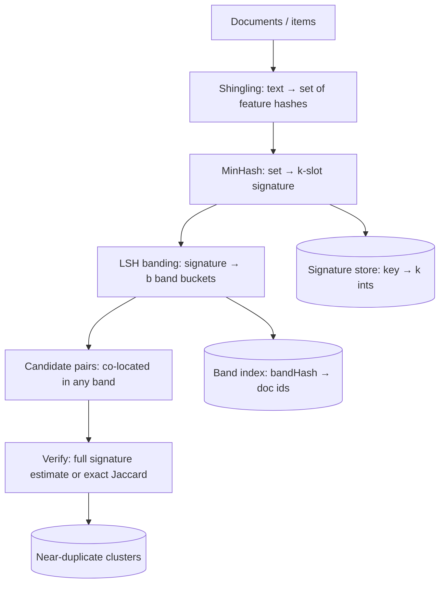
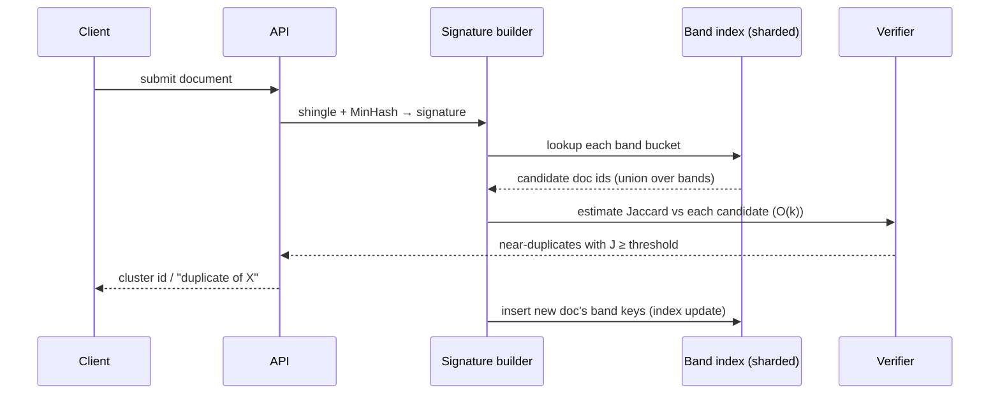

# MinHash — Senior Level

> **Focus:** How to architect a **large-scale near-duplicate detection system** around MinHash. Signatures alone do not scale — the all-pairs comparison is `O(N²)`. The senior job is to combine MinHash with **LSH banding**, choose the **right hash family** for throughput and quality, budget **memory and CPU** across a fleet, shard the index, and reason about **failure modes** (skew, hot buckets, drift, false negatives) under latency and cost SLAs.

---

## Table of Contents

1. [Introduction](#introduction)
2. [System Design with MinHash + LSH](#system-design)
3. [Distributed and Streaming MinHash](#distributed-and-streaming-minhash)
4. [Hash Choice: Quality vs Throughput](#hash-choice)
5. [Comparison with Alternatives](#comparison-with-alternatives)
6. [Architecture Patterns](#architecture-patterns)
7. [Code Examples](#code-examples)
8. [Memory and Throughput Budgeting](#memory-and-throughput-budgeting)
9. [Observability](#observability)
10. [Failure Modes](#failure-modes)
11. [Summary](#summary)

---

## Introduction

> Focus: "How do I run near-duplicate detection over hundreds of millions of documents within a memory and latency budget?"

> **One-line framing:** MinHash gives you `O(k)` pairwise set-similarity; the senior task is to wrap it in **LSH banding** (to beat `O(N²)`), choose a **hash family and build scheme** for throughput, **budget memory** with signature-width and b-bit choices, and run it as a **versioned, observable, A/B-tunable** service — because at scale the algorithm is the easy part and the operating point, drift, and failure modes are the hard part.


A senior engineer rarely writes the MinHash loop — they design the *system* it lives in. The constraints that dominate:

- **Scale.** `N` can be `10⁸`–`10⁹` documents; all-pairs comparison (`N²/2` ≈ `5·10¹⁷`) is impossible. LSH banding turns this into near-linear **candidate generation**.
- **Memory.** A `k`-slot signature times `N` documents is the budget killer. `k=128` at 4 bytes is `512 B/doc`; at `10⁹` docs that is `512 GB` just for signatures — before the LSH index. b-bit MinHash and width choices matter at the hundred-GB level.
- **Throughput.** Building signatures is `O(n·k)` per document; the hash family's speed (and whether you use one-permutation MinHash) sets ingest rate.
- **Quality SLA.** "Find pairs with Jaccard ≥ 0.8 with recall ≥ 0.95 and precision ≥ 0.9." This translates directly into LSH band/row tuning and the estimation `k`.

This file walks the design end to end: pipeline, sharding, hash selection, budgets, and what breaks in production.

---

## System Design with MinHash + LSH

The canonical near-duplicate pipeline has four stages:



1. **Shingling** converts each document into a set of feature hashes (word k-grams, char n-grams, token IDs). Choice of shingle size trades recall vs precision and *is part of the system contract*.
2. **MinHash** reduces each set to a fixed `k`-slot signature. Stored once, reused forever.
3. **LSH banding** indexes signatures: split into `b` bands of `r` rows (`k = b·r`), hash each band, and post the doc id under each band bucket. Two docs sharing *any* band bucket are a **candidate pair**.
4. **Verify** the candidates with the full signature (cheap `O(k)`) or, for the survivors, exact Jaccard. This stage controls precision; LSH controls recall.

The S-curve `P[candidate] = 1 − (1 − J^r)^b` is the tuning knob: pick `(b, r)` so the curve rises sharply just below your target `J`. Detailed banding math is in [`../10-locality-sensitive-hashing`](../10-locality-sensitive-hashing).

### Shingling is a system contract, not a detail

The set you feed MinHash *determines what "similar" means*, so shingling choices are architectural:

| Choice | Smaller value | Larger value |
|--------|---------------|--------------|
| Shingle size `w` (tokens/chars per gram) | more shingles shared → higher recall, more false positives | more specific shingles → higher precision, can miss paraphrases |
| Token unit (word vs char n-gram) | word: robust to spelling, language-aware | char: robust to tokenization, catches near-spelling dups |
| Normalization (lowercase, stem, strip boilerplate) | aggressive → merges trivially-different docs | conservative → preserves real distinctions |

A common web-dedup setting is char `w ≈ 5`–`9` shingles after stripping markup and boilerplate. Crucially, **the entire corpus must use one frozen shingling pipeline**: changing `w` or the tokenizer silently shifts every Jaccard and invalidates the index, so the pipeline must be **versioned** and a change implies a **re-index**.

---

## Distributed and Streaming MinHash

MinHash is friendly to distribution because **min is associative and commutative**:

```
sig(A ∪ B) = slotwise_min( sig(A), sig(B) )
```

This single property unlocks several patterns:

| Property | Consequence |
|----------|-------------|
| Associative/commutative min | Signatures merge in any order → map-reduce friendly. |
| Mergeable sketch | Per-shard partial signatures combine into a global one. |
| Streaming | Maintain a running signature; each new element updates `k` minimums in `O(k)`. |
| Idempotent | Re-processing the same element does not change the signature (min unchanged). |

**Map-reduce build.** Map: each worker shingles its document shard and emits partial signatures. Reduce: slot-wise min-merge partials for the same document key. **Streaming build.** A consumer reads an event stream (e.g. tokens of a document arriving over time) and folds each into the signature with `O(k)` updates — no need to buffer the whole set. **Distributed LSH.** The band index itself is sharded by `bandHash`, so candidate lookup is a partitioned key fan-out.

This mergeability is also why MinHash combines cleanly with other mergeable sketches (HyperLogLog for cardinality, bottom-k for both) in the same streaming framework.

### Incremental updates and deletions

MinHash handles **insertions** trivially: a new element only ever lowers a slot (`sig[i] = min(sig[i], h_i(x))`), an `O(k)` update. **Deletions** are the hard case — removing the element that *won* a slot means that slot's minimum must be recomputed from the remaining set, which a bare signature cannot do (it discarded the set). Three options:

| Need | Approach | Cost |
|------|----------|------|
| Insert-only / append streams | update running signature | `O(k)` per element |
| Occasional deletes, sets retained | recompute affected signature | `O(n·k)` rebuild |
| Frequent deletes | bottom-k keeping >k values, or per-slot small heaps | extra memory, supports pop |

For most dedup corpora documents are immutable once crawled, so insert-only is the norm and deletions are handled by full re-index on a schedule. Designing for "is this set mutable?" up front avoids a painful retrofit.

---

## Hash Choice

The hash family is a first-class design decision — it sets both **quality** (independence → unbiased estimates) and **throughput** (hashes/second).

| Hash family | Speed | Quality for MinHash | Notes |
|-------------|-------|---------------------|-------|
| Affine `(a·x+b) mod p` | very fast | good *if* derived from a strong base hash | classic k-hash; needs strong element hashing first |
| MurmurHash3 / xxHash | very fast | good avalanche | great as the base hash before binning/affine |
| FNV-1a | fast | weaker mixing | fine for band keys, marginal for slots |
| SipHash | medium | strong, keyed (DoS-resistant) | use when inputs are adversarial |
| Crypto (SHA-256) | slow | excellent | overkill; only if cryptographic guarantees needed |

**Practical recipe.** Hash each element *once* with a strong non-cryptographic hash (xxHash/Murmur) to a 64-bit value, then either (a) run `k` cheap **affine** transforms of that value for k-hash MinHash, or (b) **bin** it for one-permutation MinHash. This gives independence-like behavior at one strong hash per element — the throughput sweet spot. For **adversarial** input (users who craft documents to evade dedup), use a **keyed** hash (SipHash) so attackers cannot predict which elements become minima; otherwise they can engineer collisions or evasions.

**Quality caveat.** Affine hashes over a prime field are only *pairwise/2-universal*, not fully independent. For MinHash this is usually fine in practice, but the theory's clean `Bernoulli(J)` per slot assumes full independence; when correctness is critical, validate variance empirically (see `professional.md` on the gap between 2-universal and fully-random).

---

## Comparison with Alternatives

| Attribute | MinHash + LSH | SimHash + Hamming-LSH | Exact pairwise | Sorted-neighborhood / blocking |
|-----------|---------------|------------------------|----------------|-------------------------------|
| Similarity | Jaccard (sets) | cosine (vectors) | any (exact) | key-based heuristic |
| Candidate gen | sublinear (banding) | sublinear (bit-bands) | `O(N²)` | linear in window |
| Memory/doc | `k` ints (or b-bit) | `b` bits (e.g. 64) | full set | blocking key |
| Best for | dedup, plagiarism, set overlap | TF-IDF/embeddings cosine | small `N` | record linkage with good keys |
| Production usage | search-engine dedup, web crawl | content sim. ranking | offline batch | ETL/MDM dedup |
| Tuning surface | `k`, shingle size, `b`, `r` | bits, bands | none | block key, window |

**When MinHash wins:** the right metric is **Jaccard over sets**, `N` is large, and you want a mergeable, streamable sketch. **When SimHash wins:** you already have **weighted vectors** (TF-IDF, embeddings) and want **cosine**; its 64-bit fingerprint is even smaller and Hamming distance bands well. The formal MinHash-vs-SimHash contrast (collision = Jaccard vs collision = `1 − θ/π`) is in [`professional.md`](./professional.md).

---

## Architecture Patterns

### Read path: "is this incoming document a near-duplicate?"



Latency budget: shingle + MinHash is `O(n·k)`; band lookup is `b` index gets; verification is `O(k)` per candidate. Keeping the candidate set small (good `(b,r)` tuning) is what keeps p99 latency bounded.

### Write/index path

Insertion posts the document's `b` band keys into the band index and its signature into the signature store. Both are append-friendly and shardable. **Backfill** (re-indexing the corpus) is an offline map-reduce over the mergeable signatures.

### Two-stage precision/recall split

LSH banding is tuned for **recall** (don't miss true duplicates → accept some false candidates), and the **verify** stage is tuned for **precision** (drop false candidates via full-signature estimate or exact Jaccard). This separation lets you move the operating point without rebuilding signatures.

---

## Code Examples

### Thread-Safe Streaming MinHash + Concurrent LSH Index

#### Go

```go
package main

import (
	"sync"
)

const prime uint64 = 4294967311

// StreamingSig maintains a running k-slot signature; safe for concurrent updates.
type StreamingSig struct {
	mu  sync.Mutex
	a, b, sig []uint64
	k   int
}

func NewStreamingSig(k int, a, b []uint64) *StreamingSig {
	sig := make([]uint64, k)
	for i := range sig {
		sig[i] = ^uint64(0)
	}
	return &StreamingSig{a: a, b: b, sig: sig, k: k}
}

func (s *StreamingSig) Add(x uint64) {
	s.mu.Lock()
	defer s.mu.Unlock()
	for i := 0; i < s.k; i++ {
		if hv := (s.a[i]*x + s.b[i]) % prime; hv < s.sig[i] {
			s.sig[i] = hv
		}
	}
}

func (s *StreamingSig) Snapshot() []uint64 {
	s.mu.Lock()
	defer s.mu.Unlock()
	out := make([]uint64, s.k)
	copy(out, s.sig)
	return out
}

// LSHIndex: sharded band buckets → doc ids, concurrent-safe.
type LSHIndex struct {
	mu          sync.RWMutex
	bands, rows int
	buckets     map[uint64]map[string]bool // bandKey -> set of doc ids
}

func NewLSHIndex(bands, rows int) *LSHIndex {
	return &LSHIndex{bands: bands, rows: rows, buckets: map[uint64]map[string]bool{}}
}

func (ix *LSHIndex) bandKey(sig []uint64, bnd int) uint64 {
	var h uint64 = 1469598103934665603
	for r := 0; r < ix.rows; r++ {
		h = (h ^ sig[bnd*ix.rows+r]) * 1099511628211
	}
	return (h ^ uint64(bnd)) * 1099511628211 // mix band index so bands don't collide
}

func (ix *LSHIndex) Insert(id string, sig []uint64) {
	ix.mu.Lock()
	defer ix.mu.Unlock()
	for bnd := 0; bnd < ix.bands; bnd++ {
		key := ix.bandKey(sig, bnd)
		if ix.buckets[key] == nil {
			ix.buckets[key] = map[string]bool{}
		}
		ix.buckets[key][id] = true
	}
}

func (ix *LSHIndex) Candidates(sig []uint64) map[string]bool {
	ix.mu.RLock()
	defer ix.mu.RUnlock()
	out := map[string]bool{}
	for bnd := 0; bnd < ix.bands; bnd++ {
		for id := range ix.buckets[ix.bandKey(sig, bnd)] {
			out[id] = true
		}
	}
	return out
}
```

#### Java

```java
import java.util.*;
import java.util.concurrent.*;
import java.util.concurrent.locks.*;

public class StreamingMinHash {
    static final long PRIME = 4294967311L;
    final long[] a, b, sig; final int k;
    final ReentrantLock lock = new ReentrantLock();

    StreamingMinHash(int k, long[] a, long[] b) {
        this.k = k; this.a = a; this.b = b;
        this.sig = new long[k]; Arrays.fill(sig, Long.MAX_VALUE);
    }

    void add(long x) {
        lock.lock();
        try {
            for (int i = 0; i < k; i++) {
                long h = Math.floorMod(a[i] * x + b[i], PRIME);
                if (h < sig[i]) sig[i] = h;
            }
        } finally { lock.unlock(); }
    }

    long[] snapshot() {
        lock.lock();
        try { return sig.clone(); } finally { lock.unlock(); }
    }

    // Concurrent LSH index
    static class LSHIndex {
        final int bands, rows;
        final ConcurrentHashMap<Long, Set<String>> buckets = new ConcurrentHashMap<>();
        LSHIndex(int bands, int rows) { this.bands = bands; this.rows = rows; }

        long bandKey(long[] s, int bnd) {
            long h = 1469598103934665603L;
            for (int r = 0; r < rows; r++) h = (h ^ s[bnd * rows + r]) * 1099511628211L;
            return (h ^ bnd) * 1099511628211L;
        }

        void insert(String id, long[] s) {
            for (int bnd = 0; bnd < bands; bnd++)
                buckets.computeIfAbsent(bandKey(s, bnd), x -> ConcurrentHashMap.newKeySet()).add(id);
        }

        Set<String> candidates(long[] s) {
            Set<String> out = ConcurrentHashMap.newKeySet();
            for (int bnd = 0; bnd < bands; bnd++)
                out.addAll(buckets.getOrDefault(bandKey(s, bnd), Set.of()));
            return out;
        }
    }
}
```

#### Python

```python
import threading

PRIME = 4294967311


class StreamingSig:
    def __init__(self, k, a, b):
        self.k, self.a, self.b = k, a, b
        self.sig = [float("inf")] * k
        self._lock = threading.Lock()

    def add(self, x):
        with self._lock:
            for i in range(self.k):
                h = (self.a[i] * x + self.b[i]) % PRIME
                if h < self.sig[i]:
                    self.sig[i] = h

    def snapshot(self):
        with self._lock:
            return list(self.sig)


class LSHIndex:
    def __init__(self, bands, rows):
        self.bands, self.rows = bands, rows
        self.buckets = {}
        self._lock = threading.Lock()

    def _band_key(self, sig, bnd):
        h = 1469598103934665603
        mask = (1 << 64) - 1
        for r in range(self.rows):
            h = ((h ^ int(sig[bnd * self.rows + r])) * 1099511628211) & mask
        return ((h ^ bnd) * 1099511628211) & mask

    def insert(self, doc_id, sig):
        with self._lock:
            for bnd in range(self.bands):
                self.buckets.setdefault(self._band_key(sig, bnd), set()).add(doc_id)

    def candidates(self, sig):
        with self._lock:
            out = set()
            for bnd in range(self.bands):
                out |= self.buckets.get(self._band_key(sig, bnd), set())
            return out
```

---

## Memory and Throughput Budgeting

Back-of-envelope for `N = 10⁹` documents, `k = 128`:

| Component | Per doc | Total at `10⁹` | Lever |
|-----------|---------|----------------|-------|
| 64-bit signatures | 1024 B | ~1 TB | use 32-bit slots → 0.5 TB |
| 32-bit signatures | 512 B | ~512 GB | b-bit MinHash → tens of GB |
| b=1 MinHash | 16 B | ~16 GB | smallest; small accuracy hit |
| LSH band index (`b=20` bands) | ~20 postings | grows with bucket fan-out | tune `b`, evict cold buckets |

**Throughput.** Signature build is the cost center. k-hash at `k=128` is `128` affine ops per element; a `2 KB` document (~300 shingles) is ~`38k` ops → microseconds, but at `10⁹` docs you need a fleet. **One-permutation MinHash** (one strong hash per element + binning) cuts this by ~`k×`, often the only way to hit ingest SLAs. **b-bit MinHash** is the primary memory lever; it can turn a `512 GB` signature store into tens of GB at the cost of a small, quantifiable accuracy reduction.

**Decision rule:** start from the corpus size and memory budget → pick slot width / b-bit → pick `k` from the accuracy SLA → pick the build scheme (one-permutation if throughput-bound) → tune `(b, r)` for the recall/precision SLA.

### Worked capacity plan

Suppose the SLA is: dedup `N = 300M` web pages, report pairs with `J ≥ 0.85`, recall `≥ 0.95`, ingest `5,000 docs/s`, signature store `≤ 100 GB` RAM.

1. **Accuracy → k.** At the `J ≈ 0.85` decision boundary the variance is low (`J(1−J)=0.13`); `k = 128` gives `SE ≈ √(0.13/128) ≈ 0.032` — comfortably tight for an `0.85` cutoff.
2. **Memory → width.** `128` slots × `300M` docs: at 8 B/slot = `307 GB` (too big); at 4 B/slot = `154 GB` (still over); **b=1 MinHash** at `128 bits = 16 B/doc` = `4.8 GB` — well within budget, with a small accuracy cost the `0.85` margin absorbs.
3. **Throughput → scheme.** `5,000 docs/s` × ~`300` shingles × `128` affine ops = ~`192M` ops/s with k-hash — feasible on a few cores, but **one-permutation MinHash** (one strong hash/shingle) cuts it ~`128×`, leaving ample headroom and room to grow.
4. **(b, r) for recall.** With `k = 128`, choose `b, r` so the S-curve threshold `(1/b)^{1/r} ≈ 0.85`; e.g. `r = 8, b = 16` gives `(1/16)^{1/8} ≈ 0.707` (too low → too many candidates); `r = 16, b = 8` gives `(1/8)^{1/16} ≈ 0.878` (close, precision-leaning). Tune on a golden set; favor recall by nudging `b` up.

This is the senior workflow: the SLA numbers flow deterministically into `k`, signature width, build scheme, and banding — no guessing.

---

## Boosting Recall: Multiple Tables and Multi-Probe

A single `(b, r)` index has a fixed S-curve, so its recall at the threshold is capped (~63% right at the inflection). Two standard amplifications:

- **Multiple independent LSH tables.** Build `L` independent band indexes (different hash seeds). A pair is a candidate if it collides in *any* table. Recall rises as `1 − (1 − S(J))^L` at the cost of `L×` index memory and lookups. This is the classic recall/storage trade.
- **Multi-probe LSH.** Instead of more tables, probe *nearby* buckets in the *same* table (band keys that differ slightly), recovering many of the would-be-missed pairs without the storage multiplier. It trades a bit more query CPU for far less memory — usually the better large-scale choice.

| Technique | Recall lever | Cost | When |
|-----------|-------------|------|------|
| Single table | `(b, r)` | baseline | small/medium corpora |
| `L` tables | `L` | `L×` memory + lookups | recall-critical, memory-rich |
| Multi-probe | probe width | extra query CPU | memory-constrained, large `N` |

Both are detailed in [`../10-locality-sensitive-hashing`](../10-locality-sensitive-hashing); MinHash supplies the same signatures regardless of the amplification chosen.

## Operations Runbook (selected scenarios)

| Symptom | Likely cause | First action |
|---------|--------------|--------------|
| p99 latency spike on lookups | hot band bucket (boilerplate) | inspect `bucket_size_p99`; cap/sample the offending bucket |
| Recall regression after deploy | shingling/tokenizer change | diff pipeline version; trigger re-index |
| Memory near budget | signature width too large | switch to 32-bit or b-bit slots; evict cold buckets |
| Many false candidates | S-curve threshold too low | increase rows `r` (with `k=b·r`), strengthen verify |
| Estimates biased high | OPH empty bins / weak hash | enable densification; upgrade base hash |
| Duplicate clusters merging unrelated docs | shingle size too small / over-normalization | raise shingle `w`; relax normalization |

The recurring theme: most production issues trace back to **shingling drift**, **hash quality**, or **(b, r) mis-tuning** — all observable against a labeled golden set, which is why continuous quality measurement is non-negotiable.

## Observability

| Metric | Why it matters | Alert threshold (example) |
|--------|----------------|---------------------------|
| `candidate_pairs_per_doc` | Precision proxy; high → wasted verify CPU | > 50 (likely a hot bucket) |
| `bucket_size_p99` | Skew / hot partition detector | > 10⁴ doc ids |
| `verify_drop_rate` | Fraction of candidates rejected by exact check | trend, not absolute |
| `recall_on_labeled_set` | Quality SLA against a golden set | < 0.95 |
| `signature_build_latency_p99` | Ingest health | > budget |
| `index_memory_bytes` | Capacity | > 80% of budget |
| `empty_bin_rate` (OPH) | Densification health | rising (small-set drift) |

Track recall/precision against a **labeled golden set** continuously; LSH tuning silently drifts as the corpus distribution changes (e.g. average document length grows → shingle counts change → S-curve shifts).

### A/B-safe tuning

Because LSH operating points live entirely in `(b, r)` and the verify threshold — *not* in the signatures — you can change recall/precision **without rebuilding signatures**. Maintain two band indexes (current and candidate `(b,r)`), shadow-evaluate the candidate against the golden set on live traffic, and cut over only when it wins. This decoupling (expensive immutable signatures vs cheap tunable index) is the senior reason MinHash systems are operationally pleasant: the costly artifact is stable, and the tuning knobs are cheap and reversible.

---

## Failure Modes

- **Hot LSH buckets (skew).** A band bucket containing boilerplate (cookie banners, license headers) attracts millions of docs → quadratic blowup in candidates from one bucket. *Mitigation:* strip boilerplate before shingling; cap bucket size; add per-bucket sampling; use more rows `r` to make accidental band collisions rarer.
- **Low recall (false negatives).** True duplicates never share a band → missed. *Mitigation:* lower the S-curve threshold (more bands `b`, fewer rows `r`), increase `k`, or use multiple `(b,r)` index tables (multi-probe LSH).
- **Low precision (false positives).** Many candidates fail verification → wasted CPU. *Mitigation:* raise the threshold (more rows `r`), strengthen the verify stage.
- **Hash weakness.** A 2-universal affine family correlates slots → estimates biased; adversaries craft evasions. *Mitigation:* strong base hash (xxHash/Murmur), keyed SipHash for adversarial input, validate variance.
- **Empty-bin bias (one-permutation).** Short documents leave bins empty → biased. *Mitigation:* densification, or fall back to k-hash for short inputs.
- **Element non-canonicalization drift.** Tokenizer changes split shingles → similarity silently drops corpus-wide. *Mitigation:* version the shingling pipeline; re-index on changes.
- **Memory exhaustion.** Signature store + band index outgrow RAM. *Mitigation:* b-bit MinHash, 32-bit slots, tiered storage, cold-bucket eviction.
- **Seed/constant mismatch on redeploy.** A new build with different hash constants makes new signatures incomparable with old ones. *Mitigation:* pin the hash spec as versioned config; never regenerate constants silently; re-index on a spec bump.
- **Transitive-closure cluster merge.** Pairwise near-dup links chained transitively can merge a whole corpus into one giant "cluster." *Mitigation:* use connected components with a similarity floor, or centroid/representative-based clustering rather than naive union-find over all candidate edges.

---

## Security and Abuse Considerations

When dedup gates user-facing decisions (spam filtering, content moderation, copyright takedowns), MinHash becomes an **adversarial** target:

- **Evasion.** An attacker who knows the (public) hash family can craft documents whose shingles avoid becoming minima with a target document, lowering the estimated Jaccard below threshold while keeping the text semantically identical. *Mitigation:* keyed hashing (SipHash) so the minima are unpredictable; rotate keys; combine with semantic (embedding) checks that lexical tricks cannot fool.
- **Index poisoning.** Flooding the index with documents engineered to share band buckets creates hot buckets and degrades everyone's candidate quality. *Mitigation:* per-source rate limits, bucket-size caps, boilerplate stripping.
- **Membership inference.** Signatures leak information about set contents; a stored signature is not a secure hash of the document. *Mitigation:* treat signatures as sensitive if the underlying sets are, and do not expose them across trust boundaries.

The general principle: the clean probabilistic guarantees assume a *random* hash and *non-adversarial* input. Under attack, you need keyed hashes, defense in depth (a second, orthogonal similarity signal), and operational guardrails (rate limits, bucket caps).

## MinHash-LSH vs Vector Search (ANN)

A recurring senior question: "why not just use a vector database / ANN index (HNSW, IVF-PQ)?" The honest answer depends on the metric and the data.

| Dimension | MinHash + LSH | Vector ANN (HNSW / IVF) |
|-----------|---------------|-------------------------|
| Native metric | Jaccard of sets | cosine / L2 of dense vectors |
| Input | sparse sets / shingles | dense embeddings |
| Memory/item | tens of bytes (b-bit) | hundreds–thousands of bytes |
| Recall control | exact S-curve math | empirical, index-dependent |
| Updates | insert-only easy | varies; HNSW supports inserts |
| Sweet spot | exact-ish dedup, sparse high-dim sets | semantic similarity of embeddings |

MinHash wins when the truth is **lexical/set overlap** (boilerplate dedup, plagiarism, crawl dedup): it is cheaper, its recall is *analytically tunable*, and it does not need an embedding model. Vector ANN wins for **semantic** similarity where two documents share *meaning* but few exact shingles. Mature pipelines often run **both**: MinHash-LSH as a cheap exact-dup filter, then embeddings + ANN for semantic near-dups.

## Cross-Language and Determinism Gotchas

At scale, signatures are often built in one language and compared in another (e.g. Spark/Scala build, Go service compare). Determinism pitfalls:

- **Hash agreement.** The *element hash* and the affine constants must be byte-for-byte identical across languages, or the same shingle yields different ints and similarity collapses. Pin a single hash spec (e.g. xxHash64 with a fixed seed) and the same `(a_i, b_i)` table.
- **Integer width / signedness.** Java has no unsigned 64-bit; use `Long.compareUnsigned`/`Math.floorMod` and mirror Go/Python's modular arithmetic exactly.
- **Tokenization.** Unicode normalization, lowercasing locale, and whitespace handling must match — a subtle source of cross-service drift.
- **b-bit packing order.** If signatures are b-bit packed, the bit order and endianness must be a shared contract.

The rule: treat the **signature format and hash spec as a versioned wire protocol**, not an implementation detail.

## Summary

At senior level, MinHash is a *component* in a near-duplicate system, not an algorithm in isolation. The signature solves "compare two sets in `O(k)`," but **LSH banding** solves the real problem — escaping `O(N²)` all-pairs comparison — by indexing signatures into `b` bands of `r` rows and treating band co-location as candidacy, tuned via the S-curve `1 − (1 − J^r)^b`. The senior decisions are: a **hash family** balancing throughput and independence (one strong base hash → affine or binning; keyed hashes for adversaries), a **build scheme** (one-permutation MinHash for ingest throughput), **memory levers** (32-bit or b-bit signatures to fit `10⁹` docs in tens-to-hundreds of GB), a **two-stage recall/precision split** (LSH for recall, verify for precision), and continuous **observability** against a golden set with explicit handling of skew, hot buckets, empty bins, and pipeline drift. MinHash's associative `min` makes the whole thing mergeable, streamable, and shardable — see [`../10-locality-sensitive-hashing`](../10-locality-sensitive-hashing) for the banding internals.

### End-to-end trace (worked)

A new crawl page `P` arrives. (1) **Shingle:** strip boilerplate, char-5-gram → `~280` feature hashes. (2) **MinHash:** one-permutation MinHash → `k=128` b=1 signature, `16 B`. (3) **Band:** `b=16, r=8`; compute 16 band keys, look each up in the sharded index → union of `~30` candidate doc ids. (4) **Verify:** estimate Jaccard of `P` vs each of the 30 via full signature (`O(k)` each); 3 exceed `J ≥ 0.85`. (5) **Decide:** `P` is a near-duplicate of the best match → attach to that cluster, do not re-serve. (6) **Index:** post `P`'s 16 band keys + signature so future pages can match it. Total: a handful of microseconds of CPU and `~30` cheap verifications — versus `300M` exact comparisons the naive approach would need. That gap is the entire value proposition.

---

Next step: [`professional.md`](./professional.md) — the proof that `P[collision] = Jaccard`, the unbiased estimator with variance and Chernoff bounds on `k`, and a formal comparison to SimHash.
