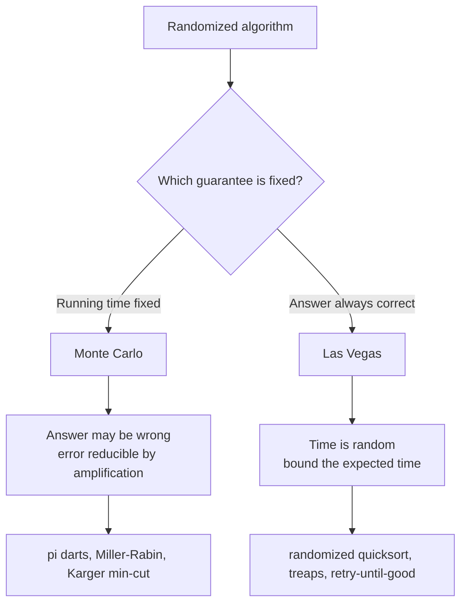

# Monte Carlo vs Las Vegas Randomized Algorithms — Junior Level

> **One-line summary:** A **randomized algorithm** flips coins while it runs. There are two flavours. A **Monte Carlo** algorithm always finishes in a fixed (bounded) time but its answer is only *probably* right — it may be wrong with some small probability. A **Las Vegas** algorithm is *always* right, but its running time is random — you cannot say exactly how long it will take, only its *expected* time. Slogan: **Monte Carlo = fast but maybe wrong; Las Vegas = always right but maybe slow.**

---

## Table of Contents

1. [Introduction](#introduction)
2. [Prerequisites](#prerequisites)
3. [Glossary](#glossary)
4. [Core Concepts](#core-concepts)
5. [Big-O Summary](#big-o-summary)
6. [Real-World Analogies](#real-world-analogies)
7. [Pros & Cons](#pros--cons)
8. [Step-by-Step Walkthrough](#step-by-step-walkthrough)
9. [Code Examples](#code-examples)
10. [Coding Patterns](#coding-patterns)
11. [Error Handling](#error-handling)
12. [Performance Tips](#performance-tips)
13. [Best Practices](#best-practices)
14. [Edge Cases & Pitfalls](#edge-cases--pitfalls)
15. [Common Mistakes](#common-mistakes)
16. [Cheat Sheet](#cheat-sheet)
17. [Visual Animation](#visual-animation)
18. [Summary](#summary)
19. [Further Reading](#further-reading)

---

## Introduction

Most algorithms you have met so far are **deterministic**: feed them the same input twice and they do exactly the same steps and return exactly the same answer, every time. A **randomized algorithm** is different — somewhere inside it asks for a *random number* (flips a coin, rolls a die, picks a random element), and that randomness changes what it does.

Why would you ever want randomness inside an algorithm? Three reasons keep coming up:

1. **Speed.** Some problems are slow to solve exactly but quick to solve "almost always right." If being wrong one time in a billion is acceptable, you can go enormously faster.
2. **Simplicity.** A randomized algorithm is often shorter and easier to write than the clever deterministic one that achieves the same guarantee.
3. **Beating bad inputs.** A deterministic algorithm can have a "worst-case input" that an adversary can hand you on purpose (think: already-sorted data fed to a naive quicksort). Randomness scrambles the picture so that *no single input* is reliably bad — the badness depends on your coin flips, which the adversary cannot see.

Once you accept randomness, a fork appears. You have to decide **what stays fixed and what is allowed to wobble**:

- If you insist the **running time** is fixed (bounded), then the **answer** is what wobbles — it might be wrong sometimes. This is a **Monte Carlo** algorithm.
- If you insist the **answer** is always correct, then the **running time** is what wobbles — it might be slow sometimes. This is a **Las Vegas** algorithm.

That is the whole story of this topic. Everything else — error probability, amplification, converting one type into the other — is detail built on this single trade-off. The two flagship examples we use throughout are:

- **Monte Carlo: estimating π by throwing darts.** Throw `N` random darts at a square with a circle inscribed; the fraction landing inside the circle, times 4, estimates π. It always takes exactly `N` throws (fixed time) but the answer is approximate (it wobbles around the true π). More darts → better answer, but never *exactly* π.
- **Las Vegas: retry until success.** Keep drawing random attempts until one works (e.g. pick a random pivot until it splits an array reasonably; or roll a die until you get a 6). The answer, once found, is always correct, but *how many tries* it took is random.

This file shows you what these two paradigms *are* and *how* to write each one, with small runnable examples in Go, Java, and Python.

---

## Prerequisites

Before reading this file you should be comfortable with:

- **Basic programming** — loops, functions, arrays, conditionals (in any of Go/Java/Python).
- **Random number generation** — how to ask your language for a random float in `[0, 1)` or a random integer in a range.
- **Probability, the everyday kind** — "a fair coin lands heads half the time," "independent events multiply" (the chance of two heads in a row is `1/2 · 1/2 = 1/4`).
- **Big-O notation** — `O(n)`, `O(log n)`, and the idea of *expected* vs *worst-case* cost.
- **Floating-point basics** — that `0.333...` is approximate, since π estimation produces approximate numbers.

Optional but helpful:

- A glance at **quicksort** (where random pivots show up) and **binary search**.
- The idea of a **seed** for a random generator (so a "random" run can be reproduced).

---

## Glossary

| Term | Meaning |
|------|---------|
| **Deterministic algorithm** | Same input always gives the same steps and the same output. No randomness. |
| **Randomized algorithm** | Uses random numbers (coin flips) during execution; behaviour varies run to run. |
| **Monte Carlo (MC)** | Randomized algorithm with **bounded running time** but a **possibly wrong** answer (small error probability). |
| **Las Vegas (LV)** | Randomized algorithm that is **always correct** but whose **running time is random** (we bound the *expected* time). |
| **Error probability** | The chance a Monte Carlo algorithm returns a wrong answer. We want it tiny. |
| **One-sided error** | The algorithm can only be wrong in *one* direction (e.g. it never says "no" wrongly, only "yes" wrongly). |
| **Two-sided error** | The algorithm can be wrong in *either* direction. |
| **Amplification** | Repeating a Monte Carlo algorithm and combining the answers to shrink the error probability. |
| **Expected running time** | The average running time over the algorithm's own coin flips, for a *fixed* input. |
| **Seed** | A starting value for the random generator; the same seed reproduces the same "random" sequence. |
| **Trial / attempt** | One random try inside a Las Vegas retry loop. |

---

## Core Concepts

### 1. Randomness as an extra input

A deterministic algorithm has one input: the data. A randomized algorithm secretly has **two** inputs: the data *and* the stream of random coin flips. Because the coin flips change run to run, so does the behaviour. The key mental move: when we say "expected time" or "error probability," we are averaging **over the coin flips**, with the data *held fixed*. This is different from "average-case analysis," which averages over *random data*. (More on that distinction in `middle.md`.)

### 2. Monte Carlo — fix the time, let the answer wobble

A Monte Carlo algorithm decides up front how long it will run (say, `N` iterations), runs exactly that long, and returns an answer that is correct with high probability. The π-dart estimator is the cleanest example: you choose `N` darts, throw them, and report `4 ·(inside / N)`. The time is fixed at `N` throws; the answer is an *estimate* that is close to π but rarely exactly π. Crucially, **you can trade more time for less error** — double `N` and the estimate tightens.

### 3. Las Vegas — fix the answer, let the time wobble

A Las Vegas algorithm never returns a wrong answer. To achieve that it may have to **retry**: it tries something random, checks whether the result is acceptable, and if not, tries again. The classic shape is *retry-until-success*. Because each try might fail, the total number of tries — and hence the running time — is random. We cannot promise a fixed time, only an **expected** time (and usually a guarantee that it finishes with probability 1).

### 4. The fundamental trade-off

You cannot, in general, have both a fixed time *and* a guaranteed-correct answer *and* still get the speed benefit of randomness — something has to give. Monte Carlo gives up correctness (a little); Las Vegas gives up a time guarantee. Choosing between them is choosing **which guarantee you cannot live without**: "I must answer within this deadline" (Monte Carlo) vs "I must never be wrong" (Las Vegas).

### 5. Error vs iterations (the convergence picture)

For Monte Carlo estimators like the π-darts, the error shrinks as you do more work — but slowly. Roughly, the typical error of the π estimate scales like `1 / √N`: to get one more decimal digit of accuracy you need about `100×` more darts. This "diminishing returns" curve is worth seeing once (the animation plots it). It is why Monte Carlo is great for a *rough, fast* answer and poor for *many digits*.

### 6. Retry loops always finish (with probability 1)

A Las Vegas retry loop "keeps trying until it works." Does it ever finish? Yes — as long as each try has some fixed chance `p > 0` of succeeding, the chance of failing `k` times in a row is `(1-p)^k`, which goes to zero as `k` grows. On *average* you need `1/p` tries (e.g. if each try succeeds with probability `1/2`, you expect 2 tries). So the loop terminates almost surely, and its expected length is `1/p`.

---

## Big-O Summary

| Aspect | Monte Carlo | Las Vegas |
|--------|-------------|-----------|
| Running time | **Fixed / bounded** (e.g. exactly `N` steps) | **Random**; we bound the *expected* time |
| Answer | Correct *with high probability* (may err) | **Always correct** |
| What we analyze | Error probability for a given time budget | Expected (and tail) running time |
| Error reducible by | Running longer / more repetitions (amplification) | N/A — never wrong |
| π-dart estimator | `O(N)` time, error `~ 1/√N` | — |
| Retry-until-success | — | `O(1/p)` expected tries, each try costs the per-try work |

> A handy way to remember the costs: Monte Carlo's "Big-O" is about **time you pay**; Las Vegas's "Big-O" is about **time you expect to pay**. Monte Carlo's quality metric is **error**; Las Vegas's quality metric is **expected time**.

---

## Real-World Analogies

| Concept | Analogy |
|---------|---------|
| Monte Carlo | A weather forecast: it always arrives on time (fixed deadline) but might be wrong. "70% chance of rain" is a fast, bounded-time, possibly-wrong answer. |
| Las Vegas | A meticulous proofreader who refuses to hand back the document until it is perfect. The result is always correct, but you cannot promise exactly when it will be done. |
| Monte Carlo amplification | Asking several independent doctors for a diagnosis and taking the majority vote — each may be wrong, but the consensus is far more reliable. |
| Error vs iterations (π darts) | Estimating the area of a lake by tossing pebbles randomly over a map of the region — more pebbles give a sharper estimate, but you never get the *exact* area. |
| Las Vegas retry loop | Re-dialing a busy phone number until it connects — every connected call is "correct," but the number of redials is unpredictable. |
| Seeding the RNG | Writing down the exact shuffle of a deck so a card trick can be repeated identically. |

> Where these break down: a weather forecast's error is not really tunable the way Monte Carlo's is, and a proofreader might give up — a true Las Vegas algorithm finishes with probability 1. Use analogies to build intuition, then trust the definitions.

---

## Pros & Cons

| | Pros | Cons |
|---|------|------|
| **Monte Carlo** | Predictable, bounded running time (good for deadlines/real-time). Often very fast. Simple to implement. Error is tunable. | Can return a wrong answer. Needs care to make error small enough. Verifying the answer may be impossible. |
| **Las Vegas** | Answer is *always* correct — no error budget to reason about. Often as simple as "retry until good." | No hard time guarantee; a bad run can be slow. Needs a cheap way to *check* success. Can (rarely) take many tries. |

**When to use Monte Carlo:** a strict deadline, a problem where an approximate or "high-probability-correct" answer is fine, or where checking correctness is itself hard (so you cannot retry to confirm). Examples: π/area estimation, Miller-Rabin primality (composite is certain, "prime" is high-probability), Karger's min-cut, fingerprint/hash checks.

**When to use Las Vegas:** correctness is non-negotiable and you have a cheap success check, and you can tolerate variable running time. Examples: randomized quicksort/quickselect, treaps, "pick a random pivot/hash and retry if it is bad."

---

## Step-by-Step Walkthrough

### A. Monte Carlo — estimating π with darts

Imagine a `2 × 2` square centred at the origin, with a circle of radius `1` inscribed in it. The square has area `4`; the circle has area `π·1² = π`. So if you throw a dart that lands at a **uniformly random** point in the square, the chance it lands inside the circle is `π / 4`.

```
Throw N darts at the square.
For each dart at (x, y) with x, y in [-1, 1]:
    if x*x + y*y <= 1:   inside the circle
Estimate: pi ≈ 4 * (number inside) / N
```

Trace with `N = 8` darts (illustrative):

```
dart 1: (0.1, 0.2)   -> 0.05 <= 1   inside
dart 2: (0.9, 0.8)   -> 1.45  > 1   outside
dart 3: (-0.3, 0.4)  -> 0.25 <= 1   inside
dart 4: (0.7, -0.7)  -> 0.98 <= 1   inside
dart 5: (-0.95, 0.5) -> 1.15  > 1   outside
dart 6: (0.2, -0.1)  -> 0.05 <= 1   inside
dart 7: (0.6, 0.6)   -> 0.72 <= 1   inside
dart 8: (0.99, 0.99) -> 1.96  > 1   outside
inside = 5,  estimate = 4 * 5/8 = 2.5
```

With only 8 darts the estimate (`2.5`) is far from π (`3.14159…`). With 1,000 darts you typically land near `3.1`, with 1,000,000 near `3.1416`. **Time is fixed (`N` throws); the answer wobbles and tightens as `N` grows.** That is Monte Carlo.

### B. Las Vegas — retry until a good pivot

Suppose we want a pivot that splits an array into two parts where neither part is more than 75% of the whole (a "good" pivot). Pick a random element; if it is good, use it; if not, pick again.

```
loop:
    p = random element of the array
    check the split it produces
    if neither side > 75% of the array:  return p   (correct, good pivot)
    else: try again
```

At least *half* the elements are good pivots (anything in the middle 50% works), so each try succeeds with probability `≥ 1/2`. Expected number of tries `≤ 2`. **The pivot we return is always good (correct); the number of tries is random.** That is Las Vegas.

---

## Code Examples

### Example 1: Monte Carlo — estimate π by throwing darts

Fixed time (`n` darts), approximate answer.

#### Go

```go
package main

import (
	"fmt"
	"math/rand"
)

// estimatePi throws n random darts at the unit square [0,1)x[0,1)
// and uses the quarter-circle of radius 1 (area pi/4) to estimate pi.
// Always does exactly n iterations -> fixed running time (Monte Carlo).
func estimatePi(n int) float64 {
	inside := 0
	for i := 0; i < n; i++ {
		x := rand.Float64() // in [0,1)
		y := rand.Float64()
		if x*x+y*y <= 1.0 {
			inside++
		}
	}
	return 4.0 * float64(inside) / float64(n)
}

func main() {
	for _, n := range []int{100, 10000, 1000000} {
		fmt.Printf("n=%-8d pi ≈ %.5f\n", n, estimatePi(n))
	}
}
```

#### Java

```java
import java.util.Random;

public class MonteCarloPi {
    // Fixed n iterations -> bounded running time; answer is approximate.
    static double estimatePi(int n) {
        Random rng = new Random();
        int inside = 0;
        for (int i = 0; i < n; i++) {
            double x = rng.nextDouble(); // [0,1)
            double y = rng.nextDouble();
            if (x * x + y * y <= 1.0) inside++;
        }
        return 4.0 * inside / n;
    }

    public static void main(String[] args) {
        for (int n : new int[]{100, 10_000, 1_000_000}) {
            System.out.printf("n=%-8d pi ~ %.5f%n", n, estimatePi(n));
        }
    }
}
```

#### Python

```python
import random


def estimate_pi(n):
    """Throw n darts; return 4 * (fraction inside the quarter circle).
    Always n iterations -> fixed time; answer is approximate (Monte Carlo)."""
    inside = 0
    for _ in range(n):
        x, y = random.random(), random.random()  # [0,1)
        if x * x + y * y <= 1.0:
            inside += 1
    return 4.0 * inside / n


if __name__ == "__main__":
    for n in (100, 10_000, 1_000_000):
        print(f"n={n:<8} pi ~ {estimate_pi(n):.5f}")
```

**What it does:** runs a fixed number of darts and returns an estimate that improves with `n`. Run it twice and you get slightly different answers — that is the Monte Carlo wobble.
**Run:** `go run main.go` | `javac MonteCarloPi.java && java MonteCarloPi` | `python pi.py`

### Example 2: Las Vegas — roll a die until you get a 6

Always correct (it *does* return a 6), random running time.

#### Go

```go
package main

import (
	"fmt"
	"math/rand"
)

// rollUntilSix keeps rolling a fair 6-sided die until it shows 6.
// The result is ALWAYS a 6 (correct); the number of rolls is random.
func rollUntilSix() int {
	rolls := 0
	for {
		rolls++
		if rand.Intn(6)+1 == 6 {
			return rolls
		}
	}
}

func main() {
	total := 0
	const trials = 100000
	for i := 0; i < trials; i++ {
		total += rollUntilSix()
	}
	fmt.Printf("average rolls to get a 6 ≈ %.3f (theory: 6)\n",
		float64(total)/float64(trials))
}
```

#### Java

```java
import java.util.Random;

public class LasVegasDie {
    static final Random RNG = new Random();

    // Always returns once it has rolled a 6; the count is random.
    static int rollUntilSix() {
        int rolls = 0;
        while (true) {
            rolls++;
            if (RNG.nextInt(6) + 1 == 6) return rolls;
        }
    }

    public static void main(String[] args) {
        long total = 0;
        int trials = 100_000;
        for (int i = 0; i < trials; i++) total += rollUntilSix();
        System.out.printf("average rolls to get a 6 ~ %.3f (theory: 6)%n",
                (double) total / trials);
    }
}
```

#### Python

```python
import random


def roll_until_six():
    """Roll until a 6 appears. Result is always a 6 (correct);
    the number of rolls is random (Las Vegas)."""
    rolls = 0
    while True:
        rolls += 1
        if random.randint(1, 6) == 6:
            return rolls


if __name__ == "__main__":
    trials = 100_000
    total = sum(roll_until_six() for _ in range(trials))
    print(f"average rolls to get a 6 ~ {total / trials:.3f} (theory: 6)")
```

**What it does:** demonstrates the retry-until-success shape. Each call is *correct* (it returns a roll count that genuinely ended on a 6), but the count varies; the long-run average is `1/p = 1/(1/6) = 6`.
**Run:** `go run main.go` | `javac LasVegasDie.java && java LasVegasDie` | `python die.py`

---

## Coding Patterns

### Pattern 1: Monte Carlo — fixed-budget sampling

**Intent:** Decide a budget `N`, sample `N` times, aggregate.

```python
def monte_carlo(samples, predicate):
    hits = sum(1 for _ in range(samples) if predicate())
    return hits / samples   # an estimate; error shrinks like 1/sqrt(samples)
```

### Pattern 2: Las Vegas — retry until verified success

**Intent:** Try random attempts; *check* each; return the first that passes.

```python
def las_vegas(make_attempt, is_good):
    while True:
        candidate = make_attempt()      # random
        if is_good(candidate):          # cheap, deterministic check
            return candidate            # always correct
```

### Pattern 3: Amplification — repeat a Monte Carlo and combine

**Intent:** Shrink error by running the MC algorithm several times and voting/AND-ing.

```python
def amplify_one_sided(mc, rounds):
    # one-sided: trust a "no" if ANY round says "no"
    for _ in range(rounds):
        if mc() == "no":
            return "no"          # certain
    return "yes"                 # probably yes; error shrank to p^rounds
```



---

## Error Handling

| Error | Cause | Fix |
|-------|-------|-----|
| π estimate is always the same | RNG not seeded, or seeded with a constant | Seed once from the clock (or deliberately fix a seed for reproducibility). |
| Las Vegas loop never returns | Each attempt has success probability `0` (the "good" condition is impossible) | Ensure `p > 0`; verify the success check is satisfiable; add a safety cap for debugging. |
| Monte Carlo error too large | Too few samples for the accuracy needed | Increase `N` (error `~ 1/√N`) or amplify by repetition. |
| Division by zero in estimate | `N = 0` samples | Require `N ≥ 1`. |
| Non-reproducible bug | Different RNG seed each run | Log/seed the RNG so a failing run can be replayed. |
| Reusing the same "random" base/pivot | Drawing from a fixed value, not the RNG | Draw a fresh random value each attempt. |

---

## Performance Tips

- For Monte Carlo, remember the **`1/√N` law**: ten times the accuracy costs a *hundred* times the samples. Do not chase many digits with raw sampling.
- For Las Vegas, the expected number of tries is `1/p`; if `p` is tiny, the loop is slow — redesign so each try succeeds more often.
- Seed the RNG **once** (not inside the hot loop); creating a new generator per iteration is slow and can bias results.
- Prefer your language's fast PRNG for simulations (`math/rand`, `java.util.Random`, `random`); reserve cryptographic RNGs for security.
- Batch the random draws if your language supports vectorized generation (e.g. NumPy) — it is far faster than one-at-a-time for π estimation.

---

## Best Practices

- **State the guarantee explicitly** in a comment/docstring: "Monte Carlo: bounded time, error ≤ X" or "Las Vegas: always correct, expected time Y."
- **Make Las Vegas success checks cheap** — the whole point is that you can verify a candidate fast enough to afford retries.
- **Pick the smallest `N` (or fewest rounds) that meets your accuracy/error target**; do not over-sample.
- **Seed for reproducibility in tests**, randomize from the clock in production.
- **Know your error model** (one-sided vs two-sided) before amplifying — it determines whether you AND the answers or take a majority vote (see `middle.md`).
- **Validate against a deterministic oracle** on small inputs when one exists (e.g. compare Las Vegas quicksort output to a library sort).

---

## Edge Cases & Pitfalls

- **`N = 0` darts** — undefined estimate; guard it.
- **Success probability `p = 0`** in a Las Vegas loop — infinite loop; the condition must be achievable.
- **Confusing "expected time" with "worst-case time"** — a Las Vegas algorithm can, on a very unlucky run, take much longer than its expectation.
- **Thinking more samples remove *all* error in Monte Carlo** — error shrinks but (for an estimator) never hits zero in finite time.
- **Reusing one random value across attempts** — kills independence and breaks the probability guarantees.
- **Treating a Monte Carlo "probably correct" answer as certain** — it is not; size the error to the stakes.
- **Forgetting the answer-check in Las Vegas** — without a correctness check, "retry until success" is meaningless.

---

## Common Mistakes

1. **Mixing up the two paradigms** — saying "Monte Carlo is always correct" or "Las Vegas has fixed time." It is the opposite. Memorize: *MC fixes time, LV fixes correctness.*
2. **Seeding the RNG inside the loop** — produces correlated or constant "random" values.
3. **Under-sampling Monte Carlo** — using `N = 100` and expecting 4 correct digits of π.
4. **No success check in a Las Vegas loop** — you must verify each attempt; otherwise you cannot guarantee correctness.
5. **Assuming a retry loop might hang forever** — it terminates with probability 1 as long as `p > 0` (and on average in `1/p` tries).
6. **Amplifying the wrong way** — voting when the error is one-sided (you should AND) or AND-ing when it is two-sided (you should vote). Wrong combination *raises* error.
7. **Ignoring reproducibility** — an unseeded randomized bug is painful to debug.

---

## Cheat Sheet

| Question | Monte Carlo | Las Vegas |
|----------|-------------|-----------|
| What is fixed? | running time | correctness |
| What is random? | the answer (may err) | the running time |
| Quality metric | error probability | expected running time |
| How to improve | run longer / amplify | redesign so `p` is larger |
| Canonical example | π darts, Miller-Rabin | randomized quicksort, retry-until-good |
| Finishes when? | after the fixed budget | when success is verified |

Core shapes:

```text
# Monte Carlo: fixed time, maybe-wrong answer
result = aggregate(sample() for _ in range(N))     # error ~ 1/sqrt(N)

# Las Vegas: always correct, random time
while True:
    c = random_attempt()
    if is_good(c): return c                         # expected 1/p tries
```

Conversion (preview, detailed in `middle.md`):

```text
Las Vegas  -> Monte Carlo : run LV, but STOP after a time cap; if not done, output a guess.
Monte Carlo -> Las Vegas  : run MC, then VERIFY the answer; if wrong, retry.  (needs a checker)
```

---

## Visual Animation

> See [`animation.html`](./animation.html) for an interactive visualization.
>
> The animation demonstrates:
> - **Monte Carlo π estimation:** darts raining into a square with an inscribed circle; the running estimate of π converging toward `3.14159…` as darts accumulate.
> - **Error vs iterations:** a live plot showing the estimate's error shrinking roughly like `1/√N`.
> - **Las Vegas retry-until-success:** a loop that draws random attempts and retries on failure, with a counter of how many tries each success took (averaging toward `1/p`).
> - Controls (Start / Step / Pause / Reset), a speed slider, an info panel, a Big-O comparison table, and an operation log.

---

## Summary

A **randomized algorithm** uses coin flips, and the central decision is **which guarantee to keep fixed**. A **Monte Carlo** algorithm keeps the **running time bounded** and accepts a small chance of a **wrong answer** — the π-dart estimator is the model: exactly `N` throws (fixed time), an estimate that wobbles around π and tightens (slowly, like `1/√N`) as `N` grows. A **Las Vegas** algorithm keeps the **answer always correct** and accepts a **random running time** — the model is *retry-until-success*: roll until you get a 6, or pick a random pivot until it is good; each result is correct, but the number of tries (expected `1/p`) is random. The two are convertible: cap a Las Vegas algorithm's time and it becomes Monte Carlo; add a correctness check to a Monte Carlo algorithm and retrying makes it Las Vegas. Remember the slogan — **Monte Carlo: fast but maybe wrong; Las Vegas: always right but maybe slow** — and seed your RNG so your randomness is reproducible when you need it to be.

---

## Further Reading

- *Introduction to Algorithms* (CLRS) — the chapter on randomized algorithms and randomized quicksort.
- Motwani & Raghavan, *Randomized Algorithms* — the standard reference for Monte Carlo / Las Vegas.
- Sibling topic `05-randomized-quicksort` (this section) — a Las Vegas algorithm in depth.
- Sibling topic `01-reservoir-sampling` (this section) — sampling with bounded memory.
- Sibling topic `19-number-theory/09-miller-rabin-primality` — a Monte Carlo primality test with one-sided error.
- Wikipedia — "Monte Carlo algorithm," "Las Vegas algorithm," "Randomized algorithm."

---

**Next step:** Continue to [`middle.md`](./middle.md) for *why* and *when* — one-sided vs two-sided error, amplification by repetition, and converting between Monte Carlo and Las Vegas.
