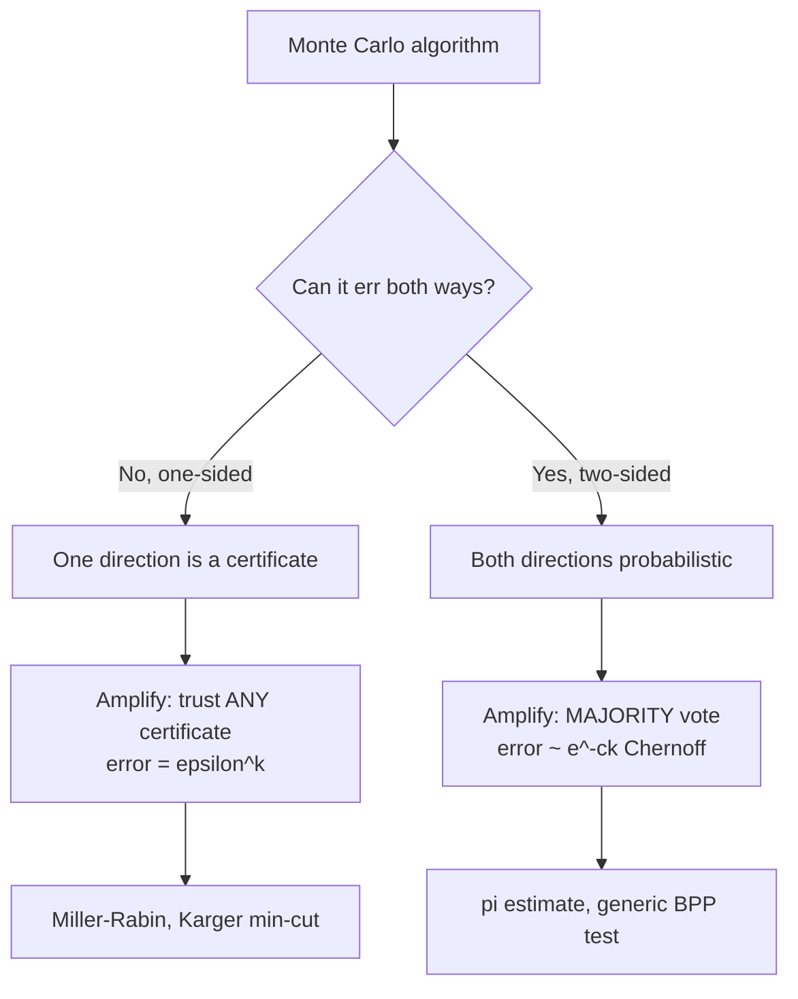
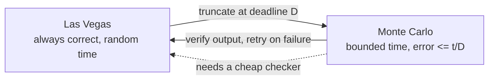

# Monte Carlo vs Las Vegas Randomized Algorithms — Middle Level

> **Focus:** *Why* the two paradigms exist and *when* to pick each — the structure of **one-sided vs two-sided error**, how **amplification** (repetition + voting/AND) drives error down geometrically, the precise meaning of **expected running time**, and the two **conversions** (Las Vegas → Monte Carlo by truncation; Monte Carlo → Las Vegas by verification). Worked through the canonical examples: π estimation and Freivalds (MC), randomized quicksort and treaps (LV), and Miller-Rabin (one-sided MC).

---

## Table of Contents

1. [Introduction](#introduction)
2. [Deeper Concepts](#deeper-concepts)
3. [One-Sided vs Two-Sided Error](#one-sided-vs-two-sided-error)
4. [Amplification — Driving Error Down](#amplification--driving-error-down)
5. [Expected Running Time, Precisely](#expected-running-time-precisely)
6. [Converting Between Monte Carlo and Las Vegas](#converting-between-monte-carlo-and-las-vegas)
7. [Comparison with Alternatives](#comparison-with-alternatives)
8. [Code Examples](#code-examples)
9. [Error Handling](#error-handling)
10. [Performance Analysis](#performance-analysis)
11. [Best Practices](#best-practices)
12. [Visual Animation](#visual-animation)
13. [Summary](#summary)

---

## Introduction

At junior level the message was the dichotomy: Monte Carlo fixes time and may err; Las Vegas fixes correctness and varies in time. At middle level you start asking the questions that decide *which paradigm to reach for* and *how to make it good enough*:

- An algorithm can be wrong — but *how*? Only by saying "yes" when the truth is "no" (**one-sided**), or in either direction (**two-sided**)? This shapes how you reduce error.
- If one run has error `1/4`, how many runs make the error `10^-9`, and do you **vote** or **AND** the answers?
- "Expected `O(n log n)`" — averaged over *what*? And why is that different from "average-case `O(n log n)`"?
- Given a Monte Carlo algorithm, can I make it never-wrong (Las Vegas)? Given a Las Vegas algorithm, can I make it meet a deadline (Monte Carlo)? What does each conversion *cost*?

These separate "I can write a randomized algorithm" from "I can choose the right paradigm, prove its error or expected-time bound, and convert between the two when requirements change."

---

## Deeper Concepts

### Randomness over coin flips, not over data

The single most important clarification: when we say a randomized algorithm has "expected time `O(n log n)`" or "error `≤ 1/4`," the probability is taken **over the algorithm's internal random choices**, with the *input fixed*. This is fundamentally stronger than classic **average-case** analysis, which fixes the algorithm (deterministic) and averages over *random inputs*.

| | Random source | Guarantee holds for… |
|---|---------------|----------------------|
| **Average-case (deterministic algo)** | the *input* (assumed random) | only "typical" inputs; an adversary can pick a bad one |
| **Randomized algo (MC/LV)** | the *algorithm's coins* | *every* input — the adversary cannot see your coins |

This is why randomized quicksort beats deterministic quicksort-with-fixed-pivot: the deterministic version has a worst-case input (sorted data), but the randomized version has expected `O(n log n)` on *every* input, because the adversary cannot predict the random pivots.

### Monte Carlo, formally enough

A Monte Carlo algorithm runs in a bounded time `T(n)` and outputs a result that, for every input, is correct with probability `≥ 1 - ε` (over its coins). `ε` is the **error probability**. The defining feature is the *fixed time budget*; correctness is the casualty.

### Las Vegas, formally enough

A Las Vegas algorithm always outputs the correct result, but its running time `T` is a random variable; we report `E[T(n)]` (and often tail bounds — see `professional.md` for Chernoff). The defining feature is *guaranteed correctness*; the time is the casualty.

### The bridge: a Las Vegas algorithm *is* a verifiable Monte Carlo run, repeated

This is the conceptual key (expanded in [Converting](#converting-between-monte-carlo-and-las-vegas)): if you can **cheaply verify** a candidate answer, you can wrap any "produce a maybe-good answer in bounded time" (Monte Carlo) into a "produce-then-check, retry on failure" (Las Vegas). Conversely, truncating a Las Vegas run at a deadline yields a bounded-time (Monte Carlo) algorithm that errs only when it ran out of time.

---

## One-Sided vs Two-Sided Error

Monte Carlo algorithms differ by *which way they can be wrong* — and this dictates how you amplify them.

### One-sided error

The algorithm can only err in **one** direction. The canonical case is a **compositeness test** like Miller-Rabin:

- If `n` is composite, it might (rarely) say "prime" — **possible error**.
- If `n` is prime, it *always* says "prime" — **never errs here**.

Equivalently for the "is it composite?" question: a "yes (composite)" is *always correct* (it found a witness); a "no (probably prime)" might be wrong. **One side of the answer is a certificate.**

Formally this is the class **RP** (randomized polynomial time): for "yes" instances the algorithm accepts with probability `≥ 1/2`; for "no" instances it *never* accepts. So acceptance is proof; rejection is probabilistic.

### Two-sided error

The algorithm can err in **either** direction — both "yes" and "no" can be wrong (each with bounded probability `< 1/2`). The π estimator is two-sided in spirit (the estimate can be too high or too low). Formally this is the class **BPP** (bounded-error probabilistic polynomial time): correct with probability `≥ 2/3` on every input, regardless of the true answer.

### Why the distinction matters

| Error type | A correct-for-sure answer? | How to amplify |
|------------|----------------------------|----------------|
| **One-sided** (e.g. compositeness) | Yes — one direction is a certificate | **Repeat and trust the certificate**: if *any* run gives the certain answer, output it. Error after `k` runs: `ε^k`. |
| **Two-sided** (e.g. an estimate, a yes/no with both-way error) | No | **Majority vote** over `k` runs; error drops via Chernoff (roughly `e^{-ck}`). |

Getting this wrong *increases* error: majority-voting a one-sided test wastes its certificate, and AND-ing a two-sided test is simply incorrect.



---

## Amplification — Driving Error Down

**Amplification** (a.k.a. *probability boosting*) turns a barely-good algorithm (error just under `1/2`) into an essentially-certain one by repetition.

### One-sided amplification (the easy, powerful case)

If a single run has error `ε` (it only ever errs by missing the "yes"), then `k` independent runs all miss only with probability `ε^k`. Trust *any* run that produces the certain answer.

- Miller-Rabin: each random base catches a composite with probability `≥ 3/4`, so error `≤ 1/4` per base; `k` bases give error `≤ (1/4)^k`. For `k = 20`, error `< 10^{-12}`.
- Karger's min-cut: one run finds the minimum cut with probability `≥ 2/(n(n-1)) = Ω(1/n²)`. Repeating `Θ(n² log n)` times and keeping the *smallest* cut found makes the failure probability `≤ 1/n`. (We keep the best because "smaller cut" is a one-sided certificate — a found cut is genuinely that size.)

| `k` runs (one-sided, `ε = 1/4`) | error `ε^k` |
|---------------------------------|-------------|
| 1 | `0.25` |
| 5 | `~0.00098` |
| 10 | `~9.5·10^{-7}` |
| 20 | `~9.1·10^{-13}` |
| 40 | `~8.3·10^{-25}` |

### Two-sided amplification (majority vote)

If a single run is correct with probability `≥ 1/2 + δ`, then the **majority** of `k` independent runs is correct with probability `≥ 1 - e^{-2δ²k}` (Chernoff bound; derived in `professional.md`). The error still drops exponentially in `k`, just with a worse constant than the one-sided case — you need a *gap* `δ` above `1/2`, and you must take the majority, not trust a single run.

### Amplification is cheap

Both forms drive error from "a coin flip" to "less likely than a hardware failure" with a *logarithmic* number of repetitions: to reach error `≤ 2^{-t}` you need `O(t)` runs (one-sided) or `O(t/δ²)` runs (two-sided). This is why Monte Carlo algorithms are practical — a handful of repetitions buys cryptographic-grade reliability.

---

## Expected Running Time, Precisely

For a Las Vegas algorithm, the running time `T` is a random variable; we summarize it by its **expectation** `E[T]`.

### The geometric retry bound

The workhorse: if each independent attempt succeeds with probability `p > 0`, the number of attempts until the first success is **geometrically distributed** with mean `1/p`.

```
E[number of attempts] = 1/p
```

So a Las Vegas "retry until good" loop where each try succeeds with probability `p` and costs `c` work does expected work `c/p`. Examples:

- Roll a die until a 6: `p = 1/6`, expected `6` rolls.
- Random pivot that is "good" (in the middle half): `p ≥ 1/2`, expected `≤ 2` tries.
- Treap rotations to restore the heap property after an insert: expected `O(log n)` per operation, because expected depth is `O(log n)`.

### Linearity of expectation

The other workhorse: `E[X + Y] = E[X] + E[Y]` **even if `X` and `Y` are dependent**. This is how randomized quicksort's `O(n log n)` expectation is proved without untangling correlations: define an indicator `X_{ij}` for "elements `i` and `j` are ever compared," sum the expectations, and the total comparisons come out to `~2n ln n`. (Full derivation in `professional.md`.)

### Expected vs worst-case

Expected time is an *average over the coins*; an individual unlucky run can exceed it. Randomized quicksort is expected `O(n log n)` but has a (vanishingly unlikely) `O(n²)` worst case over bad coin sequences. Tail bounds (Markov, Chebyshev, Chernoff) quantify how unlikely the slow runs are — see `professional.md`.

| Quantity | Meaning | Tool |
|----------|---------|------|
| `E[T]` | average time over coins | linearity of expectation, geometric mean `1/p` |
| `P[T > c·E[T]]` | chance of a much-slower run | Markov / Chebyshev / Chernoff |
| worst-case `T` | the unluckiest coins | usually bad, but astronomically rare |

---

## Converting Between Monte Carlo and Las Vegas

The two paradigms are not isolated — you can transform one into the other, which is exactly how you adapt a randomized algorithm to changing requirements.

### Las Vegas → Monte Carlo (truncation)

Take a Las Vegas algorithm with expected time `E[T] = t`. Run it but **stop after a deadline `D`**; if it has not finished, output a default/guess. By Markov's inequality, `P[T > D] ≤ t/D`, so choosing `D = t/ε` makes the algorithm finish (and be correct) with probability `≥ 1 - ε`, in *bounded* time `D`. You have converted "always correct, random time" into "bounded time, error `≤ ε`."

```
MC_from_LV(input, deadline D):
    run LV(input) for at most D steps
    if finished:   return its (correct) answer
    else:          return a guess        # the only source of error
```

### Monte Carlo → Las Vegas (verification)

Take a Monte Carlo algorithm with success probability `p` whose output you can **cheaply verify** for correctness. Run it; if the output is correct, return it; if not, retry. The result is *always correct* (you only return verified outputs), with expected `1/p` runs. You have converted "bounded time, maybe wrong" into "always correct, random time."

```
LV_from_MC(input):
    while True:
        ans = MC(input)
        if verify(ans, input):   return ans     # always correct
```

> **The catch:** this conversion *requires a checker*. For Miller-Rabin you cannot cheaply verify "prime," so you cannot turn it Las Vegas this way (you would need an independent primality *proof*). For sorting you *can* verify (one linear scan), so randomized quicksort is naturally Las Vegas. **Verifiability is the dividing line.**

### The relationship in one picture



This is also why theorists note **ZPP = RP ∩ co-RP**: a problem solvable with zero-error expected-poly-time (ZPP, the Las Vegas class) is exactly one solvable by a one-sided-error MC *and* its complement's one-sided-error MC — run both, and whichever gives its certain answer is correct, retrying otherwise. (Intuition here; formalized in `professional.md`.)

---

## Comparison with Alternatives

| Attribute | Monte Carlo | Las Vegas | Deterministic |
|-----------|-------------|-----------|---------------|
| Running time | bounded (fixed) | random (expected bound) | fixed |
| Correctness | probabilistic (error `≤ ε`) | always correct | always correct |
| Beats adversarial worst case? | yes (coins hidden) | yes (coins hidden) | no — has a worst-case input |
| Needs a verifier? | no | for the MC→LV construction, yes | n/a |
| Error tunable by work? | yes (amplify) | n/a | n/a |
| Typical use | deadlines, hard-to-verify answers, estimates | correctness-critical with cheap checks | when a fast exact algo exists |

**Choose Monte Carlo when:** there is a hard deadline; an approximate or high-probability answer suffices; or the answer cannot be cheaply verified (so you cannot retry to confirm). Examples: π/integral estimation, Freivalds' matrix-product check, Miller-Rabin, Karger's min-cut, Bloom-filter membership.

**Choose Las Vegas when:** correctness is mandatory *and* you can cheaply check success, and variable time is acceptable. Examples: randomized quicksort/quickselect, treaps, skip lists, hashing with re-hash on collision storms.

**Choose deterministic when:** a fast exact algorithm exists and there is no adversary/worst-case concern, or when reproducibility/auditing forbids randomness.

### Worked example contrast — Freivalds vs deterministic verification

To check whether `A·B = C` for `n×n` matrices: computing `A·B` and comparing costs `O(n³)` (or `O(n^2.37)` with fast multiplication). **Freivalds' algorithm** (Monte Carlo) picks a random 0/1 vector `r` and checks `A·(B·r) = C·r` in `O(n²)`; if `A·B ≠ C`, this catches it with probability `≥ 1/2`, so `k` repetitions give error `≤ 2^{-k}`. This is one-sided: if it ever reports "unequal," they truly are unequal (a certificate); "equal" is probabilistic. It is dramatically cheaper than recomputing the product — the archetypal "verify, don't recompute" Monte Carlo win.

---

## Code Examples

### Monte Carlo with amplification — Freivalds' matrix-product check (one-sided)

#### Go

```go
package main

import (
	"fmt"
	"math/rand"
)

// matVec multiplies n x n matrix M by vector v.
func matVec(M [][]int, v []int) []int {
	n := len(v)
	out := make([]int, n)
	for i := 0; i < n; i++ {
		s := 0
		for j := 0; j < n; j++ {
			s += M[i][j] * v[j]
		}
		out[i] = s
	}
	return out
}

// freivaldsOnce returns true if A*B == C might hold; false PROVES A*B != C.
// One-sided error: a "false" is certain; a "true" is only probable.
func freivaldsOnce(A, B, C [][]int) bool {
	n := len(A)
	r := make([]int, n)
	for i := range r {
		r[i] = rand.Intn(2) // random 0/1 vector
	}
	// Check A*(B*r) == C*r in O(n^2).
	Br := matVec(B, r)
	ABr := matVec(A, Br)
	Cr := matVec(C, r)
	for i := 0; i < n; i++ {
		if ABr[i] != Cr[i] {
			return false // certificate of inequality
		}
	}
	return true
}

// freivalds amplifies: error <= (1/2)^k.
func freivalds(A, B, C [][]int, k int) bool {
	for i := 0; i < k; i++ {
		if !freivaldsOnce(A, B, C) {
			return false // any failure is a certain "not equal"
		}
	}
	return true // probably equal, error <= (1/2)^k
}

func main() {
	A := [][]int{{1, 2}, {3, 4}}
	B := [][]int{{5, 6}, {7, 8}}
	C := [][]int{{19, 22}, {43, 50}} // correct A*B
	fmt.Println(freivalds(A, B, C, 20)) // true (probably equal)
	C[0][0] = 0
	fmt.Println(freivalds(A, B, C, 20)) // false (certainly not equal)
}
```

#### Java

```java
import java.util.Random;

public class Freivalds {
    static final Random RNG = new Random();

    static int[] matVec(int[][] M, int[] v) {
        int n = v.length;
        int[] out = new int[n];
        for (int i = 0; i < n; i++) {
            int s = 0;
            for (int j = 0; j < n; j++) s += M[i][j] * v[j];
            out[i] = s;
        }
        return out;
    }

    // One-sided: "false" is certain, "true" is probable.
    static boolean freivaldsOnce(int[][] A, int[][] B, int[][] C) {
        int n = A.length;
        int[] r = new int[n];
        for (int i = 0; i < n; i++) r[i] = RNG.nextInt(2);
        int[] ABr = matVec(A, matVec(B, r));
        int[] Cr = matVec(C, r);
        for (int i = 0; i < n; i++) if (ABr[i] != Cr[i]) return false;
        return true;
    }

    static boolean freivalds(int[][] A, int[][] B, int[][] C, int k) {
        for (int i = 0; i < k; i++) if (!freivaldsOnce(A, B, C)) return false;
        return true; // error <= (1/2)^k
    }

    public static void main(String[] args) {
        int[][] A = {{1, 2}, {3, 4}}, B = {{5, 6}, {7, 8}};
        int[][] C = {{19, 22}, {43, 50}};
        System.out.println(freivalds(A, B, C, 20)); // true
        C[0][0] = 0;
        System.out.println(freivalds(A, B, C, 20)); // false
    }
}
```

#### Python

```python
import random


def mat_vec(M, v):
    return [sum(M[i][j] * v[j] for j in range(len(v))) for i in range(len(v))]


def freivalds_once(A, B, C):
    """One-sided: a False is certain (A*B != C); a True is only probable."""
    n = len(A)
    r = [random.randint(0, 1) for _ in range(n)]
    abr = mat_vec(A, mat_vec(B, r))
    cr = mat_vec(C, r)
    return abr == cr


def freivalds(A, B, C, k=20):
    return all(freivalds_once(A, B, C) for _ in range(k))  # error <= (1/2)^k


if __name__ == "__main__":
    A = [[1, 2], [3, 4]]
    B = [[5, 6], [7, 8]]
    C = [[19, 22], [43, 50]]
    print(freivalds(A, B, C))   # True
    C[0][0] = 0
    print(freivalds(A, B, C))   # False
```

### Las Vegas — randomized quickselect (always correct, expected `O(n)`)

This finds the `k`-th smallest element; the answer is always correct, the time is random.

#### Go

```go
package main

import (
	"fmt"
	"math/rand"
)

// quickselect returns the k-th smallest (0-indexed) element. Always correct;
// expected O(n) time because the random pivot is "good" with prob >= 1/2.
func quickselect(a []int, k int) int {
	if len(a) == 1 {
		return a[0]
	}
	pivot := a[rand.Intn(len(a))] // random pivot -> Las Vegas
	var lo, hi, eq []int
	for _, v := range a {
		switch {
		case v < pivot:
			lo = append(lo, v)
		case v > pivot:
			hi = append(hi, v)
		default:
			eq = append(eq, v)
		}
	}
	switch {
	case k < len(lo):
		return quickselect(lo, k)
	case k < len(lo)+len(eq):
		return pivot
	default:
		return quickselect(hi, k-len(lo)-len(eq))
	}
}

func main() {
	a := []int{7, 2, 9, 4, 1, 8, 5}
	fmt.Println(quickselect(append([]int{}, a...), 0)) // 1 (smallest)
	fmt.Println(quickselect(append([]int{}, a...), 3)) // 5 (median)
}
```

#### Java

```java
import java.util.*;

public class QuickSelect {
    static final Random RNG = new Random();

    static int quickselect(List<Integer> a, int k) {
        if (a.size() == 1) return a.get(0);
        int pivot = a.get(RNG.nextInt(a.size())); // random pivot
        List<Integer> lo = new ArrayList<>(), hi = new ArrayList<>(), eq = new ArrayList<>();
        for (int v : a) {
            if (v < pivot) lo.add(v);
            else if (v > pivot) hi.add(v);
            else eq.add(v);
        }
        if (k < lo.size()) return quickselect(lo, k);
        if (k < lo.size() + eq.size()) return pivot;
        return quickselect(hi, k - lo.size() - eq.size());
    }

    public static void main(String[] args) {
        List<Integer> a = Arrays.asList(7, 2, 9, 4, 1, 8, 5);
        System.out.println(quickselect(new ArrayList<>(a), 0)); // 1
        System.out.println(quickselect(new ArrayList<>(a), 3)); // 5
    }
}
```

#### Python

```python
import random


def quickselect(a, k):
    """k-th smallest (0-indexed). Always correct; expected O(n) (Las Vegas)."""
    if len(a) == 1:
        return a[0]
    pivot = random.choice(a)           # random pivot
    lo = [v for v in a if v < pivot]
    hi = [v for v in a if v > pivot]
    eq = [v for v in a if v == pivot]
    if k < len(lo):
        return quickselect(lo, k)
    if k < len(lo) + len(eq):
        return pivot
    return quickselect(hi, k - len(lo) - len(eq))


if __name__ == "__main__":
    a = [7, 2, 9, 4, 1, 8, 5]
    print(quickselect(a, 0))  # 1
    print(quickselect(a, 3))  # 5
```

**What they show:** Freivalds is a *one-sided Monte Carlo* algorithm amplified by repetition (error `≤ 2^{-k}`); quickselect is a *Las Vegas* algorithm whose answer is always correct while its time is random (expected `O(n)`).

---

## Error Handling

| Scenario | What goes wrong | Correct approach |
|----------|-----------------|------------------|
| Majority-voting a one-sided test | wastes the certificate; can *raise* error | one-sided → trust ANY certain answer (AND/OR, not vote) |
| AND-ing a two-sided test | logically wrong; error explodes | two-sided → majority vote |
| LV→MC with deadline too small | error `t/D` too high | set `D = t/ε` for target error `ε` (Markov) |
| MC→LV without a checker | cannot guarantee correctness | only convert when output is cheaply verifiable |
| Reused random vector in Freivalds | repetitions not independent → bound voids | draw a fresh `r` each round |
| Expected-time loop with `p = 0` | never terminates | ensure success probability `p > 0` |
| Treating expected time as a hard bound | a slow run blows a deadline | use tail bounds; or truncate (LV→MC) for real-time |

---

## Performance Analysis

| Algorithm | Paradigm | Time | Error / guarantee |
|-----------|----------|------|-------------------|
| π darts, `N` samples | MC, two-sided | `O(N)` | typical error `~ 1/√N` |
| Freivalds, `k` rounds | MC, one-sided | `O(k n²)` | error `≤ 2^{-k}` |
| Miller-Rabin, `k` bases | MC, one-sided | `O(k log³ n)` | error `≤ 4^{-k}` |
| Karger min-cut, `T` runs | MC, one-sided | `O(T·n²)` | fail `≤ (1 - 2/n²)^T` |
| Randomized quicksort | LV | expected `O(n log n)` | always correct |
| Quickselect | LV | expected `O(n)` | always correct |
| Treap op | LV | expected `O(log n)` | always correct |

Two recurring laws to internalize:

1. **Amplification is logarithmic in the target error.** To reach error `2^{-t}` you pay `O(t)` repetitions (one-sided) — cheap. This is why "run Miller-Rabin 40 times" is trivial yet gives `4^{-40}` error.
2. **Expected time obeys `1/p` and linearity.** A retry loop with per-try success `p` costs `1/p` tries on average; sums of (even dependent) costs add by linearity of expectation, which is how the `O(n log n)` quicksort bound falls out.

```python
import math

# One-sided amplification: rounds needed for a target error.
def rounds_for_error(eps_single, target):
    # eps_single^k <= target  ->  k >= log(target)/log(eps_single)
    return math.ceil(math.log(target) / math.log(eps_single))

print(rounds_for_error(0.25, 1e-12))  # ~20 bases for Miller-Rabin
print(rounds_for_error(0.5, 1e-9))    # ~30 rounds for a 1/2-error one-sided test
```

The biggest practical levers: choose the **right error model** (so amplification is efficient), make Las Vegas **success checks cheap** (so retries are affordable), and pick `N`/`k`/deadline to *just* meet the requirement — over-provisioning randomness wastes work.

---

## Best Practices

- **Identify the error model first** (one-sided vs two-sided); it dictates AND-vs-vote amplification.
- **Amplify to the stakes, not to paranoia:** `k = 20`–`40` rounds already reach error below hardware-failure rates.
- **For Las Vegas, ensure a cheap, correct success check** — it is what makes retries (and the MC→LV conversion) possible.
- **Quote the right metric:** error probability for Monte Carlo, expected (and tail) time for Las Vegas.
- **Convert deliberately:** truncate Las Vegas → Monte Carlo for hard deadlines; verify-and-retry Monte Carlo → Las Vegas when correctness is mandatory and checkable.
- **Use independent randomness across rounds** — shared/reused random values void the `ε^k` and Chernoff bounds.
- **Seed for reproducible tests, randomize (CSPRNG when adversarial) in production.**
- **Validate against a deterministic oracle** on small inputs when one exists.

---

## Visual Animation

> See [`animation.html`](./animation.html) for the interactive view.
>
> The middle-level animation highlights:
> - **Monte Carlo π convergence:** the running estimate moving toward π and the **error-vs-iterations** curve flattening like `1/√N` (the diminishing-returns law).
> - **Las Vegas retries:** the success probability `p` controlling the expected number of tries `1/p`, with a live average that converges to `1/p`.
> - A side-by-side framing of "fixed time / wobbly answer" (MC) vs "fixed answer / wobbly time" (LV).

---

## Summary

The two paradigms answer the question *"which guarantee can I not give up?"* — **Monte Carlo** keeps the **time bounded** and tolerates a tunable **error**, while **Las Vegas** keeps the **answer correct** and tolerates a random **expected time**. Monte Carlo errors come in two flavours: **one-sided** (one direction is a certificate, e.g. Miller-Rabin's "composite," Freivalds' "unequal," Karger's "this cut exists"), amplified by *trusting any certificate* so error falls as `ε^k`; and **two-sided** (e.g. an estimate), amplified by *majority vote* with Chernoff-driven exponential decay. Las Vegas time is governed by two tools — the geometric mean `1/p` for retry loops and **linearity of expectation** for sums of costs — giving bounds like quicksort's expected `O(n log n)`. The paradigms convert into each other: **truncate** a Las Vegas algorithm at a deadline (Markov gives error `≤ t/D`) to get Monte Carlo, and **verify-and-retry** a Monte Carlo algorithm (when a cheap checker exists) to get Las Vegas — verifiability being the dividing line, and the reason ZPP = RP ∩ co-RP. Pick the paradigm by your hard constraint, amplify to the stakes, and keep your success checks cheap.

---

**Next step:** Continue to [`senior.md`](./senior.md) for choosing a paradigm in real systems — controlling failure probability against an SLA, reproducibility and seeding, and distributed randomness.
