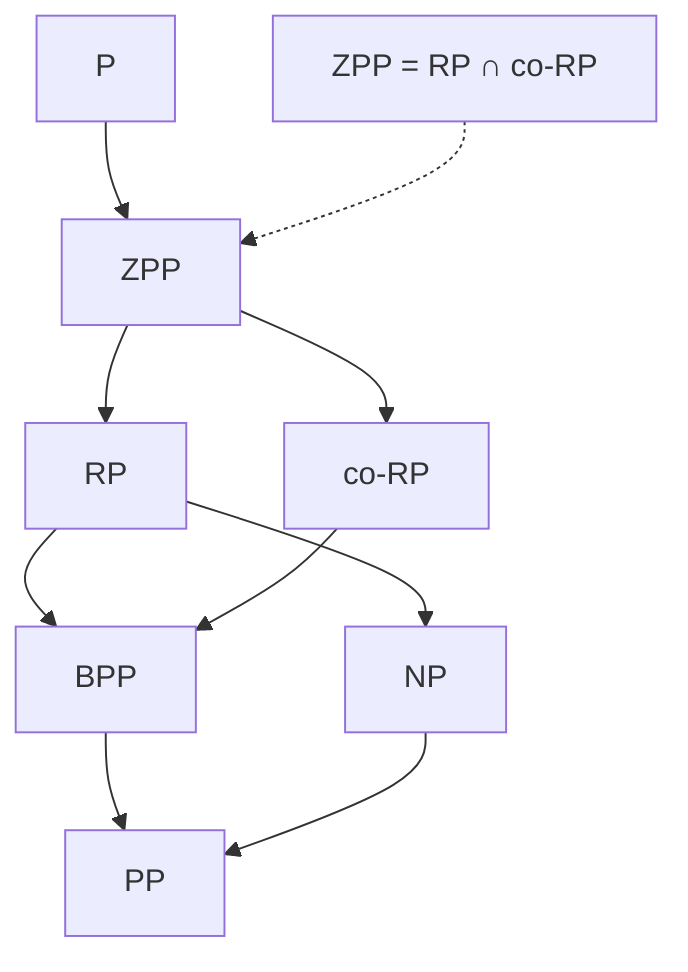

# Monte Carlo vs Las Vegas — Mathematical Foundations and Complexity Theory

> **Focus:** the formal theory beneath the two paradigms. Precise definitions via the **probabilistic complexity classes** RP, co-RP, ZPP, BPP (and PP) and the relationships between them; **probability amplification** with explicit Chernoff bounds for the two-sided case and the trivial `ε^k` bound for the one-sided case; **expected-time proofs** for Las Vegas algorithms (geometric retries, linearity of expectation, the randomized-quicksort comparison count); the rigorous **Monte Carlo ↔ Las Vegas conversions** (truncation via Markov, verification via geometric expectation) and the identity **ZPP = RP ∩ co-RP**; and an overview of **derandomization** (method of conditional expectations, pairwise independence, and the BPP ⊆ P conjecture).

---

## Table of Contents

1. [Formal Definitions — The Probabilistic Classes](#formal-definitions)
2. [The Class Inclusion Map](#the-class-inclusion-map)
3. [Probability Amplification — Bounds and Proofs](#probability-amplification)
4. [Expected-Time Analysis of Las Vegas Algorithms](#expected-time-analysis)
5. [Converting Between Monte Carlo and Las Vegas](#converting-between-monte-carlo-and-las-vegas)
6. [ZPP = RP ∩ co-RP — A Proof](#zpp--rp--co-rp)
7. [Derandomization Overview](#derandomization-overview)
8. [Comparison with Alternatives](#comparison-with-alternatives)
9. [Worked Code / Pseudocode](#worked-code--pseudocode)
10. [Summary](#summary)

---

## Formal Definitions

A randomized algorithm is a Turing machine with access to a stream of fair, independent random bits. For input `x` of length `n = |x|`, let `r` be the random string; the machine's output is a random variable over the choice of `r`. We classify *decision problems* (languages `L ⊆ {0,1}*`) by the kind of error and time the machine permits. Throughout, "polynomial time" means the running time is bounded by a polynomial in `n` for **every** random string (a worst-case time bound), unless the class explicitly allows expected time.

### RP — Randomized Polynomial time (one-sided error, false negatives only)

```text
L ∈ RP iff there is a poly-time randomized M such that:
  x ∈ L   =>   Pr[ M(x) accepts ] ≥ 1/2
  x ∉ L   =>   Pr[ M(x) accepts ] = 0      (never wrong on "no")
```

An accept is a **certificate**: it can only happen for genuine "yes" instances. A reject might be a false negative (a "yes" instance unlucky in its coins). The `1/2` is arbitrary — any constant in `(0,1)`, or even `1/poly(n)`, defines the same class after amplification. Example: COMPOSITES ∈ RP (Miller-Rabin: a witness proves compositeness; "probably prime" may be wrong).

### co-RP — the complement (false positives only)

```text
L ∈ co-RP iff L̄ ∈ RP, equivalently:
  x ∈ L   =>   Pr[ M(x) accepts ] = 1        (never wrong on "yes")
  x ∉ L   =>   Pr[ M(x) accepts ] ≤ 1/2
```

Here a *reject* is the certificate. PRIMES ∈ co-RP for the same Miller-Rabin reason (a witness rejects a non-prime with certainty).

### ZPP — Zero-error Probabilistic Polynomial time (the Las Vegas class)

```text
L ∈ ZPP iff there is a randomized M that ALWAYS outputs the correct answer
(accept/reject), and whose EXPECTED running time is polynomial:
  for all x:  M(x) is correct with probability 1,  and  E[ time_M(x) ] = poly(n).
```

ZPP is the formal home of **Las Vegas**: never wrong, expected-poly time. Equivalently, ZPP is the class of languages with a poly-time algorithm that may output `{accept, reject, ?}`, is never wrong when it commits, and outputs `?` with probability `≤ 1/2`; rerunning on `?` gives expected-poly time.

### BPP — Bounded-error Probabilistic Polynomial time (two-sided error)

```text
L ∈ BPP iff there is a poly-time randomized M with a two-sided gap:
  x ∈ L   =>   Pr[ M(x) accepts ] ≥ 2/3
  x ∉ L   =>   Pr[ M(x) accepts ] ≤ 1/3
```

BPP permits error in *both* directions, bounded away from `1/2` by a constant gap. The `2/3` is again arbitrary — Chernoff amplification (below) drives the gap to `1 - 2^{-poly(n)}`. BPP is the standard formalization of "efficiently solvable with randomness." The intuition tags from `middle.md`: one-sided MC ↔ RP/co-RP; two-sided MC ↔ BPP; Las Vegas ↔ ZPP.

### PP — Probabilistic Polynomial time (unbounded error, for contrast)

```text
x ∈ L  =>  Pr[accept] > 1/2 ;   x ∉ L  =>  Pr[accept] ≤ 1/2.
```

PP allows the gap to shrink like `2^{-n}`, so amplification needs exponentially many repetitions — PP is *not* a practical "feasible with randomness" class (it contains NP). It is included only to mark the boundary: **bounded** error (BPP) is the practical line; PP is not.

---

## The Class Inclusion Map



Established inclusions (all proofs are short; the key ones are below):

| Inclusion | Why |
|-----------|-----|
| `P ⊆ ZPP` | a deterministic algorithm is a zero-error one that ignores its coins |
| `ZPP ⊆ RP` and `ZPP ⊆ co-RP` | truncate the Las Vegas run; if unfinished, guess the "no" (resp. "yes") side |
| `ZPP = RP ∩ co-RP` | proven in its own section below |
| `RP ⊆ BPP`, `co-RP ⊆ BPP` | one-sided error is a special case of two-sided error |
| `RP ⊆ NP` | an accepting random string is a poly-size, poly-checkable witness |
| `BPP ⊆ PP` | tighten/loosen the threshold |

Open questions of note: whether `BPP = P` (widely conjectured **true** under standard derandomization hypotheses — see [Derandomization](#derandomization-overview)), and the exact relation of BPP to NP (BPP ⊆ Σ₂ ∩ Π₂ is known, by Sipser–Gács–Lautemann).

---

## Probability Amplification

Amplification turns a weak gap into an overwhelming one by independent repetition. The two cases differ fundamentally in *how* you combine the runs.

### One-sided (RP / co-RP): trust any certificate

Let `M` be an RP machine with `Pr[accept | x ∈ L] ≥ p` and `Pr[accept | x ∉ L] = 0`. Run `M` `k` times independently and **accept iff any run accepts**.

```text
For x ∉ L:   every run rejects (error 0), so the combined error stays 0. ✓
For x ∈ L:   the combined algorithm errs only if ALL k runs reject:
             Pr[all reject] ≤ (1 - p)^k.
```

So error `≤ (1-p)^k`, exponentially small in `k`, with **no gap requirement** — `p` can be as small as `1/poly(n)` and `k = poly(n)` still drives error below `2^{-n}`. For Miller-Rabin, `p ≥ 3/4` per base (error `≤ 1/4`), so `k` bases give error `≤ 4^{-k}`.

| `k` (one-sided, error `1/4` each) | bound `(1/4)^k` |
|-----------------------------------|-----------------|
| 10 | `≈ 9.5·10⁻⁷` |
| 20 | `≈ 9.1·10⁻¹³` |
| 64 | `≈ 2.9·10⁻³⁹` (≈ `2⁻¹²⁸`) |

### Two-sided (BPP): majority vote + Chernoff

For BPP we cannot trust a single run — both directions can lie. Run `M` `k` times and **take the majority**. Correctness follows from a Chernoff bound.

**Setup.** Suppose each run is correct with probability `≥ 1/2 + δ` (gap `δ > 0`; for the canonical `2/3` definition, `δ = 1/6`). Let `X_i = 1` if run `i` is correct, `X_i = 0` otherwise, independent, with `E[X_i] ≥ 1/2 + δ`. Let `X = Σ X_i`, `μ = E[X] ≥ (1/2 + δ)k`. The majority is **wrong** only if `X ≤ k/2`.

**Chernoff bound (lower tail).** For independent `X_i ∈ {0,1}` and any `0 < γ < 1`,

```text
Pr[ X ≤ (1 - γ) μ ] ≤ exp( - μ γ² / 2 ).
```

We need `X ≤ k/2`. Since `μ ≥ (1/2 + δ)k`, write `k/2 = (1 - γ)μ` with
`γ = 1 - (k/2)/μ ≥ 1 - (k/2)/((1/2+δ)k) = (δ)/(1/2+δ) ≥ δ` (for `δ ≤ 1/2`). Hence

```text
Pr[ majority wrong ] = Pr[ X ≤ k/2 ] ≤ exp( - μ γ² / 2 )
                     ≤ exp( - (1/2+δ)k · δ² / 2 )
                     ≤ exp( - δ² k / 2 ).
```

A cleaner, commonly quoted form uses the symmetric Chernoff/Hoeffding estimate directly:

```text
Pr[ majority wrong ] ≤ exp( - 2 δ² k ).
```

Either way: **error decays as `e^{-Θ(δ² k)}`**. To reach error `≤ 2^{-t}` you need `k = O(t/δ²)` repetitions — still polynomial, but with the `1/δ²` penalty that the one-sided case avoids.

| Gap `δ` | repetitions for error `2⁻¹⁰⁰` (`k ≈ 100 ln2 / (2δ²)`) |
|---------|--------------------------------------------------------|
| `1/6` (BPP `2/3`) | `≈ 1250` |
| `1/4` | `≈ 555` |
| `0.49` (barely > 1/2) | `≈ 145000` |

This table is the quantitative reason one-sided algorithms (Miller-Rabin, Freivalds, Karger) are preferred when available: the certificate makes amplification `O(t)` rather than `O(t/δ²)`.

### Why the gap cannot be zero

If `δ = 0` (correct with probability exactly `1/2`), the majority of independent fair coins is correct with probability `→ 1/2` — no amount of repetition helps. This is precisely why PP (which permits `δ = 2^{-n}`) is not amplifiable in polynomial time, while BPP (constant `δ`) is.

---

## Expected-Time Analysis

Las Vegas algorithms are analyzed by their **expected running time**, a random variable's expectation over the algorithm's coins for a *fixed* input. Two tools do almost all the work: the geometric mean `1/p` and linearity of expectation.

### The geometric retry bound (proof)

Let each independent attempt succeed with probability `p > 0`, and let `T` be the number of attempts until the first success. `T` is **geometric**: `Pr[T = t] = (1-p)^{t-1} p`. Then

```text
E[T] = Σ_{t≥1} t (1-p)^{t-1} p
     = p · d/dq [ Σ q^t ]|_{q=1-p}      (standard generating-function trick)
     = p · 1/(1-q)² |_{q=1-p}
     = p / p² = 1/p.                      QED
```

A Las Vegas "retry until verified good" loop where each attempt costs `c` work therefore has expected total work `c/p`. Tail: `Pr[T > t] = (1-p)^t`, the bound the senior-level retry cap uses.

### Linearity of expectation and randomized quicksort

**Theorem.** Randomized quicksort (pivot chosen uniformly at random each call) makes expected `2n ln n + O(n) ≈ 1.39 n log₂ n` comparisons on any input of `n` distinct elements; it is always correct, hence a Las Vegas algorithm with expected time `O(n log n)`.

**Proof (the indicator-variable argument).** Sort the elements as `z₁ < z₂ < … < z_n`. Define the indicator

```text
X_{ij} = 1 if z_i and z_j are ever directly compared, else 0   (for i < j).
```

Total comparisons `X = Σ_{i<j} X_{ij}`. By **linearity of expectation** (which needs no independence),

```text
E[X] = Σ_{i<j} E[X_{ij}] = Σ_{i<j} Pr[ z_i and z_j are compared ].
```

Two elements `z_i, z_j` are compared **iff** the first pivot chosen from the contiguous set `Z_{ij} = {z_i, z_{i+1}, …, z_j}` is either `z_i` or `z_j`. (If some interior `z_m` is picked first, it splits `z_i` from `z_j` into different subarrays, and they are never compared; if `z_i` or `z_j` is picked first, they are compared exactly once.) Since the pivot is uniform over the `|Z_{ij}| = j - i + 1` elements,

```text
Pr[ z_i, z_j compared ] = 2 / (j - i + 1).
```

Therefore

```text
E[X] = Σ_{i<j} 2/(j-i+1)
     = Σ_{i=1}^{n-1} Σ_{k=1}^{n-i} 2/(k+1)
     < 2 Σ_{i=1}^{n-1} H_n          (H_n = harmonic number ≈ ln n)
     = 2(n-1) H_n = 2n ln n + O(n).  QED
```

Note what the proof did **not** need: the `X_{ij}` are highly dependent, yet linearity sums their expectations regardless. This is the signature technique for Las Vegas expected-time bounds.

### Expected vs high-probability time

`E[T]` is a mean; an individual run can exceed it. Tail bounds quantify how rarely:

| Tool | Statement | Use |
|------|-----------|-----|
| **Markov** | `Pr[T ≥ a] ≤ E[T]/a` | weakest; needs only `E[T] ≥ 0`; powers the LV→MC truncation |
| **Chebyshev** | `Pr[|T-μ| ≥ a] ≤ Var/a²` | needs variance; quadratic decay |
| **Chernoff** | `Pr[T ≥ (1+γ)μ] ≤ e^{-μγ²/3}` | needs independence/sum structure; exponential decay |

Quicksort's depth is `O(log n)` with high probability `1 - n^{-c}` by a Chernoff argument on the recursion depth, so the `O(n²)` worst case occurs with probability vanishing faster than any polynomial.

### A second one-sided showcase: Karger's min-cut and the success-probability proof

Karger's contraction algorithm is a one-sided Monte Carlo (RP-flavoured) algorithm whose analysis is the canonical example of a *small but boostable* success probability. It repeatedly contracts a uniformly random edge until two vertices remain; the surviving edges form a cut. It is one-sided in the sense that any cut it returns *genuinely exists* (a certificate of "the min cut is no larger than this"), so we keep the smallest over many runs.

**Theorem.** A single run returns a fixed minimum cut with probability `≥ 2 / (n(n-1)) = 1 / C(n,2)`.

**Proof.** Fix a minimum cut of size `t`. Each vertex has degree `≥ t` (else its single-vertex cut would be smaller), so the graph has `≥ nt/2` edges. The minimum cut survives the whole process iff no edge of the cut is ever contracted. At the `i`-th contraction (when `n - i + 1` vertices remain) the probability of *not* hitting a cut edge is

```text
1 - t / (#edges at step i)  ≥  1 - t / ((n-i+1)t/2)  =  1 - 2/(n-i+1)  =  (n-i-1)/(n-i+1).
```

Multiplying over `i = 1 … n-2` telescopes:

```text
Pr[cut survives] ≥ Π_{i=1}^{n-2} (n-i-1)/(n-i+1)
                 = [ (n-2)/n ] · [ (n-3)/(n-1) ] · … · [ 1/3 ]
                 = 2 / (n(n-1)) = 1 / C(n,2).   QED
```

**Amplification.** Run the algorithm `T = C(n,2) · ln n` times and keep the smallest cut. The probability *all* runs miss the fixed min cut is

```text
(1 - 1/C(n,2))^{T}  ≤  e^{-T/C(n,2)}  =  e^{-ln n}  =  1/n.
```

So `Θ(n² log n)` runs drive the failure probability to `≤ 1/n` — exactly the "trust the best certificate" amplification of `(1-p)^k` with `p = 1/C(n,2)`. This is the worked instance of why a *polynomially small* success probability is still fine for an RP-style algorithm: `k = poly(n)` repetitions suffice.

### Variance and Chebyshev for estimators

For an *estimator* like Monte Carlo π (a two-sided, real-valued Monte Carlo), the relevant bound is on the spread of the estimate. Let `X̂_N = (4/N) Σ Y_i` where `Y_i = 1` if dart `i` lands inside, `Pr[Y_i = 1] = π/4`. Each `Y_i` is Bernoulli, so

```text
E[X̂_N] = 4 · (π/4) = π          (unbiased)
Var[X̂_N] = 16 · Var[Y_i]/N = 16 · (π/4)(1 - π/4)/N = c/N,  with c ≈ 2.70.
```

The standard deviation is `√(c/N) = Θ(1/√N)` — the rigorous source of the `1/√N` "diminishing returns" law quoted at junior level. Chebyshev then gives a tail bound on the estimate's error:

```text
Pr[ |X̂_N - π| ≥ a ]  ≤  Var/a²  =  c / (N a²).
```

To make the error exceed `a` with probability `≤ δ`, take `N ≥ c/(δ a²)` samples — quadratic in `1/a`, the formal statement of "one more digit costs ~100× the darts." Note the contrast with the *decision* problems above: estimators get only **polynomial (Chebyshev/`1/√N`) concentration** from independent sampling, whereas boolean BPP votes get **exponential (Chernoff) concentration**. This is why Monte Carlo estimation converges slowly while Monte Carlo *decisions* amplify cheaply.

---

## Converting Between Monte Carlo and Las Vegas

The conversions of `middle.md`, now with the inequalities proven.

### Las Vegas → Monte Carlo (truncation, via Markov)

Let `A` be Las Vegas with `E[T(x)] = t`. Define `A'` = "run `A` for at most `D` steps; if finished, output its (correct) answer; else output a fixed guess."

```text
A' runs in bounded time D (Monte Carlo).
A' errs only if A did not finish in time:  Pr[error] ≤ Pr[T > D] ≤ t/D   (Markov).
Choosing D = t/ε gives error ≤ ε in time t/ε.
```

This proves `ZPP ⊆ RP` (and `ZPP ⊆ co-RP`): pick the guess to be the side that keeps one-sided error (e.g. always guess "reject" to preserve "never wrong on yes," giving co-RP).

### Monte Carlo → Las Vegas (verification, via geometric expectation)

Let `A` be Monte Carlo with success probability `≥ p` and suppose a deterministic checker `verify(ans, x)` runs in time `V` and is correct. Define `A''` = "repeat: `ans ← A(x)`; if `verify(ans, x)` then return `ans`."

```text
A'' returns only verified-correct answers => zero error (Las Vegas).
Expected iterations = 1/p (geometric).  Expected time = (time_A + V)/p = poly.
```

The conversion **requires a checker**; verifiability is the dividing line. Sorting has a linear checker (so randomized quicksort is naturally Las Vegas); primality has no cheap "prime" certificate from Miller-Rabin alone (so it stays Monte Carlo unless you bring an independent primality proof, e.g. AKS or an ECPP certificate).

```mermaid
graph LR
    LV[ZPP / Las Vegas<br/>zero error, E[T]=poly] -->|truncate at D=t/ε, Markov| MC[RP/co-RP / Monte Carlo<br/>time ≤ D, error ≤ ε]
    MC -->|verify + retry, geometric 1/p| LV
    MC -.->|conversion needs a poly-time checker| LV
```

---

## ZPP = RP ∩ co-RP

**Theorem.** `ZPP = RP ∩ co-RP`.

**(⊆) `ZPP ⊆ RP ∩ co-RP`.** Let `L ∈ ZPP` via a zero-error machine `M` with `E[T] = t = poly(n)`. Run `M` for `D = 2t` steps.
- If it finishes, output its correct answer.
- If not, output "reject." By Markov, `Pr[T > 2t] ≤ t/(2t) = 1/2`.

For `x ∉ L`: `M` (when it finishes) rejects, and our timeout default also rejects — so we **never accept** a "no" instance. For `x ∈ L`: we accept whenever `M` finishes, i.e. with probability `≥ 1/2`. That is exactly the RP condition, so `L ∈ RP`. Symmetrically, defaulting to "accept" on timeout gives the co-RP condition, so `L ∈ co-RP`. Hence `L ∈ RP ∩ co-RP`.

**(⊇) `RP ∩ co-RP ⊆ ZPP`.** Let `L ∈ RP ∩ co-RP`. Then there exist:
- `M_RP`: never accepts on `x ∉ L`; accepts with prob `≥ 1/2` on `x ∈ L`. (An *accept* is a certificate of "yes.")
- `M_coRP`: never rejects on `x ∈ L`; rejects with prob `≥ 1/2` on `x ∉ L`. (A *reject* is a certificate of "no.")

Build a zero-error machine: **repeat** — run `M_RP(x)`; if it accepts, output "yes" (certain, since `M_RP` never accepts a no-instance). Else run `M_coRP(x)`; if it rejects, output "no" (certain). Otherwise loop.

Each round produces a definite, *correct* answer with probability `≥ 1/2` (whichever side `x` is on, that side's machine fires its certificate with prob `≥ 1/2`). The number of rounds is geometric with `p ≥ 1/2`, so `E[rounds] ≤ 2` and expected time is poly. The output is always correct ⇒ `L ∈ ZPP`. **QED.**

This identity is the formal statement of the `middle.md` intuition: a Las Vegas algorithm is exactly the intersection of two complementary one-sided Monte Carlo algorithms, run until one of them produces its certificate.

---

## Derandomization Overview

Can randomness be *removed* while keeping efficiency? Often yes — sometimes provably, sometimes conjecturally.

### Method of conditional expectations (concrete derandomization)

Many randomized algorithms guarantee `E[value of random solution] ≥ B`. Since the expectation over random bits is `≥ B`, *some* fixing of the bits achieves `≥ B`. Fix them one at a time, each time choosing the bit value that keeps the conditional expectation `≥ B`:

```text
For each random bit b_i in turn:
    compute E[value | b_1..b_{i-1} fixed, b_i = 0] and ( ... b_i = 1 )
    fix b_i to whichever conditional expectation is larger (both ≥ current ≥ B)
After all bits fixed: a DETERMINISTIC solution of value ≥ B.
```

Classic example: MAX-CUT. A random cut has expected `m/2` edges; conditional expectations derandomize it into a deterministic `≥ m/2` cut (essentially the greedy algorithm). This turns a Monte Carlo "expected good" into a deterministic "always good."

### Pairwise (k-wise) independence — shrinking the random seed

Many analyses only use that the random variables are **pairwise independent**, not fully independent. A pairwise-independent family over `n` variables can be generated from `O(log n)` truly random bits (e.g. `X_i = ⟨a, i⟩ + b` over a finite field). This reduces the seed from `n` bits to `O(log n)` bits; then you can **enumerate all `2^{O(log n)} = poly(n)` seeds deterministically**, derandomizing any algorithm whose correctness relies only on pairwise independence (and using Chebyshev rather than Chernoff for its tail bound).

### Pseudorandom generators and BPP vs P

The deep program: a **pseudorandom generator (PRG)** stretches a short truly-random seed into a long string indistinguishable (to poly-time tests) from random. If sufficiently strong PRGs exist — which follows from plausible **circuit lower bounds** (Nisan–Wigderson; Impagliazzo–Wigderson: if `E` requires exponential-size circuits, then `BPP = P`) — then every BPP algorithm can be derandomized by enumerating all polynomially-many seeds. Hence the widely held conjecture:

```text
Conjecture (under standard hardness assumptions):  BPP = P.
```

Randomness, in this view, is a *convenience* that buys simplicity and constant-factor speed, not an *essential* computational resource for decision problems — though it remains essential for interaction, cryptography, sublinear-time sampling, and avoiding adversarial worst cases in practice.

| Technique | What it derandomizes | Cost |
|-----------|----------------------|------|
| Conditional expectations | algorithms with `E[value] ≥ B` guarantees | poly factor; needs computable conditional `E` |
| k-wise independence + enumeration | analyses using only k-wise independence | enumerate `poly(n)` seeds |
| Nisan–Wigderson PRG | all of BPP (conditionally) | needs circuit lower bounds (unproven) |

---

## Comparison with Alternatives

| Attribute | RP / co-RP (one-sided MC) | BPP (two-sided MC) | ZPP (Las Vegas) | Deterministic P |
|-----------|--------------------------|--------------------|-----------------|------------------|
| Error | one direction only | both directions, bounded gap | none | none |
| Time bound | worst-case poly | worst-case poly | expected poly | worst-case poly |
| Amplification | `error ≤ (1-p)^k`, `O(t)` runs | `e^{-Θ(δ²k)}`, `O(t/δ²)` runs | n/a (no error) | n/a |
| Certificate? | yes (one side) | no | both sides (eventually) | n/a |
| Derandomizable? | conditionally (BPP=P implies all) | conditionally (`BPP=P`) | conditionally | already |
| Canonical problem | COMPOSITES (Miller-Rabin), Freivalds | polynomial identity testing, generic BPP | quicksort/quickselect, ZPP via RP∩co-RP |

**Choose / model as RP-co-RP** when one answer is a checkable certificate (amplification is cheapest). **Model as BPP** when both answers are probabilistic with a constant gap. **Model as ZPP / Las Vegas** when zero error is required and a verifier (or two complementary one-sided tests) exists. **Use deterministic P** when an exact poly algorithm is known and randomness adds no benefit (or is forbidden for auditing).

---

## Worked Code / Pseudocode

### Chernoff-driven majority amplification (BPP) — and the one-sided contrast

#### Go

```go
package main

import (
	"fmt"
	"math"
	"math/rand"
)

// twoSidedReps: majority-vote repetitions to reach `target` error given gap delta.
// From Pr[wrong] ≤ exp(-2 δ² k):  k ≥ ln(1/target) / (2 δ²).
func twoSidedReps(delta, target float64) int {
	return int(math.Ceil(math.Log(1/target) / (2 * delta * delta)))
}

// oneSidedReps: trust-any-certificate repetitions:  epsSingle^k ≤ target.
func oneSidedReps(epsSingle, target float64) int {
	return int(math.Ceil(math.Log(target) / math.Log(epsSingle)))
}

// majority runs a two-sided test k times and returns the majority answer.
func majority(rng *rand.Rand, test func(*rand.Rand) bool, k int) bool {
	yes := 0
	for i := 0; i < k; i++ {
		if test(rng) {
			yes++
		}
	}
	return yes*2 > k
}

func main() {
	delta, target := 1.0/6.0, 1e-9
	fmt.Printf("two-sided (delta=1/6): k=%d\n", twoSidedReps(delta, target))
	fmt.Printf("one-sided (eps=1/4):   k=%d\n", oneSidedReps(0.25, target))

	rng := rand.New(rand.NewSource(1))
	// a test correct with prob 2/3 (returns the truth with prob 2/3)
	truth := true
	test := func(r *rand.Rand) bool {
		if r.Float64() < 2.0/3.0 {
			return truth
		}
		return !truth
	}
	fmt.Println("majority verdict:", majority(rng, test, twoSidedReps(delta, target)))
}
```

#### Java

```java
import java.util.Random;
import java.util.function.Predicate;

public class Amplify {
    static int twoSidedReps(double delta, double target) {
        return (int) Math.ceil(Math.log(1 / target) / (2 * delta * delta));
    }
    static int oneSidedReps(double epsSingle, double target) {
        return (int) Math.ceil(Math.log(target) / Math.log(epsSingle));
    }
    static boolean majority(Random rng, Predicate<Random> test, int k) {
        int yes = 0;
        for (int i = 0; i < k; i++) if (test.test(rng)) yes++;
        return yes * 2 > k;
    }
    public static void main(String[] args) {
        double delta = 1.0 / 6, target = 1e-9;
        System.out.printf("two-sided (1/6): k=%d%n", twoSidedReps(delta, target));
        System.out.printf("one-sided (1/4): k=%d%n", oneSidedReps(0.25, target));
        Random rng = new Random(1);
        boolean truth = true;
        Predicate<Random> test = r -> r.nextDouble() < 2.0 / 3 ? truth : !truth;
        System.out.println("majority: " + majority(rng, test, twoSidedReps(delta, target)));
    }
}
```

#### Python

```python
import math
import random


def two_sided_reps(delta, target):
    """Majority-vote count: Pr[wrong] <= exp(-2 delta^2 k)."""
    return math.ceil(math.log(1 / target) / (2 * delta * delta))


def one_sided_reps(eps_single, target):
    """Trust-any-certificate count: eps_single**k <= target."""
    return math.ceil(math.log(target) / math.log(eps_single))


def majority(rng, test, k):
    yes = sum(1 for _ in range(k) if test(rng))
    return yes * 2 > k


if __name__ == "__main__":
    delta, target = 1 / 6, 1e-9
    print("two-sided (1/6):", two_sided_reps(delta, target))
    print("one-sided (1/4):", one_sided_reps(0.25, target))
    rng = random.Random(1)
    truth = True
    test = lambda r: truth if r.random() < 2 / 3 else (not truth)
    print("majority:", majority(rng, test, two_sided_reps(delta, target)))
```

### ZPP via RP ∩ co-RP (pseudocode of the constructive proof)

```text
# Given: M_RP  (accept = certificate of YES; never accepts a NO)
#        M_coRP(reject = certificate of NO; never rejects a YES)
ZPP_decide(x):
    repeat:
        if M_RP(x) accepts:    return YES     # certain
        if M_coRP(x) rejects:  return NO      # certain
    # each iteration commits with probability ≥ 1/2  ->  E[iterations] ≤ 2
```

### Las Vegas → Monte Carlo truncation (Markov guardrail), as pseudocode

```text
MC_from_LV(x, deadline D):
    run LV(x) for at most D steps
    if finished:  return answer        # correct
    else:         return GUESS         # error ≤ E[T]/D  (Markov)
# choose D = E[T]/ε  ->  error ≤ ε
```

---

## Summary

The two paradigms sit precisely inside the probabilistic complexity hierarchy. **One-sided Monte Carlo** is **RP / co-RP**: one answer is a certificate, so amplification just trusts any certificate and error falls as `(1-p)^k` — `O(t)` repetitions for error `2^{-t}`, with *no gap requirement*. **Two-sided Monte Carlo** is **BPP**: both answers can lie within a constant gap `δ`, so amplification takes a majority vote and a **Chernoff bound** gives error `e^{-Θ(δ²k)}`, needing `O(t/δ²)` repetitions — the `1/δ²` penalty that makes one-sided algorithms preferable when a certificate exists. **Las Vegas** is **ZPP**: zero error, expected-poly time, analyzed by the geometric mean `1/p` and **linearity of expectation** (the indicator argument yields randomized quicksort's `2n ln n` comparisons). The paradigms convert into each other rigorously — **truncate** a Las Vegas run and Markov bounds the error by `E[T]/D` (proving `ZPP ⊆ RP ∩ co-RP`), while **verify-and-retry** a Monte Carlo run with a poly-time checker gives zero error in expected `1/p` rounds (the other direction) — and together they yield the identity **`ZPP = RP ∩ co-RP`**. Finally, randomness may be **removable**: conditional expectations and k-wise independence derandomize concretely, and under standard circuit-lower-bound hypotheses **`BPP = P`**, suggesting randomness is a convenience rather than an essential resource for decision problems — even as it remains indispensable in practice for simplicity, speed, and defeating adversarial worst cases.

---

**Next step:** Continue to [`interview.md`](./interview.md) for tiered Q&A across all four levels and a multi-language coding challenge (Monte Carlo π plus a Las Vegas retry algorithm).
