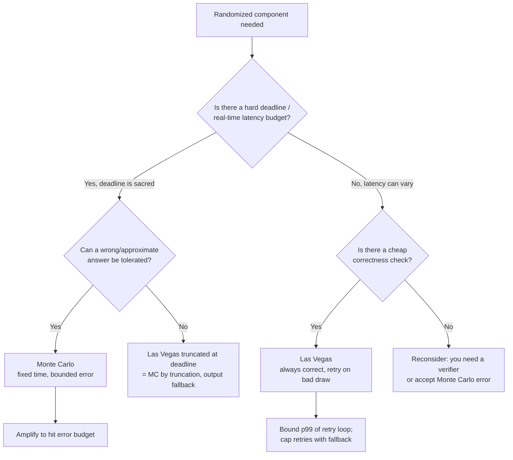
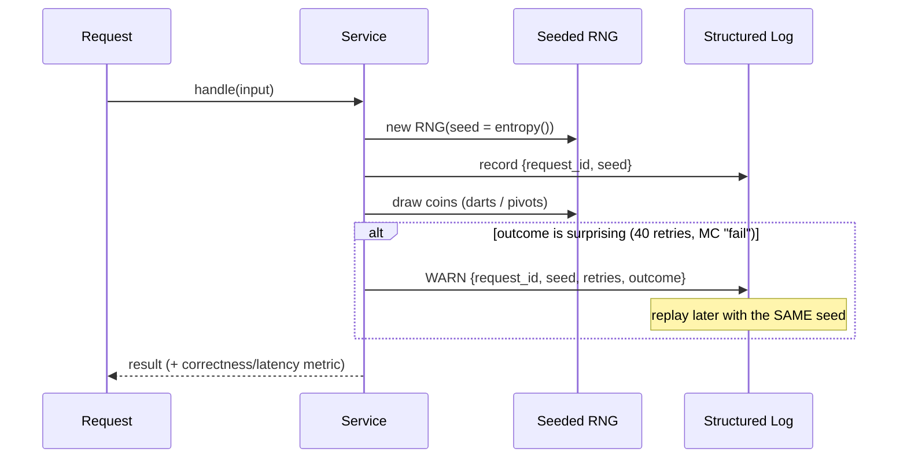
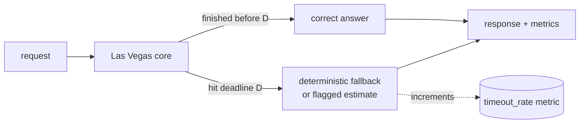

# Monte Carlo vs Las Vegas Randomized Algorithms — Senior Level

> **Focus:** *How to architect real systems around the two paradigms.* Choosing Monte Carlo vs Las Vegas under a latency or correctness **SLA**, sizing the error budget to meet a reliability target, making randomized code **reproducible** (seeding, replay, deterministic tests), running randomness **across many machines** without correlation, and **monitoring** randomized algorithms in production (error-rate estimation, p99 of expected-time loops, retry budgets). The running examples remain π estimation (Monte Carlo) and retry-until-success (Las Vegas), but now seen as components inside services with deadlines, budgets, and observability.

---

## Table of Contents

1. [Introduction](#introduction)
2. [Choosing the Paradigm in Real Systems](#choosing-the-paradigm-in-real-systems)
3. [Controlling Failure Probability to Meet an SLA](#controlling-failure-probability-to-meet-an-sla)
4. [Reproducibility, Seeding, and Replay](#reproducibility-seeding-and-replay)
5. [Distributed Randomness](#distributed-randomness)
6. [Architecture Patterns](#architecture-patterns)
7. [Comparison with Alternatives](#comparison-with-alternatives)
8. [Code Examples](#code-examples)
9. [Observability and Monitoring](#observability-and-monitoring)
10. [Failure Modes](#failure-modes)
11. [Best Practices](#best-practices)
12. [Visual Animation](#visual-animation)
13. [Summary](#summary)

---

## Introduction

At junior and middle level the question was *what* the two paradigms are and *why* you would pick one. At senior level the question changes shape: you are no longer choosing an algorithm in isolation, you are choosing a **behaviour that a production system must live with for years**. A Monte Carlo component injects a small, controllable *error rate* into a service; a Las Vegas component injects a small, controllable *latency variance*. Both are perfectly acceptable — but only if you can (a) put a number on the risk, (b) tie that number to a service-level objective, and (c) see the risk on a dashboard before it becomes an incident.

The senior framing therefore turns three abstract knobs into operational concerns:

- **Error probability `ε`** (Monte Carlo) becomes an *error budget*: "this endpoint is allowed to return a wrong/approximate answer at most `X` times per million requests." You amplify until you meet the budget — and no further, because amplification costs latency.
- **Expected time `E[T]`** (Las Vegas) becomes a *tail-latency* concern: an average is useless to an SLA. What matters is the p99 / p999 of the retry loop, and what you do when an unlucky run blows the deadline (truncate? fail open? fail closed?).
- **Randomness itself** becomes an *operational liability*: an unseeded bug cannot be reproduced, two replicas drawing "the same random pivot" defeat the whole point, and a non-cryptographic RNG in an adversarial path is a security hole.

This file is about turning "it works on my machine, probably" into "it meets a 99.9% SLA, here is the proof, here is the dashboard, and here is the replay command for the one-in-a-million failure."

---

## Choosing the Paradigm in Real Systems

The decision is rarely "which is theoretically nicer." It is driven by **which constraint is hard** in your system.

### The decision tree



### Real-system mapping

| System / component | Hard constraint | Paradigm chosen | Why |
|--------------------|-----------------|-----------------|-----|
| Ad-serving relevance score under 5 ms budget | Latency (deadline) | **Monte Carlo** (sampled estimate) | Cannot miss the deadline; an approximate score is fine. |
| Distributed analytics: "approximate distinct count" (HyperLogLog) | Memory + latency | **Monte Carlo** | Exact count is too expensive; bounded relative error is acceptable. |
| Randomized load balancer "power of two choices" | Correctness of routing | **Las Vegas-ish** | Pick 2 random backends, route to the less loaded — answer is always a valid backend; only the *choice quality* is random. |
| Randomized quicksort/quickselect in a query engine | Correctness | **Las Vegas** | The sorted output must be correct; variable time is acceptable, worst case is astronomically rare. |
| TLS / key generation primality test | Correctness *and* adversarial input | **Monte Carlo** (Miller-Rabin), heavily amplified + CSPRNG | "Prime" must be correct to crypto standards; amplify to `ε < 2^-128`. |
| Rate-limiter probabilistic admission | Latency | **Monte Carlo** | Constant-time decision; small admission error is tolerable. |
| Leader election with random backoff | Correctness (one leader) | **Las Vegas** | Retry random timeouts until exactly one wins; the time to converge is random. |

The senior habit: **name the hard constraint first**, then the paradigm falls out almost mechanically. A second, subtler habit — when *both* "deadline" and "must be correct" are hard, you cannot get both from pure randomness, so you engineer a hybrid: a Las Vegas core *truncated* at the deadline with a deterministic fallback (a Monte Carlo wrapper). That hybrid is the single most common pattern in production randomized code.

---

## Controlling Failure Probability to Meet an SLA

An SLA is a number ("99.9% of requests succeed correctly within 50 ms"). Randomized components contribute to *both* halves of that sentence — correctness and latency — so you must budget for each.

### Monte Carlo: from error budget to repetition count

Suppose an endpoint may serve a wrong answer at most `1` in `10^6` requests *from this component*. If a single Monte Carlo run has one-sided error `ε₁ = 1/4` (e.g. one Miller-Rabin base), then `k` independent runs give error `ε₁^k`. Solve for `k`:

```
ε₁^k ≤ target
k ≥ log(target) / log(ε₁)
For target = 1e-6, ε₁ = 1/4:  k ≥ log(1e-6)/log(0.25) ≈ 9.97  ->  k = 10
```

Ten bases buys you a `< 10^-6` error rate. For cryptographic stakes you push to `ε < 2^-128`, which is still only `~64` rounds — amplification is *logarithmic in the target*, so even paranoid budgets are cheap. The senior point is to **derive `k` from the SLA**, write it as a named constant with a comment showing the arithmetic, and add a test that the constant still satisfies the budget if `ε₁` is ever revised.

### The error budget must compose

Your endpoint's error is not just the Monte Carlo component's error. If a request touches three independent probabilistic components with errors `ε_a, ε_b, ε_c`, the **union bound** gives total error `≤ ε_a + ε_b + ε_c`. Allocate the SLA budget across components the way you allocate a latency budget across hops:

| Component | Allocated error budget | Achieved with |
|-----------|------------------------|---------------|
| Primality / fingerprint check | `5e-7` | `k = 11` rounds |
| Probabilistic dedup (Bloom filter false positive) | `4e-7` | sized `m`, `h` for that FPR |
| Sampled estimate confidence | `1e-7` | `N` samples for that CI |
| **Total (union bound)** | `≤ 1e-6` ✓ | meets the SLA |

### Las Vegas: from expected time to tail latency

For a Las Vegas retry loop, the SLA cares about the **tail**, not the mean. If each attempt succeeds with probability `p`, the number of attempts is geometric, so:

```
P[more than t attempts] = (1 - p)^t
```

To keep the loop under `t` attempts with probability `≥ 1 - δ`:

```
(1 - p)^t ≤ δ   ->   t ≥ ln(δ) / ln(1 - p)
For p = 0.5, δ = 1e-3:  t ≥ ln(0.001)/ln(0.5) ≈ 9.97  ->  cap at 10 attempts
```

So a coin-flip-success loop almost never exceeds 10 tries. The senior pattern is a **retry cap with a deterministic fallback**: retry up to `t` times (covering `1 - δ` of traffic at the fast path), and if you still have not succeeded, switch to a slower-but-guaranteed deterministic path (or fail with a clear error). This converts an unbounded Las Vegas tail into a bounded one — exactly the Las Vegas → Monte Carlo truncation from `middle.md`, applied as an SLA guardrail.

| SLA clause | Knob | Formula | Guardrail |
|------------|------|---------|-----------|
| "≤ X wrong answers / M requests" | repetitions `k` | `k ≥ log(X/M)/log(ε₁)` | amplify; assert in test |
| "p99 latency ≤ D" (Las Vegas) | retry cap `t` | `(1-p)^t ≤ 0.01` | cap + deterministic fallback |
| "p999 latency ≤ D" | retry cap `t` | `(1-p)^t ≤ 0.001` | cap + fallback + alert |
| "availability under bad input" | randomness source | use CSPRNG / per-request seed | adversary cannot force worst case |

---

## Reproducibility, Seeding, and Replay

Randomness and debuggability are natural enemies. The senior discipline is to make randomness **reproducible on demand** without making it predictable to an adversary.

### The seeding contract

1. **One RNG, seeded once, owned explicitly.** Never call the global/default RNG from library code; pass an RNG (or a seed) in. A function that reaches for `math/rand`'s global source is untestable and can collide with other callers.
2. **Log the seed of every randomized operation that can fail.** When a Monte Carlo check returns "probably prime" or a Las Vegas loop takes 40 retries, the seed in the log line is what lets you replay the exact run.
3. **Fixed seeds in tests, entropy seeds in production.** Tests must be deterministic (same seed → same darts → same estimate), so CI does not flake. Production seeds come from a real entropy source so that no two requests share a coin sequence.
4. **Adversarial paths use a CSPRNG.** If an attacker can influence the input *and* benefits from predicting your coins (e.g. forcing quicksort worst case, or guessing a primality base set), a fast non-crypto PRNG is a vulnerability. Use `crypto/rand`, `SecureRandom`, `secrets`.



### Replay in practice

A replay harness takes a logged `seed`, re-creates the RNG from it, and re-runs the deterministic step generator. Because the coin stream is fully determined by the seed, the bug reproduces exactly — the "Heisenbug" of randomized code disappears. This is why the seed must be (a) captured and (b) sufficient: if your algorithm also draws from the global RNG somewhere, replay breaks. **All randomness must flow through the one seeded source**, or replay is a lie.

### Reproducibility vs cross-language determinism

A subtle trap: the *same seed* gives the *same sequence* only within one RNG implementation. Go's `math/rand`, Java's `Random`, and Python's `random` produce **different** streams from the same integer seed. If you need bit-identical behaviour across languages (e.g. a shared test fixture for the three reference implementations in this roadmap), you must implement a shared PRNG (a small explicit LCG or xorshift) rather than relying on each language's built-in.

---

## Distributed Randomness

When the randomized algorithm runs on many machines at once, a new failure mode appears: **correlated coins**. The whole power of randomization comes from independence; share a seed across replicas and you reintroduce the worst case you were trying to escape.

### The correlation hazard

- **Same seed on every replica.** A classic bug: pods inherit a seed from an image build time or a shared config. Every replica then "randomly" picks the *same* backend, the *same* pivot, the *same* shard — turning "power of two random choices" into "everyone hammers backend #3." The fix: seed per process from a high-entropy source (PID + hostname + nanotime, or `crypto/rand`), never from a shared constant.
- **Synchronized retries (thundering herd).** Many Las Vegas retry loops waking at the same instant create load spikes. Add **jitter** — randomize the backoff interval — so retries spread out. This is itself a randomized fix to a randomized problem.
- **Reproducibility vs independence tension.** You want replay (deterministic) *and* independence across replicas (non-deterministic). Resolve it by seeding per-(replica, request): the seed is `hash(replica_id, request_id)` — independent across replicas, yet reproducible because both ids are logged.

### Shared vs local randomness

| Need | Source | Property |
|------|--------|----------|
| Independent per-replica decisions (load balancing, sampling) | local CSPRNG per process | uncorrelated across nodes |
| Reproducible per-request (replay) | `seed = hash(replica_id, request_id)` | deterministic given ids |
| *Agreement* across nodes (all pick same shard for a key) | deterministic hash of the key (NOT random) | consistent, not random — use hashing, not RNG |
| Distributed consensus randomness (leader election tie-break) | shared random beacon / VRF | jointly random, verifiable, unmanipulable |

The senior insight: **"random" and "agreed" are opposite requirements.** When nodes must *agree* (route the same key to the same shard), do not use an RNG at all — use a deterministic hash (consistent hashing). When nodes must *diverge* (spread load, avoid lockstep), use independent local randomness. Confusing the two is the root cause of both hot-shard and thundering-herd incidents.

---

## Architecture Patterns

### Pattern 1 — Monte Carlo with SLA-derived amplification

A primality/fingerprint service exposes `check(x)` that must meet `ε ≤ 1e-9`. The round count is a constant derived from the SLA, the RNG is injected, and the seed is logged.

### Pattern 2 — Las Vegas with bounded retries + deterministic fallback

A randomized routine retries up to `t` times (covering `1 - δ` of traffic), then falls back to a deterministic path. This is the production-grade shape that gives both a correctness guarantee *and* a latency bound.

### Pattern 3 — Hybrid (truncated Las Vegas = Monte Carlo wrapper)

Run a Las Vegas algorithm under a deadline; on timeout, emit a best-effort answer and a metric flag. The error rate equals the timeout rate, which Markov bounds: `P[T > D] ≤ E[T]/D`.



---

## Comparison with Alternatives

| Attribute | Monte Carlo (in prod) | Las Vegas (in prod) | Deterministic exact |
|-----------|-----------------------|---------------------|---------------------|
| Latency profile | flat, predictable (good p99) | mean low, tail variable | predictable but may be slow |
| Correctness | error `≤ ε` (budgeted) | always correct | always correct |
| SLA knob | repetitions `k` | retry cap `t` + fallback | n/a |
| Adversary resistance | yes, with CSPRNG | yes, with CSPRNG | no — fixed worst-case input |
| Observability metric | `error_rate`, `rounds` | `retry_count`, `p99_latency`, `timeout_rate` | `latency` |
| Replay/debug | seed log | seed log | trivially deterministic |
| Typical prod use | HLL, Bloom, primality, sampled scores | quickselect, randomized routing, backoff | small/medium exact work |

**Choose Monte Carlo in production when:** latency is sacred, the answer can be approximate or high-probability-correct, and you can amplify to a budget. **Choose Las Vegas when:** correctness is mandatory, a cheap check exists, and you can bound the tail with a retry cap + fallback. **Choose deterministic when:** the input is small/trusted and reproducibility/auditing forbids any randomness.

---

## Code Examples

### Monte Carlo service: SLA-derived rounds, injected RNG, logged seed

The error budget drives a named constant; the RNG is explicit so the run is reproducible.

#### Go

```go
package main

import (
	"fmt"
	"math"
	"math/rand"
)

// roundsForError returns the number of independent one-sided rounds needed
// so that epsSingle^k <= target. This is the SLA -> k derivation, in code.
func roundsForError(epsSingle, target float64) int {
	return int(math.Ceil(math.Log(target) / math.Log(epsSingle)))
}

// MonteCarloCheck runs a one-sided test k times with an INJECTED rng so the
// run is reproducible: the same seed -> the same coins -> the same answer.
// `trial` returns false to mean a CERTAIN "no" (a certificate); true is probable.
func MonteCarloCheck(rng *rand.Rand, trial func(*rand.Rand) bool, k int) bool {
	for i := 0; i < k; i++ {
		if !trial(rng) {
			return false // certificate: certainly "no"
		}
	}
	return true // probably "yes"; error <= epsSingle^k
}

func main() {
	const epsSingle = 0.25 // one-sided error of a single round
	const slaTarget = 1e-9 // allowed error per call
	k := roundsForError(epsSingle, slaTarget)
	fmt.Printf("SLA target %.0e -> k = %d rounds\n", slaTarget, k)

	seed := int64(42) // in prod: from crypto entropy; logged for replay
	rng := rand.New(rand.NewSource(seed))
	// toy trial: "fails" (certificate) with prob 3/4, mimicking a 1/4-error test
	trial := func(r *rand.Rand) bool { return r.Float64() < 0.25 }
	fmt.Printf("seed=%d result=%v\n", seed, MonteCarloCheck(rng, trial, k))
}
```

#### Java

```java
import java.util.Random;
import java.util.function.Predicate;

public class MonteCarloService {
    // SLA -> k: smallest k with epsSingle^k <= target.
    static int roundsForError(double epsSingle, double target) {
        return (int) Math.ceil(Math.log(target) / Math.log(epsSingle));
    }

    // Injected Random => reproducible; a `false` from trial is a certificate.
    static boolean check(Random rng, Predicate<Random> trial, int k) {
        for (int i = 0; i < k; i++) {
            if (!trial.test(rng)) return false; // certain "no"
        }
        return true; // probable "yes", error <= epsSingle^k
    }

    public static void main(String[] args) {
        double epsSingle = 0.25, slaTarget = 1e-9;
        int k = roundsForError(epsSingle, slaTarget);
        System.out.printf("SLA target %.0e -> k = %d rounds%n", slaTarget, k);

        long seed = 42L; // prod: SecureRandom entropy; logged for replay
        Random rng = new Random(seed);
        Predicate<Random> trial = r -> r.nextDouble() < 0.25;
        System.out.printf("seed=%d result=%b%n", seed, check(rng, trial, k));
    }
}
```

#### Python

```python
import math
import random


def rounds_for_error(eps_single, target):
    """SLA -> k: smallest k with eps_single**k <= target."""
    return math.ceil(math.log(target) / math.log(eps_single))


def monte_carlo_check(rng, trial, k):
    """Injected rng => reproducible. trial() False is a certificate (certain 'no')."""
    for _ in range(k):
        if not trial(rng):
            return False
    return True  # probable 'yes'; error <= eps_single**k


if __name__ == "__main__":
    EPS_SINGLE, SLA_TARGET = 0.25, 1e-9
    k = rounds_for_error(EPS_SINGLE, SLA_TARGET)
    print(f"SLA target {SLA_TARGET:.0e} -> k = {k} rounds")

    seed = 42  # prod: secrets/os.urandom entropy; logged for replay
    rng = random.Random(seed)
    trial = lambda r: r.random() < 0.25
    print(f"seed={seed} result={monte_carlo_check(rng, trial, k)}")
```

### Las Vegas with a retry cap and deterministic fallback

The fast path is randomized; the cap + fallback bound the tail to meet an SLA.

#### Go

```go
package main

import (
	"errors"
	"fmt"
	"math"
	"math/rand"
)

// capForTail returns the retry cap t so that (1-p)^t <= delta.
func capForTail(p, delta float64) int {
	return int(math.Ceil(math.Log(delta) / math.Log(1-p)))
}

// LasVegasWithFallback retries a random attempt up to `cap` times; if none
// succeeds it runs a deterministic fallback. Always returns a CORRECT answer.
func LasVegasWithFallback(
	rng *rand.Rand,
	attempt func(*rand.Rand) (int, bool), // (value, ok)
	fallback func() int,
	cap int,
) (int, int) {
	for tries := 1; tries <= cap; tries++ {
		if v, ok := attempt(rng); ok {
			return v, tries // correct, fast path
		}
	}
	return fallback(), cap + 1 // correct, slow guaranteed path
}

func main() {
	p, delta := 0.5, 1e-3
	cap := capForTail(p, delta)
	fmt.Printf("p=%.2f delta=%.0e -> retry cap = %d\n", p, delta, cap)

	rng := rand.New(rand.NewSource(7))
	attempt := func(r *rand.Rand) (int, bool) {
		x := r.Intn(6) + 1
		return x, x == 6 // "good draw" with prob 1/6
	}
	fallback := func() int { return 6 } // deterministic correct answer
	val, tries := LasVegasWithFallback(rng, attempt, fallback, cap)
	fmt.Printf("value=%d tries=%d\n", val, tries)
	_ = errors.New
}
```

#### Java

```java
import java.util.Random;
import java.util.function.Function;
import java.util.function.Supplier;

public class LasVegasFallback {
    static int capForTail(double p, double delta) {
        return (int) Math.ceil(Math.log(delta) / Math.log(1 - p));
    }

    // Returns {value, tries}. Always correct: fast path or deterministic fallback.
    static int[] run(Random rng, Function<Random, int[]> attempt,
                     Supplier<Integer> fallback, int cap) {
        for (int tries = 1; tries <= cap; tries++) {
            int[] r = attempt.apply(rng); // {value, ok(0/1)}
            if (r[1] == 1) return new int[]{r[0], tries};
        }
        return new int[]{fallback.get(), cap + 1};
    }

    public static void main(String[] args) {
        double p = 0.5, delta = 1e-3;
        int cap = capForTail(p, delta);
        System.out.printf("p=%.2f delta=%.0e -> retry cap = %d%n", p, delta, cap);

        Random rng = new Random(7);
        Function<Random, int[]> attempt = r -> {
            int x = r.nextInt(6) + 1;
            return new int[]{x, x == 6 ? 1 : 0};
        };
        int[] out = run(rng, attempt, () -> 6, cap);
        System.out.printf("value=%d tries=%d%n", out[0], out[1]);
    }
}
```

#### Python

```python
import math
import random


def cap_for_tail(p, delta):
    """Smallest t with (1-p)**t <= delta."""
    return math.ceil(math.log(delta) / math.log(1 - p))


def las_vegas_with_fallback(rng, attempt, fallback, cap):
    """Retry random attempt up to `cap` times, else deterministic fallback.
    Always returns a correct (value, tries)."""
    for tries in range(1, cap + 1):
        value, ok = attempt(rng)
        if ok:
            return value, tries
    return fallback(), cap + 1


if __name__ == "__main__":
    p, delta = 0.5, 1e-3
    cap = cap_for_tail(p, delta)
    print(f"p={p} delta={delta:.0e} -> retry cap = {cap}")

    rng = random.Random(7)

    def attempt(r):
        x = r.randint(1, 6)
        return x, x == 6

    val, tries = las_vegas_with_fallback(rng, attempt, lambda: 6, cap)
    print(f"value={val} tries={tries}")
```

**What they show:** the Monte Carlo service derives its repetition count *from the SLA* and runs on an injected, replayable RNG; the Las Vegas routine bounds its tail with a retry cap and a deterministic fallback, so an unlucky coin sequence can never blow the latency SLA.

---

## Observability and Monitoring

You cannot operate what you cannot see. Randomized components need metrics that capture *both* the risk you accepted and whether reality matches your assumptions.

| Metric | Paradigm | What it tells you | Alert when |
|--------|----------|-------------------|------------|
| `mc_rounds` (per call) | Monte Carlo | amplification actually applied | drops below SLA-required `k` |
| `mc_estimated_error_rate` | Monte Carlo | empirical wrong-answer rate vs an oracle on a sample | exceeds error budget `ε` |
| `lv_retry_count` (histogram) | Las Vegas | distribution of attempts; p99 of the loop | p99 > tail target `t` |
| `lv_timeout_rate` | Las Vegas (truncated) | fraction hitting the deadline → fallback | exceeds `E[T]/D` markov bound |
| `rng_seed` (log field) | both | replayability of any failure | seed missing/constant |
| `rng_source` | both | crypto vs fast PRNG on this path | non-crypto on adversarial path |

### Estimating the error rate without an oracle

For Monte Carlo, you often *cannot* check every answer (if you could, you would not need MC). Two practical tactics:

1. **Shadow-verify a sample.** On 1% of traffic, run the expensive deterministic check in the background and compare. The observed disagreement rate is an unbiased estimate of `ε` — alert if the 95% upper confidence bound crosses the budget.
2. **Watch the certificate rate for one-sided tests.** A one-sided MC (like Miller-Rabin) that *never* produces certificates on inputs you believe are mixed is a red flag (e.g. a broken RNG always drawing the same base). Track the rate of "certain" outcomes; a sudden change signals a randomness bug.

### Monitoring expected-time loops

The mean retry count is a *health* signal: if `lv_retry_count` mean drifts from `1/p` toward higher values, the success probability `p` has dropped (the environment changed — more contention, a degraded backend). That drift is an early warning *before* the p99 breaches the SLA. Monitoring the *full histogram*, not just the average, is the senior discipline — a Las Vegas loop is defined by its tail.

---

## Failure Modes

- **Constant / shared seed across replicas** → correlated coins; "power of two choices" collapses, hot shard. Fix: per-process entropy seed; seed per-(replica,request) for replay.
- **Unbounded Las Vegas tail** → a request with an unlucky coin sequence blows the deadline. Fix: retry cap + deterministic fallback (truncation guardrail).
- **Under-amplified Monte Carlo** → error rate exceeds the budget under load. Fix: derive `k` from the SLA as a tested constant; alert on `mc_estimated_error_rate`.
- **Non-crypto RNG on an adversarial path** → attacker forces the worst case (quicksort `O(n²)`, repeated primality base). Fix: CSPRNG on any input an adversary can influence.
- **Lost reproducibility** → a one-in-a-million failure cannot be replayed. Fix: route *all* randomness through one seeded source; log the seed.
- **Thundering-herd retries** → synchronized backoff spikes load. Fix: jittered (randomized) backoff.
- **Drift in `p`** → the success rate of attempts silently degrades. Fix: alert on the retry-count histogram mean and p99, not just success/failure.
- **Cross-language seed mismatch** → a "deterministic" fixture diverges between Go/Java/Python. Fix: a shared explicit PRNG when bit-identical streams are required.

---

## Best Practices

- **Name the hard constraint first** (deadline vs correctness); the paradigm follows, and a hybrid (truncated Las Vegas) covers the case where both are hard.
- **Derive `k` (rounds) and `t` (retry cap) from the SLA**, as commented constants with the arithmetic shown, and assert them in tests.
- **Budget error with the union bound** across all probabilistic components on the request path, exactly like a latency budget.
- **Inject the RNG; never call the global default from library code.** Seed once, own it explicitly.
- **Log the seed** of any randomized op that can fail, so the one-in-a-million failure is replayable.
- **Fixed seeds in tests, entropy seeds in production, CSPRNG on adversarial paths.**
- **Seed per process from high entropy** to keep replicas independent; use `hash(replica_id, request_id)` when you need *both* independence and replay.
- **Use deterministic hashing — not an RNG — when nodes must agree** (consistent hashing); use independent randomness only when they must diverge.
- **Cap Las Vegas retries with a deterministic fallback** so the tail is bounded.
- **Add jitter to retries/backoff** to avoid synchronized herds.
- **Monitor the right metric:** error-rate (shadow-verified) for Monte Carlo, retry-count histogram + timeout-rate for Las Vegas.

---

## Visual Animation

> See [`animation.html`](./animation.html) for the interactive view.
>
> The senior lens on the animation:
> - **Monte Carlo π estimation** as a fixed-latency component: the dart count is the "budget," and the live **error** is the risk you are accepting — watch how many darts (work) it takes to push error under a target (the SLA → `N` derivation).
> - **Las Vegas retry-until-success** as a tail-latency component: the retry counter is the latency variable; imagine a **retry cap** line and a fallback — runs that cross it are the ones an SLA must guard against.
> - The **seed** behind the run is fixed, so the same configuration replays identically — the reproducibility contract in miniature.

---

## Summary

At senior level the two paradigms stop being algorithm choices and become **operational behaviours with budgets**. Monte Carlo contributes a controllable *error rate*: you derive the repetition count `k` from the SLA (`k ≥ log(target)/log(ε₁)`), budget error across components with the union bound, and watch a shadow-verified `error_rate` metric. Las Vegas contributes a controllable *latency variance*: the SLA cares about the tail, so you bound it with a retry cap `t` (`(1-p)^t ≤ δ`) backed by a deterministic fallback — which is just Las Vegas → Monte Carlo truncation used as a guardrail. Reproducibility is engineered, not hoped for: one injected, seeded RNG, with the seed logged so any rare failure replays exactly; fixed seeds in tests, entropy in production, a CSPRNG on adversarial paths. In distributed settings the enemy is **correlated coins** — seed per process so replicas stay independent, use deterministic hashing (not an RNG) when nodes must *agree*, and add jitter to avoid synchronized herds. Choose the paradigm by your hard constraint, size the risk to the SLA, make it replayable, and put both the error and the tail on a dashboard.

---

**Next step:** Continue to [`professional.md`](./professional.md) for the formal theory — the complexity classes RP / co-RP / ZPP / BPP, Chernoff-based amplification bounds, expected-time proofs for Las Vegas, the MC↔LV conversions made rigorous, and an overview of derandomization.
