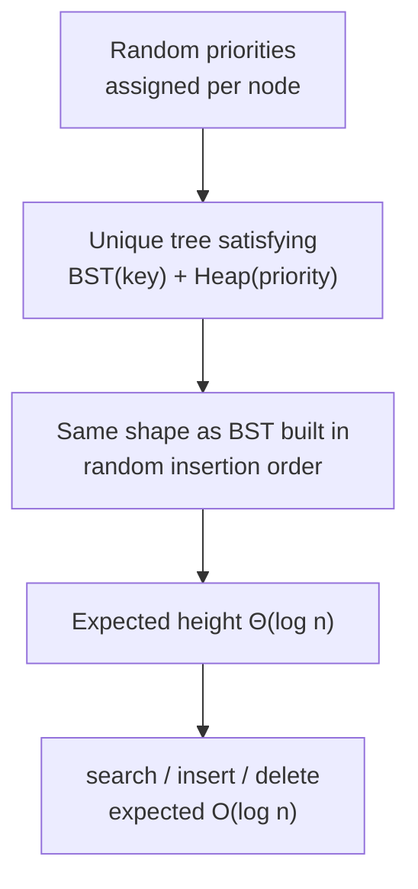
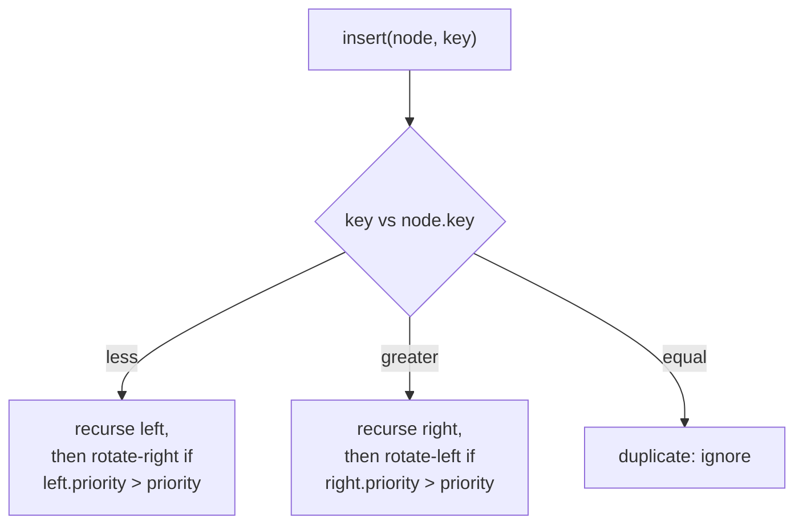

# Treap (Tree + Heap) — Junior Level

> **Read time: ~45 minutes** · **Audience:** Students who already know the plain Binary Search Tree (`09-trees/02-bst`) — the BST invariant, recursive insert/search/delete, and inorder traversal — and have seen a binary **heap** (`10-heaps`). No prior exposure to balanced trees (AVL, Red-Black) is required.

A **treap** is the friendliest balanced search tree you will ever meet. It is a Binary Search Tree that stays balanced *automatically* by a trick so simple it feels like cheating: every node is given a **random priority** when it is created, and the tree is kept as a **heap** on those priorities at the same time as it is a **BST** on the keys. Because the priorities are random, the shape of the tree is random too — and a random BST is balanced *on average*, giving expected `O(log n)` search, insert, and delete with **no balance factors, no color bits, and no rebalancing cases to memorize**.

The name is a portmanteau: **tr**ee + h**eap** = **treap**. In this document we build the structure from the BST you already know: the dual invariant, why random priorities force balance, insertion by ordinary BST descent followed by a few rotations to restore the heap order, deletion by rotating a node down to a leaf, and a complete worked example. The deeper split/merge formulation and the array-superpower "implicit treap" are introduced in `middle.md`.

---

## Table of Contents

1. [Introduction — A BST That Balances Itself](#introduction)
2. [Prerequisites](#prerequisites)
3. [Glossary](#glossary)
4. [Core Concepts — The Dual Invariant](#core-concepts)
5. [Why Random Priorities Force Balance](#why-random)
6. [Rotations — The One Primitive You Need](#rotations)
7. [Big-O Summary](#big-o-summary)
8. [Real-World Analogies (and a Trap)](#analogies)
9. [Pros and Cons](#pros-and-cons)
10. [Step-by-Step Walkthrough](#walkthrough)
11. [Code Examples — Go, Java, Python](#code-examples)
12. [Coding Patterns](#patterns)
13. [Error Handling](#errors)
14. [Performance Tips](#performance-tips)
15. [Best Practices](#best-practices)
16. [Edge Cases & Pitfalls](#edge-cases)
17. [Common Mistakes](#common-mistakes)
18. [Cheat Sheet](#cheat-sheet)
19. [Visual Animation Reference](#animation)
20. [Summary](#summary)
21. [Further Reading](#further-reading)

---

<a name="introduction"></a>
## 1. Introduction — A BST That Balances Itself

In `09-trees/02-bst` you learned the lesson that defines balanced-tree design: **a vanilla BST does nothing to keep its height small, and an unlucky insertion order turns it into a linked list**. Insert `1, 2, 3, 4, 5` in order and you get a right-spine of height 4 — every operation becomes `O(n)`.

The classic fixes (AVL, Red-Black) attack the symptom directly: after each insert/delete they measure the imbalance and perform rotations to force the height back down to `O(log n)`. They work, but they are fiddly — AVL tracks a balance factor at every node; Red-Black juggles five invariants and a handful of recoloring/rotation cases. Getting them right from memory under interview pressure is hard.

A **treap** attacks the *cause* instead. Recall a second fact from the BST chapter: if you insert `n` keys in **uniformly random order**, the expected height is `Θ(log n)`. The tree is balanced on average — the problem is only that real inputs (timestamps, sequential IDs) are rarely random. The treap's insight is:

> *What if we could make the tree behave as though the keys had been inserted in random order, no matter what order they actually arrive in?*

The trick: give every node a **random priority** at creation, and maintain the tree so that it is simultaneously

- a **BST** on the `key` (left subtree keys < node key < right subtree keys), and
- a **max-heap** on the `priority` (every node's priority ≥ both children's priorities).

Here is the crucial observation. **For a fixed set of (key, priority) pairs with distinct priorities, there is exactly one tree that satisfies both invariants.** And that unique tree is *identical* to the BST you would have built by inserting the keys in **decreasing priority order**. Since the priorities are random, "decreasing priority order" is a uniformly random permutation of the keys — so the treap is exactly a randomly-built BST, with expected height `Θ(log n)`, regardless of the order the keys actually arrived in.

That is the whole idea. Everything below is mechanics: how to insert and delete while keeping both invariants, and why it is fast.

---

<a name="prerequisites"></a>
## 2. Prerequisites

You should be comfortable with everything in these earlier topics:

1. **The BST invariant and recursion** (`09-trees/02-bst`). The "return the new subtree root" recursive idiom — `node.left = insert(node.left, key)` — is used constantly in treap code. If that idiom is not automatic, re-read the BST junior file first.
2. **The heap (priority) invariant** (`10-heaps`). A **max-heap** has every node's value ≥ its children's. The treap maintains exactly this property, but on a *separate* field (`priority`), not on the keys.
3. **Tree rotations.** A rotation is a constant-time, local restructuring that moves one node up by a level while preserving the BST order. We re-derive both directions in §6, so you do not need prior rotation experience — but having seen them in `03-avl` helps.
4. **A random number generator.** Go's `math/rand`, Java's `java.util.Random`, Python's `random`. We only need uniformly random integers (or floats). The quality of randomness affects the balance guarantee — see §13.
5. **A total order on keys.** Same requirement as any BST: any two keys must be comparable with a consistent `<`. Integers, strings, tuples all qualify.

---

<a name="glossary"></a>
## 3. Glossary

| Term | Definition |
|---|---|
| **Treap** | A binary tree that is a **BST on keys** and a **max-heap on priorities** simultaneously. Name = tree + heap. |
| **Key** | The searchable value. The tree obeys the BST invariant on keys, exactly like a plain BST. |
| **Priority** | A second value attached to each node, chosen **at random** when the node is created. The tree obeys the max-heap invariant on priorities. Never compared against keys. |
| **BST invariant** | For every node: all keys in the left subtree < node's key < all keys in the right subtree. |
| **Heap (priority) invariant** | For every node: node's priority ≥ both children's priorities (max-heap convention used in this document). |
| **Rotation** | A constant-time local operation that moves a child above its parent while preserving the BST order. Two mirror-image forms: rotate-right and rotate-left. |
| **Bubble up** | During insert, repeatedly rotate a newly attached leaf upward while its priority exceeds its parent's, until the heap invariant is restored. |
| **Sink / rotate down** | During delete, repeatedly rotate the target node downward (toward the higher-priority child) until it becomes a leaf, then detach it. |
| **Expected height** | `Θ(log n)` — the average height over the random choice of priorities. Not a worst-case guarantee; see §5. |
| **Randomized data structure** | A structure whose performance guarantees are *expected* (averaged over its own internal random choices), independent of the input. Treap, skip list, randomized quicksort. |
| **Implicit treap** | A treap whose "key" is the **position/index** of an element rather than a stored value — turns the treap into an array supporting `O(log n)` insert-at, erase-at, range reverse, and range queries. Covered in `middle.md`. |
| **Split / merge** | The cleaner, rotation-free way to express all treap operations: `split` cuts a treap into "< x" and "≥ x" parts; `merge` joins two treaps where all keys of one are < all keys of the other. Covered in `middle.md`. |

---

<a name="core-concepts"></a>
## 4. Core Concepts — The Dual Invariant

### 4.1 A node carries two values

A plain BST node has a `key` and two child pointers. A treap node adds one field — a `priority`:

```
TreapNode {
    key       // searchable value — BST order applies here
    priority  // random number — heap order applies here
    left, right
}
```

### 4.2 Two invariants at once

The treap maintains **both** of the following at all times:

```
BST invariant  (on key):       left subtree keys  <  node.key  <  right subtree keys
HEAP invariant (on priority):  node.priority  >=  left.priority   and
                               node.priority  >=  right.priority
```

The two invariants live on different fields, so they never conflict — but together they *pin down the tree shape uniquely*. Here is why this matters.

### 4.3 The uniqueness theorem (informal)

> Given a set of nodes with **distinct keys** and **distinct priorities**, there is **exactly one** binary tree that is a BST on the keys and a max-heap on the priorities.

The argument is short and worth internalizing:

- The **root** must be the node with the **highest priority** (heap invariant: root has max priority over the whole tree).
- By the **BST invariant**, every key smaller than the root's key goes to the **left subtree**, every larger key to the **right subtree**. The partition is forced.
- Recurse: the left subtree is the unique treap on the smaller keys, the right subtree the unique treap on the larger keys.

So once the priorities are fixed, the shape is determined — there is nothing to "choose". This is what makes the treap deterministic given its random priorities, and it is the reason insert/delete have only *one* correct outcome to restore.

### 4.4 The connection to insertion order

Build a plain BST by inserting keys in order of **decreasing priority** (highest first). The first key inserted becomes the root; later keys descend past it by BST comparison. The result is exactly the unique treap above — the highest-priority node is the root, and so on recursively. So:

> **A treap with random priorities is identical to a BST built by inserting the keys in uniformly random order.**

Random insertion order ⇒ expected height `Θ(log n)` (proved in `09-trees/02-bst` and in our `professional.md`). The treap inherits that bound for free, no matter what order the keys actually arrive in.



---

<a name="why-random"></a>
## 5. Why Random Priorities Force Balance

The single sentence to remember: **the input order no longer matters; only the (random) priorities decide the shape.**

A plain BST's shape is decided by *insertion order*, which an adversary or an unlucky workload controls. A treap's shape is decided by *priorities*, which **you** control and choose uniformly at random. The adversary can pick the worst possible keys and the worst possible insertion order, and it changes nothing — because the shape depends only on your private random numbers, which the adversary cannot see or influence.

This is the defining feature of a **randomized data structure**: the performance guarantee is *expected* (averaged over the structure's own coin flips) and holds for **every** input. Compare:

- A plain BST is `O(log n)` *for good inputs* and `O(n)` for bad inputs — the input decides.
- A treap is `O(log n)` *in expectation for all inputs* — your coin flips decide, and bad luck is exponentially rare.

"Expected `O(log n)`" does **not** mean "always `O(log n)`". A treap *can* be tall — but only if your random number generator produced a very unlucky sequence of priorities, which happens with vanishingly small probability (the height exceeds `c log n` with probability that drops polynomially in `n`; the full tail bound is in `professional.md`). In practice the height hugs `≈ 1.39 log₂ n`, the same constant as a random BST.

> **Key practical takeaway:** because balance comes from *your* randomness rather than from the *input*, a treap has **no adversarial worst case in the way a plain BST does**. There is no "sorted input" attack.

---

<a name="rotations"></a>
## 6. Rotations — The One Primitive You Need

A treap restores the heap invariant using **rotations** — the same constant-time primitive used by AVL and Red-Black trees. A rotation rearranges three links so that a child moves above its parent **while keeping the BST order intact**. There are two mirror forms.

### 6.1 Rotate right (left child moves up)

```
      P                 L
     / \               / \
    L   C    ==>       A   P
   / \                    / \
  A   B                  B   C
```

`L` becomes the new subtree root; `P` becomes `L`'s right child; `L`'s old right child `B` becomes `P`'s left child. Inorder sequence before: `A L B P C`. After: `A L B P C`. **Unchanged** — the BST property is preserved. (Verify it yourself; this invariance is the whole reason rotations are legal.)

### 6.2 Rotate left (right child moves up) — the mirror

```
    P                     R
   / \                   / \
  A   R       ==>        P   C
     / \                / \
    B   C              A   B
```

`R` becomes the new root; `P` becomes `R`'s left child; `R`'s old left child `B` becomes `P`'s right child. Inorder before and after: `A P B R C`. Unchanged.

### 6.3 What rotations do to priorities

A rotation **moves one node up by one level and pushes its parent down by one level**. That is exactly what we need to fix a heap violation: if a child's priority is larger than its parent's, rotating the child up makes the higher-priority node the parent — restoring the heap invariant locally. Each rotation is `O(1)`; a single insert needs at most `O(height)` of them in the worst case, and `O(1)` of them on average.

---

<a name="big-o-summary"></a>
## 7. Big-O Summary

| Operation | Expected | Worst case (unlucky priorities) | Notes |
|---|---|---|---|
| Search | O(log n) | O(n) | Same descent as a plain BST |
| Insert | O(log n) | O(n) | BST insert + bubble-up rotations |
| Delete | O(log n) | O(n) | Rotate-down to a leaf, then detach |
| Find min / max | O(log n) | O(n) | Leftmost / rightmost descent |
| Split (by key) | O(log n) | O(n) | See `middle.md` |
| Merge (two treaps) | O(log n) | O(n) | See `middle.md` |
| Inorder traversal | O(n) | O(n) | Yields keys in sorted order |
| Space | O(n) | O(n) | One extra word per node for `priority` |

Every operation is `O(height)`, and the expected height is `Θ(log n)`. The worst case is `O(n)`, but — unlike a plain BST — it is triggered only by unlucky randomness, never by the input. The probability of a height worse than `c log n` is polynomially small (`professional.md`).

**Expected number of rotations per insert/delete is `O(1)`** (proved in `professional.md`) even though the expected *cost* is `O(log n)` — the descent dominates, the rotations are cheap.

---

<a name="analogies"></a>
## 8. Real-World Analogies (and a Trap)

### 8.1 A tournament bracket seeded at random

Imagine players (keys) seeded into a knockout tournament by a **random** seed number (priority). The highest seed sits at the top (the root). Within each half of the bracket, the same rule applies recursively. Because seeding is random, no single arrangement of players can force a lopsided bracket. The treap is exactly this: keys arranged by BST order, "seeded" by random priority, with the top seed as root.

### 8.2 A line that re-sorts by a hidden lottery number

Picture people standing in a queue ordered by name (the BST/key order). Each person also drew a secret lottery ticket (the priority). Whenever you reorganize the line into a tree, the person with the biggest lottery number floats to the top, then recursively within each side. Names give the left-to-right order; lottery numbers give the top-to-bottom order.

### 8.3 A common BUT WRONG analogy: "it's just a heap of keys"

A natural mistake is to think the treap heap-orders the **keys** — that the root holds the largest or smallest key. **It does not.** The heap order is on the *priorities*, which are unrelated random numbers. The root holds the **highest-priority** node, whose key can be anything. Confusing "heap on priority" with "heap on key" leads to broken code that compares the wrong field. Keep the two fields strictly separate: **keys decide left/right, priorities decide up/down.**

### 8.4 Cutting a deck and riffling it back (split / merge)

The `middle.md` split/merge formulation is like cutting a sorted deck of cards at a chosen value (split) and riffling two already-ordered decks back into one (merge), where each card's lottery number decides which lands on top. The card order stays sorted; the lottery numbers decide the resulting tree's shape.

---

<a name="pros-and-cons"></a>
## 9. Pros and Cons

### Pros

- **Dead simple to implement.** Roughly 40 lines for insert + delete via rotations, or ~30 lines for the entire structure via split/merge. Compare to ~150+ lines for a correct Red-Black tree.
- **Expected `O(log n)` for everything, for every input.** No adversarial worst case the way a plain BST has.
- **No balance metadata to maintain.** No height fields (AVL), no color bits (Red-Black). Just one random priority per node, set once at creation and never touched again.
- **Split and merge are first-class, `O(log n)` operations.** This is the treap's superpower — splitting an ordered set at a key, or concatenating two ordered sets, is awkward in AVL/Red-Black but trivial here. It enables the *implicit treap* (array with range reverse, range queries) covered in `middle.md`.
- **Easy to make persistent.** Path-copying immutable treaps are straightforward (see `senior.md`).

### Cons

- **Probabilistic, not guaranteed.** A pathological run of the RNG can make it tall. The probability is astronomically small, but it is not zero — unacceptable for hard real-time systems that need a deterministic `O(log n)` bound (use AVL/Red-Black there).
- **Depends on a good RNG.** A weak or predictable random source weakens the guarantee; a fixed seed makes it reproducible but also reproducibly bad if you are unlucky. See §13.
- **One extra word per node** for the priority. Minor, but real for huge trees.
- **Pointer-chasing, cache-unfriendly.** Like every binary search tree; a sorted array or B-tree beats it for read-mostly workloads (see `senior.md`).
- **Rotations touch more nodes than split/merge on some operations** — most practitioners prefer the split/merge formulation for clarity (`middle.md`).

**When to use:** you need an ordered set/map *and* fast `split`/`merge`, *or* you want a balanced BST that is trivial to code correctly (competitive programming, prototypes). **When NOT to use:** hard real-time deadlines requiring a guaranteed (not expected) bound; read-mostly data where a sorted array or B-tree wins on cache behavior.

---

<a name="walkthrough"></a>
## 10. Step-by-Step Walkthrough

We insert keys with priorities shown as `key/priority`. Higher priority = closer to the root. (In real code priorities are random; here we pick specific numbers so the example is reproducible.)

### 10.1 Insert `B/40`

Empty tree → `B/40` becomes the root.

```
   B/40
```

### 10.2 Insert `A/20`

BST step: `A < B`, go left; left is empty → attach as a leaf.

```
     B/40
    /
  A/20
```

Heap check: `A`'s priority (20) ≤ parent `B`'s (40). Invariant holds. No rotation.

### 10.3 Insert `D/60`

BST step: `D > B`, go right; attach as leaf.

```
     B/40
    /    \
  A/20   D/60
```

Heap check: `D`'s priority (60) **>** parent `B`'s (40). **Violation!** `D` is a right child, so **rotate left** at `B` to pull `D` up:

```
        D/60
       /
     B/40
    /
  A/20
```

Now `B` (40) ≤ `D` (60). Heap restored. The tree is still a valid BST: inorder is `A B D`. (Notice the shape changed but the sorted order did not.)

### 10.4 Insert `C/80`

BST step: `C > B`? In the current tree the root is `D`. `C < D`, go left to `B`. `C > B`, go right; `B`'s right is empty → attach `C` as `B`'s right child.

```
        D/60
       /
     B/40
    /    \
  A/20   C/80
```

Heap check at `C`: priority 80 **>** parent `B` (40). **Violation.** `C` is `B`'s right child → **rotate left** at `B`:

```
        D/60
       /
     C/80
    /
  B/40
  /
A/20
```

Check `C` against its new parent `D`: `C` (80) **>** `D` (60). **Still violating.** `C` is now `D`'s left child → **rotate right** at `D`:

```
        C/80
       /    \
     B/40   D/60
    /
  A/20
```

Now `C` (80) is the root, `B` (40) ≤ 80, `D` (60) ≤ 80, `A` (20) ≤ `B` (40). **Both invariants hold.** Inorder: `A B C D` — sorted, correct. Heap order top-to-bottom: 80, then 40 and 60. Correct.

This is the **bubble-up** pattern: after attaching the new node as a leaf, rotate it upward (right if it is a left child, left if it is a right child) as long as its priority exceeds its parent's.

### 10.5 Delete `C` (the root, priority 80)

To delete a node with two children, **rotate it down** toward the higher-priority child until it becomes a leaf, then detach. `C`'s children are `B`(40) and `D`(60). The higher-priority child is `D`(60), so **rotate left** at `C` to bring `D` up and push `C` down-right:

```
        D/60
       /
     C/80   ... wait — heap would break
```

Careful — when *deleting* we ignore `C`'s own priority and just sink it. Rotate so the **larger-priority child** takes `C`'s place. `D`(60) > `B`(40), so rotate left at `C`:

```
        D/60
       /
     C/80
    /
  B/40
  /
A/20
```

Now `C` has one child (`B` subtree). Its higher-priority (only) child is `B`(40) — rotate right at `C` to push `C` further down:

```
        D/60
       /
     B/40
    /    \
  A/20   C/80(now a leaf)
```

`C` is now a leaf → detach it.

```
        D/60
       /
     B/40
    /
  A/20
```

Inorder: `A B D` — `C` is gone, order preserved, and you can verify the heap invariant still holds (60 ≥ 40 ≥ 20). Delete is just "rotate down to a leaf, then snip".

> The `middle.md` split/merge formulation expresses delete even more cleanly: `split` out the key, then `merge` its two children. No rotations at all.

---

<a name="code-examples"></a>
## 11. Code Examples — Go, Java, Python

### 11.1 Node definition

**Go:**
```go
package treap

import "math/rand"

type Node struct {
    Key         int
    Priority    int
    Left, Right *Node
}

func newNode(key int) *Node {
    return &Node{Key: key, Priority: rand.Int()}
}
```

**Java:**
```java
import java.util.Random;

public class TreapNode {
    int key;
    int priority;
    TreapNode left, right;

    private static final Random RNG = new Random();

    TreapNode(int key) {
        this.key = key;
        this.priority = RNG.nextInt();
    }
}
```

**Python:**
```python
import random

class Node:
    __slots__ = ("key", "priority", "left", "right")
    def __init__(self, key):
        self.key = key
        self.priority = random.random()   # uniform float in [0, 1)
        self.left = None
        self.right = None
```

The `priority` is set **once, at creation, from a random source** and is never modified again. `__slots__` in Python saves memory because treaps create many small nodes.

### 11.2 Rotations

**Go:**
```go
// rotateRight: left child moves up. Returns new subtree root.
func rotateRight(p *Node) *Node {
    l := p.Left
    p.Left = l.Right
    l.Right = p
    return l
}

// rotateLeft: right child moves up. Returns new subtree root.
func rotateLeft(p *Node) *Node {
    r := p.Right
    p.Right = r.Left
    r.Left = p
    return r
}
```

**Java:**
```java
static TreapNode rotateRight(TreapNode p) {
    TreapNode l = p.left;
    p.left = l.right;
    l.right = p;
    return l;
}

static TreapNode rotateLeft(TreapNode p) {
    TreapNode r = p.right;
    p.right = r.left;
    r.left = p;
    return r;
}
```

**Python:**
```python
def rotate_right(p):
    l = p.left
    p.left = l.right
    l.right = p
    return l

def rotate_left(p):
    r = p.right
    p.right = r.left
    r.left = p
    return r
```

### 11.3 Search — identical to a plain BST

The priority is irrelevant to searching; you descend by key exactly as in a BST.

**Go:**
```go
func Search(root *Node, key int) *Node {
    for root != nil && root.Key != key {
        if key < root.Key {
            root = root.Left
        } else {
            root = root.Right
        }
    }
    return root
}
```

**Java:**
```java
static TreapNode search(TreapNode root, int key) {
    while (root != null && root.key != key) {
        root = (key < root.key) ? root.left : root.right;
    }
    return root;
}
```

**Python:**
```python
def search(root, key):
    while root is not None and root.key != key:
        root = root.left if key < root.key else root.right
    return root
```

### 11.4 Insert via rotations (bubble-up)

The recursive "return new subtree root" idiom does the bubble-up automatically: after the recursive insert returns, we check whether the child that just changed now out-prioritizes the current node, and if so rotate it up.

**Go:**
```go
// Insert returns the new root of the subtree after inserting key.
// Duplicate keys are ignored (no-op).
func Insert(root *Node, key int) *Node {
    if root == nil {
        return newNode(key)
    }
    if key < root.Key {
        root.Left = Insert(root.Left, key)
        if root.Left.Priority > root.Priority { // heap violation on the left
            root = rotateRight(root)
        }
    } else if key > root.Key {
        root.Right = Insert(root.Right, key)
        if root.Right.Priority > root.Priority { // heap violation on the right
            root = rotateLeft(root)
        }
    }
    // key == root.Key: duplicate, ignore
    return root
}
```

**Java:**
```java
static TreapNode insert(TreapNode root, int key) {
    if (root == null) return new TreapNode(key);
    if (key < root.key) {
        root.left = insert(root.left, key);
        if (root.left.priority > root.priority) root = rotateRight(root);
    } else if (key > root.key) {
        root.right = insert(root.right, key);
        if (root.right.priority > root.priority) root = rotateLeft(root);
    }
    return root;
}
```

**Python:**
```python
def insert(root, key):
    if root is None:
        return Node(key)
    if key < root.key:
        root.left = insert(root.left, key)
        if root.left.priority > root.priority:
            root = rotate_right(root)
    elif key > root.key:
        root.right = insert(root.right, key)
        if root.right.priority > root.priority:
            root = rotate_left(root)
    return root
```

Why a *single* rotation per level suffices: the recursion fixes violations from the bottom up. At each level we only need to check the one child we just descended into; if it now out-prioritizes us, one rotation pulls it above us and the violation moves up one level, where the parent's call handles it. The total work is one descent (`O(height)`) plus at most one rotation per level.

### 11.5 Delete via rotations (rotate-down)

To delete a key: descend to the node, then rotate it down toward its higher-priority child until it has at most one child, and splice it out.

**Go:**
```go
// Delete removes key and returns the new subtree root.
func Delete(root *Node, key int) *Node {
    if root == nil {
        return nil
    }
    switch {
    case key < root.Key:
        root.Left = Delete(root.Left, key)
    case key > root.Key:
        root.Right = Delete(root.Right, key)
    default: // found the node to delete
        if root.Left == nil {
            return root.Right
        }
        if root.Right == nil {
            return root.Left
        }
        // Two children: rotate the larger-priority child up, recurse down.
        if root.Left.Priority > root.Right.Priority {
            root = rotateRight(root)
            root.Right = Delete(root.Right, key)
        } else {
            root = rotateLeft(root)
            root.Left = Delete(root.Left, key)
        }
    }
    return root
}
```

**Java:**
```java
static TreapNode delete(TreapNode root, int key) {
    if (root == null) return null;
    if (key < root.key) {
        root.left = delete(root.left, key);
    } else if (key > root.key) {
        root.right = delete(root.right, key);
    } else {
        if (root.left == null)  return root.right;
        if (root.right == null) return root.left;
        if (root.left.priority > root.right.priority) {
            root = rotateRight(root);
            root.right = delete(root.right, key);
        } else {
            root = rotateLeft(root);
            root.left = delete(root.left, key);
        }
    }
    return root;
}
```

**Python:**
```python
def delete(root, key):
    if root is None:
        return None
    if key < root.key:
        root.left = delete(root.left, key)
    elif key > root.key:
        root.right = delete(root.right, key)
    else:
        if root.left is None:
            return root.right
        if root.right is None:
            return root.left
        if root.left.priority > root.right.priority:
            root = rotate_right(root)
            root.right = delete(root.right, key)
        else:
            root = rotate_left(root)
            root.left = delete(root.left, key)
    return root
```

### 11.6 Inorder traversal — keys come out sorted

Because a treap is still a BST on keys, inorder traversal yields sorted keys, exactly as in `09-trees/02-bst`.

**Python:**
```python
def inorder(root, out):
    if root is None:
        return
    inorder(root.left, out)
    out.append(root.key)
    inorder(root.right, out)
```

---

<a name="patterns"></a>
## 12. Coding Patterns

### 12.1 "Bubble up after recursive insert"

After `node.child = insert(node.child, key)`, check `node.child.priority > node.priority`; if so, rotate the child up (right if left child, left if right child). This single check per level restores the heap invariant cheaply.

### 12.2 "Rotate down toward the larger-priority child"

For delete (and as the heart of the rotation-based formulation): when a node must move down, always rotate it toward the child with the **larger** priority, so that child takes its place and the heap invariant is preserved on the way down.

### 12.3 "Keys decide left/right, priorities decide up/down"

The mantra that keeps the two invariants from getting tangled. Every BST comparison uses `key`; every heap comparison uses `priority`. Never cross them.



### 12.4 "Return the new subtree root"

Inherited unchanged from the BST. Every recursive function returns the (possibly rotated) root of its subtree, and the caller writes `node.child = f(node.child, ...)`. This is what makes rotations compose without parent pointers.

---

<a name="errors"></a>
## 13. Error Handling

| Error | Cause | Fix |
|---|---|---|
| Tree slowly degrades to a line | Priorities not actually random (constant, or RNG never seeded so all nodes get the same value) | Verify each node gets a *fresh* random priority; check the RNG is seeded |
| Duplicate priorities cause subtle bugs | Two nodes with equal priority make the "unique tree" ambiguous; `>` vs `>=` in the heap check matters | Use a wide priority range (full 32/64-bit int) so collisions are vanishingly rare; pick one tie-break convention and use it consistently |
| Comparing priority to key | Mixing the two fields | Keep the rule: keys for left/right, priorities for up/down |
| Stack overflow on a tall (unlucky) tree | Deep recursion | Acceptable in practice (expected height `Θ(log n)`); use iterative split/merge for hard guarantees |
| `nil`/`null` child dereference after rotation | Forgetting a child can be null | Guard each access; rotations assume the child being rotated up exists, which the call sites ensure |

**On the RNG.** The balance guarantee is only as good as the randomness. A predictable RNG with a fixed seed makes the treap reproducible — useful for tests, but it means an attacker who knows the seed could in principle construct a bad input. For adversarial settings, seed from a secure source. For competitive programming and ordinary use, the default PRNG is fine.

---

<a name="performance-tips"></a>
## 14. Performance Tips

- **Use a wide priority range.** 32-bit or 64-bit random integers make duplicate priorities essentially impossible, keeping the "unique tree" well-defined and avoiding tie-break edge cases.
- **Seed the RNG once, globally.** Re-seeding per node (or per insert) is slow and can accidentally produce correlated priorities.
- **Prefer split/merge for complex operations.** For `split`, `merge`, range reverse, and order statistics, the split/merge formulation (`middle.md`) is both clearer and avoids redundant rotations.
- **Store subtree size** if you need order statistics (k-th element, rank). One extra field, updated `O(1)` per touched node. See `professional.md` and `middle.md`.
- **Iterative search.** Search needs no recursion — the iterative loop in §11.3 avoids stack frames entirely.
- **Don't store parent pointers** unless you truly need O(1) successor; they double per-node writes on every rotation.

---

<a name="best-practices"></a>
## 15. Best Practices

- **Set the priority exactly once,** at node creation, from a real random source. Never recompute it.
- **Pick and document a duplicate-key policy** (reject is the safe default), exactly as for a BST.
- **Test the dual invariant directly.** After every operation, a debug check should verify both the BST property (inorder is sorted) *and* the heap property (each node's priority ≥ its children's). A single such check catches almost every bug.
- **Prefer the split/merge implementation** once you are past learning the rotation version — it is shorter and generalizes to implicit treaps.
- **Use the library when one exists.** For ordinary ordered maps, `TreeMap` / `std::map` / `sortedcontainers` are battle-tested. Reach for a hand-written treap when you specifically need `split`/`merge` or the implicit-treap array tricks.
- **Compare against AVL/Red-Black/skip list** before choosing (see `middle.md`): if you need a *guaranteed* bound, a treap is the wrong tool.

---

<a name="edge-cases"></a>
## 16. Edge Cases & Pitfalls

| Case | Input | Expected |
|---|---|---|
| Empty tree, search | `root = nil`, search any | `nil` / `None` |
| Empty tree, insert | insert into empty | new single node with a random priority |
| Empty tree, delete | delete from empty | unchanged (`nil`) |
| Single node, delete it | `{K}`, delete K | empty tree |
| Insert duplicate key | tree has K, insert K | no-op (default policy) |
| New node has highest priority | insert a node whose priority beats everything | it bubbles all the way to the root |
| New node has lowest priority | insert a node with a tiny priority | no rotations; stays a leaf |
| Delete a leaf | leaf K | detach, no rotations |
| Delete a node with one child | replace it by its only child | one splice |
| Delete a node with two children | rotate down to a leaf, then snip | both invariants preserved |
| All keys inserted in sorted order | `1,2,...,n` | still expected `O(log n)` height — priorities scramble the shape |
| Two nodes share a priority | rare with wide range | pick consistent tie-break; shape still valid |

---

<a name="common-mistakes"></a>
## 17. Common Mistakes

1. **Heap-ordering the keys instead of the priorities.** The root is the highest-*priority* node, not the largest *key*. Comparing keys for the up/down direction breaks everything.
2. **Recomputing the priority during rotations or rebalancing.** The priority is immutable after creation; touching it corrupts the shape.
3. **Forgetting to return the rotated subtree root.** Calling `rotateRight(node)` without assigning the result loses the rotation, exactly like forgetting `root.left = insert(...)` in a plain BST.
4. **Using a constant or unseeded RNG.** All-equal priorities give an arbitrary (often degenerate) shape; the balance guarantee evaporates.
5. **Rotating toward the smaller-priority child on delete.** You must rotate toward the *larger*-priority child so the heap invariant survives the descent.
6. **Confusing min-heap and max-heap conventions.** This document uses max-heap (root has the largest priority). Mixing conventions mid-codebase silently breaks the invariant.
7. **Checking only the immediate child for a heap violation, but doing it wrong.** During insert, after recursing left you check `left.priority > priority`; after recursing right you check `right.priority`. Swapping these checks rotates the wrong way.
8. **Assuming the worst case can't happen.** It can, just rarely. For hard real-time, use a deterministic balanced tree.

---

<a name="cheat-sheet"></a>
## 18. Cheat Sheet

```
INVARIANTS:
    BST on key:        left keys  < node.key  < right keys
    Max-heap on prio:  node.priority >= children's priorities

NODE: { key, priority = random(), left, right }

SEARCH(root, key):            // priority irrelevant
    while root and root.key != key:
        root = root.left if key < root.key else root.right
    return root

INSERT(root, key):
    if root == null: return Node(key)          // random priority inside
    if key < root.key:
        root.left = INSERT(root.left, key)
        if root.left.priority > root.priority: root = ROTATE_RIGHT(root)
    elif key > root.key:
        root.right = INSERT(root.right, key)
        if root.right.priority > root.priority: root = ROTATE_LEFT(root)
    return root

DELETE(root, key):
    if root == null: return null
    if key < root.key:  root.left  = DELETE(root.left,  key)
    elif key > root.key: root.right = DELETE(root.right, key)
    else:
        if root.left  == null: return root.right
        if root.right == null: return root.left
        if root.left.priority > root.right.priority:
            root = ROTATE_RIGHT(root); root.right = DELETE(root.right, key)
        else:
            root = ROTATE_LEFT(root);  root.left  = DELETE(root.left,  key)
    return root

ROTATE_RIGHT(p): l=p.left; p.left=l.right; l.right=p; return l
ROTATE_LEFT(p):  r=p.right; p.right=r.left; r.left=p; return r

COMPLEXITY: expected O(log n) per op; worst O(n) but only via unlucky RNG
MNEMONIC:   keys -> left/right,  priorities -> up/down
```

---

<a name="animation"></a>
## 19. Visual Animation Reference

Open `animation.html` in this folder. Each node is drawn as a circle showing `key` on top and `priority` below, with the highest-priority node at the root. You can:

- **Insert** a key (a random priority is assigned and shown). Watch the new node attach as a leaf, then **bubble up** through rotations — each rotation is highlighted, and the info panel names it ("rotate left to restore heap: child priority 80 > parent 40").
- **Delete** a key and watch it **rotate down** to a leaf before being detached.
- **Split / merge** demo: split the treap at a chosen key into two treaps, then merge them back, illustrating the cleaner formulation from `middle.md`.

Try inserting `B, A, D, C` with the priorities from §10 (`40, 20, 60, 80`) and confirm you reach the same tree as the walkthrough. Then insert `1, 2, 3, 4, 5` in sorted order and watch the random priorities keep the tree balanced — the visual demonstration that input order does not matter is far more convincing than any paragraph.

---

<a name="summary"></a>
## 20. Summary

- A **treap** is a BST on **keys** that is *also* a max-heap on **random priorities**. Two invariants, two fields, one tree.
- For a fixed set of (key, priority) pairs there is a **unique** tree satisfying both — and it is identical to a BST built in random insertion order, so its expected height is `Θ(log n)`.
- Because balance comes from **your random priorities**, not from the **input order**, a treap has **no adversarial worst case** like a plain BST does. The worst case `O(n)` requires unlucky randomness, which is exponentially improbable.
- **Insert** = ordinary BST insert as a leaf, then **bubble up** with rotations while the new node out-prioritizes its parent. **Delete** = **rotate the node down** toward its higher-priority child until it is a leaf, then detach.
- **Search** and **inorder** are exactly the BST versions — priority is irrelevant to them.
- The mantra: **keys decide left/right, priorities decide up/down.**
- The treap's superpowers — `split`, `merge`, and the **implicit treap** (an array with `O(log n)` insert-at, erase-at, range reverse, and range queries) — are the subject of `middle.md`.

---

<a name="further-reading"></a>
## 21. Further Reading

- **Seidel, Raimund and Aragon, Cecilia R.** "Randomized Search Trees." *Algorithmica* 16, 1996. The paper that named and analyzed the treap.
- **Vuillemin, Jean.** "A unifying look at data structures." *CACM* 23(4), 1980. The earlier "Cartesian tree" that the treap generalizes.
- **Cormen, Leiserson, Rivest, Stein.** *Introduction to Algorithms* (CLRS), 4th ed., Problem 13-4 ("Treaps"). A guided derivation of exactly this structure.
- **Sedgewick & Wayne.** *Algorithms*, 4th ed., §3.x on balanced trees and randomization.
- **cp-algorithms.com** — "Treap (Cartesian tree)" — the canonical competitive-programming reference, with the split/merge and implicit-treap formulations.
- Continue with `middle.md` for the split/merge formulation, the implicit treap (array with superpowers), and the comparison with AVL, Red-Black, and skip lists.
