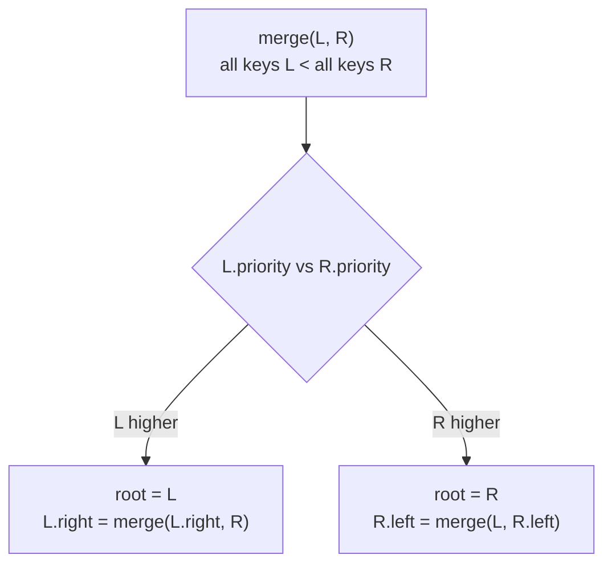

# Treap (Tree + Heap) — Middle Level

> **Audience:** Engineers comfortable with the rotation-based treap from `junior.md` — the dual invariant, bubble-up insert, rotate-down delete. We now switch to the formulation practitioners actually prefer: **split** and **merge**. These two `O(log n)` primitives express *every* treap operation, eliminate the rotation cases entirely, and unlock the treap's killer feature — the **implicit treap**, an "array with superpowers" supporting insert-at-position, erase-at-position, range reverse, and range queries in `O(log n)`. We also place the treap against its peers: randomized BSTs, skip lists, AVL, and Red-Black trees.

This document is where the treap stops being "a cute self-balancing BST" and becomes "the single most versatile ordered structure in a competitive programmer's toolkit". The split/merge view is the reason.

---

## Table of Contents

1. [Why Split/Merge Beats Rotations](#why-split-merge)
2. [Merge — Joining Two Ordered Treaps](#merge)
3. [Split — Cutting a Treap at a Key](#split)
4. [Insert, Delete, and Everything via Split/Merge](#ops-via-split-merge)
5. [Order Statistics — Augmenting with Subtree Size](#order-stats)
6. [The Implicit Treap — An Array with Superpowers](#implicit)
7. [Range Reverse with Lazy Propagation](#range-reverse)
8. [Range Queries (Sum, Min) on the Implicit Treap](#range-query)
9. [Comparison with Alternatives — AVL, Red-Black, Skip List, Randomized BST](#comparison)
10. [When to Choose a Treap](#when)

---

<a name="why-split-merge"></a>
## 1. Why Split/Merge Beats Rotations

The rotation-based insert/delete from `junior.md` works, but it has two annoyances:

1. You must reason about *which* rotation (left vs right) restores the heap, and get the direction exactly right at every level.
2. Operations like "concatenate two ordered sets" or "extract the keys in `[lo, hi]`" have no natural expression — you would have to compose many inserts and deletes.

The **split/merge** formulation replaces *all* of that with two primitives:

- **`merge(L, R)`** — given two treaps `L` and `R` where **every key in `L` is less than every key in `R`**, produce a single treap containing all their nodes. `O(log n)` expected.
- **`split(T, x)`** — given a treap `T` and a key `x`, produce two treaps `(L, R)` where `L` holds all keys `< x` and `R` holds all keys `≥ x` (the boundary convention is your choice). `O(log n)` expected.

Once you have these two, **every** other operation is a short composition:

| Operation | In terms of split/merge |
|---|---|
| Insert `k` | `split(T, k)` → `(L, R)`; new node `N`; `merge(merge(L, N), R)` |
| Delete `k` | `split` out `[k, k]`, `merge` the two outer parts |
| Search `k` | ordinary BST descent (split/merge not needed) |
| Concatenate two ordered sets | `merge(A, B)` directly (if all of A < all of B) |
| Extract range `[lo, hi]` | two splits isolate the middle treap |

No rotation directions, no per-level case analysis — just "cut here" and "join these". This is why nearly every published treap (cp-algorithms, ICPC libraries) uses split/merge.

---

<a name="merge"></a>
## 2. Merge — Joining Two Ordered Treaps

**Contract:** `merge(L, R)` assumes **all keys in `L` < all keys in `R`**. It returns a single valid treap.

**Idea:** The merged root must be whichever of `L`'s root or `R`'s root has the **higher priority** (heap invariant). If `L`'s root wins, it stays the root, its left subtree is untouched, and its right subtree becomes `merge(L.right, R)` — because everything in `L.right` is still less than everything in `R`. Symmetric if `R`'s root wins.



**Go:**
```go
func Merge(l, r *Node) *Node {
    if l == nil {
        return r
    }
    if r == nil {
        return l
    }
    if l.Priority > r.Priority {
        l.Right = Merge(l.Right, r)
        return l
    }
    r.Left = Merge(l, r.Left)
    return r
}
```

**Java:**
```java
static TreapNode merge(TreapNode l, TreapNode r) {
    if (l == null) return r;
    if (r == null) return l;
    if (l.priority > r.priority) {
        l.right = merge(l.right, r);
        return l;
    } else {
        r.left = merge(l, r.left);
        return r;
    }
}
```

**Python:**
```python
def merge(l, r):
    if l is None:
        return r
    if r is None:
        return l
    if l.priority > r.priority:
        l.right = merge(l.right, r)
        return l
    else:
        r.left = merge(l, r.left)
        return r
```

The recursion descends along a single root-to-leaf path of one tree at a time, so it is `O(height)` = expected `O(log n)`. Notice there are **no rotations** — merge rebuilds the spine directly.

---

<a name="split"></a>
## 3. Split — Cutting a Treap at a Key

**Contract:** `split(T, x)` returns `(L, R)` where `L` contains all keys `< x` and `R` contains all keys `≥ x`. (Pick a boundary convention and keep it; here `< x` goes left.)

**Idea:** Compare `x` with the root. If `root.key < x`, the root and its entire left subtree belong to `L`; only its right subtree might contain keys `≥ x`, so recursively split the right subtree and attach the smaller part as the root's new right child. Symmetric if `root.key ≥ x`.

**Go:**
```go
// Split returns (l, r): l has keys < x, r has keys >= x.
func Split(t *Node, x int) (*Node, *Node) {
    if t == nil {
        return nil, nil
    }
    if t.Key < x {
        l, r := Split(t.Right, x)
        t.Right = l
        return t, r
    }
    l, r := Split(t.Left, x)
    t.Left = r
    return l, t
}
```

**Java:**
```java
// Returns a 2-element array {l, r}: l has keys < x, r has keys >= x.
static TreapNode[] split(TreapNode t, int x) {
    if (t == null) return new TreapNode[]{null, null};
    if (t.key < x) {
        TreapNode[] sub = split(t.right, x);
        t.right = sub[0];
        return new TreapNode[]{t, sub[1]};
    } else {
        TreapNode[] sub = split(t.left, x);
        t.left = sub[1];
        return new TreapNode[]{sub[0], t};
    }
}
```

**Python:**
```python
def split(t, x):
    """Return (l, r): l has keys < x, r has keys >= x."""
    if t is None:
        return None, None
    if t.key < x:
        l, r = split(t.right, x)
        t.right = l
        return t, r
    else:
        l, r = split(t.left, x)
        t.left = r
        return l, t
```

Like merge, split walks a single path: expected `O(log n)`. The heap invariant is automatically preserved because we never move a node above an ancestor — we only detach subtrees along the search path and reassemble them with their original priorities intact.

---

<a name="ops-via-split-merge"></a>
## 4. Insert, Delete, and Everything via Split/Merge

With `split` and `merge` in hand, the high-level operations become one-liners.

### 4.1 Insert

```
split T at key k  ->  (L, R)
new node N with key k (random priority)
T = merge(merge(L, N), R)
```

A subtlety: this produces an `O(log n)` insert but always rebuilds the path with two splits/merges. A common optimization (the "insert with priority comparison" trick) inserts `N` directly at the position where its priority first exceeds an existing node's, splitting only the subtree below it. Both are `O(log n)`; the simple version is shown:

**Python:**
```python
def insert(root, key):
    l, r = split(root, key)
    # avoid duplicate: if key already in l's max or r's min, skip — omitted for brevity
    return merge(merge(l, Node(key)), r)
```

### 4.2 Delete

```
split T at k       -> (L, mid_plus)        # L = keys < k
split mid_plus at k+1 -> (M, R)            # M = keys == k, R = keys > k
discard M
T = merge(L, R)
```

**Python:**
```python
def delete(root, key):
    l, mid_r = split(root, key)        # l: < key
    mid, r = split(mid_r, key + 1)     # mid: == key, r: > key
    # mid (the single node) is dropped
    return merge(l, r)
```

For non-integer keys where `key + 1` is meaningless, split by `key` then peel the equal node off the right part's minimum, or merge the deleted node's two children directly:

**Python (merge-children variant):**
```python
def delete_merge_children(root, key):
    if root is None:
        return None
    if key < root.key:
        root.left = delete_merge_children(root.left, key)
    elif key > root.key:
        root.right = delete_merge_children(root.right, key)
    else:
        return merge(root.left, root.right)   # drop root, join its subtrees
    return root
```

This last form is the cleanest delete in the whole topic: find the node, replace it with `merge(left, right)`. Because all keys in `left` are less than all keys in `right`, the merge contract is satisfied.

### 4.3 Range extraction

To grab every key in `[lo, hi]` as its own treap (e.g., to process or move them):

```
(L, rest)  = split(T, lo)         # L: < lo
(M, R)     = split(rest, hi + 1)  # M: in [lo, hi], R: > hi
... use M ...
T = merge(merge(L, M), R)         # reassemble
```

This is the foundation of the implicit-treap range operations in §6–§8.

---

<a name="order-stats"></a>
## 5. Order Statistics — Augmenting with Subtree Size

Store `size` (number of nodes in the subtree) at each node. Maintain it after every structural change:

```
size(node) = 1 + size(node.left) + size(node.right)
```

**Go:**
```go
func sz(n *Node) int {
    if n == nil {
        return 0
    }
    return n.Size
}

func update(n *Node) {
    if n != nil {
        n.Size = 1 + sz(n.Left) + sz(n.Right)
    }
}
```

Call `update(node)` at the end of every `merge`, `split`, and rotation so the invariant is restored bottom-up. With `size` available:

- **k-th smallest key** — descend: if `size(left) + 1 == k` return root; if `k ≤ size(left)` go left; else `k -= size(left)+1`, go right. `O(log n)`.
- **rank of a key** — count nodes `< key` along the descent. `O(log n)`.

**Python (k-th smallest):**
```python
def kth(root, k):
    """1-indexed k-th smallest key."""
    while root is not None:
        left = root.left.size if root.left else 0
        if k == left + 1:
            return root.key
        if k <= left:
            root = root.left
        else:
            k -= left + 1
            root = root.right
    raise IndexError("k out of range")
```

This augmentation is also exactly what powers the **implicit treap**, where the "key" *is* the subtree-size-derived position.

---

<a name="implicit"></a>
## 6. The Implicit Treap — An Array with Superpowers

This is the treap's most striking application. An **implicit treap** stores a *sequence* (like an array) rather than a *set*. The trick: **there is no explicit key field at all.** A node's logical "key" is its **position** (0-based index) in the inorder traversal, computed on the fly from subtree sizes.

> The implicit key of a node = (number of nodes in its left subtree) + (number of nodes to its left in all ancestors where it sits in the right subtree). In practice you never store it — you derive the position during the descent using `size(left)`.

Because the position is derived from subtree sizes, **`split` by position** and **`merge`** give you, on a sequence of length `n`:

| Operation | Cost | How |
|---|---|---|
| `insert(pos, value)` | `O(log n)` | split at `pos`, merge `L + newNode + R` |
| `erase(pos)` | `O(log n)` | split out the single node at `pos`, merge the rest |
| `get(pos)` / `set(pos, v)` | `O(log n)` | descend by size |
| **`reverse(l, r)`** | `O(log n)` | split out `[l, r]`, flip a lazy flag, merge back |
| **range sum / min / max `[l, r]`** | `O(log n)` | split out `[l, r]`, read the subtree aggregate |
| concatenate two sequences | `O(log n)` | `merge` |

A plain array does `get`/`set` in `O(1)` but `insert`/`erase` in the middle in `O(n)`, and `reverse(l, r)` in `O(r-l)`. The implicit treap trades the `O(1)` random access for **`O(log n)` everything, including the operations arrays are terrible at**. That is the "array with superpowers".

### 6.1 Split by position

`split_by_size(t, k)` cuts off the first `k` elements (positions `0..k-1`) into `L`, the rest into `R`:

**Go:**
```go
// SplitBySize: L gets the first k elements, R gets the rest.
func SplitBySize(t *Node, k int) (*Node, *Node) {
    if t == nil {
        return nil, nil
    }
    push(t) // apply pending lazy ops before descending (see §7)
    if sz(t.Left) < k {
        l, r := SplitBySize(t.Right, k-sz(t.Left)-1)
        t.Right = l
        update(t)
        return t, r
    }
    l, r := SplitBySize(t.Left, k)
    t.Left = r
    update(t)
    return l, t
}
```

**Python:**
```python
def split_by_size(t, k):
    if t is None:
        return None, None
    push(t)
    left_size = t.left.size if t.left else 0
    if left_size < k:
        l, r = split_by_size(t.right, k - left_size - 1)
        t.right = l
        update(t)
        return t, r
    else:
        l, r = split_by_size(t.left, k)
        t.left = r
        update(t)
        return l, t
```

`merge` is identical to §2 (priority decides the root); it only needs `update` and `push` added for the augmentations and lazy flags.

---

<a name="range-reverse"></a>
## 7. Range Reverse with Lazy Propagation

Reversing a contiguous block `[l, r]` of a sequence in `O(log n)` is the implicit treap's signature trick. The idea: split out the block, set a **lazy "reversed" flag** on its root, and merge it back. We do not actually reverse anything yet — we *defer* it.

A node with the reversed flag set means "my subtree's inorder order is logically flipped". When we later descend into such a node (during split, merge, or query), we **push** the flag down: swap the node's children and propagate the flag to both, then clear it on this node. This lazy propagation keeps each operation `O(log n)`.

```
reverse(l, r):
    (A, BC) = split_by_size(T, l)         # A = [0, l)
    (B, C)  = split_by_size(BC, r-l+1)    # B = [l, r], C = (r, n)
    B.reversed ^= true                     # flip lazily
    T = merge(merge(A, B), C)
```

**Python:**
```python
def push(t):
    """Apply a pending reverse to t, propagating it to children lazily."""
    if t is not None and t.reversed:
        t.left, t.right = t.right, t.left
        if t.left:
            t.left.reversed ^= True
        if t.right:
            t.right.reversed ^= True
        t.reversed = False

def reverse(root, l, r):
    a, bc = split_by_size(root, l)
    b, c = split_by_size(bc, r - l + 1)
    if b:
        b.reversed ^= True
    return merge(merge(a, b), c)
```

**Go:**
```go
func push(t *Node) {
    if t != nil && t.Reversed {
        t.Left, t.Right = t.Right, t.Left
        if t.Left != nil {
            t.Left.Reversed = !t.Left.Reversed
        }
        if t.Right != nil {
            t.Right.Reversed = !t.Right.Reversed
        }
        t.Reversed = false
    }
}

func Reverse(root *Node, l, r int) *Node {
    a, bc := SplitBySize(root, l)
    b, c := SplitBySize(bc, r-l+1)
    if b != nil {
        b.Reversed = !b.Reversed
    }
    return Merge(Merge(a, b), c)
}
```

Every `split` and `merge` must call `push(t)` *before* it inspects a node's children, so a pending flip is materialized exactly when (and only when) it is needed. This is the same lazy-propagation discipline used by segment trees (`12-segment-trees`).

---

<a name="range-query"></a>
## 8. Range Queries (Sum, Min) on the Implicit Treap

Augment each node with an aggregate over its subtree — e.g., `subtree_sum` or `subtree_min` of the stored values. Maintain it in `update`, exactly like `size`:

```
subtree_sum(node) = node.value + subtree_sum(left) + subtree_sum(right)
```

A range query `sum(l, r)` then splits out the block `[l, r]` and reads its root's `subtree_sum` in `O(log n)`:

**Python:**
```python
def update(t):
    if t is None:
        return
    t.size = 1 + (t.left.size if t.left else 0) + (t.right.size if t.right else 0)
    s = t.value
    if t.left:  s += t.left.subtree_sum
    if t.right: s += t.right.subtree_sum
    t.subtree_sum = s

def range_sum(root, l, r):
    a, bc = split_by_size(root, l)
    b, c = split_by_size(bc, r - l + 1)
    ans = b.subtree_sum if b else 0
    root = merge(merge(a, b), c)
    return ans, root   # return both the answer and the reassembled tree
```

Combine this with the lazy-reverse flag and you have a sequence that supports, all in `O(log n)`: insert-at, erase-at, reverse a subrange, and sum/min over a subrange. Segment trees do range queries but cannot insert/erase elements in the middle; the implicit treap can. That combination — **structural mutation plus range aggregates** — is unique to balanced BSTs with split/merge, and the treap is the simplest of them.

> **Note:** Range *add* (add a constant to every element in `[l, r]`) is another lazy flag, layered the same way as reverse. Range assign, range affine transforms, etc. all compose. The implicit treap becomes a fully dynamic "sequence with lazy range updates".

---

<a name="comparison"></a>
## 9. Comparison with Alternatives — AVL, Red-Black, Skip List, Randomized BST

| Attribute | **Treap** | AVL | Red-Black | Skip List | Randomized BST (Martínez–Roura) |
|---|---|---|---|---|---|
| Search (expected) | O(log n) | O(log n) | O(log n) | O(log n) | O(log n) |
| Search (worst) | **O(n)** rare | O(log n) | O(log n) | **O(n)** rare | **O(n)** rare |
| Balance guarantee | Expected (randomized) | Deterministic | Deterministic | Expected (randomized) | Expected (randomized) |
| Balance metadata/node | 1 random priority | height/balance factor | 1 color bit | level + forward ptr array | subtree size |
| Implementation size | **Tiny** (split/merge) | Medium | **Large** | Small-medium | Small |
| `split` / `merge` | **Native O(log n)** | Awkward O(log n) | Awkward O(log n) | Possible O(log n) | Native O(log n) |
| Range reverse / implicit sequence | **Yes (implicit treap)** | No (no clean split) | No | No | Possible |
| Rotations | Few (or none w/ split/merge) | Up to O(log n) per op | ≤ 2–3 per op | None (pointer surgery) | Few |
| Source of randomness | Per-node priority | None | None | Per-node coin flips | RNG during insert/delete |
| Cache behavior | Pointer-chasing | Pointer-chasing | Pointer-chasing | Pointer-chasing (worse, taller) | Pointer-chasing |
| Persistence (immutable) | **Easy** (path-copy) | Harder | Harder | Harder | Easy |

### Key distinctions

- **Treap vs randomized BST (Martínez & Roura, 1998).** Both are randomized balanced BSTs with identical expected bounds. The difference is *where the randomness lives*. The treap fixes a random **priority per node** at creation; its shape is then deterministic. The Martínez–Roura randomized BST instead makes a **random choice during each insert/delete** (insert at the root with probability `1/(size+1)`), storing only subtree sizes — no priorities. They produce the same distribution of trees; the treap is usually considered simpler to reason about and is the one with the famous split/merge formulation.

- **Treap vs skip list.** Both are randomized, both expected `O(log n)`, both simple. A skip list is a layered linked list; it is often preferred for **concurrent** ordered maps (Java's `ConcurrentSkipListMap`) because lock-free skip lists are easier than lock-free trees. The treap wins when you need **split/merge** or the **implicit-sequence** operations, which skip lists do not offer naturally. The two have nearly identical analyses (both reduce to "expected number of levels/depth is `O(log n)`") — see `professional.md`.

- **Treap vs AVL/Red-Black.** AVL and Red-Black give a **guaranteed** (worst-case) `O(log n)`, which the treap only gives in **expectation**. For hard real-time, choose the deterministic tree. For everything else, the treap is far simpler to implement correctly and uniquely supports the implicit-sequence tricks. Production standard libraries use Red-Black (deterministic, well-understood) rather than treaps because library authors value worst-case guarantees and predictability over implementation brevity.

---

<a name="when"></a>
## 10. When to Choose a Treap

**Choose a treap when:**

- You need an **ordered set/map with `split` and `merge`** — e.g., splitting a sorted collection at a pivot, concatenating two ordered ranges, or repeatedly cutting and rejoining sequences.
- You need an **implicit-sequence structure**: a dynamic array supporting `O(log n)` insert/erase at arbitrary positions, range reverse, and range aggregates (the rope-like and editor-buffer use cases in `senior.md`).
- You are in **competitive programming** and want a balanced BST you can write from memory in minutes, with no rotation cases to debug.
- You want an **easily persistent** ordered structure (path-copying immutable treap).

**Choose AVL / Red-Black when:**

- You need a **guaranteed** worst-case `O(log n)`, not an expected one (hard real-time, adversarial latency SLAs).
- You are using a **standard-library ordered map** — it is almost certainly Red-Black already.

**Choose a skip list when:**

- You need a **concurrent / lock-free** ordered map and do not need split/merge or implicit-sequence ops.

**Choose a plain array or B-tree when:**

- The data is **read-mostly**; a sorted array's binary search or a cache-friendly B-tree beats any pointer-chasing BST (see `senior.md`).

---

## Further Reading

- **Seidel & Aragon.** "Randomized Search Trees." *Algorithmica* 16, 1996. The treap, with split/merge and the expected-height analysis.
- **Martínez, Conrado and Roura, Salvador.** "Randomized Binary Search Trees." *JACM* 45(2), 1998. The size-based randomized BST — the treap's closest relative.
- **cp-algorithms.com** — "Treap (Cartesian tree)": the canonical implicit-treap, split-by-size, and lazy-reverse reference.
- **Blelloch & Reid-Miller.** "Fast set operations using treaps." *SPAA* 1998. Parallel split/merge-based set union/intersection/difference.
- **CLRS** 4th ed., Problem 13-4 ("Treaps").
- Continue with `senior.md` for treaps as ordered-set/rope/editor-buffer structures in production, persistence, concurrency, and memory.
