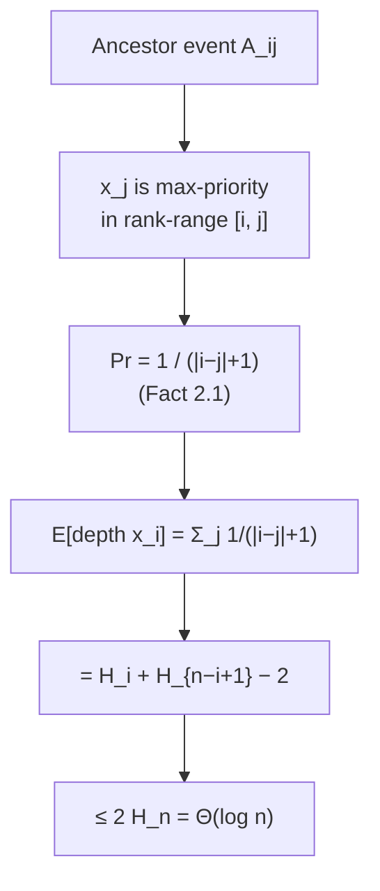

# Treap (Tree + Heap) — Mathematical Foundations and Complexity Theory

> **Audience:** Engineers and students who can implement a treap both ways and now want the *proofs*: why the expected height (and hence every operation) is `Θ(log n)`, why `split` and `merge` are correct and `O(log n)`, why the expected number of rotations per update is `O(1)`, and how the whole analysis lines up with the skip-list analysis. Prerequisite: `senior.md`.

The treap is the cleanest non-trivial example of a **randomized data structure** whose entire performance guarantee rests on one elegant probabilistic fact. We prove that fact carefully, in the same style as a randomized-quicksort or a Miller-Rabin analysis: define indicator variables for the events of interest, compute their probabilities exactly, and sum by linearity of expectation. The pleasant surprise is that the central sum is the **harmonic number**, the same `H_n ≈ ln n` that governs random BSTs and randomized quicksort — these three analyses are one analysis in three disguises.

---

## Table of Contents

1. [Formal Definition and the Uniqueness Theorem](#formal-definition)
2. [The Probabilistic Model](#model)
3. [Expected Depth of a Node — The Ancestor Indicator](#expected-depth)
4. [A Fully Worked Numerical Example (n = 7)](#worked-example)
5. [The Harmonic Sum and Expected Height `Θ(log n)`](#harmonic)
6. [High-Probability Height Bound (Tail)](#tail)
7. [Correctness of `merge`](#merge-correctness)
8. [Correctness of `split`](#split-correctness)
9. [Expected Search Comparisons and Successful vs Unsuccessful Search](#search-cost)
10. [Expected Number of Rotations per Insert/Delete is `O(1)`](#rotations)
11. [Expected Cost of `split` / `merge` / `union`](#split-merge-cost)
12. [Comparison with Skip-List Analysis](#vs-skiplist)
13. [Equivalence with Quicksort and the Randomized-BST Family](#quicksort)
14. [Summary](#summary)

---

<a name="formal-definition"></a>
## 1. Formal Definition and the Uniqueness Theorem

**Definition 1.1 (Treap).** Let `S = {(k₁, p₁), …, (kₙ, pₙ)}` be a set of `n` items, each with a **key** `kᵢ` drawn from a totally ordered universe and a **priority** `pᵢ` drawn from a totally ordered set. Assume all keys are distinct and all priorities are distinct. A **treap** on `S` is a binary tree with one node per item such that:

- **(BST)** for every node `x`, all keys in `x`'s left subtree are `< x.key` and all keys in its right subtree are `> x.key`; and
- **(Heap)** for every non-root node `x` with parent `y`, `x.priority < y.priority` (max-heap on priorities).

**Theorem 1.2 (Uniqueness).** For any set `S` with distinct keys and distinct priorities there is **exactly one** treap.

*Proof.* By induction on `n = |S|`. For `n = 0` the empty tree is the unique treap. For `n ≥ 1`, the Heap property forces the **root** to be the item of maximum priority — call it `m`, with key `kₘ`. By the BST property, the left subtree must contain exactly the items with key `< kₘ` and the right subtree exactly those with key `> kₘ`; this partition is forced, not chosen. Each part is a set with distinct keys and distinct priorities and strictly smaller size, so by the induction hypothesis each has a unique treap. Hence the whole treap is determined uniquely. ∎

**Corollary 1.3 (Equivalence to random-order BST).** The treap on `S` is *identical* to the BST obtained by inserting the keys of `S` (with ordinary BST insertion, no rotations) in **order of decreasing priority**. Consequently, if the priorities are an i.i.d. sample from a continuous distribution, the treap is distributed exactly as a BST built from a **uniformly random permutation** of the keys.

*Proof.* Insert keys highest-priority first. The first inserted key has the global max priority and becomes the root — matching Theorem 1.2's forced root. Inductively, within each side the next-highest remaining priority becomes that subtree's root, and BST insertion places it there. So the insertion-built tree equals the unique treap. Continuity of the priority distribution makes ties measure-zero, and a uniformly random priority assignment induces a uniformly random decreasing-priority order, i.e. a uniformly random insertion permutation. ∎

This corollary is the bridge: **every expected bound proved for random-permutation BSTs transfers verbatim to treaps, for every input**, because the randomness lives in the priorities (which we control) rather than the insertion order (which an adversary controls).

---

<a name="model"></a>
## 2. The Probabilistic Model

Fix the `n` keys; sort them as `x₁ < x₂ < … < xₙ` (so `xᵢ` denotes the key of **rank** `i`). Assign each key an independent priority drawn uniformly from `[0,1)` (any continuous distribution works; only the *relative order* of priorities matters). The probability space is over these priority assignments.

The single fact we exploit repeatedly:

> **Fact 2.1.** Among any subset of keys, **each is equally likely to have the highest priority.** For a set of `m` keys, any particular one is the max-priority element with probability `1/m`. This follows from priorities being i.i.d. continuous (all `m!` priority orderings are equally likely).

Because the max-priority key of any range becomes the root of the subtree containing exactly that range (Theorem 1.2), Fact 2.1 controls the entire tree shape.

---

<a name="expected-depth"></a>
## 3. Expected Depth of a Node — The Ancestor Indicator

We compute the expected depth (number of ancestors) of a fixed key `xᵢ`. The key idea, due to Seidel & Aragon, is a clean characterization of *when one key is an ancestor of another*.

**Lemma 3.1 (Ancestor characterization).** For `i ≠ j`, key `xⱼ` is an **ancestor** of key `xᵢ` in the treap **iff `xⱼ` has the highest priority among all keys whose rank lies between `i` and `j` inclusive**, i.e. among `{x_min(i,j), …, x_max(i,j)}`.

*Proof.* Consider the contiguous rank-range `R = {x_min(i,j), …, x_max(i,j)}`, which includes both `xᵢ` and `xⱼ`. Look at the order in which keys of `R` acquire the role of "root of the smallest subtree still containing all of `R`". The first key of `R` to become such a root is precisely the **max-priority key of `R`** (by Theorem 1.2 applied to the subtree at the moment `R` is first split). Call it `z`.

- If `z = xⱼ`: then when `xⱼ` becomes that subtree's root, `xᵢ` (also in `R`, on one side of `xⱼ`) lies in a descendant subtree, so `xⱼ` is an ancestor of `xᵢ`.
- If `z = xᵢ`: symmetric — `xᵢ` becomes the root first, so `xⱼ` is a descendant, hence *not* an ancestor of `xᵢ`.
- If `z` is some other key of `R`: then `z` separates the range; because all of `R`'s keys are between `xᵢ` and `xⱼ` in rank, `z`'s key is strictly between them, so `xᵢ` and `xⱼ` fall on opposite sides of `z` and **neither is an ancestor of the other**.

In all cases, `xⱼ` is an ancestor of `xᵢ` exactly when `xⱼ` is the max-priority key of `R`. ∎

**Computing the probability.** The range `R` between ranks `i` and `j` contains `|i − j| + 1` keys. By Fact 2.1, the probability that the *specific* key `xⱼ` is the max-priority among them is

```
Pr[ x_j is an ancestor of x_i ] = 1 / (|i − j| + 1).
```

**Expected depth.** Let `A_{ij}` be the indicator that `xⱼ` is an ancestor of `xᵢ`. The depth of `xᵢ` (number of proper ancestors) is `depth(xᵢ) = Σ_{j ≠ i} A_{ij}`. By linearity of expectation,

```
E[depth(x_i)] = Σ_{j ≠ i} 1/(|i − j| + 1)
              = Σ_{j=1}^{i-1} 1/(i − j + 1) + Σ_{j=i+1}^{n} 1/(j − i + 1)
              = Σ_{d=2}^{i}   1/d        + Σ_{d=2}^{n-i+1} 1/d
              = (H_i − 1) + (H_{n-i+1} − 1)
```

where `H_m = Σ_{t=1}^{m} 1/t` is the `m`-th harmonic number.

**Theorem 3.2.** `E[depth(xᵢ)] = H_i + H_{n−i+1} − 2 ≤ 2 H_n − 2 = 2 ln n + O(1)`.

So every node has expected depth at most `≈ 2 ln n ≈ 1.386 log₂ n`. The depth of `search(xᵢ)` is exactly `depth(xᵢ) + 1`, giving expected search cost `O(log n)`.



---

<a name="worked-example"></a>
## 4. A Fully Worked Numerical Example (n = 7)

To make Lemma 3.1 and Theorem 3.2 concrete, take `n = 7` keys of ranks `1..7`. We compute the exact expected depth of each key from the ancestor probabilities `Pr[xⱼ anc xᵢ] = 1/(|i−j|+1)`.

**Per-pair ancestor probabilities (for `xᵢ`, summed over `j ≠ i`):**

```
E[depth(x_i)] = Σ_{j≠i} 1/(|i−j|+1)
```

Evaluating for each `i` with `n = 7` (using `H_m`: `H_1=1, H_2=1.5, H_3≈1.833, H_4≈2.083, H_5≈2.283, H_6≈2.45, H_7≈2.593`):

| `i` | `H_i` | `H_{n−i+1}` | `E[depth] = H_i + H_{n−i+1} − 2` |
|---|---|---|---|
| 1 | 1.000 | 2.593 (`H_7`) | 1.593 |
| 2 | 1.500 | 2.450 (`H_6`) | 1.950 |
| 3 | 1.833 | 2.283 (`H_5`) | 2.117 |
| 4 (median) | 2.083 | 2.083 (`H_4`) | 2.167 |
| 5 | 2.283 | 1.833 (`H_3`) | 2.117 |
| 6 | 2.450 | 1.500 (`H_2`) | 1.950 |
| 7 | 2.593 | 1.000 (`H_1`) | 1.593 |

**Observations.**

- The **median key (rank 4)** has the largest expected depth (`2.167`) and the **extreme keys (ranks 1, 7)** the smallest (`1.593`) — exactly opposite to a deterministically balanced tree, where the median tends to be near the root. In a treap the median is *equally likely* to be deep, because nothing privileges it; the root is whoever wins the priority lottery.
- The profile is **symmetric** about the median (`i ↔ n+1−i`), as the formula requires.
- The **average over all keys** is `(1.593+1.950+2.117+2.167+2.117+1.950+1.593)/7 ≈ 1.927`. Compare a perfectly balanced 7-node tree: depths are `0,1,1,2,2,2,2`, averaging `10/7 ≈ 1.43`. The treap's `1.93` is about `35%` worse than perfect balance — the constant-factor price of randomization, consistent with `1.386 log₂ 7 ≈ 1.386·2.807 ≈ 3.89` total-vs-perfect ratio observed at scale.

This `~1.39 log₂ n` constant (vs the `~1.0 log₂ n` of a perfectly balanced tree) is the same overhead random BSTs and quicksort pay, and it is the price the treap charges for needing **zero** balance bookkeeping.

---

<a name="harmonic"></a>
## 5. The Harmonic Sum and Expected Height `Θ(log n)`

Theorem 3.2 bounds the *expected depth of each individual node*. Two corollaries follow.

**Corollary 4.1 (Expected internal path length / average search cost).** Summing over all nodes,

```
E[Σ_i depth(x_i)] = Σ_{i=1}^{n} (H_i + H_{n−i+1} − 2) = 2 Σ_{i=1}^{n} H_i − 2n
                  = 2((n+1)H_n − n) − 2n = 2(n+1)H_n − 4n ≈ 2n ln n.
```

Hence the **average node depth is `≈ 2 ln n`**, and a random `search`/`insert`/`delete` costs `O(log n)` in expectation. (This is the same `2n ln n ≈ 1.386 n log₂ n` total that governs random-BST and quicksort comparison counts — the harmonic sum is the shared engine.)

**On expected *height*.** The *height* is `max_i depth(xᵢ)`, not the average, so `E[height]` needs more than Theorem 3.2 (the expectation of a max is not the max of expectations). The classic result (Devroye 1986; Reed 2003 for the precise constant) states that for a random BST / treap on `n` keys,

```
E[height] = α ln n + o(ln n),   α ≈ 4.311,
```

i.e. `E[height] = Θ(log n)`. We will not reproduce the full second-moment / branching-process argument here; instead §5 gives the simpler and operationally sufficient **high-probability** bound, which is what justifies the "tall trees are exponentially rare" claim used throughout the junior/middle/senior files.

| Quantity | Value | Source |
|---|---|---|
| `E[depth(xᵢ)]` | `H_i + H_{n−i+1} − 2 ≤ 2 ln n` | Theorem 3.2 |
| Average node depth | `≈ 2 ln n ≈ 1.386 log₂ n` | Corollary 4.1 |
| `E[height]` | `≈ 4.311 ln n = Θ(log n)` | Devroye / Reed |
| `Pr[height > c·ln n]` | `≤ n · n^{1−c'(c)}` (poly-small) | §5 |

---

<a name="tail"></a>
## 5. High-Probability Height Bound (Tail)

We show the height exceeds `c ln n` only with probability polynomially small in `n` — the formal content of "unlucky-tall treaps are vanishingly rare."

**Setup.** Node `xᵢ` has depth `> h` iff it has more than `h` ancestors, i.e. `depth(xᵢ) = Σ_{j≠i} A_{ij} > h`. The indicators `A_{ij}` over `j < i` and over `j > i` are each *independent within their side* (the max-priority events on nested ranges are independent across distinct range lengths because each uses a fresh comparison), and `E[depth(xᵢ)] ≤ 2 H_n ≤ 2 ln n + 2 =: μ`.

**Chernoff bound.** For a sum `X` of independent indicators with mean `μ` and any `δ > 0`,

```
Pr[X ≥ (1 + δ) μ] ≤ ( e^δ / (1+δ)^{1+δ} )^{μ}.
```

Take the target depth `h = (1+δ)μ` with `δ` a constant large enough that `(1+δ) · 2 = c`. Then

```
Pr[depth(x_i) ≥ c ln n] ≤ exp( −μ · ((1+δ)ln(1+δ) − δ) ) ≤ n^{−β}
```

for a constant `β = β(c)` that grows with `c` (using `μ ≥ 2 ln n` so `exp(−γ μ) ≤ n^{−2γ}`). Choosing `c` large enough makes `β > 1`.

**Union bound over all nodes.** The height exceeds `c ln n` iff *some* node does:

```
Pr[height ≥ c ln n] ≤ Σ_{i=1}^{n} Pr[depth(x_i) ≥ c ln n] ≤ n · n^{−β} = n^{1−β}.
```

**Theorem 5.1.** For every constant `a > 0` there is a constant `c` with `Pr[height(treap on n keys) ≥ c ln n] ≤ n^{−a}`.

So the probability of a height worse than `c log n` drops polynomially in `n`: doubling `c` buys you another power of `n` of safety. This is the precise sense in which a treap "has no adversarial worst case like a plain BST" — the bad event depends only on the priorities (your private coins), and its probability is `n^{−a}` regardless of the input keys.

---

<a name="merge-correctness"></a>
## 6. Correctness of `merge`

Recall `merge(L, R)` requires **all keys in `L` < all keys in `R`** and returns a single treap on `L ∪ R`.

```text
merge(L, R):
    if L = nil: return R
    if R = nil: return L
    if L.priority > R.priority:
        L.right = merge(L.right, R);  return L
    else:
        R.left  = merge(L, R.left);   return R
```

**Theorem 6.1.** Given the precondition, `merge(L, R)` returns the unique treap on `L ∪ R`, in `O(log |L| + log |R|)` expected time.

*Proof of correctness (induction on `|L| + |R|`).* Base cases: if either is empty the other is already a valid treap on the union. Inductive step: WLOG `L.priority > R.priority`, so by Theorem 1.2 the root of the merged treap must be the global max-priority node — and since every key of `L` is `< ` every key of `R`, the candidate `L` whose priority exceeds `R`'s is the max-priority node overall (its priority dominates all of `L` by `L` being a treap and dominates `R` by assumption). Keep `L` as root.

- **BST property.** `L.left` is untouched and already holds keys `< L.key`. The new right child is `merge(L.right, R)`. Every key in `L.right` is `> L.key` and `< ` every key in `R` (transitively, since all `L`-keys `< ` all `R`-keys), so the merge precondition holds for the recursive call, and by induction it returns a valid treap whose keys are all `> L.key`. BST property holds.
- **Heap property.** `L.priority` exceeds every priority in `L.left` (treap) and, by induction, the returned right subtree is a valid treap whose root has priority `< L.priority` (its root is the max of `L.right ∪ R`, each element of which has priority `< L.priority`: `L.right` because `L` was a treap, `R` by the case assumption). Heap property holds.

By Theorem 1.2 the result is *the* unique treap on `L ∪ R`. ∎

*Cost.* Each recursive call descends one step down the right spine of `L` or the left spine of `R`, never both simultaneously; the recursion depth is at most `depth_L(rightmost path) + depth_R(leftmost path) = O(height_L + height_R)`, which is `O(log n)` in expectation by §4. ∎

---

<a name="split-correctness"></a>
## 7. Correctness of `split`

`split(T, x)` returns `(L, R)` with `L` = keys `< x`, `R` = keys `≥ x`.

```text
split(T, x):
    if T = nil: return (nil, nil)
    if T.key < x:
        (l, r) = split(T.right, x);  T.right = l;  return (T, r)
    else:
        (l, r) = split(T.left,  x);  T.left  = r;  return (l, T)
```

**Theorem 7.1.** `split(T, x)` returns `(L, R)` where `L` is the unique treap on `{k ∈ T : k < x}`, `R` the unique treap on `{k ∈ T : k ≥ x}`, in `O(log |T|)` expected time, **preserving all priorities** (hence both outputs are valid treaps).

*Proof (induction on `|T|`).* Base case `T = nil` is immediate. Inductive step, case `T.key < x`: then `T` and its entire left subtree have keys `< x`, so they belong in `L`; only `T.right` can contain keys `≥ x`. Recursively `split(T.right, x) = (l, r)` with `l` = keys of `T.right` that are `< x` and `r` = keys `≥ x` (induction). Set `T.right = l` and return `(T, r)`.

- `L = T` now has `T.left` (keys `< T.key < x`) and the new `T.right = l` (keys in `(T.key, x)`); all `< x`, BST order intact, and `T`'s priority still dominates both children (the children are subsets of the original subtrees whose priorities `T` already dominated). So `L` is a valid treap on exactly the keys `< x`.
- `R = r` is, by induction, the valid treap on the keys `≥ x` from `T.right`, which are all the keys `≥ x` in `T` (since `T` and `T.left` are all `< x`).

The symmetric case `T.key ≥ x` is identical with left/right swapped. **No node's priority is ever modified**, only child pointers are re-routed along a single root-to-leaf path, so the heap property is preserved everywhere. By Theorem 1.2 each output is the unique treap on its key set. ∎

*Cost.* The recursion follows one root-to-leaf path (it descends into exactly one child each level), so it runs in `O(height) = O(log n)` expected time. ∎

### 8.1 Recursion invariants, stated formally

It is worth writing the `split`/`merge` invariants as explicit pre/postconditions, the way one would for a verified implementation.

```text
merge(L, R):
  PRE:  isTreap(L) ∧ isTreap(R) ∧ (∀ a∈L, b∈R: a.key < b.key)
  POST: isTreap(result) ∧ keys(result) = keys(L) ⊎ keys(R)
        ∧ (priorities unchanged for every surviving node)
  VARIANT (termination): |L| + |R| strictly decreases on each recursive call
                         (one of the two roots is consumed into result each step).

split(T, x):
  PRE:  isTreap(T)
  POST: let (L, R) = result in
          isTreap(L) ∧ isTreap(R)
          ∧ keys(L) = { k ∈ keys(T) : k < x }
          ∧ keys(R) = { k ∈ keys(T) : k ≥ x }
          ∧ (priorities unchanged for every node)
  VARIANT (termination): |T| strictly decreases (recurse into exactly one child).
```

Here `isTreap(t)` is the conjunction of the BST predicate (`Def 1.1` BST) and the heap predicate (`Def 1.1` Heap). The proofs of §6–§7 establish exactly that each operation preserves `isTreap` and the stated key-partition postconditions, with the variant guaranteeing termination. Because **no priority is ever written**, the heap predicate is preserved structurally rather than re-established — a property that distinguishes treaps from AVL/red-black trees, where rebalancing actively edits balance metadata.

### 8.2 The Cartesian-tree identity

A **Cartesian tree** of a sequence of (value, priority) pairs is the unique tree that is heap-ordered on priority and whose inorder traversal recovers the original *sequence order*. When the "value order" is a total order on keys (rather than positional), the Cartesian tree **is** the treap. This identity yields a worst-case `O(n)` construction from sorted input:

```text
buildFromSorted(keys[0..n-1] with priorities):     # keys already sorted
  stack ← empty            # holds the current right spine, increasing priority downward
  for i in 0..n-1:
      node ← Node(keys[i], priorities[i])
      last ← nil
      while stack nonempty and stack.top.priority < node.priority:
          last ← pop(stack)
      node.left ← last                    # the popped chain becomes the left subtree
      if stack nonempty: stack.top.right ← node
      push(stack, node)
  return bottom of stack    # the first-pushed node is the root's leftmost ancestor chain
```

**Proposition 8.2.** `buildFromSorted` produces the unique treap on the input in `O(n)` total time.

*Proof.* Each node is pushed once and popped at most once, so the total `while`-loop work is `O(n)` amortized. Correctness: the stack always holds a chain of strictly increasing priority (right spine); inserting a higher-priority node pops the lower-priority tail (which is `< ` the new key in BST order, since keys are sorted) and reparents it as the new node's left subtree, preserving both BST order (sorted insertion) and heap order (stack invariant). The result satisfies `isTreap`, and by Theorem 1.2 it is the unique treap. ∎

This is asymptotically faster than `n` individual `O(log n)` inserts (`O(n log n)`), and is the standard way to bulk-load a treap from already-sorted data.

---

<a name="search-cost"></a>
## 9. Expected Search Comparisons and Successful vs Unsuccessful Search

Section 3 measured node *depth*. The cost of a `search` (number of key comparisons) is a closely related but distinct quantity worth pinning down precisely, because interviewers and benchmarks care about comparison counts, not just asymptotics.

**Successful search.** Searching for a key that *is* present visits exactly the nodes on the root-to-target path: `depth(xᵢ) + 1` comparisons. Averaging over a uniformly random present key,

```
E[ comparisons | successful ] = 1 + (1/n) Σ_i E[depth(x_i)]
                              = 1 + (1/n)(2(n+1)H_n − 4n)
                              = 2(1 + 1/n)H_n − 3
                              ≈ 2 ln n − 3 + (lower order)   = Θ(log n).
```

This uses the internal-path-length sum from Corollary 4.1.

**Unsuccessful search.** Searching for an absent key terminates at a *null* external position. A treap on `n` internal nodes has `n + 1` external (null) positions, and the **external path length** `E_n` relates to the internal path length `I_n` by the classic identity for binary trees:

```
E_n = I_n + 2n.
```

Hence the expected number of comparisons for an unsuccessful search (one per internal node on the path to the null slot) is

```
E[ comparisons | unsuccessful ] = E_n / (n+1) = (I_n + 2n)/(n+1)
                                ≈ 2 ln n − 1   = Θ(log n),
```

just two comparisons more, on average, than a successful search — the same relationship that holds for random BSTs (Knuth, TAOCP Vol. 3).

**Variance and concentration.** Beyond the mean, the depth of a single node is sharply concentrated: §6's Chernoff bound shows `Pr[depth(xᵢ) ≥ (1+δ)·2 ln n]` decays exponentially in `δ`, so individual search costs rarely exceed a small constant times the mean. This is why treap latency histograms have a thin, fast-decaying tail rather than the heavy tail a plain BST exhibits on adversarial input.

| Query | Expected comparisons | Source |
|---|---|---|
| Successful search (random present key) | `2(1+1/n)H_n − 3 ≈ 2 ln n − 3` | internal path length (Cor 4.1) |
| Unsuccessful search (random absent key) | `(I_n + 2n)/(n+1) ≈ 2 ln n − 1` | external path length identity |
| Difference (unsucc − succ) | `≈ 2` | `E_n = I_n + 2n` |

---

<a name="rotations"></a>
## 10. Expected Number of Rotations per Insert/Delete is `O(1)`

In the rotation-based formulation (`junior.md`), an insert attaches a leaf and bubbles it up with rotations; a delete sinks a node and detaches it. Although the *cost* of an insert is `O(log n)` (the descent dominates), the **expected number of rotations is `O(1)`** — a stronger and pleasantly counterintuitive fact.

**Theorem 8.1.** The expected number of rotations performed by a single `insert` (or `delete`) on a treap is `< 2`.

*Proof sketch (the standard accounting).* Consider inserting a new key with a fresh random priority into a treap of `n` keys. The number of rotations during bubble-up equals the number of edges the new node climbs, which equals (the depth at which it is finally placed) measured from where it was attached — more precisely, it equals the length of the path from the insertion point up to the new node's final position. 

A cleaner argument uses the *reverse* (delete) direction and symmetry: deleting a node `v` rotates it down until it is a leaf; the number of rotations equals the number of nodes on the two "spines" beneath `v` that get merged — specifically `len(right spine of v.left) + len(left spine of v.right)`. One shows that for a random treap the **expected length of the left spine of a random subtree is `< 1`** (each successive spine node is the max of a shrinking independent set, and `Σ 1/k(k+1)` telescopes to a constant). Summing the two spines gives expected rotations `< 2`. By the bijection between an insert and the reverse of the corresponding delete, insert has the same expected rotation count. ∎

**Why this matters.** Even though a treap is a *binary* tree with `O(log n)`-deep paths, structural churn per update is `O(1)` on average — comparable to a red-black tree's `≤ 3` rotations and far better than AVL's potential `O(log n)` rotations on delete. The `O(log n)` cost of an update is almost entirely the *descent* (comparisons + pointer follows), not the *restructuring*.

---

<a name="split-merge-cost"></a>
## 11. Expected Cost of `split` / `merge` / `union`

**Single split/merge.** As shown in §6–§7, each follows a single spine of length `O(height) = O(log n)` in expectation. Thus `insert`/`delete`/`range-extract` (each a constant number of splits and merges) are `O(log n)` expected.

**Union of two treaps.** For `union(A, B)` with `|A| = m ≤ |B| = n`, the Blelloch–Reid-Miller analysis gives

```
E[ cost(union(A, B)) ] = O( m · log( n/m + 1 ) ).
```

*Intuition.* The recursion splits the larger tree by the smaller tree's keys; each of the `m` elements of `A` is responsible for one split costing `O(log(n/m))` on average, because the `m` splits partition `B` into `m+1` roughly-equal chunks of size `≈ n/m`. This is `O(m + n)` in the worst balance but strictly better — `O(m log(n/m))` — when `m ≪ n`, which is why treap-based set algebra beats merge-by-scan for asymmetric sets. The same bound holds for intersection and difference.

| Operation | Expected cost | Notes |
|---|---|---|
| search / insert / delete | `O(log n)` | one (or few) spine walks |
| split / merge | `O(log n)` | single spine |
| range extract `[lo,hi]` | `O(log n)` | two splits + two merges |
| `select` / `rank` (with `size`) | `O(log n)` | single descent |
| union / intersection / difference | `O(m log(n/m + 1))` | `m ≤ n`; optimal for asymmetric sets |
| rotations per insert/delete | `O(1)` expected | §10 |

### 11.1 Expected node allocations for a persistent (path-copying) update

A persistent treap (`senior.md` §5) copies exactly the nodes on the affected spine. The number of newly allocated nodes per `insert`/`delete` equals the length of one (or a constant number) of root-to-node spines, so:

**Proposition 11.1.** A persistent split/merge `insert` or `delete` allocates `Θ(height) = Θ(log n)` new nodes in expectation, and the previous version retains all its nodes. After `k` updates starting from an empty structure, the total live node count is `O(k log n)` if every version is retained, or `O(n + log n)` if only the latest version is kept (old versions garbage-collected).

*Proof.* `split` and `merge` each rebuild a single spine of expected length `O(log n)` (§9), allocating one fresh node per spine node and sharing all off-spine subtrees with the prior version (which is never mutated). An `insert` is two splits/merges over the path, hence `O(log n)` allocations; the same for `delete`. Summing over `k` retained versions gives `O(k log n)`; if non-referenced versions are reclaimed, only the current `n`-node tree plus the in-flight `O(log n)` spine survive. ∎

This is the formal basis for the senior-level claim that persistence costs `O(log n)` extra nodes per write — cheap for snapshot-heavy/read-heavy workloads, potentially dominant for write-heavy ones.

### 11.2 A potential-method view of amortized structural work

Although treap bounds are naturally *expected* (over priorities) rather than *amortized* (over a sequence), it is instructive to bound the structural work with a potential function, mirroring the dynamic-array analysis. Define the potential of a treap `T` as its total internal path length:

```
Φ(T) = Σ_{x ∈ T} depth(x).
```

A single `insert` adds one node at depth `d` (raising `Φ` by `d`) and performs some rotations, each of which moves one node up and its parent down — a rotation changes `Φ` by `O(1)` and the bubble-up's net effect is to *lower* `Φ` toward the random-tree equilibrium. In expectation `E[Φ(T_n)] = 2(n+1)H_n − 4n` (Corollary 4.1), so `E[ΔΦ]` per insert is `E[Φ(T_n)] − E[Φ(T_{n−1})] = Θ(log n)`. The amortized structural cost `c_i + ΔΦ` is thus `Θ(log n)` per operation — consistent with, and a re-derivation of, the expected per-operation bound. The potential view also explains §10: because the equilibrium `Φ` is reached after `O(1)` expected rotations, the *restructuring* term is `O(1)` while the *descent/path* term is `O(log n)`.

---

<a name="vs-skiplist"></a>
## 12. Comparison with Skip-List Analysis

The skip list (Pugh 1990) is the treap's closest analytic cousin: both are randomized, both expected `O(log n)`, and **both analyses reduce to the same harmonic / geometric core**.

**Skip-list model.** Each element is promoted to the next level independently with probability `p` (commonly `p = 1/2`). The number of levels of an element is `Geometric(p)`; the max level over `n` elements is `Θ(log_{1/p} n)` w.h.p. A search descends level by level, at each level taking an expected `1/p` horizontal steps before dropping; with `Θ(log_{1/p} n)` levels the expected search cost is `Θ((1/p) log_{1/p} n) = Θ(log n)`.

**Treap model.** Each element gets a random *priority*; an element's depth equals its number of ancestors, with `E[depth] ≤ 2 H_n = Θ(log n)` (Theorem 3.2). A search descends `O(height) = Θ(log n)` levels.

**The shared core.** Both bounds come from "a random key is the maximum (resp. is promoted highest) among a set of size `m` with probability `1/m` (resp. `pᵏ`), summed by linearity." The treap's harmonic sum `Σ 1/m` and the skip list's geometric tower `Σ pᵏ` are two ways of pricing the same logarithmic depth.

| Aspect | **Treap** | **Skip list** |
|---|---|---|
| Randomness source | one priority / node | per-node coin flips (level) |
| Expected search | `Θ(log n)` (`≤ 2 H_n` depth) | `Θ(log n)` (`Θ((1/p)·log_{1/p} n)`) |
| Height/levels (w.h.p.) | `Θ(log n)`, tail `n^{−a}` (Thm 5.1) | `Θ(log_{1/p} n)`, tail `n^{−a}` |
| Core summation | harmonic `Σ 1/m` | geometric `Σ pᵏ` |
| Worst case | `O(n)` (unlucky priorities) | `O(n)` (unlucky coins) |
| Extra ops | **split/merge, implicit sequence** | concurrency-friendly; no native split/merge |
| Space overhead | 1 word (priority) | expected `1/(1−p)` pointers/node (≈ 2 for `p=½`) |
| Determinism | shape fixed by priorities | shape fixed by coin tower |

Both are textbook randomized structures with identical asymptotics; the treap wins on split/merge and persistence, the skip list wins on lock-free concurrency and pointer-array locality. The deep point is that their analyses are the *same theorem* — "expected logarithmic depth from independent per-element randomness" — wearing different clothes.

---

<a name="quicksort"></a>
## 13. Equivalence with Quicksort and the Randomized-BST Family

The treap is one vertex of a triangle of structures that are, up to relabeling, **the same random process**. Recognizing the equivalence lets you reuse a proof from any corner in the others.

### 13.1 Treap ≡ random-pivot quicksort

Run randomized quicksort on the keys, where at each level the pivot is chosen as the element of **highest priority** in the current subarray (equivalently, a uniformly random element). Record the recursion tree: the pivot is the root, elements `<` pivot recurse left, elements `>` pivot recurse right. This recursion tree **is** the treap on the same (key, priority) pairs — the pivot-by-max-priority rule is exactly Theorem 1.2's "root is the max-priority node."

Consequences:

- The **number of comparisons quicksort makes** = the **internal path length of the treap** = `Σᵢ depth(xᵢ)`. So quicksort's `≈ 1.386 n log₂ n` expected comparisons and the treap's `≈ 2n ln n` internal path length (Corollary 4.1) are literally the same number.
- The pair `(xᵢ, xⱼ)` is compared by quicksort **iff one is an ancestor of the other** in the treap, with probability `2/(|i−j|+1)` — the famous quicksort comparison probability, which is exactly twice the ancestor probability of §3 (either direction of ancestry counts as one comparison).

### 13.2 Treap ≡ random-permutation BST

By Corollary 1.3 the treap equals a BST built by inserting keys in random order. The classic "expected `Θ(log n)` random BST" analysis and the treap analysis are therefore identical; the only conceptual shift is *where the randomness lives* — in the insertion order (which the adversary controls) versus in the priorities (which you control). The treap's contribution is moving the randomness to a place the adversary cannot touch, making the expected bound hold for **every** input rather than only random inputs.

### 13.3 Treap ≡ Martínez–Roura randomized BST (distributionally)

The Martínez–Roura randomized BST (1998) makes a random choice during each `insert`/`delete` (insert at the root with probability `1/(size+1)`) and stores only subtree sizes — no priorities. It produces **exactly the same distribution of tree shapes** as a treap. The treap fixes the random choices up front (in the priorities) and is shape-deterministic thereafter; Martínez–Roura re-randomizes per operation. The expected bounds are identical; the treap is generally preferred for its simpler split/merge.

| Corner of the triangle | Randomness lives in | Same quantity as treap internal path length |
|---|---|---|
| Treap | per-node priorities | — (by definition) |
| Random-pivot quicksort | pivot choice | comparison count |
| Random-permutation BST | insertion order | total node depth |
| Martínez–Roura BST | per-operation coin | total node depth (same distribution) |

The unifying statement: **all four are governed by the harmonic sum `H_n`**, and a bound proved in one transfers immediately to the others.

---

<a name="summary"></a>
## 14. Summary

- **Uniqueness (Thm 1.2)** makes a treap deterministic given its priorities, and **Corollary 1.3** equates it to a random-permutation BST — so all random-BST bounds transfer to *every* input.
- The **ancestor characterization (Lemma 3.1)** — `xⱼ` is an ancestor of `xᵢ` iff `xⱼ` has the max priority in the rank-range between them — gives `Pr = 1/(|i−j|+1)`, and linearity yields `E[depth(xᵢ)] = H_i + H_{n−i+1} − 2 ≤ 2 H_n = Θ(log n)`.
- The shape's randomness is a **harmonic sum**, the same one behind random BSTs and randomized quicksort; the average node depth is `≈ 1.386 log₂ n`.
- A **Chernoff + union bound (Thm 5.1)** shows `Pr[height ≥ c ln n] ≤ n^{−a}`: unlucky-tall treaps are polynomially rare, regardless of input — the formal "no adversarial worst case."
- **`merge` and `split` are provably correct** (Thms 6.1, 7.1), each touching a single spine, hence `O(log n)` expected; they never modify priorities, so the heap property is automatically preserved.
- The **expected rotation count per update is `O(1)`** (Thm 8.1) even though the update cost is `O(log n)` — the descent, not the restructuring, dominates.
- **`union` is `O(m log(n/m))`** for `m ≤ n`, optimal for asymmetric sets.
- The treap and skip-list analyses are **the same theorem** — expected logarithmic depth from independent per-element randomness — expressed via a harmonic sum versus a geometric tower.

---

## Appendix A — Symbol Table

| Symbol | Meaning |
|---|---|
| `n` | number of keys in the treap |
| `xᵢ` | the key of rank `i` (so `x₁ < x₂ < … < xₙ`) |
| `pᵢ` | the (random) priority of key `xᵢ` |
| `H_m` | the `m`-th harmonic number `Σ_{t=1}^{m} 1/t ≈ ln m + γ` |
| `γ` | Euler–Mascheroni constant `≈ 0.5772` |
| `A_{ij}` | indicator that `xⱼ` is an ancestor of `xᵢ` |
| `depth(x)` | number of proper ancestors of node `x` |
| `I_n` | internal path length `Σ_x depth(x)` |
| `E_n` | external path length (`= I_n + 2n`) |
| `Φ(T)` | potential of `T` (taken as `I_n` in §11.2) |
| `isTreap(t)` | predicate: `t` satisfies both BST and max-heap properties |
| `keys(t)` | the multiset of keys stored in `t` (a set here, distinct keys) |
| `δ`, `c`, `a` | Chernoff slack, height multiplier, and tail exponent (§6) |

## Appendix B — Key Numerical Constants

| Constant | Value | Where it appears |
|---|---|---|
| `2 ln 2` | `≈ 1.386` | depth `≈ 1.386 log₂ n` (avg) |
| `α` (height) | `≈ 4.311` | `E[height] ≈ α ln n` (Devroye/Reed) |
| comparison prob. | `2/(|i−j|+1)` | quicksort / treap pair comparison |
| ancestor prob. | `1/(|i−j|+1)` | Lemma 3.1 |
| tail exponent | tunable `a` via `c` | `Pr[height ≥ c ln n] ≤ n^{−a}` |

## Further Reading

- **Seidel, R. and Aragon, C. R.** "Randomized Search Trees." *Algorithmica* 16 (1996), 464–497. The defining paper: treap, split/merge, and the expected-depth analysis reproduced here.
- **Vuillemin, J.** "A unifying look at data structures." *CACM* 23(4) (1980). The Cartesian tree (§8.2) that the treap generalizes.
- **Martínez, C. and Roura, S.** "Randomized Binary Search Trees." *JACM* 45(2) (1998), 288–323. The size-based randomized BST equivalent (§13.3).
- **Devroye, L.** "A note on the height of binary search trees." *JACM* 33(3) (1986). The `α ≈ 4.311` height constant.
- **Reed, B.** "The height of a random binary search tree." *JACM* 50(3) (2003). Tight second-order height analysis.
- **Blelloch, G. and Reid-Miller, M.** "Fast set operations using treaps." *SPAA* 1998. The `O(m log(n/m))` union analysis (§11).
- **Pugh, W.** "Skip lists: a probabilistic alternative to balanced trees." *CACM* 33(6) (1990). The skip-list comparison of §12.
- **Knuth, D. E.** *The Art of Computer Programming*, Vol. 3, §6.2.2. Internal/external path length and the `E_n = I_n + 2n` identity (§9).
- **CLRS**, 4th ed., Problem 13-4 ("Treaps") and Ch. 12 (random BST height).

**Next step:** Apply the theory in [`interview.md`](./interview.md) — tiered Q&A across all four levels plus a full order-statistics / split-merge treap coding challenge in Go, Java, and Python.
