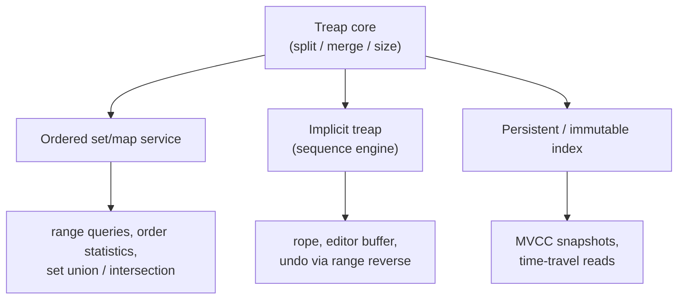

# Treap (Tree + Heap) — Senior Level

> **Audience:** Engineers who can already implement a treap both ways — rotation-based (`junior.md`) and split/merge (`middle.md`) — and now want to wire it into real systems. We move from "here is the algorithm" to "here is how a treap behaves as the engine of an ordered-set/map service, a rope / editor buffer, a persistent immutable index, and a concurrent structure", with the memory, latency, and failure characteristics a senior engineer is paid to anticipate.

The treap's two senior-level selling points are the ones almost no other balanced tree gives you cheaply: **`split`/`merge` as first-class `O(log n)` operations** (everything else — set union, range move, order statistics — is built from them) and **trivial path-copying persistence**. The cost is that balance is *expected*, not guaranteed, so the senior conversation is largely about *when that probabilistic bound is acceptable* and *how to bound the tail in practice*.

---

## Table of Contents

1. [Introduction — The Treap as a System Component](#introduction)
2. [Ordered-Set / Ordered-Map Services Built on Treaps](#ordered-set)
3. [Split/Merge Use Cases — Set Algebra, Range Move, Sharding](#split-merge-uses)
4. [The Implicit Treap as a Sequence Engine — Ropes and Editor Buffers](#implicit-engine)
5. [Persistence — Path-Copying Immutable Treaps](#persistence)
6. [Concurrency — Locking, Lock-Free, and Functional Approaches](#concurrency)
7. [Memory Layout, Node Pooling, and Cache Behavior](#memory)
8. [Bulk Loading and Batch Operations](#bulk)
9. [A Capacity-Planning Worked Example](#capacity)
10. [Comparison with Alternative Engines](#comparison)
11. [Observability and Operational Health](#observability)
12. [Failure Modes and How to Defend Against Them](#failure-modes)
13. [Engineering Decision Framework](#decision)
14. [Summary](#summary)
15. [Further Reading](#further-reading)

---

<a name="introduction"></a>
## 1. Introduction — The Treap as a System Component

At the junior/middle level a treap is an algorithm you call. At the senior level it is a *component you own*: it has a memory budget, a latency distribution with a fat tail you must understand, a concurrency story, a persistence story, and a set of failure modes. The question stops being "is it `O(log n)`?" and becomes "what is its p99.9 latency under my workload, how much heap does it pin, what happens when two threads touch it, and can I snapshot it for a reader without blocking writers?"

A treap earns its place in a system in exactly the situations where the standard-library ordered map (almost always a red-black tree) falls short:

- You need to **split or merge ordered collections** in `O(log n)` — concatenate two sorted ranges, cut a collection at a pivot, move a contiguous block from one sequence to another. Red-black trees can do this but the code is painful; treaps make it a two-liner.
- You need a **dynamic sequence** (insert/erase in the middle, range reverse, range aggregates) — the implicit treap is the simplest balanced structure that does all of these.
- You need **cheap immutable snapshots** — path-copying persistence costs `O(log n)` per update and gives every reader a consistent, never-changing view.

The rest of this document is about the engineering consequences of each.



---

<a name="ordered-set"></a>
## 2. Ordered-Set / Ordered-Map Services Built on Treaps

An ordered set/map exposes the usual `insert`, `erase`, `contains`, `get`, plus the ordered extras that justify using a tree over a hash map: `floor`, `ceiling`, `predecessor`, `successor`, ordered iteration, and — the treap's differentiators — `rank`, `select` (k-th element), `split`, `merge`, and range operations.

### 2.1 The augmentation contract

Every senior treap stores `size` (subtree node count) so that order statistics are `O(log n)`. The discipline is simple and absolute: **`update(node)` is called at the end of every operation that changes a node's children** — `merge`, `split`, and (if you keep them) rotations. Miss one call and `rank`/`select` silently return wrong answers without crashing, the worst kind of bug.

**Go:**
```go
type Node struct {
    Key      int
    Priority uint64
    Size     int
    Left     *Node
    Right    *Node
}

func sz(n *Node) int {
    if n == nil {
        return 0
    }
    return n.Size
}

func update(n *Node) *Node {
    if n != nil {
        n.Size = 1 + sz(n.Left) + sz(n.Right)
    }
    return n
}
```

### 2.2 Order-statistics API on top of split/merge

```go
// Rank returns the number of keys strictly less than key.
func Rank(root *Node, key int) int {
    r := 0
    for root != nil {
        if key <= root.Key {
            root = root.Left
        } else {
            r += sz(root.Left) + 1
            root = root.Right
        }
    }
    return r
}

// Select returns the k-th smallest key (0-indexed).
func Select(root *Node, k int) (int, bool) {
    for root != nil {
        ls := sz(root.Left)
        switch {
        case k < ls:
            root = root.Left
        case k == ls:
            return root.Key, true
        default:
            k -= ls + 1
            root = root.Right
        }
    }
    return 0, false
}
```

These two — `rank` and `select` — are what turn a treap from "a sorted set" into "a sorted set that can answer *positional* queries", which is exactly what leaderboards, percentile dashboards, and median-tracking services need.

### 2.3 A leaderboard service sketch

A real-time leaderboard ("what rank is player X? who is in positions 100–120?") maps perfectly onto an order-statistics treap:

- **submit-score(player, score)** → erase the player's old `(score, id)` key, insert the new one. `O(log n)`.
- **rank(player)** → `n - rank(playerKey)` for a high-score-first ordering. `O(log n)`.
- **top-k / window(a, b)** → `select` the boundaries and iterate, or split out the range. `O(log n + k)`.

A hash map alone cannot answer `rank`; a sorted array cannot do `O(log n)` updates; a plain balanced BST cannot `split` out a page of the leaderboard cheaply. The treap does all three with one structure and ~80 lines.

---

<a name="split-merge-uses"></a>
## 3. Split/Merge Use Cases — Set Algebra, Range Move, Sharding

`split` and `merge` are the treap's superpower at system scale. Three families of use case recur.

### 3.1 Fast set operations (union / intersection / difference)

Blelloch and Reid-Miller (SPAA 1998) showed that two treaps of sizes `m ≤ n` can be **unioned in `O(m log(n/m))`** expected time — far better than `O(m + n)` when one set is much smaller. The recursion: pick the higher-priority root, `split` the other treap by that root's key, recurse on the matching halves, and `merge`. This is the basis of parallel/bulk set algebra and is why treaps appear in functional-collections libraries.

```text
union(A, B):
    if A empty: return B
    if B empty: return A
    if A.priority < B.priority: swap(A, B)     # A has the higher-priority root
    (Bl, Br) = split(B, A.key)                 # drop A.key duplicate from B
    A.left  = union(A.left,  Bl)
    A.right = union(A.right, Br)
    return update(A)
```

### 3.2 Range move — cut here, paste there

In an implicit treap (sequence), moving a block `[l, r]` to position `p` is three splits and three merges, all `O(log n)`:

```text
move(l, r, p):
    (A, rest) = split_by_size(T, l)
    (B, C)    = split_by_size(rest, r - l + 1)   # B is the block
    T = merge(A, C)                               # remove the block
    (X, Y) = split_by_size(T, p)
    T = merge(merge(X, B), Y)                     # reinsert at p
```

An array would copy `O(n)` elements; the treap relinks `O(log n)` pointers. This is the operation behind "drag a 10,000-line region to a new place in a text buffer instantly".

### 3.3 Splitting a shard / ordered partition

When an ordered partition grows too large and must be split across two nodes (consistent-hashing-style range sharding on *ordered* keys), `split(T, pivot)` cleanly divides the in-memory index into the two new shards in `O(log n)`, and `merge` recombines two adjacent shards on a scale-down. The same primitive serves both directions of resharding.

---

<a name="implicit-engine"></a>
## 4. The Implicit Treap as a Sequence Engine — Ropes and Editor Buffers

The implicit treap (`middle.md` §6) keys nodes by *position*, not value, turning the treap into a dynamic array with `O(log n)` insert-at, erase-at, range reverse, and range aggregates. Two senior applications stand out.

### 4.1 Ropes — large mutable strings

A **rope** is a balanced tree of string fragments used by text editors and version-control diff engines to represent multi-megabyte documents where naïve `string` concatenation/insertion would be `O(n)`. An implicit treap is a rope: each node holds a character (or, in practice, a small chunk) and the position is derived from subtree sizes. Insert, delete, concatenate, and substring are all `O(log n)` (plus chunk copy). The treap variant is favored in competitive and teaching contexts because the code is a fraction of a hand-rolled rope's.

### 4.2 Editor buffers with `O(log n)` everything

A code editor needs: insert/delete a character at the cursor, jump to line `k`, count characters in a range, and (for some) reverse or transform a selection. Augment the implicit treap with `size` (character count) and a per-subtree `newlines` count, and you get cursor positioning, "go to line", and selection length all in `O(log n)`. Layer a lazy "reversed" flag for `O(log n)` selection reverse (`middle.md` §7). The structural-mutation-plus-range-aggregate combination is unique to split/merge BSTs.

| Editor operation | Implicit treap | Gap buffer (classic) | Piece table |
|---|---|---|---|
| Insert/delete at cursor | O(log n) | O(1) amortized at cursor, O(n) on jump | O(1) amortized |
| Random-position insert | O(log n) | O(distance) | O(log n) with index |
| Go to line k | O(log n) (with newline count) | O(n) scan | O(n) or indexed |
| Reverse selection | O(log n) (lazy flag) | O(len) | hard |
| Range char/line count | O(log n) | O(n) | O(pieces) |

---

<a name="persistence"></a>
## 5. Persistence — Path-Copying Immutable Treaps

A **persistent** structure preserves old versions after updates. Treaps make this remarkably cheap because every operation touches only an `O(log n)` root-to-node path: copy *just that path*, share everything else.

The rule for a fully persistent treap: **never mutate a node; instead allocate a new node whenever you would have written to one.** `split` and `merge` rewritten this way return new spines while the untouched subtrees are shared with the previous version.

**Python (persistent split/merge):**
```python
class Node:
    __slots__ = ("key", "priority", "left", "right", "size")
    def __init__(self, key, priority, left=None, right=None):
        self.key = key
        self.priority = priority
        self.left = left
        self.right = right
        self.size = 1 + sz(left) + sz(right)

def sz(n):
    return n.size if n else 0

def merge(a, b):
    if a is None: return b
    if b is None: return a
    if a.priority > b.priority:
        return Node(a.key, a.priority, a.left, merge(a.right, b))  # copy a
    else:
        return Node(b.key, b.priority, merge(a, b.left), b.right)  # copy b

def split(t, key):
    if t is None:
        return None, None
    if t.key < key:
        l, r = split(t.right, key)
        return Node(t.key, t.priority, t.left, l), r              # copy t
    else:
        l, r = split(t.left, key)
        return l, Node(t.key, t.priority, r, t.right)             # copy t
```

Each version is a distinct root pointer; `O(log n)` new nodes per update, the rest shared. This is the engine behind:

- **MVCC snapshots / time-travel reads** — readers hold an old root and see a frozen, consistent view forever, with zero coordination.
- **Undo/redo stacks** — every edit yields a new immutable version; undo is just "use the previous root pointer".
- **Lock-free reads** (see §6) — a reader never sees a partially-updated node because nodes are never updated in place.

The trade-off is allocation pressure: `O(log n)` nodes per write, reclaimed by GC (or reference counting) once no version references them. For write-heavy workloads this can dominate; for read-heavy snapshot-heavy workloads it is a bargain.

---

<a name="concurrency"></a>
## 6. Concurrency — Locking, Lock-Free, and Functional Approaches

Concurrent treaps are hard for the same reason concurrent balanced trees in general are hard: an update relinks a path, and a concurrent reader/writer can observe an inconsistent intermediate state. There are three practical strategies, in increasing order of sophistication.

### 6.1 Coarse-grained locking (a single RW lock)

The simplest correct approach: guard the whole treap with one reader-writer lock. Reads share the read lock; any structural change takes the write lock.

**Go:**
```go
type ConcurrentTreap struct {
    mu   sync.RWMutex
    root *Node
}

func (t *ConcurrentTreap) Insert(key int) {
    t.mu.Lock()
    defer t.mu.Unlock()
    t.root = insert(t.root, key) // split/merge insert
}

func (t *ConcurrentTreap) Contains(key int) bool {
    t.mu.RLock()
    defer t.mu.RUnlock()
    return search(t.root, key) != nil
}
```

This is correct and fine for low write rates, but the single lock serializes all writers and blocks readers during writes — a scalability ceiling.

### 6.2 Persistent root swap (copy-on-write, lock-free reads)

Combine §5's persistence with an atomic root pointer. Writers compute a *new* immutable version off the current root, then CAS-swap the root pointer. Readers atomically load the root and traverse a frozen version — **no locks, no blocking, never a torn read**.

**Go (sketch):**
```go
type COWTreap struct {
    root atomic.Pointer[Node] // each version is immutable
    wmu  sync.Mutex           // serializes writers only
}

func (t *COWTreap) Insert(key int) {
    t.wmu.Lock()
    defer t.wmu.Unlock()
    old := t.root.Load()
    nw := persistentInsert(old, key) // path-copy, shares the rest
    t.root.Store(nw)                  // readers see old or new, never a mix
}

func (t *COWTreap) Contains(key int) bool {
    return search(t.root.Load(), key) != nil // lock-free read
}
```

Readers scale perfectly; writers still serialize (or you optimistically CAS and retry). This is the pragmatic sweet spot for read-heavy ordered indexes and is essentially how immutable functional collections achieve safe sharing.

### 6.3 Fine-grained / lock-free treaps

True lock-free treaps exist in the literature but are intricate (the priority-based shape makes the split/merge formulation hard to make non-blocking). In practice, when teams need a concurrent ordered map and do **not** need split/merge, they reach for a **skip list** (Java's `ConcurrentSkipListMap`) precisely because lock-free skip lists are far simpler than lock-free trees. If you need split/merge *and* heavy concurrency, the COW approach in §6.2 is usually the right answer over a hand-rolled lock-free treap.

---

<a name="memory"></a>
## 7. Memory Layout, Node Pooling, and Cache Behavior

### 7.1 Per-node cost

A pointer-based treap node carries `key`, `priority`, `left`, `right`, and (for order statistics) `size` — typically 5 words ≈ 40 bytes plus allocator/GC overhead. The `priority` is the one extra word over a plain BST; `size` is the one extra over that. For `n = 10⁷` nodes that is ~400 MB of node payload alone, before fragmentation. This is the treap's quiet tax: it is a *pointer* structure, never as compact as a packed array or a B-tree.

### 7.2 Node pooling / arena allocation

Treaps allocate and free many small nodes; under GC this creates pressure, and under manual management it fragments. The standard fix is an **arena / object pool**: allocate nodes from a contiguous slab, index children by 32-bit indices instead of pointers (halving pointer size and improving locality), and free by resetting the arena rather than per-node.

**Go (index-based arena, sketch):**
```go
type Arena struct {
    key      []int
    priority []uint64
    size     []int32
    left     []int32 // -1 == nil
    right    []int32
}

func (a *Arena) alloc(key int, prio uint64) int32 {
    a.key = append(a.key, key)
    a.priority = append(a.priority, prio)
    a.size = append(a.size, 1)
    a.left = append(a.left, -1)
    a.right = append(a.right, -1)
    return int32(len(a.key) - 1)
}
```

Index-based nodes are denser, cache-friendlier, and serialize trivially (no pointer fixups). Competitive-programming treaps almost always use parallel arrays for exactly this reason.

### 7.3 Cache reality

Like every binary search tree, a treap does `O(log n)` pointer chases per operation, each a potential cache miss (~150 cycles to DRAM on a 2026 CPU). For `n = 10⁷` that is ~24 chases ≈ 3.6 µs of pure memory stall. A cache-friendly **B-tree** packs many keys per node and does far fewer misses; for read-mostly in-memory indexes a B-tree often beats a treap on wall-clock despite identical asymptotics. The treap wins when you need split/merge or persistence, not when you need raw lookup throughput on static data.

---

<a name="bulk"></a>
## 8. Bulk Loading and Batch Operations

Inserting `n` keys one at a time costs `O(n log n)`. When the input is already sorted (a common case: loading an index from a sorted file, restoring a snapshot, or rebuilding a shard), you can do better.

### 8.1 `O(n)` build from sorted input (Cartesian-tree construction)

If the keys arrive sorted, assign each a random priority and build the treap with a single left-to-right pass using a monotonic stack representing the current right spine. Each node is pushed and popped at most once, so the build is `O(n)` total — a `log n` factor faster than repeated insertion.

**Go:**
```go
// BuildSorted builds a treap from already-sorted keys in O(n).
func BuildSorted(keys []int) *Node {
    stack := make([]*Node, 0, len(keys))
    for _, k := range keys {
        node := &Node{Key: k, Priority: rand.Uint64(), Size: 1}
        var last *Node
        for len(stack) > 0 && stack[len(stack)-1].Priority < node.Priority {
            last = stack[len(stack)-1]
            stack = stack[:len(stack)-1]
            update(last)
        }
        node.Left = last
        if len(stack) > 0 {
            stack[len(stack)-1].Right = node
        }
        stack = append(stack, node)
    }
    // the first element of the stack chain is the root after final updates
    var root *Node
    for len(stack) > 0 {
        root = stack[0]
        update(stack[len(stack)-1])
        stack = stack[:len(stack)-1]
    }
    // re-run size updates bottom-up
    var fix func(n *Node)
    fix = func(n *Node) {
        if n == nil {
            return
        }
        fix(n.Left)
        fix(n.Right)
        update(n)
    }
    fix(root)
    return root
}
```

This is the same Cartesian-tree algorithm proven `O(n)` in `professional.md` §8.2. Use it whenever you can present input in sorted order — restore-from-snapshot is dramatically faster this way.

### 8.2 Batch insert / delete via merge

To merge a *batch* of already-sorted new keys into an existing treap, build a treap from the batch in `O(b)` (above), then combine with the existing treap using the recursive split/merge `union` (§3.1). For a batch of size `b` into a treap of size `n` this is `O(b log((n+b)/b))` expected — far better than `b` separate `O(log n)` inserts when `b` is a large fraction of `n`. This is the pattern behind "ingest a sorted day's worth of records into the in-memory index at startup."

### 8.3 Ordered iteration and range scans

A range scan `[lo, hi]` does not need split/merge: descend to `lo`, then perform an inorder walk until you pass `hi`, yielding `O(log n + k)` for `k` results. Reserve split/merge for when you must *physically move* the range (range-move, §3.2), not merely read it — splitting and re-merging just to scan wastes allocations.

---

<a name="capacity"></a>
## 9. A Capacity-Planning Worked Example

Suppose you are sizing an in-memory order-statistics treap to back a leaderboard for `n = 10,000,000` players on a 64-bit server, and you want a feel for memory and latency.

**Memory.** Each node holds `key` (8 B), `priority` (8 B), `size` (4 B, padded to 8), `left`, `right` (8 B each) ≈ **40 B** of payload. With typical GC/allocator overhead (object header + alignment, ~16–24 B in a managed runtime), budget **~56–64 B per node**, so:

```
10⁷ nodes × ~60 B ≈ 600 MB of node memory.
```

An **index-based arena** (§7.2) with 32-bit child indices drops children to 4 B each and removes per-object headers, landing around **28–32 B/node ≈ 300 MB** — roughly half. For a 16 GB box either fits comfortably; on a memory-constrained 2 GB container the arena layout is the difference between fitting and OOM.

**Height and latency.** Expected height `≈ 1.39 · log₂(10⁷) ≈ 1.39 · 23.25 ≈ 32`. Each level is a pointer chase that may miss cache (~150 cycles to DRAM ≈ 50 ns at 3 GHz), so a worst-cache lookup is `≈ 32 × 50 ns ≈ 1.6 µs`; with warm upper levels it is far less. The tail bound (`professional.md` §6) says `Pr[height > 4 · log₂ n]` is polynomially tiny, so p99.9 height stays within a small multiple of 32 — bound your latency SLA accordingly and alert if measured height exceeds, say, `3 · log₂ n ≈ 70` (a near-certain sign of a broken RNG).

**Throughput.** At ~1.6 µs worst-case and far less typical, a single core sustains comfortably `>10⁶` lookups/s; the order-statistics `rank`/`select` are the same cost. If you need more, shard the leaderboard by key range and `merge`/`split` shards as load shifts (§3.3) — the treap is one of the few structures where resharding is `O(log n)`, not `O(n)`.

---

<a name="comparison"></a>
## 10. Comparison with Alternative Engines

| Attribute | **Treap** | Red-Black (std lib map) | Skip List | B-Tree (in-memory) | Persistent (FP) tree |
|---|---|---|---|---|---|
| Balance guarantee | Expected O(log n) | Worst-case O(log n) | Expected O(log n) | Worst-case O(log_B n) | depends on base tree |
| `split` / `merge` | **Native O(log n)** | Awkward | Possible O(log n) | Awkward / O(n) | Native (if treap/WBT) |
| Implicit sequence (insert-at, reverse) | **Yes** | No | No | Rarely | Yes |
| Persistence (snapshots) | **Easy** (path-copy) | Hard | Hard | Moderate (CoW pages) | Built-in |
| Concurrency story | COW or coarse lock | Coarse lock | **Lock-free maps exist** | Latch coupling | Lock-free reads natural |
| Cache behavior | Pointer-chasing | Pointer-chasing | Pointer-chasing (taller) | **Cache-friendly** | Pointer-chasing |
| Memory / node | key+prio+size+2 ptr | key+color+2 ptr | key+level array | packed keys/node | +new nodes per write |
| Code size | **Tiny** (split/merge) | Large | Small-medium | Medium-large | Small (FP) |
| Best at | split/merge, sequences, snapshots | general ordered map | concurrent ordered map | read-mostly lookups | versioned indexes |

The honest summary: production standard libraries use red-black trees (deterministic worst case, well understood); concurrent ordered maps use skip lists; read-mostly in-memory indexes use B-trees. The treap is the right tool specifically when you need **split/merge**, an **implicit sequence**, or **cheap persistence** — and want it in a fraction of the code.

---

<a name="observability"></a>
## 11. Observability and Operational Health

Because the treap's bound is *expected*, you instrument it to catch the rare unlucky run before it becomes a latency incident.

| Metric | What it tells you | Alert threshold |
|---|---|---|
| `treap_height` (gauge) | actual height vs `≈1.39·log₂ n` expectation | height > `3·log₂ n` → investigate RNG |
| `treap_node_count` | size; drives memory and expected height | > 80% of memory budget |
| `op_latency_p999` | tail latency; spikes reveal an unlucky-tall subtree | > SLA → reseed / rebuild |
| `rotations_or_path_len_per_op` | average path length per op | trending up → degraded balance |
| `persistent_versions_live` | versions still referenced (persistence) | unbounded growth → snapshot leak |
| `node_alloc_rate` | GC/allocator pressure (persistence) | spikes correlate with write bursts |

A cheap, high-value health check: periodically assert the **dual invariant** in a debug build — inorder is sorted (BST) and every node's priority ≥ its children's (heap). One assertion catches almost every structural bug. A second check that `height ≤ c·log₂(n+1)` with a generous `c` (say 4) flags RNG misconfiguration (the classic "all priorities equal because the RNG was never seeded" bug).

---

<a name="failure-modes"></a>
## 12. Failure Modes and How to Defend Against Them

- **Degenerate-to-a-line via broken RNG.** If priorities are constant (unseeded RNG, fixed seed reused, or a buggy generator returning the same value), the treap's shape is arbitrary and often `O(n)` tall. **Defense:** seed once from a good source; use a wide (64-bit) priority range; assert `height ≤ c·log n` in monitoring.
- **Adversarial seed prediction.** In an adversarial setting, if an attacker can predict your priorities they can craft inputs that force a tall tree. **Defense:** seed from a cryptographically secure source per process; never expose or reuse the seed.
- **`size` desync.** Forgetting an `update()` after a structural change makes `rank`/`select` silently wrong. **Defense:** centralize `update()` calls inside `split`/`merge`; add a debug invariant that recomputes sizes bottom-up and compares.
- **Stack overflow on a tall (unlucky) tree.** Deep recursion in `split`/`merge`/insert. **Defense:** expected depth is `O(log n)` so this is rare, but for hostile inputs convert hot paths to explicit stacks, or cap recursion and rebuild.
- **Snapshot/version leak (persistence).** Holding old roots forever pins all their nodes. **Defense:** bound the version history (ring buffer of roots), and monitor `persistent_versions_live`.
- **Memory blow-up under write-heavy persistence.** `O(log n)` new nodes per write floods the allocator. **Defense:** prefer in-place (non-persistent) treaps for write-heavy paths; reserve persistence for read/snapshot-heavy workloads; use arena pooling.

---

<a name="decision"></a>
## 13. Engineering Decision Framework

Ask, in order:

1. **Do I need a *guaranteed* worst-case `O(log n)` (hard real-time, adversarial latency SLA)?** → Use AVL/red-black. The treap only gives an *expected* bound.
2. **Do I just need an ordered map with no split/merge, no sequence ops, no snapshots?** → Use the standard library (red-black). Don't hand-roll.
3. **Do I need a *concurrent* ordered map and nothing fancy?** → Use a skip list (`ConcurrentSkipListMap`).
4. **Is the data read-mostly and static, and I want raw lookup throughput?** → Use a sorted array (binary search) or B-tree (cache-friendly).
5. **Do I need `split`/`merge`, an implicit sequence (insert-at / reverse / range aggregate), or cheap immutable snapshots?** → **This is the treap's home.** Pick it, store `size`, seed the RNG well, and (for snapshots) make it persistent + COW.
6. **Am I loading a large index from sorted data?** → Use the `O(n)` Cartesian-tree build (§8.1) rather than `n` individual inserts; reserve incremental inserts for the live mutation path.

---

<a name="summary"></a>
## 14. Summary

- A senior treap is a *component* with a memory budget, an expected-but-tailed latency profile, a concurrency story, and a persistence story — not just an algorithm.
- Its differentiators are **native `O(log n)` split/merge** (the basis of fast set algebra, range move, and ordered resharding) and **trivial path-copying persistence** (MVCC snapshots, undo/redo, lock-free reads via COW root swap).
- The **implicit treap** is the simplest sequence engine that supports insert-at, erase-at, range reverse, and range aggregates — the structure behind ropes and editor buffers.
- **Concurrency** is best handled by copy-on-write root swapping (lock-free reads, serialized writers) rather than hand-rolled lock-free trees; if you don't need split/merge, a skip list is simpler.
- **Memory** is the quiet tax: a pointer structure with an extra word for `priority` (and another for `size`); arena/index-based nodes recover density and cache locality.
- Choose a treap specifically for split/merge, implicit sequences, or snapshots; choose red-black for guaranteed bounds, skip lists for concurrency, B-trees for read-mostly throughput.

---

<a name="further-reading"></a>
## 15. Further Reading

- **Seidel, R. and Aragon, C. R.** "Randomized Search Trees." *Algorithmica* 16 (1996). The treap, including persistence and split/merge.
- **Blelloch, G. and Reid-Miller, M.** "Fast set operations using treaps." *SPAA* 1998. The `O(m log(n/m))` union used in §3.1 and §8.2.
- **Okasaki, C.** *Purely Functional Data Structures*. Cambridge, 1998. Path-copying persistence and immutable trees (§5).
- **cp-algorithms.com** — "Treap (Cartesian tree)." Canonical implicit-treap, split-by-size, lazy-reverse, and the `O(n)` build of §8.1.
- **Pugh, W.** "Concurrent Maintenance of Skip Lists." Tech report, 1990. Why concurrent skip lists are simpler than concurrent trees (§6.3).
- **Boehm, H.-J., Atkinson, R., Plass, M.** "Ropes: an Alternative to Strings." *Software: Practice and Experience* 25(12) (1995). The rope use case of §4.1.
- Continue with `professional.md` for the proofs behind the bounds quoted here.

**Next step:** Continue with [`professional.md`](./professional.md) for the formal expected-`O(log n)` height proof (depth = expected number of ancestors, harmonic sum), split/merge correctness, the expected rotation count, and the side-by-side analysis with skip lists.
