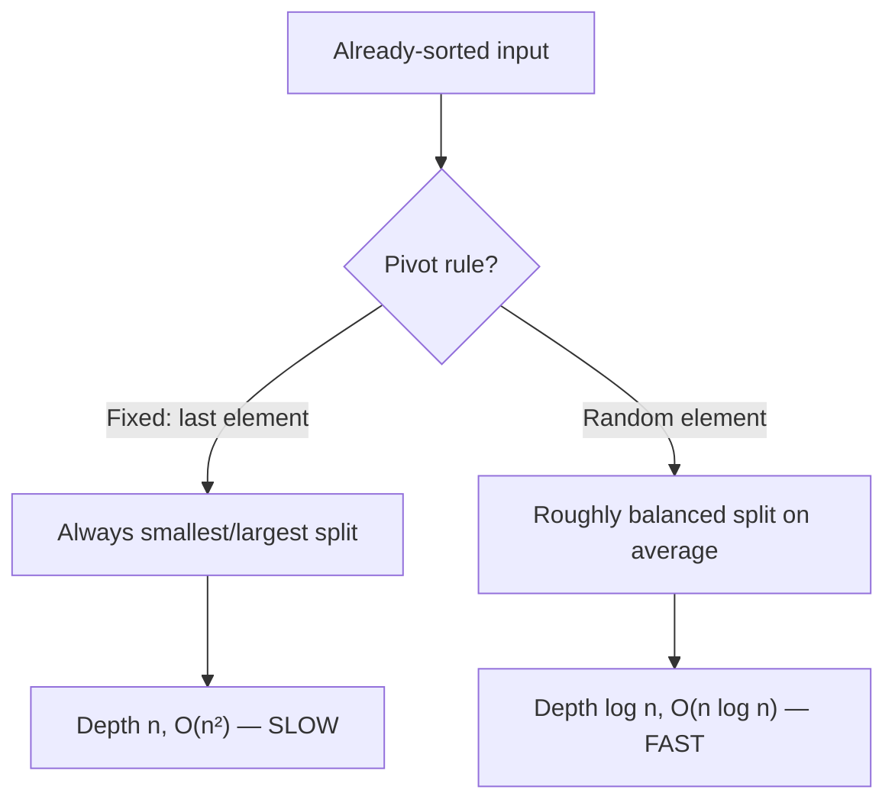
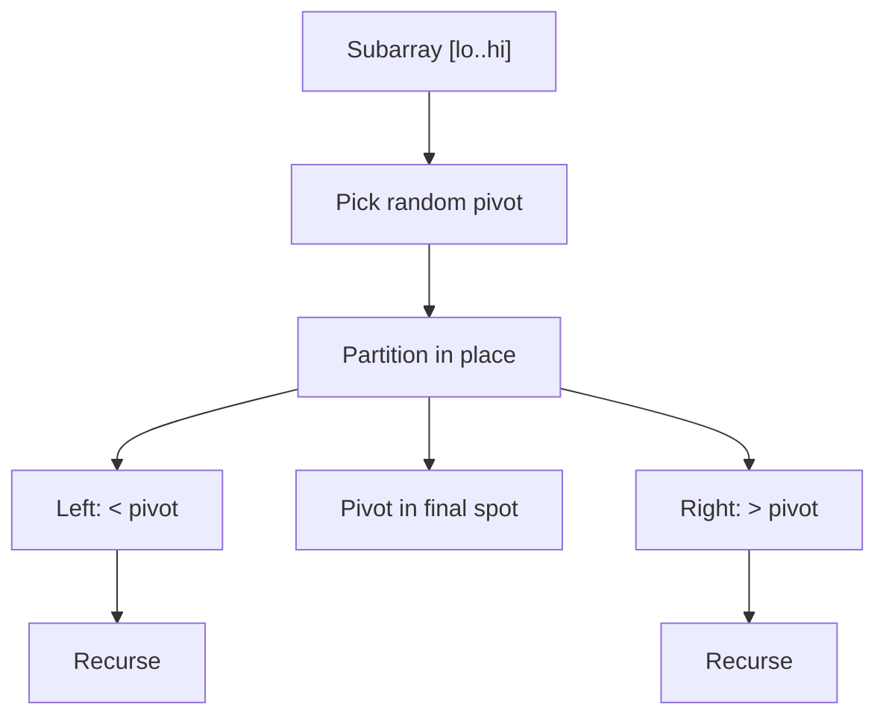

# Randomized Quicksort — Junior Level

## Table of Contents

1. [Introduction](#introduction)
2. [Prerequisites](#prerequisites)
3. [Glossary](#glossary)
4. [Core Concepts](#core-concepts)
5. [Quicksort Recap](#quicksort-recap)
6. [Why a Random Pivot?](#why-a-random-pivot)
7. [Big-O Summary](#big-o-summary)
8. [Real-World Analogies](#real-world-analogies)
9. [Pros & Cons](#pros--cons)
10. [Step-by-Step Walkthrough](#step-by-step-walkthrough)
11. [Code Examples](#code-examples)
12. [Coding Patterns](#coding-patterns)
13. [Error Handling](#error-handling)
14. [Performance Tips](#performance-tips)
15. [Best Practices](#best-practices)
16. [Edge Cases & Pitfalls](#edge-cases--pitfalls)
17. [Common Mistakes](#common-mistakes)
18. [Cheat Sheet](#cheat-sheet)
19. [Visual Animation](#visual-animation)
20. [Summary](#summary)
21. [Further Reading](#further-reading)

---

## Introduction

> Focus: "What is Randomized Quicksort?" and "Why does flipping a coin make a sorting algorithm faster and safer?"

**Randomized Quicksort** is ordinary [Quicksort](../../07-sorting-algorithms/04-quick-sort/junior.md) with one small but powerful change: instead of always picking the same fixed position as the **pivot** (for example "always the last element"), it picks the pivot **at random**.

That single change has a big consequence. Plain Quicksort is fast *on average* but can be tricked into its slow **O(n²)** worst case by certain inputs — most famously an array that is **already sorted** when you use the first or last element as pivot. An attacker (or just an unlucky data feed) can hand you exactly that bad input every single time, and your sort grinds to a halt.

Randomized Quicksort removes the input's power to choose the worst case. Because *you* pick the pivot with a coin flip, **no fixed input can be your enemy**. The result is a guarantee:

> Randomized Quicksort runs in **expected O(n log n)** time on **any** input — sorted, reverse-sorted, random, or adversarial.

The word **expected** is important. The algorithm is still *random*: on a very unlucky run it could be slow. But "unlucky" now depends on *your coin flips*, not on the *input*. And the probability of being unlucky is astronomically small. This makes Randomized Quicksort a **Las Vegas algorithm**:

- It is **always correct** (the output is always fully sorted).
- Only its **running time** is random.

Compare that to a **Monte Carlo** algorithm, which is always fast but only *probably* correct. Randomized Quicksort never returns a wrong answer — it just *occasionally* takes longer. For a sort, that is exactly the trade-off you want: you never ship unsorted data.

This topic builds directly on the [Quick Sort topic](../../07-sorting-algorithms/04-quick-sort/junior.md). If you have not seen partition, pivot, and recursion before, read that first. Here we focus on the **randomization** layer and *why* it matters.

---

## Prerequisites

- **Required:** [Quicksort basics](../../07-sorting-algorithms/04-quick-sort/junior.md) — pivot, partition, recursion
- **Required:** Recursion and arrays
- **Required:** Understanding of "divide and conquer"
- **Helpful:** Basic idea of probability ("expected value" = long-run average)
- **Helpful:** A random number generator in your language (`rand`, `Random`, `random`)

---

## Glossary

| Term | Definition |
|------|-----------|
| **Pivot** | The element chosen to split the array into "smaller" and "larger" parts |
| **Partition** | Rearrange so all elements `< pivot` come before it and all `> pivot` come after |
| **Random pivot** | A pivot chosen uniformly at random from the current subarray |
| **Random shuffle** | Randomly permuting the whole array once *before* sorting (an alternative to random pivots) |
| **Expected time** | The average running time over all possible coin flips, for a fixed input |
| **Las Vegas algorithm** | Always correct; running time is random (Randomized Quicksort is one) |
| **Monte Carlo algorithm** | Always fast; answer is only *probably* correct (the opposite trade-off) |
| **Adversarial input** | An input crafted specifically to trigger the worst case |
| **Worst case** | The slowest possible behavior — O(n²) for Quicksort |
| **Indicator variable** | A 0/1 variable used to count events when analyzing expected time |

---

## Core Concepts

### Concept 1: The Pivot Choice Is the Whole Game

In Quicksort, every recursive call picks a pivot and partitions around it. If the pivot is close to the **median**, the array splits roughly in half → shallow recursion → fast. If the pivot is the **smallest** or **largest** element, one side is empty and the other has n-1 elements → deep recursion → slow (O(n²)).

So the *quality of the split* depends entirely on *which element you pick as pivot*. Deterministic Quicksort picks a fixed position; Randomized Quicksort picks at random.

### Concept 2: Randomization Moves the Risk From Input to Coin

With a fixed pivot rule, **the input controls** whether you hit the worst case. A sorted array + "last element pivot" = guaranteed disaster.

With a random pivot, **your coin controls** it. The input no longer matters — every input has the *same* expected behavior. The worst case still *exists*, but now it requires a long streak of unlucky coin flips, which happens with vanishingly small probability.

### Concept 3: It Is a Las Vegas Algorithm

"Las Vegas" means: **correctness is guaranteed, runtime is random**. You always get a perfectly sorted array. The only thing that varies run-to-run (on the same input) is *how long it takes*. This is the safest kind of randomization for a sort — you can never accidentally output unsorted data.

### Concept 4: "Expected O(n log n)" Means "Almost Always n log n"

The expected number of comparisons is about **2n ln n ≈ 1.39 n log₂ n**. More importantly, the probability of being much slower than this drops off extremely fast. For real-world array sizes, the chance of even a 2× slowdown is negligible. In practice, Randomized Quicksort behaves like a reliable O(n log n) sort.

### Concept 5: Two Ways to Randomize

There are two equivalent strategies:

1. **Random pivot:** at each recursive call, pick a random index in the current range and use that element as pivot.
2. **Random shuffle first:** shuffle the *entire* array once at the start (Fisher–Yates), then run ordinary Quicksort with a fixed pivot rule.

Both give expected O(n log n). Random pivot is more common because it does not require an extra O(n) shuffle pass and is easier to reason about per-call.

---

## Quicksort Recap

A 30-second refresher (full detail in the [Quick Sort topic](../../07-sorting-algorithms/04-quick-sort/junior.md)):

```text
quicksort(arr, lo, hi):
    if lo < hi:
        p = partition(arr, lo, hi)   # choose pivot, place it correctly
        quicksort(arr, lo, p - 1)    # sort the "smaller" side
        quicksort(arr, p + 1, hi)    # sort the "larger" side
```

The **partition** step:
- Chooses a pivot.
- Rearranges the subarray so everything `≤ pivot` is on the left and everything `> pivot` is on the right.
- The pivot lands in its **final sorted position** and never moves again.

There is **no merge step** (unlike Merge Sort) — partition does all the ordering work, which is why Quicksort is *in-place* and cache-friendly.

The only thing Randomized Quicksort changes is **"choose a pivot"** → **"choose a *random* pivot."**

---

## Why a Random Pivot?

Let us make the danger concrete. Suppose you always use the **last element** as pivot, and the input is already sorted: `[1, 2, 3, 4, 5, 6, 7, 8]`.

- Pivot = 8 (the last). Partition puts 8 at the end; left side is `[1..7]` (7 elements), right side is empty.
- Recurse on `[1..7]`. Pivot = 7. Left = `[1..6]` (6 elements), right empty.
- ... and so on.

Every partition removes exactly **one** element. You do n levels of recursion, each scanning O(n) elements → **O(n²)** total. For n = 1,000,000 that is 10¹² operations — your program hangs.

Now use a **random** pivot on the same sorted input:

- The pivot is equally likely to be any of the 8 values. On average it lands near the middle, giving a roughly balanced split.
- A balanced split means about log₂(n) levels of recursion, each O(n) → **O(n log n)**.

The sorted input is no longer special — it gets the same good treatment as a random input. **The adversary's favorite input has been neutralized.**



---

## Big-O Summary

| Case | Time | Notes |
|------|------|-------|
| Best | **O(n log n)** | Balanced partitions |
| Expected (any input) | **O(n log n)** | ~1.39 n log₂ n comparisons, regardless of input order |
| Worst (theoretical) | **O(n²)** | Requires an extremely unlucky streak of pivot choices |
| Probability of worst case | **vanishingly small** | Depends on coins, not input |
| Space (expected) | **O(log n)** | Recursion stack |
| Space (worst) | **O(n)** | Unlucky skewed recursion |
| Stable | **No** | Equal elements can swap during partition |
| In-place | **Yes** | Only stack overhead |
| Correctness | **Always correct** | Las Vegas — only runtime is random |

**Key difference from deterministic Quicksort:** the worst case is no longer tied to a *specific input*. With deterministic Quicksort, a sorted array *always* triggers O(n²). With Randomized Quicksort, *no* input reliably triggers it.

---

## Real-World Analogies

| Concept | Analogy |
|---------|--------|
| **Random pivot** | Picking a *random* person from a queue to split it into "shorter than them / taller than them," instead of always picking whoever is first in line |
| **Adversarial input** | A prankster who keeps lining people up tallest-first to make your fixed rule slow — random picking ruins the prank |
| **Las Vegas** | A GPS that always finds the correct route, but occasionally takes longer to compute it — never wrong, just sometimes slower |
| **Expected time** | Rolling dice many times: any single roll varies, but the long-run average is predictable |
| **Random shuffle first** | Shuffling a deck of cards before dealing so no one can stack the deck against you |

> Where the analogy breaks down: a random pivot does not *guarantee* a perfect median; it only makes good splits *likely*. The math (covered at the professional level) is what turns "likely good" into "expected O(n log n)."

---

## Pros & Cons

| Pros | Cons |
|------|------|
| **Expected O(n log n) on every input** — no bad inputs | Still O(n²) in the theoretical worst case (just very unlikely) |
| **Immune to adversarial / sorted-input attacks** | Needs a random number generator |
| Keeps all of plain Quicksort's speed and cache-friendliness | Not stable |
| **Always correct** (Las Vegas) | Runtime varies slightly run-to-run on the same input |
| In-place — only O(log n) stack | A weak/predictable RNG can be exploited by an attacker |
| Simple to implement — one extra line | Random shuffle variant adds an O(n) pass |

**When to use:**
- General-purpose in-memory sorting where input may be sorted, structured, or attacker-controlled.
- Any time you want Quicksort's speed *without* the sorted-input footgun.
- As the basis for **Quickselect** (find the k-th smallest in expected O(n)).

**When NOT to use:**
- You need **stability** → use Merge Sort or TimSort.
- You need a **hard worst-case guarantee** (real-time / safety-critical) → use Merge Sort, Heap Sort, or **Introsort** (Quicksort with a Heap Sort fallback).
- Sorting a **linked list** → use Merge Sort.
- Data larger than RAM (external sort) → use Merge Sort.

---

## Step-by-Step Walkthrough

Sort `[3, 8, 2, 5, 1, 4, 7, 6]` with a random pivot (Lomuto partition, random index swapped to the end).

**Call 1:** range `[0..7]`. Random index picks value **5**. Swap it to the end, partition.
- After partition: `[3, 2, 1, 4, 5, 8, 7, 6]`. Pivot **5** is now at index 4 (its final position).
- Left = `[3, 2, 1, 4]`, Right = `[8, 7, 6]`.

**Call 2 (left `[3, 2, 1, 4]`):** random pivot picks **2**.
- After partition: `[1, 2, 3, 4]`. Pivot **2** at index 1.
- Left = `[1]` (done), Right = `[3, 4]`.

**Call 3 (right of call 2, `[3, 4]`):** random pivot picks **3**.
- After partition: `[3, 4]`. Pivot **3** at its slot. Left empty, Right = `[4]` (done).

**Call 4 (right of call 1, `[8, 7, 6]`):** random pivot picks **7**.
- After partition: `[6, 7, 8]`. Pivot **7** at the middle. Left = `[6]` (done), Right = `[8]` (done).

**Final:** `[1, 2, 3, 4, 5, 6, 7, 8]`.

Notice: because the pivots happened to land near the middle, the recursion was shallow (about log₂ 8 = 3 levels). A *different* set of random pivots would produce a different sequence of partitions — but the output is always the same sorted array. That is the Las Vegas property: **same answer, slightly different path each run.**

---

## Code Examples

### Example 1: Randomized Quicksort (Random Pivot, Lomuto Partition)

The only difference from plain Quicksort is the highlighted "pick a random pivot and swap it to the end" line.

#### Go

```go
package main

import (
    "fmt"
    "math/rand"
)

func RandomizedQuickSort(arr []int) {
    quickSort(arr, 0, len(arr)-1)
}

func quickSort(arr []int, lo, hi int) {
    if lo < hi {
        p := randomizedPartition(arr, lo, hi)
        quickSort(arr, lo, p-1)
        quickSort(arr, p+1, hi)
    }
}

func randomizedPartition(arr []int, lo, hi int) int {
    // === THE RANDOMIZATION: pick a random pivot, swap it to the end ===
    r := lo + rand.Intn(hi-lo+1)
    arr[r], arr[hi] = arr[hi], arr[r]
    // === rest is ordinary Lomuto partition ===
    pivot := arr[hi]
    i := lo - 1
    for j := lo; j < hi; j++ {
        if arr[j] <= pivot {
            i++
            arr[i], arr[j] = arr[j], arr[i]
        }
    }
    arr[i+1], arr[hi] = arr[hi], arr[i+1]
    return i + 1
}

func main() {
    data := []int{3, 8, 2, 5, 1, 4, 7, 6}
    RandomizedQuickSort(data)
    fmt.Println(data) // [1 2 3 4 5 6 7 8]
}
```

#### Java

```java
import java.util.Arrays;
import java.util.concurrent.ThreadLocalRandom;

public class RandomizedQuickSort {
    public static void sort(int[] arr) {
        sort(arr, 0, arr.length - 1);
    }

    private static void sort(int[] a, int lo, int hi) {
        if (lo < hi) {
            int p = randomizedPartition(a, lo, hi);
            sort(a, lo, p - 1);
            sort(a, p + 1, hi);
        }
    }

    private static int randomizedPartition(int[] a, int lo, int hi) {
        // === THE RANDOMIZATION ===
        int r = ThreadLocalRandom.current().nextInt(lo, hi + 1);
        swap(a, r, hi);
        // === ordinary Lomuto partition ===
        int pivot = a[hi];
        int i = lo - 1;
        for (int j = lo; j < hi; j++) {
            if (a[j] <= pivot) {
                i++;
                swap(a, i, j);
            }
        }
        swap(a, i + 1, hi);
        return i + 1;
    }

    private static void swap(int[] a, int x, int y) {
        int t = a[x]; a[x] = a[y]; a[y] = t;
    }

    public static void main(String[] args) {
        int[] data = {3, 8, 2, 5, 1, 4, 7, 6};
        sort(data);
        System.out.println(Arrays.toString(data));
    }
}
```

#### Python

```python
import random


def randomized_quick_sort(arr):
    _sort(arr, 0, len(arr) - 1)


def _sort(arr, lo, hi):
    if lo < hi:
        p = randomized_partition(arr, lo, hi)
        _sort(arr, lo, p - 1)
        _sort(arr, p + 1, hi)


def randomized_partition(arr, lo, hi):
    # === THE RANDOMIZATION: random pivot swapped to the end ===
    r = random.randint(lo, hi)
    arr[r], arr[hi] = arr[hi], arr[r]
    # === ordinary Lomuto partition ===
    pivot = arr[hi]
    i = lo - 1
    for j in range(lo, hi):
        if arr[j] <= pivot:
            i += 1
            arr[i], arr[j] = arr[j], arr[i]
    arr[i + 1], arr[hi] = arr[hi], arr[i + 1]
    return i + 1


if __name__ == "__main__":
    data = [3, 8, 2, 5, 1, 4, 7, 6]
    randomized_quick_sort(data)
    print(data)  # [1, 2, 3, 4, 5, 6, 7, 8]
```

**What it does:** Sorts in place. The single added step — pick a random index and swap it to `hi` — converts the dangerous fixed-pivot version into one with expected O(n log n) on *every* input.
**Run:** `go run main.go` | `javac RandomizedQuickSort.java && java RandomizedQuickSort` | `python rqs.py`

### Example 2: Randomize by Shuffling First (Alternative)

Instead of a random pivot per call, shuffle the whole array once, then run plain Quicksort.

#### Python

```python
import random


def shuffle_then_quicksort(arr):
    random.shuffle(arr)          # Fisher-Yates, O(n) — destroys any adversarial order
    _plain_sort(arr, 0, len(arr) - 1)


def _plain_sort(arr, lo, hi):
    if lo < hi:
        p = _lomuto(arr, lo, hi)  # fixed last-element pivot is now SAFE after shuffle
        _plain_sort(arr, lo, p - 1)
        _plain_sort(arr, p + 1, hi)


def _lomuto(arr, lo, hi):
    pivot = arr[hi]
    i = lo - 1
    for j in range(lo, hi):
        if arr[j] <= pivot:
            i += 1
            arr[i], arr[j] = arr[j], arr[i]
    arr[i + 1], arr[hi] = arr[hi], arr[i + 1]
    return i + 1
```

**Why this works:** After a uniform shuffle, the array is a random permutation, so *any* fixed pivot rule sees a random input → expected O(n log n). The trade-off is one extra O(n) pass.

### Example 3: A Tiny Experiment — See the Worst Case Disappear

#### Python

```python
import sys, random
sys.setrecursionlimit(20000)

def deterministic_last_pivot(arr, lo, hi, depth=[0]):
    if lo < hi:
        depth[0] = max(depth[0], hi - lo)  # crude depth proxy
        pivot = arr[hi]; i = lo - 1
        for j in range(lo, hi):
            if arr[j] <= pivot:
                i += 1; arr[i], arr[j] = arr[j], arr[i]
        arr[i+1], arr[hi] = arr[hi], arr[i+1]
        p = i + 1
        deterministic_last_pivot(arr, lo, p - 1)
        deterministic_last_pivot(arr, p + 1, hi)

# Already-sorted input is the worst case for last-element pivot:
n = 2000
worst = list(range(n))
import time
t = time.time(); deterministic_last_pivot(list(worst), 0, n - 1)
print("deterministic on sorted:", round(time.time() - t, 4), "s")  # SLOW (O(n^2))

t = time.time(); randomized_quick_sort(list(worst))  # from Example 1
print("randomized   on sorted:", round(time.time() - t, 4), "s")    # FAST (O(n log n))
```

You will see the deterministic version slow dramatically on the sorted input while the randomized version stays fast. Same input, totally different fate — that is the point of randomization.

---

## Coding Patterns

### Pattern 1: Random Pivot via Swap-to-End

**Intent:** Reuse any partition that expects the pivot at a known slot; just move a random element there first.

#### Go

```go
r := lo + rand.Intn(hi-lo+1)
arr[r], arr[hi] = arr[hi], arr[r] // now partition with arr[hi] as pivot
```

#### Java

```java
int r = ThreadLocalRandom.current().nextInt(lo, hi + 1);
int t = a[r]; a[r] = a[hi]; a[hi] = t; // pivot now at hi
```

#### Python

```python
r = random.randint(lo, hi)
arr[r], arr[hi] = arr[hi], arr[r]  # pivot now at hi
```

### Pattern 2: Random Shuffle Once, Then Sort

**Intent:** Decouple randomization from partition logic; one shuffle protects every recursive call.

```python
random.shuffle(arr)         # O(n) Fisher-Yates
plain_quicksort(arr)        # any fixed pivot rule is now safe
```

### Pattern 3: Tail-Recurse on the Smaller Side

**Intent:** Even with randomization, bound stack depth to O(log n) by always recursing into the smaller partition and looping on the larger.

```python
def rqs(arr, lo, hi):
    while lo < hi:
        p = randomized_partition(arr, lo, hi)
        if p - lo < hi - p:
            rqs(arr, lo, p - 1)   # recurse smaller side
            lo = p + 1            # loop on larger side
        else:
            rqs(arr, p + 1, hi)
            hi = p - 1
```



---

## Error Handling

| Error | Cause | Fix |
|-------|-------|-----|
| `RecursionError` / stack overflow | Deep recursion on an unlucky split | Tail-recurse on the smaller side; cap depth (Introsort) |
| Same "random" order every run | RNG never seeded, or seeded with a constant | Seed once at startup (or use a self-seeding RNG like Go's `math/rand` v2 / Python `random`) |
| `IndexError` in pivot pick | `rand` range off by one | Range must be **inclusive** of both `lo` and `hi`: `randint(lo, hi)` |
| Still O(n²) on sorted input | Forgot to actually randomize (left a fixed pivot) | Confirm the random swap line runs *every* call |
| Predictable pivots exploited | Attacker guesses the RNG seed | Use a non-predictable / cryptographic seed in adversarial settings |
| Wrong output | Mixed up `<` and `<=` in partition | Use `<=` consistently so equal elements are handled |

---

## Performance Tips

- **Randomize once per call** with a cheap PRNG — `rand.Intn`, `ThreadLocalRandom`, `random.randint`. The cost is negligible versus the safety it buys.
- **Add an Insertion Sort cutoff** for small subarrays (n ≤ 16). Random pivots do not help tiny ranges; insertion sort is faster there.
- **Use 3-way partition** if your data has many duplicates (random pivots alone do not fix the all-equal slowdown — see middle level).
- **Tail-recurse on the smaller side** to keep stack depth O(log n).
- **For production, prefer your language's built-in sort** (Go `slices.Sort`, Java `Arrays.sort`, Python `sorted`) — they already use hardened, randomized/pattern-defeating variants.

---

## Best Practices

- State your pivot strategy in a comment ("random pivot for expected O(n log n)").
- Seed the RNG at program start, not inside the hot loop.
- Test on **sorted, reverse-sorted, all-equal, and random** inputs — randomization should make all four fast.
- Implement it from scratch once to understand it; use the built-in in real code.
- For latency-critical paths needing a guarantee, reach for **Introsort** (random/median pivot + Heap Sort fallback) rather than bare Randomized Quicksort.

---

## Edge Cases & Pitfalls

- **Empty / single element** → `lo < hi` is false → no work. Safe.
- **Already sorted** → the input randomization handles *exactly* this case; it becomes fast.
- **Reverse sorted** → same as sorted; randomization neutralizes it.
- **All equal elements** → Randomized Quicksort with 2-way partition is *still* O(n²)! Random pivots do not split an all-equal array. Use **3-way partition** (covered at middle level).
- **Many duplicates** → same problem; 3-way partition is the fix.
- **Tiny arrays** → randomization overhead dominates; use an insertion-sort cutoff.
- **Linked lists** → don't use Quicksort; use Merge Sort.

---

## Common Mistakes

1. **Thinking random pivots fix the duplicate problem.** They fix *adversarial order*, not *all-equal* arrays. You still need 3-way partition for duplicates.
2. **Forgetting to randomize every call** — randomizing only the top-level call leaves the recursion vulnerable.
3. **Seeding the RNG with a constant** → "random" becomes deterministic and attackable.
4. **Off-by-one in the random range** — must include both endpoints: `randint(lo, hi)`.
5. **Claiming the worst case is gone.** It still *exists*; it is just astronomically unlikely. The honest claim is "expected O(n log n)."
6. **Confusing Las Vegas with Monte Carlo.** Randomized Quicksort is Las Vegas: always correct, random *time*.

---

## Cheat Sheet

```text
RANDOMIZED QUICKSORT

IDEA:
  Plain Quicksort + random pivot per call
  => expected O(n log n) on ANY input
  => no input is the worst case anymore

ALGORITHM:
  rqs(arr, lo, hi):
    if lo < hi:
      r = random index in [lo, hi]
      swap(arr[r], arr[hi])          # randomize pivot
      p = partition(arr, lo, hi)
      rqs(arr, lo, p - 1)
      rqs(arr, p + 1, hi)

COMPLEXITY:
  Expected: O(n log n)   ~1.39 n log2 n comparisons
  Worst:    O(n^2)       (vanishingly unlikely)
  Space:    O(log n) expected stack
  Stable:   NO     In-place: YES
  Correct:  ALWAYS (Las Vegas)

TWO WAYS TO RANDOMIZE:
  1) random pivot each call       (common)
  2) shuffle whole array, then    (one O(n) pass)
     plain quicksort

WATCH OUT:
  - all-equal array => use 3-way partition
  - seed RNG, randomize EVERY call
  - tail-recurse smaller side for O(log n) stack
```

---

## Visual Animation

> See [`animation.html`](./animation.html) for an interactive visual animation of Randomized Quicksort.
>
> The animation demonstrates:
> - A **randomly highlighted pivot** chosen each partition step
> - Two-pointer partition movement (compare / swap)
> - Recursion descending into the left and right subarrays
> - A live **comparison counter** so you can watch it stay near n log n
> - Custom input + a "sorted input" button to see randomization defeat the worst case
> - Speed control and step-by-step mode

---

## Summary

Randomized Quicksort = **Quicksort + a random pivot**. That one change gives **expected O(n log n) on every input**, eliminating the sorted-input / adversarial worst case that plagues fixed-pivot Quicksort. It is a **Las Vegas algorithm**: the output is **always** correctly sorted; only the running time is random, and "slow" now requires unlucky *coin flips* rather than a malicious *input*.

Three takeaways:

1. **The pivot choice is everything.** Random pivot → balanced splits on average → O(n log n).
2. **Randomization moves risk from input to coin** — no input can be your enemy.
3. **It does not fix duplicates** — for all-equal or duplicate-heavy data, add a **3-way partition** (middle level).

---

## Further Reading

- CLRS Chapter 7 (Quicksort) — §7.3 Randomized version, §7.4 analysis
- Sedgewick & Wayne, *Algorithms* 4ed §2.3 (Quicksort, random shuffle)
- The base [Quick Sort topic](../../07-sorting-algorithms/04-quick-sort/junior.md) in this roadmap
- Motwani & Raghavan, *Randomized Algorithms* — Las Vegas vs Monte Carlo
- Go `math/rand`, Java `ThreadLocalRandom`, Python `random` docs

---

**Next step:** [Randomized Quicksort — Middle Level](./middle.md)
