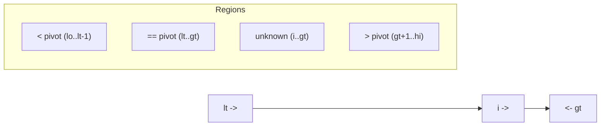

# Randomized Quicksort — Middle Level

## Table of Contents

1. [Introduction](#introduction)
2. [Random Pivot vs Random Shuffle](#random-pivot-vs-random-shuffle)
3. [Pivot Strategies Compared](#pivot-strategies-compared)
4. [Three-Way Partition for Duplicates](#three-way-partition-for-duplicates)
5. [Recurrence and Expected Comparison Count](#recurrence-and-expected-comparison-count)
6. [vs Deterministic Quicksort](#vs-deterministic-quicksort)
7. [vs Merge Sort](#vs-merge-sort)
8. [Stack Depth and Tail Recursion](#stack-depth-and-tail-recursion)
9. [Las Vegas vs Monte Carlo](#las-vegas-vs-monte-carlo)
10. [Code Examples](#code-examples)
11. [Performance Analysis](#performance-analysis)
12. [Best Practices](#best-practices)
13. [Visual Animation](#visual-animation)
14. [Summary](#summary)

---

## Introduction

> Focus: "Why does randomization give *expected* O(n log n)?" and "When do I choose it over deterministic Quicksort or Merge Sort?"

At the middle level you understand the *mechanics* of [Randomized Quicksort](./junior.md) and now you want the *reasoning*: why a random pivot guarantees expected O(n log n), how the comparison count comes out to ~1.39 n log₂ n, which pivot strategy to pick, and how to handle duplicate-heavy inputs with **three-way partitioning**.

The mental model to keep:

- **Deterministic Quicksort** is a gamble where the *input* picks the cards. A sorted input + fixed pivot = guaranteed O(n²).
- **Randomized Quicksort** is a gamble where *you* pick the cards via a coin. The input loses its power; expected time is O(n log n) for *every* input.

This file connects that intuition to the recurrence, compares Randomized Quicksort against deterministic Quicksort and Merge Sort, and shows the engineering details — three-way partition, stack-depth control, and the Las Vegas vs Monte Carlo distinction — that you need before the production discussion at [senior level](./senior.md).

---

## Random Pivot vs Random Shuffle

There are exactly two standard ways to inject randomness, and they are *provably equivalent* in expected cost.

| Strategy | How | Cost of randomness | Notes |
|----------|-----|--------------------|-------|
| **Random pivot** | At each call, pick a uniform random index in `[lo, hi]`, use it as pivot | O(1) per call, O(n) RNG calls total | Most common; localizes randomness to each subproblem |
| **Random shuffle** | Fisher–Yates shuffle the whole array once, then run plain Quicksort | One O(n) pass | After shuffle, *any* fixed pivot rule sees a random permutation |

**Why they are equivalent:** Quicksort's running time depends only on the *relative order* of elements (which comparisons happen), not their values. A uniform shuffle makes every relative order equally likely; choosing pivots at random makes every *pivot sequence* equally likely. Both lead to the same distribution over comparison counts, hence the same expected O(n log n).

**Which to use?**
- **Random pivot** is preferred in practice: no extra pass, and it is robust even if the array is later partially re-fed (e.g., in Quickselect, which only recurses on one side).
- **Random shuffle** is conceptually cleaner for *proofs* (CLRS uses both; Sedgewick favors shuffle) and keeps the partition code identical to deterministic Quicksort.

> Pitfall: the shuffle must be a **correct** Fisher–Yates. The naive "swap each i with a random j in [0, n)" is fine; the buggy "swap i with random j in [i, n)" vs "[0, n)" distinction matters — use `j ∈ [i, n)` for an unbiased shuffle.

---

## Pivot Strategies Compared

Randomization is one point on a spectrum of pivot strategies. Each trades implementation cost against worst-case resistance.

| Strategy | Expected time | Worst case | Resists adversary? | Cost |
|----------|--------------|-----------|--------------------|------|
| First / last element | O(n log n) avg | **O(n²) on sorted** | No | Free |
| Middle element | O(n log n) avg | O(n²) on crafted patterns | Low | Free |
| **Random element** | **O(n log n)** | O(n²) (prob → 0) | **Yes** | 1 RNG call/level |
| Median-of-three | O(n log n) | O(n²) on rarer patterns | Medium | 3 reads + ≤3 swaps |
| **Randomized median-of-three** | O(n log n) | O(n²) (prob → 0) | **Yes** | 3 RNG + median |
| Median-of-medians (BFPRT) | **O(n log n) deterministic** | **O(n log n)** | Total | High constant |

**Key relationships:**

- **Random** and **median-of-three** attack the problem from different angles. Random makes the *adversary* powerless; median-of-three makes *common patterns* (sorted, organ-pipe) balanced. They compose well: **randomized median-of-three** samples three *random* positions, getting both benefits.
- **Median-of-medians** is the only strategy with a *deterministic* O(n log n) guarantee, but its constant factor is so large that it is almost never used as a Quicksort pivot in practice — it is reserved for worst-case **Quickselect** (see [senior level](./senior.md)).
- In production, the winning combination is **randomized/pattern-defeating pivot + Introsort fallback** (Heap Sort when recursion gets too deep), which gives O(n log n) worst case *and* Quicksort speed.

### Randomized Median-of-Three

```python
import random

def randomized_median_of_three(arr, lo, hi):
    # sample three RANDOM positions, not fixed lo/mid/hi
    a, b, c = (random.randint(lo, hi) for _ in range(3))
    # order them so arr[b] is the median of the three
    if arr[a] > arr[b]: a, b = b, a
    if arr[b] > arr[c]: b, c = c, b
    if arr[a] > arr[b]: a, b = b, a
    return b  # index of the median-of-three pivot
```

Sampling three random elements and taking their median gives a pivot that is close to the true median *more often* than a single random pick — tightening the split distribution and shaving the constant factor.

---

## Three-Way Partition for Duplicates

This is the single most important *correctness-of-performance* caveat: **random pivots do NOT save you from duplicate-heavy inputs.**

Consider an array of all-equal values `[5, 5, 5, 5, 5, 5]`. With a standard 2-way (`≤ / >`) partition, the pivot 5 partitions into "everything ≤ 5" (the whole array minus the pivot) and "nothing." That is the *worst-case split*, and it happens **no matter which element you randomly pick** — they are all 5. Result: O(n²).

The fix is the **Dutch National Flag** three-way partition, which splits into three regions:

```text
[ < pivot | == pivot | > pivot ]
```

All elements equal to the pivot land in the middle band and are **never recursed on again**. An all-equal array is sorted in a single O(n) pass.



### Randomized 3-Way Quicksort

#### Go

```go
package main

import (
    "fmt"
    "math/rand"
)

func Quick3Way(arr []int) { sort3(arr, 0, len(arr)-1) }

func sort3(a []int, lo, hi int) {
    if lo >= hi {
        return
    }
    // randomize pivot, move it to lo
    r := lo + rand.Intn(hi-lo+1)
    a[lo], a[r] = a[r], a[lo]
    pivot := a[lo]
    lt, gt, i := lo, hi, lo+1
    for i <= gt {
        switch {
        case a[i] < pivot:
            a[lt], a[i] = a[i], a[lt]
            lt++
            i++
        case a[i] > pivot:
            a[i], a[gt] = a[gt], a[i]
            gt--
        default:
            i++
        }
    }
    sort3(a, lo, lt-1)
    sort3(a, gt+1, hi)
}

func main() {
    data := []int{5, 3, 5, 1, 5, 3, 1, 5, 3}
    Quick3Way(data)
    fmt.Println(data)
}
```

#### Java

```java
import java.util.Arrays;
import java.util.concurrent.ThreadLocalRandom;

public class Quick3Way {
    public static void sort(int[] a) { sort(a, 0, a.length - 1); }

    private static void sort(int[] a, int lo, int hi) {
        if (lo >= hi) return;
        int r = ThreadLocalRandom.current().nextInt(lo, hi + 1);
        swap(a, lo, r);                 // randomize pivot into lo
        int pivot = a[lo];
        int lt = lo, gt = hi, i = lo + 1;
        while (i <= gt) {
            if (a[i] < pivot)      { swap(a, lt++, i++); }
            else if (a[i] > pivot) { swap(a, i, gt--); }
            else                   { i++; }
        }
        sort(a, lo, lt - 1);
        sort(a, gt + 1, hi);
    }

    private static void swap(int[] a, int x, int y) { int t = a[x]; a[x] = a[y]; a[y] = t; }

    public static void main(String[] args) {
        int[] data = {5, 3, 5, 1, 5, 3, 1, 5, 3};
        sort(data);
        System.out.println(Arrays.toString(data));
    }
}
```

#### Python

```python
import random


def quick_3way(arr, lo=0, hi=None):
    if hi is None:
        hi = len(arr) - 1
    if lo >= hi:
        return
    r = random.randint(lo, hi)          # randomize pivot into lo
    arr[lo], arr[r] = arr[r], arr[lo]
    pivot = arr[lo]
    lt, gt, i = lo, hi, lo + 1
    while i <= gt:
        if arr[i] < pivot:
            arr[lt], arr[i] = arr[i], arr[lt]
            lt += 1
            i += 1
        elif arr[i] > pivot:
            arr[i], arr[gt] = arr[gt], arr[i]
            gt -= 1
        else:
            i += 1
    quick_3way(arr, lo, lt - 1)
    quick_3way(arr, gt + 1, hi)
```

**Performance win:** O(n) when all elements equal; O(n·k) where k = number of *distinct* values. For data with few distinct keys (flags, ratings, categories), this is asymptotically better than 2-way Randomized Quicksort. Java's Dual-Pivot Quicksort and Pdqsort both use duplicate-handling partition logic for exactly this reason.

---

## Recurrence and Expected Comparison Count

### Best Case (balanced splits)

```text
T(n) = 2·T(n/2) + Θ(n)
Master Theorem (Case 2): T(n) = Θ(n log n)
```

### Worst Case (maximally unbalanced)

```text
T(n) = T(n-1) + T(0) + Θ(n) = Θ(n²)
```

For deterministic Quicksort this is *triggered by a specific input*. For Randomized Quicksort it requires an unlucky *pivot sequence*, whose probability vanishes.

### Expected Case (random pivot)

The expected partition position is uniform over `1..n`. The recurrence becomes:

```text
E[T(n)] = Θ(n) + (1/n) · Σ_{k=0}^{n-1} ( E[T(k)] + E[T(n-1-k)] )
```

Solving (full derivation at the [professional level](./professional.md)) gives:

```text
E[comparisons] = 2(n+1)·H_n − 4n  ≈  2n·ln n  ≈  1.39 n·log₂ n
```

where `H_n` is the n-th harmonic number. The headline numbers to remember:

| Quantity | Value |
|----------|-------|
| Expected comparisons | ~1.39 n log₂ n |
| Overhead vs information-theoretic minimum (n log₂ n) | ~39% more comparisons |
| Expected recursion depth | Θ(log n) |
| Why it still wins | far fewer cache misses and data moves than Merge Sort |

The 39% comparison overhead is *more than offset* by Quicksort's cache locality and lack of an auxiliary buffer — which is why it beats Merge Sort in wall-clock time despite doing more comparisons.

### The Indicator-Variable Intuition (preview)

The clean way to derive 1.39 n log₂ n is to define an **indicator** `X_{ij} = 1` if the i-th and j-th smallest elements are ever compared. The probability they are compared is exactly:

```text
Pr[X_{ij} = 1] = 2 / (j − i + 1)
```

Summing by linearity of expectation gives the harmonic series → 2n ln n. The full proof lives in [professional.md](./professional.md); the takeaway here is that *distant ranks are rarely compared*, which is why the total stays near-linearithmic.

---

## vs Deterministic Quicksort

| Attribute | Randomized Quicksort | Deterministic Quicksort (fixed pivot) |
|-----------|----------------------|---------------------------------------|
| Time (expected/avg) | O(n log n) | O(n log n) |
| Time (worst) | O(n²) — needs unlucky coins | O(n²) — **triggered by specific input** |
| Worst case triggered by | bad luck (prob → 0) | sorted / reverse / crafted input |
| Adversary-resistant? | **Yes** | No |
| Determinism | Different path each run | Same path each run |
| Reproducibility | Needs fixed seed to reproduce | Fully reproducible |
| Extra cost | RNG calls | none |
| Use when | input may be sorted/structured/hostile | input provably random *and* reproducibility needed |

**Choose Randomized when:** you cannot trust the input distribution — which is almost always true for user-supplied or networked data.

**Choose Deterministic when:** you need byte-for-byte reproducible behavior (e.g., a test fixture) *and* you can independently guarantee the input is randomly ordered (or you pre-shuffle with a fixed seed).

> A subtle point: "deterministic with a fixed-seed shuffle" gives you reproducibility *and* worst-case resistance against pre-known inputs — but a clever adversary who knows your seed can still craft a bad input. True adversarial safety requires an *unpredictable* seed (see [senior level](./senior.md)).

---

## vs Merge Sort

| Attribute | Randomized Quicksort | Merge Sort |
|-----------|----------------------|-----------|
| Time (worst) | O(n²) (improbable) | **O(n log n) guaranteed** |
| Time (expected) | O(n log n) | O(n log n) |
| Comparisons | ~1.39 n log n | ~1.0 n log n |
| Space | O(log n) stack | **O(n) auxiliary** |
| Stable? | No | **Yes** |
| Cache behavior | **Excellent** (in-place) | OK (buffer round-trips) |
| Data moves / memory writes | ~10× fewer | ~10× more |
| Linked lists | Poor | **Excellent** |
| External sort (> RAM) | Poor | **Excellent** |
| Parallelism | Good (independent subarrays) | Good (independent merges) |

**Choose Randomized Quicksort when:** in-memory, array-backed, stability not required, and you want the fastest wall-clock time.

**Choose Merge Sort when:** you need stability, a hard worst-case guarantee, linked-list sorting, or external sorting.

The deep reason Quicksort wins in memory despite *more comparisons*: it does its work **in place** with sequential access, so the CPU cache and prefetcher stay happy. Merge Sort's auxiliary buffer round-trips ~10× more bytes through memory.

---

## Stack Depth and Tail Recursion

Even randomized, an unlucky run can recurse deeply. Two safeguards keep stack usage O(log n):

1. **Always recurse on the *smaller* partition; loop on the larger.** The smaller side is at most n/2, so the recursion-stack depth is bounded by log₂ n regardless of how the larger side behaves.
2. **Iterate the larger side** instead of recursing — converts the tail call into a loop.

```python
import random

def rqs(arr, lo, hi):
    while lo < hi:
        r = random.randint(lo, hi)
        arr[r], arr[hi] = arr[hi], arr[r]
        p = lomuto(arr, lo, hi)
        if p - lo < hi - p:           # left side smaller
            rqs(arr, lo, p - 1)       # recurse smaller
            lo = p + 1                # loop larger
        else:                         # right side smaller
            rqs(arr, p + 1, hi)
            hi = p - 1
```

Without this, a worst-case pivot sequence could push O(n) frames and overflow the stack on large inputs — a real failure mode in languages without tail-call elimination (Python, Java, Go all lack guaranteed TCO).

---

## Las Vegas vs Monte Carlo

Randomized Quicksort is the canonical **Las Vegas** algorithm. Knowing the taxonomy clarifies what guarantees you actually have.

| Property | Las Vegas (Randomized Quicksort) | Monte Carlo (e.g., Miller–Rabin) |
|----------|----------------------------------|----------------------------------|
| Correctness | **Always correct** | Correct with high probability |
| Running time | **Random** (expected bound) | Usually fixed / bounded |
| What randomness buys | speed/robustness | a fast *probabilistic* answer |
| Failure mode | "took longer than usual" | "returned a wrong answer (rarely)" |
| Convert one to the other | run until a deadline → Monte Carlo | repeat to reduce error → still MC |

For sorting, Las Vegas is exactly what you want: you would never accept an *occasionally unsorted* output, but you happily accept *occasionally slower*. (Compare to [Miller–Rabin primality](../../19-number-theory/09-miller-rabin-primality/middle.md), a Monte Carlo test that is occasionally wrong but always fast.)

---

## Code Examples

### Randomized Quicksort with Median-of-Three + Insertion Cutoff + Tail Recursion

A production-shaped single-pivot variant.

#### Go

```go
package main

import (
    "fmt"
    "math/rand"
)

const cutoff = 16

func Sort(a []int) { qs(a, 0, len(a)-1) }

func qs(a []int, lo, hi int) {
    for hi-lo > cutoff {
        // randomized median-of-three -> pivot at hi
        p := randMedian3Partition(a, lo, hi)
        if p-lo < hi-p {
            qs(a, lo, p-1)
            lo = p + 1
        } else {
            qs(a, p+1, hi)
            hi = p - 1
        }
    }
    insertion(a, lo, hi)
}

func randMedian3Partition(a []int, lo, hi int) int {
    i1 := lo + rand.Intn(hi-lo+1)
    i2 := lo + rand.Intn(hi-lo+1)
    i3 := lo + rand.Intn(hi-lo+1)
    // median of a[i1],a[i2],a[i3] -> index mid
    if a[i1] > a[i2] {
        i1, i2 = i2, i1
    }
    if a[i2] > a[i3] {
        i2, i3 = i3, i2
    }
    if a[i1] > a[i2] {
        i1, i2 = i2, i1
    }
    a[i2], a[hi] = a[hi], a[i2] // move median to hi
    pivot := a[hi]
    i := lo - 1
    for j := lo; j < hi; j++ {
        if a[j] <= pivot {
            i++
            a[i], a[j] = a[j], a[i]
        }
    }
    a[i+1], a[hi] = a[hi], a[i+1]
    return i + 1
}

func insertion(a []int, lo, hi int) {
    for i := lo + 1; i <= hi; i++ {
        x, j := a[i], i-1
        for j >= lo && a[j] > x {
            a[j+1] = a[j]
            j--
        }
        a[j+1] = x
    }
}

func main() {
    data := []int{7, 2, 1, 6, 8, 5, 3, 4, 9, 10, 0, 2, 2}
    Sort(data)
    fmt.Println(data)
}
```

#### Java

```java
import java.util.Arrays;
import java.util.concurrent.ThreadLocalRandom;

public class HardenedQuickSort {
    static final int CUTOFF = 16;

    public static void sort(int[] a) { qs(a, 0, a.length - 1); }

    static void qs(int[] a, int lo, int hi) {
        while (hi - lo > CUTOFF) {
            int p = randMedian3Partition(a, lo, hi);
            if (p - lo < hi - p) { qs(a, lo, p - 1); lo = p + 1; }
            else                 { qs(a, p + 1, hi); hi = p - 1; }
        }
        insertion(a, lo, hi);
    }

    static int randMedian3Partition(int[] a, int lo, int hi) {
        ThreadLocalRandom rng = ThreadLocalRandom.current();
        int i1 = rng.nextInt(lo, hi + 1), i2 = rng.nextInt(lo, hi + 1), i3 = rng.nextInt(lo, hi + 1);
        if (a[i1] > a[i2]) { int t = i1; i1 = i2; i2 = t; }
        if (a[i2] > a[i3]) { int t = i2; i2 = i3; i3 = t; }
        if (a[i1] > a[i2]) { int t = i1; i1 = i2; i2 = t; }
        swap(a, i2, hi);
        int pivot = a[hi], i = lo - 1;
        for (int j = lo; j < hi; j++) if (a[j] <= pivot) swap(a, ++i, j);
        swap(a, i + 1, hi);
        return i + 1;
    }

    static void insertion(int[] a, int lo, int hi) {
        for (int i = lo + 1; i <= hi; i++) {
            int x = a[i], j = i - 1;
            while (j >= lo && a[j] > x) a[j + 1] = a[j--];
            a[j + 1] = x;
        }
    }

    static void swap(int[] a, int x, int y) { int t = a[x]; a[x] = a[y]; a[y] = t; }

    public static void main(String[] args) {
        int[] data = {7, 2, 1, 6, 8, 5, 3, 4, 9, 10, 0, 2, 2};
        sort(data);
        System.out.println(Arrays.toString(data));
    }
}
```

#### Python

```python
import random

CUTOFF = 16


def sort(a):
    _qs(a, 0, len(a) - 1)


def _qs(a, lo, hi):
    while hi - lo > CUTOFF:
        p = _rand_median3_partition(a, lo, hi)
        if p - lo < hi - p:
            _qs(a, lo, p - 1)
            lo = p + 1
        else:
            _qs(a, p + 1, hi)
            hi = p - 1
    _insertion(a, lo, hi)


def _rand_median3_partition(a, lo, hi):
    i1, i2, i3 = (random.randint(lo, hi) for _ in range(3))
    if a[i1] > a[i2]: i1, i2 = i2, i1
    if a[i2] > a[i3]: i2, i3 = i3, i2
    if a[i1] > a[i2]: i1, i2 = i2, i1
    a[i2], a[hi] = a[hi], a[i2]
    pivot = a[hi]
    i = lo - 1
    for j in range(lo, hi):
        if a[j] <= pivot:
            i += 1
            a[i], a[j] = a[j], a[i]
    a[i + 1], a[hi] = a[hi], a[i + 1]
    return i + 1


def _insertion(a, lo, hi):
    for i in range(lo + 1, hi + 1):
        x = a[i]; j = i - 1
        while j >= lo and a[j] > x:
            a[j + 1] = a[j]; j -= 1
        a[j + 1] = x
```

---

## Performance Analysis

For n = 10⁶ ints (illustrative, Go-class machine):

| Input shape | Randomized Quicksort | Deterministic (last pivot) | Merge Sort |
|-------------|----------------------|----------------------------|------------|
| Random | ~55 ms | ~60 ms | ~90 ms |
| Already sorted | ~50 ms | **~50 s (O(n²))** | ~90 ms |
| Reverse sorted | ~50 ms | **~50 s (O(n²))** | ~90 ms |
| All equal (2-way) | **O(n²) — slow** | O(n²) — slow | ~90 ms |
| All equal (3-way) | **~12 ms** | n/a | ~90 ms |

Two lessons jump out:

1. Randomization **erases the sorted/reverse worst case** — the column that destroys deterministic Quicksort is flat for the randomized version.
2. Randomization **does not** erase the all-equal worst case — only the **3-way partition** does. Use both together for robustness.

### Measuring It Yourself

```python
import random, time

def bench(sort_fn, build, n, trials=5):
    best = float("inf")
    for _ in range(trials):
        data = build(n)
        t = time.perf_counter()
        sort_fn(data)
        best = min(best, time.perf_counter() - t)
    return best

random_in   = lambda n: [random.randint(0, n) for _ in range(n)]
sorted_in   = lambda n: list(range(n))
allequal_in = lambda n: [7] * n
```

Run each builder against your 2-way and 3-way variants and watch which columns blow up.

---

## Best Practices

- **Default to randomized median-of-three** — combines adversary resistance with tight splits.
- **Always add 3-way partition** (or duplicate handling) if your keys may repeat — random pivots alone do not help here.
- **Tail-recurse on the smaller side** to bound stack to O(log n).
- **Insertion-sort cutoff at ~16** — randomization is wasted on tiny ranges.
- **Use a fixed seed in tests** so failures are reproducible; an unpredictable seed in production for adversary resistance.
- **For production code, use the built-in sort** — Go `slices.Sort` (pdqsort), Java `Arrays.sort` (dual-pivot), Python `sorted` (TimSort). They are hardened versions of these exact ideas.

---

## Visual Animation

> See [`animation.html`](./animation.html) for interactive visualization.
>
> Middle-level features:
> - Random pivot highlighted each partition step (re-roll to see different paths)
> - Side-by-side feel: load a *sorted* input and watch randomization stay fast
> - Live comparison counter tracking against ~1.39 n log₂ n
> - Recursion descent into left/right subarrays

---

## Summary

At middle level, Randomized Quicksort is understood as **deterministic Quicksort with the adversary disarmed**. A random pivot (or one-time random shuffle) makes the expected running time O(n log n) for *every* input, with an expected comparison count of **~1.39 n log₂ n** derived from the partition recurrence.

The engineering essentials:

1. **Random pivot ≡ random shuffle** in expected cost — pick whichever fits your code.
2. **Random pivots fix adversarial *order*, not duplicate *values*** — add a **3-way (Dutch flag) partition** for repeated keys.
3. **vs deterministic Quicksort:** same average speed, but no input can force the worst case.
4. **vs Merge Sort:** faster in memory and in-place, but no worst-case guarantee and not stable.
5. **Bound the stack** by tail-recursing on the smaller side.

It is a **Las Vegas** algorithm: always correct, only the runtime is random.

---

**Next step:** [Randomized Quicksort — Senior Level](./senior.md)
