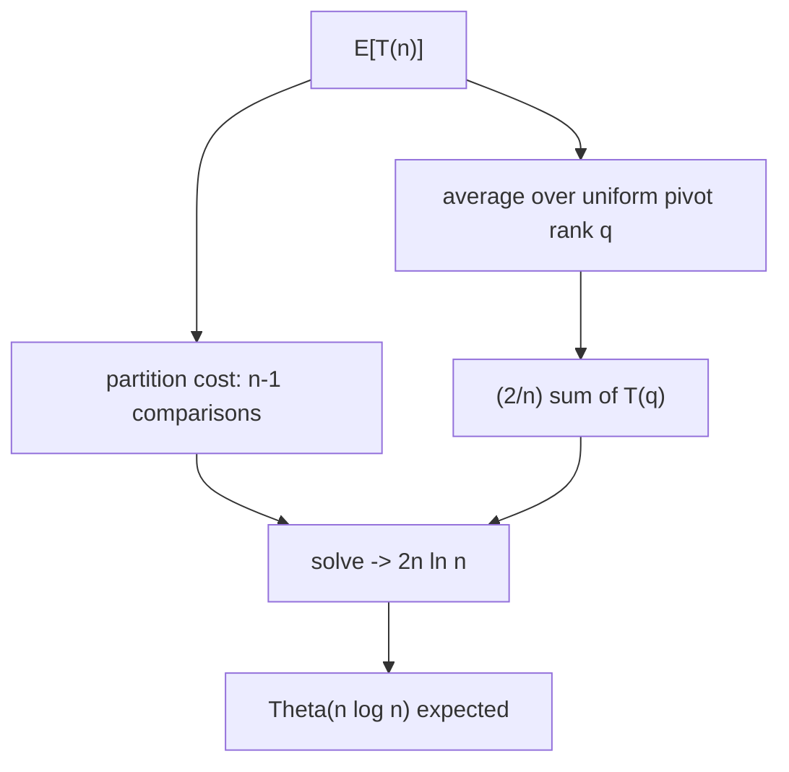

# Randomized Quicksort — Mathematical Foundations and Probability Analysis

## Table of Contents

1. [Formal Definition](#formal-definition)
2. [Correctness Proof — Las Vegas Property](#correctness-proof)
3. [The Indicator-Variable Method](#the-indicator-variable-method)
4. [The Comparison Probability: 2/(j−i+1)](#the-comparison-probability)
5. [Expected Comparison Count: 2n ln n](#expected-comparison-count)
6. [Recurrence Derivation (Alternative Proof)](#recurrence-derivation)
7. [Concentration and High-Probability Bounds](#concentration-and-high-probability-bounds)
8. [Worst-Case via Median-of-Medians](#worst-case-via-median-of-medians)
9. [Quickselect and Linear-Time Selection](#quickselect-and-linear-time-selection)
10. [Duplicates and the Entropy Bound](#duplicates-and-the-entropy-bound)
11. [The Adversary and Lower Bounds for Deterministic Pivoting](#the-adversary-and-lower-bounds-for-deterministic-pivoting)
12. [Lower Bound and Cache-Oblivious Analysis](#lower-bound-and-cache-oblivious-analysis)
13. [Parallel Complexity (PRAM)](#parallel-complexity-pram)
14. [Comparison with Alternatives](#comparison-with-alternatives)
15. [Summary](#summary)

---

## Formal Definition

```text
RANDOMIZED-QUICKSORT(A, p, r):
    if p < r:
        q = RANDOMIZED-PARTITION(A, p, r)
        RANDOMIZED-QUICKSORT(A, p, q - 1)
        RANDOMIZED-QUICKSORT(A, q + 1, r)

RANDOMIZED-PARTITION(A, p, r):
    i = RANDOM(p, r)            // uniform in {p, ..., r}
    exchange A[r] with A[i]     // random element becomes the pivot
    return PARTITION(A, p, r)   // Lomuto partition around A[r]

PARTITION(A, p, r):            // Lomuto
    x = A[r]
    i = p - 1
    for j = p to r - 1:
        if A[j] <= x:
            i = i + 1
            exchange A[i] with A[j]
    exchange A[i+1] with A[r]
    return i + 1
```

CLRS Chapter 7, §7.3. `RANDOM(p, r)` returns each value in `{p, …, r}` with probability `1/(r − p + 1)`, independently of the input and of all other calls. This independence — pivot choices are functions of *internal coins*, not of the input — is the formal source of every guarantee below.

**Probability space.** Fix an input `A` of `n` distinct elements. The sample space `Ω` is the set of all possible *pivot-choice sequences* the algorithm can make. Each `RANDOM(p, r)` call draws uniformly and independently, so a leaf of the algorithm's execution tree (a full pivot sequence) has a well-defined probability. The running time `T(A, ω)` is a random variable over `ω ∈ Ω` for each fixed `A`. Every theorem below is a statement about `E_ω[·]` or `Pr_ω[·]` for an *arbitrary fixed `A`* — the input is never averaged over.

**Notation.** Let the input be `n` elements. Write the sorted order as `z₁ < z₂ < … < z_n` (assume distinct for the comparison analysis; duplicates are handled separately by 3-way partitioning). Let `Z_{ij} = {z_i, z_{i+1}, …, z_j}` be the set of elements with ranks between `i` and `j` inclusive. Let `H_n = Σ_{k=1}^{n} 1/k` denote the n-th harmonic number, with `H_n = ln n + γ + O(1/n)`, `γ ≈ 0.5772`.

---

## Correctness Proof

Randomization affects *time*, never *correctness*. We prove the output is always a sorted permutation of the input, regardless of the coin flips.

### Partition Invariant (Lomuto)

**Invariant.** At the start of each iteration of the `for j` loop:
- `A[p..i]` contains elements `≤ x` (the pivot),
- `A[i+1..j-1]` contains elements `> x`,
- `A[r] = x` (pivot untouched).

**Initialization** (`j = p`): `i = p − 1`, so `A[p..i]` and `A[i+1..j−1]` are both empty; trivially true.

**Maintenance.** If `A[j] ≤ x`: increment `i`, swap `A[i] ↔ A[j]` — the new `A[i] ≤ x` extends the left region; the element moved to `A[j]` was `> x`, preserving the middle region. If `A[j] > x`: only `j` advances, extending the middle region. Either way the invariant holds at the next iteration.

**Termination** (`j = r`): `A[p..i] ≤ x` and `A[i+1..r−1] > x`. The final exchange of `A[i+1]` with `A[r]` places the pivot at index `i+1` with everything `≤ x` to its left and `> x` to its right. ∎

The random swap in `RANDOMIZED-PARTITION` only *chooses which element becomes the pivot*; the invariant proof is independent of that choice. Hence partition is correct for every coin outcome.

**Termination of partition.** The loop variable `j` strictly increases by 1 each iteration and is bounded above by `r`, so the loop runs exactly `r − p` times and halts. No coin flip affects the loop bound. Thus partition terminates deterministically in `Θ(r − p)` time.

**Termination of the recursion.** Each `RANDOMIZED-QUICKSORT(A, p, r)` call with `p < r` recurses on `[p, q−1]` and `[q+1, r]`, *both strictly smaller* than `[p, r]` (the pivot index `q` is excluded from both). The size measure `r − p + 1` strictly decreases along every recursion path and is bounded below by 0, so the recursion tree has finite depth and the algorithm terminates for *every* coin sequence — a prerequisite for the Las Vegas claim (a non-terminating run would have undefined output).

### Quicksort Correctness (Strong Induction)

**Claim.** `RANDOMIZED-QUICKSORT(A, p, r)` sorts `A[p..r]` for every sequence of coin flips.

**Base case.** Ranges of size ≤ 1 (`p ≥ r`) are trivially sorted.

**Inductive step.** Assume correctness for all ranges of size `< m`. For a range of size `m`: partition places the pivot at its final sorted position `q`, with `A[p..q−1] ≤ A[q] ≤ A[q+1..r]`. The two sub-ranges have size `< m`, so by the inductive hypothesis both are sorted. A sorted left, the pivot in position, and a sorted right concatenate to a fully sorted range. ∎

**Las Vegas property.** Combining: the algorithm *always* returns a correctly sorted array; only the *number of comparisons* (hence running time) is a random variable. This is the defining property of a Las Vegas algorithm, in contrast to Monte Carlo algorithms (e.g., [Miller–Rabin](../../19-number-theory/09-miller-rabin-primality/professional.md)) whose *answer* may be wrong.

---

## The Indicator-Variable Method

The total running time of any Quicksort is `Θ(n + X)` where `X` is the total number of element comparisons made in all PARTITION calls (PARTITION does constant work plus one comparison per loop iteration; the `Θ(n)` accounts for the per-call overhead across at most `n` calls). So bounding `E[X]` bounds the expected running time.

**Key structural fact.** Two elements `z_i` and `z_j` (`i < j`) are compared **at most once** during the entire execution. Reason: a comparison only ever happens between the *current pivot* and another element. Once an element is chosen as a pivot, it is fixed in place and never compared again. So `z_i` and `z_j` can only be compared if one of them is the pivot at the moment of comparison — which can occur at most once.

**Indicator definition.**
```text
X_{ij} = 1  if z_i is compared with z_j at some point,
       = 0  otherwise.
```
Then `X = Σ_{i=1}^{n-1} Σ_{j=i+1}^{n} X_{ij}`, and by **linearity of expectation**:
```text
E[X] = Σ_{i<j} E[X_{ij}] = Σ_{i<j} Pr[z_i is compared with z_j].
```
Linearity holds *even though the `X_{ij}` are not independent* — this is what makes the indicator method so powerful here. We now compute `Pr[z_i compared with z_j]`.

---

## The Comparison Probability

**Theorem.** `Pr[z_i is compared with z_j] = 2 / (j − i + 1)`.

**Proof.** Consider the set `Z_{ij} = {z_i, z_{i+1}, …, z_j}` of the `(j − i + 1)` elements whose ranks lie between `i` and `j`. Track the *first* element of `Z_{ij}` to be chosen as a pivot (over the whole execution). Until some element of `Z_{ij}` is picked as a pivot, all of `Z_{ij}` stays together inside a single partition (no pivot from outside `Z_{ij}` can separate `z_i` from `z_j`, because such a pivot is either smaller than all of `Z_{ij}` or larger than all of it, sending the entire set to one side).

Let `z_k` be the **first** element of `Z_{ij}` chosen as a pivot. Two cases:

1. **`k = i` or `k = j`.** The pivot is one of our two elements; it is compared with *every other* element in the current partition, in particular with the other of `z_i, z_j` (which is still in the same partition). So `z_i` and `z_j` **are** compared.

2. **`i < k < j`.** The pivot `z_k` lies strictly between `z_i` and `z_j` in value. Partitioning around `z_k` sends `z_i` to the left subarray and `z_j` to the right subarray; they are separated and will **never** be compared (neither will ever be in the other's partition again).

Therefore `z_i` and `z_j` are compared **iff** the first pivot chosen from `Z_{ij}` is either `z_i` or `z_j`.

By the randomized pivot rule, when the first element of `Z_{ij}` is selected as a pivot, it is **equally likely to be any** of the `|Z_{ij}| = j − i + 1` elements (each subset element is equally likely to be the first picked, by symmetry of uniform random pivots). The two favorable outcomes are `z_i` and `z_j`, so:
```text
Pr[z_i compared with z_j] = Pr[z_i first] + Pr[z_j first]
                          = 1/(j−i+1) + 1/(j−i+1)
                          = 2/(j−i+1).   ∎
```

> Intuition: **adjacent ranks** (`j = i+1`) are compared with probability `2/2 = 1` — always. **Far-apart ranks** are compared with probability `≈ 2/(distance)` — rarely. The sort spends its comparisons mostly on nearby elements, which is exactly why the total stays near-linearithmic.

### Worked Numerical Check (n = 4)

Take ranks `1,2,3,4`. The comparison probabilities are:

| Pair (i, j) | `j − i + 1` | `Pr[compared] = 2/(j−i+1)` |
|-------------|-------------|----------------------------|
| (1,2) | 2 | 1.000 |
| (2,3) | 2 | 1.000 |
| (3,4) | 2 | 1.000 |
| (1,3) | 3 | 0.667 |
| (2,4) | 3 | 0.667 |
| (1,4) | 4 | 0.500 |

Summing: `E[X] = 3·1 + 2·(2/3) + 1·(1/2) = 3 + 1.333 + 0.5 = 4.833` expected comparisons for `n = 4`. The closed form `2(n+1)H_n − 4n` with `n = 4`, `H_4 = 1 + 1/2 + 1/3 + 1/4 = 25/12` gives `2·5·25/12 − 16 = 250/12 − 16 = 20.833 − 16 = 4.833` — an exact match, confirming the formula on a small case you can verify by hand.

### Why "At Most Once" Is Essential

The whole derivation rests on each pair being compared *at most once*; otherwise we could not encode the event with a single Bernoulli indicator. If the partition scheme compared a pair *twice*, the indicator would have to be replaced by a count, the probabilities would no longer be `2/(j−i+1)`, and linearity would still apply but to a different (larger) quantity. Lomuto and Hoare both compare every non-pivot element against the pivot exactly once per partition, and a chosen pivot leaves the recursion — so the "at most once" property holds, anchoring the analysis.

---

## Expected Comparison Count

Substitute the probability into the indicator sum and let `k = j − i`:

```text
E[X] = Σ_{i=1}^{n-1} Σ_{j=i+1}^{n} 2/(j − i + 1)
     = Σ_{i=1}^{n-1} Σ_{k=1}^{n-i} 2/(k + 1)        (k = j − i)
     <  Σ_{i=1}^{n-1} Σ_{k=1}^{n-1} 2/(k + 1)
     =  Σ_{i=1}^{n-1} 2 (H_n − 1)                    (since Σ_{k=1}^{n-1} 1/(k+1) = H_n − 1)
     <  2n · H_n
     =  2n (ln n + γ + O(1/n))
     =  2n ln n + Θ(n)
     ≈  1.386 · n log₂ n.
```

**Theorem (Expected running time).** `E[X] = O(n log n)`, hence `RANDOMIZED-QUICKSORT` runs in **expected `Θ(n log n)`** time on every input. ∎

A tighter exact evaluation of the double sum gives the classic closed form:
```text
E[X] = 2(n+1) H_n − 4n  ≈  1.386 n log₂ n.
```

| Quantity | Value |
|----------|-------|
| Expected comparisons | `2(n+1)H_n − 4n ≈ 2n ln n` |
| In log₂ terms | `≈ 1.386 n log₂ n` |
| Information-theoretic minimum | `log₂(n!) ≈ n log₂ n − 1.44n` |
| Overhead over the optimum | `≈ 39%` |
| Expected depth | `Θ(log n)` |

The `1.386` constant — the factor `2 ln 2 ≈ 1.386` — is the price of randomized pivoting versus a perfect median. In practice, superior cache locality makes Quicksort beat the lower-comparison Merge Sort in wall-clock time anyway.

### Distribution-Independence

A subtle but important property: this bound does **not** assume anything about the *input distribution*. The expectation is over the algorithm's *internal coin flips* only. For deterministic Quicksort, the same `2n ln n` bound holds *only if* the input is a uniformly random permutation — an assumption you cannot enforce on adversarial data. Randomization removes the assumption entirely: the bound holds for *every fixed input*, because the randomness lives in the pivot choices, not the data. This is the precise mathematical statement of "no input can be the worst case."

Formally: let `A` be any fixed input array. Then
```text
E_coins[ comparisons on A ] = 2n ln n + Θ(n),   for all A.
```
There is no "bad A" — the worst case over inputs of the *expected* cost is still `Θ(n log n)`.

---

## Recurrence Derivation

An independent route to the same `O(n log n)` confirms the indicator result. Let `T(n) = E[X]` for a subarray of `n` distinct elements. The pivot's rank is uniform on `{1, …, n}`; if the pivot has rank `q+1`, the two recursive subarrays have sizes `q` and `n−1−q`. The partition costs `n−1` comparisons. Conditioning on the pivot rank:

```text
T(n) = (n − 1) + (1/n) Σ_{q=0}^{n-1} ( T(q) + T(n-1-q) )
     = (n − 1) + (2/n) Σ_{q=0}^{n-1} T(q).
```

**Claim:** `T(n) ≤ 2n ln n`. Proof by substitution (strong induction). Assume `T(q) ≤ 2q ln q` for `q < n`. Using the integral bound `Σ_{q=2}^{n-1} q ln q ≤ ∫₁ⁿ x ln x dx = (n²/2) ln n − n²/4`:

```text
T(n) ≤ (n − 1) + (2/n)[ (n²/2) ln n − n²/4 ]
     = (n − 1) + n ln n − n/2
     ≤ 2n ln n        (for n ≥ 2).   ∎
```

Both methods agree: `E[T(n)] = Θ(n log n)`.

### The Harmonic Sum, Step by Step

The convergence of the two derivations rests on `Σ_{q=0}^{n-1} T(q)` reducing to a harmonic-number expression. Unrolling the substitution `T(n) ≤ 2n ln n` is one route; another instructive route differentiates the generating identity. Define `S(n) = Σ_{q=0}^{n-1} T(q)`. Then `T(n) = (n−1) + (2/n)S(n)`, so `n·T(n) = n(n−1) + 2S(n)` and `(n−1)T(n−1) = (n−1)(n−2) + 2S(n−1)`. Subtracting and using `S(n) − S(n−1) = T(n−1)`:
```text
n·T(n) − (n−1)T(n−1) = 2(n−1) + 2T(n−1)
=>  n·T(n) = (n+1)T(n−1) + 2(n−1).
```
Dividing by `n(n+1)` and telescoping `T(n)/(n+1) = T(n−1)/n + 2(n−1)/(n(n+1))` yields:
```text
T(n)/(n+1) = Σ_{k=2}^{n} 2(k−1)/(k(k+1)) ≈ 2 Σ 1/k = 2H_n − Θ(1).
```
Hence `T(n) ≈ 2(n+1)H_n − Θ(n) ≈ 2n ln n` — the same closed form, derived purely from the recurrence with no appeal to indicators. The agreement of the two independent methods is a strong sanity check.

### Expected Depth Directly

The *expected recursion depth* (not just total work) also follows from the harmonic structure. Let `D(n)` be the expected depth. A uniform pivot leaves the larger side of expected size `≈ 3n/4`, so `D(n) ≤ 1 + D(3n/4)`, giving `D(n) = O(log n)`. The constant works out to `≈ 2/log(4/3) ≈ 4.8 ln n` as an upper bound on expected depth — comfortably logarithmic, and the basis for the `O(log n)` *expected* stack space (the worst-case `O(n)` space requires the same improbable streak as the `O(n²)` time).



---

## Concentration and High-Probability Bounds

Expectation alone does not preclude wild variance. We strengthen `O(n log n)` *in expectation* to `O(n log n)` *with high probability* — i.e., the slow tail is exponentially thin.

### Recursion Depth Is O(log n) w.h.p.

Call a pivot **balanced** if it falls in the middle half of its subarray — i.e., both sides have size at most `3/4` of the current size. A uniform random pivot is balanced with probability exactly `1/2` (the rank lands in the central `n/2` positions).

Fix an element `e`. Follow the chain of subarrays containing `e` from root to leaf. Each balanced pivot along this chain shrinks the subarray by a factor of at least `3/4`. After `b` balanced pivots, the subarray size is `≤ n·(3/4)^b`, which drops below `1` once `b > log_{4/3} n`. So the *depth* of `e` is bounded by the number of pivots needed to accumulate `c·log n` balanced ones.

Let `D` be the depth of `e`. The number of balanced pivots among `D` trials is a sum of independent Bernoulli(1/2) variables (pivot choices are independent). By a **Chernoff bound**, if `D = a·log₂ n` for a suitable constant `a`, the probability of fewer than `log_{4/3} n` balanced pivots is at most `n^{−c}`:

```text
Pr[depth(e) > a log₂ n] ≤ n^{−c}.
```

Union-bounding over all `n` elements:

```text
Pr[ max-depth > a log₂ n ] ≤ n · n^{−c} = n^{−(c−1)}.
```

Choosing `a` so that `c > 2` makes this `≤ 1/n`. ∎

### High-Probability Running Time

**Theorem.** For any constant `c > 0`, there is a constant `A` such that with probability at least `1 − n^{−c}`, randomized Quicksort makes at most `A·n log n` comparisons.

**Proof idea.** Each of the `O(log n)` levels (w.h.p., by the depth bound) does at most `n` comparisons across all its partitions, so total work is `O(n log n)` w.h.p. A full proof bounds the comparison count directly via a Chernoff/Azuma argument on the sum `X = Σ X_{ij}`; the indicator sum has expectation `2n ln n` and bounded-difference structure, so it concentrates within `O(n log n)` of its mean with probability `1 − n^{−c}`. ∎

**Consequence.** The probability of even a *constant-factor* slowdown is polynomially small; the probability of the `Θ(n²)` worst case is super-exponentially small (it requires an extreme pivot on essentially every call). For practical `n`, Randomized Quicksort is `O(n log n)` for all intents and purposes.

| Bound type | Statement |
|-----------|-----------|
| Expected comparisons | `2n ln n` |
| Depth w.h.p. | `O(log n)` with prob `≥ 1 − 1/n` |
| Time w.h.p. | `O(n log n)` with prob `≥ 1 − n^{−c}` |
| Pr[Θ(n²)] | super-exponentially small |

### Variance of the Comparison Count

The comparison count `X` is tightly concentrated. Its variance is known in closed form:
```text
Var[X] = (7 − (2/3)π²) n² − 2(n+1)²H_n^{(2)} + ... ≈ 0.42 n²  +  lower order
```
where `H_n^{(2)} = Σ 1/k²`. The standard deviation is therefore `σ(X) = Θ(n)`, which is *small relative to the mean* `Θ(n log n)`: the coefficient of variation `σ/E[X] = Θ(1/log n) → 0`. So as `n` grows, the *relative* fluctuation in comparison count shrinks — large sorts are even more predictable than small ones. By Chebyshev's inequality, `Pr[ |X − E[X]| ≥ t·n ] ≤ Var[X]/(tn)² = O(1/t²)`, and the sharper Chernoff/Azuma route gives the exponential tail used above.

### The "Bad Split Doesn't Hurt" Lemma

A common misconception is that one unbalanced split ruins the run. It does not. Suppose every level alternates a *perfectly balanced* split with a *worst possible* (1 vs n−1) split. The balanced split halves the size; the bad split removes one element. Over two levels the size roughly halves, so the depth is still `Θ(log n)` and total work `Θ(n log n)` — only the constant doubles. The recursion is robust to *occasional* bad pivots; only a *long uninterrupted streak* of them (probability `2^{−Θ(n)}`) triggers `Θ(n²)`. This is the structural reason the high-probability bound is so strong.

---

## Worst-Case via Median-of-Medians

Randomization gives *expected* and *high-probability* bounds. For a **deterministic worst-case `O(n log n)`** Quicksort, choose the pivot to be the *exact median* in linear time using **median-of-medians** (BFPRT — Blum, Floyd, Pratt, Rivest, Tarjan, 1973).

```text
SELECT(A, k):                      // k-th smallest, deterministic O(n)
    if |A| <= 5: return sorted(A)[k]
    Split A into ceil(|A|/5) groups of <= 5.
    For each group, compute its median (sort 5 elements: O(1) each).
    M = list of the group medians.
    pivot = SELECT(M, |M|/2)        // median of medians, recursive
    Partition A around pivot.
    Let r = rank of pivot.
    if k == r: return pivot
    elif k < r: return SELECT(left,  k)
    else:       return SELECT(right, k - r - 1)
```

**Why the median-of-medians is a good pivot.** At least half of the `⌈n/5⌉` groups have a median `≤ pivot`, and in each such group at least 3 of the 5 elements are `≤` its median. So at least `3·(½·⌈n/5⌉) ≈ 3n/10` elements are `≤ pivot`; symmetrically `≥ 3n/10` are `≥ pivot`. Thus each side has at most `≈ 7n/10` elements — a *guaranteed* constant-fraction split.

**Why groups of 5 specifically.** The recurrence `T(n) ≤ T(n/g) + T((1 − 3/(2g))·n) + O(n)` for group size `g` is linear iff `1/g + (1 − 3/(2g)) < 1`, i.e. `3/(2g) − 1/g = 1/(2g) > 0` always — but we also need the *two recursive sizes to sum to a fraction strictly below 1* with enough slack for the `O(n)` term to dominate. For `g = 3` the fractions sum to `≥ 1` (no slack → not linear); for `g = 5` they sum to `1/5 + 7/10 = 9/10 < 1` (works); larger odd `g` also work but raise the per-group median cost. Five is the smallest group size giving a provably linear recurrence — the canonical choice.

**The `7n/10` bound, carefully.** With `n` elements in `⌈n/5⌉` groups, the median-of-medians `m` exceeds the medians of `⌈⌈n/5⌉/2⌉ ≈ n/10` groups, each contributing `≥ 3` elements `≤ m`, giving `≥ 3n/10 − O(1)` elements `≤ m`. The complementary side thus holds `≤ 7n/10 + O(1)` elements. The `O(1)` corrections (boundary groups, the partial last group) do not affect the asymptotic linearity.

**Recurrence.**
```text
T(n) ≤ T(⌈n/5⌉)          // recursive median of medians
       + T(7n/10 + O(1)) // recurse on the larger side
       + O(n)            // grouping + partition
Since 1/5 + 7/10 = 9/10 < 1, by the Akra–Bazzi / substitution method: T(n) = O(n).
```

**Deterministic worst-case Quicksort.** Use median-of-medians SELECT to find the *exact median* as the pivot at every level:
```text
T(n) = 2·T(n/2) + O(n)  [median pivot guarantees a 50/50 split]
     = O(n log n)  worst case, deterministic.
```

| Pivot strategy | Pivot cost | Quicksort worst case |
|----------------|-----------|----------------------|
| Random | O(1) | O(n²) (prob → 0); expected O(n log n) |
| Median-of-three | O(1) | O(n²) on crafted inputs |
| Median-of-medians (exact median) | **O(n)** | **O(n log n) deterministic** |

The catch: median-of-medians has a large constant factor (~3–5× the work per level), so in practice it is reserved for **worst-case Quickselect**, not as a general Quicksort pivot. Production code prefers the cheaper *Introsort* route — randomized/median-of-three pivot plus a Heap Sort fallback — which also achieves worst-case `O(n log n)` at far lower constant cost.

---

## Quickselect and Linear-Time Selection

Partition yields a powerful selection algorithm: find the k-th smallest **without fully sorting**.

**Theorem.** Randomized Quickselect runs in **expected `O(n)`**.

**Proof.** Let `T(n)` be the expected comparisons. Recursing on only *one* side, and using that a uniform pivot gives a subarray of size `≤ 3n/4` on each side with probability `≥ 1/2`:
```text
T(n) ≤ T(3n/4) + O(n)   (in expectation, by the balanced-pivot argument)
By the substitution method: T(n) ≤ c·n  for a suitable constant c.
```
Concretely, the indicator analysis gives `E[comparisons] ≤ 4n`. ∎

**Worst-case linear** selection uses median-of-medians as above: `T(n) = O(n)` deterministically.

**Variance and tail.** Like the sort, Quickselect concentrates: the comparison count has `Θ(n)` standard deviation around its `Θ(n)` mean, and the probability of exceeding `c·n` comparisons decays geometrically in `c`. So a single Quickselect call is reliably linear, not merely linear in expectation — important when it sits on a latency-sensitive path (e.g., computing a streaming median or a p99 quantile).

```text
RANDOMIZED-SELECT(A, p, r, k):
    if p == r: return A[p]
    q = RANDOMIZED-PARTITION(A, p, r)
    rank = q - p + 1
    if k == rank: return A[q]
    elif k < rank: return RANDOMIZED-SELECT(A, p, q-1, k)
    else:          return RANDOMIZED-SELECT(A, q+1, r, k - rank)
```

Production analogues: C++ `std::nth_element` (introselect — randomized/median pivot with a median-of-medians fallback), NumPy `partition`.

### Expected Comparisons of Quickselect (Exact)

A finer analysis gives the exact expected comparison count for selecting rank `k` from `n` elements:
```text
E[comparisons] = 2( n + (n+1)H_n − (k+2)H_k − (n+3−k)H_{n+1−k} + 3 ).
```
Maximized near the median (`k ≈ n/2`), this is at most `≈ 3.39 n`; minimized at the extremes (`k = 1` or `k = n`, i.e. min/max), it tends to `≈ 2n`. Either way it is **linear**, confirming `E[T(n)] = O(n)`. Contrast with fully sorting (`Θ(n log n)`): when you need only one order statistic, Quickselect saves the `log n` factor.

---

## Duplicates and the Entropy Bound

The distinct-elements assumption used in the comparison analysis fails when keys repeat, and 2-way Randomized Quicksort degrades to `Θ(n²)` on all-equal input (every random pivot produces a maximally unbalanced `≤`/`>` split). The remedy — **3-way (Dutch National Flag) partitioning** — is not just an engineering patch; it achieves the *information-theoretic optimum* for multiset sorting.

**Theorem (Sedgewick–Bentley).** Randomized 3-way Quicksort sorts a multiset with distinct-value frequencies `n₁, n₂, …, n_d` (where `Σ nᵢ = n`) in expected
```text
E[comparisons] = Θ( n · H ),   where  H = − Σ_{i=1}^{d} (nᵢ/n) · log₂(nᵢ/n)
```
is the **Shannon entropy** of the value distribution.

**Interpretation.**
- All distinct (`d = n`, each `nᵢ = 1`): `H = log₂ n`, recovering the standard `Θ(n log n)`.
- All equal (`d = 1`): `H = 0`, giving `Θ(n)` — a single linear pass.
- Few distinct values (`d = O(1)`): `H = O(1)`, giving `Θ(n)`.

This matches the comparison lower bound for sorting multisets, `Ω(n·H)` (a decision tree distinguishing `n! / (n₁! n₂! … n_d!)` arrangements has height `≥ log₂` of that multinomial `= n·H − O(d log n)`). So 3-way Randomized Quicksort is *optimal* across the entire spectrum from "all distinct" to "all equal" — a property neither 2-way Quicksort nor a naive Merge Sort possesses.

**Correctness of the 3-way invariant.** With pointers `lt`, `i`, `gt`, the invariant is: `a[lo..lt−1] < pivot`, `a[lt..i−1] == pivot`, `a[i..gt]` unexamined, `a[gt+1..hi] > pivot`. Each iteration shrinks the unexamined region by one (advancing `i`, or `gt`), so the loop terminates; at termination the `==` band is final and only `<` and `>` bands recurse. Equal keys, gathered once, are never touched again — the source of the entropy bound.

---

## The Adversary and Lower Bounds for Deterministic Pivoting

**McIlroy's antiquicksort (1999).** For *any deterministic* pivot rule (first, last, middle, median-of-three, even median-of-five), there exists an input forcing `Θ(n²)`. The construction uses an *adaptive adversary*: the comparison outcomes are decided *on the fly* to keep the pivot near an extreme, never committing to concrete values until forced. Formally, the adversary maintains a partial order consistent with at least one permutation and answers each comparison so that the chosen pivot is as unbalanced as possible; this is always achievable for a deterministic chooser because the adversary *knows the rule in advance*.

**Theorem.** No deterministic comparison-based Quicksort variant has worst-case `o(n²)` *unless* it changes pivot strategy based on something the adversary cannot predict (randomness) or it abandons pure Quicksort (a fallback like Heap Sort).

**Why randomization escapes.** Against a *fixed* adversary input, the pivot sequence is now random and independent of the input, so the `2/(j−i+1)` analysis applies and the expected cost is `Θ(n log n)`. The adversary would need to know the coin flips *in advance* to force the bad case — impossible against an unpredictable RNG. This is the formal counterpart of the senior-level security discussion: an attacker who can predict your RNG seed *can* reconstruct the pivot sequence and reduce you to the deterministic case, so seed unpredictability is a genuine security parameter.

---

## Lower Bound and Cache-Oblivious Analysis

### Comparison Lower Bound

Any comparison-based sort makes `Ω(n log n)` comparisons: a decision tree distinguishing `n!` permutations has height `≥ log₂(n!) = Ω(n log n)` (Stirling). Randomized Quicksort's `2n ln n ≈ 1.386 n log₂ n` is within a constant factor of this optimum, and randomization cannot beat it — the *expected* depth of any randomized comparison sort's decision tree is still `Ω(n log n)` (Yao's principle / a randomized adversary argument).

### Yao's Minimax Principle

Why can no randomized comparison sort beat `Ω(n log n)` *in expectation*? **Yao's principle** states that the expected cost of the *best randomized algorithm* on its *worst-case input* equals the cost of the *best deterministic algorithm* on the *worst-case input distribution*. Choosing the uniform distribution over all `n!` permutations, every deterministic comparison sort needs `Ω(n log n)` expected comparisons (its decision tree has `n!` leaves, so average leaf depth `≥ log₂(n!) = Ω(n log n)`). By Yao, no randomized sort can do better than `Ω(n log n)` on its worst input. Randomized Quicksort's `2n ln n` is therefore optimal up to the constant — randomization cannot break the comparison barrier; it only relocates the worst case.

### Cache-Oblivious I/O Complexity

With cache size `M` and block size `B` (cache-oblivious model):
```text
Q(n) = O( (n/B) · log_{M/B}(n/B) )   expected cache misses.
```
This matches the Aggarwal–Vitter optimal I/O bound for sorting. Each partition touches contiguous memory; once a subarray fits in cache (`≤ M`), the remaining work incurs no further misses — the structural reason Quicksort beats Merge Sort (which round-trips through an `O(n)` buffer) in practice.

### Derandomization

Can we *remove* the randomness while keeping the guarantee? Two routes:

1. **Median-of-medians** (above) replaces the random pivot with a deterministically computed exact median, achieving worst-case `O(n log n)` — full derandomization at a high constant cost.
2. **Method of conditional expectations / pseudorandomness:** in principle one can fix the coin flips one at a time, always choosing the value that keeps the conditional expected cost `≤ E[X]`. This yields a deterministic sort matching the expected bound but is not practical (computing the conditional expectations is expensive).

In practice the field settled on **Introsort** — keep the cheap randomized/median-of-three pivot for the common case, and *fall back* to deterministic Heap Sort only when a depth threshold signals a bad streak. This gives the deterministic worst-case guarantee without paying the median-of-medians constant on every call.

---

## Parallel Complexity (PRAM)

Randomized Quicksort parallelizes because, after partitioning, the two sides are independent subproblems. The relevant measures are **work** (total operations) and **span / depth** (the longest dependency chain — the parallel time on unbounded processors).

| Variant | Work | Span (depth) | Notes |
|---------|------|--------------|-------|
| Sequential | `Θ(n log n)` | `Θ(n log n)` | one processor |
| Recurse sides in parallel, sequential partition | `Θ(n log n)` exp. | `Θ(n)` exp. | partition is the serial bottleneck |
| Parallel partition + parallel recursion | `Θ(n log n)` exp. | `Θ(log² n)` exp. | partition via parallel prefix-sum |

**Span with parallel partition.** A parallel partition uses a prefix-sum (scan) to compute, for each element, its destination index in one `O(log n)`-depth pass. With balanced splits (expected), the recursion adds another `O(log n)` factor of depth, giving total span `O(log² n)` with high probability. The **parallelism** (work/span ratio) is therefore `Θ(n log n / log² n) = Θ(n / log n)` — near-linear speedup is theoretically available.

**Why practice falls short of theory.** The `O(log² n)` span assumes free scheduling and ignores constant factors, memory contention, and the cost of the scan. Real parallel Quicksort achieves only `3–5×` on 8 cores (see [senior level](./senior.md)), and Java chooses parallel *Merge* Sort for its cleaner load balance. The PRAM bound is an *upper limit on attainable parallelism*, not a wall-clock promise.

**Brent's theorem** ties it together: a computation with work `W` and span `S` runs in `O(W/p + S)` time on `p` processors. For Randomized Quicksort, `O(n log n / p + log² n)` — so for `p ≪ n / log n`, the `W/p` term dominates and you get near-linear speedup; beyond that, the `log² n` span caps it.

---

## Comparison with Alternatives

| Sort | Worst time | Expected/avg | Space | Stable | Deterministic | Comparisons |
|------|-----------|--------------|-------|--------|---------------|-------------|
| Randomized Quicksort | Θ(n²) (prob→0) | **Θ(n log n)** | Θ(log n) | No | No | ~1.386 n log₂ n |
| Deterministic Quicksort | **Θ(n²)** (sorted input) | Θ(n log n) | Θ(log n) | No | Yes | ~1.386 n log₂ n |
| Median-of-medians Quicksort | **Θ(n log n)** | Θ(n log n) | Θ(log n) | No | Yes | high constant |
| Introsort / Pdqsort | **Θ(n log n)** | Θ(n log n) | Θ(log n) | No | Mostly | ~1.0–1.4 n log n |
| Merge Sort | **Θ(n log n)** | Θ(n log n) | Θ(n) | **Yes** | Yes | ~1.0 n log n |
| Heap Sort | **Θ(n log n)** | Θ(n log n) | **Θ(1)** | No | Yes | ~2.0 n log n |

Randomized Quicksort uniquely converts the input-dependent worst case of deterministic Quicksort into a *coin-dependent* one that is astronomically unlikely — without paying Merge Sort's `Θ(n)` space or median-of-medians' large constant.

### Practical Constants

The asymptotic `Θ(n log n)` hides constants that decide real performance. Summarizing the leading-order comparison constants:

| Pivot / variant | Comparisons | Relative to optimum |
|-----------------|-------------|---------------------|
| Single random pivot | `2 ln 2 · n log₂ n ≈ 1.386 n log₂ n` | +39% |
| Median-of-three (random sample) | `12/7 · ln 2 · n log₂ n ≈ 1.188 n log₂ n` | +19% |
| Median-of-medians (exact median) | `→ n log₂ n` | optimum (but huge per-call cost) |
| Dual-pivot (Yaroslavskiy) | `≈ 1.9 n ln n` swaps but fewer comparisons in practice | competitive |

Median-of-three shrinks the constant from `1.386` to `1.188` by sampling three values and taking their median — closer to the true median, tighter splits. This is why production single-pivot sorts (and the recommended teaching variant) use *randomized* median-of-three: it combines the adversary resistance of randomization with the smaller constant of median sampling. Each further refinement (median-of-five, ninther) inches the constant toward the `1.0` optimum at diminishing returns.

---

## Summary

At professional level, Randomized Quicksort's guarantees are *proved*, not asserted:

1. **Correctness (Las Vegas):** loop invariants show partition is correct for every coin outcome; strong induction shows the sort is always correct. Only the runtime is random.
2. **Expected `Θ(n log n)`:** the **indicator-variable method** with `Pr[z_i compared with z_j] = 2/(j−i+1)` and **linearity of expectation** gives `E[X] = 2(n+1)H_n − 4n ≈ 1.386 n log₂ n`. An independent recurrence confirms it.
3. **High-probability bound:** a **Chernoff** argument on balanced pivots bounds the depth at `O(log n)` and the time at `O(n log n)` with probability `≥ 1 − n^{−c}` — the slow tail is super-exponentially thin.
4. **Deterministic worst case:** **median-of-medians (BFPRT)** provides an `O(n)` exact-median pivot, yielding worst-case `O(n log n)` Quicksort and `O(n)` Quickselect — at a high constant factor, so production prefers Introsort's Heap Sort fallback.
5. **Optimality:** `1.386 n log₂ n` is within a constant of the `Ω(n log n)` decision-tree lower bound; cache misses match the Aggarwal–Vitter optimum.

The randomization does not make the algorithm *faster on average* than deterministic Quicksort — both are `Θ(n log n)` in expectation. What it buys is **robustness**: it severs the worst case from the input and ties it to internal coins, defeating any *fixed* adversary. Combined with an Introsort fallback, this yields the production-grade sorts of every major language.

### One-Line Statements of Each Theorem

For quick recall, the load-bearing results in compressed form:

- **Correctness:** loop invariant + strong induction ⇒ always sorted, every `ω`.
- **Comparison probability:** `Pr[z_i ~ z_j] = 2/(j−i+1)`.
- **Expected comparisons:** `E[X] = 2(n+1)H_n − 4n ≈ 1.386 n log₂ n`, for *every* input.
- **Concentration:** `Pr[depth > a log n] ≤ 1/n`; time `O(n log n)` w.p. `≥ 1 − n^{−c}`.
- **Variance:** `σ(X) = Θ(n)`, so `σ/E[X] → 0` — large sorts are *more* predictable.
- **Multiset optimality:** 3-way ⇒ `Θ(n·H)`, matching the entropy lower bound.
- **Selection:** Quickselect `O(n)` expected; median-of-medians `O(n)` worst case.
- **Lower bound:** `Ω(n log n)` (decision tree + Yao) — randomization cannot beat it.
- **Determinism:** McIlroy ⇒ every deterministic rule has an `Θ(n²)` input; randomness (or a fallback) is the only escape.

Together these justify the engineering choice made by every major language: a randomized-or-pattern-defeating Quicksort core with a deterministic worst-case fallback.

---

**Next step:** [Randomized Quicksort — Interview Preparation](./interview.md)
