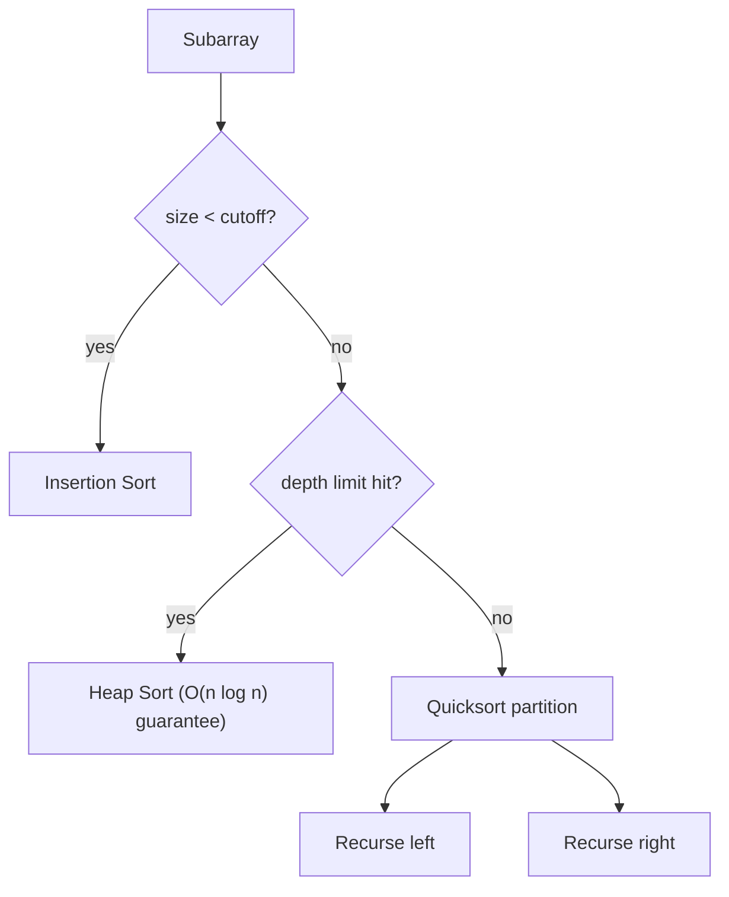
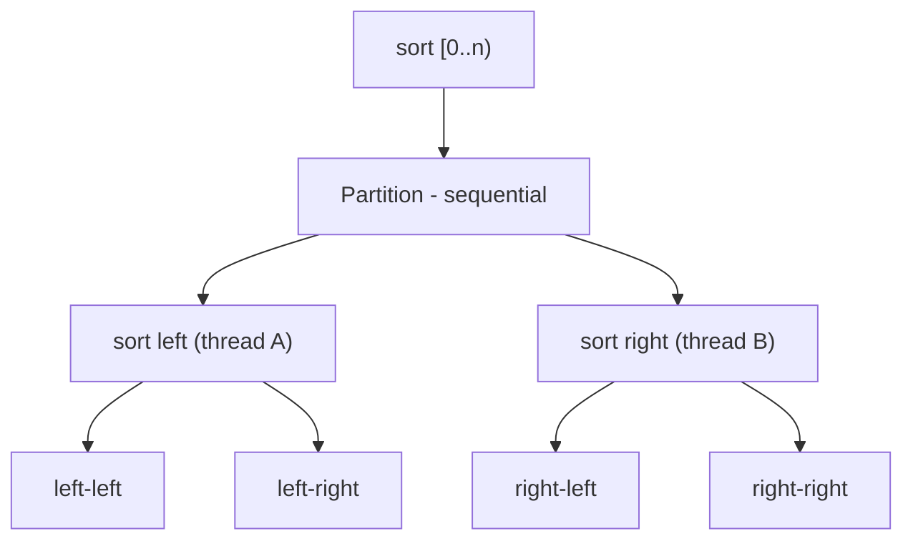

# Randomized Quicksort — Senior Level

## Table of Contents

1. [Introduction](#introduction)
2. [Production Sort Engineering: Introsort and Pdqsort](#production-sort-engineering)
3. [Cache, Branch Prediction, and Memory Behavior](#cache-branch-prediction-and-memory)
4. [Parallel Quicksort](#parallel-quicksort)
5. [Adversarial Inputs and Algorithmic-Complexity Attacks](#adversarial-inputs)
6. [RNG Choice: Cost, Quality, and Security](#rng-choice)
7. [When NOT to Use Randomized Quicksort](#when-not-to-use)
8. [Comparison with Alternatives](#comparison-with-alternatives)
9. [Code Examples](#code-examples)
10. [Observability](#observability)
11. [Failure Modes](#failure-modes)
12. [Summary](#summary)

---

## Introduction

> Focus: "How do I engineer, deploy, and defend a production sort built on randomized Quicksort?"

At senior level you rarely *write* Randomized Quicksort — you consume it through your language's built-in (`slices.Sort`, `Arrays.sort`, `std::sort`). The senior questions are about the *engineering around* it:

1. **Hybridization:** real sorts are not bare Quicksort. They are **Introsort** / **Pdqsort** — Quicksort with a Heap Sort fallback and an Insertion Sort cutoff, often with *pattern detection* that does the job of randomization more cheaply.
2. **Hardware reality:** branch misprediction and cache misses dominate wall-clock time, not comparison counts. Block partitioning and in-place locality are why Quicksort wins.
3. **Security:** a fixed-pivot sort is a denial-of-service vector. Randomization (or pattern defeating) is a *security control*, not just a performance tweak.
4. **Parallelism:** Quicksort parallelizes naturally but load-balances poorly; know when ForkJoin Merge Sort wins instead.
5. **Worst-case guarantees:** randomization gives *expected* O(n log n), but some systems need a *hard* bound — that is Introsort or median-of-medians territory.

This file builds on the [middle level](./middle.md) (pivot strategies, 3-way partition, recurrence) and the base [Quick Sort senior file](../../07-sorting-algorithms/04-quick-sort/senior.md).

---

## Production Sort Engineering

No serious library ships naive Randomized Quicksort. They ship **hybrids** that combine three algorithms, switching based on subarray size and recursion depth.

### The Introsort Architecture

David Musser's **Introsort** (1997) is the template:

```text
introsort(arr, lo, hi, depth_limit):
    if hi - lo < CUTOFF:            # ~16-32 elements
        return                       # leave for a final insertion-sort pass
    if depth_limit == 0:            # recursion got too deep
        heapsort(arr, lo, hi)        # guaranteed O(n log n) fallback
        return
    p = partition(arr, lo, hi)       # quicksort partition (pivot via median/random)
    introsort(arr, lo, p-1, depth_limit-1)
    introsort(arr, p+1, hi, depth_limit-1)
```

with `depth_limit = 2·⌊log₂ n⌋` initially. The genius: **Quicksort speed on average, Heap Sort's worst-case guarantee when a bad pivot streak appears.** This converts "expected O(n log n)" into "**worst-case O(n log n)**" — eliminating the O(n²) tail entirely.



### Pdqsort: Pattern-Defeating Quicksort

Orson Peters' **Pdqsort** (2014, used by Go ≥1.19, Rust `sort_unstable`, Boost) is the modern state of the art. It replaces *blanket* randomization with *targeted* randomization:

1. **Median-of-three / ninther** pivot selection.
2. **Pattern detection:** if a partition is highly *unbalanced* (a sign of an adversarial or structured input), it **shuffles a few elements** to break the pattern — randomization applied *only when needed*, not on every call.
3. **Block partitioning** to defeat branch misprediction (30–50% faster on random data).
4. **Introsort fallback** to Heap Sort on deep recursion → O(n log n) worst case.
5. **Insertion-sort cutoff** with an optimization that detects already-sorted runs.

| Engine | Language | Randomization style | Worst case |
|--------|----------|---------------------|-----------|
| Pdqsort | Go, Rust, Boost | Pattern-triggered shuffle | O(n log n) |
| Introsort | C++ STL `std::sort` | Median-of-three + heap fallback | O(n log n) |
| Dual-Pivot Quicksort | Java `Arrays.sort(int[])` | Two pivots + heuristics | O(n²) rare (no heap fallback historically) |
| TimSort | Java objects, Python | n/a (Merge-based, stable) | O(n log n) |

> Senior insight: **pure per-call randomization is rarely the production choice.** It costs an RNG call per partition and slightly perturbs cache behavior. Pattern detection achieves the same adversary resistance while *only* paying the cost on suspicious inputs. Randomization remains the right *teaching* model and the right choice when you cannot afford to detect patterns or need a provable expected bound.

---

## Cache, Branch Prediction, and Memory

Comparison count (~1.39 n log n) is *not* what determines wall-clock time on modern hardware. Two effects dominate:

### Branch Misprediction

The inner partition loop is one big data-dependent branch (`if a[j] <= pivot`). On random data the CPU mispredicts ~50% of the time, and each misprediction flushes the pipeline (~15–20 cycles). **Block partitioning** fixes this by separating *comparison* from *movement*:

```text
1. Scan a block of B elements, recording which are "< pivot" into a small offset buffer
   (branchless: store offset, increment counter by the comparison result).
2. Apply all the swaps for that block in one tight loop.
```

This turns unpredictable branches into predictable straight-line code; Pdqsort and BlockQuicksort report 30–80% speedups on random integers.

### Cache Locality

| Sort | Memory writes (n=10⁶, 8-byte ints) | Cache miss profile |
|------|-------------------------------------|--------------------|
| Quicksort (in-place) | ~16 MB (swaps only) | sequential within each partition |
| Merge Sort | ~160 MB (buffer round-trips) | sequential but ~10× the bytes |
| Heap Sort | ~16 MB | **poor** — sift-down jumps across the array |

Quicksort partitions touch *contiguous* memory, and subarrays eventually fit in L1/L2, staying hot across recursive calls. This locality is the real reason it beats Merge Sort despite more comparisons — and the reason Heap Sort (great Big-O, terrible locality) is only used as the *fallback*, never the primary.

> Note on randomization vs cache: a *random pivot* read jumps to an arbitrary index, costing one cache miss per partition. Pattern-defeating sorts avoid this by reading fixed positions (lo/mid/hi) and only shuffling when an imbalance is detected — another reason production code prefers pattern detection to blanket randomization.

---

## Parallel Quicksort

Quicksort parallelizes naturally: after partition, the two sides are *independent* and can be sorted on separate threads.



### The Catch: Load Imbalance

The *partition step itself is sequential* and O(n), so by Amdahl's law the top-level partition caps speedup. Worse, an unbalanced pivot gives one thread a giant subarray and the other a tiny one. Randomization helps here too — balanced splits → balanced thread work.

| Approach | Work | Span (parallel depth) | Practical speedup (8 cores) |
|----------|------|------------------------|------------------------------|
| Sequential | Θ(n log n) | Θ(n log n) | 1× |
| Parallel sort halves, sequential partition | Θ(n log n) | Θ(n) | 3–5× |
| Parallel partition + parallel sort | Θ(n log n) | Θ(log² n) | better, complex |

**Java's choice:** `Arrays.parallelSort` uses **parallel Merge Sort** (ForkJoin), *not* parallel Quicksort, precisely because Merge Sort load-balances cleanly (always splits in half) and is stable. Parallel Quicksort's imbalance and the sequential partition bottleneck make it harder to scale predictably.

### Spawn Threshold

```go
func ParallelSort(a []int) {
    if len(a) < parallelThreshold { // ~10k-100k
        Sort(a) // fall back to sequential randomized quicksort
        return
    }
    p := randomizedPartition(a, 0, len(a)-1)
    var wg sync.WaitGroup
    wg.Add(2)
    go func() { defer wg.Done(); ParallelSort(a[:p]) }()
    go func() { defer wg.Done(); ParallelSort(a[p+1:]) }()
    wg.Wait()
}
```

Below the threshold, thread creation and synchronization cost more than the work saved — always cut over to sequential for small subarrays.

---

## Adversarial Inputs

### The Attack

If a service sorts user-controlled data with a *fixed-pivot* Quicksort, an attacker submits the worst-case input (e.g., a sorted or reverse-sorted array, or the known "antiquicksort" sequence) and forces O(n²). For n = 10⁵ that is ~10¹⁰ operations — seconds of CPU per request → a **complexity-based denial of service (DoS)**.

```python
# A fixed-last-pivot quicksort hits O(n^2) on already-sorted input:
adversarial = list(range(100_000))   # attacker submits this
# ~10^10 comparisons -> request hangs -> CPU exhaustion -> DoS
```

This is the same family as **Hash-DoS** (crafted keys forcing hash collisions). Real frameworks were vulnerable: PHP, early Java, and various web stacks shipped exploitable sorts/hash maps.

### McIlroy's Antiquicksort

Doug McIlroy showed (1999) that for *any deterministic* pivot rule, an adversary can construct an input forcing Θ(n²) — even median-of-three — by answering comparisons adaptively ("killer adversary"). The lesson: **no deterministic pivot rule is safe against an adaptive adversary.** Only true randomization (with an unpredictable seed) or an Introsort/Heap fallback defeats it.

### Defenses (in order of strength)

1. **Introsort / Pdqsort fallback to Heap Sort** → *hard* O(n log n) worst case. The strongest, deterministic guarantee.
2. **Random pivot with an unpredictable seed** → expected O(n log n); attacker cannot predict pivots.
3. **Pre-shuffle with an unpredictable seed** → equivalent protection.
4. **Input size caps** → reject sorts above a sane limit.
5. **Use the language built-in** → Go/Rust (pdqsort), C++ (`std::sort` introsort) are immune; verify your stack.

> Critical nuance: a random pivot seeded with a *predictable* value (constant seed, or a PRNG the attacker can reconstruct) is **not** secure. Against a determined adversary, prefer the Heap Sort fallback (deterministic guarantee) or seed from a CSPRNG.

---

## RNG Choice

The randomness source is an engineering decision with cost/quality/security trade-offs.

| RNG | Speed | Quality | Predictable? | Use for |
|-----|-------|---------|--------------|---------|
| LCG / `rand()` | fastest | poor | yes | toy / non-adversarial |
| xorshift / PCG | very fast | good | yes (if seed leaks) | general performance |
| Go `math/rand/v2`, Java `ThreadLocalRandom` | fast | good | yes | typical server sorts |
| CSPRNG (`crypto/rand`, `SecureRandom`) | slow | excellent | **no** | adversary-facing sorts |

**Guidance:**
- For pure *performance* robustness (no attacker), a fast non-crypto PRNG is fine — you only need it to defeat *unlucky* inputs, not malicious ones.
- For *adversary-facing* sorts where you cannot use an Introsort fallback, seed from a CSPRNG once at startup so pivots are unpredictable.
- **Per-call CSPRNG draws are too slow** — draw a seed once, then use a fast PRNG, or just rely on the Heap Sort fallback for the guarantee.

> Most production engines sidestep this entirely: pattern-defeating Quicksort + Heap fallback gives the guarantee *without* needing a high-quality RNG in the hot path.

---

## When NOT to Use

| Situation | Why Randomized Quicksort is wrong | Use instead |
|-----------|-----------------------------------|-------------|
| Hard real-time / safety-critical | Expected, not guaranteed, bound | Introsort, Heap Sort, Merge Sort |
| Need stability | Quicksort is unstable | TimSort, Merge Sort |
| Linked lists | Random access assumed | Merge Sort |
| Data > RAM (external) | In-place assumes RAM residency | External Merge Sort |
| Tiny arrays | RNG + recursion overhead | Insertion Sort |
| Duplicate-heavy keys (2-way) | O(n²) on all-equal | 3-way partition or Merge Sort |
| Reproducible output required | Non-deterministic path | Fixed-seed or deterministic sort |
| Already-mostly-sorted data | No adaptivity | TimSort (detects runs) |

The honest senior takeaway: **bare Randomized Quicksort is rarely the right production choice.** It is a *building block*. The production answer is almost always an **Introsort/Pdqsort hybrid** (which *contains* the randomization idea but adds guarantees) or **TimSort** (when you need stability/adaptivity).

---

## Comparison with Alternatives

| Attribute | Randomized Quicksort | Introsort / Pdqsort | TimSort | Heap Sort |
|-----------|----------------------|---------------------|---------|-----------|
| Worst case | O(n²) (improbable) | **O(n log n)** | **O(n log n)** | **O(n log n)** |
| Expected | O(n log n) | O(n log n) | O(n log n) | O(n log n) |
| Adaptive (sorted input) | no | partial | **yes** | no |
| Stable | no | no | **yes** | no |
| Space | O(log n) | O(log n) | O(n) | **O(1)** |
| Cache | excellent | **excellent** | good | poor |
| Adversary-safe | seed-dependent | **yes** | yes | yes |
| Production usage | building block | Go/Rust/C++ | Java objects/Python | fallback only |

---

## Code Examples

### Introsort (Randomized Pivot + Heap Fallback + Insertion Cutoff)

A self-contained hybrid giving worst-case O(n log n).

#### Go

```go
package main

import (
    "fmt"
    "math/bits"
    "math/rand"
)

const cutoff = 16

func Introsort(a []int) {
    depth := 2 * bits.Len(uint(len(a))) // ~2*log2(n)
    introsort(a, 0, len(a)-1, depth)
    insertionAll(a)
}

func introsort(a []int, lo, hi, depth int) {
    for hi-lo > cutoff {
        if depth == 0 {
            heapSortRange(a, lo, hi) // guaranteed O(n log n)
            return
        }
        depth--
        r := lo + rand.Intn(hi-lo+1)
        a[r], a[hi] = a[hi], a[r]
        p := lomuto(a, lo, hi)
        if p-lo < hi-p {
            introsort(a, lo, p-1, depth)
            lo = p + 1
        } else {
            introsort(a, p+1, hi, depth)
            hi = p - 1
        }
    }
}

func lomuto(a []int, lo, hi int) int {
    pivot := a[hi]
    i := lo - 1
    for j := lo; j < hi; j++ {
        if a[j] <= pivot {
            i++
            a[i], a[j] = a[j], a[i]
        }
    }
    a[i+1], a[hi] = a[hi], a[i+1]
    return i + 1
}

func heapSortRange(a []int, lo, hi int) {
    n := hi - lo + 1
    sift := func(start, count int) {
        root := start
        for {
            child := 2*(root-lo) + 1 + lo
            if child > hi {
                break
            }
            if child+1 <= hi && a[child] < a[child+1] {
                child++
            }
            if a[root] >= a[child] {
                break
            }
            a[root], a[child] = a[child], a[root]
            root = child
        }
        _ = count
    }
    for start := lo + n/2 - 1; start >= lo; start-- {
        sift(start, n)
    }
    for end := hi; end > lo; end-- {
        a[lo], a[end] = a[end], a[lo]
        hi = end - 1
        sift(lo, end-lo)
    }
    hi = lo + n - 1
}

func insertionAll(a []int) {
    for i := 1; i < len(a); i++ {
        x, j := a[i], i-1
        for j >= 0 && a[j] > x {
            a[j+1] = a[j]
            j--
        }
        a[j+1] = x
    }
}

func main() {
    data := []int{5, 3, 8, 1, 9, 2, 7, 4, 6, 0, 5, 3}
    Introsort(data)
    fmt.Println(data)
}
```

#### Java

```java
import java.util.Arrays;
import java.util.concurrent.ThreadLocalRandom;

public class Introsort {
    static final int CUTOFF = 16;

    public static void sort(int[] a) {
        int depth = 2 * (31 - Integer.numberOfLeadingZeros(Math.max(1, a.length)));
        intro(a, 0, a.length - 1, depth);
        insertionAll(a);
    }

    static void intro(int[] a, int lo, int hi, int depth) {
        while (hi - lo > CUTOFF) {
            if (depth == 0) { heapRange(a, lo, hi); return; }
            depth--;
            int r = ThreadLocalRandom.current().nextInt(lo, hi + 1);
            swap(a, r, hi);
            int p = lomuto(a, lo, hi);
            if (p - lo < hi - p) { intro(a, lo, p - 1, depth); lo = p + 1; }
            else                 { intro(a, p + 1, hi, depth); hi = p - 1; }
        }
    }

    static int lomuto(int[] a, int lo, int hi) {
        int pivot = a[hi], i = lo - 1;
        for (int j = lo; j < hi; j++) if (a[j] <= pivot) swap(a, ++i, j);
        swap(a, i + 1, hi);
        return i + 1;
    }

    static void heapRange(int[] a, int lo, int hi) {
        int n = hi - lo + 1;
        for (int start = lo + n / 2 - 1; start >= lo; start--) sift(a, start, lo, hi);
        for (int end = hi; end > lo; end--) { swap(a, lo, end); sift(a, lo, lo, end - 1); }
    }

    static void sift(int[] a, int root, int lo, int hi) {
        while (true) {
            int child = 2 * (root - lo) + 1 + lo;
            if (child > hi) break;
            if (child + 1 <= hi && a[child] < a[child + 1]) child++;
            if (a[root] >= a[child]) break;
            swap(a, root, child);
            root = child;
        }
    }

    static void insertionAll(int[] a) {
        for (int i = 1; i < a.length; i++) {
            int x = a[i], j = i - 1;
            while (j >= 0 && a[j] > x) a[j + 1] = a[j--];
            a[j + 1] = x;
        }
    }

    static void swap(int[] a, int x, int y) { int t = a[x]; a[x] = a[y]; a[y] = t; }

    public static void main(String[] args) {
        int[] data = {5, 3, 8, 1, 9, 2, 7, 4, 6, 0, 5, 3};
        sort(data);
        System.out.println(Arrays.toString(data));
    }
}
```

#### Python

```python
import random, math

CUTOFF = 16


def introsort(a):
    depth = 2 * max(1, int(math.log2(max(1, len(a)))))
    _intro(a, 0, len(a) - 1, depth)
    _insertion_all(a)


def _intro(a, lo, hi, depth):
    while hi - lo > CUTOFF:
        if depth == 0:
            _heap_range(a, lo, hi)
            return
        depth -= 1
        r = random.randint(lo, hi)
        a[r], a[hi] = a[hi], a[r]
        p = _lomuto(a, lo, hi)
        if p - lo < hi - p:
            _intro(a, lo, p - 1, depth)
            lo = p + 1
        else:
            _intro(a, p + 1, hi, depth)
            hi = p - 1


def _lomuto(a, lo, hi):
    pivot = a[hi]; i = lo - 1
    for j in range(lo, hi):
        if a[j] <= pivot:
            i += 1; a[i], a[j] = a[j], a[i]
    a[i + 1], a[hi] = a[hi], a[i + 1]
    return i + 1


def _heap_range(a, lo, hi):
    n = hi - lo + 1

    def sift(root, end):
        while True:
            child = 2 * (root - lo) + 1 + lo
            if child > end:
                break
            if child + 1 <= end and a[child] < a[child + 1]:
                child += 1
            if a[root] >= a[child]:
                break
            a[root], a[child] = a[child], a[root]
            root = child

    for start in range(lo + n // 2 - 1, lo - 1, -1):
        sift(start, hi)
    for end in range(hi, lo, -1):
        a[lo], a[end] = a[end], a[lo]
        sift(lo, end - 1)


def _insertion_all(a):
    for i in range(1, len(a)):
        x = a[i]; j = i - 1
        while j >= 0 and a[j] > x:
            a[j + 1] = a[j]; j -= 1
        a[j + 1] = x
```

---

## Observability

| Metric | Threshold | Why it matters |
|--------|-----------|----------------|
| `sort_recursion_depth_max` | > 2 log₂ n | Bad-pivot streak or adversarial input — Introsort would fall back here |
| `sort_heap_fallback_count` | > 0 (spiking) | Inputs are forcing the Heap Sort fallback — investigate for an attack |
| `sort_duration_p99_ms` | baseline + jump | Quadratic blow-up signature → complexity DoS |
| `sort_input_sortedness` | near-fully-sorted, high volume | Possible adversarial probing; consider TimSort |
| `parallel_sort_speedup` | < 2× on 8 cores | Partition imbalance or memory-bandwidth bound |

Alert on **sudden p99 latency jumps** for sort-heavy endpoints — that is the classic complexity-attack fingerprint.

---

## Failure Modes

| Mode | Symptom | Mitigation |
|------|---------|------------|
| Complexity DoS (fixed pivot) | p99 latency spikes on crafted input | Introsort/Pdqsort fallback; verify built-in |
| Predictable-seed exploit | Attacker reconstructs pivots → forces O(n²) | CSPRNG seed, or rely on Heap fallback |
| Stack overflow on bad streak | Crash on large input | Tail-recurse smaller side; depth-bounded Introsort |
| All-equal / duplicate blow-up | O(n²) on repeated keys | 3-way partition |
| Parallel imbalance | Poor multicore scaling | Spawn threshold; prefer ForkJoin Merge Sort |
| RNG contention | Throughput drop under concurrency | `ThreadLocalRandom` / per-goroutine RNG, not a shared locked one |

---

## Summary

At senior level, Randomized Quicksort is a **building block**, not the shipped artifact. Production sorts are **Introsort / Pdqsort hybrids**: a Quicksort core (with pivot selection that may be randomized *or* pattern-defeating), an **Insertion Sort cutoff** for small ranges, and a **Heap Sort fallback** that upgrades "expected O(n log n)" to a **hard worst-case O(n log n)** guarantee.

Engineering priorities that matter more than comparison counts:

1. **Hardware:** block partitioning beats branch misprediction; in-place locality beats Merge Sort.
2. **Security:** a fixed-pivot sort is a DoS vector. Randomization (with an unpredictable seed) *or* a Heap fallback defeats adversaries; pattern detection does it cheaply.
3. **Parallelism:** Quicksort parallelizes but load-balances poorly; Java uses parallel Merge Sort for a reason.
4. **Guarantees:** when you need a *hard* bound (real-time, adversarial), use Introsort — not bare randomization.

Production rule: **use the built-in; it already contains these ideas, hardened over decades.** Write your own only to learn, or for a constrained environment.

---

**Next step:** [Randomized Quicksort — Professional Level](./professional.md)
