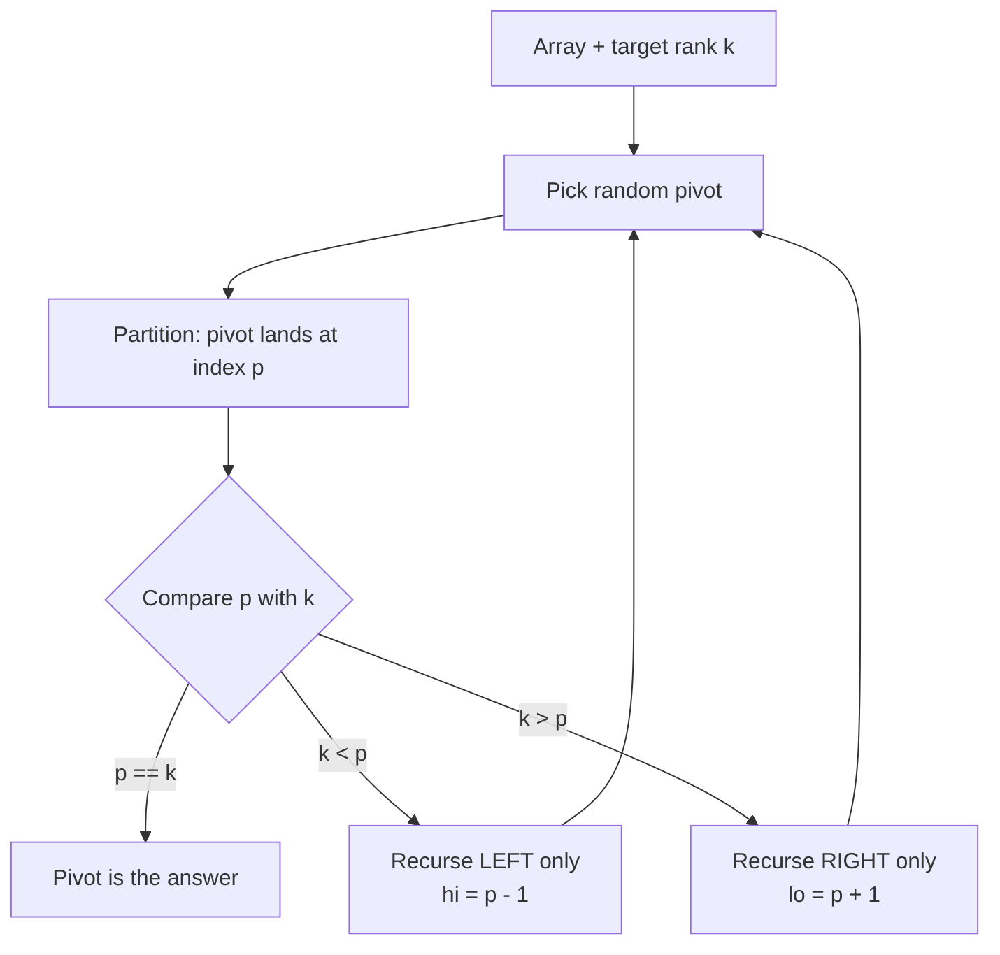

# Quickselect and the k-th Order Statistic — Junior Level

## Table of Contents

1. [Introduction](#introduction)
2. [Prerequisites](#prerequisites)
3. [Glossary](#glossary)
4. [Core Concepts](#core-concepts)
5. [Big-O Summary](#big-o-summary)
6. [Real-World Analogies](#real-world-analogies)
7. [Pros & Cons](#pros--cons)
8. [Step-by-Step Walkthrough](#step-by-step-walkthrough)
9. [Code Examples](#code-examples)
10. [Coding Patterns](#coding-patterns)
11. [Error Handling](#error-handling)
12. [Performance Tips](#performance-tips)
13. [Best Practices](#best-practices)
14. [Edge Cases & Pitfalls](#edge-cases--pitfalls)
15. [Common Mistakes](#common-mistakes)
16. [Cheat Sheet](#cheat-sheet)
17. [Visual Animation](#visual-animation)
18. [Summary](#summary)
19. [Further Reading](#further-reading)

---

## Introduction

> Focus: "What is Quickselect?" and "How do I find the k-th smallest element without sorting everything?"

Suppose someone hands you an array of 1,000,000 numbers and asks: **"What is the 500,000th smallest value (the median)?"** The obvious answer is "sort it, then look at index 499,999." That works, but sorting costs **O(n log n)** — and you threw away almost all of that work. You only wanted *one* element, but you fully ordered all million of them.

**Quickselect** answers the question in **expected O(n)** — linear time, faster than sorting. It is the *selection* cousin of Quick Sort. The trick is simple and beautiful:

1. Pick a **pivot** element.
2. **Partition** the array so everything smaller than the pivot goes left, everything larger goes right. After this, the pivot sits at its **final sorted position** `p`.
3. Now compare `p` to the rank `k` you want:
   - If `p == k`, the pivot **is** the answer. Done.
   - If `k < p`, the answer is in the **left** part — recurse there only.
   - If `k > p`, the answer is in the **right** part — recurse there only.

The one idea that separates Quickselect from Quick Sort: **you recurse into only ONE side**, never both. Quick Sort sorts both halves; Quickselect throws away the half that cannot contain the answer. That is why it is linear instead of `n log n`.

The "k-th order statistic" is just the formal name for "the k-th smallest element." The 1st order statistic is the minimum, the n-th is the maximum, and the (n/2)-th is the median. Quickselect finds any of them.

Like Quick Sort, Quickselect was born from Tony Hoare's partition idea (1961). With a **random pivot**, its expected running time is linear regardless of input order.

---

## Prerequisites

- **Required:** Arrays and indexing
- **Required:** The partition step from Quick Sort (pivot, swap, two regions)
- **Required:** Basic recursion (or a loop)
- **Helpful:** Understanding why Quick Sort is O(n log n)
- **Helpful:** Knowing what "median" means

---

## Glossary

| Term | Definition |
|------|-----------|
| **k-th order statistic** | The k-th smallest element of a collection (1st = min, n-th = max) |
| **Rank** | The position an element would occupy if the array were sorted |
| **Selection** | The problem of finding the element of a given rank |
| **Pivot** | The element chosen to split the array during partition |
| **Partition** | Rearranging so `< pivot` is left, `> pivot` is right; pivot lands at its final index |
| **Median** | The middle element by rank (the n/2-th order statistic) |
| **Top-k** | The k smallest (or k largest) elements |
| **Quickselect** | Selection algorithm using partition + recursion into one side; expected O(n) |
| **Median-of-medians** | A deterministic pivot rule (BFPRT) giving worst-case O(n) selection |
| **Introselect** | Quickselect with a median-of-medians fallback to guarantee O(n) worst case |

> **Note on indexing.** People say "k-th smallest" using **1-based** counting: k=1 is the minimum. In code we usually convert to a **0-based index** `k-1`. This guide keeps the array index `k` 0-based inside code (so `k=0` is the minimum) and is explicit whenever it matters — a classic off-by-one trap.

---

## Core Concepts

### Concept 1: Partition gives one element its final position for free

The single most important fact: after a partition around a pivot, **the pivot is in its correct sorted slot** `p`. Everything to its left is smaller; everything to its right is larger. We did not sort either side — but we learned the *exact rank* of the pivot. That one piece of information is enough to decide which side to keep looking in.

### Concept 2: Recurse into only ONE side

Quick Sort recurses left **and** right. Quickselect compares the pivot index `p` with the target `k`:

- `k == p` → found it.
- `k < p` → the answer is among the smaller elements → recurse **left** only.
- `k > p` → the answer is among the larger elements → recurse **right** only.

Half (on average) of the array is discarded at every step and never touched again. That is the whole speedup.

### Concept 3: Random pivot keeps it fast

If you always pick the first element as pivot, a sorted input forces the partition to shave off only one element per step → **O(n²)**. Picking a **random pivot** makes every input behave like an average input, giving **expected O(n)**. No adversary can predict your random choice.

### Concept 4: The answer narrows like a search

Watch the search window `[lo, hi]` shrink. Each partition either lands exactly on `k` (stop) or chops the window down to one side. It feels like binary search, except the "midpoint" is a random pivot and the window shrinks by a random fraction (about half on average) instead of exactly half.

### Concept 5: Selection is easier than sorting

Sorting tells you the rank of *every* element. Selection tells you *one* element's value. Asking for less lets us do less work: **O(n)** beats **O(n log n)**. If you ever need only the k-th element, the median, or the top-k, reach for selection, not a full sort.

---

## Big-O Summary

| Case | Time | Notes |
|------|------|-------|
| Best | **O(n)** | Pivot lands on `k` quickly; sum n + n/2 + n/4 + ... = 2n |
| Average (random pivot) | **O(n)** | Expected linear, geometric series of shrinking work |
| Worst (naive pivot) | **O(n²)** | Always-bad pivot on adversarial input |
| Worst (median-of-medians) | **O(n)** | Deterministic, but large constant |
| Space (recursion) | **O(log n)** avg | Tail-recursion / loop makes it O(1) |
| Space (extra data) | **O(1)** | In-place partition |
| Comparisons (avg) | ~3.4 n | For median; less for ranks near the ends |

> Compare with the alternatives: **full sort** = O(n log n), **heap-based top-k** = O(n log k). Quickselect's O(n) wins when you need just one rank (or an unordered top-k).

---

## Real-World Analogies

| Concept | Analogy |
|---------|--------|
| **Partition + recurse one side** | Looking for a word in a dictionary: open to a page, see your word is earlier, and only keep flipping in the front half |
| **k-th order statistic** | "Who finished in 7th place?" — you don't need the full ranking, just position 7 |
| **Median via selection** | Finding the middle-income household without sorting every salary |
| **Random pivot** | Asking a random person their age to guess if you're in the "younger" or "older" half of a crowd |
| **Top-k** | Picking the 10 tallest people without ranking all 1000 by height |

> Where the analogy breaks: a dictionary is already sorted (true binary search, exactly half each time). Quickselect works on **unsorted** data and shrinks by a *random* fraction, so it is "binary search you can run without sorting first."

---

## Pros & Cons

| Pros | Cons |
|------|------|
| **Expected O(n)** — faster than sorting | **O(n²) worst case** with naive pivot |
| In-place — O(1) extra memory | Reorders (mutates) the input array |
| Reuses the familiar partition step | Not stable; equal elements may move |
| Finds median, top-k, any rank | Single random run has variance in runtime |
| Foundation of `nth_element` in C++ | Needs random access (bad for linked lists) |

**When to use:**
- You need one specific rank (median, p99 latency, k-th smallest).
- You need the top-k or bottom-k and **do not** need them in sorted order.
- You can afford to reorder the array (or copy it first).

**When NOT to use:**
- You need the full sorted order anyway → just sort.
- You need top-k from a **stream** that does not fit in memory → use a heap.
- Strict worst-case latency required → use median-of-medians / introselect.
- Data is a linked list → no random access; sort instead.

---

## Step-by-Step Walkthrough

Find the **3rd smallest** element (0-based `k = 2`) of `[7, 2, 1, 6, 8, 5, 3]`.
The sorted array would be `[1, 2, 3, 5, 6, 7, 8]`, so the answer should be **3**.

**Window `[lo=0, hi=6]`. Pick pivot = last element = 3.**

Partition around 3 (Lomuto, send `< 3` left):

```
start:  [7, 2, 1, 6, 8, 5, 3]   pivot = 3
        elements < 3 are: 2, 1
after:  [2, 1, 3, 6, 8, 5, 7]   pivot 3 lands at index p = 2
```

Now compare `p = 2` with `k = 2`: **equal!** The pivot `3` is the 3rd smallest. **Answer = 3.** Done in a single partition — we never touched the right side `[6, 8, 5, 7]`.

**A second example — `k = 4` (5th smallest), same array.** Suppose the first partition again puts pivot 3 at index `p = 2`. Since `k = 4 > p = 2`, recurse **right only** into `[6, 8, 5, 7]` (indices 3..6), and now we want the element of rank `4` overall. We keep the same global `k` and only search the right window. Eventually a pivot lands exactly on index 4, which holds `6` — the 5th smallest. The left side `[2, 1, 3]` was discarded immediately.

Notice the discarded work: half the array dropped out after the very first partition. That is the geometric shrink that makes it linear.

---

## Code Examples

### Example 1: Quickselect with Random Pivot (Lomuto)

#### Go

```go
package main

import (
	"fmt"
	"math/rand"
)

// QuickselectKth returns the k-th smallest element (0-based: k=0 is the min).
// Expected O(n) time. Mutates arr.
func QuickselectKth(arr []int, k int) int {
	lo, hi := 0, len(arr)-1
	for lo < hi {
		p := partition(arr, lo, hi)
		switch {
		case p == k:
			return arr[p]
		case k < p:
			hi = p - 1 // answer is on the left
		default:
			lo = p + 1 // answer is on the right
		}
	}
	return arr[lo]
}

func partition(arr []int, lo, hi int) int {
	// Random pivot, swapped to the end for the Lomuto scheme.
	idx := lo + rand.Intn(hi-lo+1)
	arr[idx], arr[hi] = arr[hi], arr[idx]
	pivot := arr[hi]
	i := lo - 1
	for j := lo; j < hi; j++ {
		if arr[j] < pivot {
			i++
			arr[i], arr[j] = arr[j], arr[i]
		}
	}
	arr[i+1], arr[hi] = arr[hi], arr[i+1]
	return i + 1
}

func main() {
	data := []int{7, 2, 1, 6, 8, 5, 3}
	fmt.Println(QuickselectKth(data, 2)) // 3rd smallest -> 3
}
```

#### Java

```java
import java.util.Random;

public class Quickselect {
    private static final Random RNG = new Random();

    // k is 0-based: k=0 is the minimum. Expected O(n).
    public static int kthSmallest(int[] arr, int k) {
        int lo = 0, hi = arr.length - 1;
        while (lo < hi) {
            int p = partition(arr, lo, hi);
            if (p == k) return arr[p];
            else if (k < p) hi = p - 1;
            else lo = p + 1;
        }
        return arr[lo];
    }

    private static int partition(int[] a, int lo, int hi) {
        int idx = lo + RNG.nextInt(hi - lo + 1);
        swap(a, idx, hi);
        int pivot = a[hi], i = lo - 1;
        for (int j = lo; j < hi; j++) {
            if (a[j] < pivot) { i++; swap(a, i, j); }
        }
        swap(a, i + 1, hi);
        return i + 1;
    }

    private static void swap(int[] a, int i, int j) {
        int t = a[i]; a[i] = a[j]; a[j] = t;
    }

    public static void main(String[] args) {
        int[] data = {7, 2, 1, 6, 8, 5, 3};
        System.out.println(kthSmallest(data, 2)); // 3
    }
}
```

#### Python

```python
import random

def kth_smallest(arr, k):
    """k is 0-based: k=0 is the minimum. Expected O(n). Mutates arr."""
    lo, hi = 0, len(arr) - 1
    while lo < hi:
        p = partition(arr, lo, hi)
        if p == k:
            return arr[p]
        elif k < p:
            hi = p - 1          # answer is on the left
        else:
            lo = p + 1          # answer is on the right
    return arr[lo]

def partition(arr, lo, hi):
    idx = random.randint(lo, hi)          # random pivot
    arr[idx], arr[hi] = arr[hi], arr[idx] # move it to the end
    pivot = arr[hi]
    i = lo - 1
    for j in range(lo, hi):
        if arr[j] < pivot:
            i += 1
            arr[i], arr[j] = arr[j], arr[i]
    arr[i + 1], arr[hi] = arr[hi], arr[i + 1]
    return i + 1

if __name__ == "__main__":
    print(kth_smallest([7, 2, 1, 6, 8, 5, 3], 2))  # 3
```

**What it does:** Repeatedly partitions and keeps only the side that can contain rank `k`. The loop replaces recursion, so stack space is O(1).
**Run:** `go run main.go` | `javac Quickselect.java && java Quickselect` | `python quickselect.py`

### Example 2: Recursive Quickselect (mirrors Quick Sort, recurses one side)

#### Python

```python
import random

def select(arr, lo, hi, k):
    if lo == hi:
        return arr[lo]
    p = partition(arr, lo, hi)   # same partition as above
    if k == p:
        return arr[p]
    elif k < p:
        return select(arr, lo, p - 1, k)   # ONE side only
    else:
        return select(arr, p + 1, hi, k)   # ONE side only

def quickselect(arr, k):
    return select(arr, 0, len(arr) - 1, k)
```

**Note:** This is Quick Sort with exactly **one** recursive call removed. That deletion is the entire algorithmic difference, and it drops the cost from O(n log n) to O(n).

### Example 3: Finding the Median and the Top-k

#### Python

```python
def median(arr):
    """Lower median for even sizes. Expected O(n)."""
    n = len(arr)
    return kth_smallest(arr[:], (n - 1) // 2)   # copy to avoid mutating caller

def top_k_smallest(arr, k):
    """Return the k smallest elements (UNORDERED). Expected O(n)."""
    a = arr[:]                      # copy
    kth_smallest(a, k - 1)          # partitions so a[:k] are the k smallest
    return a[:k]                    # not sorted; sort if you need order

if __name__ == "__main__":
    print(median([7, 2, 1, 6, 8, 5, 3]))        # 5 (middle of sorted)
    print(sorted(top_k_smallest([7, 2, 1, 6, 8, 5, 3], 3)))  # [1, 2, 3]
```

**Why top-k works:** after `kth_smallest(a, k-1)` runs, everything before index `k` is smaller than everything at and after it — so `a[:k]` *is* the set of the k smallest (just not in order).

---

## Coding Patterns

### Pattern 1: Iterative Quickselect (no recursion)

**Intent:** Shrink the window `[lo, hi]` in a loop until a pivot lands on `k`.

```python
def quickselect_iter(arr, k):
    lo, hi = 0, len(arr) - 1
    while lo < hi:
        p = partition(arr, lo, hi)
        if p == k:   return arr[p]
        elif k < p:  hi = p - 1
        else:        lo = p + 1
    return arr[lo]
```

The loop form is preferred in production: no recursion stack, no chance of stack overflow.

### Pattern 2: Recurse Into One Side (the defining move)

```python
def select(arr, lo, hi, k):
    if lo == hi: return arr[lo]
    p = partition(arr, lo, hi)
    if   k == p: return arr[p]
    elif k <  p: return select(arr, lo, p - 1, k)  # keep left
    else:        return select(arr, p + 1, hi, k)  # keep right
```

### Pattern 3: Reuse Quickselect for Top-k

```python
def top_k(arr, k):
    a = arr[:]
    quickselect_iter(a, k - 1)  # partitions the k smallest to the front
    return a[:k]                # unordered; sort() if order matters
```



---

## Error Handling

| Error | Cause | Fix |
|-------|-------|-----|
| `IndexError` / panic | `k` out of range (`k < 0` or `k >= n`) | Validate `0 <= k < len(arr)` before starting |
| Wrong element returned | Mixed 1-based and 0-based `k` | Decide on one convention; convert `k-1` at the boundary |
| Infinite loop | Partition that does not shrink the window (e.g. on all-equal data with `<=`) | Use strict `<` in Lomuto; consider 3-way partition for duplicates |
| `RecursionError` | Worst-case O(n) depth with naive pivot | Use random pivot or iterate instead of recurse |
| Caller's array reordered unexpectedly | Quickselect mutates in place | Copy the array first if the caller needs the original order |

---

## Performance Tips

- **Always use a random (or median-of-three) pivot.** First/last element is O(n²) on sorted input.
- **Iterate, don't recurse**, for the kept side — keeps space O(1) and avoids stack overflow.
- **Use a 3-way partition** when the data has many duplicates (otherwise all-equal data is O(n²)).
- **Copy the array** if the caller must keep the original order; the partition reorders in place.
- **For top-k that must be sorted**, run Quickselect first, then sort only the `k` front elements: O(n + k log k).

---

## Best Practices

- Document whether your `k` is 0-based or 1-based right in the signature.
- Validate `k` against the array length before doing any work.
- Prefer the language built-in when one exists: C++ `std::nth_element`, Python `heapq.nsmallest`/`statistics.median`, Go via a small helper.
- Write the brute-force "sort then index" version first as a correctness oracle for tests.
- Test empty/single-element arrays, all-duplicates, and `k` at both ends (min and max).

---

## Edge Cases & Pitfalls

- **Empty array** → undefined; reject before starting.
- **Single element** → `lo == hi`, return it immediately.
- **k = 0** → minimum; **k = n-1** → maximum.
- **All elements equal** → naive Lomuto degrades to O(n²); use 3-way partition.
- **Already sorted / reverse sorted** → fatal with first-as-pivot; harmless with random pivot.
- **Duplicates around the pivot** → with strict `<`, equal elements pile to the right; correctness holds but balance suffers.
- **Caller expects original array order** → remember Quickselect mutates; copy first.

---

## Common Mistakes

1. **Recursing into both sides** — that's Quick Sort, not Quickselect; you lose the O(n) advantage.
2. **Using first/last as pivot** → O(n²) on sorted input.
3. **Off-by-one between 1-based and 0-based `k`** → returns the neighbor of the right answer.
4. **Forgetting Quickselect mutates the input** → surprising bugs upstream.
5. **Assuming top-k results are sorted** — they are partitioned, not ordered.
6. **Using `<=` in Lomuto on all-equal data** → no shrink → infinite loop or O(n²).

---

## Cheat Sheet

```text
QUICKSELECT (k-th order statistic, 0-based k)

ALGORITHM (iterative):
  lo, hi = 0, n-1
  while lo < hi:
    p = partition(arr, lo, hi)   # random pivot inside
    if   p == k: return arr[p]
    elif k <  p: hi = p - 1      # keep LEFT
    else:        lo = p + 1      # keep RIGHT
  return arr[lo]

KEY IDEA: recurse / loop into ONE side only.

COMPLEXITY:
  Best / Average: O(n)      random pivot, geometric shrink
  Worst:          O(n^2)    naive pivot, adversarial input
  Worst (BFPRT):  O(n)      median-of-medians pivot
  Space:          O(1)      iterative, in-place

USES:
  k = 0      -> minimum
  k = n-1    -> maximum
  k = n/2    -> median
  top-k      -> partition at k-1, take front (unordered)

VS ALTERNATIVES:
  Full sort:        O(n log n)
  Heap top-k:       O(n log k)   (great for streams)
  Quickselect:      O(n)         (one rank / unordered top-k)
```

---

## Visual Animation

> See [`animation.html`](./animation.html) for an interactive visual animation of Quickselect.
>
> The animation demonstrates:
> - A random pivot being chosen and highlighted
> - The partition step moving smaller elements left, larger right
> - The pivot landing at its final index `p`
> - **Recursing into only the side that contains rank `k`** (the other side dims out)
> - The window narrowing until the pivot lands exactly on `k`
> - A live Big-O table and an operation log

---

## Summary

**Quickselect** finds the **k-th smallest element (k-th order statistic)** in **expected O(n)** time. It borrows Quick Sort's **partition** step but makes one crucial change: after the pivot lands at its final index `p`, it **recurses into only the one side** that can contain rank `k`, discarding the other half. That single deletion turns O(n log n) into O(n).

Three takeaways:
1. **Partition gives the pivot its true rank for free** — compare that rank with `k` to pick a side.
2. **Recurse into ONE side only** — this is what makes selection cheaper than sorting.
3. **Use a random pivot** — it makes every input behave like the average case, expected O(n).

Quickselect powers median-finding, top-k, and partial sorting, and is the engine behind C++'s `nth_element`.

---

## Further Reading

- CLRS, Chapter 9 — "Medians and Order Statistics"
- Hoare, "Algorithm 65: FIND" (1961) — the original Quickselect
- Sedgewick & Wayne, *Algorithms* 4ed §2.5 (selection)
- C++ `std::nth_element` reference (cppreference.com)
- Python: `heapq.nsmallest`, `statistics.median`, `numpy.partition`
- Go: `sort` package; community `quickselect` helpers

---

Next step: continue to [middle.md](./middle.md) to learn why the random pivot gives expected O(n), how top-k and partial sorting work, and when to choose Quickselect over a heap or a full sort.
