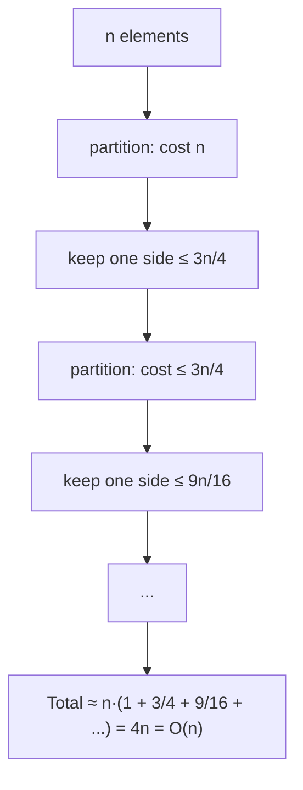
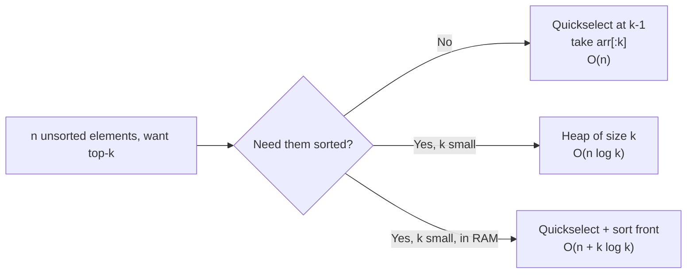
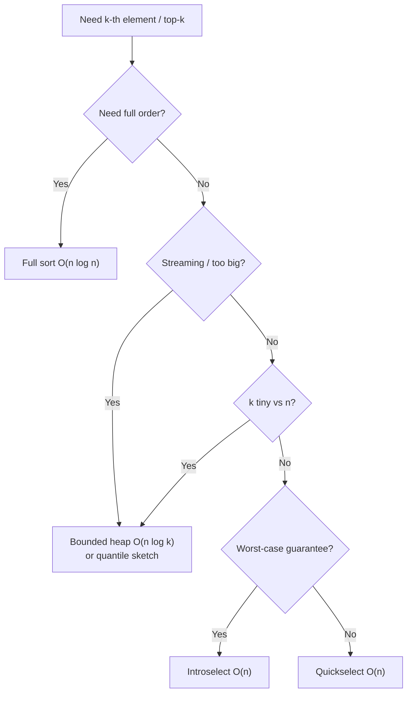

# Quickselect and the k-th Order Statistic — Middle Level

## Table of Contents

1. [Introduction](#introduction)
2. [Why a Random Pivot Gives Expected O(n)](#why-a-random-pivot-gives-expected-on)
3. [The Worst Case and How It Happens](#the-worst-case-and-how-it-happens)
4. [Pivot Strategies Compared](#pivot-strategies-compared)
5. [Top-k and Partial Sorting](#top-k-and-partial-sorting)
6. [Quickselect vs Heap vs Full Sort](#quickselect-vs-heap-vs-full-sort)
7. [Handling Duplicates: 3-Way Quickselect](#handling-duplicates-3-way-quickselect)
8. [Median-of-Three Pivot](#median-of-three-pivot)
9. [Hoare-Style Selection](#hoare-style-selection)
10. [Median-of-Medians Preview](#median-of-medians-preview)
11. [Code Examples](#code-examples)
12. [Decision Framework: Which Selection Tool?](#decision-framework-which-selection-tool)
13. [A Closer Look at the Recurrence](#a-closer-look-at-the-recurrence)
14. [Performance Analysis](#performance-analysis)
15. [Common Applications](#common-applications)
16. [Best Practices](#best-practices)
17. [Visual Animation](#visual-animation)
18. [Summary](#summary)

---

## Introduction

> Focus: "Why is Quickselect expected O(n)?" and "When do I choose it over a heap or a full sort?"

At the junior level you learned the mechanic: partition, then recurse into one side. At the middle level you need to answer three questions a reviewer will ask:

1. **Why is it linear?** The work per level *shrinks geometrically*, so the total is a geometric series that sums to O(n), not O(n log n).
2. **When does it blow up?** Naive pivot choice on adversarial input gives O(n²). A random pivot defends against that.
3. **What should I use instead?** For an unordered top-k or a single rank: Quickselect (O(n)). For a streaming or memory-bounded top-k: a heap (O(n log k)). For everything in order: a full sort (O(n log n)).

This level also covers **partial sorting** (the `std::partial_sort` / `heapq.nsmallest` family) and the **3-way partition** that rescues Quickselect from duplicate-heavy data.

---

## Why a Random Pivot Gives Expected O(n)

The intuition is a geometric series. Suppose every partition splits the array somewhere "reasonable." Then the work done is:

```text
Level 0:  partition n elements        -> cost n
Level 1:  recurse into ~n/2 elements  -> cost n/2
Level 2:  recurse into ~n/4 elements  -> cost n/4
...
Total ≈ n + n/2 + n/4 + n/8 + ... = 2n = O(n)
```

Quick Sort recurses into **both** sides, so each level costs the *full* n again → `n` per level × `log n` levels = O(n log n). Quickselect recurses into **one** side, so each level costs *half* the previous → the geometric series caps at 2n.

### The "good split" argument (formal sketch)

Call a pivot **good** if it lands in the middle half of the array — i.e. between the 25th and 75th percentile. A uniformly random pivot is good with probability **1/2**. A good pivot guarantees the surviving side has at most **3n/4** elements.

So in expectation, every **two** partitions shrink the problem to at most 3/4 of its size. The expected cost recurrence becomes:

```text
T(n) ≤ T(3n/4) + O(n)
By the Master Theorem (a=1, b=4/3, f(n)=n, log_b a = 0 < 1):
T(n) = O(n)
```

The constant works out to roughly **4n** comparisons in the worst expected case, and about **3.4n** for the median specifically. The full probabilistic proof (linearity of expectation over indicator variables) is in `professional.md`.



---

## The Worst Case and How It Happens

If the pivot is always the **smallest** (or always the largest) element, the partition shaves off exactly one element and leaves `n-1` behind:

```text
T(n) = T(n-1) + O(n) = O(n + (n-1) + (n-2) + ... + 1) = O(n²)
```

This is exactly what happens with **first-element pivot on already-sorted input**. An attacker who knows you use a deterministic pivot can feed you such input to cause a **denial-of-service** (an "algorithmic complexity attack").

Two defenses, both standard:

- **Randomized pivot.** The expected time is O(n) for *every* input; no fixed input is bad on average, and the attacker cannot predict your random choice.
- **Median-of-medians (BFPRT).** A deterministic pivot that *provably* yields O(n) worst case (covered below and proven in `professional.md`).

---

## Pivot Strategies Compared

| Strategy | Expected | Worst | Resistance | Notes |
|----------|----------|-------|-----------|-------|
| First / last element | O(n) | O(n²) | None | O(n²) on sorted input — never use in production |
| Middle element | O(n) | O(n²) | Low | Specific patterns still break it |
| **Random** | **O(n)** | O(n²) | High | Standard choice; simple and robust |
| Median-of-three | O(n) | O(n²) | Medium-high | Cheap, resists common patterns |
| Median-of-medians (BFPRT) | O(n) | **O(n)** | Total | Deterministic, large constant |
| **Introselect** | **O(n)** | **O(n)** | Total | Random pivot + BFPRT fallback — best of both |

The production sweet spot is **introselect**: run with a fast random/median-of-three pivot, but count your recursion depth, and if it exceeds a threshold (signaling a bad-luck or adversarial sequence) switch to median-of-medians to guarantee linear time. This is exactly what C++'s `std::nth_element` does.

---

## Top-k and Partial Sorting

A huge fraction of real Quickselect usage is **top-k**: "the 10 largest", "the 100 slowest requests", "the worst 5% of scores."

### Unordered top-k via one Quickselect

After `quickselect(arr, k-1)` (0-based) runs, the partition invariant guarantees that **every element in `arr[0..k-1]` is ≤ every element in `arr[k..n-1]`**. So `arr[:k]` is precisely the set of the k smallest — but **not in sorted order**.

- If you only need the *set* (e.g. to sum them, or display unordered): you are done in **O(n)**.
- If you need them **sorted**: sort just the front `k` afterward → **O(n + k log k)**, still far cheaper than a full O(n log n) sort when `k ≪ n`.

### Partial sort

`std::partial_sort` and `heapq.nsmallest(k, ...)` solve a related problem: produce the **k smallest, in sorted order**. Two common implementations:

| Approach | Time | How |
|----------|------|-----|
| Quickselect + sort front | O(n + k log k) | Select pivot at rank k, then sort `arr[:k]` |
| Heap of size k | O(n log k) | Keep a bounded heap while scanning once |

When `k` is small, both are dramatically cheaper than sorting all n elements.



---

## Quickselect vs Heap vs Full Sort

| Attribute | Quickselect | Heap (size k) | Full Sort |
|-----------|------------|---------------|-----------|
| Time (one rank / top-k) | **O(n)** expected | O(n log k) | O(n log n) |
| Time (worst) | O(n²) naive / O(n) BFPRT | O(n log k) | O(n log n) |
| Space | O(1) in-place | O(k) | O(1)–O(n) |
| Needs all data in memory? | **Yes** | **No** (streaming!) | Yes |
| Mutates input? | Yes | No | Usually |
| Output ordered? | No (partitioned) | Yes (k of them) | Yes (all) |
| Best for | one rank, median, unordered top-k | streaming / huge data / small k | you need full order anyway |

**Choose Quickselect when:** the data fits in memory, you can reorder it, and you need a single rank, the median, or an unordered top-k. It is the asymptotic winner: O(n).

**Choose a heap when:** data arrives as a **stream** or is too large to hold, or `k` is tiny relative to `n`. A size-`k` heap uses only O(k) memory and never needs the whole dataset at once — Quickselect cannot do that.

**Choose a full sort when:** you need everything in order anyway, the data is already nearly sorted (TimSort/Pdqsort adapt), or n is small enough that constant factors dominate.

> Rule of thumb: **k near n/2 (the median) → Quickselect.** **k tiny and/or streaming → heap.** **need full order → sort.**

---

## Handling Duplicates: 3-Way Quickselect

Plain Lomuto partition with strict `<` sends all elements **equal** to the pivot to one side. On an array of all-equal values, each partition removes only the pivot → **O(n²)**. The fix is the same **Dutch National Flag** 3-way partition used by Quick Sort:

```text
Partition into three regions around pivot value v:
  [ < v ] [ == v ] [ > v ]
            lt..gt   (equal region)

If k lands inside [lt, gt]      -> arr[k] is the answer (it equals v)
If k < lt                       -> recurse on the "< v" region
If k > gt                       -> recurse on the "> v" region
```

When `k` falls inside the equal region, **we are done immediately** — every element there has the same value, which is the answer. This makes Quickselect O(n) even on data with very few distinct values.

---

## Median-of-Three Pivot

A cheap, deterministic way to dodge the most common worst cases (sorted, reverse-sorted) without an RNG is **median-of-three**: take the median of `arr[lo]`, `arr[mid]`, `arr[hi]` and use it as the pivot.

```python
def median_of_three(arr, lo, hi):
    mid = (lo + hi) // 2
    a, b, c = arr[lo], arr[mid], arr[hi]
    # return the index of the median value among the three
    if a <= b <= c or c <= b <= a:
        return mid
    if b <= a <= c or c <= a <= b:
        return lo
    return hi
```

On sorted input the true median of the three endpoints is the *middle* element — a near-perfect pivot — so the catastrophic one-element-per-step behavior never happens. Median-of-three is the default in many production sorts (and in Quickselect fast paths) because it costs only two or three comparisons yet removes the everyday adversarial patterns. It does **not** defeat a determined attacker who knows the rule (a crafted "median-of-three killer" sequence still exists), which is why hardened code combines it with randomization or the BFPRT fallback.

| Pivot rule | Cost to pick | Defeats sorted input? | Defeats a knowing attacker? |
|------------|--------------|-----------------------|-----------------------------|
| First/last | O(1) | No | No |
| Random | O(1) + RNG | Yes (expected) | Yes (unpredictable) |
| Median-of-three | O(1) | Yes | No |
| Median-of-medians | O(n) | Yes | Yes (deterministic) |

---

## Hoare-Style Selection

The junior code used Lomuto partition (simple, one pointer). Production Quickselect often uses **Hoare partition** (two pointers from both ends) because it does about 3× fewer swaps. The selection logic adapts slightly because Hoare returns a *boundary* index, not the pivot's final index:

```python
def hoare_partition(a, lo, hi):
    pivot = a[(lo + hi) // 2]
    i, j = lo - 1, hi + 1
    while True:
        i += 1
        while a[i] < pivot: i += 1
        j -= 1
        while a[j] > pivot: j -= 1
        if i >= j:
            return j
        a[i], a[j] = a[j], a[i]

def select_hoare(a, k):
    lo, hi = 0, len(a) - 1
    while lo < hi:
        p = hoare_partition(a, lo, hi)
        if k <= p:
            hi = p           # keep left (note: hi = p, not p - 1)
        else:
            lo = p + 1       # keep right
    return a[lo]
```

Note the boundary difference: with Hoare we recurse on `[lo, p]` and `[p+1, hi]` (the pivot is **not** guaranteed to sit exactly at `p`), so the stopping condition is the window collapsing to one element rather than `p == k`. Getting these boundaries wrong is the single most common Quickselect bug — keep Lomuto if you want the simpler `p == k` early exit.

---

## Median-of-Medians Preview

The **BFPRT** algorithm (Blum, Floyd, Pratt, Rivest, Tarjan, 1973) makes selection **O(n) in the worst case**, deterministically:

```text
SELECT(A, k):
  1. Split A into ⌈n/5⌉ groups of 5 elements.
  2. Sort each tiny group; take its median. Collect these into M.
  3. pivot = SELECT(M, |M|/2)         # median of the medians (recursion #1)
  4. Partition A around pivot.
  5. Recurse into the one side holding rank k  # recursion #2

Recurrence: T(n) ≤ T(n/5) + T(7n/10) + O(n)  ⟹  T(n) = O(n)
```

The magic is step 3: the median of medians is *guaranteed* to be greater than at least 3n/10 elements and less than at least 3n/10 — so neither side can exceed **7n/10**. The two recursive terms `n/5 + 7n/10 = 9n/10 < n`, which is exactly why the recurrence solves to linear. The full proof is in `professional.md`. The constant is large, so in practice it is used only as the **fallback** inside introselect, not as the default pivot.

---

## Code Examples

### 3-Way (Dutch National Flag) Quickselect

#### Go

```go
package main

import (
	"fmt"
	"math/rand"
)

// Select returns the k-th smallest (0-based). Handles duplicates in O(n).
func Select(arr []int, k int) int {
	lo, hi := 0, len(arr)-1
	for {
		if lo == hi {
			return arr[lo]
		}
		idx := lo + rand.Intn(hi-lo+1)
		v := arr[idx]
		lt, gt, i := lo, hi, lo
		for i <= gt {
			switch {
			case arr[i] < v:
				arr[lt], arr[i] = arr[i], arr[lt]
				lt++
				i++
			case arr[i] > v:
				arr[i], arr[gt] = arr[gt], arr[i]
				gt--
			default:
				i++
			}
		}
		switch {
		case k < lt:
			hi = lt - 1
		case k > gt:
			lo = gt + 1
		default:
			return arr[k] // k is inside the equal region
		}
	}
}

func main() {
	data := []int{4, 4, 1, 4, 2, 4, 4, 3, 4}
	fmt.Println(Select(append([]int{}, data...), 1)) // 2nd smallest -> 2
}
```

#### Java

```java
import java.util.Random;

public class ThreeWaySelect {
    private static final Random RNG = new Random();

    public static int select(int[] a, int k) {
        int lo = 0, hi = a.length - 1;
        while (true) {
            if (lo == hi) return a[lo];
            int v = a[lo + RNG.nextInt(hi - lo + 1)];
            int lt = lo, gt = hi, i = lo;
            while (i <= gt) {
                if (a[i] < v)      { swap(a, lt++, i++); }
                else if (a[i] > v) { swap(a, i, gt--); }
                else               { i++; }
            }
            if (k < lt) hi = lt - 1;
            else if (k > gt) lo = gt + 1;
            else return a[k];     // inside equal region
        }
    }

    private static void swap(int[] a, int i, int j) {
        int t = a[i]; a[i] = a[j]; a[j] = t;
    }

    public static void main(String[] args) {
        int[] data = {4, 4, 1, 4, 2, 4, 4, 3, 4};
        System.out.println(select(data, 1)); // 2
    }
}
```

#### Python

```python
import random

def select(a, k):
    """k-th smallest (0-based). O(n) even with many duplicates."""
    lo, hi = 0, len(a) - 1
    while True:
        if lo == hi:
            return a[lo]
        v = a[random.randint(lo, hi)]
        lt, gt, i = lo, hi, lo
        while i <= gt:
            if a[i] < v:
                a[lt], a[i] = a[i], a[lt]; lt += 1; i += 1
            elif a[i] > v:
                a[i], a[gt] = a[gt], a[i]; gt -= 1
            else:
                i += 1
        if k < lt:
            hi = lt - 1
        elif k > gt:
            lo = gt + 1
        else:
            return a[k]   # k landed in the equal region

if __name__ == "__main__":
    print(select([4, 4, 1, 4, 2, 4, 4, 3, 4], 1))  # 2
```

### Top-k Smallest, Returned Sorted (Quickselect + partial sort)

#### Python

```python
def top_k_sorted(arr, k):
    """k smallest, in ascending order. O(n + k log k)."""
    if k <= 0:
        return []
    a = arr[:]                 # copy; selection mutates
    select(a, k - 1)           # arr[:k] are the k smallest (unordered)
    front = a[:k]
    front.sort()               # only k elements -> k log k
    return front

if __name__ == "__main__":
    print(top_k_sorted([7, 2, 1, 6, 8, 5, 3], 3))  # [1, 2, 3]
```

---

## Decision Framework: Which Selection Tool?

When a problem asks for "the k-th something" or "the top/bottom k", walk this checklist:

1. **Do I need the full sorted order anyway?** → Just sort. Selection saves nothing.
2. **Is the data a stream / too big for memory?** → Bounded heap of size k (or a quantile sketch for percentiles). Quickselect cannot run; it needs random access to everything.
3. **Is k tiny (e.g. top-10) relative to n?** → Bounded heap is often faster in practice (O(n log k) with small constants, one cache-friendly pass) even though Quickselect is asymptotically better.
4. **Is k near the middle (the median)?** → Quickselect, O(n). A heap here is effectively O(n log n) — the wrong tool.
5. **Do I need a worst-case guarantee (latency SLA, untrusted input)?** → Introselect (random/median-of-three + BFPRT fallback).
6. **Many duplicates?** → 3-way Quickselect to stay linear.
7. **Must I preserve the caller's array order?** → Copy first; Quickselect mutates.



---

## A Closer Look at the Recurrence

It helps to write both recurrences side by side to see exactly where the speedup comes from.

```text
Quick Sort (recurse BOTH sides, balanced):
   T(n) = 2·T(n/2) + O(n)
   Master Theorem (Case 2): T(n) = O(n log n)

Quickselect (recurse ONE side, balanced):
   T(n) = 1·T(n/2) + O(n)
   Master Theorem (Case 3): T(n) = O(n)
```

The only change is the coefficient `a` in front of the recursive term: `2` becomes `1`. With `a = 2, b = 2` we sit exactly at the Master Theorem's critical case and pay the extra `log n` factor. With `a = 1` the per-level work shrinks geometrically and the recursion contributes nothing to the leading order — the `O(n)` "combine/partition" term dominates. That single coefficient is the entire mathematical story of why selection is cheaper than sorting.

For the **expected** case the split is not exactly half, but a random pivot gives a split that is "good enough" half the time, which is enough to keep the geometric series converging (full derivation in `professional.md`). The takeaway you should be able to state in an interview: *"recursing into one side turns the Master Theorem from Case 2 (n log n) into Case 3 (linear)."*

---

## Performance Analysis

Wall-clock for finding the **median** of n random ints (illustrative, single thread):

| n | Quickselect (random pivot) | `heapq.nsmallest(n//2)` | Full sort |
|---|---------------------------|--------------------------|-----------|
| 10³ | 0.05 ms | 0.4 ms | 0.15 ms |
| 10⁵ | 4 ms | 60 ms | 18 ms |
| 10⁶ | 42 ms | 900 ms | 210 ms |

For the median, a heap of size n/2 is the **wrong** tool (O(n log n) effectively) — Quickselect's O(n) dominates. The picture flips for small `k`:

Wall-clock for **top-10** of n random ints:

| n | Quickselect (k=10) | Heap (size 10) | Full sort |
|---|--------------------|----------------|-----------|
| 10⁶ | 40 ms | 12 ms | 210 ms |
| 10⁷ | 410 ms | 130 ms | 2.4 s |

With tiny `k`, the **heap wins** despite worse asymptotics, because it makes one cache-friendly pass and touches only O(k) auxiliary memory, while Quickselect still rearranges the whole array. And only the heap works on a stream.

**Comparison counts (expected):**

```text
Median via Quickselect:  ~3.4 n comparisons
Min or max (k=0/n-1):    ~2 n  comparisons
Full Quick Sort:         ~1.39 n log n
```

---

## Common Applications

Concrete problems that reduce to selection, and the rank you select for:

| Problem | Reduces to | Rank k |
|---------|-----------|--------|
| Median of an array | one selection (or two for even n) | `(n-1)//2` (and `n//2`) |
| k-th largest | selection from the other end | `n - k` (0-based) |
| Top-k largest / smallest | one selection + take a side | `k-1` or `n-k` |
| p99 latency | quantile = selection at rank `⌈0.99n⌉` | `0.99n` |
| Trimmed mean (drop top/bottom x%) | two selections to find cut points | `xn` and `(1-x)n` |
| k closest points to origin | selection by distance² | `k-1` |
| Median-of-three pivot (inside sorts) | tiny selection of 3 | median of 3 |

Selection is the right reduction whenever the *output size is small* (one value, or k ≪ n) even though the *input* is large. The two questions to ask: "Do I need every element ordered?" (if no, do not sort) and "Does the data fit in memory and allow random access?" (if no, use a heap or sketch instead).

### Worked reduction: k closest points

"Return the k points closest to the origin." Compute each point's squared distance (avoid the sqrt), then Quickselect the points by distance at rank `k-1`. The first `k` points are the answer, expected O(n) — versus O(n log n) to sort all points by distance. This is a classic interview problem whose intended solution is Quickselect or a size-k heap, depending on whether the data streams.

---

## Best Practices

- **Default to a random or median-of-three pivot.** Never first/last in production.
- **Use 3-way partition** if duplicates are likely — it is the difference between O(n) and O(n²) on low-cardinality data.
- **Pick the right tool:** Quickselect for one rank / unordered top-k; heap for streaming or tiny `k`; sort for full order.
- **Copy before selecting** if the caller needs the original array order.
- **Iterate** the kept side instead of recursing — O(1) stack.
- **For guaranteed latency**, use introselect (random + BFPRT fallback) rather than plain Quickselect.

---

## Visual Animation

> See [`animation.html`](./animation.html) for interactive visualization.
>
> Middle-level animation highlights:
> - The random pivot and its final landing index `p`
> - The decision `p` vs `k` and **which single side survives**
> - The discarded side dimming out (the geometric shrink)
> - A running comparison counter showing the work summing toward ~2n–4n

---

## Summary

At the middle level, Quickselect is understood through its **economics**:

1. **Expected O(n)** comes from a geometric series — recursing into one side makes the per-level work shrink, summing to ~2n–4n instead of n·log n.
2. **The worst case is O(n²)** with a naive pivot; a **random pivot** (or median-of-medians) defends against it.
3. **Top-k and partial sorting** fall out naturally: one Quickselect partitions the k smallest to the front in O(n); sort the front if you need order.
4. **Choose deliberately:** Quickselect (O(n)) for one rank / unordered top-k in memory; **heap** (O(n log k)) for streams or small `k`; **full sort** (O(n log n)) when you need everything ordered.
5. **3-way partition** keeps it linear on duplicate-heavy data.

---

Next step: continue to [senior.md](./senior.md) for production selection (introselect / `nth_element`), streaming top-k systems, and parallel selection.
