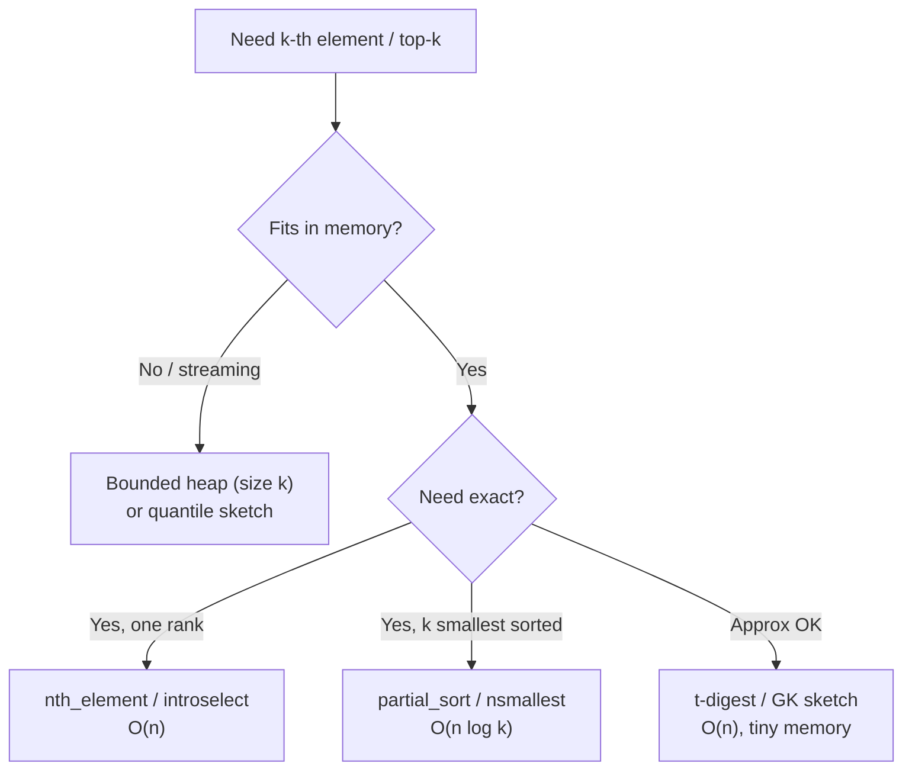

# Quickselect and the k-th Order Statistic — Senior Level

## Table of Contents

1. [Introduction](#introduction)
2. [Production Selection: Introselect and nth_element](#production-selection-introselect-and-nth_element)
3. [Standard-Library Selection Across Languages](#standard-library-selection-across-languages)
4. [Streaming and Distributed Top-k](#streaming-and-distributed-top-k)
5. [Approximate Selection: Quantile Sketches](#approximate-selection-quantile-sketches)
6. [Parallel Selection](#parallel-selection)
7. [Adversarial Input and Hardening](#adversarial-input-and-hardening)
8. [Introselect: A Production Implementation](#introselect-a-production-implementation)
9. [Floyd–Rivest: Faster Selection by Sampling](#floydrivest-faster-selection-by-sampling)
10. [Caching and Repeated Selection](#caching-and-repeated-selection)
11. [Code Examples](#code-examples)
12. [Real-World Use Cases](#real-world-use-cases)
13. [Implementation Comparison: nth_element Internals](#implementation-comparison-nth_element-internals)
14. [Observability](#observability)
15. [Selection in SQL and Data Systems](#selection-in-sql-and-data-systems)
16. [Failure Modes](#failure-modes)
17. [Summary](#summary)

---

## Introduction

> Focus: "How do I architect systems around selection at scale?"

A senior engineer rarely hand-writes Quickselect. Instead you make architectural decisions:

1. **In-memory, exact, one rank?** Reach for `nth_element` (introselect) — O(n) with a worst-case guarantee.
2. **Streaming or larger-than-memory?** Quickselect is impossible (it needs random access to all data). Use a bounded heap (exact top-k) or a **quantile sketch** (approximate percentiles).
3. **Sharded across machines?** Selection becomes a distributed reduction; exact medians are expensive, so you negotiate accuracy with sketches.

The recurring theme: Quickselect is the gold standard for **bounded, in-memory, exact** selection, and everything else is what you build when one of those three assumptions breaks.

---

## Production Selection: Introselect and nth_element

Plain randomized Quickselect has an O(n²) tail. Production code cannot tolerate "usually fast." **Introselect** (David Musser, 1997) makes the guarantee hard:

```text
introselect(A, k):
  depth_limit = 2 * floor(log2(n))
  run Quickselect with a fast pivot (median-of-three / random)
  each time we recurse, decrement depth_limit
  if depth_limit hits 0:
      switch to median-of-medians (BFPRT) for a guaranteed O(n) finish
```

The fast path handles the overwhelming majority of inputs at Quickselect speed. The depth counter detects pathological pivot sequences (bad luck or an attacker) and trips the **median-of-medians** fallback, which guarantees O(n) regardless. You get average-case speed **and** worst-case linearity.

This is precisely the contract of C++'s `std::nth_element`:

> After `nth_element(first, nth, last)`, the element at `nth` is the one that would be there if the whole range were sorted, every element before it is `<=` it, and every element after is `>=` it. Average complexity is linear; the standard mandates the implementation avoid quadratic blowup (libstdc++ and libc++ use introselect).

### When BFPRT alone is the right call

- Hard real-time systems with a strict per-call deadline where even rare O(n²) is unacceptable and you cannot rely on randomness.
- Security-sensitive paths where an attacker controls the input and you do not want to depend on a secret RNG seed.

Otherwise introselect's hybrid is strictly better: same guarantee, far better constants in the common case.

---

## Standard-Library Selection Across Languages

| Language | Selection API | Algorithm | Notes |
|----------|---------------|-----------|-------|
| C++ | `std::nth_element` | **Introselect** | The canonical in-place O(n) selection |
| C++ | `std::partial_sort` | Heap-based | k smallest, sorted; O(n log k) |
| Python | `heapq.nsmallest(k, it)` / `nlargest` | Bounded heap | O(n log k); works on any iterable / stream |
| Python | `statistics.median` | Sorts | O(n log n) — convenience, not optimal |
| Python | `numpy.partition` / `np.median` | Introselect (C) | Vectorized, O(n) |
| Go | `slices.Sort` + index | Pdqsort then index | No stdlib `nth_element`; O(n log n) |
| Java | `PriorityQueue` (size k) | Bounded heap | O(n log k); no stdlib selection |
| Rust | `slice::select_nth_unstable` | Introselect | In-place, O(n) average, guaranteed worst case |

Two practical lessons:

- **C++, Rust, NumPy give you true O(n) selection.** Use it.
- **Go and Java lack a stdlib `nth_element`.** For a single rank you either pull in a small Quickselect helper or, if `k` is small, use a bounded heap. Sorting-then-indexing is the lazy O(n log n) fallback and is fine when n is modest.



---

## Streaming and Distributed Top-k

Quickselect's hidden requirement is **random access to the entire dataset**. The moment data arrives as an unbounded stream, or spreads across shards, Quickselect is off the table.

### Streaming exact top-k: bounded heap

To track the `k` largest of a stream, keep a **min-heap of size k**:

- New element `x`: if heap has < k items, push. Otherwise if `x > heap.peek()`, pop the min and push `x`.
- Memory: O(k). Time: O(n log k). One pass, no need to retain the stream.

This is the single most common production "top-k" and the reason `heapq.nlargest` exists.

### Distributed selection: the median-of-medians reduction (system version)

To find a global median across M shards without shipping all data to one node:

1. Each shard locally computes summary statistics (e.g. its local quantiles, or a sketch).
2. A coordinator merges the summaries.
3. For an **exact** distributed median you typically iterate: broadcast a candidate value, each shard reports how many of its elements are below it (one O(n_shard) pass), sum the counts, and binary-search the candidate over a few rounds. Each round is cheap and parallel; a handful of rounds pins the exact rank.

Exactness is expensive at scale (multiple passes / rounds). That is why most large systems accept **approximate** percentiles.

---

## Approximate Selection: Quantile Sketches

For "what is the p99 latency over the last billion requests?", exact selection is wasteful. **Mergeable quantile sketches** give bounded-error answers in tiny, fixed memory and combine cleanly across shards:

| Sketch | Error guarantee | Memory | Mergeable | Typical use |
|--------|-----------------|--------|-----------|-------------|
| **t-digest** | Relative, best at tails (p99, p999) | ~KB | Yes | Latency percentiles (Elasticsearch, Druid) |
| **Greenwald-Khanna (GK)** | ε-approximate rank | O((1/ε) log(εn)) | Awkward | Classic streaming quantiles |
| **KLL / DDSketch** | ε-approximate, strong bounds | O(1/ε) | Yes | Modern metrics pipelines |
| **HdrHistogram** | Bucketed, configurable | Fixed | Yes | Low-latency latency recording |

These trade exactness for **single-pass, constant memory, trivially mergeable** behavior — the properties Quickselect cannot offer. The senior judgment call: do you need the *exact* k-th element, or a percentile "good to ±0.1%"? Monitoring and SLO dashboards almost always want the latter.

---

## Parallel Selection

Selection is harder to parallelize than sorting because the algorithm is inherently sequential at the top: you must finish one partition before you know which side to keep.

### Parallel partition

The partition step itself can be parallelized: split the array into chunks, count how many elements in each chunk are below the pivot (parallel prefix-sum), then scatter elements to their destination regions in parallel. This gives:

```text
Work:  O(n)
Span:  O(log² n)   (the prefix sums dominate the depth)
```

In practice, speedup is modest. The keep-one-side recursion means later levels operate on shrinking arrays where parallel overhead outweighs the benefit. A common pattern: parallel-partition the first one or two levels (while the array is huge), then fall back to sequential Quickselect once a subproblem fits comfortably in a single core's cache.

### Practical alternative for distributed top-k

For top-k across a cluster, the simplest scalable design is **local top-k then merge**: each shard computes its own top-k with a heap (O(n_shard log k)), ships only k items to the coordinator, which merges M·k candidates and selects the global top-k. Network cost is O(M·k), independent of total data size — this is the workhorse for "top trending" features.

---

## Adversarial Input and Hardening

A deterministic pivot is a liability. If your selection path is reachable by untrusted input (search ranking, "find median of user-submitted scores"), an attacker can craft input that forces O(n²) and exhausts CPU — an **algorithmic complexity DoS**.

Defenses, in order of preference:

1. **Randomized pivot from a seeded, non-guessable RNG.** Expected O(n) on every input; the attacker cannot predict pivots.
2. **Introselect.** Even if randomness fails or the attacker gets lucky, the depth-limited BFPRT fallback caps the cost at O(n).
3. **Input size limits and timeouts.** Bound n on untrusted paths; wrap the call in a deadline.
4. **Pre-shuffle.** A one-time random shuffle before selection destroys adversarial structure (though it adds O(n) and a memory write pass).

> The same class of attack hit hash tables (HashDoS) and regex engines (ReDoS). Treat any user-controllable algorithm with a known bad case as an availability risk.

---

## Introselect: A Production Implementation

Here is the hybrid spelled out — randomized Quickselect with a depth counter that trips the median-of-medians fallback. This is the shape of every real `nth_element`.

#### Python

```python
import random

def introselect(a, k):
    """k-th smallest (0-based), worst-case O(n) via BFPRT fallback."""
    depth_limit = 2 * max(1, (len(a)).bit_length() - 1)  # ~2*log2(n)
    return _intro(a, 0, len(a) - 1, k, depth_limit)

def _intro(a, lo, hi, k, depth):
    while lo < hi:
        if depth == 0:
            return _bfprt_select(a, lo, hi, k)   # guaranteed-linear fallback
        depth -= 1
        # fast path: random pivot Lomuto partition
        idx = random.randint(lo, hi)
        a[idx], a[hi] = a[hi], a[idx]
        pivot, i = a[hi], lo - 1
        for j in range(lo, hi):
            if a[j] < pivot:
                i += 1
                a[i], a[j] = a[j], a[i]
        a[i + 1], a[hi] = a[hi], a[i + 1]
        p = i + 1
        if p == k:
            return a[p]
        elif k < p:
            hi = p - 1
        else:
            lo = p + 1
    return a[lo]

def _bfprt_select(a, lo, hi, k):
    # deterministic median-of-medians selection on a[lo..hi]
    def select(lo, hi, k):
        while True:
            if lo == hi:
                return a[lo]
            pivot = _mom_pivot(lo, hi)
            p = _partition_value(lo, hi, pivot)
            if k == p:
                return a[p]
            elif k < p:
                hi = p - 1
            else:
                lo = p + 1
    def _mom_pivot(lo, hi):
        n = hi - lo + 1
        if n <= 5:
            grp = sorted(a[lo:hi + 1])
            return grp[n // 2]
        medians = []
        i = lo
        while i <= hi:
            j = min(i + 4, hi)
            grp = sorted(a[i:j + 1])
            medians.append(grp[len(grp) // 2])
            i += 5
        return medians[len(medians) // 2]  # approximate; fine for the bound
    def _partition_value(lo, hi, v):
        # move first occurrence of value v to end, then Lomuto
        for t in range(lo, hi + 1):
            if a[t] == v:
                a[t], a[hi] = a[hi], a[t]
                break
        pivot, i = a[hi], lo - 1
        for j in range(lo, hi):
            if a[j] < pivot:
                i += 1
                a[i], a[j] = a[j], a[i]
        a[i + 1], a[hi] = a[hi], a[i + 1]
        return i + 1
    return select(lo, hi, k)

if __name__ == "__main__":
    print(introselect([7, 2, 1, 6, 8, 5, 3], 3))  # 6
```

The depth limit `2·log2(n)` is the same constant C++ introsort uses. On random input the fallback essentially never fires; on a crafted adversarial sequence it kicks in and caps the cost at the BFPRT-guaranteed O(n).

---

## Floyd–Rivest: Faster Selection by Sampling

For very large arrays where comparison count matters, **Floyd–Rivest (1975)** beats both plain Quickselect and BFPRT in practice. The idea: take a small random **sample** of the array, recursively select two values from the sample that, with high probability, **bracket** the target rank `k` very tightly. Partition the full array against those two pivots; the target almost always falls in the thin middle band, so the recursive call operates on a tiny subarray.

```text
FLOYD-RIVEST(A, k):
  if n small: just sort.
  sample s ~ n^(2/3) elements at random.
  choose two pivots from the sample bracketing rank k with a safety margin ~ sqrt(s).
  3-way partition A against the two pivots.
  recurse into the (small) middle band.
Expected comparisons: 1.5n + n^(1/2 + o(1))  -- near the proven lower bound.
```

Floyd–Rivest is what NumPy's `partition` and several scientific libraries use under the hood for large arrays. The trade-off is implementation complexity and worse behavior on tiny inputs, so it is reserved for big-data selection.

---

## Caching and Repeated Selection

If you select repeatedly from the *same* dataset (e.g. "give me the median, then p90, then p99"), naive Quickselect redoes O(n) work each time. Options:

| Pattern | Approach | Cost |
|---------|----------|------|
| One rank, once | Quickselect / `nth_element` | O(n) |
| Several ranks, same data | Sort once, index many times | O(n log n) + O(1) each |
| Many percentiles, streaming | Quantile sketch (t-digest) | O(n) build, O(1) query |
| Order statistics with updates | Order-statistic tree (augmented BST) | O(log n) per query/update |

The key senior insight: **if you will ask for many ranks, the one-time O(n log n) sort amortizes to cheaper than repeated O(n) selections.** Selection wins only when you need *few* ranks relative to dataset size. For dynamic data (inserts/deletes plus rank queries), an **order-statistic tree** (a BST where each node stores its subtree size) gives O(log n) `select(k)` and `rank(x)` — neither sorting nor Quickselect handles updates well.

---

## Code Examples

### Thread-Safe Selection Service (cache the result, recompute on change)

#### Go

```go
package main

import (
	"fmt"
	"math/rand"
	"sync"
)

// SelectionService caches selection over a dataset behind an RWMutex.
type SelectionService struct {
	mu   sync.RWMutex
	data []int
}

func (s *SelectionService) Set(data []int) {
	s.mu.Lock()
	defer s.mu.Unlock()
	s.data = append([]int(nil), data...) // own a copy
}

// KthSmallest selects on a private copy so reads never mutate shared state.
func (s *SelectionService) KthSmallest(k int) (int, bool) {
	s.mu.RLock()
	if k < 0 || k >= len(s.data) {
		s.mu.RUnlock()
		return 0, false
	}
	local := append([]int(nil), s.data...) // copy under read lock
	s.mu.RUnlock()
	return quickselect(local, k), true // mutate the copy outside the lock
}

func quickselect(a []int, k int) int {
	lo, hi := 0, len(a)-1
	for lo < hi {
		p := partition(a, lo, hi)
		if p == k {
			return a[p]
		} else if k < p {
			hi = p - 1
		} else {
			lo = p + 1
		}
	}
	return a[lo]
}

func partition(a []int, lo, hi int) int {
	idx := lo + rand.Intn(hi-lo+1)
	a[idx], a[hi] = a[hi], a[idx]
	pivot, i := a[hi], lo-1
	for j := lo; j < hi; j++ {
		if a[j] < pivot {
			i++
			a[i], a[j] = a[j], a[i]
		}
	}
	a[i+1], a[hi] = a[hi], a[i+1]
	return i + 1
}

func main() {
	s := &SelectionService{}
	s.Set([]int{7, 2, 1, 6, 8, 5, 3})
	v, _ := s.KthSmallest(3)
	fmt.Println(v) // 6 (4th smallest, 0-based k=3)
}
```

#### Java

```java
import java.util.*;

// Streaming top-k with a bounded min-heap: exact, O(n log k), O(k) memory.
public class StreamingTopK {
    private final int k;
    private final PriorityQueue<Integer> heap; // min-heap of the k largest seen

    public StreamingTopK(int k) {
        this.k = k;
        this.heap = new PriorityQueue<>(); // natural order = min on top
    }

    public void offer(int x) {
        if (heap.size() < k) {
            heap.offer(x);
        } else if (x > heap.peek()) {
            heap.poll();
            heap.offer(x);
        }
    }

    public List<Integer> topK() {
        List<Integer> out = new ArrayList<>(heap);
        out.sort(Collections.reverseOrder());
        return out;
    }

    public static void main(String[] args) {
        StreamingTopK t = new StreamingTopK(3);
        for (int x : new int[]{7, 2, 1, 6, 8, 5, 3}) t.offer(x);
        System.out.println(t.topK()); // [8, 7, 6]
    }
}
```

#### Python

```python
import heapq

def streaming_top_k(stream, k):
    """Exact top-k of an unbounded stream. O(n log k), O(k) memory."""
    heap = []  # min-heap of the k largest seen so far
    for x in stream:
        if len(heap) < k:
            heapq.heappush(heap, x)
        elif x > heap[0]:
            heapq.heapreplace(heap, x)  # pop min, push x in one step
    return sorted(heap, reverse=True)

if __name__ == "__main__":
    print(streaming_top_k([7, 2, 1, 6, 8, 5, 3], 3))  # [8, 7, 6]
```

---

## Real-World Use Cases

Where selection actually shows up in production systems:

| Domain | Selection used for | Why not sort? |
|--------|-------------------|---------------|
| Latency monitoring | p50/p90/p99 of request times | Sorting millions of samples per window is wasteful; sketches/selection are O(n) |
| Search / recommendations | Top-k results by score | Only the top k matter; full ranking of millions is overkill |
| Databases | `ORDER BY ... LIMIT k`, percentile aggregates | Query planners use partial sort / top-k heaps, not full sorts |
| Image processing | Median filter (denoising) | Per-pixel median over a window — selection per window |
| Statistics / ML | Median, trimmed mean, quantile features | Robust statistics need order statistics, not the full sort |
| Finance | Value-at-Risk (a percentile of loss distribution) | One percentile from a large simulation |
| Load shedding | Drop the slowest k% of in-flight requests | Threshold = a quantile of current latencies |

The pattern is always the same: a large dataset, a need for **one rank or a small top-k**, and no need for the full ordering. That is precisely Quickselect's niche — and where it does not fit (streaming, distributed, repeated queries) you substitute heaps, sketches, or order-statistic trees as covered above.

### Median Filter: a concrete example

A 3×3 median filter denoises an image by replacing each pixel with the median of its 9 neighbors. With millions of pixels, you call selection (median of 9) millions of times. For such tiny fixed windows, an unrolled **sorting network** beats general Quickselect (no recursion overhead, branch-predictable), illustrating a senior nuance: *the best selection method depends on the size of the selection problem.* Big n → Quickselect/introselect; tiny fixed n → sorting network; streaming → heap; distributed → sketch.

---

## Implementation Comparison: nth_element Internals

It is worth knowing what the standard libraries actually do, because their guarantees differ:

| Library | Routine | Internal algorithm | Worst case |
|---------|---------|--------------------|-----------|
| libstdc++ (GCC) | `std::nth_element` | Introselect (median-of-3 + heapselect fallback after depth limit) | O(n) |
| libc++ (Clang) | `std::nth_element` | Median-of-3 Quickselect with a guarded loop | O(n) average; hardened |
| Rust std | `select_nth_unstable` | Introselect (pdqselect-style) | O(n) |
| NumPy | `np.partition(kind='introselect')` | Introselect; large arrays may use sampling | O(n) |
| Go (no stdlib) | hand-rolled / `slices.Sort` | Pdqsort then index, or custom Quickselect | O(n log n) sort path |

The lesson for a senior reviewer: **"linear average" is not the same as "linear worst case."** If a code path is reachable by untrusted input, confirm the implementation has a worst-case guarantee (introselect) or add randomization yourself. Do not assume `nth_element` is attack-proof in every standard library version.

---

## Observability

| Metric | Why it matters | Alert threshold |
|--------|---------------|-----------------|
| `select_latency_p99` | Detects O(n²) excursions / adversarial input | > 5× the p50 |
| `select_recursion_depth_max` | Trip wire for introselect fallback | > 2·log2(n) |
| `select_input_size` | Validate untrusted callers stay within limits | above configured cap |
| `topk_heap_evictions` | Stream churn; tuning `k` | sustained high churn |
| `quantile_sketch_error` | Confidence in approximate percentiles | error > target ε |

Log the **pivot strategy** and whether the **BFPRT fallback** fired — a sudden spike in fallbacks is a strong signal of an algorithmic-complexity attack.

---

## Selection in SQL and Data Systems

Query engines face the selection problem constantly and solve it with the same toolbox:

```sql
-- Top-k: planners use a bounded heap ("TopN"), not a full sort.
SELECT * FROM events ORDER BY score DESC LIMIT 10;

-- Exact percentile: must materialize/sort the group (expensive at scale).
SELECT percentile_cont(0.99) WITHIN GROUP (ORDER BY latency) FROM requests;

-- Approximate percentile: single-pass sketch, cheap and parallel.
SELECT approx_percentile(latency, 0.99) FROM requests;   -- t-digest / KLL under the hood
```

Three patterns map directly to this topic:

- **`ORDER BY ... LIMIT k`** → a **TopN operator** (size-k heap), O(n log k), not a full sort. Postgres, Spark, Presto all special-case this.
- **`percentile_cont` (exact)** → effectively a sort or selection over the group; expensive on large groups.
- **`approx_percentile`** → a **mergeable quantile sketch**; the engine's distributed answer to "you cannot Quickselect across shards cheaply."

When you see a slow `ORDER BY ... LIMIT` plan that does a full sort, the fix is often to ensure the planner picks the TopN/heap path (or an index). When an exact percentile dominates a dashboard query, switching to `approx_percentile` trades a tiny error for an order-of-magnitude speedup — the same exact-vs-approximate selection trade-off discussed above, surfaced at the SQL layer.

---

## Failure Modes

- **O(n²) blowup:** naive/deterministic pivot on adversarial input → use random pivot + introselect; add input caps and timeouts.
- **Stack overflow:** deep recursion on bad pivots → iterate the kept side instead of recursing.
- **Unexpected mutation:** Quickselect reorders the caller's array → operate on a copy in shared/concurrent contexts.
- **Wrong rank under concurrency:** dataset changes mid-selection → snapshot (copy) before selecting.
- **OOM on "selection" over a stream:** someone buffered the whole stream to call Quickselect → switch to a bounded heap or sketch.
- **Approximate answer treated as exact:** a t-digest p50 is not the true median → document error bounds where consumers read percentiles.

---

## Summary

At the senior level, selection is an **architecture decision tree**, not an algorithm:

1. **In-memory, exact, one rank →** `nth_element` / `select_nth_unstable` — **introselect**, O(n) with a worst-case guarantee. This is the default and the best choice when its assumptions hold.
2. **k smallest, sorted →** partial sort / bounded heap, O(n log k).
3. **Streaming / larger than memory →** bounded heap (exact, O(k) memory) — Quickselect cannot run here at all.
4. **Percentiles at scale →** mergeable **quantile sketches** (t-digest, KLL); accept bounded error for single-pass, constant-memory, trivially distributable answers.
5. **Untrusted input →** randomized pivot + introselect + size limits to defeat algorithmic-complexity attacks.
6. **Parallel/distributed →** parallel partition (O(log² n) span, modest gains) or local-top-k-then-merge for clusters.

The senior skill is knowing **when Quickselect's three assumptions — bounded, in-memory, exact — hold**, and which tool to substitute when each one breaks.

---

Next step: continue to [professional.md](./professional.md) for the expected-O(n) proof via the geometric series, the median-of-medians worst-case O(n) proof with its T(n)=T(n/5)+T(7n/10)+O(n) recurrence, and selection lower bounds.
