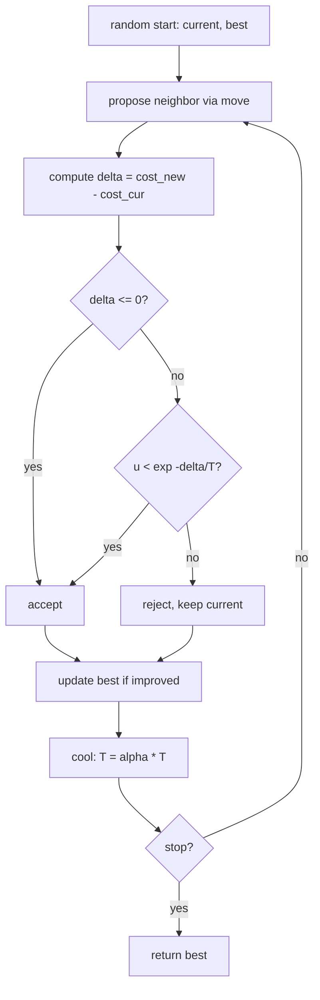

# Simulated Annealing — Junior Level

> **One-line summary:** Simulated annealing is a randomized search for the *best* solution to a hard optimization problem. You keep a "current" solution, repeatedly jump to a random neighbor, and **always accept a better neighbor** but **only sometimes accept a worse one** — with probability `exp(-Δ/T)`. A "temperature" `T` starts high (so you accept many bad moves and roam freely, escaping local traps) and slowly cools (so late on you only go downhill, settling into a good valley).

---

## Table of Contents

1. [Introduction](#introduction)
2. [Prerequisites](#prerequisites)
3. [Glossary](#glossary)
4. [Core Concepts](#core-concepts)
5. [Big-O Summary](#big-o-summary)
6. [Real-World Analogies](#real-world-analogies)
7. [Pros & Cons](#pros--cons)
8. [Step-by-Step Walkthrough](#step-by-step-walkthrough)
9. [Code Examples](#code-examples)
10. [Coding Patterns](#coding-patterns)
11. [Error Handling](#error-handling)
12. [Performance Tips](#performance-tips)
13. [Best Practices](#best-practices)
14. [Edge Cases & Pitfalls](#edge-cases--pitfalls)
15. [Common Mistakes](#common-mistakes)
16. [Cheat Sheet](#cheat-sheet)
17. [Visual Animation](#visual-animation)
18. [Summary](#summary)
19. [Further Reading](#further-reading)

---

## Introduction

Imagine you want to find the *lowest point* of a bumpy landscape — a function `f(x)` you want to **minimize** — but the landscape has many dips. The obvious method is **hill climbing** (here, "valley descending"): stand somewhere, look at your immediate neighbors, and always step to a lower one. Repeat until no neighbor is lower. This is simple and fast, but it has a fatal flaw: it gets **stuck in the first valley it finds**. If that valley is shallow and a much deeper one sits nearby (over a small ridge), plain hill climbing never finds it — it refuses to ever step *up*, so it cannot cross the ridge.

**Simulated annealing (SA)** fixes this with one beautifully simple idea: *sometimes accept a worse move on purpose*. Early in the search, when the "temperature" `T` is high, SA accepts almost any move — even ones that make things worse — so it wanders widely and can climb out of shallow valleys and over ridges. As `T` cools toward zero, SA becomes pickier: worse moves are accepted less and less, until eventually it behaves like plain hill climbing, settling into whatever good valley it has found. The genius is in *when* it is reckless (early, to explore) versus *when* it is careful (late, to converge).

The decision rule is the **Metropolis criterion**. Suppose the current solution has cost (energy) `E`, and a random neighbor has cost `E_new`. Let `Δ = E_new − E`.

- If `Δ ≤ 0` (the neighbor is **better or equal**), **always accept** it.
- If `Δ > 0` (the neighbor is **worse**), accept it **with probability** `exp(-Δ / T)`.

Read that probability carefully: a *small* worsening (`Δ` tiny) is accepted often; a *large* worsening is accepted rarely. And when `T` is large, even big worsenings are accepted fairly often (`exp(-Δ/T)` is close to 1); when `T` is tiny, almost no worsening is accepted (`exp(-Δ/T)` is close to 0). That single formula, plus a **cooling schedule** that lowers `T` over time, is the whole heart of the algorithm.

The name comes from **metallurgy**. To make a strong metal, smiths heat it until atoms move freely, then cool it *slowly* so the atoms settle into a low-energy, well-ordered crystal. Cool it too fast (quenching) and the atoms freeze in a messy, brittle, high-energy state. Simulated annealing is the same dance, applied to numbers: heat (explore), then cool slowly (settle) to reach a low-energy (low-cost) configuration. This file builds the whole picture around a tiny example — minimizing a 1-D function — so you can see every acceptance and rejection.

---

## Prerequisites

Before reading this file you should be comfortable with:

- **Basic programming** — loops, functions, arrays, and generating random numbers (`rand` in Go, `Random`/`Math.random` in Java, `random` in Python).
- **The idea of a "cost" or "objective" function** — a function `f` you want to make as small (or as large) as possible.
- **Exponentials** — what `exp(x) = e^x` looks like: it shrinks fast as `x` becomes more negative.
- **Random sampling** — drawing a uniform random number in `[0, 1)` and comparing it to a probability.
- **Big-O notation** — `O(iterations)` and what "per-iteration cost" means.

Optional but helpful:

- A glance at **hill climbing** / greedy local search (SA is its smarter cousin).
- The notion of a **local minimum** versus a **global minimum**.

---

## Glossary

| Term | Meaning |
|------|---------|
| **Objective / cost / energy** | The number `E = f(s)` we want to minimize (or `-f` if maximizing). "Energy" is the physics word; "cost" is the engineering word. |
| **Solution / state `s`** | One candidate answer (a point `x`, a route, a schedule, a layout). |
| **Neighbor** | A solution reachable from `s` by one small random change (a "move"). |
| **Move** | The change that turns `s` into a neighbor (e.g. nudge `x`, swap two cities). |
| **Δ (delta)** | `E_new − E`: how much worse (`Δ > 0`) or better (`Δ ≤ 0`) the neighbor is. |
| **Temperature `T`** | A control parameter, high → wild exploration, low → careful descent. |
| **Cooling schedule** | The rule for lowering `T` over time (e.g. `T ← α·T`). |
| **Metropolis criterion** | Accept rule, always if better, else with probability `exp(-Δ/T)`. |
| **Acceptance probability** | `exp(-Δ/T)` for a worse move (clamped to ≤ 1). |
| **Local minimum** | A solution better than all its neighbors but not the best overall. |
| **Global minimum** | The truly best solution anywhere in the search space. |
| **Best-so-far** | The lowest-cost solution seen during the whole run (saved separately). |
| **Restart** | Starting over from a fresh random solution to escape a bad region. |

---

## Core Concepts

### 1. The cost landscape

Picture every possible solution laid out on the ground, with height equal to its cost. Optimization = finding the lowest point. A **convex** landscape is a single smooth bowl (easy — hill climbing wins). Real problems are **rugged**: many valleys (local minima) of different depths, separated by ridges. SA is built for rugged landscapes where greedy methods get trapped.

### 2. Neighbors and moves

SA never looks at the whole landscape at once; it only ever looks at the **neighbors** of the current solution. A *move* makes a small random change. For minimizing `f(x)`: a move might be `x ← x + small random step`. For routes: swap two stops. Good move design keeps neighbors *close* (small `Δ`) so the search changes gradually — this is half the art of SA.

### 3. Always accept better, sometimes accept worse

When the neighbor is **better** (`Δ ≤ 0`), move there — no question. When it is **worse** (`Δ > 0`), do *not* automatically reject it; flip a biased coin: accept with probability `p = exp(-Δ/T)`. Concretely, draw a uniform random `u ∈ [0, 1)` and accept iff `u < p`. Accepting worse moves is exactly what lets SA climb out of shallow valleys.

### 4. The temperature controls recklessness

The same `Δ` is accepted very differently depending on `T`:

```
p = exp(-Δ / T)

T very large  →  -Δ/T ≈ 0   →  p ≈ 1   (accept almost anything: explore)
T moderate    →  p is a real probability in (0,1)
T → 0+        →  -Δ/T → -∞  →  p → 0   (reject all worsenings: hill climb)
```

So high `T` = "hot, jittery, exploratory"; low `T` = "cold, settled, greedy."

### 5. The cooling schedule

`T` must *decrease* over the run. The simplest, most common schedule is **geometric** (a.k.a. exponential): `T ← α·T` each step, with `α` like `0.95`–`0.999`. Start at some `T0` high enough that early moves are usually accepted, end at a tiny `T` (near 0). Cool too fast and you "quench" — freeze into a bad local minimum. Cool too slowly and you waste time. (Other schedules — logarithmic, adaptive — are covered in [`middle.md`](./middle.md).)

### 6. Track the best-so-far separately

Here is a subtle but crucial point: because SA accepts worse moves, the *current* solution at the end of the run may **not** be the best one it ever visited. So always keep a separate variable `best` (and `best_cost`) and update it whenever the current solution beats it. The answer you return is `best`, not `current`.

### 7. The theoretical promise

There is a real theorem: **with a slow enough cooling schedule, SA converges to the global optimum with probability 1.** The catch is "slow enough" means *logarithmically* slow (`T ∝ 1/log(time)`), which is impractically slow. In practice we use fast geometric cooling and accept "very good, usually near-optimal" instead of "provably optimal." (Proof sketch in [`professional.md`](./professional.md).)

---

## Big-O Summary

Simulated annealing is a **metaheuristic** — a general strategy, not a single fixed algorithm — so its cost is best expressed per its own parameters rather than per input size `n`.

| Quantity | Cost | Notes |
|----------|------|-------|
| One iteration | **O(cost of one move + cost of evaluating Δ)** | Often `O(1)` with an *incremental* cost update; `O(n)` if you recompute the whole cost. |
| Whole run | **O(I · c)** | `I` = number of iterations, `c` = per-iteration cost. |
| Memory | **O(size of one solution)** | You hold `current` and `best`; no big tables. |
| Number of iterations `I` | tuned, not derived | Set by the cooling schedule and stopping criterion. |

The headline: SA's time is **whatever you budget it** (`I` iterations), and its quality improves with more iterations and slower cooling. The single most important efficiency trick is an **incremental Δ evaluation** — computing how much a move changed the cost in `O(1)` instead of recomputing the entire cost each step. That one optimization often turns an `O(I·n)` run into `O(I)`.

| Approach to a hard optimum | Time | Quality |
|----------------------------|------|---------|
| Brute force (try all) | `O(size of search space)` — often exponential | Exact, but infeasible |
| Hill climbing | `O(I)` | Fast, but trapped in local minima |
| **Simulated annealing** | `O(I·c)`, tunable | Escapes local minima, near-optimal |

---

## Real-World Analogies

| Concept | Analogy |
|---------|---------|
| Annealing in metal | Heat metal so atoms roam, then cool slowly so they settle into a strong, low-energy crystal. Cool too fast → brittle. SA copies this. |
| High temperature | A hyperactive hiker who happily walks uphill, downhill, anywhere — covering lots of ground. |
| Low temperature | A tired hiker who only takes steps that go downhill — careful and local. |
| Accepting a worse move | Climbing a small ridge on purpose, trusting that a deeper valley lies beyond. |
| Cooling schedule | The hiker gradually losing energy through the day: bold in the morning, cautious by evening. |
| Local minimum trap | A shallow dip you would never leave if you only ever walked downhill. |
| Best-so-far | Marking the lowest spot you have *ever* stood on, even if you later wander higher. |

Where the analogies break: a real hiker has memory and intent; SA's "decision" to climb is a pure dice roll weighted by `exp(-Δ/T)`. And unlike a hiker, SA may *forget* a great spot it visited unless you explicitly save `best`.

---

## Pros & Cons

| Pros | Cons |
|------|------|
| Escapes local minima — finds good solutions where greedy fails. | Not guaranteed optimal in practical (fast) cooling; results are stochastic. |
| Dead simple to implement: a loop, a move, one `exp` comparison. | Needs **tuning** (`T0`, cooling rate `α`, iteration count, move size). |
| Works on almost any problem — only needs a cost function and a neighbor move. | Different random seeds give different answers (reproducibility needs a fixed seed). |
| Tiny memory footprint (just `current` and `best`). | Can be slow to converge if cooled too slowly; can quench if too fast. |
| Anytime algorithm, stop whenever; you always have a `best` answer. | No factoring/structure exploited; specialized algorithms may beat it when they exist. |

**When to use:** large, rugged, hard-to-solve optimization problems where exact methods are too slow and you only have a cost function and a way to make small random changes — e.g. TSP, scheduling, layout/placement, or a tricky competitive-programming "minimize this" problem.

**When NOT to use:** when the landscape is convex/smooth (use calculus or hill climbing — they are faster and exact); when an exact polynomial algorithm exists (use it); when you need a *proven* optimal answer with a certificate.

---

## Step-by-Step Walkthrough

Let us minimize a 1-D function with two valleys:

```
f(x) = x^4 - 3*x^3 + 2      (over x in [-2, 4])
```

This has a shallow dip near `x ≈ 0` and a much **deeper** global minimum near `x ≈ 2.25`. Plain hill climbing started on the left often gets stuck in the shallow dip. Watch how SA escapes.

Setup: start at `x = 0.0` (a local-ish region), `T0 = 5.0`, cooling `T ← 0.9·T` each step, a move = `x ← x + uniform(-0.5, 0.5)`.

```
Start:  x = 0.00,  E = f(0.00) = 2.00,   best = 2.00,  T = 5.00

Step 1: neighbor x' = 0.40 → E' = f(0.40) = 1.83.  Δ = -0.17 (better) → ACCEPT.
        x = 0.40, E = 1.83.  best updated to 1.83.   T → 4.50
Step 2: neighbor x' = 0.10 → E' = f(0.10) = 1.997. Δ = +0.167 (worse).
        p = exp(-0.167/4.50) = exp(-0.037) = 0.964.  u = 0.31 < 0.964 → ACCEPT (uphill!)
        x = 0.10, E = 1.997.  best stays 1.83.        T → 4.05
Step 3: neighbor x' = -0.30 → E' = f(-0.30) ≈ 2.09. Δ = +0.09 (worse).
        p = exp(-0.09/4.05) = 0.978.  u = 0.50 → ACCEPT.   (still exploring widely)
        x = -0.30, E = 2.09.   best stays 1.83.       T → 3.65
...   (many steps later, T has cooled to ~0.4, the walk has drifted right past the ridge)
Step k: x = 2.00, E = f(2.00) = -6.00.  best updated to -6.00.   T = 0.40
Step k+1: neighbor x' = 2.30 → E' = f(2.30) ≈ -6.14. Δ = -0.14 (better) → ACCEPT.
        x = 2.30, E = -6.14.  best updated to -6.14.   T → 0.36
Step k+2: neighbor x' = 1.50 → E' = f(1.50) ≈ -3.06. Δ = +3.08 (much worse).
        p = exp(-3.08/0.36) = exp(-8.6) ≈ 0.00018.  u = 0.42 → REJECT (T is cold now).
        x stays 2.30.                                 T → 0.32
...   (T → 0; SA now only descends, fine-tuning toward x ≈ 2.25)
End:    best ≈ -6.25 at x ≈ 2.25  ← the GLOBAL minimum, not the shallow x≈0 dip.
```

The story: **early (hot)** SA cheerfully accepted uphill moves (Steps 2-3), letting it drift away from the shallow dip and across the ridge. **Late (cold)** it rejected the big uphill move (Step k+2) and fine-tuned in the deep valley. We returned `best`, the lowest cost ever seen. Pure hill climbing from `x=0` would have descended into the shallow `x≈0` dip and stopped — never reaching `x≈2.25`.

---

## Code Examples

### Example: Minimize a 1-D function with SA

We minimize `f(x) = x^4 - 3x^3 + 2` on `[-2, 4]` using geometric cooling. All three programs use a **fixed seed** so the run is reproducible.

#### Go

```go
package main

import (
	"fmt"
	"math"
	"math/rand"
)

func f(x float64) float64 {
	return x*x*x*x - 3*x*x*x + 2
}

func clamp(x, lo, hi float64) float64 {
	if x < lo {
		return lo
	}
	if x > hi {
		return hi
	}
	return x
}

func anneal(seed int64) (bestX, bestE float64) {
	rng := rand.New(rand.NewSource(seed))
	const lo, hi = -2.0, 4.0
	const T0, alpha = 5.0, 0.995
	const iterations = 4000

	x := lo + rng.Float64()*(hi-lo) // random start
	e := f(x)
	bestX, bestE = x, e
	T := T0

	for i := 0; i < iterations; i++ {
		// Neighbor: nudge x by a small random step.
		step := (rng.Float64()*2 - 1) * 0.5
		xn := clamp(x+step, lo, hi)
		en := f(xn)
		delta := en - e

		// Metropolis criterion.
		if delta <= 0 || rng.Float64() < math.Exp(-delta/T) {
			x, e = xn, en
		}
		// Track best-so-far separately!
		if e < bestE {
			bestX, bestE = x, e
		}
		T *= alpha // geometric cooling
	}
	return bestX, bestE
}

func main() {
	bx, be := anneal(42)
	fmt.Printf("best x = %.4f, f(x) = %.4f\n", bx, be) // near x=2.25, f≈-6.25
}
```

#### Java

```java
import java.util.Random;

public class SimulatedAnnealing {
    static double f(double x) {
        return x * x * x * x - 3 * x * x * x + 2;
    }

    static double clamp(double x, double lo, double hi) {
        return Math.max(lo, Math.min(hi, x));
    }

    static double[] anneal(long seed) {
        Random rng = new Random(seed);
        final double lo = -2.0, hi = 4.0;
        final double T0 = 5.0, alpha = 0.995;
        final int iterations = 4000;

        double x = lo + rng.nextDouble() * (hi - lo);
        double e = f(x);
        double bestX = x, bestE = e;
        double T = T0;

        for (int i = 0; i < iterations; i++) {
            double step = (rng.nextDouble() * 2 - 1) * 0.5;
            double xn = clamp(x + step, lo, hi);
            double en = f(xn);
            double delta = en - e;

            if (delta <= 0 || rng.nextDouble() < Math.exp(-delta / T)) {
                x = xn;
                e = en;
            }
            if (e < bestE) {
                bestX = x;
                bestE = e;
            }
            T *= alpha;
        }
        return new double[]{bestX, bestE};
    }

    public static void main(String[] args) {
        double[] r = anneal(42);
        System.out.printf("best x = %.4f, f(x) = %.4f%n", r[0], r[1]);
    }
}
```

#### Python

```python
import math
import random


def f(x):
    return x ** 4 - 3 * x ** 3 + 2


def clamp(x, lo, hi):
    return max(lo, min(hi, x))


def anneal(seed=42):
    rng = random.Random(seed)
    lo, hi = -2.0, 4.0
    T0, alpha = 5.0, 0.995
    iterations = 4000

    x = rng.uniform(lo, hi)          # random start
    e = f(x)
    best_x, best_e = x, e
    T = T0

    for _ in range(iterations):
        step = rng.uniform(-0.5, 0.5)         # neighbor move
        xn = clamp(x + step, lo, hi)
        en = f(xn)
        delta = en - e

        # Metropolis criterion: always accept better, sometimes accept worse.
        if delta <= 0 or rng.random() < math.exp(-delta / T):
            x, e = xn, en
        if e < best_e:                        # track best-so-far!
            best_x, best_e = x, e
        T *= alpha                            # geometric cooling

    return best_x, best_e


if __name__ == "__main__":
    bx, be = anneal(42)
    print(f"best x = {bx:.4f}, f(x) = {be:.4f}")  # near x=2.25, f≈-6.25
```

**What it does:** starts at a random `x`, repeatedly proposes a small move, accepts via the Metropolis rule, cools `T` geometrically, and returns the **best** point ever seen. The same seed gives the same answer in each language family.
**Run:** `go run main.go` | `javac SimulatedAnnealing.java && java SimulatedAnnealing` | `python sa.py`

---

## Coding Patterns

### Pattern 1: The Metropolis acceptance test

**Intent:** Decide whether to move to a neighbor in one clean expression. Always accept if `Δ ≤ 0`; else accept with probability `exp(-Δ/T)`.

```python
def accept(delta, T, rng):
    # delta = new_cost - current_cost
    if delta <= 0:
        return True
    return rng.random() < math.exp(-delta / T)
```

### Pattern 2: The "best-so-far" guard

**Intent:** Never lose the best solution, even though `current` may drift worse.

```python
if current_cost < best_cost:
    best, best_cost = current, current_cost   # snapshot it (copy if mutable!)
```

### Pattern 3: The annealing loop skeleton

**Intent:** The universal SA control flow you reuse for any problem; only `move()` and `cost()` change.



---

## Error Handling

| Error | Cause | Fix |
|-------|-------|-----|
| `exp` overflow / `math domain` | `T` reached exactly `0`, dividing by zero. | Stop the loop when `T` drops below a small floor (e.g. `1e-8`), never divide by 0. |
| Returns a *worse* answer than expected | Returned `current` instead of `best`. | Always return the saved `best`, never the final `current`. |
| `best` mutated unexpectedly | For list/array solutions, `best = current` aliased the same object. | Store a **copy** of the solution into `best`. |
| Always rejects worse moves | `T0` too low (cold start) → behaves like hill climbing. | Raise `T0` so early acceptance probability is high (~0.8). |
| Always accepts everything | `T` never cooled (forgot `T *= alpha`) → random walk, no convergence. | Cool `T` every iteration; verify it decreases. |
| Non-reproducible runs | Unseeded RNG. | Seed the RNG explicitly for repeatable results. |

---

## Performance Tips

- **Incremental cost (Δ) evaluation.** Compute how a move changes the cost in `O(1)` instead of recomputing the whole cost. This is the #1 SA speedup.
- **Cheap moves.** Make `move()` and the neighbor representation fast; SA does *millions* of iterations.
- **Avoid `exp` when `Δ ≤ 0`.** Short-circuit: accept better moves without calling `exp`.
- **Precompute constants.** Hoist anything constant (bounds, scaling) out of the loop.
- **Reuse buffers** for array solutions to avoid per-iteration allocation.
- **Tune iteration budget** to your time limit; SA is an *anytime* algorithm — more time, better answer.

---

## Best Practices

- **Always track and return `best`**, not the final current solution.
- **Seed the RNG** for reproducible debugging; only randomize the seed for production diversity.
- **Pick `T0` from data:** sample some random moves, look at typical `Δ`, set `T0` so early acceptance is ~80%.
- **Use a small `T` floor** as a stopping signal and to avoid division by zero.
- **Start simple:** geometric cooling `T ← α·T` with `α ∈ [0.95, 0.999]` is a fine default.
- **Validate against a baseline:** compare SA's answer to plain hill climbing and (on tiny inputs) brute force.
- **Log the cost over time** to see whether you are cooling too fast (quenching) or too slow (drifting).

---

## Edge Cases & Pitfalls

- **`T = 0`** — division by zero in `exp(-Δ/T)`; stop before `T` hits zero.
- **Flat regions (`Δ = 0`)** — treated as "better or equal," accepted; fine, but can cause aimless drift on plateaus.
- **Tiny search space** — SA is overkill; brute force or hill climbing is simpler and exact.
- **Maximization** — SA minimizes; to maximize `g`, minimize `-g` (flip the sign of the cost).
- **Mutable solutions** — copy into `best`, or you will overwrite it on the next move.
- **One run is luck** — a single SA run can land in a bad valley; do **multiple restarts** and keep the best.

---

## Common Mistakes

1. **Returning `current` instead of `best`** — the final state is often worse than the best visited.
2. **Forgetting to cool** — without `T *= alpha`, it is just a random walk that never settles.
3. **Cooling too fast (quenching)** — `α` too small or `T0` too low → freezes in a local minimum like hill climbing.
4. **Dividing by `T = 0`** — guard with a temperature floor.
5. **Aliasing `best`** — storing a reference to a mutable solution that later changes.
6. **No incremental Δ** — recomputing full cost each step makes SA needlessly slow.
7. **One run only** — not using restarts, so a single unlucky trajectory dooms the result.
8. **Acceptance backwards** — using `exp(-Δ/T)` for *better* moves or rejecting them.

---

## Cheat Sheet

| Question | Answer |
|----------|--------|
| When accept a better move? | Always (`Δ ≤ 0`). |
| When accept a worse move? | With probability `exp(-Δ/T)`. |
| What is `Δ`? | `new_cost − current_cost`. |
| High `T` does what? | Accepts many worse moves → explore. |
| Low `T` does what? | Rejects worse moves → hill climb / converge. |
| Common cooling? | Geometric: `T ← α·T`, `α ∈ [0.95, 0.999]`. |
| What to return? | The saved `best`, not `current`. |
| Maximize instead? | Minimize `-objective`. |
| Escape one bad run? | Restarts; keep best over runs. |

Core algorithm:

```
anneal(start, T0, alpha, iterations):
    current = start;  best = start
    T = T0
    repeat iterations times (or until T < floor):
        neighbor = move(current)
        delta = cost(neighbor) - cost(current)
        if delta <= 0 or random() < exp(-delta / T):
            current = neighbor
        if cost(current) < cost(best):
            best = copy(current)
        T = alpha * T
    return best
# cost: O(iterations * per-move cost)
```

---

## Visual Animation

> See [`animation.html`](./animation.html) for an interactive visualization.
>
> The animation demonstrates:
> - A bumpy 1-D cost landscape with a "current" point hopping around.
> - A **temperature bar** cooling over time.
> - **Accept (green)** vs **reject (red)** of worse moves, with the `exp(-Δ/T)` probability shown.
> - A **best-so-far** marker that only moves down.
> - Controls (Start / Step / Reset, speed, `T0`, cooling rate) and a Big-O panel + log.

---

## Summary

Simulated annealing is a randomized search for the minimum of a rugged cost landscape. Its single idea: **always accept better moves, and accept worse ones with probability `exp(-Δ/T)`**, where the **temperature `T` starts high (explore freely, escape local minima) and cools slowly (settle into a deep valley)**. It is inspired by metallurgical annealing — heat then cool slowly for a low-energy state. The pieces you must get right: a small-step **neighbor move**, the **Metropolis acceptance** test, a **cooling schedule** (geometric `T ← α·T` is the default), and — most importantly — **tracking and returning `best`**, since the current solution drifts. With a slow-enough schedule SA provably reaches the global optimum, but in practice we trade that guarantee for speed and accept excellent, near-optimal answers. It shines where greedy hill climbing gets trapped and exact methods are too slow.

---

## Further Reading

- Kirkpatrick, Gelatt & Vecchi (1983), *"Optimization by Simulated Annealing"*, Science — the founding paper.
- *Introduction to Algorithms* (CLRS) and Russell & Norvig, *AIMA* — local search and SA chapters.
- Metropolis et al. (1953) — the acceptance rule's origin in statistical physics.
- cp-algorithms.com and competitive-programming guides — SA for "minimize this" contest problems.
- Sibling topic [`05-randomized-quicksort`](../05-randomized-quicksort/) — another randomized algorithm in this section.
- Next-level files in this folder: [`middle.md`](./middle.md), [`senior.md`](./senior.md), [`professional.md`](./professional.md).

---

**Next step:** Continue to [`middle.md`](./middle.md) to learn *why* SA works, the cooling schedules (geometric / logarithmic / adaptive), neighbor design, how SA compares to hill climbing, and how to tune `T0`, `α`, and the iteration budget.
