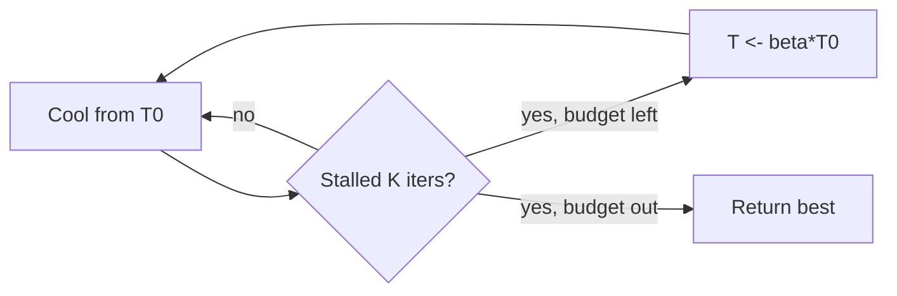

# Simulated Annealing — Middle Level

> **Focus:** *Why* accepting worse moves with probability `exp(-Δ/T)` works, the cooling schedules (geometric, logarithmic, adaptive) and what each buys you, how to design neighbor/move operators, how SA compares with hill climbing and random restart, and a practical recipe for **tuning** `T0`, the cooling rate, and the iteration budget.

---

## Table of Contents

1. [Introduction](#introduction)
2. [Deeper Concepts](#deeper-concepts)
3. [The Acceptance Probability, Dissected](#the-acceptance-probability-dissected)
4. [Cooling Schedules](#cooling-schedules)
5. [Neighbor / Move Design](#neighbor--move-design)
6. [Comparison with Alternatives](#comparison-with-alternatives)
7. [Parameter Tuning Recipe](#parameter-tuning-recipe)
8. [Code Examples](#code-examples)
9. [Error Handling](#error-handling)
10. [Performance Analysis](#performance-analysis)
11. [Best Practices](#best-practices)
12. [Reheating and Restarts in Practice](#reheating-and-restarts-in-practice)
13. [Visual Animation](#visual-animation)
14. [Summary](#summary)

---

## Introduction

At junior level the message was the recipe: accept better moves always, worse moves with probability `exp(-Δ/T)`, cool `T`, return `best`. At middle level you start asking the questions that separate "I copied an SA loop" from "I can make SA actually solve my problem well":

- *Why* is `exp(-Δ/T)` the right acceptance rule, and not some other curve?
- Which **cooling schedule** should I use — geometric, logarithmic, linear, adaptive — and what does each trade off?
- How do I design a **move operator** so neighbors are "close" and the landscape is searchable?
- When is SA actually better than **hill climbing with random restarts**, and when is it worse?
- How do I **tune** `T0`, the cooling rate, and the iteration count from the *data*, instead of guessing?

These decisions, not the loop itself, determine whether SA finds a great solution or wanders uselessly.

---

## Deeper Concepts

### Why accept worse moves at all?

A greedy local search (hill climbing) converges to a **local minimum** and stops. On a rugged landscape there can be exponentially many local minima, most of them mediocre. The *only* way a strictly-descending method reaches a better, far-away valley is to first go **uphill** over the ridge separating them. SA's whole reason for existing is that it sometimes pays the uphill cost. The probability `exp(-Δ/T)` is tuned so that:

- *small* uphill steps (cross a low ridge) are cheap and common;
- *large* uphill steps (cross a tall ridge) are rare;
- and the whole appetite for uphill moves **shrinks over time** as `T` falls.

### The connection to physics (intuition for the formula)

In statistical mechanics, a physical system at temperature `T` occupies a state with energy `E` with probability proportional to the **Boltzmann factor** `exp(-E / (k_B·T))`. Low-energy states are exponentially more likely, and the *bias* toward them strengthens as `T` falls. SA borrows this: treat "cost" as "energy," run the **Metropolis-Hastings** sampling process that has the Boltzmann distribution as its stationary distribution, and slowly lower `T` so the distribution concentrates on the lowest-energy (lowest-cost) states. The acceptance rule `min(1, exp(-Δ/T))` is exactly the Metropolis rule that makes Boltzmann the stationary distribution. (Full Markov-chain treatment in [`professional.md`](./professional.md).)

### Exploration vs exploitation, controlled by one knob

| Regime | `T` | Acceptance of worse moves | Behavior |
|--------|-----|---------------------------|----------|
| Hot | high | almost always | **Exploration** — random walk over the whole space |
| Warm | moderate | often, biased downhill | Balanced search |
| Cold | low | rarely | **Exploitation** — local hill climbing |
| Frozen | ~0 | never | Pure greedy descent, then stop |

SA's elegance is that a *single scalar* `T`, swept from hot to cold, smoothly morphs the algorithm from "global random search" into "local hill climbing." Other methods need separate mechanisms for exploration and exploitation; SA gets both from the temperature.

### The current solution is a *sample*, not the answer

Because acceptance is probabilistic, the current state wanders — even late in the run it occasionally drifts uphill. So the *current* state is a sample from a distribution, not a monotone improver. The answer is the **best** state ever sampled. Internalize this: SA is a *sampler that you bias toward low cost*, and you harvest the best sample.

---

## The Acceptance Probability, Dissected

The rule for a worse move (`Δ = E_new − E_cur > 0`) is:

```
p_accept = min(1, exp(-Δ / T))
```

Three things to notice:

1. **It depends on `Δ`, not on the absolute cost.** Only the *change* matters, which is what makes incremental evaluation possible and keeps the rule scale-aware.
2. **It depends on the ratio `Δ/T`.** The same `Δ` is "small" when `T` is large and "huge" when `T` is small. This is why `T0` must be chosen relative to typical `Δ` values in *your* problem.
3. **It is exponential, so it falls off fast.** Doubling `Δ` squares the rejection-ish behavior.

A small table for one fixed `Δ = 1`:

| `T` | `exp(-1/T)` = accept prob for `Δ=1` |
|-----|--------------------------------------|
| 100 | 0.990 |
| 10 | 0.905 |
| 2 | 0.607 |
| 1 | 0.368 |
| 0.5 | 0.135 |
| 0.1 | 0.0000454 |

And for fixed `T = 1`, varying `Δ`:

| `Δ` | `exp(-Δ/1)` |
|-----|-------------|
| 0.1 | 0.905 |
| 0.5 | 0.607 |
| 1 | 0.368 |
| 2 | 0.135 |
| 5 | 0.0067 |

This is why `T0` should be set so that, given **typical** `Δ` values from random moves, the early acceptance probability is high (~0.8). If `T0` is far too small, SA is just hill climbing from step one; if absurdly large, the early phase is a pure random walk that wastes iterations.

---

## Cooling Schedules

The **cooling schedule** decides how `T` decreases. This is the single most consequential tuning choice after the move operator.

### Geometric (exponential) — the default

```
T_{k+1} = α · T_k       with α ∈ [0.90, 0.999]
```

Each step multiplies `T` by `α`. Simple, fast, and the workhorse of practical SA. Larger `α` = slower cooling = more exploration = slower. You typically run until `T` drops below a floor `T_min`. The number of steps to go from `T0` to `T_min` is `log(T_min/T0) / log(α)`.

### Linear

```
T_k = T0 - k · (T0 - T_min) / steps
```

`T` falls by a fixed amount each step. Easy to reason about a fixed budget, but spends a lot of time at high `T` where little useful work happens. Less common than geometric.

### Logarithmic — the theoretical one

```
T_k = c / log(k + 2)
```

This is the schedule for which there is a **convergence guarantee**: with `c` large enough, SA converges to the global optimum with probability 1 (Geman & Geman, 1984; Hajek, 1988). The catch: it cools *agonizingly slowly* — to halve `T` you must roughly square the iteration count. Almost nobody uses it in practice; it exists to prove the theorem, not to win contests.

### Adaptive / reheating schedules

The schedule responds to the search's behavior:

- **Adaptive cooling:** cool faster when the acceptance rate is high (still exploring well), slower when it drops (to extract more from a promising region). Some variants hold `T` until the system "equilibrates" (acceptance rate stabilizes), then drop it (the *equilibrium* schedule).
- **Reheating (restart-in-place):** if SA stalls (long stretch with no improvement), bump `T` back up to re-enable exploration, then cool again. Helps escape a basin SA settled into too early.
- **Lundy-Mees:** `T_{k+1} = T_k / (1 + β·T_k)` — a smooth schedule needing only one parameter `β`, cooling fast when hot and slow when cold.

### Comparison of schedules

| Schedule | Formula | Speed | Quality | When |
|----------|---------|-------|---------|------|
| Geometric | `T ← α·T` | Fast | Very good | Default; almost always |
| Linear | `T ← T − step` | Fast | OK | Fixed budget, simple |
| Logarithmic | `T = c/log(k+2)` | Extremely slow | Provably optimal | Theory only |
| Lundy-Mees | `T ← T/(1+βT)` | Fast | Good | One-parameter alternative |
| Adaptive / reheat | data-driven | Variable | Often best | Hard landscapes, stalls |

> **Rule of thumb:** start with **geometric** (`α ≈ 0.99`, `T_min ≈ 1e-3`). Reach for adaptive/reheat only if you observe early stalling.

### Cooling per "level" vs per "move"

Two implementation styles coexist:

- **Per-move cooling:** multiply `T` by `α` after *every* proposed move. Simplest; the version used throughout these files.
- **Per-level (epoch) cooling:** hold `T` fixed for a block of `L` moves (a "temperature level"), let the chain partly equilibrate, then drop `T`. This is closer to the theory (the chain approaches `π_T` at each level) and is standard in the classical SA literature. Choose `L` proportional to the neighborhood size or until the acceptance rate stabilizes.

Per-level cooling with an equilibrium check is the most faithful to the Markov-chain picture (see [`professional.md`](./professional.md)); per-move cooling is a fine, fast approximation when `α` is close to 1 (so each move barely changes `T`).

---

## Neighbor / Move Design

A move turns the current solution into a neighbor. **Good move design is at least as important as the schedule.** Principles:

1. **Small changes.** Neighbors should differ slightly so most `Δ` are small — this keeps the acceptance probabilities meaningful and the landscape locally smooth.
2. **Connectivity.** From any solution you must be able to reach any other via a chain of moves; otherwise SA cannot explore the whole space.
3. **Cheap to apply and to evaluate.** Prefer moves whose `Δ` can be computed **incrementally** in `O(1)` rather than recomputing the whole cost.
4. **Match the structure.** The move should respect the problem's structure (a valid schedule stays valid; a TSP tour stays a permutation).

### Canonical move operators

| Problem | Move | Incremental Δ? |
|---------|------|----------------|
| Minimize `f(x)`, continuous | `x ← x + Gaussian(0, σ)` | Recompute `f` (cheap) |
| TSP (tour) | **2-opt**: reverse a segment between two cities | Yes — only 4 edges change |
| TSP (tour) | **swap**: exchange two cities | Yes — only neighboring edges change |
| TSP (tour) | **or-opt**: move a small chain elsewhere | Yes |
| Scheduling | move/swap two jobs between machines/slots | Often yes |
| Bit-vector / subset | flip one bit | Yes |
| Graph coloring | recolor one vertex | Yes — check its neighbors |

**2-opt for TSP** is the classic: pick two edges `(a,b)` and `(c,d)` in the tour, remove them, and reconnect as `(a,c)` and `(b,d)`, reversing the segment between. The cost change is just `dist(a,c) + dist(b,d) − dist(a,b) − dist(c,d)` — an `O(1)` `Δ`, even though the tour has `n` cities.

### Adaptive move sizes

For continuous problems, scale the step size with temperature: large steps when hot, small steps when cold. A common trick is `σ ∝ T` (step proportional to temperature), so exploration is coarse early and fine late — mirroring the temperature's own role.

---

## Comparison with Alternatives

| Method | Escapes local minima? | Memory | Key idea | Best for |
|--------|-----------------------|--------|----------|----------|
| Hill climbing | **No** | O(1) | Only accept better | Convex / easy landscapes |
| Random-restart hill climbing | Partially (by luck) | O(1) | Restart from random starts | Few, scattered local minima |
| **Simulated annealing** | **Yes** | O(1) | Accept worse with `exp(-Δ/T)` | Rugged landscapes, one good run |
| Tabu search | Yes | O(memory of recent moves) | Forbid revisiting recent solutions | Combinatorial, structured |
| Genetic algorithms | Yes | O(population) | Evolve a population (crossover+mutation) | Big, decomposable spaces |

**Choose SA when:** you have a rugged landscape, a cheap cost/neighbor, limited memory, and want a simple, strong single-trajectory search.
**Choose random-restart hill climbing when:** local minima are few and the landscape is "nearly convex with a few dips" — restarts are simpler and may suffice.
**Choose tabu search when:** the problem is combinatorial and short-term memory of recent moves meaningfully prevents cycling.
**Choose a genetic algorithm when:** solutions recombine meaningfully (good "building blocks" can be crossed over) and you can afford a population.

### SA vs hill climbing on the same landscape

| Aspect | Hill climbing | Simulated annealing |
|--------|---------------|---------------------|
| Accepts uphill? | Never | Yes, with prob `exp(-Δ/T)` |
| Gets trapped? | Always, in first local min | Rarely (with good schedule) |
| Parameters | none | `T0`, schedule, budget |
| Result variance | low (deterministic given start) | higher (stochastic) |
| Cost per step | one neighbor eval | one neighbor eval (same!) |

SA costs essentially the same *per step* as hill climbing — one neighbor evaluation and one comparison — yet it can escape traps. The extra work is only the occasional `exp` call.

---

## Parameter Tuning Recipe

A practical, data-driven recipe (do not guess `T0`):

1. **Estimate typical `Δ`.** From the start solution, generate ~100 random moves and record the average *worsening* `Δ̄` (only positive `Δ`).
2. **Set `T0` from a target acceptance rate.** If you want early acceptance `p0 ≈ 0.8`, solve `p0 = exp(-Δ̄/T0)` → `T0 = -Δ̄ / ln(p0)`. With `p0 = 0.8`, `T0 ≈ 4.48·Δ̄`.
3. **Set `T_min`** small enough that almost no worse move is accepted near the end (e.g. `T_min` such that `exp(-Δ̄/T_min)` ≈ 1e-4).
4. **Pick `α` from your iteration budget.** Given `I` iterations, choose `α = (T_min/T0)^(1/I)` so cooling spans exactly the budget.
5. **Run multiple restarts** with different seeds; keep the global best.
6. **Inspect the acceptance-rate curve.** It should start high (~0.8) and decay smoothly to near 0. If it crashes to 0 early, cool slower (`α` closer to 1) or raise `T0`.

This recipe makes the parameters *functions of the problem*, not magic numbers.

### A worked tuning example

Suppose for a scheduling problem you sample 100 random swaps and find the average *worsening* `Δ̄ = 12.5` (in tardiness units). For a target initial acceptance `p0 = 0.8`:

```
T0 = -Δ̄ / ln(p0) = -12.5 / ln(0.8) = -12.5 / (-0.2231) ≈ 56.0
```

You want the end-of-run acceptance of a typical worsening to be ~`1e-4`:

```
exp(-Δ̄ / T_min) = 1e-4  →  T_min = -Δ̄ / ln(1e-4) = -12.5 / (-9.21) ≈ 1.36
```

If your budget is `I = 200,000` iterations:

```
α = (T_min / T0)^(1/I) = (1.36/56)^(1/200000) = exp(ln(0.0243)/200000) ≈ 0.99998
```

Now every parameter is derived. If you later double the budget, only `α` changes (closer to 1), automatically cooling more slowly to use the extra iterations. No magic constants survived.

---

## Code Examples

### Geometric SA with auto-tuned `T0` and best-tracking

This version measures typical `Δ`, sets `T0` for ~80% initial acceptance, and exposes the cooling rate. We minimize `f(x) = sin(x)·x + 0.3·x` (multi-modal) on `[-10, 10]`.

#### Go

```go
package main

import (
	"fmt"
	"math"
	"math/rand"
)

func f(x float64) float64 { return math.Sin(x)*x + 0.3*x }

func clamp(x, lo, hi float64) float64 {
	return math.Max(lo, math.Min(hi, x))
}

// estimateT0 samples random worsenings to target ~80% initial acceptance.
func estimateT0(rng *rand.Rand, lo, hi float64) float64 {
	sum, cnt := 0.0, 0
	for i := 0; i < 100; i++ {
		x := lo + rng.Float64()*(hi-lo)
		xn := clamp(x+(rng.Float64()*2-1), lo, hi)
		d := f(xn) - f(x)
		if d > 0 {
			sum += d
			cnt++
		}
	}
	avg := 1.0
	if cnt > 0 {
		avg = sum / float64(cnt)
	}
	return -avg / math.Log(0.8) // T0 = -Δ̄ / ln(p0)
}

func anneal(seed int64) (float64, float64) {
	rng := rand.New(rand.NewSource(seed))
	lo, hi := -10.0, 10.0
	T0 := estimateT0(rng, lo, hi)
	Tmin, alpha := 1e-3, 0.999

	x := lo + rng.Float64()*(hi-lo)
	e := f(x)
	bx, be := x, e
	T := T0
	for T > Tmin {
		sigma := math.Max(0.05, T/T0*2.0) // step shrinks with T
		xn := clamp(x+(rng.Float64()*2-1)*sigma, lo, hi)
		en := f(xn)
		d := en - e
		if d <= 0 || rng.Float64() < math.Exp(-d/T) {
			x, e = xn, en
		}
		if e < be {
			bx, be = x, e
		}
		T *= alpha
	}
	return bx, be
}

func main() {
	bx, be := anneal(7)
	fmt.Printf("best x=%.4f f=%.4f\n", bx, be)
}
```

#### Java

```java
import java.util.Random;

public class AnnealTuned {
    static double f(double x) { return Math.sin(x) * x + 0.3 * x; }
    static double clamp(double x, double lo, double hi) {
        return Math.max(lo, Math.min(hi, x));
    }

    static double estimateT0(Random rng, double lo, double hi) {
        double sum = 0; int cnt = 0;
        for (int i = 0; i < 100; i++) {
            double x = lo + rng.nextDouble() * (hi - lo);
            double xn = clamp(x + (rng.nextDouble() * 2 - 1), lo, hi);
            double d = f(xn) - f(x);
            if (d > 0) { sum += d; cnt++; }
        }
        double avg = cnt > 0 ? sum / cnt : 1.0;
        return -avg / Math.log(0.8);
    }

    static double[] anneal(long seed) {
        Random rng = new Random(seed);
        double lo = -10, hi = 10;
        double T0 = estimateT0(rng, lo, hi), Tmin = 1e-3, alpha = 0.999;
        double x = lo + rng.nextDouble() * (hi - lo), e = f(x);
        double bx = x, be = e, T = T0;
        while (T > Tmin) {
            double sigma = Math.max(0.05, T / T0 * 2.0);
            double xn = clamp(x + (rng.nextDouble() * 2 - 1) * sigma, lo, hi);
            double en = f(xn), d = en - e;
            if (d <= 0 || rng.nextDouble() < Math.exp(-d / T)) { x = xn; e = en; }
            if (e < be) { bx = x; be = e; }
            T *= alpha;
        }
        return new double[]{bx, be};
    }

    public static void main(String[] args) {
        double[] r = anneal(7);
        System.out.printf("best x=%.4f f=%.4f%n", r[0], r[1]);
    }
}
```

#### Python

```python
import math
import random


def f(x):
    return math.sin(x) * x + 0.3 * x


def clamp(x, lo, hi):
    return max(lo, min(hi, x))


def estimate_T0(rng, lo, hi, p0=0.8):
    diffs = []
    for _ in range(100):
        x = rng.uniform(lo, hi)
        xn = clamp(x + rng.uniform(-1, 1), lo, hi)
        d = f(xn) - f(x)
        if d > 0:
            diffs.append(d)
    avg = sum(diffs) / len(diffs) if diffs else 1.0
    return -avg / math.log(p0)          # T0 from target acceptance p0


def anneal(seed=7):
    rng = random.Random(seed)
    lo, hi = -10.0, 10.0
    T0 = estimate_T0(rng, lo, hi)
    Tmin, alpha = 1e-3, 0.999
    x = rng.uniform(lo, hi)
    e = f(x)
    bx, be = x, e
    T = T0
    while T > Tmin:
        sigma = max(0.05, T / T0 * 2.0)        # step shrinks as it cools
        xn = clamp(x + rng.uniform(-1, 1) * sigma, lo, hi)
        en = f(xn)
        d = en - e
        if d <= 0 or rng.random() < math.exp(-d / T):
            x, e = xn, en
        if e < be:
            bx, be = x, e
        T *= alpha
    return bx, be


if __name__ == "__main__":
    bx, be = anneal(7)
    print(f"best x={bx:.4f} f={be:.4f}")
```

The tuned `T0` and temperature-scaled step size make the search robust across very different objective scales — no hand-picked magic numbers.

---

## Error Handling

| Scenario | What goes wrong | Correct approach |
|----------|-----------------|------------------|
| `T0` guessed, way off scale | early phase is all-accept or all-reject | derive `T0` from sampled `Δ` and a target acceptance |
| Step size fixed | coarse moves never refine, or fine moves never explore | scale step with `T` |
| Schedule never reaches cold | run ends mid-exploration | choose `α` so `T0·α^I ≤ T_min` |
| `Δ` recomputed fully each step | slow; can't afford enough iterations | incremental `Δ` (e.g. 2-opt) |
| Acceptance rate crashes early | cooling too fast → quench | raise `α` toward 1 or raise `T0` |
| Stuck for a long time | trapped in a basin | reheat or restart |
| Maximization done wrong | sign error in `Δ` | minimize `-objective`; keep `Δ = new−cur` |

---

## Performance Analysis

The total work is `I` iterations times per-iteration cost `c`. The dominant tuning lever for `c` is **incremental evaluation**:

| Strategy | Per-iteration cost | Effect |
|----------|--------------------|--------|
| Full cost recompute | `O(n)` (e.g. sum all TSP edges) | run is `O(I·n)` |
| Incremental `Δ` (2-opt) | `O(1)` | run is `O(I)` — often 100–1000× faster |

For a fixed wall-clock budget, cheaper iterations mean *more* iterations mean *slower cooling possible* mean *better answers*. So the order of optimization is: (1) incremental `Δ`, (2) cheap move, (3) avoid `exp` for downhill moves, (4) tune the schedule.

```python
import time

def run_budget(seconds):
    # SA is an anytime algorithm: more iterations -> better best.
    start = time.perf_counter()
    iters = 0
    # ... SA loop, breaking when time.perf_counter() - start > seconds ...
    return iters
```

Empirically: with a good incremental `Δ`, SA does millions of iterations per second on a TSP of a few hundred cities, reaching within a few percent of optimal — territory plain hill climbing cannot reach.

---

## Best Practices

- **Design the move first.** A connected, small-change, incrementally-evaluable move is the foundation.
- **Derive `T0` and `α` from data and budget**, not from folklore constants.
- **Scale step size with temperature** for continuous problems.
- **Always track `best` and return it.**
- **Run multiple restarts** with different seeds; report the global best.
- **Monitor the acceptance-rate curve** — it should glide from ~0.8 down to ~0.
- **Use a temperature floor** as the stopping criterion (and to avoid `÷0`).
- **Compare against hill climbing and random-restart** to confirm SA is actually earning its complexity.

---

## Reheating and Restarts in Practice

A single cooling sweep can settle into a basin too early and "freeze" there with budget to spare. Two cures share the same goal — re-inject exploration — but differ in *whether you keep the current solution*:

| Technique | What it does | Keeps current state? | When to use |
|-----------|--------------|----------------------|-------------|
| **Cold restart** | Throw away the trajectory, start from a fresh random solution, reset `T` to `T0` | No (best is kept globally) | Independent diversity; trivially parallel |
| **Warm restart** | Reset `T` to `T0` but keep the current (or best) solution | Yes | Refine a promising region from a hot state |
| **Reheating** | Bump `T` partway back up (e.g. to `β·T0`, `β < 1`) when stalled, then resume cooling | Yes | Escape a basin SA settled into mid-run |
| **Adaptive reheat** | Trigger reheating only when a stagnation counter exceeds `K` | Yes | Avoid wasted reheats on a healthy run |

A common, robust policy: run geometric cooling; maintain a `no_improve` counter; if it exceeds `K` (e.g. `K = 50·neighborhood_size`), **reheat** to a fraction of `T0` and zero the counter. This turns a single sweep into a sequence of cooling "waves," each escaping the previous wave's trap, while the global `best` only improves. The trade-off: reheating spends iterations re-exploring, so set `K` large enough that you only reheat when *genuinely* stuck, not after a normal flat stretch.



### Parameter sensitivity — what actually moves the needle

Not all knobs matter equally. Ranked by typical impact on solution quality:

1. **Move operator** (biggest): a poorly-connected or coarse move dooms SA regardless of schedule.
2. **`α` / cooling rate**: too fast quenches, too slow wastes budget. The most common single mistake.
3. **`T0`**: matters, but auto-tuning from sampled `Δ` removes most of the risk.
4. **`T_min` / stopping**: minor once it is "cold enough"; mainly affects when you stop.
5. **Reheating params** (`K`, `β`): only relevant on landscapes prone to early freezing.

Spend your tuning effort top-down: nail the move and `α` first; everything below them is fine-tuning.

---

## Visual Animation

> See [`animation.html`](./animation.html) for an interactive view.
>
> The middle-level animation highlights:
> - The temperature bar cooling and the acceptance probability `exp(-Δ/T)` updating live.
> - Accept (green) vs reject (red) of worse moves so you can *see* exploration give way to exploitation.
> - Adjustable cooling rate to watch quenching (too fast) vs drifting (too slow).
> - The best-so-far marker descending monotonically while the current point still hops.

---

## Summary

SA accepts worse moves with probability `exp(-Δ/T)` because that is the **Metropolis rule** whose stationary distribution is the **Boltzmann distribution** — concentrating on low-cost states as `T` falls. The **cooling schedule** turns one knob (`T`) from exploration (hot) to exploitation (cold): use **geometric** (`T ← α·T`) by default, **logarithmic** only for the theoretical guarantee, and **adaptive/reheating** for stubborn landscapes. **Move design** — small, connected, incrementally-evaluable changes like TSP 2-opt — matters as much as the schedule. Against hill climbing, SA pays the same per-step cost but escapes local minima; against random-restart it needs only one good trajectory; against tabu search and genetic algorithms it trades memory/population for simplicity. **Tune `T0` from sampled `Δ` and a target ~80% acceptance, pick `α` from your iteration budget, scale steps with `T`, and use restarts** — these make SA reliably strong instead of finicky.

---

**Next step:** Continue to [`senior.md`](./senior.md) for SA in real optimization systems (TSP, scheduling, VLSI placement/routing), restarts and parallel SA, reproducibility, and stopping criteria.
