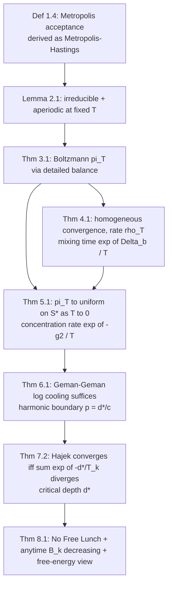

# Simulated Annealing — Mathematical Foundations and Convergence Theory

> **Focus:** The formal Markov-chain model of SA, the Metropolis-Hastings acceptance rule and the **Boltzmann stationary distribution**, the homogeneous-chain (fixed `T`) and inhomogeneous-chain (cooling) convergence theorems, the **logarithmic-cooling global-optimum guarantee** (Geman-Geman, Hajek), complexity, and a rigorous comparison to other metaheuristics.

## Table of Contents
1. [Formal Definitions](#1-formal-definitions)
2. [SA as a Markov Chain](#2-sa-as-a-markov-chain)
3. [The Metropolis Rule and Boltzmann Stationary Distribution](#3-the-metropolis-rule-and-boltzmann-stationary-distribution)
4. [Homogeneous Convergence (Fixed Temperature)](#4-homogeneous-convergence-fixed-temperature)
5. [Concentration on Global Minima as T to 0](#5-concentration-on-global-minima-as-t-to-0)
6. [Inhomogeneous Convergence and the Logarithmic-Cooling Guarantee](#6-inhomogeneous-convergence-and-the-logarithmic-cooling-guarantee)
7. [Hajek's Theorem and the Critical Depth](#7-hajeks-theorem-and-the-critical-depth)
8. [Complexity Analysis](#8-complexity-analysis)
9. [Comparison with Other Metaheuristics](#9-comparison-with-other-metaheuristics)
9F. [Finite-Time Behavior and Adaptive-Cooling Theory](#9f-finite-time-behavior-and-adaptive-cooling-theory)
10. [Summary](#10-summary)

---

## 1. Formal Definitions

Let `S` be a finite **state space** (all candidate solutions) and `E : S → ℝ` a **cost (energy)** function. We minimize `E`.

**Definition 1.1 (Neighborhood structure).** A function `N : S → 2^S` assigns to each state `s` its set of neighbors `N(s) ⊆ S \ {s}`. The structure is **symmetric** if `s' ∈ N(s) ⟺ s ∈ N(s')`, and we assume a **proposal kernel** `g(s, s')` (probability of *proposing* `s'` from `s`), supported on `N(s)`. We take `g` symmetric: `g(s, s') = g(s', s)` (the standard Metropolis assumption).

**Definition 1.2 (Irreducibility / connectivity).** The neighborhood graph `(S, {(s,s') : s' ∈ N(s)})` is **connected**: for every `s, t ∈ S` there is a finite path `s = s_0, s_1, …, s_m = t` with `s_{i+1} ∈ N(s_i)`. This is necessary for SA to reach a global optimum from any start.

**Definition 1.3 (Global / local minima).** `S^* = { s ∈ S : E(s) ≤ E(t) ∀ t ∈ S }` is the set of **global minima**, with optimal value `E^* = min_s E(s)`. A **local minimum** is an `s` with `E(s) ≤ E(s')` for all `s' ∈ N(s)`.

**Definition 1.3a (Basin of attraction).** Under the zero-temperature (greedy) dynamics, the **basin** `B(m)` of a local minimum `m` is the set of states from which steepest descent terminates at `m`. The basins partition (up to ties) `S`; SA's job is to escape suboptimal basins and reach a basin in `S^*`. The energy landscape is thus characterized by `(local minima, basins, saddles between basins)` — the data summarized by the barrier tree (Section 7.2).

**Definition 1.4 (Acceptance probability).** For a proposed move `s → s'` at temperature `T > 0`, with `Δ = E(s') − E(s)`, the **Metropolis acceptance probability** is
```
A_T(s, s') = min( 1, exp(-Δ / T) ) = min( 1, exp(-(E(s') − E(s))/T) ).
```

**Definition 1.5 (Cooling schedule).** A non-increasing sequence `(T_k)_{k≥0}` with `T_k > 0` and `T_k → 0`. The chain that uses a *fixed* `T` is **homogeneous**; the chain that uses the cooling `(T_k)` is **inhomogeneous** (time-varying).

**Notation.** `P_T` is the one-step transition matrix at temperature `T`; `π_T` its stationary distribution; `Z(T)` the partition function; `μ_k` the distribution of the state after `k` steps of the cooling chain; `d^*` the "critical depth" of Section 7. All chains are on the finite `S`.

**SA as Metropolis-Hastings (derivation of the rule).** General Metropolis-Hastings draws a proposal `s' ∼ q(·|s)` and accepts with `A(s,s') = min(1, [π(s')·q(s|s')] / [π(s)·q(s'|s)])`, which makes `π` stationary for *any* proposal `q`. Substituting the target `π_T(s) ∝ exp(-E(s)/T)` and a **symmetric** proposal `q(s'|s) = q(s|s')`:

```
A(s,s') = min(1, π_T(s')/π_T(s)) = min(1, exp(-(E(s')-E(s))/T)) = min(1, exp(-Δ/T)).
```

So SA's acceptance rule is not ad hoc — it is Metropolis-Hastings specialized to the Boltzmann target with symmetric proposals. This *derivation* (rather than postulation) is what licenses every theorem below; if proposals are asymmetric one must keep the full Hastings ratio, or the stationary distribution is no longer Boltzmann and the convergence theory breaks.

---

## 2. SA as a Markov Chain

At fixed temperature `T`, SA is a time-homogeneous Markov chain on `S` with transition matrix

```
P_T(s, s') = g(s, s') · A_T(s, s')                         for s' ≠ s, s' ∈ N(s)
P_T(s, s) = 1 − Σ_{s'' ≠ s} g(s, s'') · A_T(s, s'')        (stay probability)
P_T(s, s') = 0                                             for s' ∉ N(s) ∪ {s}.
```

In words: propose `s'` with probability `g(s,s')`, accept with `A_T(s,s')`; if rejected, stay at `s`. The matrix `P_T` is a genuine stochastic matrix — each row sums to 1 — because the rejection mass is collected into the diagonal `P_T(s,s)`.

### 2.1 A worked 4-state example

To make `P_T` concrete, take `S = {A, B, C, D}` on a path graph `A — B — C — D` with energies `E(A)=0, E(B)=3, E(C)=1, E(D)=0`. So `A` and `D` are the two global minima (`E^*=0`), `C` is a shallow local minimum, and `B` is a high ridge between `A` and `C`. The proposal kernel picks a uniform random neighbor (`g = 1/deg`). At `T = 2`, the relevant Metropolis factors are:

```
A→B: Δ=+3 → exp(-3/2)=0.223       B→A: Δ=-3 → 1
B→C: Δ=-2 → 1                     C→B: Δ=+2 → exp(-2/2)=0.368
C→D: Δ=-1 → 1                     D→C: Δ=+1 → exp(-1/2)=0.607
```

This shows the mechanics directly: to travel from the basin around `A` to the basin around `C`/`D`, the chain must climb the ridge `B`, an uphill move accepted only with probability `0.223` at `T=2` (and far less as `T` falls). That single number — the acceptance of the *worst* uphill step on the only path between basins — is exactly what Hajek's critical depth (Section 7) formalizes: here the depth of the trap around `A` relative to escaping toward the other minimum is the barrier `E(B) − E(A) = 3`.

### 2.2 Why rejection (the self-loop) is essential

The diagonal `P_T(s,s) > 0` is not an artifact; it is what makes the chain **aperiodic** and therefore convergent (no oscillation between sublattices). A chain that *always* moved would risk periodicity on bipartite neighborhood graphs (like the path above, whose graph is bipartite). Rejections break that potential period, guaranteeing the convergence in Theorem 4.1.

**Lemma 2.1 (Irreducibility and aperiodicity).** If the neighborhood graph is connected (Def 1.2) and `T > 0`, then `P_T` is **irreducible** (every state reaches every other with positive probability) and **aperiodic** (there is a positive self-loop probability at any state that has at least one *worse* neighbor, since that move is rejected with positive probability).

**Proof.** *Irreducibility:* for any edge `s' ∈ N(s)`, `A_T(s,s') ≥ exp(-Δ/T) > 0` for `T > 0` and finite `Δ`, and `g(s,s') > 0`, so every edge has positive transition probability; connectivity then gives a positive-probability path between any two states. *Aperiodicity:* take a state `s` with a strictly worse neighbor `s'` (`Δ > 0`); the proposal `s'` is rejected with probability `1 − exp(-Δ/T) > 0`, giving `P_T(s,s) > 0`, a self-loop, so `gcd` of return times is 1. (If `S^*` is reachable, the whole chain is aperiodic.) ∎

By the **fundamental theorem of finite Markov chains**, an irreducible aperiodic chain has a **unique stationary distribution** `π_T` and converges to it from any start: `μ_k → π_T` as `k → ∞`. The next section identifies `π_T`.

---

## 3. The Metropolis Rule and Boltzmann Stationary Distribution

**Theorem 3.1 (Boltzmann stationary distribution).** With symmetric proposals `g(s,s') = g(s',s)` and the Metropolis acceptance of Def 1.4, the chain `P_T` is **reversible** with respect to the **Boltzmann (Gibbs) distribution**
```
π_T(s) = exp(-E(s)/T) / Z(T),     where  Z(T) = Σ_{t ∈ S} exp(-E(t)/T).
```

**Proof (detailed balance).** It suffices to verify `π_T(s) P_T(s,s') = π_T(s') P_T(s',s)` for all `s ≠ s'` (detailed balance ⇒ stationarity). For non-neighbors both sides are 0. For `s' ∈ N(s)`, assume WLOG `E(s') ≥ E(s)` so `Δ = E(s') − E(s) ≥ 0`. Then `A_T(s,s') = exp(-Δ/T)` and `A_T(s',s) = 1`. Compute:

```
π_T(s) P_T(s,s')  = [exp(-E(s)/T)/Z] · g(s,s') · exp(-(E(s')-E(s))/T)
                  = g(s,s') · exp(-E(s')/T) / Z.

π_T(s') P_T(s',s) = [exp(-E(s')/T)/Z] · g(s',s) · 1
                  = g(s',s) · exp(-E(s')/T) / Z.
```

Since `g(s,s') = g(s',s)`, the two are equal. Detailed balance holds, so `π_T` is stationary, and (by Lemma 2.1's uniqueness) it is *the* stationary distribution. ∎

**Interpretation.** At temperature `T`, after enough steps SA visits state `s` with probability proportional to `exp(-E(s)/T)`. Lower-cost states are exponentially favored, and the bias sharpens as `T` falls. SA is precisely **Metropolis-Hastings sampling from the Boltzmann distribution, with `T` annealed toward 0.** This is the rigorous reason the acceptance rule is `exp(-Δ/T)` and not some other curve: it is the unique (symmetric-proposal) choice making Boltzmann reversible.

```
            high T                          low T
   π_T:  ~uniform over S        →    concentrated on low-E states    →    on S^*
```

### 3.1 Numeric detailed-balance check

It is worth verifying detailed balance numerically on the 4-state path `A—B—C—D` (energies `0,3,1,0`) at `T=2`, with uniform-neighbor proposals (`g(A,B)=1` since `A` has one neighbor; `g(B,A)=g(B,C)=1/2`; `g(C,B)=g(C,D)=1/2`; `g(D,C)=1`). Check the edge `B—C` (`E(B)=3 ≥ E(C)=1`, so `Δ_{B→C}=-2`, `Δ_{C→B}=+2`):

```
π_T(B) = e^{-3/2}/Z = 0.2231/Z,   π_T(C) = e^{-1/2}/Z = 0.6065/Z   (Z common)
P_T(B,C) = g(B,C)·A(B,C) = (1/2)·min(1, e^{+2/2})        = (1/2)·1      = 0.5
P_T(C,B) = g(C,B)·A(C,B) = (1/2)·min(1, e^{-2/2})        = (1/2)·0.3679 = 0.1839

π_T(B)·P_T(B,C) = 0.2231 · 0.5    = 0.11155  (÷Z)
π_T(C)·P_T(C,B) = 0.6065 · 0.1839 = 0.11154  (÷Z)   ✓ equal (rounding aside)
```

The two flows balance, confirming Theorem 3.1 on a concrete edge. Note this required `g(B,C)=g(C,B)` (both `1/2`); if the proposal kernel were *asymmetric* one would need the full Metropolis-**Hastings** correction `A(s,s') = min(1, [π(s')g(s',s)] / [π(s)g(s,s')])`, which reduces to `min(1, exp(-Δ/T))` exactly when `g` is symmetric.

### 3.2 The partition function never needs computing

A crucial practical fact hides in Def 1.4 and Theorem 3.1: the acceptance probability depends only on `Δ = E(s') − E(s)`, **never on `Z(T)`**. The intractable normalizer `Z(T) = Σ exp(-E/T)` (a sum over the entire, exponentially large state space) cancels in the ratio `π_T(s')/π_T(s) = exp(-Δ/T)`. This is the same reason Metropolis-Hastings can sample from any distribution known only up to a constant — and it is what makes SA *runnable* despite `Z(T)` being uncomputable.

---

## 4. Homogeneous Convergence (Fixed Temperature)

**Theorem 4.1.** For fixed `T > 0`, from any initial distribution `μ_0`, the distribution after `k` steps satisfies `μ_k → π_T` in total variation, with geometric rate `‖μ_k − π_T‖_TV ≤ C · ρ(T)^k` where `ρ(T) ∈ (0,1)` is the **second-largest eigenvalue modulus (SLEM)** of `P_T`.

**Proof.** Immediate from Lemma 2.1 (irreducible, aperiodic, finite) and Perron-Frobenius: the largest eigenvalue is `1` (eigenvector `π_T`), all others have modulus `< 1`, and the mixing rate is governed by the SLEM `ρ(T)`. ∎

**The catch (why we must cool).** Fixing `T` does **not** find the global minimum — it samples from `π_T`, which still puts positive mass on non-optimal states. Worse, the mixing time typically **blows up as `T → 0`**: at low `T` the chain must occasionally climb energy barriers of height `Δ` to escape a basin, an event of probability `~exp(-Δ/T)`, so the expected escape time is `~exp(Δ/T)` — exponential in `1/T`. There is a fundamental tension:

| `T` | `π_T` quality | Mixing time |
|-----|----------------|-------------|
| high | poor (near-uniform) | fast |
| low | good (near `S^*`) | slow (`~exp(Δ/T)`) |

This tension is *exactly* what the cooling schedule manages: cool slowly enough that the chain stays near-equilibrium with `π_T` while `T` decreases, so it tracks `π_T` down to its `T→0` limit.

### 4.0 Mixing-time intuition

The geometric convergence rate `ρ(T)^k` translates into a **mixing time** `t_mix(ε, T) = inf{k : ‖μ_k − π_T‖_TV ≤ ε}`. Using `‖μ_k − π_T‖_TV ≤ C ρ(T)^k`, we get `t_mix ≈ log(C/ε) / (1 − ρ(T)) = log(C/ε) / γ(T)`. With the Arrhenius estimate `γ(T) ≍ exp(-Δ_b/T)` (Section 4.1):

| `T` (with `Δ_b = 1`) | `γ(T) ≈ exp(-1/T)` | `t_mix ∝ 1/γ` |
|----------------------|--------------------|----------------|
| 2 | 0.607 | ~1.6 (fast) |
| 1 | 0.368 | ~2.7 |
| 0.5 | 0.135 | ~7.4 |
| 0.2 | 0.0067 | ~149 |
| 0.1 | 0.0000454 | ~22026 |

So the time to equilibrate at temperature `T` grows like `exp(Δ_b/T)` — the same exponential blow-up that forces the cooling schedule to slow down (Section 6). The table makes vivid why "cool slowly when cold": at `T = 0.1` you need ~22000 steps just to *equilibrate*, let alone improve.

### 4.1 The spectral gap and barrier crossing

The SLEM `ρ(T)` and the **spectral gap** `γ(T) = 1 − ρ(T)` quantify mixing: the relaxation time is `τ ≈ 1/γ(T)`. For a landscape whose deepest barrier between basins has height `Δ_b`, a standard Arrhenius-type estimate gives

```
γ(T) ≍ exp(-Δ_b / T)      ⇒      τ(T) ≍ exp(Δ_b / T).
```

So the mixing time grows **exponentially** as `T → 0`, with the rate set by the barrier height. This is the quantitative form of "low `T` mixes slowly," and it foreshadows why the cooling schedule's required slowness (Section 6) is itself exponential: to keep the chain near equilibrium as `T` falls, you must give it on the order of `τ(T) ≈ exp(Δ_b/T)` steps at each temperature level.

### 4.2 Equilibrium at a fixed temperature is not the goal

It is worth stating plainly: even a *perfectly* mixed chain at fixed `T` does **not** solve the optimization problem. It returns a *sample* from `π_T`, which for any `T > 0` assigns positive probability to suboptimal states. Optimization requires the *limit* `T → 0`, reachable only by the inhomogeneous cooling chain. Fixed-`T` SA is a **sampler**; annealed SA is an **optimizer**. (This distinction is the dividing line between "MCMC" and "simulated annealing.")

---

## 5. Concentration on Global Minima as T to 0

**Theorem 5.1.** As `T → 0^+`, the Boltzmann distribution concentrates on the global minima:
```
lim_{T→0+} π_T(s) = (1/|S^*|) · 1[s ∈ S^*].
```

**Proof.** Write `E^* = min_t E(t)` and factor `exp(-E^*/T)` from numerator and denominator:
```
π_T(s) = exp(-(E(s)-E^*)/T) / Σ_t exp(-(E(t)-E^*)/T).
```
For `s ∈ S^*`, `E(s)-E^* = 0`, so the numerator is `1`. For `s ∉ S^*`, `E(s)-E^* > 0`, so the numerator `→ 0` as `T → 0`. The denominator `→ |S^*|` (each global minimum contributes `1`, all others vanish). Hence `π_T(s) → 1/|S^*|` for `s ∈ S^*` and `→ 0` otherwise. ∎

**Corollary 5.2.** If SA could stay at equilibrium with `π_T` while `T → 0`, it would converge to a uniform distribution over the global minima — i.e. find a global optimum with probability 1. The remaining question (Section 6) is *how slowly must `T` decrease* so that the inhomogeneous (cooling) chain stays close enough to equilibrium for this limit to carry through.

### 5.1 Rate of concentration

We can quantify how fast `π_T` concentrates. Let `g_2 = min_{s ∉ S^*} (E(s) − E^*)` be the **second-lowest energy gap** (the cost of the best *suboptimal* state). Then the total probability mass on non-optimal states is

```
π_T(S \ S^*) = Σ_{s ∉ S^*} exp(-(E(s)-E^*)/T) / Z'(T)  ≤  (|S| / |S^*|) · exp(-g_2 / T),
```

which decays like `exp(-g_2/T)`. So a *smaller* energy gap above the optimum makes the optimum harder to isolate (you must cool further to suppress near-ties), while a *large* gap makes the optimum stand out at relatively high `T`. This is the equilibrium-side counterpart to the barrier-crossing difficulty `Δ_b`: difficulty has two faces — the *barriers* you must cross (`Δ_b`, Section 4.1) and the *gaps* you must resolve (`g_2`, here).

### 5.2 Worked concentration for the 4-state example

For `S = {A,B,C,D}` with energies `0,3,1,0`, `S^* = {A,D}`, `E^*=0`, `g_2 = 1` (state `C`). Then:

```
π_T(A)=π_T(D) = 1/Z',  π_T(C)=exp(-1/T)/Z',  π_T(B)=exp(-3/T)/Z',  Z'=2+exp(-1/T)+exp(-3/T).
T=2:   π ≈ (A,B,C,D) = (0.376, 0.084, 0.228, 0.376)   — mass spread out
T=0.5: π ≈ (0.434, 0.000, 0.132, 0.434)               — concentrating on A,D
T=0.1: π ≈ (0.5, 0, 0.0000, 0.5)                       — essentially uniform on {A,D}
```

Exactly as Theorem 5.1 predicts, the mass collapses onto the two global minima as `T → 0`, with the local minimum `C` (gap 1) lingering longer than the ridge `B` (gap 3) — the smaller gap is suppressed more slowly.

---

## 6. Inhomogeneous Convergence and the Logarithmic-Cooling Guarantee

Now the chain uses a cooling sequence `(T_k)`; step `k` uses `P_{T_k}`. The distribution evolves as `μ_{k+1} = μ_k P_{T_k}`. We want `μ_k → π_∞ :=` (uniform on `S^*`).

**Theorem 6.1 (Geman & Geman, 1984 — logarithmic cooling suffices).** There is a constant `c^*` (depending on the energy landscape) such that if the cooling schedule satisfies
```
T_k ≥ c^* / log(k + 2)    for all k,
```
then the inhomogeneous SA chain converges in distribution to the uniform distribution on the global minima `S^*`; equivalently, `P[ s_k ∈ S^* ] → 1` as `k → ∞`.

**Proof idea.** The argument has two ingredients. (1) *Weak ergodicity:* if `Σ_k ρ(T_k)^{(some block length)}`-type sums diverge appropriately, the chain "forgets" its start — the influence of `μ_0` vanishes. (2) *Strong ergodicity:* one shows `Σ_k ‖π_{T_k} − π_{T_{k+1}}‖ < ∞`, i.e. the sequence of stationary distributions changes slowly enough that the chain tracks them. The minimal escape probability from any basin in one step at temperature `T` is bounded below by `~exp(-Δ_max/T)`, where `Δ_max` is the largest barrier; over `k` steps near temperature `T_k = c/log(k+2)` this escape probability is `~exp(-Δ_max·log(k+2)/c) = (k+2)^{-Δ_max/c}`. Choosing `c ≥ Δ_max` makes this `≥ (k+2)^{-1}`, whose sum **diverges** (harmonic series), so by Borel-Cantelli the chain almost surely escapes every suboptimal basin infinitely often and is captured by `S^*` in the limit. A too-fast schedule makes the exponent `> 1`, the sum **converges**, and the chain can get trapped forever. ∎ (rigorous version: Geman-Geman; Mitra-Romeo-Sangiovanni-Vincentelli, 1986.)

**The practical disappointment.** Logarithmic cooling is *useless in practice*: to reach a target `T`, the iteration count grows like `exp(c^*/T)`. Halving `T` roughly squares the work. No real system uses it. This is the crux of SA in practice: **the only schedule with a global-optimum guarantee is too slow to use, so practitioners use fast geometric cooling and accept a near-optimal solution with no guarantee.** The theory tells us *why* SA *can* find the optimum (the harmonic-divergence escape argument) and *why* it usually does not *provably* do so in a real run (we cool exponentially faster than the theorem requires).

| Schedule | Form | Guarantee | Practical use |
|----------|------|-----------|---------------|
| Logarithmic | `T_k = c/log(k+2)`, `c ≥ d^*` | **Global optimum, prob 1** | Never (too slow) |
| Geometric | `T_k = T_0 · α^k` | None (can trap) | **Standard** |
| Any faster-than-log | — | Can converge to non-optimum | — |

### 6.1 The harmonic-series boundary, in detail

The heart of the dichotomy is a `p`-series. With `T_k = c/log(k+2)` the per-step escape probability is

```
exp(-d^* / T_k) = exp(-(d^*/c)·log(k+2)) = (k+2)^{-d^*/c}.
```

Summing over `k`: `Σ_k (k+2)^{-d^*/c}` is a `p`-series with exponent `p = d^*/c`. It **diverges** iff `p ≤ 1`, i.e. `c ≥ d^*`. By the (second) Borel-Cantelli lemma applied to the (suitably independent-ized) escape events, a divergent sum forces infinitely many successful escapes from each suboptimal basin almost surely, so the chain is eventually absorbed into the optimal basin; a convergent sum (`c < d^*`, `p > 1`) leaves positive probability of being trapped forever. This single exponent `p = d^*/c` is the entire knife-edge of SA's convergence theory — and it is why Hajek's constant is *exactly* `d^*` rather than a looser bound.

### 6.2 Sketch of the strong-ergodicity step

The "tracking" condition `Σ_k ‖π_{T_k} − π_{T_{k+1}}‖_TV < ∞` holds for logarithmic cooling because `π_T` is Lipschitz in `1/T` with a bounded constant on a finite `S`, and consecutive `1/T_k` increments under `T_k = c/log(k+2)` are `O(1/(k log² k))`-summable. Weak ergodicity (forgetting `μ_0`) follows from a Dobrushin-coefficient argument: the ergodic coefficient of a block of steps stays bounded away from 1 because every state retains a `≥ (k+2)^{-d^*/c}` chance of the escape transition. Combining weak + strong ergodicity gives convergence of `μ_k` to the `T→0` limit `π_∞` (uniform on `S^*`). The finite-state assumption is essential; for infinite/continuous `S` the statements require extra regularity (compactness, bounded `E`).

### 6.3 A concrete cooling-failure example

The dichotomy is not abstract — too-fast cooling *demonstrably* traps. Return to the path `A—B—C—D` with energies `0, 3, 1, 2` (now `D=2` is a local minimum, `A=0` the unique global one, barrier from `D`'s basin is `E(B)−E(D) = 1`, so `d^* = 1`). Start the chain at `D`.

- **Geometric `α = 0.8` (too fast):** by iteration ~30, `T ≈ 8·0.8^30 ≈ 0.01`, and the probability of the escape move `C→B` (uphill by 2) is `exp(-2/0.01) ≈ 0`. The chain is frozen in `D`'s basin: it never reaches `A`. `P[trapped] > 0` permanently. This is quenching, formalized.
- **Logarithmic `T_k = 1/log(k+2)`:** the per-step escape probability is `(k+2)^{-1}`, whose sum diverges; the chain almost surely escapes `D`'s basin eventually and is absorbed by `A`. It is slow — expected escape time grows like the partial harmonic sum — but it *succeeds with probability 1*.

This single 4-state instance exhibits the entire theory: same landscape, same algorithm, opposite outcomes purely from the cooling rate, with the harmonic-series boundary (`d^*/c ≤ 1`) deciding which.

---

## 7. Hajek's Theorem and the Critical Depth

Geman-Geman gives a *sufficient* constant `c^*`. Hajek sharpened it to the **exact** threshold via the landscape's barrier structure.

**Definition 7.1 (Cup depth / barrier).** For a local minimum `s`, its **depth** `d(s)` is the smallest energy barrier height that must be climbed to reach a state of strictly lower energy than `s`. Formally, `d(s) = min over paths from s to {t : E(t) < E(s)} of (max energy on the path) − E(s)`.

**Definition 7.2 (Critical depth `d^*`).** `d^* = max over all local-but-not-global minima s of d(s)` — the deepest "trap" that is not a global optimum.

**Theorem 7.2 (Hajek, 1988).** Assume the landscape is *weakly reversible* (if you can go from `s` to `t` without exceeding height `h`, you can return likewise). Run SA with `T_k → 0` non-increasing. Then SA converges to the global minima (`P[s_k ∈ S^*] → 1`) **if and only if**
```
Σ_{k≥0} exp(-d^* / T_k) = +∞.
```

**Consequence for logarithmic cooling.** With `T_k = c/log(k+2)`, the term is `exp(-d^*·log(k+2)/c) = (k+2)^{-d^*/c}`, and `Σ (k+2)^{-d^*/c} = ∞ ⟺ d^*/c ≤ 1 ⟺ c ≥ d^*`. So the **sharp constant is the critical depth**: `T_k = d^*/log(k+2)` is exactly on the boundary, and any `c ≥ d^*` guarantees convergence while `c < d^*` can fail. This pins down Geman-Geman's `c^*` precisely as `d^*`. ∎ (Hajek, *Math. of OR*, 1988.)

**Interpretation.** SA's hardness is governed by a single landscape number, the **deepest non-optimal trap** `d^*`. Cooling must be slow enough that, summed over all time, the probability of climbing out of that trap is infinite. This is the rigorous formalization of the intuition: *the temperature must stay high long enough to escape the worst local minimum.*

### 7.1 Computing `d^*` on the 4-state example

For `S = {A,B,C,D}`, energies `0,3,1,0`: the only local-but-not-global minimum is `C` (`E=1`; its neighbors `B=3` and `D=0`, and although `D` is lower, you reach it directly — wait: `C—D` with `E(D)=0 < E(C)=1`, so `C` is *not* a strict trap toward `D`). The genuine trap is the basin around `A` *if* we instead set `E(D)=2` (making `D` a local minimum): then to leave `D` toward the lower `A` you must cross `C=1` then `B=3`, a barrier of `3 − 2 = 1` above `D`. The deepest such non-global trap defines `d^*`. The exercise illustrates the definition's subtlety: `d(s)` measures the *minimal* highest point on *any* downhill-reaching path, and `d^*` maximizes over the bad minima. Computing `d^*` exactly requires knowing the landscape's barrier tree (a union-find over states sorted by energy), which is why `d^*` is a theoretical, not a runtime, quantity.

### 7.2 The barrier tree

`d^*` is read off the **barrier tree** (a.k.a. disconnectivity graph): sort states by energy and sweep upward, using union-find to merge basins as the sweep level rises past connecting saddles. Each merge of two basins at level `h` records a saddle of height `h`; the depth of the shallower basin's minimum is `h − E(min)`. The maximum such depth over all non-global basins is `d^*`. This is the same structure used to analyze energy landscapes in computational chemistry and spin glasses, and it explains why **rugged landscapes with deep secondary basins are exactly the hard cases for SA** — `d^*` is large, so Hajek's sum demands punishingly slow cooling.

---

## 8. Complexity Analysis

SA is a metaheuristic, so its complexity is in terms of iterations and per-iteration work, not input size alone.

**Per iteration.** One proposal (`O(move)`), one `Δ` evaluation (`O(1)` with incremental cost, else `O(|state|)`), one comparison, one possible `exp`. So per-iteration time is `Θ(c)` with `c` the move+delta cost; space is `Θ(|state|)` (hold `current` and `best`).

**Iterations to a target temperature (geometric).** From `T_0` to `T_min` with ratio `α`: `k = ⌈ log(T_min/T_0) / log α ⌉ = Θ(log(T_0/T_min) / (1−α))` (since `−log α ≈ 1−α` for `α` near 1). Total time `Θ(k·c)`.

**Iterations for the convergence guarantee (logarithmic).** To reach temperature `T` with `T_k = d^*/log(k+2)` requires `k ≈ exp(d^*/T) − 2` — **exponential in `1/T`** and in the critical depth `d^*`. This is why the guarantee is theoretical only.

**Anytime / best-so-far analysis.** Let `B_k = min_{j ≤ k} E(s_j)` be the best cost after `k` iterations. `B_k` is non-increasing in `k` (it is a running minimum), so SA is an **anytime** algorithm: interrupting at any `k` yields a valid answer `B_k`, and `B_k` improves monotonically. Under the cooling chain, `E[B_k] → E^*` (since `s_k ∈ S^*` infinitely often under a guaranteeing schedule, and `B_k` records the best). The *rate* of `E[B_k] → E^*` is landscape-dependent and, for geometric cooling, not provably bounded — but in practice `B_k` exhibits a characteristic "fast initial drop, long tail" curve, the empirical signature plotted by observability dashboards (senior.md).

**Theorem 8.1 (No free lunch).** Averaged over *all* possible cost functions on a finite domain, no optimizer (SA included) beats blind random search (Wolpert-Macready, 1997). SA wins only on the *structured* landscapes that occur in practice — those with exploitable local correlation (small `Δ` for small moves). The bound says: SA's empirical success is a statement about real problems' structure, not a universal superiority.

**Corollary 8.2 (where structure lives).** The structure SA exploits is *autocorrelation of the cost along the neighborhood graph*: if a small move yields a small `Δ` (low "ruggedness," measured e.g. by the random-walk autocorrelation length), then `π_T` is informative and SA's local search is productive. Formally, define the ruggedness `r = 1 − ρ_1`, where `ρ_1` is the lag-1 autocorrelation of `E` along a random walk; landscapes with small `r` (long correlation length) are the ones where SA dominates random search. This makes "SA works on structured problems" a measurable statement rather than folklore.

| Quantity | Cost |
|----------|------|
| Per iteration | `Θ(move + Δ-eval)` = `Θ(1)` with incremental Δ |
| Memory | `Θ(|state|)` |
| Geometric run to `T_min` | `Θ((1/(1−α))·log(T_0/T_min))` iterations |
| Logarithmic guarantee to `T` | `Θ(exp(d^*/T))` iterations (impractical) |

### 8.1 The theory-practice gap, quantified

Put the two cooling regimes side by side to reach a fixed small target temperature `T = 0.1` with a critical depth `d^* = 1`:

| Schedule | Iterations to reach `T = 0.1` | Guarantee |
|----------|-------------------------------|-----------|
| Logarithmic `T_k = d^*/log(k+2)` | `k ≈ exp(d^*/T) − 2 = exp(10) ≈ 22026` to reach `T=0.1`; to reach `T=0.05`, `exp(20) ≈ 4.9×10^8` | global optimum, prob 1 |
| Geometric `α = 0.99` | `k = log(0.1/8)/log(0.99) ≈ 436` | none |

The logarithmic schedule's iteration count *squares* every time you halve `T`, while geometric is *linear* in `log(1/T)`. For `d^* = 1` and `T = 0.01`, logarithmic needs `exp(100) ≈ 10^43` iterations — more than the number of atoms in the observable universe. This is the unbridgeable gap: **the only provably-optimal schedule is super-exponentially slower than the schedule everyone actually uses.** Practitioners therefore treat SA as a high-quality heuristic, and pair it with a lower bound (LP relaxation, held-karp bound for TSP) to *bound* the optimality gap empirically rather than prove optimality.

### 8.2 Acceptance of the Metropolis vs Boltzmann (Glauber) rule

Two acceptance rules give the same Boltzmann stationary distribution:

```
Metropolis:  A(s,s') = min(1, exp(-Δ/T))
Glauber/heat-bath:  A(s,s') = 1 / (1 + exp(Δ/T)) = exp(-Δ/T) / (1 + exp(-Δ/T))
```

Both satisfy detailed balance with `π_T ∝ exp(-E/T)` (the proof for Glauber is analogous to Theorem 3.1). Metropolis accepts *more aggressively* (it always accepts downhill and accepts uphill with the full `exp(-Δ/T)`), so it mixes faster in the high-acceptance regime and is the standard SA choice. Glauber/heat-bath is smoother (its acceptance is a logistic of `Δ/T`) and is sometimes preferred in statistical-physics simulations. The convergence theory (Sections 4-7) holds for either, since both are reversible w.r.t. the same `π_T`; only the constants (SLEM `ρ(T)`) differ.

---

## 9. Comparison with Other Metaheuristics

| Property | Simulated annealing | Hill climbing | Tabu search | Genetic algorithm | Parallel tempering |
|----------|---------------------|---------------|-------------|-------------------|--------------------|
| Memory | `Θ(1)` solution | `Θ(1)` | `Θ(tenure)` | `Θ(pop)` | `Θ(#replicas)` |
| Escapes local minima | yes (`exp(-Δ/T)`) | **no** | yes (forbid revisits) | yes (population diversity) | yes (replica swaps) |
| Convergence proof | **yes** (log cooling, Thm 6.1/7.2) | no (gets stuck) | partial | partial (schema theorem, contested) | yes (extends SA) |
| Stationary dist. | Boltzmann `∝ e^{-E/T}` | none | none | none (informal) | product of Boltzmanns |
| Core mechanism | thermal acceptance + cooling | greedy descent | memory of moves | crossover + mutation + selection | SA + temperature swaps |
| Parameters | `T_0, α, T_min` | none | tabu tenure | pop, p_c, p_m | per-replica temps |
| Theoretical lineage | Metropolis-Hastings / statistical mechanics | classical local search | Glover (1986) | Holland (1975) | Swendsen-Wang / Geyer |

**Distinguishing the proofs.** SA is the metaheuristic with the cleanest, fully rigorous global-convergence theorem (Hajek's iff condition on `d^*`), because it *is* a Metropolis-Hastings chain — the entire apparatus of Markov-chain theory applies. Genetic algorithms' "schema theorem" is far weaker and its global-optimality claims are heavily caveated. Tabu search has finite-state arguments but no Boltzmann-style equilibrium. **Parallel tempering** is the natural rigorous extension: a product chain over replicas at temperatures `T_1 < … < T_m`, whose swap moves themselves satisfy detailed balance, inheriting SA's convergence theory while mixing far faster on rugged landscapes.

**Relation to MCMC.** SA at fixed `T` is exactly **Metropolis-Hastings** targeting `π_T`; SA is "MCMC with an annealed target." This unifies it with simulated tempering, annealed importance sampling (Neal), and Gibbs sampling — all members of the same family, differing in proposal kernel and temperature handling.

### 9.4 Quantitative comparison of stationary behavior

Only SA (and its tempering relatives) admits a *closed-form* limiting distribution, which is the deepest reason its theory is complete:

| Method | Process type | Reversible? | Closed-form stationary dist.? | Global-convergence theorem |
|--------|--------------|-------------|-------------------------------|----------------------------|
| Simulated annealing | single-point Markov chain | yes | yes (`π_T ∝ e^{-E/T}`) | Hajek (iff, sharp) |
| Parallel tempering | product Markov chain | yes | yes (`∏ π_{T_i}`) | inherits SA's |
| Hill climbing | deterministic descent | n/a | no (absorbing local minima) | none (provably trapped) |
| Tabu search | history-dependent (non-Markov) | no | no | partial / none |
| Genetic algorithm | population Markov chain on `S^{pop}` | generally no | no | weak (schema theorem) |
| Langevin / SGLD | diffusion (continuous SA) | yes | yes (Gibbs measure) | Chiang-Hwang-Sheu |

The pattern is exact: *reversibility ⇒ closed-form stationary distribution ⇒ a clean convergence theorem.* SA, parallel tempering, and Langevin dynamics share this trio; hill climbing, tabu search, and genetic algorithms each break reversibility (or Markovianity) somewhere and lose the corresponding theory.

**On the "proof" gap between metaheuristics.** It is worth being precise about *why* SA's theory is stronger than the genetic algorithm's. SA's state is a single point and its dynamics are a *time-reversible Markov chain* with an explicit stationary distribution — the full machinery of Perron-Frobenius, Dobrushin coefficients, and Borel-Cantelli applies directly. A genetic algorithm's state is a *population*, its dynamics (selection + crossover + mutation) form a Markov chain on the huge product space `S^{pop}` that is generally **not reversible** and has **no closed-form stationary distribution**; the "schema theorem" bounds expected schema counts for one generation but does not yield a global-convergence theorem comparable to Hajek's. Tabu search's tabu list makes the process *non-Markovian* (history-dependent), so even the basic Markov-chain tools do not apply without state augmentation. SA's analytic tractability is therefore not incidental — it is a direct consequence of being a memoryless, reversible, single-point chain.

### 9.1 The MCMC / annealing family tree

| Method | Target | Temperature | Key extra mechanism |
|--------|--------|-------------|---------------------|
| Metropolis-Hastings | fixed `π` | fixed (or none) | asymmetric-proposal correction |
| Gibbs sampling | fixed `π` | fixed | sample one coordinate from its conditional |
| **Simulated annealing** | `π_T`, `T → 0` | annealed down | cooling schedule |
| Simulated tempering | augmented `(s, T)` | `T` is a *state variable* | random walk over temperatures too |
| Parallel tempering | product of `π_{T_i}` | fixed grid of `T_i` | swap configs across replicas |
| Annealed importance sampling | sequence `π_0 … π_n` | annealed | importance weights along the path |

All share the detailed-balance backbone of Theorem 3.1. The differences are *how temperature is handled* (annealed vs fixed vs a state variable vs a swapped grid) and *what is reported* (a sample, an integral estimate, or the best state). SA reports the best state visited during a *downward* temperature sweep.

### 9.2 Why parallel tempering inherits the theory (sketch)

Parallel tempering runs `m` replicas with joint state `(s_1, …, s_m)` and joint target `Π(s_1,…,s_m) = ∏_i π_{T_i}(s_i)`. Two move types: (a) within-replica Metropolis moves at each `T_i` (reversible w.r.t. each `π_{T_i}`, hence w.r.t. `Π`); (b) swap moves exchanging `s_i ↔ s_{i+1}`, accepted with

```
A_swap = min(1, [π_{T_i}(s_{i+1}) π_{T_{i+1}}(s_i)] / [π_{T_i}(s_i) π_{T_{i+1}}(s_{i+1})])
       = min(1, exp((E(s_i) − E(s_{i+1}))·(1/T_i − 1/T_{i+1}))).
```

A direct detailed-balance check (analogous to Theorem 3.1) shows each swap is reversible w.r.t. `Π`. Therefore the entire scheme is a valid MCMC sampler of `Π`, the hottest replica mixes freely across barriers, and swaps shuttle good configurations down to cold replicas — provably correct, and empirically far faster on rugged landscapes than single-temperature SA. This is why parallel tempering is the rigorous, practical successor to plain SA on the hardest instances.

### 9.3 Solovay-Strassen analogy — not the same family

A common confusion: SA is *not* a Monte-Carlo *decision* algorithm like Solovay-Strassen primality (a one-sided-error randomized *test*). SA is a randomized *optimizer* (a Markov-chain search), closer in spirit to MCMC samplers and to Las-Vegas/Monte-Carlo optimization heuristics. The shared word "randomized" hides a categorical difference: primality tests have a *correctness* probability per the algorithm's coin flips for a *fixed* answer; SA has a *quality* distribution over *which* solution it returns. Keeping these straight matters when reasoning about guarantees.

---

## 9A. The Free-Energy View

The partition function `Z(T) = Σ_s exp(-E(s)/T)` defines the **free energy** `F(T) = -T·log Z(T)`. Two limits clarify what annealing does:

```
F(T) = ⟨E⟩_T − T·S(T)        (energy minus temperature times entropy)
T → ∞:  F ≈ -T·log|S|         (entropy dominates: explore everything)
T → 0:  F → E^*               (energy dominates: only global minima survive)
```

At high `T`, minimizing free energy means *maximizing entropy* — the chain spreads over the whole space. As `T` falls, the `T·S` term shrinks and the `⟨E⟩` term takes over, pulling the distribution onto low-energy states. Annealing is thus a continuous deformation of the objective from "maximize entropy" (explore) to "minimize energy" (exploit), parameterized by `T`. This is the thermodynamic restatement of the exploration→exploitation sweep, and it is why SA is sometimes described as "tracking the free-energy minimum as the system cools."

**Specific heat and phase transitions.** The variance of energy under `π_T`, `Var_T(E)/T² = C(T)` (the specific heat), often peaks at a **critical temperature** `T_c` where the search undergoes a phase-transition-like reorganization (the distribution suddenly commits to a basin). Adaptive schedules exploit this: slow the cooling around `T_c` (where `C(T)` peaks) and cool quickly elsewhere, spending the iteration budget where the decisions actually happen. Detecting the `C(T)` peak online (by monitoring energy variance) is a principled adaptive-cooling heuristic with a thermodynamic justification.

## 9B. Convergence Notes for Combinatorial SA (TSP)

For TSP under 2-opt, the state space `S` is the set of `(n-1)!/2` distinct tours; the 2-opt neighborhood is symmetric and connects every tour to every other (2-opt moves generate the full symmetric group action needed for irreducibility), so Lemma 2.1 applies and the homogeneous chain has the Boltzmann stationary distribution over tours. The critical depth `d^*` for a Euclidean TSP instance is governed by the worst "deep but suboptimal" tour basin — empirically modest for random Euclidean instances, which is *why* SA works so well on them despite the exponential state space. The barrier structure of random Euclidean TSP is "funnel-like" (one dominant basin with shallow side basins), the benign regime where geometric cooling reliably lands within a few percent of optimal. Adversarial instances with many deep equal basins are the hard cases — exactly where `d^*` is large and SA, like every metaheuristic, struggles (consistent with No-Free-Lunch).

## 9D. Continuous-Domain SA and the Langevin Limit

When `S ⊆ ℝ^d` is continuous, SA with Gaussian proposals `s' = s + N(0, σ²I)` and Metropolis acceptance has a well-studied diffusion limit. As `σ → 0` with time rescaled, the SA trajectory converges to the **Langevin diffusion**

```
dX_t = -∇E(X_t) dt + sqrt(2 T_t) dW_t,
```

where `W_t` is Brownian motion and `T_t` the (slowly varying) temperature. The drift `-∇E` pulls toward minima; the noise term `sqrt(2T_t) dW_t` injects thermal exploration, vanishing as `T_t → 0`. This is the continuous analogue of "descend, but jitter proportionally to temperature." The stationary density of the fixed-`T` Langevin SDE is again Boltzmann, `π_T(x) ∝ exp(-E(x)/T)` (the Gibbs measure), and the continuous Hajek-type result (Chiang-Hwang-Sheu, 1987) again gives convergence to the global minima under `T_t = c/log t` cooling. The practical upshot: **continuous SA and Langevin/SGLD optimizers are the same idea in two guises**, which is why annealed Langevin dynamics (and its discretization, stochastic gradient Langevin dynamics) underpin modern score-based generative models and non-convex optimization in deep learning. SA is, in this light, the gradient-free, discrete ancestor of a large family of noise-injected optimizers.

**Proposal-scale tuning (continuous).** For continuous SA the proposal width `σ` plays a second role beyond the temperature: too-large `σ` gives near-zero acceptance (every jump overshoots), too-small `σ` gives slow exploration. The classical guidance (Roberts-Gelman-Gilks, for random-walk Metropolis) targets an **acceptance rate near 0.234** in high dimension for optimal mixing of the *sampler*; for *optimization* a higher early rate (~0.5-0.8) is usually preferred, decaying as `σ ∝ T`. This connects SA's `σ`-scaling heuristic (middle.md) to a rigorous MCMC tuning result.

## 9C. References

- N. Metropolis, A. Rosenbluth, M. Rosenbluth, A. Teller, E. Teller (1953), *"Equation of State Calculations by Fast Computing Machines"* — the acceptance rule.
- S. Kirkpatrick, C. D. Gelatt, M. P. Vecchi (1983), *"Optimization by Simulated Annealing"*, Science 220 — the algorithm.
- V. Černý (1985), independent discovery of SA for TSP.
- S. Geman, D. Geman (1984), *"Stochastic Relaxation, Gibbs Distributions, and the Bayesian Restoration of Images"* — logarithmic-cooling convergence.
- B. Hajek (1988), *"Cooling Schedules for Optimal Annealing"*, Math. of OR 13 — the sharp `Σ exp(-d^*/T_k)=∞` condition.
- D. Mitra, F. Romeo, A. Sangiovanni-Vincentelli (1986) — rigorous inhomogeneous convergence.
- D. Wolpert, W. Macready (1997), *"No Free Lunch Theorems for Optimization"*.
- R. Neal (2001), *"Annealed Importance Sampling"*; C. Geyer (1991), parallel tempering.

---

## 9E. Theorem Dependency Map



The same dependency, in linear ASCII for reference:

```
Def 1.4 (Metropolis acceptance) ──derived from──▶ Metropolis-Hastings (Sec 1)
        │
        ▼
Lemma 2.1 (irreducible + aperiodic, fixed T)
        │
        ▼
Thm 3.1 (Boltzmann π_T via detailed balance) ──── numeric check (Sec 3.1)
        │                                          partition fn cancels (3.2)
        ├──────────────▶ Thm 4.1 (homogeneous convergence, rate ρ(T))
        │                        │ mixing time exp(Δ_b/T) (Sec 4.0-4.1)
        ▼                        ▼
Thm 5.1 (π_T → uniform on S^* as T→0)   ──── concentration rate exp(-g_2/T) (5.1)
        │
        ▼
Thm 6.1 (Geman-Geman: log cooling suffices)  ── harmonic boundary p=d^*/c (6.1)
        │                                       failure example (6.3)
        ▼
Thm 7.2 (Hajek: converges iff Σ exp(-d^*/T_k)=∞)  ── critical depth d^* (7.1-7.2)
        │
        ▼
Thm 8.1 (No Free Lunch)  +  anytime B_k ↓ E^*  +  free-energy view (9A)
```

Read top to bottom: the acceptance rule is a Metropolis-Hastings specialization; that makes the fixed-`T` chain converge to Boltzmann; Boltzmann concentrates on optima as `T→0`; cooling slowly enough (the harmonic boundary `d^*/c ≤ 1`) lets the cooling chain inherit that limit; and No-Free-Lunch plus the free-energy picture place SA's practical success in context. Every result hangs off detailed balance (Thm 3.1).

---

## 9F. Finite-Time Behavior and Adaptive-Cooling Theory

The asymptotic theorems (Sections 6–7) describe `k → ∞`. Real runs are finite, and a separate strand of theory addresses *what to do in finite time*.

**Theorem 9F.1 (Aarts–van Laarhoven, optimal finite-time schedule).** Suppose at each temperature level the chain is held until it (approximately) reaches its stationary distribution `π_{T_k}` ("quasi-equilibrium"). Then the temperature should decrease so that *consecutive stationary distributions stay close in a controlled sense* — formally, the decrement is chosen to keep the ratio of successive `Z(T)`-derived quantities bounded. The classic **adaptive cooling rule** that follows is

```
T_{k+1} = T_k · ( 1 + (T_k · ln(1+δ)) / (3·σ_{T_k}) )^{-1},
```

where `σ_{T_k}` is the standard deviation of the cost under `π_{T_k}` (estimated from the accepted-cost samples at level `k`) and `δ` is a small "distance" parameter controlling cooling speed. The intuition: cool slowly where the cost distribution is *wide* (`σ` large — the search is making consequential decisions, near the phase transition of Section 9A) and quickly where it is narrow. This is the theoretical backing for the practical "slow down near `T_c`" heuristic.

**Quasi-equilibrium and the equilibrium schedule.** The decrement above presumes the chain is near `π_{T_k}` at each level — the **homogeneous-algorithm** view (a sequence of equilibria) rather than the **inhomogeneous** single chain (Section 6). The cost of guaranteeing quasi-equilibrium is `L_k ≈ τ(T_k) ≈ exp(Δ_b/T_k)` moves per level (Section 4.1), which is again why the *provably* faithful version is slow. In practice one uses a fixed (or `T`-scaled) level length `L` and accepts an approximate equilibrium — trading rigor for speed exactly as geometric cooling trades it in the inhomogeneous view.

### 9F.1 Acceptance-ratio as an online proxy for `σ_T`

Estimating `σ_{T_k}` directly is awkward; the **acceptance ratio** `χ(T)` is a cheap online proxy. Define `χ(T) = E_{π_T}[A_T(s,s')]` averaged over proposed moves. Two regimes bound it:

```
T → ∞:  χ → 1        (every move accepted — random walk)
T → 0:  χ → fraction of downhill proposals  (only improving moves accepted)
```

A schedule that targets a *prescribed acceptance-ratio decay* (e.g. hold `χ ≈ 0.8` early, glide to `≈ 0.0`) implicitly tracks the `σ_T` decrement because `χ` and `σ_T` are linked through the same Boltzmann weights. This is why the observability advice in `senior.md` — "watch the acceptance-rate curve glide from 0.8 to 0" — is not folklore but a finite-time-theory-grounded control signal: the acceptance curve *is* a readout of how fast the stationary distribution is moving.

| Control signal | What it estimates | Cooling action |
|----------------|-------------------|----------------|
| Cost std-dev `σ_T` | width of `π_T` (Aarts–van Laarhoven) | small decrement where `σ_T` large |
| Acceptance ratio `χ(T)` | online proxy for `σ_T` | slow cooling to hold target `χ` |
| Specific heat `C(T)` (Sec 9A) | energy variance / `T²` | slow near the `C(T)` peak (`T_c`) |
| Stagnation counter | basin-trapping (finite-time) | reheat / restart |

All four are reading the *same* underlying phenomenon — the rate at which `π_T` reorganizes as `T` falls — through different lenses. A principled adaptive schedule uses one (usually `χ`) as a feedback controller on the decrement.

### 9F.2 Expected hitting time, finite horizon

For a finite horizon `H`, the quantity of interest is `P[ τ_{S^*} ≤ H ]`, the probability of *hitting* a global optimum within `H` steps (not asymptotic capture). On the 4-state example (Section 6.3), this is computable exactly by powering the inhomogeneous transition matrices `P_{T_0} P_{T_1} ⋯ P_{T_{H-1}}` and reading the mass on `S^*`. The lesson generalizes: finite-time SA quality is a *transient* property of a product of (slowly varying) stochastic matrices, and the asymptotic theorems only bound its `H → ∞` limit. This is the formal reason two schedules with the *same* asymptotic guarantee can differ wildly at realistic `H` — and why empirical benchmarking (`senior.md`) remains indispensable alongside the theory.

---

## 10. Summary

Formally, simulated annealing is a finite Markov chain whose transition matrix `P_T` uses the **Metropolis acceptance** `min(1, exp(-Δ/T))`. With symmetric proposals this chain is **reversible with respect to the Boltzmann distribution** `π_T(s) ∝ exp(-E(s)/T)` (Theorem 3.1, via detailed balance), which **concentrates on the global minima as `T → 0`** (Theorem 5.1). At fixed `T` the chain mixes to `π_T` geometrically but its mixing time blows up like `exp(Δ/T)` as it cools — the tension the schedule must manage. The inhomogeneous (cooling) chain **provably finds a global optimum iff `Σ_k exp(-d^*/T_k) = ∞`** (Hajek's theorem), where `d^*` is the **critical depth** — the deepest non-optimal trap. The boundary schedule is **logarithmic**, `T_k = d^*/log(k+2)`, which is exponentially too slow to use; hence practice cools geometrically and accepts excellent-but-uncertified solutions. The **No-Free-Lunch theorem** confirms SA's edge comes from real landscapes' structure, not universal superiority. Among metaheuristics SA enjoys the most complete convergence theory precisely because it is a **Metropolis-Hastings MCMC with an annealed target**, a lineage shared with parallel tempering, simulated tempering, and annealed importance sampling.

The chain of results is tight and self-reinforcing: the acceptance rule is *derived* (not assumed) as Metropolis-Hastings on the Boltzmann target (Sec 1); detailed balance gives the stationary distribution (Thm 3.1); the partition function cancels so the algorithm is runnable (Sec 3.2); concentration on optima holds as `T → 0` (Thm 5.1); and the single exponent `p = d^*/c` on a `p`-series (Sec 6.1) decides convergence exactly (Thm 7.2). The mixing-time blow-up `exp(Δ_b/T)` (Sec 4.0) and the convergence-rate blow-up `exp(d^*/T)` (Sec 8.1) are the same exponential wall viewed from two sides — and together they explain both *why* slow cooling is provably required and *why* the provably-correct schedule is impractically slow. The free-energy / specific-heat view (Sec 9A) and the Langevin limit (Sec 9D) connect SA to thermodynamics and to modern noise-injected optimizers, situating it as the discrete, gradient-free ancestor of a broad family. The practitioner's takeaway is unchanged from the lower levels — cool geometrically, track `best`, restart/temper on hard instances — but it now rests on a complete and rigorous foundation rather than analogy.

---

**Next step:** Continue to [`interview.md`](./interview.md) for tiered interview questions (junior → professional), behavioral prompts, and end-to-end coding challenges in Go, Java, and Python.
