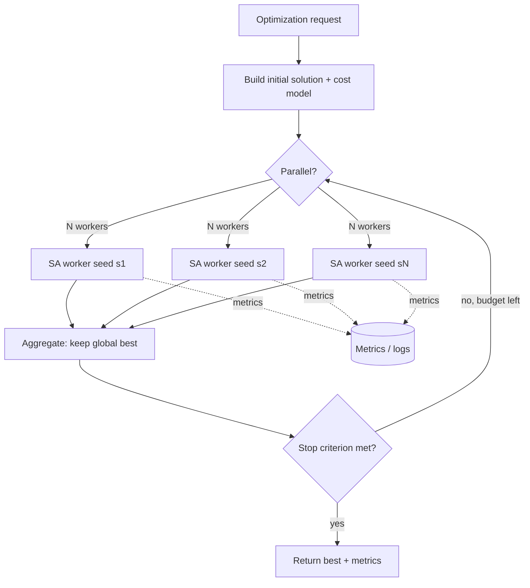
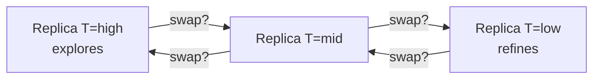

# Simulated Annealing — Senior Level

> **Focus:** SA inside real optimization *systems* — TSP, scheduling, and VLSI placement/routing — with incremental cost models, **restart and parallel SA** strategies, **reproducibility** (seeding, determinism, logging), principled **stopping criteria**, and how to operate SA as a production component (budgets, SLAs, observability, and failure modes).

---

## Table of Contents

1. [Introduction](#introduction)
2. [SA as a System Component](#sa-as-a-system-component)
3. [Real Applications: TSP, Scheduling, VLSI](#real-applications-tsp-scheduling-vlsi)
4. [Incremental Cost Models](#incremental-cost-models)
5. [Restarts and Parallel SA](#restarts-and-parallel-sa)
6. [Reproducibility and Determinism](#reproducibility-and-determinism)
7. [Stopping Criteria](#stopping-criteria)
8. [Comparison with Alternatives](#comparison-with-alternatives)
9. [Code Examples](#code-examples)
10. [Observability](#observability)
11. [Constraint and Penalty Engineering](#constraint-and-penalty-engineering)
12. [Capacity Planning and Benchmarking](#capacity-planning-and-benchmarking)
13. [Failure Modes](#failure-modes)
14. [Summary](#summary)

---

## Introduction

A senior engineer rarely writes SA from scratch in isolation. SA shows up as the **optimization core** of a larger system: a routing service that re-plans delivery tours, a scheduler that assigns jobs to machines under deadlines, or an EDA tool that places millions of cells on a chip. The questions stop being "does my loop accept worse moves?" and become:

- How do I make the cost evaluation cheap enough to do **millions of moves per second** at production scale?
- How do I exploit cores — **parallel / multi-start SA** — within a latency budget?
- How do I make a *stochastic* algorithm **reproducible** for debugging, regression tests, and audits?
- What is a principled **stopping criterion** so I neither stop too early (bad answer) nor burn compute forever?
- How do I monitor SA in production and recognize when it is misbehaving (quenching, stalling, drifting)?

This file treats SA as a dependable, observable system component.

---

## SA as a System Component



The component takes a problem instance, builds a fast **incremental cost model**, fans out independent SA workers (each with its own seed), aggregates their bests, and stops on a budget or convergence signal — emitting metrics throughout. The SA *loop* is small; the engineering is in the cost model, the parallel orchestration, reproducibility, and observability around it.

---

## Real Applications: TSP, Scheduling, VLSI

### Traveling Salesman Problem (TSP)

The canonical SA showcase. State = a tour (permutation of cities). Move = **2-opt** (reverse a segment) or **or-opt** (relocate a short chain). Cost = total tour length. The key is that 2-opt's `Δ` touches only four edges, so each move is `O(1)`:

```
Δ = dist(a,c) + dist(b,d) - dist(a,b) - dist(c,d)
```

SA on TSP routinely reaches within 2–5% of optimal on instances of thousands of cities — far beyond brute force (`O(n!)`) and better than plain 2-opt hill climbing, which stalls at a local minimum.

### Scheduling

State = an assignment of jobs to machines/time-slots. Move = reassign or swap two jobs. Cost = makespan, total tardiness, or a weighted penalty for constraint violations (deadlines, precedences, resource limits). SA handles **soft constraints** gracefully by folding them into the cost as penalties, letting the search temporarily violate them while hot and clean them up while cold. Common in job-shop scheduling, exam timetabling, and crew rostering.

### VLSI placement and routing

The application that put SA on the map (the original `TimberWolf` placer). State = positions of circuit cells on a chip grid. Move = move a cell, or swap two cells. Cost = a weighted sum of estimated wirelength, overlap/congestion penalty, and timing slack. Chips have millions of cells, so the cost model must be **incremental** (only re-evaluate the nets touched by the moved cell) and moves are **windowed** (limit candidate positions, shrinking the window as it cools). SA's ability to escape local minima is essential — greedy placement leaves wirelength on the table.

### Application comparison

| Application | State | Move | Cost | Why SA |
|-------------|-------|------|------|--------|
| TSP | permutation | 2-opt / or-opt | tour length | rugged, `O(1)` Δ, near-optimal |
| Scheduling | job→slot map | reassign / swap | makespan + penalties | soft constraints via penalties |
| VLSI placement | cell positions | move / swap cell | wirelength + congestion | escapes greedy local minima at scale |
| Competitive programming | problem-specific | small mutation | the score to optimize | quick to code, beats brute force under time limit |

---

## Incremental Cost Models

At system scale, **never recompute the full cost per move.** Maintain enough state to compute `Δ` in `O(1)` or `O(deg)`:

- **TSP:** store the tour; 2-opt `Δ` reads four edge distances.
- **Scheduling:** keep per-machine load and per-job tardiness; a reassignment updates only the two affected machines.
- **VLSI:** keep a net→cells index; moving a cell re-evaluates only the bounding boxes of its incident nets.

The pattern is: cost is a sum of **local contributions**; a move changes a *few* contributions; `Δ` is `new_local − old_local` over just those. Apply the move only if accepted, and roll back state if rejected — or compute `Δ` without committing, then commit on acceptance.

```
propose: pick move, compute Δ from local contributions   (no mutation yet)
if accept(Δ, T):  apply(move)   # mutate state + running cost
else:             discard       # nothing to roll back
```

This "compute-then-commit" discipline avoids expensive rollbacks and is the backbone of high-throughput SA.

### Worked incremental model: TSP edges

For TSP, keep the tour as an array `tour[0..n-1]` plus a running `length`. A 2-opt move on indices `i < k` removes edges `(tour[i], tour[i+1])` and `(tour[k], tour[k+1])` and adds `(tour[i], tour[k])` and `(tour[i+1], tour[k+1])`:

```
Δ = d(tour[i],tour[k]) + d(tour[i+1],tour[k+1])
  − d(tour[i],tour[i+1]) − d(tour[k],tour[k+1])
```

Four distance lookups — `O(1)` — regardless of `n`. On acceptance, reverse the segment `tour[i+1..k]` (`O(segment)`, amortized small if you pick nearby `i,k`) and set `length += Δ`. A full `tourLen` recompute is run only once at the end to *assert* the incremental running total stayed exact (a cheap, vital correctness guard against drift from floating-point accumulation).

### Floating-point drift in running totals

A subtle production bug: maintaining `length += Δ` over millions of moves accumulates floating-point error. Two defenses: (1) periodically (every `K` accepted moves) recompute `length` from scratch to resynchronize; (2) use integer or fixed-point costs where the problem allows (e.g. integer-rounded distances), making the running total *exact*. The end-of-run assertion catches drift; the periodic resync prevents it from steering acceptance decisions.

---

## Restarts and Parallel SA

A single SA trajectory can land in a poor basin. Two complementary remedies:

### Restarts (sequential)

Run SA `R` times from different random starts/seeds; keep the global best. Cheap insurance against an unlucky run. Budget split: many short runs (more diversity) vs few long runs (deeper convergence) — tune to the landscape.

### Parallel SA

| Scheme | Description | Pros / Cons |
|--------|-------------|-------------|
| **Independent multi-start** | `N` workers, different seeds, no communication; take best at end | Embarrassingly parallel, trivial; no info sharing |
| **Periodic best-sharing** | Workers occasionally broadcast their best; laggards adopt it | Faster convergence; needs sync points |
| **Coupled / replica-exchange (parallel tempering)** | `N` replicas at *different* temperatures; periodically swap configurations between adjacent temperatures | Strong on rugged landscapes; more complex |
| **Speculative / move-level parallel** | Parallelize the cost evaluation or evaluate several candidate moves at once | Helps when a single move's `Δ` is expensive |

**Parallel tempering (replica exchange)** is the most powerful general scheme: keep replicas spanning hot→cold, let hot replicas explore and cold replicas refine, and swap configurations with a Metropolis-like criterion so a good configuration found by a hot replica can migrate to a cold one. It often dominates plain multi-start on hard landscapes.



---

## Reproducibility and Determinism

SA is stochastic, but production SA must be **reproducible** — for debugging, regression tests, A/B comparisons, and audits.

- **Seed every RNG explicitly.** Record the seed(s) with the result. Same seed + same code + same input ⇒ same output.
- **Per-worker seeds.** In parallel SA, derive each worker's seed deterministically from a master seed (e.g. `seed_i = hash(master, i)`), so the whole multi-start run is reproducible.
- **Beware nondeterministic reductions.** Floating-point sums over threads can reorder; if exact reproduction matters, aggregate deterministically (fixed order) or use integer/fixed-point costs.
- **Pin library/runtime versions.** A different `exp`/RNG implementation changes the trajectory.
- **Log enough to replay:** seed, parameters (`T0, α, T_min, iterations`), input hash, and final best cost. A stored seed lets you re-run the *exact* trajectory to inspect a regression.
- **Separate "reproducible" from "diverse."** In production you may *want* fresh randomness for diversity; keep a flag to force a fixed seed for tests.

---

## Stopping Criteria

When to stop matters as much as how to search. Common criteria (often combined):

| Criterion | Stop when | Notes |
|-----------|-----------|-------|
| Temperature floor | `T < T_min` | The standard; pairs with geometric cooling |
| Iteration / time budget | `iters ≥ I` or wall-clock exceeded | SA is *anytime*; hard SLA cap |
| Stagnation | no improvement in last `K` iterations | Detects convergence; can trigger restart/reheat |
| Acceptance-rate floor | accept rate `< ε` for a stretch | System has effectively frozen |
| Target reached | `best_cost ≤ target` (e.g. known bound) | When a good-enough threshold exists |

A robust production policy: **stop on the earliest of** (a) time budget, (b) temperature floor, or (c) stagnation for `K` iterations — and if stagnation triggers with budget remaining, **reheat or restart** rather than quitting.

### Latency budgets and SLAs

In a request/response service, SA's *anytime* property is a gift: bind it to a hard wall-clock deadline (e.g. "return the best tour found within 200 ms"). Size the iteration budget from a one-time calibration (`iterations_per_ms × deadline_ms`), and choose `α` so cooling spans that budget. If the deadline is variable (e.g. you have spare time when load is low), let the worker keep improving `best` and only harvest it when the deadline arrives. Always return *something* — the initial greedy solution is the floor, and `best` only improves from there. Pair the budget with a small safety margin so serialization/network time does not blow the SLA.

---

## Comparison with Alternatives

| Attribute | Simulated annealing | Genetic algorithm | Tabu search | OR-Tools / MILP solver |
|-----------|---------------------|-------------------|-------------|------------------------|
| Memory | O(1) per worker | O(population) | O(recent-move list) | large |
| Parallelism | trivial multi-start; tempering | natural (population) | harder | solver-internal |
| Tuning burden | moderate (`T0, α`) | high (pop, crossover, mutation) | moderate (tabu tenure) | low (declarative) |
| Optimality | near-optimal, no certificate | near-optimal | near-optimal | **proven optimal** (if it finishes) |
| Best at | rugged continuous/combinatorial | recombinable structure | structured combinatorial | problems with exploitable structure |

In production, the senior call is often: *if a MILP/CP solver can model and solve it in budget, use it (you get a certificate); otherwise reach for a metaheuristic, and SA is the simplest strong default.* SA also pairs well as a **post-optimizer** on a solver's or heuristic's output.

---

## Code Examples

### Parallel multi-start SA for TSP with incremental 2-opt

This runs `N` independent SA workers (deterministic per-worker seeds), each using incremental 2-opt `Δ`, and returns the global best tour.

#### Go

```go
package main

import (
	"fmt"
	"math"
	"math/rand"
	"sync"
)

type Point struct{ X, Y float64 }

func dist(a, b Point) float64 {
	return math.Hypot(a.X-b.X, a.Y-b.Y)
}

func tourLen(pts []Point, tour []int) float64 {
	s := 0.0
	for i := range tour {
		s += dist(pts[tour[i]], pts[tour[(i+1)%len(tour)]])
	}
	return s
}

// saWorker runs one SA trajectory with incremental 2-opt deltas.
func saWorker(pts []Point, seed int64) ([]int, float64) {
	rng := rand.New(rand.NewSource(seed))
	n := len(pts)
	tour := rng.Perm(n)
	cur := tourLen(pts, tour)
	best := append([]int(nil), tour...)
	bestLen := cur

	T, Tmin, alpha := cur/float64(n), 1e-4, 0.9995
	for T > Tmin {
		i := rng.Intn(n)
		k := rng.Intn(n)
		if i == k {
			continue
		}
		if i > k {
			i, k = k, i
		}
		a, b := tour[i], tour[(i+1)%n]
		c, d := tour[k], tour[(k+1)%n]
		delta := dist(pts[a], pts[c]) + dist(pts[b], pts[d]) -
			dist(pts[a], pts[b]) - dist(pts[c], pts[d])
		if delta <= 0 || rng.Float64() < math.Exp(-delta/T) {
			// reverse segment i+1..k
			for l, r := i+1, k; l < r; l, r = l+1, r-1 {
				tour[l], tour[r] = tour[r], tour[l]
			}
			cur += delta
			if cur < bestLen {
				bestLen = cur
				copy(best, tour)
			}
		}
		T *= alpha
	}
	return best, bestLen
}

func parallelSA(pts []Point, workers int) ([]int, float64) {
	var mu sync.Mutex
	var wg sync.WaitGroup
	bestLen := math.Inf(1)
	var bestTour []int
	for w := 0; w < workers; w++ {
		wg.Add(1)
		go func(seed int64) {
			defer wg.Done()
			t, l := saWorker(pts, seed)
			mu.Lock()
			if l < bestLen {
				bestLen, bestTour = l, t
			}
			mu.Unlock()
		}(int64(1000 + w)) // deterministic per-worker seeds
	}
	wg.Wait()
	return bestTour, bestLen
}

func main() {
	pts := []Point{{0, 0}, {1, 5}, {5, 2}, {6, 6}, {2, 3}, {8, 1}, {3, 7}, {7, 4}}
	_, l := parallelSA(pts, 8)
	fmt.Printf("best tour length = %.4f\n", l)
}
```

#### Java

```java
import java.util.*;
import java.util.concurrent.*;

public class ParallelSATsp {
    record Point(double x, double y) {}

    static double dist(Point a, Point b) {
        return Math.hypot(a.x() - b.x(), a.y() - b.y());
    }

    static double tourLen(Point[] p, int[] t) {
        double s = 0;
        for (int i = 0; i < t.length; i++)
            s += dist(p[t[i]], p[t[(i + 1) % t.length]]);
        return s;
    }

    static double[] saWorker(Point[] p, long seed, int[] outBest) {
        Random rng = new Random(seed);
        int n = p.length;
        int[] tour = new int[n];
        for (int i = 0; i < n; i++) tour[i] = i;
        for (int i = n - 1; i > 0; i--) { int j = rng.nextInt(i + 1); int tmp = tour[i]; tour[i] = tour[j]; tour[j] = tmp; }
        double cur = tourLen(p, tour), best = cur;
        System.arraycopy(tour, 0, outBest, 0, n);
        double T = cur / n, Tmin = 1e-4, alpha = 0.9995;
        while (T > Tmin) {
            int i = rng.nextInt(n), k = rng.nextInt(n);
            if (i == k) { T *= alpha; continue; }
            if (i > k) { int s = i; i = k; k = s; }
            int a = tour[i], b = tour[(i + 1) % n], c = tour[k], d = tour[(k + 1) % n];
            double delta = dist(p[a], p[c]) + dist(p[b], p[d]) - dist(p[a], p[b]) - dist(p[c], p[d]);
            if (delta <= 0 || rng.nextDouble() < Math.exp(-delta / T)) {
                for (int l = i + 1, r = k; l < r; l++, r--) { int tmp = tour[l]; tour[l] = tour[r]; tour[r] = tmp; }
                cur += delta;
                if (cur < best) { best = cur; System.arraycopy(tour, 0, outBest, 0, n); }
            }
            T *= alpha;
        }
        return new double[]{best};
    }

    public static void main(String[] args) throws Exception {
        Point[] p = {new Point(0,0), new Point(1,5), new Point(5,2), new Point(6,6),
                     new Point(2,3), new Point(8,1), new Point(3,7), new Point(7,4)};
        int workers = 8;
        ExecutorService ex = Executors.newFixedThreadPool(workers);
        List<Future<double[]>> fs = new ArrayList<>();
        int[][] bests = new int[workers][p.length];
        for (int w = 0; w < workers; w++) {
            final int ww = w;
            fs.add(ex.submit(() -> saWorker(p, 1000 + ww, bests[ww])));
        }
        double best = Double.MAX_VALUE;
        for (Future<double[]> f : fs) best = Math.min(best, f.get()[0]);
        ex.shutdown();
        System.out.printf("best tour length = %.4f%n", best);
    }
}
```

#### Python

```python
import math
import random
from concurrent.futures import ProcessPoolExecutor


def dist(a, b):
    return math.hypot(a[0] - b[0], a[1] - b[1])


def tour_len(pts, tour):
    return sum(dist(pts[tour[i]], pts[tour[(i + 1) % len(tour)]])
               for i in range(len(tour)))


def sa_worker(args):
    pts, seed = args
    rng = random.Random(seed)
    n = len(pts)
    tour = list(range(n))
    rng.shuffle(tour)
    cur = tour_len(pts, tour)
    best, best_len = tour[:], cur
    T, Tmin, alpha = cur / n, 1e-4, 0.9995
    while T > Tmin:
        i, k = rng.randrange(n), rng.randrange(n)
        if i == k:
            T *= alpha
            continue
        if i > k:
            i, k = k, i
        a, b = tour[i], tour[(i + 1) % n]
        c, d = tour[k], tour[(k + 1) % n]
        delta = (dist(pts[a], pts[c]) + dist(pts[b], pts[d])
                 - dist(pts[a], pts[b]) - dist(pts[c], pts[d]))
        if delta <= 0 or rng.random() < math.exp(-delta / T):
            tour[i + 1:k + 1] = reversed(tour[i + 1:k + 1])  # 2-opt reverse
            cur += delta
            if cur < best_len:
                best_len, best = cur, tour[:]
        T *= alpha
    return best_len, best


def parallel_sa(pts, workers=8):
    seeds = [(pts, 1000 + w) for w in range(workers)]   # deterministic seeds
    with ProcessPoolExecutor() as ex:
        results = list(ex.map(sa_worker, seeds))
    return min(results, key=lambda r: r[0])


if __name__ == "__main__":
    pts = [(0, 0), (1, 5), (5, 2), (6, 6), (2, 3), (8, 1), (3, 7), (7, 4)]
    best_len, _ = parallel_sa(pts, 8)
    print(f"best tour length = {best_len:.4f}")
```

Each worker keeps a running `cur` updated by `Δ` (never recomputing the whole tour), uses a deterministic seed for reproducibility, and the orchestrator keeps the global best — the standard production shape of multi-start SA.

---

## Observability

| Metric | What it tells you | Alert / action |
|--------|-------------------|----------------|
| `acceptance_rate` (windowed) | exploration vs exploitation phase | should glide ~0.8 → ~0; crashes early ⇒ quenching |
| `best_cost` over time | convergence curve | flatlining early ⇒ stuck; reheat/restart |
| `current_cost` variance | how much it is still wandering | high late ⇒ cooled too slowly |
| `iterations_per_sec` | throughput | drops ⇒ cost model not incremental |
| `temperature` | schedule progress | sanity-check it reaches `T_min` |
| `improvements_since` | stagnation counter | exceeds `K` ⇒ trigger restart/reheat |
| `seed` / params | reproducibility | log with every result |

Plot `best_cost` and `acceptance_rate` together — the shape of those two curves diagnoses almost every SA misconfiguration at a glance.

---

## Constraint and Penalty Engineering

Real optimization problems are rarely "minimize a clean cost" — they are "minimize a cost *subject to* constraints." How you encode those constraints into the SA cost function is one of the highest-leverage senior decisions.

### Hard constraints: two encodings

| Strategy | How | Pros | Cons |
|----------|-----|------|------|
| **Feasible-only moves** | Design the move set so every neighbor is valid (e.g. swap two jobs → schedule stays a permutation) | No infeasible states ever; `Δ` is pure objective | Move design can be hard; may disconnect the space |
| **Penalty terms** | Add `λ · violation` to the cost; let SA wander infeasible while hot | Simple, flexible, handles many constraints | Must tune `λ`; final solution may be slightly infeasible |

The penalty approach turns a constrained problem into an unconstrained one: `cost = objective + Σ λ_i · violation_i`. While hot, SA tolerates violations (exploring through infeasible regions to reach better feasible ones); while cold, the penalty dominates and violations are squeezed out.

### Tuning penalty weights `λ`

The classic failure: a `λ` too small leaves the final solution infeasible; too large makes the penalty a wall SA cannot climb over, fragmenting the search into disconnected feasible islands. Two robust techniques:

- **Static balancing:** set each `λ_i` so a *single* typical violation costs roughly as much as a typical objective `Δ` — keeping the two terms on the same scale so neither dominates spuriously.
- **Adaptive penalties:** start `λ` small (let SA roam) and *increase* it as `T` falls (or when too many recent states were infeasible), so feasibility is enforced progressively. This mirrors the temperature sweep: explore the relaxed problem hot, enforce constraints cold.

A practical guard: always check feasibility of the returned `best` and, if it is infeasible, run a short feasibility-repair local search (greedy moves that only reduce violations) as a post-step.

**Worked penalty example (machine scheduling).** Objective: minimize makespan (typical `Δ` ≈ 20 time-units per swap). Constraint: no machine exceeds its capacity (a violation of 1 over-allocated unit). To keep the two on the same scale, set `λ_capacity ≈ 20` so one unit of over-capacity costs as much as a typical makespan change — SA will tolerate a small overflow while hot but never "prefer" a heavily-infeasible schedule. If the final `best` still overflows by a unit or two, the repair step reassigns the offending jobs to the least-loaded feasible machine. Had `λ` been set to, say, `1`, SA would happily return a fast-but-infeasible schedule; at `λ = 10000` the feasible region would be walled off and SA could never tunnel through a transiently-infeasible state to reach a better feasible one.

### Multi-objective costs

When several objectives compete (wirelength *and* timing; makespan *and* energy), the usual SA approach is a **weighted sum** `Σ w_j · obj_j`, which finds one point on the Pareto front per weight vector. To trace the front, sweep the weights across runs (or use the same SA core inside an outer multi-objective loop). Keep the weights on comparable scales — normalize each objective by its typical magnitude — so the search is not silently dominated by the largest-magnitude term.

---

## Capacity Planning and Benchmarking

Operating SA as a service means knowing, before you ship, *how good an answer you can get in the time you have*.

1. **Calibrate throughput.** Measure `iterations_per_second` on representative instances and hardware. With an incremental `Δ`, expect 10^6–10^7 iterations/sec for small combinatorial moves.
2. **Map budget → quality.** Run a one-time experiment: for a range of iteration budgets, record the best cost (averaged over seeds). The resulting curve — steep early, flat tail — tells you the marginal value of more compute.
3. **Set the SLA from the curve.** Pick the budget where the curve flattens ("knee"); spending past it buys little. Bind `α` so cooling spans that budget.
4. **Regression-benchmark.** Keep a fixed seed + fixed instance suite in CI; alert if the best cost regresses beyond a tolerance after a code change. SA's stochasticity makes a *pinned-seed* benchmark essential — otherwise quality drift hides in noise.
5. **Track tail latency, not just mean.** A request/response SA service must honor the deadline on the slow path too; size the budget against p99 of `iterations_per_second`, leaving a serialization margin.

| Decision | Driven by |
|----------|-----------|
| Iteration budget per request | throughput × deadline (minus margin) |
| `α` | budget (span `T0→T_min` over it) |
| Number of parallel workers | cores available, diversity needed |
| When to stop early | budget / temperature floor / stagnation |
| Quality SLO | the budget→quality knee curve |

---

## Failure Modes

- **Quenching:** cooled too fast → frozen in a poor local minimum. *Fix:* raise `α` toward 1, raise `T0`, or reheat.
- **Drifting:** cooled too slowly → never settles within budget. *Fix:* lower `α`, add a stagnation/time stop.
- **Expensive cost model:** non-incremental `Δ` starves the iteration count. *Fix:* compute-then-commit incremental `Δ`.
- **Trapped despite restarts:** landscape too rugged for independent multi-start. *Fix:* parallel tempering / best-sharing.
- **Nondeterministic results:** unseeded or thread-reordered floating-point reductions. *Fix:* explicit seeds, deterministic aggregation, fixed-point cost.
- **Returning `current` not `best`:** silent quality loss. *Fix:* always harvest `best`.
- **Unbounded runtime:** no stopping criterion. *Fix:* combine time budget + temperature floor + stagnation.

### Production readiness checklist

Before an SA solver goes on the critical path, confirm each line — every item maps to a failure mode above:

| Check | Why it matters |
|---|---|
| Incremental `Δ` cost (no full recompute) | Throughput; full recompute silently caps move rate |
| `best` harvested separately from `current` | Prevents silent end-of-run quality loss |
| Explicit seed + per-worker derivation logged | Reproducibility and incident replay |
| Stopping = time budget ∧ temp floor ∧ stagnation | Bounds latency without premature quench |
| `best_cost` + `acceptance_rate` emitted as metrics | Diagnose quenching/drift before users do |

If any row is unchecked, the solver is a prototype, not a service.

---

## Summary

At senior level SA is an **optimization component**, not a snippet. The engineering that makes it production-grade lives *around* the loop: an **incremental cost model** (compute-then-commit `Δ`) for high throughput; **multi-start and parallel SA** — up to **parallel tempering** — to beat unlucky single trajectories; **reproducibility** via explicit seeds, deterministic per-worker seeding, and replay logging; and **robust stopping** that combines time budget, temperature floor, and stagnation (with reheat/restart on stalls). It powers TSP routing, scheduling with soft-constraint penalties, and VLSI placement/routing at scale, and it slots in as a strong, simple default whenever an exact solver cannot finish in budget. Operate it with **observability** — watch the `best_cost` and `acceptance_rate` curves — and you can diagnose quenching, drifting, and stalls before they cost you.

---

**Next step:** Continue to [`professional.md`](./professional.md) for the convergence theory — the Markov-chain / Metropolis-Hastings view, the Boltzmann stationary distribution, the logarithmic-cooling global-convergence guarantee, complexity, and a formal comparison to other metaheuristics.
