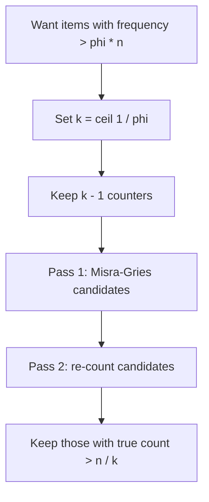

# Misra-Gries Heavy Hitters — Junior Level

> **One-line summary:** To find the items that appear *very often* in a huge stream using almost no memory, keep just `k-1` labelled counters. For each item: if it already has a counter, add 1; if a counter is free, claim it; otherwise **decrement every counter by 1** (and drop any that hit zero). After one pass, the counters hold every item whose true frequency is above `n/k` — the famous Boyer-Moore majority vote is exactly the `k = 2` case.

---

## Table of Contents

1. [Introduction](#introduction)
2. [Prerequisites](#prerequisites)
3. [Glossary](#glossary)
4. [Core Concepts](#core-concepts)
5. [Big-O Summary](#big-o-summary)
6. [Real-World Analogies](#real-world-analogies)
7. [Pros & Cons](#pros--cons)
8. [Step-by-Step Walkthrough](#step-by-step-walkthrough)
9. [Code Examples](#code-examples)
10. [Coding Patterns](#coding-patterns)
11. [Error Handling](#error-handling)
12. [Performance Tips](#performance-tips)
13. [Best Practices](#best-practices)
14. [Edge Cases & Pitfalls](#edge-cases--pitfalls)
15. [Common Mistakes](#common-mistakes)
16. [Cheat Sheet](#cheat-sheet)
17. [Visual Animation](#visual-animation)
18. [Summary](#summary)
19. [Further Reading](#further-reading)

---

## Introduction

Imagine a firehose of data flying past you: every URL requested from a website, every packet on a network link, every word in a stream of tweets. You want to answer one simple-sounding question: *which items appear really often?* The "really often" items are called **heavy hitters** or **frequent items**.

The obvious approach is to keep a counter for **every distinct item** in a hash map and increment as you go. That works, but the memory cost is `O(distinct items)`. On a stream with billions of distinct URLs or IP addresses, that hash map does not fit in RAM. We need something that uses a *fixed, tiny* amount of memory no matter how many distinct items show up.

**Misra-Gries** does exactly that. You decide up front you want to find items appearing more than a `1/k` fraction of the time — for example, more than `1/100` of all items. The algorithm keeps only `k - 1` counters, makes **one single pass** over the stream, and at the end the surviving counters are *guaranteed* to include every item whose true frequency exceeds `n/k` (where `n` is the total number of items seen). It never misses a real heavy hitter. The price is that the counts it reports may be *undercounts* — and a few items that are not actually heavy can sneak into the table — so usually a quick second pass (or a known total) is used to confirm the true winners.

The heart of the algorithm is one strange-looking rule: **when a new item arrives and all counters are full, decrement every counter by one** (and remove any that reach zero). That single "decrement-all" move is what keeps memory bounded while preserving the heavy hitters. The most famous special case is the **Boyer-Moore majority vote** algorithm — the trick for finding an element that appears more than half the time — which is precisely Misra-Gries with `k = 2` (one counter). This file builds the whole picture from that majority-vote seed.

---

## Prerequisites

Before reading this file you should be comfortable with:

- **Basic programming** — loops, functions, arrays, and a hash map / dictionary (in any of Go/Java/Python).
- **The idea of a stream** — data arriving one item at a time, which you see once and (usually) cannot store all of.
- **Frequency / counting** — how many times each value appears.
- **Fractions and thresholds** — what "more than `n/k`" means (`n` = total items, `k` = chosen parameter).
- **Big-O notation** — `O(1)`, `O(k)`, `O(n)`.

Optional but helpful:

- A glance at the **Boyer-Moore majority vote** algorithm (find an element appearing more than half the time). Misra-Gries generalizes it.
- The notion that some algorithms give **approximate** answers in exchange for tiny memory.

---

## Glossary

| Term | Meaning |
|------|---------|
| **Stream** | A long sequence of items seen one at a time, often too large to store fully. |
| **`n`** | The total number of items processed (the stream length). |
| **`k`** | The chosen parameter: we look for items with frequency `> n/k`. We keep `k - 1` counters. |
| **Frequency** | The true number of times an item appears in the stream. Written `f(x)` for item `x`. |
| **Heavy hitter / frequent item** | An item whose true frequency exceeds the threshold `n/k`. |
| **Counter / slot** | One `(item, count)` pair in the small fixed-size table. There are `k - 1` of them. |
| **Decrement-all** | The rule: when a new (untracked) item arrives and all slots are full, subtract 1 from *every* counter. |
| **Estimate** | The count Misra-Gries reports for an item. It may be *less than or equal to* the true frequency. |
| **Undercount error** | The gap between the true frequency and the estimate; Misra-Gries guarantees it is at most `n/k`. |
| **False positive** | An item the table reports that is *not* actually a heavy hitter. A second pass removes these. |
| **Majority element** | An item appearing more than `n/2` times; finding it is Misra-Gries with `k = 2`. |

---

## Core Concepts

### 1. The problem: frequent items in one pass, tiny memory

We see `n` items stream past. We want all items `x` with `f(x) > n/k`. There can be at most `k - 1` such items (if `k` items each had frequency `> n/k`, the total would exceed `n` — impossible). So the *answer set is small*, and intuitively we should not need more than about `k - 1` slots of memory to track candidates.

### 2. Boyer-Moore majority vote (the `k = 2` seed)

The classic "majority vote" question: an array has an element appearing **more than half** the time; find it in `O(1)` extra space. The trick keeps one **candidate** and one **count**:

- If `count == 0`, adopt the current item as the candidate, set `count = 1`.
- Else if the current item equals the candidate, `count++`.
- Else `count--`.

After one pass the candidate is the majority element (if one exists). The intuition: each non-candidate item "cancels" one candidate vote; a true majority survives all the cancellations. **This is Misra-Gries with `k = 2`** — one counter, and "decrement-all" is just "decrement the single count."

### 3. Misra-Gries: generalize to `k - 1` counters

Misra-Gries keeps a small table of up to `k - 1` `(item, count)` pairs. Process each item `x`:

1. **If `x` is already in the table** → increment its count.
2. **Else if the table has fewer than `k - 1` entries** → add `x` with count `1`.
3. **Else (table is full of *other* items)** → **decrement every count by 1**, and delete any entry whose count drops to `0`.

That is the entire algorithm. One pass, `O(k)` space.

### 4. The decrement-all rule (why it works)

The "decrement-all" step is the generalization of the majority-vote's `count--`. When a brand-new item shows up and there is no room, we treat it as cancelling one occurrence of each tracked item — and the new item also cancels itself (it never gets stored). So each decrement-all event throws away `k` distinct occurrences at once (one from each of the `k - 1` counters plus the unstored newcomer). Because each such event consumes `k` items, it can happen at most `n/k` times. That bounds how much any item's count can be pushed down — by at most `n/k`. So a truly frequent item (`f(x) > n/k`) cannot be fully cancelled and **must survive** in the table.

### 5. The undercount guarantee

For every item `x`, let `est(x)` be its count in the final table (0 if absent). Misra-Gries guarantees:

```
f(x) - n/k  ≤  est(x)  ≤  f(x)
```

The estimate never *overcounts* (it can only lose occurrences to decrements), and it undercounts by at most `n/k`. Consequence: **any item with `f(x) > n/k` ends up in the table** (its estimate is at least `f(x) - n/k > 0`). That is the "no false negatives" promise.

### 6. False positives and the second pass

The flip side: an item in the table is only a *candidate*. Some items with frequency below `n/k` can still appear (their estimate is non-zero but small). To get the *exact* heavy hitters, do a **second pass**: re-scan the stream counting only the `≤ k - 1` candidates, then keep those whose true count actually exceeds the threshold. If you already know the exact totals (or accept approximate answers), you can skip the second pass.

### 7. Why only `k - 1` counters are needed

It is worth seeing *why* `k - 1` slots is exactly the right budget — not a tuning choice. Suppose there were `k` different items each appearing more than `n/k` times. Adding up their counts:

```
k items × (more than n/k each)  =  more than k × (n/k)  =  more than n.
```

But the stream only has `n` items total — a contradiction. So **at most `k - 1` items can be heavy hitters**. The `k - 1` counters can therefore hold every possible heavy hitter at once, with one fewer slot than `k` (the missing slot is exactly what forces a decrement-all when a genuinely new item arrives, driving the cancellation that keeps memory bounded).

---

## Big-O Summary

| Operation | Time | Space | Notes |
|-----------|------|-------|-------|
| Process one item (hash-map table) | **O(1)** amortized | — | Lookup/insert/increment is `O(1)`; decrement-all is `O(k)` but amortized over many items it averages `O(1)`. |
| Process one item (worst case) | **O(k)** | — | A decrement-all touches all `k - 1` counters. |
| Whole first pass | **O(n)** amortized | — | Each item triggers `O(1)` amortized work. |
| Space (the table) | — | **O(k)** | Just `k - 1` `(item, count)` pairs — independent of stream length or distinct count. |
| Second (verification) pass | O(n) | O(k) | Re-count only the candidates to remove false positives. |
| Naive exact counting (hash all items) | O(n) | **O(distinct items)** | Correct but memory blows up on big streams. |

The headline win is **space**: `O(k)`, fixed and tiny, versus `O(distinct items)` for a full hash map. You trade exactness for memory — Misra-Gries gives approximate counts (bounded undercount) in one pass.

---

## Real-World Analogies

| Concept | Analogy |
|---------|---------|
| The stream | A conveyor belt of voting ballots flying past too fast to keep them all. |
| `k - 1` counters | A small tally board with only `k - 1` chalk lines you can track at once. |
| Increment / claim a slot | A familiar candidate gets a tally mark; a new candidate takes an empty board slot. |
| Decrement-all | When an unknown candidate appears and the board is full, *every* tallied candidate loses one mark — and the newcomer is ignored. It is like pairwise vote cancellation across all candidates at once. |
| Surviving counters | The candidates with enough genuine support to outlast all the cancellations. |
| Undercount | The board may understate a candidate's true votes (some were cancelled), but never overstates. |
| Second pass | A recount of just the finalists to confirm who really cleared the bar. |

Where the analogy breaks: real elections never "cancel" votes across all candidates simultaneously. Decrement-all is a clever accounting trick, not a real-world voting rule — but it is exactly what keeps memory bounded while protecting the true heavy hitters.

---

## Pros & Cons

| Pros | Cons |
|------|------|
| **Tiny, fixed memory:** `O(k)` regardless of stream size or number of distinct items. | Returns **approximate** counts (undercount up to `n/k`), not exact frequencies. |
| **One pass**, `O(1)` amortized per item — streaming-friendly. | Can include **false positives** (non-heavy items in the table) without a second pass. |
| **No false negatives:** every true heavy hitter (`f > n/k`) is guaranteed in the table. | A decrement-all step is `O(k)`; worst-case per-item cost is `O(k)`. |
| **Deterministic** — no randomness, same output every run. | Needs a second pass (or known totals) for *exact* heavy hitters. |
| **Mergeable:** summaries from parallel streams can be combined (see senior level). | Only finds items above a *fraction* threshold; cannot rank everything. |
| Simple to implement — a hash map plus the three-rule update. | Choosing `k` requires knowing/estimating the threshold you care about. |

**When to use:** finding the most frequent items in a massive or unbounded stream with bounded memory — network monitoring, trending topics, log analysis, DDoS detection, query optimization.

**When NOT to use:** when you need *exact* counts for *all* items (use a full hash map if it fits); when you need per-item counts rather than just the top fraction; when overcounting (rather than undercounting) is acceptable and you prefer Count-Min Sketch's different error profile.

---

## Step-by-Step Walkthrough

Let us run Misra-Gries with **`k = 3`** (so `k - 1 = 2` counters) on the stream:

```
A B A C C A B D A
```

We look for items with frequency `> n/k = 9/3 = 3`. (Here `n = 9`.) True frequencies: `A = 4`, `B = 2`, `C = 2`, `D = 1`. Only `A` is a true heavy hitter.

| Step | Item | Action | Table after |
|------|------|--------|-------------|
| 1 | `A` | empty slot → add | `{A:1}` |
| 2 | `B` | empty slot → add | `{A:1, B:1}` |
| 3 | `A` | already tracked → +1 | `{A:2, B:1}` |
| 4 | `C` | table full, `C` not tracked → **decrement all** | `{A:1}` (B dropped to 0) |
| 5 | `C` | empty slot → add | `{A:1, C:1}` |
| 6 | `A` | already tracked → +1 | `{A:2, C:1}` |
| 7 | `B` | table full, `B` not tracked → **decrement all** | `{A:1}` (C dropped to 0) |
| 8 | `D` | empty slot → add | `{A:1, D:1}` |
| 9 | `A` | already tracked → +1 | `{A:2, D:1}` |

**Final table:** `{A:2, D:1}`.

Observe:
- `A` is present with estimate `2`. True `f(A) = 4`, so it undercounts by `2`, which is within the bound `n/k = 3`. Good — and `A` is the real heavy hitter, correctly retained.
- `D` is a **false positive**: estimate `1`, true frequency `1`, well below the threshold of `3`. A second pass would re-count `A` and `D` exactly (`A=4 > 3` ✓, `D=1 ≤ 3` ✗) and keep only `A`.
- We never used more than 2 counters, no matter the stream length.

There were 2 decrement-all events; since each consumes `k = 3` items, that accounts for `2 × 3 = 6` items, consistent with `n/k = 3` being the *maximum* possible number of such events (we had fewer).

**Example B — the majority case (`k = 2`, one counter).**

Run on `X X Y X Z X X` with `k = 2` (so 1 counter). Threshold `n/k = 7/2 = 3.5`. True frequencies: `X = 5`, `Y = 1`, `Z = 1`. `X` is the majority element.

| Step | Item | Action | Counter after |
|------|------|--------|---------------|
| 1 | `X` | empty → claim | `{X:1}` |
| 2 | `X` | tracked → +1 | `{X:2}` |
| 3 | `Y` | full, not tracked → decrement-all | `{X:1}` |
| 4 | `X` | tracked → +1 | `{X:2}` |
| 5 | `Z` | full, not tracked → decrement-all | `{X:1}` |
| 6 | `X` | tracked → +1 | `{X:2}` |
| 7 | `X` | tracked → +1 | `{X:3}` |

Final: `{X:3}`. `X` is correctly the surviving candidate — exactly the Boyer-Moore majority vote. The estimate `3` undercounts the true `f(X) = 5` by `2`, within the bound `n/k = 3.5`. Notice the single counter and the `count--` on a mismatch: this is the `k = 2` instance of decrement-all. A majority element (`> n/2`) always survives because fewer than half the items can cancel it.

---

## Code Examples

### Example: Misra-Gries first pass (find candidates)

This processes a stream and returns the candidate table. We use a hash map for `O(1)` lookups; `k` is the parameter (`k - 1` counters).

#### Go

```go
package main

import "fmt"

// MisraGries returns up to k-1 candidate items with their (undercounted) estimates.
// Any item with true frequency > n/k is guaranteed to be in the result.
func MisraGries(stream []string, k int) map[string]int {
	counters := make(map[string]int) // at most k-1 entries
	for _, x := range stream {
		if _, ok := counters[x]; ok {
			counters[x]++ // rule 1: already tracked
		} else if len(counters) < k-1 {
			counters[x] = 1 // rule 2: free slot
		} else {
			// rule 3: decrement-all, drop zeros
			for key := range counters {
				counters[key]--
				if counters[key] == 0 {
					delete(counters, key)
				}
			}
		}
	}
	return counters
}

func main() {
	stream := []string{"A", "B", "A", "C", "C", "A", "B", "D", "A"}
	fmt.Println(MisraGries(stream, 3)) // candidates, e.g. map[A:2 D:1]
}
```

#### Java

```java
import java.util.*;

public class MisraGries {
    // Returns up to k-1 candidates with undercounted estimates.
    static Map<String, Integer> misraGries(List<String> stream, int k) {
        Map<String, Integer> counters = new HashMap<>();
        for (String x : stream) {
            if (counters.containsKey(x)) {
                counters.put(x, counters.get(x) + 1);     // rule 1
            } else if (counters.size() < k - 1) {
                counters.put(x, 1);                        // rule 2
            } else {
                // rule 3: decrement-all, drop zeros
                Iterator<Map.Entry<String, Integer>> it = counters.entrySet().iterator();
                while (it.hasNext()) {
                    Map.Entry<String, Integer> e = it.next();
                    if (e.getValue() == 1) it.remove();
                    else e.setValue(e.getValue() - 1);
                }
            }
        }
        return counters;
    }

    public static void main(String[] args) {
        List<String> stream = Arrays.asList("A", "B", "A", "C", "C", "A", "B", "D", "A");
        System.out.println(misraGries(stream, 3)); // e.g. {A=2, D=1}
    }
}
```

#### Python

```python
def misra_gries(stream, k):
    """Return up to k-1 candidates with undercounted estimates.
    Any item with true frequency > n/k is guaranteed to be present."""
    counters = {}                       # at most k-1 entries
    for x in stream:
        if x in counters:
            counters[x] += 1            # rule 1: already tracked
        elif len(counters) < k - 1:
            counters[x] = 1             # rule 2: free slot
        else:
            # rule 3: decrement-all, drop zeros
            for key in list(counters):
                counters[key] -= 1
                if counters[key] == 0:
                    del counters[key]
    return counters


if __name__ == "__main__":
    stream = ["A", "B", "A", "C", "C", "A", "B", "D", "A"]
    print(misra_gries(stream, 3))       # e.g. {'A': 2, 'D': 1}
```

**What it does:** runs the three-rule update over the stream and returns the surviving counters. These are *candidates*: every true heavy hitter is here, but some non-heavy items may be too.
**Run:** `go run main.go` | `javac MisraGries.java && java MisraGries` | `python mg.py`

---

## Coding Patterns

### Pattern 1: Boyer-Moore majority (the `k = 2` special case)

**Intent:** Find an element appearing more than `n/2` times using one counter — Misra-Gries with a single slot.

```python
def majority(stream):
    candidate, count = None, 0
    for x in stream:
        if count == 0:
            candidate, count = x, 1
        elif x == candidate:
            count += 1
        else:
            count -= 1          # "decrement-all" over one counter
    return candidate            # verify with a second pass if a majority may not exist
```

### Pattern 2: Two-pass exact heavy hitters

**Intent:** First pass finds candidates; second pass re-counts them to drop false positives.

```python
def heavy_hitters(stream, k):
    candidates = misra_gries(stream, k)        # pass 1
    exact = {c: 0 for c in candidates}         # re-count only candidates
    n = 0
    for x in stream:                           # pass 2
        n += 1
        if x in exact:
            exact[x] += 1
    threshold = n / k
    return {c: cnt for c, cnt in exact.items() if cnt > threshold}
```

### Pattern 3: Choosing `k` from a target fraction

**Intent:** Convert "items over `φ` fraction" into a `k` value.



If you want items above 1% of the stream, set `φ = 0.01`, so `k = 100` and you keep 99 counters.

---

## Error Handling

| Error | Cause | Fix |
|-------|-------|-----|
| Iterating a map while deleting | Removing entries during the decrement-all loop in some languages corrupts the iterator. | Snapshot keys first (Python `list(counters)`), or use an explicit iterator with `remove()` (Java). |
| Off-by-one in counter budget | Keeping `k` counters instead of `k - 1` weakens the guarantee. | Keep at most `k - 1` entries; check `len(counters) < k - 1` before adding. |
| Treating estimates as exact | Reporting Misra-Gries counts as true frequencies. | Run a second pass (or use known totals) to get exact counts. |
| Missing the decrement-all | Forgetting to drop entries that hit zero. | After decrementing, delete any counter equal to 0. |
| Empty stream | `n = 0` makes the threshold undefined. | Return an empty result for empty streams. |
| Wrong threshold in pass 2 | Comparing with `n/k` of the *first* pass when streams differ. | Use the total `n` actually counted in the verification pass. |

---

## Performance Tips

> **Why "amortized `O(1)`"?** A single decrement-all touches all `k - 1` counters, costing `O(k)`. But decrement-all can fire at most `n/k` times (each one consumes `k` items). So the total decrement work over the whole stream is `n/k × k = n`, which spread over `n` items is `O(1)` *on average* per item. That averaging is what "amortized" means — most items are cheap, the occasional sweep is paid for by the many cheap steps around it.

- **Use a hash map** for the counters so lookup/increment is `O(1)`; the decrement-all is `O(k)` but rare enough to be `O(1)` amortized.
- **Pick the smallest `k`** that meets your threshold — more counters means more memory and slightly slower decrements.
- **Avoid rebuilding the map** on decrement-all; mutate counts in place and delete only zeros.
- **Skip the second pass** if approximate counts are acceptable or totals are already known.
- For very high throughput, consider **Space-Saving** (cross-link `11-space-saving-algorithm`), which replaces the lowest counter instead of decrementing all — often faster in practice.

---

## Best Practices

- Always document that the result is **approximate** (undercount up to `n/k`) and may contain false positives.
- Validate your implementation on the small worked example (`A B A C C A B D A`, `k = 3`) and on a known majority case (`k = 2`).
- Keep the update logic as the literal three rules — it is easy to read and hard to get subtly wrong.
- Decide explicitly whether you need the **two-pass exact** variant or the **one-pass approximate** variant.
- Test the boundary: an item with frequency *exactly* `n/k` is **not** guaranteed to appear (the guarantee is strict `>`).
- Compare against a brute-force exact counter on small inputs to confirm no true heavy hitter is ever missed.

---

## Edge Cases & Pitfalls

- **Empty stream** — return an empty table; threshold `n/k = 0`.
- **All items identical** — that one item fills a slot and grows; trivially the heavy hitter.
- **No heavy hitter exists** — the table still returns up to `k - 1` candidates; the second pass filters them all out.
- **Item with frequency exactly `n/k`** — not guaranteed retained (guarantee is for `> n/k`, strict).
- **`k = 2`** — degenerates to Boyer-Moore majority vote with a single counter.
- **Many distinct rare items** — frequent decrement-all events; memory stays bounded, but most slots churn.
- **Ties at the threshold** — multiple items near `n/k` may produce false positives; the second pass resolves them.

---

## Common Mistakes

1. **Keeping `k` counters instead of `k - 1`** — breaks the clean `> n/k` guarantee and the "at most `k - 1` heavy hitters" bound.
2. **Forgetting to delete zero counters** — leaves stale slots that block new items from claiming space.
3. **Reporting estimates as exact frequencies** — Misra-Gries undercounts; always state the error or do a second pass.
4. **Assuming no false positives** — non-heavy items can appear in the table; verify before trusting them.
5. **Mutating the map while iterating** — corrupts iteration; snapshot keys or use a safe iterator.
6. **Confusing the threshold** — the guarantee is `f(x) > n/k`, not `≥`; the boundary item may be dropped.
7. **Using it when you need exact counts for everything** — wrong tool; use a full hash map if memory allows.

---

## Boyer-Moore in Full — the `k = 2` Story End to End

Because the majority-vote algorithm is *exactly* Misra-Gries with one counter, understanding it cold gives you the whole intuition for free. Let us state it once more and then trace a tricky case.

The algorithm keeps a `candidate` and a `count`:

```
count = 0, candidate = none
for x in stream:
    if count == 0:          # no candidate held — adopt x
        candidate = x
        count = 1
    elif x == candidate:    # x supports the candidate
        count += 1
    else:                   # x opposes — cancel one vote
        count -= 1
return candidate            # the majority element IF one exists
```

The mental model is a battlefield. The candidate is the current "king." Every matching item is a soldier reinforcing the king (`count += 1`). Every non-matching item is an enemy that trades one-for-one with a defending soldier (`count -= 1`). When the defenders are wiped out (`count == 0`), the next arriving item crowns itself the new king. A true majority element has *more soldiers than everyone else combined*, so it can never be fully wiped out — it ends as the surviving king.

**A case where there is no majority (why you must verify).** Run on `A B C A B`. There is no element appearing more than `5/2 = 2.5` times (`A = 2`, `B = 2`, `C = 1`).

| Step | Item | count before | Action | candidate, count |
|------|------|-------------|--------|------------------|
| 1 | `A` | 0 | adopt | `A, 1` |
| 2 | `B` | 1 | oppose → `--` | `A, 0` |
| 3 | `C` | 0 | adopt | `C, 1` |
| 4 | `A` | 1 | oppose → `--` | `C, 0` |
| 5 | `B` | 0 | adopt | `B, 1` |

It returns `B`, but `B` is **not** a majority element — none exists. This is the same false-positive phenomenon as full Misra-Gries: the candidate is only a *candidate*. A second pass that counts how many times `B` actually appears (`2`, which is not `> 2.5`) rejects it. Whenever a majority is not guaranteed to exist, you **must** verify the candidate with a second pass. Misra-Gries inherits this exactly: the survivors are candidates, and verification turns them into the true answer.

**Connecting the rules.** In the `k = 2` table there is one slot. "Free slot → add" is "adopt when `count == 0`." "Tracked → +1" is "`x == candidate`." "Full → decrement-all" is "`count -= 1`" (decrementing the single counter). There is no separate decrement-all loop because there is only one counter to decrement. Seeing this mapping makes the general `k` algorithm feel inevitable rather than mysterious.

---

## Frequently Asked Questions

**Q: Why `k - 1` counters and not `k`?** Because at most `k - 1` items can each exceed `n/k` (if `k` items did, their counts would sum to more than `n`). The "missing" `k`-th slot is exactly what forces a decrement-all when a genuinely new item arrives — and that cancellation is what bounds memory and the error. Keeping `k` counters would weaken the clean guarantee.

**Q: Can the algorithm ever report a count larger than the true frequency?** No. Counters only go up when we actually see the item, and only go down on decrement-all. So the estimate is always `≤` the true frequency (an undercount, never an overcount). This is the opposite of Count-Min Sketch, which only overcounts.

**Q: If an item is missing from the final table, does that mean it never appeared?** No — it means its estimate is `0`, i.e. it is *not* a heavy hitter. Plenty of items appeared but got cancelled away. Absence means "not frequent," not "not present."

**Q: What if two items tie for the most frequent?** Both can be tracked simultaneously as long as there is room (`k - 1` slots). The algorithm does not rank; it just retains candidates above the threshold. Ranking the survivors is what Space-Saving (cross-link `11-space-saving-algorithm`) does better.

**Q: Do I always need the second pass?** Only if you need the *exact* heavy-hitter set with no false positives. If approximate answers are fine, or you already know the true totals, one pass suffices. The first pass alone never misses a real heavy hitter.

**Q: What happens if every item is distinct (all frequency 1)?** Almost every item triggers a decrement-all, the table churns constantly, and the final table holds a handful of arbitrary recent items — none of which are real heavy hitters. The second pass correctly rejects them all. Memory still stays at `k - 1`.

---

## Cheat Sheet

| Question | Answer |
|----------|--------|
| What does it find? | Items with frequency `> n/k`, using `k - 1` counters, one pass. |
| The three rules? | tracked → +1; free slot → add(1); full → decrement-all & drop zeros. |
| Space? | `O(k)` — fixed, tiny. |
| Time per item? | `O(1)` amortized (`O(k)` worst case on decrement-all). |
| Error bound? | `f(x) - n/k ≤ est(x) ≤ f(x)` (undercount only). |
| False negatives? | **None** — every true heavy hitter is in the table. |
| False positives? | Possible — remove with a second pass. |
| `k = 2` is...? | Boyer-Moore majority vote. |

Core algorithm:

```
MisraGries(stream, k):
    counters = {}                       # at most k-1 entries
    for x in stream:
        if x in counters:    counters[x] += 1
        elif len(counters) < k-1: counters[x] = 1
        else:                            # decrement-all
            for key in counters: counters[key] -= 1
            drop entries with count 0
    return counters                      # candidates; verify with pass 2
# space: O(k), one pass O(n)
```

---

## Visual Animation

> See [`animation.html`](./animation.html) for an interactive visualization.
>
> The animation demonstrates:
> - A stream of items flowing in one at a time
> - The `k - 1` counter slots filling up (claim / increment)
> - The **decrement-all** step when a new item arrives and all slots are full
> - Counters dropping to zero and being freed
> - The running estimate vs the true frequency, with the `n/k` threshold line
> - Step / Run / Reset controls, an info panel, a Big-O table, and an operation log

---

## Summary

Misra-Gries finds **heavy hitters** — items appearing more than `n/k` times — in a single streaming pass using only `k - 1` counters, a fixed and tiny amount of memory. For each item it applies three rules: increment an existing counter, claim a free slot, or — when all slots are full — **decrement every counter by one** and drop those that hit zero. That decrement-all rule is the generalization of the **Boyer-Moore majority vote** (the `k = 2` case). The estimates it produces are **undercounts** bounded by `n/k`, so it never misses a true heavy hitter (no false negatives) but may include a few false positives, which a quick **second pass** removes. The two things never to forget: keep exactly `k - 1` counters, and treat the reported counts as approximate (undercount up to `n/k`), not exact.

---

## Next step: [middle.md](./middle.md) — the `n/k` error guarantee in depth, two-pass verification, and how Misra-Gries compares with Count-Min Sketch, Space-Saving, and Lossy Counting.

## Further Reading

- Misra, J. & Gries, D. (1982), *Finding repeated elements* — the original paper.
- Boyer, R. & Moore, J. S. — the majority vote algorithm (the `k = 2` case).
- Cormode, G. & Hadjieleftheriou, M., *Finding frequent items in data streams* — survey comparing Misra-Gries, Space-Saving, Count-Min.
- Sibling topic `11-space-saving-algorithm` (in `22-randomized-algorithms`) — the close cousin that replaces instead of decrements.
- *Mining of Massive Datasets* (Leskovec, Rajaraman, Ullman) — streaming and frequent-items chapters.
