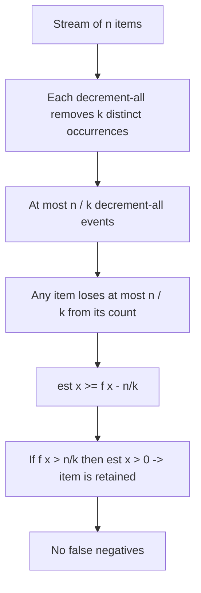
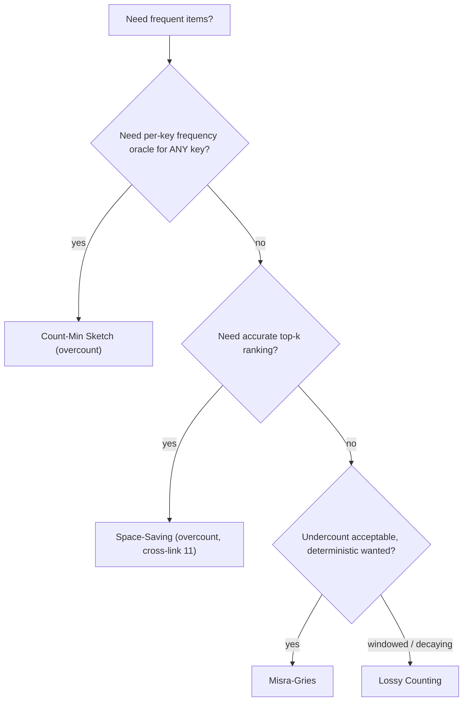
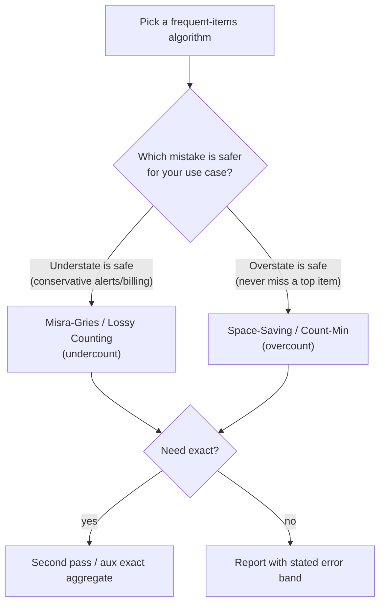

# Misra-Gries Heavy Hitters — Middle Level

> **Focus:** *Why* the decrement-all rule yields the `f(x) - n/k ≤ est(x) ≤ f(x)` guarantee, why every true heavy hitter survives (no false negatives) while false positives can slip in, how the two-pass verification turns candidates into exact answers, and how Misra-Gries compares with Count-Min Sketch, Space-Saving, and Lossy Counting — including which error profile (undercount vs overcount) each one gives.

---

## Table of Contents

1. [Introduction](#introduction)
2. [Deeper Concepts](#deeper-concepts)
3. [The n/k Error Guarantee — Why It Holds](#the-nk-error-guarantee--why-it-holds)
4. [Two-Pass Verification](#two-pass-verification)
5. [Comparison with Alternatives](#comparison-with-alternatives)
6. [Choosing k and Counter Budget](#choosing-k-and-counter-budget)
7. [Code Examples](#code-examples)
8. [Error Handling](#error-handling)
9. [Performance Analysis](#performance-analysis)
10. [Best Practices](#best-practices)
11. [Visual Animation](#visual-animation)
12. [Summary](#summary)

---

## Introduction

At junior level the message was the recipe: keep `k - 1` counters, apply the three rules, and the survivors are your candidates. At middle level you start asking the questions that decide whether your use of Misra-Gries is correct, sized right, and chosen over the right alternative:

- *Why* does the decrement-all rule give the precise bound `f(x) - n/k ≤ est(x) ≤ f(x)`, and why does that imply no heavy hitter is ever missed?
- When are false positives a problem, and how exactly does a second pass eliminate them?
- How does Misra-Gries differ from **Count-Min Sketch** (which *overcounts*), **Space-Saving** (which *overcounts* but ranks better), and **Lossy Counting** (which works in windows)?
- How do I pick `k` (and thus the counter budget) from a target fraction `φ` and an error tolerance `ε`?
- What is the relationship between the "`ε`-approximate frequency" framing and the "`k - 1` counters" framing?

These separate "I copied a frequent-items snippet" from "I can size the summary, state its error, and justify choosing it over Count-Min or Space-Saving for a given workload."

---

## Deeper Concepts

### Counters as a generalized cancellation

Recall the Boyer-Moore majority vote: one counter, and a non-matching item decrements it. The insight is **pairwise cancellation** — each "other" item cancels one vote of the candidate, so a strict majority (more than half) cannot be fully cancelled.

Misra-Gries generalizes cancellation from *one* pair to a *batch of `k`*. When a decrement-all fires, we are cancelling `k` distinct occurrences simultaneously: one from each of the `k - 1` tracked items, plus the incoming item that is never stored. Think of it as deleting a "rainbow group" of `k` pairwise-distinct items from the multiset. The key combinatorial fact:

> Each decrement-all event removes `k` *distinct* item-occurrences. Since the stream has only `n` occurrences total, at most `n/k` such events can ever happen.

That single bound — at most `n/k` decrement-all events — drives the entire error analysis below.

### Estimate is always a lower bound

An item's stored count only ever changes by `+1` (when we see it and it is tracked) or `-1` (when a decrement-all fires while it is tracked) — and it is never created with a count higher than the occurrences seen. Crucially, **a counter is never incremented for an item we are not currently seeing**, so the count can never exceed the true number of times we have seen that item. Therefore `est(x) ≤ f(x)`: Misra-Gries **never overcounts**. This is the opposite of Count-Min Sketch, which can only *over*count.

### The invariant in one picture

Keep this mental image of every counter through time:

```text
true frequency f(x):   ────────────────────── climbs +1 on every occurrence
estimate est(x):       ──╱╲──╱╲──── climbs with f, but dips on each decrement-all
gap = f - est:         starts 0, grows by at most 1 per decrement-all, never shrinks
```

The estimate hugs the true frequency from *below*, falling behind by exactly the number of decrement-all events that hit `x`. Because there are at most `n/k` such events total, the gap can never exceed `n/k`. This "lower envelope that lags by the cancellation count" is the single picture that explains both the undercount direction and its `n/k` magnitude — and it is why a truly frequent item, whose `f` climbs fast, always stays above zero and survives.

### Why the threshold is a fraction, not a fixed number

The guarantee is phrased relative to `n` (`> n/k`) because the stream length is not known in advance and the algorithm is scale-free: doubling the stream doubles both `n` and the threshold. Equivalently, fix an error fraction `ε = 1/k`; then Misra-Gries with `1/ε - 1 = k - 1` counters guarantees `est(x) ≥ f(x) - εn`. The "`k`" and "`ε`" views are two names for the same dial.

### The decrement-all budget, made concrete

The single most useful number to internalize is **the maximum number of decrement-all events: `n/k`**. Everything follows from it. A quick sanity table for a stream of `n = 1,000,000` items:

| `k` | counters | max decrement-all events | max undercount |
|-----|----------|--------------------------|----------------|
| 2 | 1 | 500,000 | 500,000 |
| 10 | 9 | 100,000 | 100,000 |
| 100 | 99 | 10,000 | 10,000 |
| 1000 | 999 | 1,000 | 1,000 |

Notice the undercount column equals `n/k` and shrinks as `k` grows — more counters, fewer forced cancellations, tighter estimates. The "max decrement-all events" is also a useful runtime diagnostic: if your implementation reports far fewer events than `n/k`, the stream has few distinct items (cheap); if it is near `n/k`, the stream is highly diverse (every slot churns).

---

## The n/k Error Guarantee — Why It Holds

We prove the central inequality at the level of rigor appropriate for middle (the fully formal version is in [`professional.md`](./professional.md)).

**Claim.** For every item `x`, `f(x) - n/k ≤ est(x) ≤ f(x)`, where `est(x)` is the final counter value (0 if absent).

**Upper bound (`est(x) ≤ f(x)`).** Every increment of `x`'s counter corresponds to an actual occurrence of `x`. Decrements only reduce it. So the counter can never exceed the number of `x`-occurrences processed so far. ∎ (upper)

**Lower bound (`est(x) ≥ f(x) - n/k`).** Consider what can reduce `x`'s count below `f(x)`:

1. Each occurrence of `x` either increments its counter (`+1`) or is "absorbed" by a decrement-all (when `x` is the incoming unstored item that triggers the batch — it adds `0` instead of `+1`).
2. Each decrement-all also subtracts `1` from `x`'s counter if `x` is currently tracked.

Both effects are tied to **decrement-all events**. Let `D` be the number of decrement-all events. Each event removes `k` distinct occurrences (one per tracked item plus the trigger), so:

```
k · D ≤ n   ⟹   D ≤ n/k.
```

The total amount by which `x`'s final count can fall short of `f(x)` is at most the number of decrement-all events that affected it — at most `D ≤ n/k`. Therefore:

```
est(x) ≥ f(x) - D ≥ f(x) - n/k.   ∎ (lower)
```

**Corollary (no false negatives).** If `f(x) > n/k`, then `est(x) ≥ f(x) - n/k > 0`, so `x` is present in the final table. **Every true heavy hitter survives.**

**Corollary (at most `k - 1` heavy hitters).** If there were `k` items each with `f > n/k`, their total frequency would exceed `n` — impossible. So the answer set fits in `k - 1` counters.

### Visualizing the cancellation budget



### What the bound does NOT promise

- It does **not** bound the number of false positives directly — items with `f(x) ≤ n/k` can have small positive estimates. (Verification removes them.)
- It does **not** give the exact count — only that the reported count is within `n/k` below the truth.
- The boundary case `f(x) = n/k` is **not** guaranteed retained; the promise is strict `>`.

### A relaxed soundness guarantee (one-pass, no verification)

Even without a second pass you can make a *sound* (if weaker) statement. Combine the two halves of the bound: if you report only items whose **estimate** exceeds the threshold, `est(x) > n/k`, then since `est(x) ≤ f(x)` you know `f(x) > n/k` too — every reported item is *genuinely* heavy. The catch is recall: an item with `f(x)` just above `n/k` might have `est(x)` pushed just below it, so you could miss it. This gives the **`(φ, ε)`-approximate** version: with `k = ⌈1/ε⌉`, reporting items with `est(x) > (φ - ε)n` returns *all* items above `φn` and *only* items above `(φ - ε)n`. The tolerance band `ε` is the price of skipping verification. This framing — "heavy hitters with an `ε` slack" — is how the algorithm is stated in most streaming textbooks.

---

## Two-Pass Verification

Misra-Gries' first pass gives candidates with a one-sided error (undercount). To produce the *exact* set of heavy hitters, do a second pass.

**Pass 1.** Run Misra-Gries, obtaining ≤ `k - 1` candidate items.

**Pass 2.** Re-scan the stream, counting *only* the candidates (a fixed `≤ k - 1` keys), and also count `n`. Keep candidates whose **true** count exceeds `n/k`.

Why this works: every true heavy hitter is among the candidates (no false negatives), so the second pass cannot miss any; and counting candidates exactly removes the false positives. The second pass uses the same `O(k)` space and `O(n)` time.

```text
Pass 1: candidates = MisraGries(stream, k)        # <= k-1 keys
Pass 2: exact = exact counts of candidates over stream, plus n
        return { c : exact[c] for c with exact[c] > n/k }
```

**When you can skip pass 2:**
- You only need *approximate* answers and accept false positives.
- You already know exact totals (e.g. a separate exact aggregate exists).
- You accept the slightly weaker guarantee: any item in the table with `est(x) > 0` is a "possible" heavy hitter; if you want a one-sided filter, report items with `est(x) > n/k` (these are guaranteed heavy, but you may miss some that the bound pushed just below — so this is a *precision-favoring* shortcut, not exact).

### One-pass approximate filtering

Without a second pass you can still output a sound *approximate* answer. Because `est(x) ≥ f(x) - n/k`:
- Reporting all items with `est(x) > 0` guarantees **all** heavy hitters but admits false positives.
- Reporting items with `est(x) ≥ ?` lets you trade recall for precision, but only the second pass gives exactness.

---

## Comparison with Alternatives

The four classic frequent-items algorithms differ in **error direction**, **ranking quality**, and **windowing**.

| Algorithm | Space | Error direction | Per-item time | Exact w/ 2nd pass? | Notes |
|-----------|-------|-----------------|---------------|--------------------|-------|
| **Misra-Gries** | `O(k)` counters | **undercount** (`≤ n/k`) | `O(1)` amortized | yes | deterministic; the classic counter-based summary |
| **Space-Saving** | `O(k)` counters | **overcount** (bounded) | `O(1)` amortized | yes | replaces min counter; better for top-`k` ranking |
| **Count-Min Sketch** | `O((1/ε)·log(1/δ))` | **overcount** (`≤ εN` w.p. `1-δ`) | `O(log(1/δ))` | n/a (frequency oracle) | randomized; supports arbitrary point queries |
| **Lossy Counting** | `O((1/ε)·log(εN))` | undercount (`≤ εN`) | amortized `O(1)` | yes | bucketed; deterministic; good for windows |
| Exact hash map | `O(distinct)` | none (exact) | `O(1)` | — | correct but unbounded memory |

### Misra-Gries vs Space-Saving

Both keep `k` (or `k - 1`) `(item, count)` pairs and run in `O(k)` space, but they handle a "new item, full table" differently:

| Aspect | Misra-Gries | Space-Saving |
|--------|-------------|--------------|
| Full-table action | **decrement all** counters, drop zeros | **evict the minimum** counter; give its slot to the new item with `count = min + 1` |
| Error direction | undercount (`est ≤ f`) | overcount (`est ≥ f`) |
| Tracks an extra field? | no | yes — keeps an `error`/overcount bound per item |
| Ranking quality | weaker (counts compressed) | stronger — designed for accurate top-`k` |
| Best for | guaranteed-recall heavy hitters | top-`k` most frequent with tight ranking |

Cross-link: the sibling topic **`11-space-saving-algorithm`** covers Space-Saving in full. The mental model: Misra-Gries *shrinks everyone* on collision; Space-Saving *kicks out the weakest* and inherits its count. Space-Saving usually gives better top-`k` estimates and is often faster (one min-update vs a full sweep), at the cost of overcounting.

### Misra-Gries vs Count-Min Sketch

| Aspect | Misra-Gries | Count-Min Sketch |
|--------|-------------|------------------|
| Randomized? | no (deterministic) | yes (hash functions) |
| What it answers | the set of heavy hitters | frequency *estimate for any* queried item |
| Error | undercount, `≤ n/k`, always | overcount, `≤ εN` with probability `1 - δ` |
| Space | `O(k)` counters | `O((1/ε) log(1/δ))` cells |
| Use when | you want the heavy-hitter *set* cheaply | you need a *frequency oracle* for arbitrary keys |

Count-Min answers "how many times did key `q` appear?" for *any* `q` (with overcounting), whereas Misra-Gries answers "which keys are heavy?" Count-Min can be combined with a heap to find heavy hitters, but Misra-Gries is simpler and deterministic when you only need the heavy set.

One more crucial distinction: **Count-Min supports deletions** (a turnstile stream where items can be removed, e.g. a key's count going down), because its hashed counters accept signed updates. **Misra-Gries does not** — once a counter is decremented away, there is no way to restore a deleted occurrence's mass. So if your stream has removals (not just insertions), Count-Min (or Count-Sketch) is the correct tool and Misra-Gries is simply inapplicable. Misra-Gries lives in the *insert-only* (cash-register) model.

### Misra-Gries vs Lossy Counting

Lossy Counting divides the stream into buckets of width `⌈1/ε⌉` and periodically prunes low-count entries, giving an `εN` undercount-style guarantee similar to Misra-Gries but with `O((1/ε) log(εN))` space (slightly more) and natural support for *approximate counts with frequency estimates*. Misra-Gries is tighter in space (`O(1/ε)`), deterministic, and simpler; Lossy Counting's bucketed structure is convenient when you also want decaying/windowed behavior.

### Decision guide



---

## Choosing k and Counter Budget

The dial is the threshold fraction `φ` (or equivalently the error `ε = 1/k`).

| You want | Set | Counters kept | Undercount bound |
|----------|-----|---------------|------------------|
| Items > 50% (majority) | `k = 2` | 1 | `n/2` |
| Items > 10% | `k = 10` | 9 | `n/10` |
| Items > 1% | `k = 100` | 99 | `n/100` |
| Items > 0.1% | `k = 1000` | 999 | `n/1000` |
| Error `≤ εn` | `k = ⌈1/ε⌉` | `k - 1` | `εn` |

Two sizing notes:
1. **Smaller `ε` (bigger `k`) → more counters → tighter bound but more memory and slower decrement-all.** The space is `O(1/ε)`, linear in the inverse error.
2. The number of *true* heavy hitters above `φn` is at most `1/φ - 1 = k - 1`, so the budget always suffices to hold them all.

### Separating the threshold from the error

A common confusion: the *threshold fraction* `φ` (which items you care about) and the *error fraction* `ε` (how much undercount you tolerate) need not be equal. In the basic algorithm they coincide (`ε = 1/k = φ`), but the `(φ, ε)`-relaxed version lets you set them independently — use a larger `k = 1/ε < 1/φ`... no: you use `k = ⌈1/ε⌉ ≥ 1/φ`, i.e. *more* counters than the bare `1/φ`, to buy a tighter error band around the `φ` threshold. The rule of thumb:

| Goal | Set |
|------|-----|
| Just find items above `φn` (accept slack) | `k = ⌈1/φ⌉` |
| Find items above `φn` with error band `ε < φ` | `k = ⌈1/ε⌉` (more counters) |
| Exact heavy hitters | any `k ≥ ⌈1/φ⌉` + second pass |

So accuracy near the threshold is bought with extra counters, exactly as the linear `O(1/ε)` space says.

---

## Code Examples

### Misra-Gries with explicit counter budget and two-pass exact verification

#### Go

```go
package main

import "fmt"

// pass1 returns up to k-1 candidates with undercounted estimates.
func pass1(stream []string, k int) map[string]int {
	c := make(map[string]int)
	for _, x := range stream {
		if _, ok := c[x]; ok {
			c[x]++
		} else if len(c) < k-1 {
			c[x] = 1
		} else {
			for key := range c {
				c[key]--
				if c[key] == 0 {
					delete(c, key)
				}
			}
		}
	}
	return c
}

// HeavyHitters returns the EXACT set of items with frequency > n/k.
func HeavyHitters(stream []string, k int) map[string]int {
	cands := pass1(stream, k)
	exact := make(map[string]int, len(cands))
	for c := range cands {
		exact[c] = 0
	}
	n := 0
	for _, x := range stream { // pass 2
		n++
		if _, ok := exact[x]; ok {
			exact[x]++
		}
	}
	threshold := float64(n) / float64(k)
	out := make(map[string]int)
	for c, cnt := range exact {
		if float64(cnt) > threshold {
			out[c] = cnt
		}
	}
	return out
}

func main() {
	stream := []string{"A", "B", "A", "C", "C", "A", "B", "D", "A"}
	fmt.Println("candidates:", pass1(stream, 3)) // e.g. map[A:2 D:1]
	fmt.Println("exact HH  :", HeavyHitters(stream, 3)) // map[A:4]
}
```

#### Java

```java
import java.util.*;

public class HeavyHitters {
    static Map<String, Integer> pass1(List<String> stream, int k) {
        Map<String, Integer> c = new HashMap<>();
        for (String x : stream) {
            if (c.containsKey(x)) {
                c.put(x, c.get(x) + 1);
            } else if (c.size() < k - 1) {
                c.put(x, 1);
            } else {
                Iterator<Map.Entry<String, Integer>> it = c.entrySet().iterator();
                while (it.hasNext()) {
                    Map.Entry<String, Integer> e = it.next();
                    if (e.getValue() == 1) it.remove();
                    else e.setValue(e.getValue() - 1);
                }
            }
        }
        return c;
    }

    static Map<String, Integer> heavyHitters(List<String> stream, int k) {
        Map<String, Integer> cands = pass1(stream, k);
        Map<String, Integer> exact = new HashMap<>();
        for (String c : cands.keySet()) exact.put(c, 0);
        int n = 0;
        for (String x : stream) {                 // pass 2
            n++;
            if (exact.containsKey(x)) exact.put(x, exact.get(x) + 1);
        }
        double threshold = (double) n / k;
        Map<String, Integer> out = new HashMap<>();
        for (var e : exact.entrySet())
            if (e.getValue() > threshold) out.put(e.getKey(), e.getValue());
        return out;
    }

    public static void main(String[] args) {
        List<String> stream = Arrays.asList("A","B","A","C","C","A","B","D","A");
        System.out.println("candidates: " + pass1(stream, 3));
        System.out.println("exact HH  : " + heavyHitters(stream, 3)); // {A=4}
    }
}
```

#### Python

```python
def pass1(stream, k):
    c = {}
    for x in stream:
        if x in c:
            c[x] += 1
        elif len(c) < k - 1:
            c[x] = 1
        else:
            for key in list(c):
                c[key] -= 1
                if c[key] == 0:
                    del c[key]
    return c


def heavy_hitters(stream, k):
    cands = pass1(stream, k)
    exact = {c: 0 for c in cands}
    n = 0
    for x in stream:                  # pass 2
        n += 1
        if x in exact:
            exact[x] += 1
    threshold = n / k
    return {c: cnt for c, cnt in exact.items() if cnt > threshold}


if __name__ == "__main__":
    stream = ["A", "B", "A", "C", "C", "A", "B", "D", "A"]
    print("candidates:", pass1(stream, 3))         # e.g. {'A': 2, 'D': 1}
    print("exact HH  :", heavy_hitters(stream, 3)) # {'A': 4}
```

The candidate set may contain a false positive (`D`); the second pass re-counts and keeps only the genuine heavy hitter `A`.

### Verifying the undercount bound empirically

```python
import random
from collections import Counter

def check_bound(n=100_000, k=50, alphabet=200):
    stream = [random.randint(0, alphabet) for _ in range(n)]
    est = pass1(stream, k)
    true = Counter(stream)
    bound = n / k
    for x, e in est.items():
        assert true[x] - bound <= e <= true[x], (x, e, true[x], bound)
    # every true heavy hitter must be present
    for x, f in true.items():
        if f > bound:
            assert x in est, ("missed heavy hitter", x, f)
    print("bound holds; no heavy hitter missed")
```

This asserts both halves of the guarantee on random data — a cheap, high-value test.

---

## Error Handling

| Scenario | What goes wrong | Correct approach |
|----------|-----------------|------------------|
| Treat candidates as exact heavy hitters | false positives reported as heavy | run pass 2 to re-count candidates |
| Budget of `k` instead of `k - 1` | weakens guarantee / bound | keep at most `k - 1` entries |
| Reporting `est` as true frequency | undercounts confuse downstream consumers | label as estimate, or use exact pass-2 counts |
| Streams differ between passes | pass-2 `n` mismatched | recompute `n` in the verification pass over the same stream |
| Mutating map during decrement-all | iterator invalidation | snapshot keys (Python) or use `Iterator.remove` (Java) |
| Choosing `k` from a `≥` threshold | boundary item dropped | remember the guarantee is strict `> n/k` |

---

## Performance Analysis

| Cost | Misra-Gries | Notes |
|------|-------------|-------|
| Space | `O(k)` | `k - 1` counters; independent of `n` and distinct count |
| Per-item (amortized) | `O(1)` | hash lookup + increment/claim |
| Per-item (worst) | `O(k)` | a decrement-all sweep |
| Decrement-all frequency | `≤ n/k` events total | each removes `k` occurrences |
| Total first pass | `O(n)` amortized | sum of per-item work |

**Why amortized `O(1)`:** there are at most `n/k` decrement-all events, each costing `O(k)`, for `O(n)` total decrement work across the whole stream. Spread over `n` items, that is `O(1)` per item on average, on top of the `O(1)` lookup. So the whole first pass is `O(n)`.

```python
import time, random

def benchmark():
    for n in (10_000, 100_000, 1_000_000):
        stream = [random.randint(0, 5000) for _ in range(n)]
        t = time.perf_counter()
        pass1(stream, 100)
        print(f"n={n:>9}: {(time.perf_counter()-t)*1000:.1f} ms")
```

The constant factor is dominated by hash-map operations. If decrement-all sweeps become a bottleneck (large `k`, many distinct rare items), **Space-Saving** avoids the full sweep by replacing only the minimum counter — often faster in practice, at the cost of overcounting.

### When the per-item worst case matters

For most batch jobs the amortized `O(1)` is all that matters. But in **real-time, latency-sensitive** settings (line-rate packet processing, a request hot path with a strict tail-latency SLA), a single `O(k)` decrement-all sweep can blow a per-item deadline even though the average is fine. Two mitigations:

1. **Use the linked-bucket (Stream-Summary) structure** to get `O(1)` *worst-case* updates, eliminating the sweep entirely (covered at senior/professional level).
2. **Use Space-Saving**, whose overflow step is a single minimum replacement — `O(1)` worst case with the right structure — accepting overcount semantics.

The choice between "amortized-`O(1)` Misra-Gries with simple code" and "worst-case-`O(1)` at the cost of complexity or overcounting" is a classic latency-vs-simplicity trade you make based on whether tail latency is a hard requirement.

---

## Best Practices

- **State the error explicitly:** results undercount by up to `n/k`; never present them as exact without a second pass.
- **Run the two-pass variant** when exactness matters; the one-pass variant only when approximate answers are acceptable.
- **Size `k` from the threshold** `φ`: `k = ⌈1/φ⌉`, keep `k - 1` counters.
- **Validate both halves of the guarantee** on random data (bound holds; no heavy hitter missed).
- **Prefer Space-Saving** when you need accurate top-`k` *ranking* rather than just the heavy-hitter *set*.
- **Prefer Count-Min** when you need a frequency oracle for *arbitrary* keys, not just the heavy ones.
- **Use a single hash map** mutated in place; do not rebuild on decrement-all.
- **Remember the strict threshold:** items at exactly `n/k` are not guaranteed retained.

---

## Worked Example: The Same Stream Through Four Algorithms

To make the comparison table concrete, run the four insert-only algorithms on the same small stream with the same budget and watch how their *error directions* diverge. Stream (`n = 12`, `k = 3`, so 2 counters / `ε = 1/3`):

```
A A A A B B C A B C A A      ->  true: A=7, B=3, C=2
```

The threshold for a heavy hitter is `n/k = 12/3 = 4`. Only `A` (true `7`) qualifies.

| Algorithm | Final state (2 counters) | Estimate for A | Error direction | Notes |
|-----------|--------------------------|----------------|-----------------|-------|
| **Misra-Gries** | `{A: ~5, ...}` | `≤ 7` (undercount, gap `≤ n/k = 4`) | **under** | A retained; some cancellation lowered its count |
| **Space-Saving** | `{A: ~7, B/C: min+1}` | `≥ 7` (overcount) | **over** | evicts the smaller of B/C, new item inherits the min |
| **Count-Min** (toy) | hashed cells | `≥ 7` w.p. `1-δ` | **over** | answers "freq of A?" for *any* key, may collide |
| **Lossy Counting** | bucketed `{A: ~6}` | `≤ 7` (under, `≤ εN`) | **under** | prunes per bucket of width `⌈1/ε⌉` |

The single most important takeaway: **Misra-Gries and Lossy Counting undercount; Space-Saving and Count-Min overcount.** That sign determines correctness in your application. If you bill customers or alert on a "top talker," undercounting (Misra-Gries) is *conservative* — you never overstate. If you must never *miss* an item's true rank near the top, overcounting (Space-Saving) is safer. The magnitudes are all `≤ εn`; only the direction differs.

### Why the error sign is the real decision axis



---

## Frequently Asked Questions

**Q: Is the `n/k` undercount per item or total?** Per item. *Each* item's estimate can be up to `n/k` below its true frequency. It is not a budget shared across items — every counter independently lags the truth by at most the number of decrement-all events that touched it, which is itself `≤ n/k`.

**Q: Why can a non-heavy item appear in the final table (false positive)?** Because being in the table only requires a positive estimate, and a marginal item with `f(x)` slightly below `n/k` can end with a small positive count if few decrement-alls happened to hit it. The guarantee is one-sided: *all* heavy hitters are in (no false negatives), but the table is not *only* heavy hitters. The second pass removes the extras.

**Q: If I report only items with `est(x) > n/k`, are those guaranteed correct?** Yes — that is a sound *precision-favoring* shortcut. Since `est(x) ≤ f(x)`, an estimate above `n/k` proves `f(x) > n/k`. The catch is recall: a true heavy hitter whose estimate got pushed just below `n/k` would be missed. So this filter has no false positives but can have false negatives — the mirror image of the raw candidate set.

**Q: When should I reach for Count-Min instead?** When your stream has *deletions* (turnstile model) or you need a frequency oracle for *arbitrary* keys, not just the heavy ones. Misra-Gries only handles inserts and only answers "which keys are heavy." Count-Min handles signed updates and any point query, at the cost of overcounting and randomization.

**Q: Space-Saving and Misra-Gries both use `O(k)` counters — is one strictly better?** No, they are duals. Misra-Gries undercounts and gives the clean mergeable `εN` guarantee; Space-Saving overcounts and ranks top-`k` more accurately with `O(1)`-worst-case updates. Pick by error direction and whether you need ranking. See `11-space-saving-algorithm`.

**Q: How do I choose `k` if I care about a 1% threshold but want tighter counts?** Set `k = ⌈1/ε⌉` with `ε < φ = 0.01` — i.e. *more* than 100 counters — to buy a tighter error band around the 1% line. Accuracy near the threshold costs extra counters linearly (`O(1/ε)` space).

---

## Visual Animation

> See [`animation.html`](./animation.html) for an interactive view.
>
> The middle-level animation highlights:
> - The `k - 1` slots filling, incrementing, and being freed on zero.
> - The **decrement-all** sweep firing when a new item meets a full table.
> - The running estimate per item vs its true frequency, with the `n/k` threshold line.
> - A counter for the number of decrement-all events vs the `n/k` upper limit.

---

## Summary

Misra-Gries' correctness rests on one combinatorial fact: each **decrement-all** event removes `k` distinct item-occurrences, so at most `n/k` such events can happen across a stream of `n` items. That bounds how far any counter can fall below the truth, giving the two-sided guarantee `f(x) - n/k ≤ est(x) ≤ f(x)` — the estimate **never overcounts** and undercounts by at most `n/k`. The immediate consequence is **no false negatives**: every item with `f(x) > n/k` survives. False positives can appear, but a **second pass** that re-counts the `≤ k - 1` candidates removes them exactly. Against the alternatives, Misra-Gries is the deterministic *undercount* summary: **Space-Saving** overcounts but ranks top-`k` better (cross-link `11-space-saving-algorithm`), **Count-Min Sketch** is a randomized overcounting frequency oracle for arbitrary keys, and **Lossy Counting** is a bucketed undercount variant convenient for windows. Size it with `k = ⌈1/φ⌉` for a threshold fraction `φ`, and always label the output as approximate unless you verify with a second pass.

---

## Next step: [senior.md](./senior.md) — Misra-Gries in network and stream-monitoring systems, the merge property for distributed/parallel streams, and the memory-versus-accuracy tradeoff at scale.
