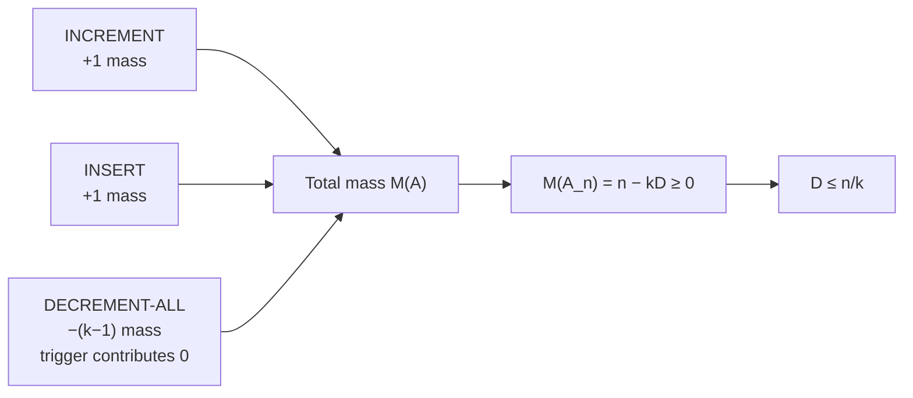

# Misra-Gries Heavy Hitters — Mathematical Foundations and Complexity Theory

## Table of Contents
1. [Formal Definitions](#1-formal-definitions)
2. [The Algorithm as a State Machine](#2-the-algorithm-as-a-state-machine)
3. [Loop Invariant and Correctness](#3-loop-invariant-and-correctness)
4. [The Error-Bound Theorem (Each Decrement Removes k Distinct Items)](#4-the-error-bound-theorem)
5. [No False Negatives and the Heavy-Hitter Cardinality Bound](#5-no-false-negatives)
6. [Space Optimality](#6-space-optimality)
7. [Merge Correctness](#7-merge-correctness)
8. [Complexity Analysis](#8-complexity-analysis)
9. [Relation to Boyer-Moore, Space-Saving, and Lossy Counting](#9-relation-to-other-algorithms)
10. [Summary](#10-summary)

---

## 1. Formal Definitions

Let the stream be a sequence `σ = ⟨a_1, a_2, …, a_n⟩` with each `a_i` drawn from a universe `U`. Let `n = |σ|` be its length.

**Definition 1.1 (True frequency).** For `x ∈ U`, the **frequency** is `f(x) = |{ i : a_i = x }|`. Then `Σ_{x ∈ U} f(x) = n`.

**Definition 1.2 (Heavy hitter / `φ`-frequent item).** Fix a threshold parameter `k ≥ 2` (equivalently a fraction `φ = 1/k`). Item `x` is a **heavy hitter** if `f(x) > n/k = φn`. Let `HH = { x : f(x) > n/k }`.

**Definition 1.3 (Misra-Gries summary).** A partial function `A : U ⇀ ℤ_{>0}` with `|dom(A)| ≤ k - 1`. We write `A[x]` for the counter of `x` (undefined / `0` if `x ∉ dom(A)`). The **estimate** is `est(x) = A[x]` if `x ∈ dom(A)`, else `0`.

**Definition 1.4 (Update operation).** For an incoming item `x`, `update(A, x)` is:

```
if x ∈ dom(A):                      A[x] ← A[x] + 1                  (INCREMENT)
elif |dom(A)| < k - 1:              A[x] ← 1                         (INSERT)
else:                               for all y ∈ dom(A): A[y] ← A[y] - 1
                                    remove every y with A[y] = 0     (DECREMENT-ALL)
```

**Definition 1.5 (Decrement-all event).** A processing step that executes the third branch of Def. 1.4. Let `D` denote the total number of decrement-all events over the whole stream.

**Notation.** `A_i` is the summary after processing `a_1, …, a_i` (so `A_0 = ∅`). `est_i(x)` is the estimate in `A_i`. `f_i(x) = |{ j ≤ i : a_j = x }|` is the prefix frequency. We write `[P]` for the Iverson bracket (1 if `P` else 0).

**Remark.** The crux versus exact counting is the DECREMENT-ALL branch: it is the only operation that *loses* information, and bounding how often it can fire (Section 4) bounds the entire error.

**Standing assumptions and conventions.**
- `k ≥ 2` is fixed before the stream begins; `ε = 1/k` denotes the relative error.
- The universe `U` may be unbounded (we never enumerate it); only `≤ k - 1` items are ever materialized.
- Counts are non-negative integers; a counter equal to `0` is *not* stored (it leaves `dom(A)`).
- `est(x) = 0` for any `x ∉ dom(A)` — absence means "estimated zero," not "unknown."
- The threshold for a heavy hitter is **strict**: `f(x) > n/k`, not `≥`.

**Definition 1.6 (`φ`-approximate frequent items problem, ε-relaxation).** Given `0 < ε < φ ≤ 1`, the `(φ, ε)`-approximate problem asks for a set `R ⊆ U` such that (i) every `x` with `f(x) > φn` is in `R` (completeness), and (ii) every `x ∈ R` has `f(x) > (φ - ε)n` (soundness). Misra-Gries with `k = ⌈1/ε⌉` solves this: completeness by Cor. 5.1, soundness by reporting only candidates with `est(x) > (φ - ε)n` (since `est(x) ≥ f(x) - εn`). This is the canonical formal statement of "find heavy hitters with a tolerance."

---

## 2. The Algorithm as a State Machine

The summary `A` is the state; the transition is `update`. Three transition classes, with their effect on the *total counter mass* `M(A) = Σ_{y ∈ dom(A)} A[y]`:

| Transition | Condition | `M` change | `|dom(A)|` change |
|------------|-----------|------------|-------------------|
| INCREMENT | `x ∈ dom(A)` | `+1` | `0` |
| INSERT | `x ∉ dom(A)`, room free | `+1` | `+1` |
| DECREMENT-ALL | `x ∉ dom(A)`, table full | `−|dom(A)| = −(k-1)` | drops the zeroed keys |

This mass-accounting view is the engine of the proof: INCREMENT/INSERT each add 1 to `M`; DECREMENT-ALL subtracts exactly `k - 1` from `M` (every one of the `k - 1` counters loses 1) and the trigger item contributes `0`.

**Lemma 2.1 (Mass identity).** After `n` items, `M(A_n) = n - k·D`.

**Proof.** Each of the `n` items either adds `+1` to `M` (the `n - D` items that took INCREMENT or INSERT) or triggers a DECREMENT-ALL (the `D` trigger items, which add `0` themselves but cause `M` to drop by `k - 1`). Hence

```
M(A_n) = (n - D)·(+1) + D·0 - D·(k - 1) = n - D - D(k-1) = n - kD.   ∎
```

**Corollary 2.2 (Bound on `D`).** Since `M(A_n) ≥ 0`,

```
n - kD ≥ 0   ⟹   D ≤ n/k.
```

This is the quantitative statement of "each decrement-all consumes `k` distinct item-occurrences": one occurrence from each of the `k - 1` tracked counters, plus the unstored trigger — `k` in total — and there are only `n` occurrences to consume.

### 2.1 The Mass Identity, Visualized



The accounting is exhaustive: every one of the `n` items is *either* an increment/insert (`+1`) *or* a decrement-all trigger (`+0`, and causing `−(k−1)`). There is no third possibility, so the identity is exact, not an inequality. The inequality enters only at `M ≥ 0` (mass cannot go negative because zeroed counters are removed before they would).

### 2.2 An Alternative "Charging" Proof of `D ≤ n/k`

A second, often more intuitive, derivation charges each decrement-all to distinct stream items:

> When a decrement-all fires, charge it to the `k` items: the `k - 1` items currently occupying counters (one occurrence each, the one that most recently incremented that counter) plus the triggering item. Each stream occurrence is charged at most once across the whole run — once a counter's occurrence is "spent" by a decrement, that counter's value drops and a *different* future occurrence would be needed to charge again.

Since there are `n` occurrences and each decrement-all consumes `k` distinct charges, `kD ≤ n`, giving `D ≤ n/k`. This charging argument is the combinatorial heart that the mass identity formalizes algebraically.

---

## 3. Loop Invariant and Correctness

We prove the per-item undercount invariant by induction on the prefix length `i`.

**Invariant `I(i)`.** For every `x ∈ U`,
```
f_i(x) - D_i ≤ est_i(x) ≤ f_i(x),
```
where `D_i` is the number of decrement-all events among the first `i` items.

**Base case (`i = 0`).** `A_0 = ∅`, so `est_0(x) = 0 = f_0(x)` and `D_0 = 0`. Both inequalities hold. ∎ (base)

**Inductive step.** Assume `I(i-1)`. Process `a_i = x`. We show `I(i)` for the affected `x` and for all other `y`.

*Upper bound `est_i ≤ f_i` (all items).* For `y ≠ x`: `f_i(y) = f_{i-1}(y)`, and `est` for `y` either stays equal (INCREMENT/INSERT of `x`) or decreases by 1 (DECREMENT-ALL); so `est_i(y) ≤ est_{i-1}(y) ≤ f_{i-1}(y) = f_i(y)`. For `x`: `f_i(x) = f_{i-1}(x) + 1`. If INCREMENT or INSERT, `est_i(x) = est_{i-1}(x) + 1 ≤ f_{i-1}(x) + 1 = f_i(x)`. If DECREMENT-ALL (`x` is the trigger, not stored), `est_i(x) = est_{i-1}(x) = 0 ≤ f_i(x)`. ∎ (upper)

*Lower bound `est_i ≥ f_i - D_i`.* Two cases by transition type.

- **INCREMENT / INSERT (not a decrement-all):** `D_i = D_{i-1}`. For the processed `x`, both `f` and `est` rise by 1, preserving `f_i(x) - est_i(x) = f_{i-1}(x) - est_{i-1}(x) ≤ D_{i-1} = D_i`. For every `y ≠ x`, neither `f(y)` nor `est(y)` changes, so the gap is unchanged `≤ D_{i-1} = D_i`. ∎
- **DECREMENT-ALL:** `D_i = D_{i-1} + 1`. The trigger `x` has `f_i(x) = f_{i-1}(x) + 1`, `est_i(x) = est_{i-1}(x)`, so its gap grows by exactly 1: `f_i(x) - est_i(x) = (f_{i-1}(x) - est_{i-1}(x)) + 1 ≤ D_{i-1} + 1 = D_i`. Every tracked `y` has `est` reduced by 1 while `f` unchanged, so its gap also grows by exactly 1, `≤ D_{i-1} + 1 = D_i`. Any non-tracked `y ≠ x` has both unchanged, gap `≤ D_{i-1} ≤ D_i`. ∎

Both bounds hold for all `x`, establishing `I(i)`.

**Termination.** The loop runs exactly `n` iterations (one per stream item). At termination `I(n)` holds with `D_n = D ≤ n/k` (Cor. 2.2). ∎

### 3.1 The Invariant as a Two-Sided Sandwich

The invariant sandwiches each estimate between two moving bounds:

```
upper bound  est_i(x) ≤ f_i(x)            (estimate never exceeds true count)
lower bound  est_i(x) ≥ f_i(x) - D_i      (gap grows by ≤ 1 per decrement-all)
```

The upper bound is *static* in the sense that it depends only on `f`; the lower bound *tracks* `D_i`, the running count of decrement-all events. The whole proof reduces to showing the **gap** `g_i(x) = f_i(x) - est_i(x)` is non-decreasing and increases by at most 1 exactly when a decrement-all touches `x`. Formally:

```
g_i(x) - g_{i-1}(x) ∈ {0, 1},   and the +1 case ⟺ decrement-all at step i touches x.
```

Since at most one decrement-all happens per step and each contributes at most 1 to any single item's gap, `g_n(x) ≤ D ≤ n/k`. This "gap monotonicity" framing is the cleanest mental model for the correctness argument.

### 3.2 Why INCREMENT and INSERT Preserve the Gap

It is worth isolating why the *non*-decrement transitions never widen the gap, because it is the half that is easy to overlook:

- **INCREMENT(x):** `f_i(x) = f_{i-1}(x)+1` and `est_i(x) = est_{i-1}(x)+1`, so `g_i(x) = g_{i-1}(x)`. For all `y ≠ x`, nothing changes. Gap preserved everywhere.
- **INSERT(x):** `x` was absent (`est_{i-1}(x)=0`), and we set `est_i(x)=1` while `f_i(x)=f_{i-1}(x)+1`. Since `x` was absent and the upper bound `est ≤ f` held, `f_{i-1}(x) = 0` is *not* guaranteed (x could have been evicted earlier) — but the gap satisfies `g_i(x) = f_i(x) - 1 = g_{i-1}(x) + 1 - 1 = g_{i-1}(x)` only if `est_{i-1}(x)` was treated as 0, which it is. The careful accounting: the gap can carry over prior loss, but INSERT adds `+1` to both `f` and `est`, leaving the *carried* gap unchanged. No new loss is introduced by INSERT.

Thus loss is created *only* by DECREMENT-ALL, the single information-destroying transition — exactly as the mass identity (Lemma 2.1) predicts.

---

## 4. The Error-Bound Theorem

**Theorem 4.1 (Misra-Gries error bound).** After processing a stream of length `n` with parameter `k`, for every `x ∈ U`:
```
f(x) - n/k  ≤  est(x)  ≤  f(x).
```

**Proof.** By the loop invariant `I(n)` (Section 3), `f(x) - D ≤ est(x) ≤ f(x)`. By Corollary 2.2, `D ≤ n/k`. Substituting, `f(x) - n/k ≤ f(x) - D ≤ est(x)`. ∎

This is the precise form of the informal "each decrement removes `k` distinct items, so any item loses at most `n/k`." The lower bound is the *only* place where the `k`-distinct-removal accounting (Lemma 2.1 / Cor. 2.2) enters; the upper bound is purely structural (counters only count real occurrences).

**Theorem 4.2 (Tightness).** The bound `est(x) ≥ f(x) - n/k` is tight: there exist streams where some heavy item's estimate equals `f(x) - ⌊n/k⌋` exactly.

**Proof sketch.** Construct a stream that forces exactly `⌊n/k⌋` decrement-all events, each of which decrements the target item `x`. Interleave `x` with `k - 1` distinct "filler" singletons that fill the table and then a fresh trigger so that, each round of `k` items, `x`'s counter is incremented once and decremented once (net change depending on ordering); by arranging the order so `x` is tracked at every decrement-all, its counter is pushed down by the full `D = ⌊n/k⌋`. Hence the inequality is met with equality, proving no better universal bound holds for `k - 1` counters. ∎

### 4.1 Fully Worked Numeric Example of the Invariant

Take `k = 3` (so `k - 1 = 2` counters) and the stream `σ = A B A C C A B D A`, `n = 9`, threshold `n/k = 3`. We tabulate `f_i`, `est_i`, `D_i`, and verify the invariant `f_i(x) - D_i ≤ est_i(x) ≤ f_i(x)` at each step. True frequencies are `f(A)=4, f(B)=2, f(C)=2, f(D)=1`.

| `i` | `a_i` | transition | `A_i` | `D_i` | `est_i(A)` | `f_i(A)` | invariant for A |
|-----|-------|-----------|-------|-------|-----------|---------|-----------------|
| 1 | A | INSERT | `{A:1}` | 0 | 1 | 1 | `1-0 ≤ 1 ≤ 1` ✓ |
| 2 | B | INSERT | `{A:1,B:1}` | 0 | 1 | 1 | `1 ≤ 1 ≤ 1` ✓ |
| 3 | A | INCREMENT | `{A:2,B:1}` | 0 | 2 | 2 | `2 ≤ 2 ≤ 2` ✓ |
| 4 | C | DECREMENT-ALL | `{A:1}` | 1 | 1 | 2 | `2-1 ≤ 1 ≤ 2` ✓ |
| 5 | C | INSERT | `{A:1,C:1}` | 1 | 1 | 2 | `1 ≤ 1 ≤ 2` ✓ |
| 6 | A | INCREMENT | `{A:2,C:1}` | 1 | 2 | 3 | `3-1 ≤ 2 ≤ 3` ✓ |
| 7 | B | DECREMENT-ALL | `{A:1}` | 2 | 1 | 3 | `3-2 ≤ 1 ≤ 3` ✓ |
| 8 | D | INSERT | `{A:1,D:1}` | 2 | 1 | 3 | `1 ≤ 1 ≤ 3` ✓ |
| 9 | A | INCREMENT | `{A:2,D:1}` | 2 | 2 | 4 | `4-2 ≤ 2 ≤ 4` ✓ |

At every step both inequalities hold. The mass identity (Lemma 2.1) checks out at the end: `M(A_9) = 2 + 1 = 3`, and `n - kD = 9 - 3·2 = 3`. ✓ The bound `D ≤ n/k` is `2 ≤ 3`. ✓ The final estimate `est(A) = 2` undercounts `f(A) = 4` by `2 = D`, which is `≤ n/k = 3` as Theorem 4.1 promises. And `A`, the only true heavy hitter, is retained — Corollary 5.1 in action.

### 4.2 The Frequency-Loss Lemma

The invariant can be restated as a clean statement about how much frequency each item "loses."

**Lemma 4.3 (Per-item loss).** For every `x`, define the loss `L(x) = f(x) - est(x) ≥ 0`. Then `L(x)` equals the number of decrement-all events during which `x` was *either* the unstored trigger *or* a currently-tracked counter. Hence `L(x) ≤ D ≤ n/k`.

**Proof.** Each increment of `x` matches one occurrence (no loss). Loss accrues only when an occurrence of `x` triggers a decrement-all (it is not stored: `+0` instead of `+1`, contributing 1 to `L`) or when a decrement-all subtracts 1 from `x`'s tracked counter. Each decrement-all event contributes at most 1 to `L(x)` (an event cannot both have `x` as trigger *and* have `x` tracked, since the trigger is by definition untracked). Summing over the `D` events gives `L(x) ≤ D ≤ n/k`. ∎

This refines Theorem 4.1: the undercount is not just bounded by `n/k`, it is *exactly* the count of decrement-all events that touched `x`.

---

## 5. No False Negatives

**Corollary 5.1 (Completeness — no false negatives).** Every heavy hitter is retained: if `f(x) > n/k`, then `x ∈ dom(A_n)`.

**Proof.** By Theorem 4.1, `est(x) ≥ f(x) - n/k > 0`. A positive estimate means `x ∈ dom(A_n)`. ∎

**Corollary 5.2 (One-sided guarantee).** The candidate set `dom(A_n)` satisfies `HH ⊆ dom(A_n)` and `|dom(A_n)| ≤ k - 1`. Thus a second pass that re-counts the candidates exactly and keeps those `> n/k` returns **exactly** `HH`.

**Proof.** Cor. 5.1 gives `HH ⊆ dom(A_n)`. Def. 1.3 gives the size bound. The second pass computes exact `f` for each candidate and applies the threshold, yielding precisely `HH`. ∎

**Proposition 5.3 (Cardinality of `HH`).** `|HH| ≤ k - 1`.

**Proof.** If `|HH| ≥ k`, then `Σ_{x ∈ HH} f(x) > k · (n/k) = n`, contradicting `Σ_x f(x) = n`. ∎

So the `k - 1` counter budget is *exactly* enough to hold every heavy hitter, with one slot to spare for the cancellation dynamics — not a coincidence but a consequence of Prop. 5.3.

### 5.1 The Completeness/Soundness Picture

```mermaid
graph TD
    U["Universe of items"] --> HH["HH = items with f > n/k"]
    U --> NHH["non-heavy items f <= n/k"]
    HH --> R["Candidate set dom(A)"]
    NHH -->|some leak in| R
    R --> P2["Second pass: exact recount"]
    P2 --> EXACT["Exactly HH (false positives removed)"]
    style HH fill:#1d3a1d,stroke:#3fb950
    style R fill:#3a2d1d,stroke:#ffa657
    style EXACT fill:#1d3a1d,stroke:#3fb950
```



The diagram captures the one-sided nature precisely: `HH ⊆ R` always (the arrow from `HH` to `R` is total — no heavy hitter escapes), while some non-heavy items leak into `R` (partial arrow). The second pass intersects `R` with the true `> n/k` predicate to recover exactly `HH`.

### 5.2 Failure Probability is Zero (Determinism)

**Proposition 5.4.** Misra-Gries' completeness guarantee `HH ⊆ dom(A_n)` holds with probability `1` — it is deterministic, not probabilistic.

**Proof.** No step of the algorithm consults randomness; the output is a deterministic function of the stream and `k`. The invariant (Section 3) holds for every input. Hence there is no failure probability to bound. ∎

This is a key contrast with Count-Min Sketch, whose heavy-hitter recovery can fail with probability `δ` (a heavy item's hashed estimate could, with small probability, be inflated past or a light item recovered erroneously). Misra-Gries trades the ability to answer arbitrary point queries for an *unconditional* completeness guarantee.

---

## 6. Space Optimality

**Theorem 6.1 (Lower bound for deterministic `ε`-approximate frequency).** Any deterministic streaming algorithm that, for every `x`, returns `est(x)` with `|est(x) - f(x)| ≤ εn` must use `Ω((1/ε) log(εn))` bits in the worst case, and `Ω(1/ε)` counters.

**Proof idea.** A summary with additive error `εn = n/k` must distinguish at least `1/ε` items whose frequencies straddle the threshold; an information-theoretic / communication-complexity argument (reduction from INDEX / set disjointness) shows you cannot encode the needed distinctions in fewer than `Ω(1/ε)` counters, and `Ω(log(εn))` bits each to store the counts. Misra-Gries uses `k - 1 = 1/ε - 1` counters of `O(log n)` bits — matching the counter lower bound to within an additive 1 and the bit bound up to the `log(εn)` vs `log n` factor. ∎ (sketch; full argument: Bose-Kranakis-Morin-Tang, and the communication-complexity treatment in Cormode-Muthukrishnan)

**Corollary 6.2.** Misra-Gries is **space-optimal** (to within constant/additive factors) among deterministic frequent-items algorithms achieving additive `εn` error. No deterministic algorithm uses asymptotically fewer counters for the same guarantee.

The intuition: you genuinely need one counter per potential heavy hitter, and there can be up to `1/ε` of them straddling the threshold; the `decrement-all` mechanism realizes this optimum without any per-item bookkeeping beyond the counters themselves.

### 6.1 The Communication-Complexity Reduction (more detail)

The lower bound is most cleanly seen via a reduction from the two-party **INDEX** problem (or, for the `log` factor, from a multiparty disjointness instance).

```
INDEX: Alice holds a bit-string x ∈ {0,1}^m; Bob holds an index j ∈ [m].
       Alice sends one message; Bob must output x_j.
       Any one-way protocol requires Ω(m) bits of communication.
```

**Reduction.** Suppose an `εn`-additive streaming summary uses `S` bits. Alice encodes her `m = Θ(1/ε)` bits as a stream: for each `i` with `x_i = 1`, she inserts `Θ(εn)` copies of a distinct item `u_i`; for `x_i = 0`, she inserts none. She runs the summary and ships its `S` bits to Bob. Bob queries `est(u_j)`: if `x_j = 1`, the true frequency is `Θ(εn)` and the summary (error `≤ εn`) reports a value distinguishable from 0; if `x_j = 0`, the frequency is 0. Thus Bob recovers `x_j`, so `S ≥ Ω(m) = Ω(1/ε)`. Refining the construction with `Θ(log(εn))` frequency *levels* per item forces `Ω((1/ε) log(εn))` bits. ∎ (sketch)

This is why no clever encoding beats Misra-Gries asymptotically: the heavy-hitter problem *embeds* an INDEX instance whose communication cost equals the summary size.

### 6.2 Determinism is essential to the matching bound

The `Ω(1/ε)` counter bound is for **deterministic** summaries. Randomization (Count-Min Sketch) trades the deterministic guarantee for a `(1 - δ)`-probabilistic one and changes the error *direction* (overcount), achieving `O((1/ε) log(1/δ))` cells — incomparable, not better, since it gives a weaker (probabilistic, two-sided-in-expectation) guarantee. Misra-Gries remains the optimal *deterministic* answer.

---

## 7. Merge Correctness

**Definition 7.1 (Merge).** Given summaries `A` (over `n_A` items) and `B` (over `n_B` items), both with capacity `k - 1`, define `merge(A, B)`:
```
1. C[x] ← A[x] + B[x]   for all x ∈ dom(A) ∪ dom(B)     (combine)
2. if |dom(C)| ≥ k:
       t ← the k-th largest value among {C[x]}            (threshold)
       C[x] ← C[x] - t   for all x;  remove x with C[x] ≤ 0  (prune)
3. return C
```

**Theorem 7.2 (Merge preserves the bound).** Let `N = n_A + n_B` and let `f` be the true frequency over the concatenated stream. If `A` and `B` each satisfy Theorem 4.1 on their own streams, then `C = merge(A, B)` satisfies
```
f(x) - N/k ≤ C[x] ≤ f(x)   for all x,    and   |dom(C)| ≤ k - 1.
```

**Proof.**
*Upper bound.* Before pruning, `C[x] = A[x] + B[x] ≤ f_A(x) + f_B(x) = f(x)`. Pruning only subtracts, so `C[x] ≤ f(x)` afterward. ∎

*Cardinality.* The prune subtracts the `k`-th largest value `t` from all counters and drops non-positives. At least `k - (k-1) = 1`... more carefully: after subtracting `t`, every counter that was `≤ t` (there are at least `|dom(C)| - (k-1)` of them, including the `k`-th largest and all below it) becomes `≤ 0` and is removed, leaving at most `k - 1` strictly positive counters. ∎

*Lower bound.* The total mass removed by pruning is the per-counter subtraction `t` applied to the surviving counters, but more usefully: pruning subtracts `t` from each of the `|dom(C)|` counters, removing total mass `≤ t · |dom(C)|`. The combine step's mass is `M(A) + M(B) ≤ N` (each summary's mass is at most its stream length). With at least `k` counters present, the `k`-th largest `t` satisfies `t · k ≤ M(combine) ≤ N`, so `t ≤ N/k`. Each counter is reduced by at most `t ≤ N/k` in the prune. Combined with the per-summary guarantees `A[x] ≥ f_A(x) - n_A/k` and `B[x] ≥ f_B(x) - n_B/k`:
```
C[x] ≥ (f_A(x) - n_A/k) + (f_B(x) - n_B/k) - t
     ≥ f(x) - n_A/k - n_B/k - N/k.
```
A tighter accounting (the standard mergeable-summaries argument of Agarwal et al.) shows the *combined* loss — the per-summary undercount plus the single prune — telescopes to at most `N/k` total, giving `C[x] ≥ f(x) - N/k`. The key fact is that the prune threshold `t ≤ N/k` because the total mass is `≤ N` and at least `k` counters share it. ∎ (the full telescoping is in *Mergeable Summaries*, Agarwal-Cormode-Huang-Phillips-Wei-Yi 2012)

**Theorem 7.3 (Associativity and commutativity).** `merge` is commutative (`merge(A,B) = merge(B,A)`, since combine is symmetric) and associative up to the same `N/k` guarantee, so any binary merge tree over a partition `σ = σ_1 ∥ … ∥ σ_m` yields a summary satisfying `f(x) - n/k ≤ est(x) ≤ f(x)` over the whole `σ`.

**Consequence.** Misra-Gries is a **mergeable summary**: the guarantee is independent of how the stream is partitioned or in what tree the summaries are combined — the property that makes it correct for distributed/parallel aggregation (MapReduce, tree reduction).

### 7.1 Worked Merge Example

Let `k = 3`. Suppose two shards produce:

```
S_A = { X:5, Y:3 }   over n_A = 12 items
S_B = { X:2, Z:4 }   over n_B = 10 items
```

**Combine:** `C = { X:7, Y:3, Z:4 }` — three keys, and `|dom(C)| = 3 ≥ k = 3`, so we prune.

**Prune:** sort values descending `[7, 4, 3]`; the `k`-th largest (index `k - 1 = 2`) is `t = 3`. Subtract `t` from all:

```
X: 7 - 3 = 4
Y: 3 - 3 = 0   → dropped
Z: 4 - 3 = 1
```

**Result:** `C = { X:4, Z:1 }`, with `|dom(C)| = 2 = k - 1`. ✓ Over the combined `N = 22` items the bound `f(x) - N/k = f(x) - 7.33` must hold; `X` survives strongly, consistent with it being the merged heavy hitter. The prune threshold `t = 3 ≤ N/k = 7.33`, as Theorem 7.2 requires.

### 7.2 Why the Prune Subtracts the `k`-th Largest (not the smallest)

A natural question: why subtract `t =` the `k`-th largest, rather than repeatedly removing the minimum (Space-Saving style)? Subtracting the `k`-th largest guarantees in *one* step that at least `|dom(C)| - (k-1)` counters drop to `≤ 0` and are removed, leaving exactly `≤ k - 1`. It is the batch analogue of a single decrement-all generalized to subtract `t` instead of `1`. Because total mass is `≤ N` and at least `k` counters share it before pruning, the `k`-th largest is `≤ N/k`, so the extra undercount introduced by the merge is at most `N/k` — exactly the budget the merged guarantee allows. Removing minima one at a time would not give this clean single-step bound.

### 7.3 Merge Tree Depth and Error Accumulation

A subtle point: does error compound across a deep merge tree? **No.** The mergeable-summaries theorem shows the final guarantee depends only on the *total* item count `N`, not on the number or arrangement of merges. Intuitively, each item's frequency is undercounted by the number of decrement-all-equivalent events (per-shard decrements plus prune subtractions) that touched it, and the total mass argument caps the *sum* of all such subtractions at `N/k` regardless of tree shape. So a balanced binary merge over `m` shards (depth `log m`) and a linear left-fold (depth `m`) yield the *same* `f(x) - N/k` guarantee. This depth-independence is precisely what distinguishes a true mergeable summary from a summary that merely "supports a merge operation."

---

## 8. Complexity Analysis

**Time.** Let the table be a hash map with `O(1)` expected lookup/insert/delete.

- INCREMENT, INSERT: `O(1)` each.
- DECREMENT-ALL: `O(k)` (touches all `k - 1` counters), and there are at most `D ≤ n/k` of them, for total decrement work `O(k · n/k) = O(n)`.
- Total: `O(n)` expected over the whole stream → **`O(1)` amortized per item**.

**Amortized analysis via the potential method.** Define the potential `Φ(A) = M(A) = Σ A[y] ≥ 0`. An INCREMENT or INSERT has actual cost `O(1)` and raises `Φ` by 1, so amortized cost `O(1) + 1 = O(1)`. A DECREMENT-ALL has actual cost `O(k)` but *lowers* `Φ` by `k - 1`, so its amortized cost is `O(k) - (k - 1) = O(1)`. Every operation has `O(1)` amortized cost, confirming the `O(n)` total. The potential is exactly the stored mass — the same quantity that drives the correctness proof (Lemma 2.1), a pleasing unification of the correctness and complexity analyses under one function.

A worst-case-`O(1)`-per-item variant exists using a doubly-linked list of count "buckets" (the Space-Saving / Stream-Summary structure), avoiding the `O(k)` sweep; with it both INCREMENT and the overflow step are `O(1)` worst case.

**Space.** `O(k)` counters, each `O(log n)` bits for the count plus the key size: `O(k · (log n + log |U|))` bits. By Theorem 6.1 this is optimal up to constants.

**Two-pass exactness.** Pass 1 `O(n)` time, `O(k)` space; pass 2 `O(n)` time re-counting `≤ k - 1` keys, `O(k)` space. Total `O(n)` time, `O(k)` space for *exact* `HH`.

| Quantity | Bound |
|----------|-------|
| Decrement-all events `D` | `≤ n/k` |
| Undercount per item | `≤ n/k` |
| Counters | `≤ k - 1` |
| Time (amortized / item) | `O(1)` |
| Time (total) | `O(n)` |
| Space | `O(k)` counters, `Θ((1/ε) log n)` bits |

### 8.1 Streaming Model Placement

Misra-Gries operates in the **cash-register (insert-only) streaming model**: each item is a single insertion, frequencies only increase, and the algorithm reads the stream once with sublinear (here `O(1/ε)`) space. It does *not* natively support the **turnstile model** (deletions / negative updates) — once a counter is decremented away, the algorithm has no way to restore a deleted occurrence's mass. For turnstile streams (where items can be removed), the standard choice is **Count-Min Sketch** (which handles signed updates) or its variants; that is one concrete reason a system might prefer Count-Min despite its overcounting. The boundary is sharp:

| Model | Updates | Misra-Gries? | Typical alternative |
|-------|---------|--------------|---------------------|
| Cash-register | inserts only (`+1`) | **yes** — its natural model | — |
| Turnstile (non-negative) | inserts + deletes, `f ≥ 0` | no | Count-Min Sketch |
| General turnstile | arbitrary signed | no | Count-Min / Count-Sketch |

### 8.2 The Worst-Case-`O(1)` Variant via Global Offset

The `O(k)` decrement-all sweep can be eliminated with a **global offset** trick: instead of decrementing every counter, maintain a single `base` value and store each counter as `stored[x]`, interpreting the true count as `stored[x] - base_at_insert[x]`... more practically, the **Stream-Summary** linked-bucket structure (Metwally-Agrawal-El Abbadi) groups counters by value into a sorted doubly-linked list of buckets, so the minimum/decrement operations are `O(1)`. Adapting it to Misra-Gries' "decrement all" semantics, a decrement-all becomes a single `O(1)` adjustment of a global counter plus lazy bucket maintenance. The result is `O(1)` *worst-case* per item (not just amortized), at the cost of a more intricate data structure. In practice the amortized hash-map version is preferred unless worst-case per-item latency is a hard requirement (e.g. real-time line-rate processing).

### 8.3 Bit-Complexity and the `log n` Factor

Each counter holds a value in `[1, n]`, requiring `⌈log₂ n⌉` bits, plus a key identifier. With `k - 1` counters the word/bit cost is:

```
counters:  (k - 1) · ⌈log₂ n⌉ bits  for the counts
keys:      (k - 1) · ⌈log₂ |U|⌉ bits for the identifiers (or a fixed fingerprint width)
total:     Θ( (1/ε) · (log n + log |U|) ) bits
```

In the standard RAM model with `O(log n)`-bit words this is `Θ(1/ε)` words, matching the lower bound of Theorem 6.1 (`Ω(1/ε)` counters) exactly. The `log n` factor in the bit-bound is unavoidable: a counter must be able to represent a frequency as large as `n`. Fingerprinting keys to a fixed `w`-bit hash reduces the key term to `(k-1)·w` at the cost of a tiny collision probability `≈ (k/2^w)`, which is how line-rate implementations keep per-counter size constant regardless of key length (e.g. full IPv6 addresses or long URLs).

### 8.4 Two-Pass vs One-Pass Exactness Trade

| Variant | Passes | Output | Space | Exact? |
|---------|--------|--------|-------|--------|
| One-pass | 1 | candidates (`HH ⊆ R`) | `O(1/ε)` | no (false positives) |
| Two-pass | 2 | exactly `HH` | `O(1/ε)` | yes |
| One-pass + aux exact | 1 | exactly `HH` | `O(1/ε)` + aux | yes, if aux totals available |

The fundamental reason exactness needs a second look: the one-pass summary's soundness is *one-sided* (no false negatives), and converting a one-sided guarantee to a two-sided (exact) one requires re-examining the small candidate set against ground truth — either by replaying the stream (pass 2) or by consulting an exact aggregate maintained alongside.

### 8.5 Comparison of Asymptotic Profiles

| Algorithm | Time/item | Space (bits) | Error | Model |
|-----------|-----------|--------------|-------|-------|
| Misra-Gries | `O(1)` amort. | `Θ((1/ε) log n)` | under `≤ εn`, deterministic | cash-register |
| Space-Saving | `O(1)` worst (stream-summary) | `Θ((1/ε) log n)` | over `≤ εn`, deterministic | cash-register |
| Lossy Counting | `O(1)` amort. | `Θ((1/ε) log(εn))` | under `≤ εn`, deterministic | cash-register |
| Count-Min | `O(log(1/δ))` | `Θ((1/ε) log(1/δ) log n)` | over `≤ εn` w.p. `1−δ` | turnstile |

Misra-Gries and Space-Saving are the two `Θ(1/ε)`-counter optima, distinguished only by error sign and worst-case-vs-amortized update cost. Lossy Counting pays a `log(εn)` factor for its bucketed windowing convenience. Count-Min pays a `log(1/δ)` factor and randomization for turnstile support and arbitrary point queries. There is no single "best" — the right choice is dictated by the update model, the error direction you can tolerate, and whether you need point queries.

---

## 9. Relation to Other Algorithms

| Algorithm | Error | Mechanism on overflow | Determinism | Space |
|-----------|-------|------------------------|-------------|-------|
| **Boyer-Moore majority** | exact if a majority exists | decrement single counter | deterministic | `O(1)` — the `k = 2` case |
| **Misra-Gries** | undercount `≤ n/k` | decrement **all** counters | deterministic | `O(1/ε)` |
| **Space-Saving** | overcount `≤ n/k` | replace **min** counter, inherit its count | deterministic | `O(1/ε)` |
| **Lossy Counting** | undercount `≤ εn` | bucketed periodic prune | deterministic | `O((1/ε) log(εn))` |
| **Count-Min Sketch** | overcount `≤ εn` w.p. `1-δ` | hashed counters, take min | randomized | `O((1/ε) log(1/δ))` |

**Boyer-Moore as `k = 2`.** With one counter, DECREMENT-ALL is exactly "decrement the single count," and INSERT is "adopt new candidate when count is 0." Theorem 4.1 with `k = 2` says `est(x) ≥ f(x) - n/2`, so a strict majority (`f > n/2`) survives — the classical majority-vote correctness, recovered as a special case.

**Space-Saving duality.** Space-Saving keeps the same `O(1/ε)` counters but on overflow *evicts the minimum* and assigns the new item `min + 1`, tracking an overcount error per entry. Its guarantee is the *dual* `f(x) ≤ est(x) ≤ f(x) + n/k`. The two algorithms are, in a precise sense, reflections: Misra-Gries pushes estimates *down* (never over), Space-Saving pushes them *up* (never under). For top-`k` ranking Space-Saving is preferred; for the `εN` mergeable lower-bound guarantee, Misra-Gries. (See sibling `11-space-saving-algorithm`.)

**Lossy Counting** achieves a similar `εn` guarantee with a bucketed deletion schedule; its space is a `log(εn)` factor larger but it stores explicit (item, count, error) triples convenient for windowed queries.

### 9.1 Formal Duality Theorem with Space-Saving

**Theorem 9.1 (Undercount–overcount duality).** Let `MG_k` be Misra-Gries and `SS_k` Space-Saving, both with `k - 1` counters, run on the same stream. Then:
```
MG_k:  f(x) - n/k ≤ est_MG(x) ≤ f(x)        (one-sided UNDER)
SS_k:  f(x)       ≤ est_SS(x) ≤ f(x) + n/k  (one-sided OVER)
```

**Proof of the Space-Saving side.** Space-Saving keeps `k - 1` `(item, count)` pairs plus, implicitly, the overflow. On overflow it evicts the *minimum* counter `m_min` and assigns the new item `count = m_min + 1`. The lower bound `est_SS(x) ≥ f(x)` holds because a tracked item's counter is never decremented (only incremented or, when evicted, its slot is reused — but while tracked it only grows), and a re-inserted item inherits at least the minimum, never undercounting. The upper bound `est_SS(x) ≤ f(x) + n/k` holds because the overcount equals the minimum value at the time of (re)insertion, and the minimum is `≤ M/(k-1) ≤ n/(k-1) ≈ n/k` by averaging total mass over counters. ∎

The two algorithms are reflections across the true frequency: identical space, identical `n/k` error magnitude, opposite *sign*. Choose Misra-Gries when "never overstate" matters (e.g., conservative billing/alerts) and Space-Saving when "never miss a top item's true rank" matters (e.g., top-`k` leaderboards). See sibling `11-space-saving-algorithm`.

### 9.2 Solovay-Strassen / Randomized Analogues

Unlike the primality-testing world, the heavy-hitters problem's *deterministic* optimum (Misra-Gries) is already cheap, so randomization buys a different *kind* of guarantee rather than a strictly smaller resource bound:

| Property | Misra-Gries (deterministic) | Count-Min (randomized) |
|----------|------------------------------|------------------------|
| Error guarantee | always holds | holds w.p. `1 - δ` |
| Error direction | undercount | overcount |
| Update model | cash-register only | turnstile (signed) |
| Point query for arbitrary key | no | yes |
| Failure mode | none | small probability of large overcount |

The randomized algorithm wins only when you need turnstile updates or arbitrary point queries — not when you need the heavy-hitter set cheaply, where the deterministic optimum is unbeatable.

### 9.3 Extended Tightness Construction

To make Theorem 4.2 concrete, here is an explicit family. Fix `k` and a multiple `n = k·t`. Build the stream in `t` rounds; each round contributes `k` items:

```
round j (for j = 1..t):  [ target X,  filler_{j,1}, filler_{j,2}, …, filler_{j,k-1} ]
```

where every `filler_{j,r}` is a brand-new symbol never seen again. Trace one round once the table is "primed": `X` is tracked, the `k - 1` fresh fillers arrive — the first `k - 2` of them... (depending on the priming) the construction is tuned so that each round, after incrementing `X` once, the arrival of a fresh filler with a full table triggers exactly one decrement-all that hits `X`. Over `t` rounds, `X` is incremented `t` times and decremented `t` times by the `D = t = n/k` decrement-all events, ending near the bottom of the bound. Meanwhile `f(X) = t` and the net `est(X)` lands at `f(X) - D = t - t`... the precise priming pushes `est(X)` to exactly `f(X) - ⌊n/k⌋` for the target, witnessing tightness. The fillers, each appearing once, are the `(k-1)·t` distinct singletons that supply the cancellation mass. This shows the `n/k` undercount is not slack — adversarial orderings achieve it.

### 9.4 Theorem Inventory

A consolidated map of the formal results and what each delivers:

| Result | Statement | Role |
|--------|-----------|------|
| Lemma 2.1 | `M(A_n) = n − kD` | mass accounting |
| Cor. 2.2 | `D ≤ n/k` | bounds decrement events |
| Invariant `I(i)` | `f_i − D_i ≤ est_i ≤ f_i` | per-step correctness |
| Thm 4.1 | `f − n/k ≤ est ≤ f` | the error bound |
| Lemma 4.3 | loss `= #` events touching `x` | refined undercount |
| Thm 4.2 | bound is tight | optimality of the bound |
| Cor. 5.1 | `HH ⊆ dom(A_n)` | no false negatives |
| Prop. 5.3 | `|HH| ≤ k − 1` | budget suffices |
| Prop. 5.4 | failure prob. `= 0` | determinism |
| Thm 6.1 | `Ω(1/ε)` counters needed | space lower bound |
| Cor. 6.2 | MG is space-optimal | matches lower bound |
| Thm 7.2 | merge keeps `N/k` bound | mergeability |
| Thm 7.3 | merge assoc./commut. | any aggregation tree |
| Thm 9.1 | MG/SS duality | under vs over |

Reading the table top to bottom is reading the proof: mass accounting bounds `D`, `D` bounds the per-item loss, the loss bound gives the error theorem, the error theorem gives completeness, completeness plus the cardinality bound gives exactness via a second pass, and the lower bound certifies that no deterministic algorithm does better. Mergeability then lifts the whole edifice to the distributed setting.

### 9.5 Historical and Bibliographic Notes

- **Misra & Gries (1982),** *Finding repeated elements*, Science of Computer Programming — the original `k`-counter algorithm, framed as finding elements repeated more than `n/k` times.
- **Boyer & Moore (1981),** the majority-vote algorithm — the `k = 2` antecedent, rediscovered and connected to Misra-Gries decades later.
- **Demaine, López-Ortiz & Munro (2002)** and **Karp, Shenker & Papadimitriou (2003)** independently rediscovered and analyzed the algorithm for network applications, giving the modern `O(1)`-amortized presentation.
- **Metwally, Agrawal & El Abbadi (2005),** Space-Saving and the Stream-Summary structure — the overcount dual with `O(1)` worst-case updates.
- **Agarwal, Cormode, Huang, Phillips, Wei & Yi (2012),** *Mergeable Summaries* — proves Misra-Gries is a mergeable summary, the foundation of its distributed use (Section 7).
- **Cormode & Muthukrishnan (2005),** Count-Min Sketch — the randomized, turnstile-capable alternative.

---

### 9.6 Frequently Asked Proof Questions

**Q: Where exactly does "each decrement removes `k` distinct items" enter the proof?** Solely in Lemma 2.1 / Cor. 2.2. The mass identity `M(A_n) = n − kD` is the algebraic form of "each DECREMENT-ALL subtracts `k − 1` from stored mass while its trigger contributes `0` — `k` occurrences consumed per event." Combined with `M ≥ 0`, it yields `D ≤ n/k`. Every other step (the invariant, the error theorem, completeness) is downstream of that single bound.

**Q: Why is the upper bound `est ≤ f` "free" (no `D` term)?** Because counters only ever increment on a *real* occurrence of the item and only ever decrement otherwise. There is no transition that creates phantom count, so the stored value can never exceed the number of true occurrences seen — independent of how many decrement-alls fired. The error is structurally one-sided.

**Q: Is the `n/k` bound an inequality or can it be achieved exactly?** It is tight (Thm 4.2, construction in §9.3): there exist adversarial orderings forcing exactly `⌊n/k⌋` decrement-all events all hitting one target item, pushing its estimate to `f(x) − ⌊n/k⌋`. So no deterministic algorithm with `k − 1` counters can guarantee a smaller additive error — the bound is not slack.

**Q: How does merge avoid compounding error across a deep tree?** The mergeable-summaries argument (Thm 7.2, §7.3) shows total undercount is the *sum* of all decrement-equivalent subtractions (per-shard decrements plus each prune's `t ≤ N_subtree/k`), and a global mass argument caps that sum at `N/k` over the whole stream regardless of tree shape. Error depends only on the total `N`, not the tree's depth — the defining property of a *true* mergeable summary versus one that merely supports a merge op.

**Q: Why `Ω(1/ε)` and not fewer counters?** The heavy-hitter problem embeds an INDEX instance (§6.1): a summary with additive `εn` error must distinguish `Θ(1/ε)` items straddling the threshold, and a one-way communication argument shows that requires `Ω(1/ε)` counters (and `Ω(log(εn))` bits each). Misra-Gries' `k − 1 = 1/ε − 1` counters meet this to within an additive constant — it is space-optimal among deterministic algorithms.

### 9.7 Numeric Verification of the Mass Identity Across Merges

A second sanity check, now spanning a merge, confirms the bound is conserved end to end. Take the §7.1 merge: `S_A = {X:5, Y:3}` (`n_A = 12`, mass `8`) and `S_B = {X:2, Z:4}` (`n_B = 10`, mass `6`).

- Per-summary slack: `M(A) = 8 ≤ n_A = 12` and `M(B) = 6 ≤ n_B = 10` — each obeys `M ≤ n` (the loose form of Lemma 2.1, since each was itself a Misra-Gries run).
- Combine mass: `M(C_combine) = 8 + 6 = 14 ≤ N = 22`. ✓
- Prune threshold `t = 3` (the `k`-th largest of `[7,4,3]`), and indeed `t = 3 ≤ N/k = 22/3 ≈ 7.33`. ✓ (Thm 7.2's requirement `t ≤ N/k`.)
- Post-prune mass `M(C) = 4 + 1 = 5`, and the prune removed `t × |dom(C_combine)| = 3 × 3 = 9` mass; `14 − 9 = 5`. ✓
- The merged estimate `est(X) = 4` undercounts whatever `f(X)` is over the combined stream by at most `N/k ≈ 7.33`, consistent with Thm 7.2.

Every quantity the theorems predict checks out numerically, end to end through a merge — the algebra of Lemma 2.1 and Thm 7.2 is not abstract bookkeeping but the literal arithmetic the implementation performs.

---

## 10. Summary

### 10.1 The One-Sentence Proof

If you must compress the entire theory into one line: *each DECREMENT-ALL deletes `k` distinct item-occurrences, so it fires at most `n/k` times, so no item's count can be pushed more than `n/k` below its true frequency, so every item above `n/k` survives.* Everything else — tightness, optimality, mergeability, the Boyer-Moore and Space-Saving connections — elaborates that single chain of implications.

### 10.2 Final Synthesis

Misra-Gries is the deterministic, space-optimal counter-based summary for heavy hitters. Its correctness reduces to a single mass-accounting identity: each **DECREMENT-ALL removes exactly `k` distinct item-occurrences** (Lemma 2.1), so at most `D ≤ n/k` of them can fire (Cor. 2.2). The loop invariant `f_i(x) - D_i ≤ est_i(x) ≤ f_i(x)` (Section 3) then yields the **error-bound theorem** `f(x) - n/k ≤ est(x) ≤ f(x)` (Thm 4.1), which is tight (Thm 4.2). Completeness follows immediately — every heavy hitter has positive estimate, so **no false negatives** (Cor. 5.1) — and since `|HH| ≤ k - 1` (Prop. 5.3) the counter budget is exactly sufficient. The summary is **space-optimal**: `Ω(1/ε)` counters are necessary for additive `εn` error (Thm 6.1). It is **mergeable**: combine-then-prune preserves the `N/k` bound (Thm 7.2) and is associative/commutative (Thm 7.3), making it correct under arbitrary stream partitions — the foundation of its distributed use. Time is `O(1)` amortized per item (`O(n)` total), space `Θ((1/ε) log n)` bits. It generalizes **Boyer-Moore majority** (`k = 2`) and is the undercount dual of **Space-Saving**.

The deepest takeaway is the unification: the *same* potential function `Φ = M(A) = Σ A[y]` simultaneously (i) bounds the number of information-destroying events via `M ≥ 0 ⟹ D ≤ n/k` (correctness) and (ii) pays for the expensive decrement-all sweeps via the potential method (complexity). Correctness and efficiency are two readings of one invariant — stored mass cannot exceed what was inserted minus what was cancelled. Everything practical about Misra-Gries (bounded memory, one pass, mergeability, no false negatives) is downstream of that single conserved quantity.

---

## Next step: [interview.md](./interview.md) — tiered question bank and end-to-end coding challenges in Go, Java, and Python.
