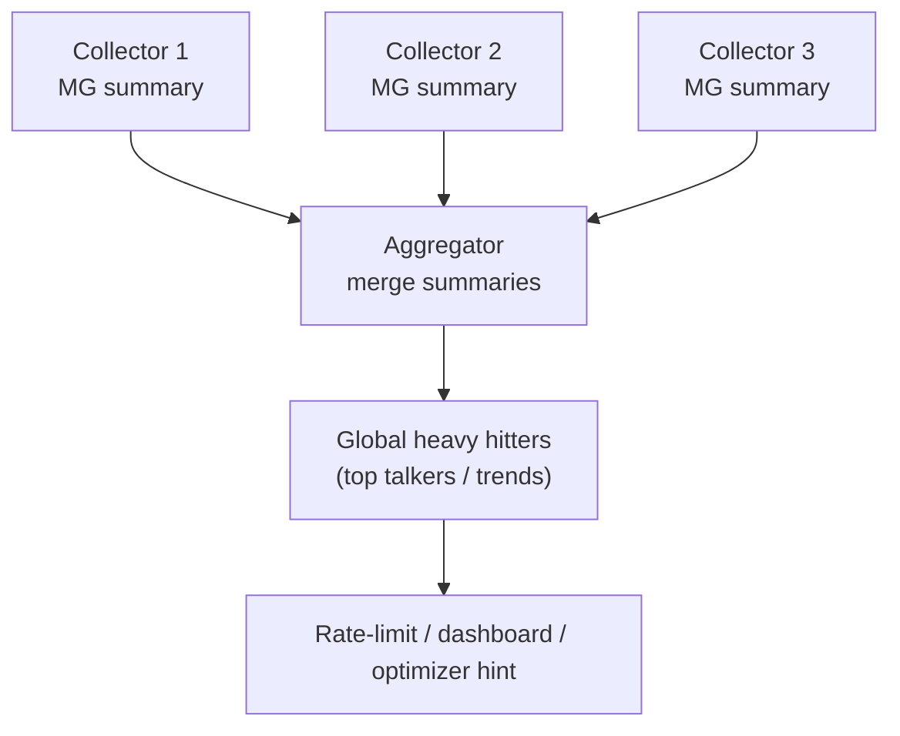
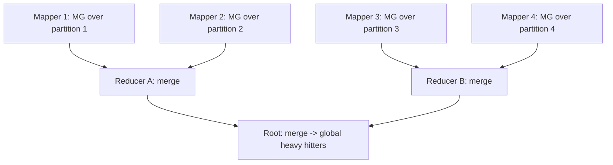

# Misra-Gries Heavy Hitters — Senior Level

> Misra-Gries is rarely the bottleneck on one small array — but the moment you must find heavy hitters across a sharded firehose of network traffic, merge per-node summaries into a global picture, hold a strict memory budget on every monitoring agent, or feed a DDoS / query-optimizer pipeline that runs continuously, every property (mergeability, the memory-vs-accuracy dial, concurrency, windowing, summary serialization) becomes a system-design decision.

## Table of Contents
1. [Introduction](#1-introduction)
2. [Where Misra-Gries Lives in Real Systems](#2-where-misra-gries-lives-in-real-systems)
3. [The Merge Property for Distributed/Parallel Streams](#3-the-merge-property-for-distributedparallel-streams)
4. [Memory vs Accuracy Tradeoff at Scale](#4-memory-vs-accuracy-tradeoff-at-scale)
5. [Concurrency and Sharding](#5-concurrency-and-sharding)
6. [Windowing and Decay](#6-windowing-and-decay)
7. [Code Examples](#7-code-examples)
8. [Observability and Testing](#8-observability-and-testing)
8b. [Summary Serialization and Wire Format](#8b-summary-serialization-and-wire-format)
8c. [Capacity-Planning Case Study](#8c-capacity-planning-case-study-ddos-top-talker-detection)
8d. [Frequently Asked Questions](#8d-frequently-asked-questions)
9. [Failure Modes](#9-failure-modes)
10. [Summary](#10-summary)

---

## 1. Introduction

At the senior level the question is no longer "how does the decrement-all rule work" but "what system am I building, and what breaks when I scale it across machines?" Misra-Gries shows up in production in three recurring guises that share one engine:

1. **Per-node stream summaries that must merge.** Traffic is sharded across many collectors; each runs Misra-Gries locally, then the summaries are merged into a global heavy-hitter view. The *merge property* is what makes this sound.
2. **Strict-memory monitoring agents.** A sidecar or eBPF probe on every host can spare only a few kilobytes; Misra-Gries' `O(k)` footprint, fixed regardless of cardinality, is the selling point.
3. **Continuous heavy-hitter pipelines.** DDoS detection, top-talker dashboards, trending topics, and database query-plan profiling all need "which keys dominate *right now*," often over sliding windows.

All three reduce to: *run the `k - 1`-counter summary on each shard/window, choose `k` from the memory budget and accuracy target, and merge summaries correctly when aggregating.* This document treats those decisions in production terms.

The four senior decisions, recurring across all three guises:

1. **Counter budget `k`** — set by the memory budget and the smallest fraction you must detect.
2. **Merge strategy** — how to combine per-shard summaries while preserving the `εN` guarantee.
3. **Windowing** — global stream, tumbling windows, or sliding decay.
4. **Verification** — one-pass approximate vs a second exact pass (often impossible on unbounded streams, so an auxiliary exact aggregate or sketch is used instead).

Get these four right and Misra-Gries is correct, cheap, and mergeable across a fleet; get any wrong and you silently miss a top talker or blow your memory budget.

---

## 2. Where Misra-Gries Lives in Real Systems

| System | Heavy hitters are... | Why Misra-Gries fits |
|--------|----------------------|----------------------|
| **Network traffic monitoring** | top source/destination IPs, flows, ports | bounded memory per line-rate collector; mergeable across collectors |
| **DDoS detection** | IPs/subnets sending an outsized share of packets | one pass, real-time, tiny state; flags candidates for rate-limiting |
| **Trending topics / search** | hashtags, queries, URLs over a window | `O(k)` per shard; merge shard summaries for the global trend |
| **Database query optimization** | most-frequent column values (skew detection) | informs histograms / cardinality estimates with bounded scan cost |
| **CDN / cache analytics** | hottest objects (candidates for pinning) | identify what to keep hot without storing per-object counts |
| **Telemetry / logs** | noisiest log templates, top error codes | fixed memory on agents with huge cardinality |

The unifying theme: **huge cardinality, bounded memory, only the dominant keys matter.** A full `O(distinct)` hash map is infeasible at line rate; Misra-Gries (or its cousin Space-Saving, cross-link `11-space-saving-algorithm`) is the standard answer.



---

## 3. The Merge Property for Distributed/Parallel Streams

The single most important *systems* property of Misra-Gries is that summaries **merge**. If shard 1 processed `n1` items and shard 2 processed `n2`, a merged summary over the combined `n1 + n2` items can be built from the two summaries alone — no re-scanning the raw streams.

### The merge algorithm

Given two Misra-Gries summaries `S1` and `S2` (each ≤ `k - 1` counters), to merge into a summary that still has ≤ `k - 1` counters:

```
merge(S1, S2, k):
    # 1. Combine: add counts of common keys, union distinct keys.
    C = S1
    for (key, cnt) in S2:
        C[key] += cnt          # 0 if absent
    # 2. If more than k-1 keys remain, prune:
    if len(C) >= k:
        # take the k-th largest count as the "decrement amount"
        t = (k-th largest value in C)
        for key in C:
            C[key] -= t
        drop keys with count <= 0
    return C
```

The prune step subtracts the `k`-th largest counter value from *all* counters and discards non-positives, leaving at most `k - 1` entries. This is the multi-counter generalization of decrement-all applied once at merge time.

### Why the merged summary keeps the guarantee

The merged summary satisfies, for the combined stream of `N = n1 + n2` items:

```
f(x) - N/k ≤ est_merged(x) ≤ f(x)
```

Intuitively: each shard's summary already undercounts by at most `n_i/k`; the prune subtracts at most `N/k` more total (the threshold `t` is bounded because total mass is `N`). The formal proof (Agarwal, Cormode, Huang, Phillips, Wei, Yi, 2012 — *Mergeable Summaries*) shows Misra-Gries is a **mergeable summary**: arbitrary merge trees over any partition give the same `εN` guarantee as a single pass. This is what makes it correct for MapReduce, parameter-server, and tree-aggregation topologies.

### Merge correctness conditions

| Condition | Why it matters |
|-----------|----------------|
| Same `k` across all summaries | mixing different `k` muddies the error bound; standardize `k` fleet-wide |
| Track per-summary `n_i` | needed to compute the final threshold `N/k` |
| Prune to ≤ `k - 1` after every merge | otherwise memory grows with merge fan-in |
| Merge is associative & commutative | enables any aggregation tree / order |

Because merge is associative and commutative, you can build **any** reduction tree — pairwise, hierarchical, or streaming roll-up — and get the same guarantee. That property is exactly what distributed aggregation frameworks require.

### Merge in a MapReduce / tree-aggregation topology



Each mapper emits a tiny `O(k)` summary, not raw data — so the shuffle volume is `O(k × #mappers)` instead of `O(n)`. This is the decisive scalability win: the network carries summaries, and the reduce tree folds them with the merge operator. Because the guarantee depends only on the *total* item count `N`, the depth and shape of the reduce tree are irrelevant to correctness — a balanced tree (low latency) and a linear chain (simple) give identical error bounds.

### A worked merge

With `k = 3`, merging `S_A = {X:5, Y:3}` (`n_A = 12`) and `S_B = {X:2, Z:4}` (`n_B = 10`):

1. **Combine:** `{X:7, Y:3, Z:4}` — 3 keys, ≥ `k`, so prune.
2. **Prune:** values sorted `[7, 4, 3]`; `k`-th largest is `t = 3`. Subtract: `X:4, Y:0 (drop), Z:1`.
3. **Result:** `{X:4, Z:1}`, ≤ `k - 1 = 2` entries.

The merged summary over `N = 22` items keeps the dominant `X` and obeys `f(x) - N/k ≤ est(x) ≤ f(x)` — the same guarantee as a single pass over the concatenated stream.

---

## 4. Memory vs Accuracy Tradeoff at Scale

The single dial is `k` (equivalently `ε = 1/k`). At scale you set it from two constraints:

1. **Memory budget.** Each counter is `(key, count)` — say `key` is a 16-byte IPv6 plus an 8-byte count = 24 bytes. A budget of `B` bytes per agent gives `k - 1 ≈ B / 24` counters, hence `ε ≈ 24/B`.
2. **Detection target.** To catch any flow that is `≥ φ` of traffic, you need `k ≥ 1/φ`. If you must catch flows as small as 0.1% of traffic, `k ≥ 1000`.

| Counters (`k - 1`) | `ε = 1/k` (undercount fraction) | Smallest detectable share | Approx memory (24 B/counter) |
|--------------------|---------------------------------|---------------------------|------------------------------|
| 99 | 1% | > 1% | ~2.4 KB |
| 999 | 0.1% | > 0.1% | ~24 KB |
| 9,999 | 0.01% | > 0.01% | ~240 KB |
| 99,999 | 0.001% | > 0.001% | ~2.4 MB |

The relationship is **linear in `1/ε`** — to halve the error you double the counters. That is far cheaper than the `O(distinct)` of exact counting (which on an IP stream could be billions of entries) but more expensive per unit accuracy than... nothing — there is no free lunch, only a clean linear dial.

### Sizing rule of thumb

```text
k = max( ceil(1 / phi_target) , floor(budget_bytes / bytes_per_counter) + 1 )
```

Take the *larger* of "accuracy-required `k`" and "budget-allowed `k`" — and if the budget cannot meet the accuracy target, you must either raise the budget or accept missing smaller hitters.

### Space-Saving as the throughput-optimized sibling

At very high line rate, the `O(k)` decrement-all sweep can dominate. **Space-Saving** (cross-link `11-space-saving-algorithm`) replaces only the minimum counter on overflow, an `O(1)` (with a min-heap or stream-summary structure) operation, and gives tight top-`k` ranking — at the cost of overcounting. Many production top-talker systems use Space-Saving for this reason; Misra-Gries is preferred when undercount semantics or strict determinism are required, or when mergeability with the classic `εN` guarantee is the priority.

### The cost ledger at scale

Putting the trade-offs in one table for a fleet decision:

| Concern | Misra-Gries | Space-Saving | Count-Min |
|---------|-------------|--------------|-----------|
| Memory per node | `O(1/ε)` counters | `O(1/ε)` counters | `O((1/ε) log(1/δ))` cells |
| Update worst case | `O(k)` (or `O(1)` w/ stream-summary) | `O(1)` | `O(log(1/δ))` |
| Error direction | undercount (conservative) | overcount | overcount (probabilistic) |
| Mergeable | yes (clean `εN`) | yes | yes (add sketches) |
| Deletions (turnstile) | no | no | yes |
| Top-`k` ranking quality | fair | best | needs heap |
| Determinism | yes | yes | no |

The senior call is rarely "which is best" in the abstract — it is "which error direction and update model does *this* pipeline need?" Conservative alerting (never overstate a talker) → Misra-Gries. Best top-`k` leaderboard at line rate → Space-Saving. Streams with removals or arbitrary point queries → Count-Min.

---

## 5. Concurrency and Sharding

A single Misra-Gries instance is **not** thread-safe — the decrement-all sweep is a multi-key critical section. Two production patterns:

1. **Shard-then-merge (preferred).** Give each worker/core its own Misra-Gries instance over a partition of the stream (e.g. hash the key to a shard), then merge summaries periodically. No shared mutable state on the hot path; merges are infrequent and cheap. This is the natural fit and exploits mergeability.
2. **Lock the whole summary.** A single instance behind a mutex. Simple but serializes every update — only viable at low rates.

Shard-then-merge scales linearly and is the canonical distributed design. Note that **partitioning by key** keeps each key's occurrences on one shard (so per-shard counts are exact for that key), whereas **partitioning by arrival** (round-robin) spreads a key across shards and relies entirely on the merge guarantee — both are sound, but key-partitioning gives tighter local estimates.

### Thread-safe single-instance wrapper

#### Go

```go
package main

import (
	"sort"
	"sync"
)

type MisraGries struct {
	mu sync.Mutex
	k  int
	c  map[string]int
	n  int
}

func NewMisraGries(k int) *MisraGries {
	return &MisraGries{k: k, c: make(map[string]int)}
}

func (m *MisraGries) Add(x string) {
	m.mu.Lock()
	defer m.mu.Unlock()
	m.n++
	if _, ok := m.c[x]; ok {
		m.c[x]++
	} else if len(m.c) < m.k-1 {
		m.c[x] = 1
	} else {
		for key := range m.c {
			m.c[key]--
			if m.c[key] == 0 {
				delete(m.c, key)
			}
		}
	}
}

// Merge folds another summary into this one and prunes to k-1 counters.
func (m *MisraGries) Merge(o *MisraGries) {
	m.mu.Lock()
	defer m.mu.Unlock()
	m.n += o.n
	for key, cnt := range o.c {
		m.c[key] += cnt
	}
	if len(m.c) >= m.k {
		vals := make([]int, 0, len(m.c))
		for _, v := range m.c {
			vals = append(vals, v)
		}
		sort.Sort(sort.Reverse(sort.IntSlice(vals)))
		t := vals[m.k-1] // k-th largest (0-indexed k-1)
		for key := range m.c {
			m.c[key] -= t
			if m.c[key] <= 0 {
				delete(m.c, key)
			}
		}
	}
}
```

#### Java

```java
import java.util.*;
import java.util.concurrent.locks.ReentrantLock;

public class MisraGries {
    private final ReentrantLock lock = new ReentrantLock();
    private final int k;
    private final Map<String, Integer> c = new HashMap<>();
    private long n = 0;

    public MisraGries(int k) { this.k = k; }

    public void add(String x) {
        lock.lock();
        try {
            n++;
            if (c.containsKey(x)) c.put(x, c.get(x) + 1);
            else if (c.size() < k - 1) c.put(x, 1);
            else {
                Iterator<Map.Entry<String,Integer>> it = c.entrySet().iterator();
                while (it.hasNext()) {
                    var e = it.next();
                    if (e.getValue() == 1) it.remove();
                    else e.setValue(e.getValue() - 1);
                }
            }
        } finally { lock.unlock(); }
    }

    public void merge(Map<String,Integer> other, long otherN) {
        lock.lock();
        try {
            n += otherN;
            for (var e : other.entrySet())
                c.merge(e.getKey(), e.getValue(), Integer::sum);
            if (c.size() >= k) {
                List<Integer> vals = new ArrayList<>(c.values());
                vals.sort(Collections.reverseOrder());
                int t = vals.get(k - 1);          // k-th largest
                c.values().removeIf(v -> false);  // placeholder; do explicit pass
                Iterator<Map.Entry<String,Integer>> it = c.entrySet().iterator();
                while (it.hasNext()) {
                    var e = it.next();
                    int nv = e.getValue() - t;
                    if (nv <= 0) it.remove(); else e.setValue(nv);
                }
            }
        } finally { lock.unlock(); }
    }

    public Map<String,Integer> snapshot() {
        lock.lock();
        try { return new HashMap<>(c); } finally { lock.unlock(); }
    }
}
```

#### Python

```python
import threading


class MisraGries:
    def __init__(self, k):
        self._lock = threading.Lock()
        self.k = k
        self.c = {}
        self.n = 0

    def add(self, x):
        with self._lock:
            self.n += 1
            if x in self.c:
                self.c[x] += 1
            elif len(self.c) < self.k - 1:
                self.c[x] = 1
            else:
                for key in list(self.c):
                    self.c[key] -= 1
                    if self.c[key] == 0:
                        del self.c[key]

    def merge(self, other_counts, other_n):
        with self._lock:
            self.n += other_n
            for key, cnt in other_counts.items():
                self.c[key] = self.c.get(key, 0) + cnt
            if len(self.c) >= self.k:
                t = sorted(self.c.values(), reverse=True)[self.k - 1]  # k-th largest
                for key in list(self.c):
                    self.c[key] -= t
                    if self.c[key] <= 0:
                        del self.c[key]
```

The `merge` method is what enables the shard-then-merge topology: each shard reports its `(counts, n)` to an aggregator that folds them all together.

---

## 6. Windowing and Decay

Continuous monitoring rarely wants "heavy hitters since the dawn of time" — it wants "heavy hitters *now*." Three windowing strategies:

| Strategy | How | Trade-off |
|----------|-----|-----------|
| **Tumbling windows** | reset the summary each window (e.g. every minute) | simple; abrupt boundaries, loses cross-boundary trends |
| **Sliding windows (merge of sub-windows)** | keep one MG per sub-window; merge the last `w` for the current view | smoother; more memory (`w` summaries) |
| **Exponential decay** | periodically scale all counts by a decay factor `γ < 1` | recency-weighted; counts become weighted frequencies |

Tumbling-plus-merge is the common production choice: maintain a short MG per small sub-window, merge the recent ones on query. Because merge preserves the `εN` guarantee, the windowed heavy hitters inherit the same bound over the window's item count. (For windowed exactness, Lossy Counting's bucketed design — see middle-level comparison — is sometimes preferred.)

### Sliding window via a ring of sub-window summaries

The cleanest way to get a sliding window out of a non-windowed summary is the **ring buffer of sub-windows** pattern, and it works precisely *because* Misra-Gries is mergeable:

```text
maintain W sub-window summaries in a ring: [S_0, S_1, ..., S_{W-1}]
on each tick (e.g. every second):
    advance the ring head; reset the summary now leaving the window
on each item:
    add it to the current head summary only
on query "heavy hitters over the last W ticks":
    answer = merge(S_0, S_1, ..., S_{W-1})    # fold the live sub-windows
```

Each item touches exactly one sub-window summary, so per-item cost stays `O(1)` amortized. A query folds `W` summaries with the merge operator — `O(W·k)` work, done only on query, not per item. The window "slides" by resetting the oldest sub-window each tick rather than maintaining a true element-by-element sliding window (which Misra-Gries alone cannot do exactly). The accuracy is the merged `εN_window` bound over the window's item count `N_window`. The granularity of "slide" equals the sub-window width: finer sub-windows give a smoother slide at the cost of more summaries (`W` of them, `O(W·k)` total memory).

This is why mergeability is not just a distributed-systems property — it is *also* the mechanism that turns a one-shot summary into a windowed one. Distributed aggregation and time-windowing are the same `merge` operator applied along different axes (space vs time).

### Decay vs windows — which to pick

| You want | Use | Why |
|----------|-----|-----|
| Hard "last N minutes" boundary | tumbling or sliding ring | exact window membership |
| Smooth recency weighting, no hard cutoff | exponential decay (scale counts by `γ`) | cheap, single summary, but counts become *weighted* not raw |
| Both bounded memory and exact windowed counts | Lossy Counting (bucketed) | bucket schedule gives windowed `εN` natively |

Exponential decay is attractive because it needs only one summary: periodically multiply every counter by `γ < 1` (and the running `n` too) so old mass fades geometrically. The catch is that the resulting "frequencies" are *decayed weights*, not raw counts, so the `n/k` guarantee is restated in terms of decayed mass — fine for trending/ranking, subtle for anything that must report literal counts.

---

## 7. Code Examples

### Distributed shard-then-merge driver

#### Python

```python
def parallel_heavy_hitters(shards, k):
    """shards: list of item-lists processed independently, then merged."""
    summaries = []
    for shard in shards:
        mg = MisraGries(k)
        for x in shard:
            mg.add(x)
        summaries.append((dict(mg.c), mg.n))

    # tree/linear merge
    agg = MisraGries(k)
    for counts, n in summaries:
        agg.merge(counts, n)
    return dict(agg.c), agg.n


if __name__ == "__main__":
    shards = [
        ["A", "A", "B", "C", "A"],
        ["A", "D", "A", "B", "A"],
        ["E", "A", "A", "F", "A"],
    ]
    counts, n = parallel_heavy_hitters(shards, k=3)
    print("merged candidates:", counts, "n =", n)  # A dominates
```

Each shard is processed in isolation (could be different machines); only the compact summaries cross the network. This is the textbook pattern for MapReduce-style heavy-hitter jobs.

---

## 8. Observability and Testing

| Metric | Why | Alert |
|--------|-----|-------|
| `counters_in_use` | should sit near `k - 1` under load | if always far below, `k` is oversized |
| `decrement_all_rate` | high churn → many distinct rare items | informs whether Space-Saving would be cheaper |
| `merge_prune_drops` | keys discarded per merge | high drops near boundaries → consider larger `k` |
| `estimated_vs_exact_gap` (sampled) | sanity on the `n/k` bound | gap exceeding `n/k` signals a bug |
| `summary_bytes` | memory budget tracking | approaching budget → cap `k` |

Testing checklist:
- **Invariant test:** on random data, assert `f(x) - n/k ≤ est(x) ≤ f(x)` and that no true heavy hitter is missed.
- **Merge equivalence:** merging per-shard summaries must give the same guarantee as a single pass over the concatenation; test with random partitions.
- **Associativity/commutativity:** different merge orders/trees yield summaries with the same retained heavy set.
- **Boundary:** an item at exactly `n/k` may or may not appear — do not assert it must.

---

## 8b. Summary Serialization and Wire Format

Mergeability is only useful if you can *ship* a summary across the network cheaply. A Misra-Gries summary is just a small map plus the per-summary item count `n`, so the wire format is trivial — and that triviality is the point: a shard sends `O(k)` bytes per reporting interval, not `O(n)`.

| Field | Type | Notes |
|-------|------|-------|
| `k` | varint | must match fleet-wide; reject merges with mismatched `k` |
| `n` | varint (or uint64) | items this summary observed — needed for the global `N/k` threshold |
| `entries` | array of `(key, count)` | ≤ `k - 1` of them |

A few production rules:

- **Fingerprint long keys.** Sending full IPv6 addresses or URLs inflates each entry. Hash keys to a fixed `w`-bit fingerprint (e.g. 64-bit) before they enter the summary; accept the tiny collision probability `≈ k / 2^w`. This keeps the wire size and the per-counter size constant regardless of key length.
- **Version the format.** A one-byte version prefix lets you evolve the entry encoding without breaking older aggregators during a rolling deploy.
- **Validate `k` on ingest.** An aggregator that receives a summary with the wrong `k` must reject or down-prune it; silently merging mismatched `k` muddies the `εN` bound (see Failure Modes).

Because each summary is `O(k)` bytes, the aggregator's inbound bandwidth is `O(k × #shards × report_rate)` — independent of traffic volume. This is the decisive property that lets a thousand line-rate collectors feed one aggregator without overwhelming it.

---

## 8c. Capacity-Planning Case Study: DDoS Top-Talker Detection

Concrete numbers anchor the dials. Suppose you run a CDN edge with **200 collectors**, each seeing **2 Mpps** (million packets/sec), and you must flag any source `/24` subnet sending more than **0.05%** of traffic within a 10-second window, on a **per-collector memory budget of 64 KB**.

**Step 1 — accuracy-required `k`.** To catch a `φ = 0.0005` share, `k ≥ 1/φ = 2000`. Use `k = 2000`, so `k - 1 = 1999` counters.

**Step 2 — budget check.** Key = 32-bit subnet fingerprint (4 B) + 8 B count = 12 B per counter. `1999 × 12 ≈ 24 KB` — comfortably inside 64 KB. Budget is not the binding constraint here; accuracy is. (If the budget *were* binding, `k_budget = ⌊64 KB / 12 B⌋ + 1 ≈ 5462`, larger than needed, so we keep `k = 2000`.)

**Step 3 — window.** A 10-second window at 2 Mpps is `N_window ≈ 20M` packets per collector. Maintain a tumbling MG per 1-second sub-window (10 of them) and merge the last 10 on query — smooth boundaries, `10 × 24 KB = 240 KB` of summary state on the agent.

**Step 4 — global merge.** Each collector ships its `O(k)` summary every second: `2000 entries × 12 B ≈ 24 KB × 200 collectors = 4.8 MB/s` of summary traffic to the aggregator — trivial versus the raw `400 Mpps` aggregate. The aggregator merges all 200 into a global view, applies the global threshold `N_global / k` over `N_global ≈ 4B packets`, and emits subnets above `0.05%` as rate-limit candidates.

**Step 5 — verification.** On an unbounded live stream you cannot replay for a second pass, so maintain an **auxiliary exact counter** for just the small candidate set (≤ `k - 1 = 1999` keys) over the next window to confirm before triggering an automated rate-limit — this avoids acting on a false positive that the one-sided guarantee permits.

The whole pipeline costs ~24 KB per agent, ~5 MB/s of summary traffic, and catches every subnet genuinely above 0.05% (no false negatives), with the auxiliary counter removing false positives before any enforcement action. That is the senior-level value of Misra-Gries: a fleet-wide heavy-hitter detector whose cost is independent of traffic volume.

---

## 8d. Frequently Asked Questions

**Q: Can I merge summaries built with different `k`?** Not cleanly. The error bound assumes a uniform `k`. If you must, prune all summaries down to the *smallest* `k` first, then merge — but you inherit the weaker (larger `ε`) bound of that smallest `k`. Standardize `k` fleet-wide to avoid this.

**Q: Does merge order or tree shape affect the result's accuracy?** No. Merge is associative and commutative, and the mergeable-summaries theorem proves the final `N/k` guarantee depends only on the total item count `N`, not on the number, order, or arrangement of merges. A balanced tree (low latency) and a linear chain give identical bounds.

**Q: Why not just send raw counts and aggregate exactly?** Because the raw stream is `O(n)` — billions of packets. Summaries are `O(k)` — a few thousand entries. Sending summaries is the entire scalability story; exact aggregation would saturate the network and the aggregator.

**Q: How do I get exactness on an unbounded stream where I cannot do a second pass?** Maintain an auxiliary exact aggregate (a small hash map) for *only* the candidate set, over a following window. The candidate set is `≤ k - 1` keys, so this is cheap, and it converts the one-sided guarantee into a verified answer without replaying the stream.

**Q: An attacker floods unique source IPs to hide a real attacker — does this break Misra-Gries?** No. Flooding distinct keys just triggers more decrement-all events, but the bound `est(x) ≥ f(x) - n/k` still holds, so a *genuinely* heavy attacker (truly `> n/k`) still survives. Watch `decrement_all_rate` as a churn signal; consider Space-Saving or a pre-filter if the flood is extreme.

**Q: Should I partition by key or by arrival across shards?** Key-partitioning (hash the key to a shard) keeps each key's occurrences on one shard, giving exact per-shard local counts and tighter estimates. Arrival-partitioning (round-robin) spreads a key across shards and leans entirely on the merge guarantee. Both are sound; key-partitioning is tighter when feasible.

---

## 9. Failure Modes

- **Wrong `k` across the fleet.** Merging summaries built with different `k` muddies the error bound. *Fix:* standardize `k`; if you must mix, prune to the smallest `k`.
- **Reporting candidates as exact.** Downstream rate-limiters act on false positives. *Fix:* verify with a second exact pass or an auxiliary counter for the small candidate set.
- **Memory budget blown by large keys.** Counting full URLs/IPv6 as keys inflates per-counter size. *Fix:* hash keys to fixed-width fingerprints (accepting rare collisions) or cap key length.
- **Adversarial cardinality.** An attacker floods unique keys to trigger constant decrement-all, masking a real hitter. *Fix:* this is bounded — the real hitter still survives if truly `> n/k` — but watch `decrement_all_rate`; consider Space-Saving or a pre-filter.
- **Skipping windowing on unbounded streams.** Old traffic dominates forever. *Fix:* tumbling/sliding windows or decay.
- **Non-thread-safe sharing.** A single instance updated from multiple threads corrupts during decrement-all. *Fix:* shard-then-merge, or lock the whole summary.

---

## 10. Summary

At senior level Misra-Gries is a **mergeable, bounded-memory stream summary** for heavy hitters, deployed in network monitoring, DDoS detection, trending topics, CDN analytics, and query optimization. Its defining systems property is **mergeability**: per-shard summaries combine — add common counts, then prune by subtracting the `k`-th largest value — into a global summary that keeps the same `f(x) - N/k ≤ est(x) ≤ f(x)` guarantee over the combined stream, with the merge being associative and commutative so any aggregation tree works. The memory-vs-accuracy dial is `k = 1/ε`: counters (hence memory) grow linearly in `1/ε`, set by the smaller of the accuracy target `1/φ` and the budget. For concurrency, prefer **shard-then-merge** over a global lock; for "now" semantics, add **windowing or decay**. When line-rate throughput or top-`k` ranking dominates, the sibling **Space-Saving** (cross-link `11-space-saving-algorithm`) is the overcounting, `O(1)`-overflow alternative; Misra-Gries wins on determinism, undercount semantics, and the classic mergeable `εN` guarantee.

---

## Next step: [professional.md](./professional.md) — the formal error-bound proof (each decrement removes `k` distinct items), space optimality, and merge correctness.
