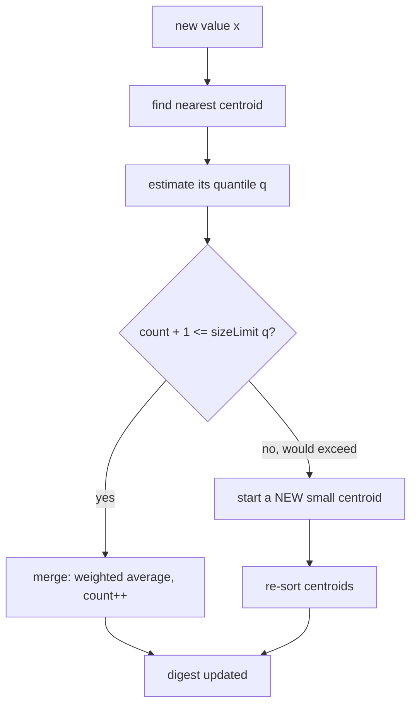

# t-digest & Streaming Quantiles — Junior Level

> **One-line summary:** To estimate percentiles (like the median p50 or the p99 "tail" latency) over a huge stream of numbers without storing them all, group nearby values into a small number of summary buckets called **centroids** (each centroid remembers a running mean and a count). A **t-digest** keeps centroids *small near the extremes* (q close to 0 or 1) and lets them grow *large in the middle*, so it stays tiny in memory while staying very accurate at the tails — exactly where p99/p999 monitoring needs it.

---

## Table of Contents

1. [Introduction](#introduction)
2. [Prerequisites](#prerequisites)
3. [Glossary](#glossary)
4. [Core Concepts](#core-concepts)
5. [Big-O Summary](#big-o-summary)
6. [Real-World Analogies](#real-world-analogies)
7. [Pros & Cons](#pros--cons)
8. [Step-by-Step Walkthrough](#step-by-step-walkthrough)
9. [Code Examples](#code-examples)
10. [Coding Patterns](#coding-patterns)
11. [Error Handling](#error-handling)
12. [Performance Tips](#performance-tips)
13. [Best Practices](#best-practices)
14. [Edge Cases & Pitfalls](#edge-cases--pitfalls)
15. [Common Mistakes](#common-mistakes)
16. [Cheat Sheet](#cheat-sheet)
17. [Visual Animation](#visual-animation)
18. [Summary](#summary)
19. [Further Reading](#further-reading)

---

## Introduction

Imagine you run a website and you want to know: *"How slow is my service for the unlucky users?"* The average response time is almost useless here — if 99 requests take 10 ms and one takes 5 seconds, the average is about 60 ms, which hides the 5-second disaster. What you actually want is the **p99 latency**: the response time such that 99% of requests are faster and only the slowest 1% are slower. That single number is a **quantile** (also called a **percentile**).

Now the hard part. Your service handles millions of requests per minute. Latencies stream in one number at a time, forever. You cannot store every measurement — that would be gigabytes per hour. And the textbook way to compute a percentile is to **sort all the numbers** and pick the one at position `0.99 × n`. Sorting needs all `n` values in memory and costs `O(n log n)`. Over an unbounded stream this is impossible.

So we need a way to estimate quantiles that:

1. Uses a **small, fixed amount of memory** (kilobytes, not gigabytes), no matter how long the stream is.
2. Processes each value in **one pass** — see it once, update a tiny summary, throw the raw value away.
3. Is **accurate where it matters** — and for latency monitoring, what matters is the **tails** (p99, p999), not the boring middle.

The **t-digest** is one of the most popular answers. The idea: instead of keeping every value, keep a small set of **centroids**. A centroid is just two numbers — a `mean` and a `count` — that stand in for a cluster of nearby values. When a new value arrives, it gets folded into the closest centroid (updating its mean and count), or it starts a new centroid. The clever twist is a rule that keeps centroids **small near the edges of the distribution** (so the tails are described in fine detail) and lets them **grow fat in the middle** (where we can afford to be vague). That rule is called the **scale function** `k(q)`.

This file builds the whole picture from the ground up: what a quantile is, why streaming forces us to summarize, the centroid idea, and a small worked example you can follow by hand.

---

## Prerequisites

Before reading this file you should be comfortable with:

- **Arrays / slices / lists** — storing a handful of small objects and sorting them.
- **Basic statistics vocabulary** — mean (average), median, and what "the 90th percentile" means in words.
- **Loops over a sequence** — `for value := range stream`.
- **Fractions and weighted averages** — combining two means with their counts: `(m1·c1 + m2·c2) / (c1 + c2)`.
- **Big-O notation** — `O(n log n)` for sorting, `O(1)` and `O(log n)` for small operations.

Optional but helpful:

- The idea of a **stream** whose total length is unknown or unbounded.
- A glance at sibling topic [`01-reservoir-sampling`](../01-reservoir-sampling/junior.md) — another "summarize a stream in small memory" algorithm.

---

## Glossary

| Term | Meaning |
|------|---------|
| **Quantile / percentile** | The value `x` such that a given fraction `q` of the data is `≤ x`. p50 = median, p99 = 99th percentile. `q` ranges from 0 to 1. |
| **Rank** | The position of a value if all data were sorted; rank `r` out of `n` corresponds to quantile `q = r/n`. |
| **CDF** | Cumulative distribution function — for each value, the fraction of data less than or equal to it. Quantiles are the inverse of the CDF. |
| **Stream** | Values arriving one at a time; total count `n` unknown until the end (or infinite). |
| **Centroid** | A summary of a cluster of nearby values, storing a `mean` and a `count` (weight). |
| **t-digest** | A data structure: a sorted set of centroids whose sizes are bounded by a scale function. |
| **Scale function `k(q)`** | The rule that decides how big a centroid may be at quantile position `q`; small at the tails, large in the middle. |
| **Compression parameter `δ` (delta)** | A knob (often written `1/δ` or "compression") trading memory for accuracy; bigger = more centroids = more accurate. |
| **Mergeable** | A property: two t-digests can be combined into one that summarizes both inputs — essential for distributed aggregation. |
| **Interpolation** | Estimating a quantile *between* two centroids by drawing a straight line between their positions. |

---

## Core Concepts

### 1. What a quantile actually is

Sort all your data. The quantile `q` (a number between 0 and 1) is the value at position `q × n` in that sorted list. The **median** is `q = 0.5`. The **p99** is `q = 0.99` — only 1% of values exceed it. The **p999** is `q = 0.999`. Quantiles answer "how bad is the typical bad case?" far better than the average does, because the average can be dragged around by a single huge outlier while the median and percentiles describe the *shape* of the data.

### 2. Why streaming makes this hard

The exact method — sort everything, index into it — needs the whole dataset in memory and `O(n log n)` time. On a stream of millions of values per second that runs forever, you cannot store `n` values and you cannot re-sort on every query. You must keep a **bounded summary** that you update online (one value at a time) and query at any moment. The summary is necessarily *approximate*: you trade a small, controlled error for a massive reduction in memory.

### 3. The centroid idea

Instead of remembering every value, remember **clusters**. A centroid `(mean, count)` says: "there were `count` values near this `mean`." If 5,000 values landed between 11 ms and 13 ms, one centroid `(mean=12.0, count=5000)` captures them in two numbers. The full summary is a *sorted list of centroids* spanning the whole range of the data. Add up the counts as you sweep left to right and you get an approximate sorted order — enough to read off any quantile.

### 4. Why the tails deserve smaller centroids

Here is the t-digest's signature insight. In the **middle** of the distribution (around the median), a little imprecision is harmless — moving p50 by a few values barely changes the answer. But at the **tails** (p99, p999), a single fat centroid would smear the answer badly: if one centroid covers the top 5% of data, you cannot tell p95 from p99 from p999 inside it. So a t-digest **forces centroids near `q = 0` and `q = 1` to stay small** (few values each) and **allows centroids near `q = 0.5` to grow large**. Same total memory, but the precision is concentrated where monitoring needs it.

### 5. The scale function `k(q)`

The size rule comes from a **scale function** `k(q)`. Think of `k` as a stretched-out ruler laid along the quantile axis from `q = 0` to `q = 1`. The ruler is stretched near the ends and compressed in the middle. A centroid is allowed to span at most a *fixed amount of ruler distance* `Δk = 1`. Because the ruler is stretched near the tails, "one unit of ruler" corresponds to a *tiny* slice of quantiles there — hence small centroids. In the middle, "one unit of ruler" covers a *wide* band of quantiles — hence large centroids. A common choice is

```
k(q) = (δ / 2π) · arcsin(2q − 1)
```

You do not need the exact formula yet — just the picture: **stretch the ruler at the edges, squeeze it in the middle.** Middle-level material derives this; here, hold the intuition.

### 6. Answering a quantile query by interpolation

To estimate, say, p99: sweep through the sorted centroids accumulating their counts. The running total tells you the approximate rank reached by the *end* of each centroid. Find the two centroids whose cumulative ranks straddle `0.99 × n`, then draw a straight line between their means and read off the value at the target rank. That straight-line step is **interpolation** — it smooths the answer between centroid means so you are not stuck reporting only the discrete centroid means.

---

## Big-O Summary

| Operation | Time | Space | Notes |
|-----------|------|-------|-------|
| Exact quantile via full sort | O(n log n) | **O(n)** | Stores every value — impossible on an unbounded stream. |
| t-digest: add one value | **O(log C)** | — | `C` = number of centroids; find nearest centroid (binary search). |
| t-digest: query a quantile | O(log C) or O(C) | — | Sweep/scan centroids and interpolate. |
| t-digest: total memory | — | **O(C)** | `C ≈ compression` (e.g. 100–1000 centroids), independent of `n`. |
| Merge two t-digests | O(C log C) | O(C) | Concatenate, sort, re-cluster; enables distributed aggregation. |

The headline: a t-digest holds a **constant** number of centroids — typically a few hundred — so its memory does **not** grow with the stream. A digest summarizing a billion values can fit in a few kilobytes. `C` is controlled by the **compression parameter**; larger compression means more centroids, more accuracy, more memory.

---

## Real-World Analogies

| Concept | Analogy |
|---------|---------|
| Exact quantile (sort everything) | Lining up every person in a country by height to find the exact 99th-percentile height — accurate but you need everyone in one room. |
| Centroid | A "group photo" caption: "about 5,000 people, average height 1.75 m" — two numbers replace thousands of measurements. |
| Small tail centroids | At a tailor's, you measure the unusual customers (very short, very tall) precisely, but lump average-height customers into broad size buckets (S/M/L). |
| Scale function `k(q)` | A ruler that is finely marked at both ends and coarsely marked in the middle — fine detail exactly where you read most carefully. |
| Interpolation | Reading a value *between* two ruler marks by eye, drawing a straight line between them. |
| Mergeable digests | Each store keeps its own group-photo summary; head office combines all the summaries into one national summary without re-photographing anyone. |

Where the analogy breaks: a group photo loses individuals forever, but a t-digest is *designed* so that the lost detail is provably small **where it matters** — the math guarantees tight tails, not just a vague summary.

---

## Pros & Cons

| Pros | Cons |
|------|------|
| Tiny, **bounded memory** (a few KB) regardless of stream length. | **Approximate** — answers have a small error (usually well under 1% relative at the tails). |
| **Excellent tail accuracy** (p99, p999) by design. | No hard worst-case error guarantee like GK; accuracy is *empirical*, not proven-tight. |
| **Mergeable** — combine per-node digests for distributed quantiles. | Implementation has subtle details (scale function, merge order). |
| Handles **any numeric range** automatically; no pre-set buckets needed. | Slightly more complex than a fixed-bucket histogram. |
| One pass, streaming-friendly, supports any quantile after the fact. | Worse for *uniform* mid-range accuracy than a sketch tuned for that. |

**When to use:** latency/SLA monitoring (p50/p99/p999), observability dashboards, distributed analytics where you must merge summaries from many machines, any time you need percentiles over a stream too big to store.

**When NOT to use:** when you need the *exact* quantile and the data fits in memory (just sort); when a fixed, known value range makes a simple histogram with hand-picked buckets good enough; when you need a *proven* deterministic error bound (consider GK — Greenwald-Khanna).

---

## Step-by-Step Walkthrough

Let us build a tiny t-digest by hand from a short stream, using a **maximum centroid size of 2** (a deliberately tiny limit so the example stays small). Real digests use a scale function; here we use "at most 2 values per centroid" just to see the mechanics.

Stream: `10, 12, 11, 50, 13, 12, 90, 11`

We keep centroids as `(mean, count)`, always sorted by mean.

```
add 10  -> [(10, 1)]
add 12  -> nearest is (10,1); it has room (count 1 < 2). Merge:
           new mean = (10·1 + 12·1)/2 = 11.0, count 2
        -> [(11.0, 2)]
add 11  -> nearest is (11.0,2); it is FULL (count 2). Start a new centroid.
        -> [(11.0, 2), (11.0, 1)]   (sorted; ties kept)
add 50  -> nearest centroid mean is 11; distance 39 — far. New centroid.
        -> [(11.0, 2), (11.0, 1), (50, 1)]
add 13  -> nearest is (11.0,1) (the one with room); merge:
           mean = (11·1 + 13·1)/2 = 12.0, count 2
        -> [(11.0, 2), (12.0, 2), (50, 1)]
add 12  -> nearest with room is (50,1)? No — nearest by mean is 12.0 but it is FULL.
           Next nearest with room is (11.0,2) FULL too. (50,1) has room but is far.
           When the closest centroids are full, start a new one near the value.
        -> [(11.0, 2), (12.0, 1), (12.0, 2), (50, 1)]
add 90  -> far from everything; new centroid.
        -> [(11.0, 2), (12.0, 1), (12.0, 2), (50, 1), (90, 1)]
add 11  -> nearest with room is (12.0,1); merge:
           mean = (12·1 + 11·1)/2 = 11.5, count 2
        -> [(11.0, 2), (11.5, 2), (12.0, 2), (50, 1), (90, 1)]
```

Final digest (5 centroids summarizing 8 values, total count = 8):

```
[(11.0, 2), (11.5, 2), (12.0, 2), (50, 1), (90, 1)]
```

**Now query the median (p50, target rank = 0.5 × 8 = 4).** Sweep, accumulating counts and tracking the *center* rank of each centroid:

```
centroid (11.0, 2): covers ranks 1–2, center ≈ 1.5
centroid (11.5, 2): covers ranks 3–4, center ≈ 3.5
centroid (12.0, 2): covers ranks 5–6, center ≈ 5.5
target rank 4 falls between centers 3.5 (mean 11.5) and 5.5 (mean 12.0).
interpolate: 11.5 + (4 − 3.5)/(5.5 − 3.5) · (12.0 − 11.5)
           = 11.5 + 0.25 · 0.5 = 11.625
```

So our estimated median is about **11.6**. The true sorted data is `10, 11, 11, 12, 12, 13, 50, 90`; the exact median (average of the 4th and 5th) is `(12 + 12)/2 = 12`. Close, with only 5 centroids holding 8 values — and on real data with hundreds of centroids the error shrinks dramatically, especially at the tails where centroids are kept small.

---

## Code Examples

### Example: A minimal t-digest (clustering + quantile query)

This is a *teaching* implementation. It keeps centroids sorted, merges a new value into the nearest centroid when that centroid is still "small enough," and otherwise starts a new centroid. The size limit uses the scale-function idea: a centroid may hold at most `4·n / compression · q(1−q)` values, which is small near the tails (`q≈0` or `q≈1`) and large in the middle (`q≈0.5`).

#### Go

```go
package main

import (
	"fmt"
	"math"
	"sort"
)

type centroid struct {
	mean  float64
	count float64
}

type TDigest struct {
	centroids   []centroid
	count       float64 // total values seen
	compression float64 // higher = more centroids = more accurate
}

func NewTDigest(compression float64) *TDigest {
	return &TDigest{compression: compression}
}

// sizeLimit returns the max count a centroid centered at quantile q may hold.
// Small near q=0 and q=1 (tails), large near q=0.5 (middle).
func (t *TDigest) sizeLimit(q float64) float64 {
	return 4 * t.count * q * (1 - q) / t.compression
}

func (t *TDigest) Add(x float64) {
	t.count++
	if len(t.centroids) == 0 {
		t.centroids = append(t.centroids, centroid{x, 1})
		return
	}
	// find nearest centroid by mean
	best, bestDist := -1, math.Inf(1)
	for i, c := range t.centroids {
		d := math.Abs(c.mean - x)
		if d < bestDist {
			bestDist, best = d, i
		}
	}
	// quantile position of the chosen centroid (rough)
	cum := 0.0
	for i := 0; i < best; i++ {
		cum += t.centroids[i].count
	}
	q := (cum + t.centroids[best].count/2) / t.count
	if t.centroids[best].count+1 <= t.sizeLimit(q) {
		c := &t.centroids[best]
		c.mean = (c.mean*c.count + x) / (c.count + 1)
		c.count++
	} else {
		t.centroids = append(t.centroids, centroid{x, 1})
		sort.Slice(t.centroids, func(i, j int) bool {
			return t.centroids[i].mean < t.centroids[j].mean
		})
	}
}

// Quantile returns the estimated value at quantile q in [0,1].
func (t *TDigest) Quantile(q float64) float64 {
	if len(t.centroids) == 0 {
		return math.NaN()
	}
	targetRank := q * t.count
	cum := 0.0
	for i, c := range t.centroids {
		center := cum + c.count/2
		if targetRank <= center || i == len(t.centroids)-1 {
			if i == 0 {
				return c.mean
			}
			prev := t.centroids[i-1]
			prevCenter := cum - prev.count/2
			frac := (targetRank - prevCenter) / (center - prevCenter)
			return prev.mean + frac*(c.mean-prev.mean)
		}
		cum += c.count
	}
	return t.centroids[len(t.centroids)-1].mean
}

func main() {
	td := NewTDigest(100)
	for _, v := range []float64{10, 12, 11, 50, 13, 12, 90, 11} {
		td.Add(v)
	}
	fmt.Printf("p50 ~ %.2f\n", td.Quantile(0.50))
	fmt.Printf("p99 ~ %.2f\n", td.Quantile(0.99))
}
```

#### Java

```java
import java.util.ArrayList;
import java.util.List;

public class TDigest {
    static class Centroid {
        double mean, count;
        Centroid(double m, double c) { mean = m; count = c; }
    }

    private final List<Centroid> centroids = new ArrayList<>();
    private double count = 0;
    private final double compression;

    public TDigest(double compression) { this.compression = compression; }

    private double sizeLimit(double q) {
        return 4 * count * q * (1 - q) / compression;
    }

    public void add(double x) {
        count++;
        if (centroids.isEmpty()) { centroids.add(new Centroid(x, 1)); return; }
        int best = -1; double bestDist = Double.POSITIVE_INFINITY;
        for (int i = 0; i < centroids.size(); i++) {
            double d = Math.abs(centroids.get(i).mean - x);
            if (d < bestDist) { bestDist = d; best = i; }
        }
        double cum = 0;
        for (int i = 0; i < best; i++) cum += centroids.get(i).count;
        Centroid c = centroids.get(best);
        double q = (cum + c.count / 2) / count;
        if (c.count + 1 <= sizeLimit(q)) {
            c.mean = (c.mean * c.count + x) / (c.count + 1);
            c.count++;
        } else {
            centroids.add(new Centroid(x, 1));
            centroids.sort((a, b) -> Double.compare(a.mean, b.mean));
        }
    }

    public double quantile(double q) {
        if (centroids.isEmpty()) return Double.NaN;
        double targetRank = q * count, cum = 0;
        for (int i = 0; i < centroids.size(); i++) {
            Centroid c = centroids.get(i);
            double center = cum + c.count / 2;
            if (targetRank <= center || i == centroids.size() - 1) {
                if (i == 0) return c.mean;
                Centroid prev = centroids.get(i - 1);
                double prevCenter = cum - prev.count / 2;
                double frac = (targetRank - prevCenter) / (center - prevCenter);
                return prev.mean + frac * (c.mean - prev.mean);
            }
            cum += c.count;
        }
        return centroids.get(centroids.size() - 1).mean;
    }

    public static void main(String[] args) {
        TDigest td = new TDigest(100);
        for (double v : new double[]{10, 12, 11, 50, 13, 12, 90, 11}) td.add(v);
        System.out.printf("p50 ~ %.2f%n", td.quantile(0.50));
        System.out.printf("p99 ~ %.2f%n", td.quantile(0.99));
    }
}
```

#### Python

```python
import math

class TDigest:
    def __init__(self, compression=100):
        self.centroids = []   # list of [mean, count], sorted by mean
        self.count = 0.0
        self.compression = compression

    def _size_limit(self, q):
        # small near the tails (q~0, q~1), large in the middle (q~0.5)
        return 4 * self.count * q * (1 - q) / self.compression

    def add(self, x):
        self.count += 1
        if not self.centroids:
            self.centroids.append([x, 1.0])
            return
        # nearest centroid by mean
        best = min(range(len(self.centroids)),
                   key=lambda i: abs(self.centroids[i][0] - x))
        cum = sum(c[1] for c in self.centroids[:best])
        q = (cum + self.centroids[best][1] / 2) / self.count
        c = self.centroids[best]
        if c[1] + 1 <= self._size_limit(q):
            c[0] = (c[0] * c[1] + x) / (c[1] + 1)
            c[1] += 1
        else:
            self.centroids.append([x, 1.0])
            self.centroids.sort(key=lambda c: c[0])

    def quantile(self, q):
        if not self.centroids:
            return float("nan")
        target = q * self.count
        cum = 0.0
        for i, c in enumerate(self.centroids):
            center = cum + c[1] / 2
            if target <= center or i == len(self.centroids) - 1:
                if i == 0:
                    return c[0]
                prev = self.centroids[i - 1]
                prev_center = cum - prev[1] / 2
                frac = (target - prev_center) / (center - prev_center)
                return prev[0] + frac * (c[0] - prev[0])
            cum += c[1]
        return self.centroids[-1][0]


if __name__ == "__main__":
    td = TDigest(compression=100)
    for v in [10, 12, 11, 50, 13, 12, 90, 11]:
        td.add(v)
    print(f"p50 ~ {td.quantile(0.50):.2f}")
    print(f"p99 ~ {td.quantile(0.99):.2f}")
```

**What it does:** keeps a small sorted set of `(mean, count)` centroids, folds each new value into the nearest centroid when that centroid is still under its size limit (smaller at the tails), and answers any quantile by interpolating between centroid centers. Real implementations buffer values and re-cluster in batches for speed; this version updates one value at a time for clarity.
**Run:** `go run main.go` | `javac TDigest.java && java TDigest` | `python tdigest.py`

---

## Coding Patterns

### Pattern 1: The (mean, count) weighted merge

**Intent:** Combining a value (or another centroid) into a centroid is a weighted average — the foundation of everything.

```python
def merge_into(centroid, mean2, count2):
    m1, c1 = centroid
    new_count = c1 + count2
    new_mean = (m1 * c1 + mean2 * count2) / new_count
    return [new_mean, new_count]
```

### Pattern 2: Cumulative-rank sweep

**Intent:** Convert "quantile `q`" into "target rank `q·n`," then sweep centroids accumulating counts until you straddle the target.

```python
def find_straddle(centroids, total, q):
    target = q * total
    cum = 0.0
    for i, (mean, count) in enumerate(centroids):
        if cum + count >= target:
            return i, cum   # target lies in centroid i
        cum += count
    return len(centroids) - 1, cum
```

### Pattern 3: Tail-aware size limit

**Intent:** A centroid near the tails must stay small; one in the middle may grow. The `q(1−q)` factor is the simplest expression of that rule.



---

## Error Handling

| Error | Cause | Fix |
|-------|-------|-----|
| `NaN` from a quantile query | Digest is empty (no values added). | Check `count == 0` and return an error or a sentinel before querying. |
| Quantile slightly outside `[min, max]` | Interpolation past the first/last centroid. | Clamp the result to the tracked global `min`/`max`, which a good digest stores separately. |
| Tails look coarse / inaccurate | `compression` too small, or size limit not shrinking at the tails. | Raise `compression`; verify the `q(1−q)` (or `arcsin`) scale factor is applied. |
| Memory grows with `n` | Centroids never merged; treating it like a plain list. | Enforce the size limit; periodically compress (merge adjacent small centroids). |
| Wrong answer after `q < 0` or `q > 1` | Invalid quantile argument. | Validate `0 ≤ q ≤ 1` before querying. |
| Averaging two services' p99 to get a global p99 | Percentiles are **not** additive/averageable. | Merge the *digests*, then query — never average the percentile numbers. |

---

## Performance Tips

- **Buffer and batch.** Real implementations collect incoming values into a small buffer, then merge-and-recluster the whole buffer at once — far faster than re-sorting on every single value.
- **Binary-search the nearest centroid** since centroids stay sorted by mean — `O(log C)` instead of `O(C)` per insert.
- **Track `min` and `max` separately** so exact extremes (p0, p100) are never lost to clustering.
- **Pick `compression` deliberately:** 100 is a common default; 200–500 for tight p999; higher costs more memory and merge time.
- **Reuse one digest per metric/dimension**, not one per request — the whole point is a single small summary.

---

## Best Practices

- Always compare your estimates against an **exact sort** on small test data before trusting the digest on production streams.
- Store and report the **true `min`/`max`** alongside the digest; clustering should never hide a record-breaking outlier.
- State your **error expectation** ("p99 within ~1%") — t-digest accuracy is empirical, so measure it on representative data.
- Choose **compression** based on which quantiles matter; if you live at p999, invest in more centroids.
- For distributed quantiles, **merge digests, never percentiles** — this is the single most important rule.
- Keep the centroid list, the merge, and the query as small, separately tested functions.

---

## Edge Cases & Pitfalls

- **Empty digest** — querying returns `NaN`; guard with a count check.
- **Single value** — every quantile equals that value; make sure interpolation handles a one-centroid digest.
- **All identical values** — one big centroid; quantiles all equal that value (correct).
- **Heavy outliers** — make sure `min`/`max` tracking preserves the true extremes.
- **Tiny streams** — for very few values, an exact sort is both simpler and exact; the digest shines only at scale.
- **Negative numbers / mixed signs** — handled fine; centroids are means, no assumption of positivity.
- **Averaging percentiles across shards** — the classic, dangerous mistake; merge digests instead.

---

## Common Mistakes

1. **Averaging percentiles.** "Server A's p99 is 100 ms, B's is 200 ms, so the fleet p99 is 150 ms" is *wrong*. Merge the digests and query the merged one.
2. **Using a uniform size limit** for all centroids — you lose the tail accuracy that is the whole point. Apply the `q(1−q)` / `arcsin` scale.
3. **Letting centroids grow without bound** — then memory tracks `n` and you have just reinvented a slow list.
4. **Forgetting `min`/`max`** — clustering can swallow the single worst latency, hiding a real incident.
5. **Treating estimates as exact** — they are approximate; never assert "the p99 is exactly X."
6. **Re-sorting on every insert in production** — buffer and batch instead.
7. **Querying an empty digest** without a guard — returns `NaN` and confuses dashboards.

---

## Cheat Sheet

| Question | Tool | Key idea |
|----------|------|----------|
| Exact percentile, data fits in RAM? | Sort + index | `sorted[round(q·n)]`, `O(n log n)`, `O(n)` memory |
| Percentile over an endless stream? | t-digest | small set of `(mean, count)` centroids |
| Accurate p99/p999 specifically? | t-digest scale function | small centroids at the tails |
| Combine summaries from many servers? | merge digests | mergeable property — never average percentiles |
| Convert quantile to a position? | rank = `q · n` | sweep centroids accumulating counts |
| Value between two centroids? | interpolation | straight line between centroid centers |

Core algorithm:

```
add(x):
    n += 1
    find nearest centroid c by mean
    q  = approximate quantile position of c
    if c.count + 1 <= sizeLimit(q):      # smaller near tails
        c = weighted-merge(c, x)         # (mean, count) average
    else:
        insert new centroid (x, 1); keep sorted

quantile(q):
    target = q * n
    sweep centroids accumulating counts
    interpolate between the two centroids straddling target
# memory: O(compression), independent of n
```

---

## Visual Animation

> See [`animation.html`](./animation.html) for an interactive visualization.
>
> The animation demonstrates:
> - A stream of values arriving and forming centroids along the distribution
> - Smaller centroids at the tails and larger ones in the middle (the scale function)
> - A quantile query sweeping the centroids and interpolating to an answer
> - Editable compression plus Add / Stream / Query / Reset controls
> - A live Big-O / accuracy panel and an operation log

---

## Summary

A **quantile** (percentile) answers "how bad is the bad case?" far better than the average — p99 and p999 are the heartbeat of latency monitoring. But computing them exactly means sorting all the data, which is impossible over an unbounded stream. The **t-digest** solves this by replacing raw values with a small, bounded set of **centroids** — each a `(mean, count)` pair — and by applying a **scale function** that keeps centroids **small at the tails** and **large in the middle**, concentrating precision exactly where p99/p999 monitoring needs it. You add values in one pass with bounded memory, and answer any quantile by sweeping the centroids and **interpolating**. Two rules to carry forward: clustering must shrink at the tails (or you lose the tail accuracy that is the whole point), and to combine summaries from many machines you **merge the digests** — you never average percentiles.

---

## Next step:

Continue to [`middle.md`](./middle.md) to derive the scale function `k(q)` precisely, understand merging and the mergeable property, and compare t-digest against histograms, GK (Greenwald-Khanna), and the KLL sketch.

---

## Further Reading

- Ted Dunning & Otmar Ertl — *"Computing Extremely Accurate Quantiles Using t-Digests"* (the original paper).
- Sibling topic [`01-reservoir-sampling`](../01-reservoir-sampling/junior.md) — another bounded-memory streaming summary.
- Sibling topic [`08-misra-gries-heavy-hitters`](../08-misra-gries-heavy-hitters/junior.md) — streaming frequency summaries.
- Greenwald & Khanna — *"Space-Efficient Online Computation of Quantile Summaries"* (the GK algorithm).
- The `tdigest` libraries: Apache (Java), `caio/go-tdigest` (Go), `tdigest` (Python).
- Prometheus & Elasticsearch docs — how t-digest / histograms back percentile metrics in observability tools.
