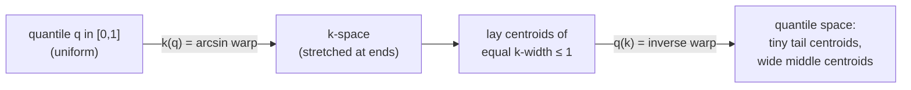
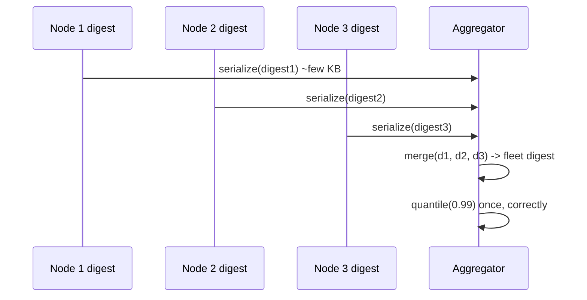

# t-digest & Streaming Quantiles — Middle Level

> **One-line summary:** A t-digest stays both tiny and tail-accurate because of a **scale function** `k(q)` that maps the quantile axis onto a "k-space" — stretched near `q=0` and `q=1`, compressed near `q=0.5` — and then only allows a centroid to span **one unit of k-space** (`Δk ≤ 1`). That single rule forces small centroids at the tails (fine percentile resolution) and large ones in the middle (cheap). Because centroids merge by weighted average, two digests can be concatenated and re-clustered — the **mergeable** property that makes distributed quantiles possible.

---

## Table of Contents

1. [Introduction](#introduction)
2. [Deeper Concepts](#deeper-concepts)
3. [The Scale Function k(q) in Detail](#the-scale-function-kq-in-detail)
4. [Merging and the Mergeable Property](#merging-and-the-mergeable-property)
5. [Comparison with Alternatives](#comparison-with-alternatives)
6. [Advanced Patterns](#advanced-patterns)
7. [Code Examples](#code-examples)
8. [Error Handling](#error-handling)
9. [Performance Analysis](#performance-analysis)
10. [Best Practices](#best-practices)
11. [Visual Animation](#visual-animation)
12. [Summary](#summary)

---

## Introduction

> Focus: "Why does it work?" and "When should I choose this?"

At the junior level we treated the centroid size limit as a hand-wavy `q(1−q)` factor. That works, but it hides the real mechanism. The t-digest's correctness and its remarkable tail accuracy come from one precise idea: a **scale function** `k(q)` that *re-coordinates* the quantile axis. In ordinary quantile space, `q` runs uniformly from 0 to 1. In **k-space**, the same range is **stretched out near the ends and squeezed in the middle**. The size rule is then beautifully simple: a centroid may cover at most a **fixed slice of k-space** (`Δk ≤ 1`). Translate that fixed k-slice back to quantile space and it becomes a *tiny* range of quantiles near the tails and a *wide* range in the middle — exactly the behavior we want.

This file makes that precise. We will write the canonical scale functions, see how they bound centroid size, walk through the **merge** procedure that gives t-digest its mergeable property (the reason it dominates in distributed systems), and compare it head-to-head with fixed-bucket histograms, the Greenwald-Khanna (GK) summary, and the KLL sketch. The goal: know not just *how* to use a t-digest but *why* it is the default choice for percentile monitoring and *when* a different sketch is the better tool.

---

## Deeper Concepts

### Invariant: bounded k-space width per centroid

The structural invariant a t-digest maintains is:

> For every centroid `i` with cumulative quantile range `[q_left, q_right]`, we have `k(q_right) − k(q_left) ≤ 1`.

Here `q_left` is the fraction of all data lying *before* the centroid, and `q_right = q_left + count_i / n`. The quantity `k(q_right) − k(q_left)` is the centroid's "width in k-space." Keeping it `≤ 1` is the only constraint. If a merge or insert would push a centroid over this width, the centroid must be split (or the value must start a new centroid). Everything else — accuracy, memory, the small-tail/large-middle shape — follows from this one invariant.

### Why bounded k-width gives bounded *relative* error at the tails

Because `k` is steep near `q=0` and `q=1`, a fixed k-width of 1 corresponds to a quantile width that **shrinks toward the tails**. Near `q = 0.99`, the centroid might span only `q ∈ [0.989, 0.991]` — a 0.2% slice — so reading p99 lands inside a very thin band, giving small *relative* error. Near `q = 0.5`, the same k-width might span `q ∈ [0.45, 0.55]` — a 10% slice — but in the middle the data is dense and the values within that band are close together, so the absolute error stays modest. This is the trade the scale function encodes: *resolution where you query precisely, economy where you do not.*

### k-space is a change of variables

Think of `k` as a monotonically increasing function `k: [0,1] → [0, δ]` (where `δ` is roughly the compression). Mapping data into k-space and laying down centroids of equal k-width is equivalent to *non-uniform bucketing in quantile space*. This is the same trick as histogram equalization in image processing or importance sampling in statistics: warp the axis so that equal-size buckets in the warped space mean unequal — and more useful — buckets in the original space.

### Recurrence / scaling intuition

```text
Number of centroids C ≈ δ          (the compression parameter)
Each centroid covers k-width ≈ 1, total k-range = k(1) − k(0) = δ
Memory: O(C) = O(δ), independent of n
Tail quantile resolution ∝ 1 / δ²  near the extremes (empirically),
   versus ∝ 1 / δ in the middle.
```

The squared factor at the tails is the informal reason t-digest is *unusually* good at p99/p999 for its size.

---

## The Scale Function k(q) in Detail

The scale function must be **monotonically increasing** (preserves order), **symmetric** around `q = 0.5` (tails treated equally), and **steepest at the ends** (small centroids there). Several choices satisfy this; the most common is `k1`, based on `arcsin`:

```text
k1(q) = (δ / (2π)) · arcsin(2q − 1)
```

Its inverse (to go from k back to q) is:

```text
q(k) = (1 + sin(2π·k / δ)) / 2
```

Why `arcsin`? Its derivative `dk/dq` blows up as `q → 0` or `q → 1` (the slope is infinite at the ends), which makes the k-axis stretch maximally there — forcing the smallest centroids exactly at the extremes.

Other scale functions trade tail emphasis for simpler math or one-sided accuracy:

| Scale function | Formula (schematic) | Tail behavior |
|----------------|---------------------|---------------|
| `k0` (uniform) | `k(q) = δ·q / 2` | Equal-size centroids everywhere — **no** tail emphasis (like a plain histogram). |
| `k1` (arcsin) | `(δ/2π)·arcsin(2q−1)` | Strong, symmetric tail accuracy — the classic t-digest. |
| `k2` | `δ/(4·log(n/δ)+24) · log(q/(1−q))` | Relative-error friendly; size adapts to `n`. |
| `k3` | piecewise around `q=0.5` | Bounded centroid size, simpler to implement. |

The practical takeaway: **`k1` (arcsin) is the default** and gives the symmetric p1/p99 accuracy people expect. The size limit derived from `k1` is approximately the `4·n·q·(1−q)/δ` factor we used at the junior level — that expression is the second-order approximation of the arcsin scale near the middle.



### How the size limit is enforced

When considering whether to merge value/centroid `x` into centroid `i`:

```text
q_left  = (cumulative count before centroid i) / n
q_right = q_left + (count_i + weight_of_x) / n
if k1(q_right) − k1(q_left) ≤ 1:   merge (weighted average)
else:                               x starts a new centroid
```

This is the exact form of the junior-level "size limit" check, now grounded in the scale function rather than a heuristic.

---

## Merging and the Mergeable Property

### What "mergeable" means

A summary structure is **mergeable** if there is an operation `merge(A, B)` producing a single summary of the *combined* data, with the *same* accuracy guarantee as if all the data had been fed into one summary from the start. t-digest is (empirically) mergeable, which is why it dominates distributed monitoring: every server builds its own digest from local data, and a central aggregator merges them all into one fleet-wide digest — then queries p99 *once*, correctly.

### The merge procedure

```text
merge(A, B):
    1. concatenate the centroid lists of A and B
    2. sort the combined centroids by mean
    3. shuffle order is sometimes randomized to avoid bias (impl detail)
    4. sweep left to right, greedily folding adjacent centroids together
       as long as the merged centroid's k-width stays ≤ 1
    5. result: a new digest summarizing all of A's and B's data
```

The key correctness fact: because centroids combine by **weighted average of means** and **sum of counts**, concatenating two digests preserves total count and the order of values. Re-clustering under the same `Δk ≤ 1` rule restores the size invariant. The merged digest has the same compression-bounded centroid count.

### Compression is just self-merge

"Compressing" a single digest (when it has accumulated too many small centroids from one-at-a-time inserts) is the same algorithm applied to one input: sort, sweep, fold under `Δk ≤ 1`. High-throughput implementations therefore **buffer** incoming values into a temporary unsorted list, and when the buffer fills, merge it into the main digest in one batched compression — turning many `O(log C)` inserts into one efficient `O((C+buffer) log(C+buffer))` pass.



---

## Comparison with Alternatives

| Attribute | t-digest | Fixed histogram | GK (Greenwald-Khanna) | KLL sketch |
|-----------|----------|-----------------|-----------------------|------------|
| Memory | O(δ), ~KB | O(buckets) fixed | O((1/ε)·log(εn)) | O((1/ε)·log log(1/εδ)) |
| Error type | rank error, **tail-tight**, empirical | depends on bucket layout | **deterministic** rank error ≤ εn | **randomized** rank error, w.h.p. |
| Tail (p99/p999) accuracy | **excellent** | poor unless buckets pre-tuned | uniform across q | uniform across q |
| Mergeable? | **yes** (empirically) | yes (add bucket counts) | awkward / lossy | **yes**, clean |
| Needs value range up front? | **no** | **yes** (must pick bucket edges) | no | no |
| Any quantile after the fact? | yes | yes | yes | yes |
| Worst-case guarantee? | no (empirical) | no | **yes** (deterministic) | yes (probabilistic) |

**Choose t-digest when:** you need percentiles over an unknown range with **tail accuracy** (latency monitoring), and you must merge per-node summaries. This is the default for observability.

**Choose a fixed histogram (e.g. Prometheus classic histogram) when:** you know the value range in advance, you want trivially-mergeable bucket counts, and your alerting thresholds align with pre-chosen bucket edges.

**Choose GK when:** you need a **provable** worst-case rank-error bound (`≤ εn`) for compliance or theory, and uniform accuracy across all quantiles is acceptable.

**Choose KLL when:** you want a **clean, provable** randomized guarantee with smaller asymptotic memory than GK and excellent mergeability — increasingly the academic "best" general sketch, though t-digest still wins on raw tail accuracy per byte in practice.

---

## Advanced Patterns

### Pattern: buffered batch insertion

#### Go

```go
func (t *TDigest) AddBuffered(x float64) {
	t.buffer = append(t.buffer, x)
	if len(t.buffer) >= t.bufferCap {
		t.flush() // sort buffer + main centroids, re-cluster under Δk ≤ 1
	}
}
```

#### Java

```java
public void addBuffered(double x) {
    buffer.add(x);
    if (buffer.size() >= bufferCap) {
        flush(); // sort buffer + centroids, re-cluster under Δk ≤ 1
    }
}
```

#### Python

```python
def add_buffered(self, x):
    self.buffer.append(x)
    if len(self.buffer) >= self.buffer_cap:
        self.flush()  # sort buffer + centroids, re-cluster under Δk ≤ 1
```

### Pattern: scale-function-driven size check

#### Go

```go
import "math"

func k1(q, delta float64) float64 {
	return delta / (2 * math.Pi) * math.Asin(2*q-1)
}

func canMerge(qLeft, qRight, delta float64) bool {
	return k1(qRight, delta)-k1(qLeft, delta) <= 1.0
}
```

#### Java

```java
static double k1(double q, double delta) {
    return delta / (2 * Math.PI) * Math.asin(2 * q - 1);
}

static boolean canMerge(double qLeft, double qRight, double delta) {
    return k1(qRight, delta) - k1(qLeft, delta) <= 1.0;
}
```

#### Python

```python
import math

def k1(q, delta):
    return delta / (2 * math.pi) * math.asin(2 * q - 1)

def can_merge(q_left, q_right, delta):
    return k1(q_right, delta) - k1(q_left, delta) <= 1.0
```

---

## Code Examples

### Full Implementation: scale-function t-digest with merge

#### Go

```go
package main

import (
	"fmt"
	"math"
	"sort"
)

type centroid struct{ mean, count float64 }

type TDigest struct {
	cs    []centroid
	n     float64
	delta float64 // compression
}

func New(delta float64) *TDigest { return &TDigest{delta: delta} }

func (t *TDigest) k1(q float64) float64 {
	if q <= 0 {
		return -t.delta / 4
	}
	if q >= 1 {
		return t.delta / 4
	}
	return t.delta / (2 * math.Pi) * math.Asin(2*q-1)
}

// Add buffers a single value then re-clusters (simple, not high-throughput).
func (t *TDigest) Add(x float64) {
	t.cs = append(t.cs, centroid{x, 1})
	t.n++
	t.compress()
}

// compress sorts and greedily folds centroids under the k-width rule.
func (t *TDigest) compress() {
	sort.Slice(t.cs, func(i, j int) bool { return t.cs[i].mean < t.cs[j].mean })
	out := []centroid{}
	cum := 0.0
	cur := t.cs[0]
	cum = cur.count
	for i := 1; i < len(t.cs); i++ {
		c := t.cs[i]
		qLeft := (cum - cur.count) / t.n
		qRight := (cum + c.count) / t.n
		if t.k1(qRight)-t.k1(qLeft) <= 1.0 {
			// fold c into cur (weighted average)
			nc := cur.count + c.count
			cur.mean = (cur.mean*cur.count + c.mean*c.count) / nc
			cur.count = nc
			cum += c.count
		} else {
			out = append(out, cur)
			cur = c
			cum += c.count
		}
	}
	out = append(out, cur)
	t.cs = out
}

// Merge folds another digest into this one.
func (t *TDigest) Merge(o *TDigest) {
	t.cs = append(t.cs, o.cs...)
	t.n += o.n
	t.compress()
}

func (t *TDigest) Quantile(q float64) float64 {
	if len(t.cs) == 0 {
		return math.NaN()
	}
	target := q * t.n
	cum := 0.0
	for i, c := range t.cs {
		center := cum + c.count/2
		if target <= center {
			if i == 0 {
				return c.mean
			}
			prev := t.cs[i-1]
			pc := cum - prev.count/2
			frac := (target - pc) / (center - pc)
			return prev.mean + frac*(c.mean-prev.mean)
		}
		cum += c.count
	}
	return t.cs[len(t.cs)-1].mean
}

func main() {
	a, b := New(100), New(100)
	for i := 0; i < 1000; i++ {
		a.Add(float64(i % 100))
		b.Add(float64(50 + i%100))
	}
	a.Merge(b)
	fmt.Printf("merged p50 ~ %.2f, p99 ~ %.2f\n", a.Quantile(0.5), a.Quantile(0.99))
}
```

#### Java

```java
import java.util.*;

public class TDigest {
    static class C { double mean, count; C(double m, double c){mean=m;count=c;} }
    private List<C> cs = new ArrayList<>();
    private double n = 0, delta;

    public TDigest(double delta) { this.delta = delta; }

    private double k1(double q) {
        if (q <= 0) return -delta / 4;
        if (q >= 1) return delta / 4;
        return delta / (2 * Math.PI) * Math.asin(2 * q - 1);
    }

    public void add(double x) { cs.add(new C(x, 1)); n++; compress(); }

    private void compress() {
        cs.sort((a, b) -> Double.compare(a.mean, b.mean));
        List<C> out = new ArrayList<>();
        C cur = cs.get(0);
        double cum = cur.count;
        for (int i = 1; i < cs.size(); i++) {
            C c = cs.get(i);
            double qL = (cum - cur.count) / n, qR = (cum + c.count) / n;
            if (k1(qR) - k1(qL) <= 1.0) {
                double nc = cur.count + c.count;
                cur.mean = (cur.mean * cur.count + c.mean * c.count) / nc;
                cur.count = nc; cum += c.count;
            } else { out.add(cur); cur = c; cum += c.count; }
        }
        out.add(cur); cs = out;
    }

    public void merge(TDigest o) { cs.addAll(o.cs); n += o.n; compress(); }

    public double quantile(double q) {
        if (cs.isEmpty()) return Double.NaN;
        double target = q * n, cum = 0;
        for (int i = 0; i < cs.size(); i++) {
            C c = cs.get(i);
            double center = cum + c.count / 2;
            if (target <= center) {
                if (i == 0) return c.mean;
                C prev = cs.get(i - 1);
                double pc = cum - prev.count / 2;
                double frac = (target - pc) / (center - pc);
                return prev.mean + frac * (c.mean - prev.mean);
            }
            cum += c.count;
        }
        return cs.get(cs.size() - 1).mean;
    }

    public static void main(String[] args) {
        TDigest a = new TDigest(100), b = new TDigest(100);
        for (int i = 0; i < 1000; i++) { a.add(i % 100); b.add(50 + i % 100); }
        a.merge(b);
        System.out.printf("merged p50 ~ %.2f, p99 ~ %.2f%n", a.quantile(0.5), a.quantile(0.99));
    }
}
```

#### Python

```python
import math

class TDigest:
    def __init__(self, delta=100):
        self.cs = []   # [mean, count]
        self.n = 0.0
        self.delta = delta

    def _k1(self, q):
        if q <= 0: return -self.delta / 4
        if q >= 1: return self.delta / 4
        return self.delta / (2 * math.pi) * math.asin(2 * q - 1)

    def add(self, x):
        self.cs.append([x, 1.0]); self.n += 1; self._compress()

    def _compress(self):
        self.cs.sort(key=lambda c: c[0])
        out, cur, cum = [], self.cs[0][:], self.cs[0][1]
        for c in self.cs[1:]:
            q_l = (cum - cur[1]) / self.n
            q_r = (cum + c[1]) / self.n
            if self._k1(q_r) - self._k1(q_l) <= 1.0:
                nc = cur[1] + c[1]
                cur[0] = (cur[0] * cur[1] + c[0] * c[1]) / nc
                cur[1] = nc; cum += c[1]
            else:
                out.append(cur); cur = c[:]; cum += c[1]
        out.append(cur); self.cs = out

    def merge(self, other):
        self.cs.extend([c[:] for c in other.cs]); self.n += other.n; self._compress()

    def quantile(self, q):
        if not self.cs: return float("nan")
        target, cum = q * self.n, 0.0
        for i, c in enumerate(self.cs):
            center = cum + c[1] / 2
            if target <= center:
                if i == 0: return c[0]
                prev = self.cs[i - 1]
                pc = cum - prev[1] / 2
                frac = (target - pc) / (center - pc)
                return prev[0] + frac * (c[0] - prev[0])
            cum += c[1]
        return self.cs[-1][0]


if __name__ == "__main__":
    a, b = TDigest(100), TDigest(100)
    for i in range(1000):
        a.add(i % 100); b.add(50 + i % 100)
    a.merge(b)
    print(f"merged p50 ~ {a.quantile(0.5):.2f}, p99 ~ {a.quantile(0.99):.2f}")
```

---

## Error Handling

| Scenario | What goes wrong | Correct approach |
|----------|----------------|------------------|
| `arcsin` argument out of `[-1, 1]` | Floating-point `2q−1` slightly exceeds 1. | Clamp `q` to `[0, 1]` before calling `k1`. |
| Merging digests with different `compression` | Inconsistent centroid counts/accuracy. | Standardize compression fleet-wide, or compress to the smaller target after merge. |
| Buffer never flushed | Memory grows with the buffer. | Flush at a fixed buffer cap and on every query. |
| Compress on every single insert | Quadratic-ish cost at scale. | Buffer and batch; compress only when the buffer fills. |
| Centroid count drifts above `δ` | Repeated one-at-a-time inserts before compression. | Always compress after a buffered flush; the invariant restores `C ≈ δ`. |

---

## Performance Analysis

#### Go

```go
import (
	"fmt"
	"math/rand"
	"time"
)

func benchmark() {
	for _, n := range []int{1000, 10000, 100000, 1000000} {
		td := New(100)
		start := time.Now()
		for i := 0; i < n; i++ {
			td.Add(rand.NormFloat64())
		}
		elapsed := time.Since(start)
		fmt.Printf("n=%8d: %6.1f ms, centroids=%d\n",
			n, float64(elapsed.Milliseconds()), len(td.cs))
	}
}
```

#### Java

```java
public static void benchmark() {
    java.util.Random r = new java.util.Random();
    for (int n : new int[]{1000, 10000, 100000, 1000000}) {
        TDigest td = new TDigest(100);
        long start = System.nanoTime();
        for (int i = 0; i < n; i++) td.add(r.nextGaussian());
        long ms = (System.nanoTime() - start) / 1_000_000;
        System.out.printf("n=%8d: %6d ms%n", n, ms);
    }
}
```

#### Python

```python
import random, time

for n in [1000, 10000, 100000, 1000000]:
    td = TDigest(100)
    start = time.time()
    for _ in range(n):
        td.add(random.gauss(0, 1))
    print(f"n={n:>8}: {(time.time()-start)*1000:7.1f} ms, centroids={len(td.cs)}")
```

The crucial observation: **centroid count stays near `δ`** while `n` grows by 1000×. Memory is flat; only the (constant-size) per-insert work and occasional compressions scale the time. With buffered batching, throughput reaches tens of millions of values per second per core.

---

## Best Practices

- Use the **`k1` (arcsin) scale function** unless you have a specific reason (e.g. `k2` for relative-error needs).
- **Buffer and batch** inserts; never compress on every value in production.
- Keep **compression consistent** across all nodes so merges are clean and accuracy is uniform.
- **Clamp `q`** before any scale-function call to avoid `arcsin` domain errors.
- Validate against an exact sort on test data; measure tail error explicitly.
- Serialize digests compactly (just the centroid arrays + `min`/`max`/`n`) for cross-node transport.

---

## Visual Animation

> See [`animation.html`](./animation.html) for interactive visualization.
>
> Middle-level animation includes:
> - The scale function warping quantile space into k-space (small tails, wide middle)
> - Centroids forming with sizes bounded by `Δk ≤ 1`
> - A quantile query interpolating between centroid centers
> - Compression count staying flat as the stream grows

---

## Summary

The t-digest's power is a **change of variables**: the scale function `k(q)` warps the quantile axis so that equal-size centroids in k-space (`Δk ≤ 1`) become **tiny at the tails and wide in the middle**. The arcsin function `k1` is the canonical choice, giving symmetric, tail-tight accuracy in bounded memory. Because centroids combine by **weighted average**, two digests can be concatenated and re-clustered, giving the **mergeable** property that makes t-digest the default for distributed percentile monitoring. Compare it knowingly: a **fixed histogram** needs pre-chosen buckets; **GK** offers a deterministic worst-case bound but uniform (not tail-focused) accuracy; **KLL** gives a clean randomized guarantee with great mergeability. For p99/p999 over an unknown-range stream that must merge across machines, t-digest is usually the right tool.

---

## Next step:

Continue to [`senior.md`](./senior.md) to architect latency-monitoring systems around t-digest — p99/p999 dashboards, distributed merge pipelines, the accuracy-vs-memory budget, and the production pitfalls (above all, why averaging percentiles is wrong).
