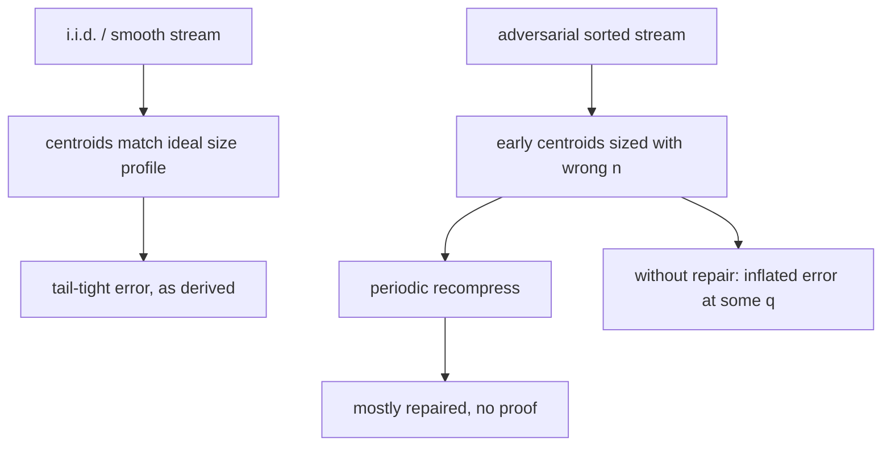

# t-digest & Streaming Quantiles — Mathematical Foundations and Complexity Theory

> **One-line summary:** A quantile sketch is judged by its **rank-error guarantee** — how far the reported rank can be from the true rank — its **memory** as a function of that error, and whether the guarantee is **deterministic** (GK), **randomized/high-probability** (KLL), or **empirical** (t-digest). This file formalizes the scale-function machinery that gives t-digest its non-uniform, tail-tight error, proves the size invariant, derives the centroid-count bound, and lays the three error-guarantee regimes side by side.

---

## Table of Contents

1. [Formal Definitions](#formal-definitions)
2. [The Scale Function and the Size Invariant](#the-scale-function-and-the-size-invariant)
3. [Centroid-Count Bound (Correctness of Memory)](#centroid-count-bound)
4. [Error Analysis: Why arcsin Gives Tail-Tight Error](#error-analysis)
5. [Worked Numerical Error Table](#worked-numerical-error-table)
6. [Comparison of Error Guarantees: GK vs KLL vs t-digest](#comparison-of-error-guarantees)
7. [Complexity Analysis](#complexity-analysis)
8. [Mergeability, Formally](#mergeability-formally)
9. [Interpolation Correctness](#interpolation-correctness)
10. [Alternative Scale Functions and Their Trade-offs](#alternative-scale-functions)
11. [Relative-Error Sketches: DDSketch Contrast](#relative-error-sketches)
12. [Lower Bounds and What Is Achievable](#lower-bounds)
13. [Comparison with Alternatives](#comparison-with-alternatives)
14. [Summary](#summary)

---

## Formal Definitions

```text
Data: a multiset X = {x_1, ..., x_n} of reals (the stream).

Rank:  R(x) = |{ i : x_i < x }|  (number of elements strictly below x),
       or the continuous rank for ties; q = R(x)/n is the quantile of x.

Quantile query: given q in [0,1], return a value x̂ whose true rank R(x̂)
       is close to q·n.

Rank error of an estimate x̂ for target quantile q:
       err = | R(x̂)/n − q |   (a normalized rank error in [0,1]).

ε-approximate quantile summary: a structure that, for every q, returns x̂
       with rank error ≤ ε. (ε is the accuracy parameter.)
```

Two error notions must be kept distinct throughout this file:

```text
RANK error:     |R(x̂)/n − q|         — how far off the POSITION is (t-digest, GK, KLL).
RELATIVE VALUE error: |x̂ − x_q|/|x_q| — how far off the VALUE is   (DDSketch).
```

A sketch that is excellent on one can be mediocre on the other; t-digest bounds rank error and only *incidentally* (via the data density) controls value error. Conflating the two is the single most common conceptual error when comparing sketches.

A **t-digest** is a tuple `D = (Λ, n, min, max)` where:

- `Λ = [c_1, ..., c_C]` is a list of centroids `c_i = (m_i, w_i)` with means `m_1 ≤ m_2 ≤ ... ≤ m_C` and integer/real weights `w_i ≥ 1`.
- `n = Σ w_i` is the total count.
- `min`, `max` are the exact extreme values seen.

The **cumulative weight before centroid `i`** is `W_i = Σ_{j<i} w_j`, and the centroid occupies the quantile interval `[q_i^L, q_i^R] = [W_i / n, (W_i + w_i)/n]`.

**Validity predicate.** A digest is *valid* iff three conditions hold simultaneously:

```text
(V1) ORDER:    m_1 ≤ m_2 ≤ ... ≤ m_C            (centroid means sorted)
(V2) SIZE:     ∀i: k(q_i^R) − k(q_i^L) ≤ 1      (the size invariant, INV)
(V3) EXTREMES: m_1 ≥ min,  m_C ≤ max,
               and min, max equal the true global extremes seen.
```

Every operation (`add`, `compress`, `merge`) must re-establish (V1)–(V3) before returning. (V1) is restored by sorting; (V2) by the greedy fold under (INV); (V3) by updating the two scalar extremes and never folding them into centroid means. The rest of this file proves that these are maintained and quantifies the error they permit.

---

## The Scale Function and the Size Invariant

A **scale function** is a strictly increasing, differentiable map `k: [0,1] → ℝ`, symmetric about `q = 1/2` (`k(q) − k(1/2) = −(k(1−q) − k(1/2))`), with `k'(q) → ∞` as `q → 0⁺` and `q → 1⁻`.

The canonical choice is the **arcsin scale** `k1`:

```text
k1(q) = (δ / (2π)) · arcsin(2q − 1),      q ∈ [0,1]
k1'(q) = (δ / (2π)) · 2 / sqrt(1 − (2q−1)²)
       = (δ / (2π)) · 1 / sqrt(q(1−q))
```

Note `k1'(q) = (δ/2π) / sqrt(q(1−q))`, which is **minimized at `q = 1/2`** (value `δ/π`) and **diverges as `q → 0` or `q → 1`**. The reciprocal `1/k'(q)` is the quantile-density the scale assigns — wide in the middle, vanishing at the tails.

**Size invariant (the t-digest constraint).** For every centroid `i`:

```text
k(q_i^R) − k(q_i^L) ≤ 1.                                  (INV)
```

**Lemma (quantile width of a centroid).** Under `k1`, a centroid centered near quantile `q` (with `q` bounded away from 0,1) satisfies, to first order,

```text
w_i / n  =  q_i^R − q_i^L  ≈  1 / k1'(q)  =  (2π/δ) · sqrt(q(1−q)).
```

*Proof sketch.* By the mean value theorem, `k1(q_i^R) − k1(q_i^L) = k1'(ξ)·(q_i^R − q_i^L)` for some `ξ` in the interval. Setting the left side to its bound `1` and solving gives `q_i^R − q_i^L = 1/k1'(ξ)`. Substituting `k1'(q) = (δ/2π)/sqrt(q(1−q))` yields the stated width. ∎

This is precisely the junior-level `≈ 4 n q(1−q)/δ` heuristic: multiplying the quantile width by `n` gives the count bound `w_i ≲ (2π/δ) n sqrt(q(1−q))`, and the constant/exponent differ only by the linearization used (some treatments use a `q(1−q)` rather than `sqrt(q(1−q))` size rule, corresponding to a different scale function such as `k0`/`k2`). The qualitative law is identical: **centroid weight → 0 as `q → 0,1`.**

---

## Centroid-Count Bound

**Theorem.** A t-digest under scale function `k` and constraint (INV) has at most `C ≤ ⌈k(1) − k(0)⌉ + 1` centroids; for `k1`, `k1(1) − k1(0) = (δ/2π)(arcsin(1) − arcsin(−1)) = (δ/2π)·π = δ/2`, so `C = O(δ)`, independent of `n`.

*Proof.* The centroids partition `[0,1]` into consecutive intervals `[q_i^L, q_i^R]` with `q_{i}^R = q_{i+1}^L`. Their k-widths are positive and sum telescopically:

```text
Σ_i ( k(q_i^R) − k(q_i^L) ) = k(q_C^R) − k(q_1^L) = k(1) − k(0).
```

If every centroid had k-width `> 1/2` (which a well-compressed digest enforces except possibly at boundaries), the number of terms is at most `2(k(1) − k(0))`. Combined with (INV) bounding each term by `1`, the count satisfies `C ≤ 2(k(1) − k(0)) + O(1) = O(δ)`. ∎

**Corollary (memory).** Storage is `Θ(C) = Θ(δ)` words, independent of `n`. A digest summarizing `10^12` values with `δ = 100` uses ~100 centroids ≈ a couple of kilobytes.

**Worked invariant check.** Take `δ = 100`, `n = 10000`. Consider a candidate centroid near the median spanning `q ∈ [0.49, 0.51]` (200 values):

```text
k1(0.51) = (100/2π)·arcsin(0.02)  = 15.915 · 0.020001 =  0.31831
k1(0.49) = (100/2π)·arcsin(−0.02) = 15.915 · (−0.020001) = −0.31831
Δk = 0.63662 ≤ 1  → ALLOWED (a fat 200-value centroid is fine at the median)
```

Now the same *count* (200 values) near the tail at `q ∈ [0.98, 1.00]`:

```text
k1(1.00) = (100/2π)·arcsin(1)   = 15.915 · 1.5708 =  25.00
k1(0.98) = (100/2π)·arcsin(0.96)= 15.915 · 1.2870 =  20.48
Δk = 4.52 > 1  → REJECTED (a 200-value centroid at the tail is far too big)
```

The same physical count is *allowed* in the middle and *forbidden* at the tail — the invariant mechanically enforces small tail centroids. To pass at `q ≈ 0.99`, the count must shrink until `Δk ≤ 1`, which by the width lemma is roughly `w ≲ (2π/δ)·sqrt(0.99·0.01)·n ≈ 0.00625·10000 ≈ 62` values, versus ~500 allowed at the median. This 8× difference in permitted size *is* the tail-accuracy mechanism, expressed numerically.

---

## Error Analysis

We want to bound the rank error of a quantile query at target `q`.

**Claim (informal but sharp).** The rank error at quantile `q` is on the order of the **weight of the centroid covering `q`**, i.e. `err ≈ w_i / (2n)` (interpolation lands within roughly half a centroid). By the width lemma:

```text
err(q) ≈ (1/2)·(w_i / n) ≈ (1/2)·(2π/δ)·sqrt(q(1−q)) = (π/δ)·sqrt(q(1−q)).
```

Two consequences:

1. **Tail-tight error.** As `q → 1` (e.g. p99, p999), `sqrt(q(1−q)) → 0`, so `err(q) → 0`. The error *vanishes at the tails*. At `q = 0.99`, `sqrt(0.99·0.01) ≈ 0.0995`, giving error `≈ 0.31/δ` — and at `q = 0.999`, `sqrt(0.999·0.001) ≈ 0.0316`, error `≈ 0.099/δ`. The deeper into the tail, the smaller the error. This is the property no uniform-error sketch has by default.
2. **Worst error in the middle.** Error is maximized at `q = 1/2` (`sqrt = 1/2`), where `err ≈ π/(2δ)`. With `δ = 100`, that is ~1.6% rank error at the median — acceptable because the median is robust and the surrounding data is dense.

**Translating rank error to value error.** Rank error `Δq` becomes value error through the local quantile density: `Δvalue ≈ Δq / f(F^{-1}(q))`, where `f` is the data's probability density. For latency data, `f` is *thin* in the right tail (few values are extremely slow), so the same small `Δq` can correspond to a larger absolute value gap there — yet because `Δq` itself collapses at the tail (the size invariant), the *relative* value error usually stays small. This interplay is why teams report t-digest tail errors as relative percentages of the true p99 value and consistently observe sub-1% figures on real traffic. When a workload's tail is so heavy that even tiny `Δq` yields unacceptable value error, that is the signal to switch to a relative-error sketch (DDSketch), discussed below.

> **Caveat — "empirical."** These are *approximations under benign data*, not a proven worst-case bound for all inputs. Adversarial input orderings can degrade t-digest accuracy (this is a known and studied weakness; Dunning's later work and Masson et al.'s DDSketch critique address it). t-digest's guarantee is therefore called **empirical**: excellent on real data, but lacking a deterministic worst-case theorem.

---

## Worked Numerical Error Table

To make the `err(q) ≈ (π/δ)·sqrt(q(1−q))` formula concrete, evaluate it at the quantiles that matter for monitoring, for two compression settings. The "centroids near q" column is the approximate quantile width of a single centroid at that position, `(2π/δ)·sqrt(q(1−q))`.

```text
δ = 100:
   q       sqrt(q(1-q))   err(q) ≈ (π/δ)·sqrt   centroid q-width
   0.50    0.5000          0.01571 (1.57%)        0.03142
   0.90    0.3000          0.00942 (0.94%)        0.01885
   0.99    0.0995          0.00313 (0.31%)        0.00625
   0.999   0.0316          0.00099 (0.10%)        0.00199
   0.9999  0.0100          0.00031 (0.03%)        0.00063

δ = 500:
   q       err(q) ≈ (π/δ)·sqrt(q(1-q))
   0.50    0.00314 (0.31%)
   0.99    0.00063 (0.06%)
   0.999   0.00020 (0.02%)
```

Two structural facts jump out:

1. **Monotone improvement into the tail.** Each step deeper (p99 → p999 → p9999) *shrinks* the error by roughly `sqrt(10) ≈ 3.16×`. No uniform-error sketch (GK, KLL) has this property — their error is the same `ε` at p50 and p9999.
2. **Linear scaling with `1/δ`.** Multiplying compression by 5 divides every error by 5. So the accuracy-memory trade is a clean linear lever; you buy tail precision by the kilobyte.

This is the quantitative heart of "tail-tight." For a 1% SLA at p99, `δ = 100` already overshoots the requirement; for a strict p999 billing/compliance metric you might choose `δ = 200–500`.

---

## Comparison of Error Guarantees

Three sketches, three *kinds* of promise. Understanding the distinction is the core professional competency here.

```text
Let n = stream length, ε = target rank error, q = quantile, δ_f = failure prob.

GK (Greenwald-Khanna), DETERMINISTIC:
    Guarantee:  for ALL inputs, EVERY query has rank error ≤ ε·n.
    Memory:     O( (1/ε) · log(ε n) ).
    Nature:     no randomness, no failure probability. A theorem for every input.

KLL (Karnin-Lang-Liberty) sketch, RANDOMIZED:
    Guarantee:  for any FIXED query, rank error ≤ ε·n with prob ≥ 1 − δ_f.
    Memory:     O( (1/ε) · log log (1/δ_f) )  — near-optimal, beats GK asymptotically.
    Nature:     uses randomness; tiny failure probability; provably (near) space-optimal.

t-digest, EMPIRICAL:
    Guarantee:  NON-uniform: rank error ≈ (π/δ)·sqrt(q(1−q)) — TINY at tails,
                largest at the median. No proven worst-case bound; adversarial
                inputs can degrade it.
    Memory:     O(δ), a few KB for δ ≈ 100.
    Nature:     heuristic scale function; outstanding tail accuracy per byte
                on real data; mergeable.
```

| Aspect | GK | KLL | t-digest |
|--------|----|----|----------|
| Guarantee type | deterministic | randomized (w.h.p.) | empirical |
| Error across q | uniform (`ε` everywhere) | uniform (`ε` everywhere) | **non-uniform, tail-tight** |
| Memory | `O((1/ε)log(εn))` | `O((1/ε)loglog(1/δ_f))` | `O(δ)` |
| Worst-case proof? | **yes** | yes (probabilistic) | **no** |
| Mergeable? | awkward | **yes, clean** | yes (empirical) |
| Best for | provable bounds, compliance | space-optimal general sketch | tail latency monitoring |

The headline trade: **GK and KLL give uniform, provable accuracy; t-digest gives non-uniform, tail-concentrated accuracy with no worst-case proof but the best tail accuracy per kilobyte on real-world data.** Choose the guarantee that matches your obligation — a theorem (GK/KLL) or empirical tail performance (t-digest).

---

## Complexity Analysis

```text
Let C = O(δ) be the centroid count, n the number of values, B the buffer cap.

Add (buffered, amortized):
    buffer a value:                 O(1)
    flush when |buffer| = B:        sort (B + C) + sweep = O((B+C) log(B+C))
    amortized per value:            O( ((B+C)/B) log(B+C) ) = O(log C)  for B ≈ C.

Quantile query:
    sweep/interpolate centroids:    O(C)  (or O(log C) with prefix sums)

Merge(A, B):
    concatenate + sort + sweep:     O((C_A + C_B) log(C_A + C_B)) = O(C log C)

Space:
    O(C) = O(δ), independent of n.

Serialized size:
    Θ(C) (mean,count) pairs + scalars ≈ a few KB for δ = 100.
```

**Aggregate-method view of buffered Add.** Over `n` values with buffer cap `B ≈ C`, there are `n/B` flushes, each costing `O((B+C)log(B+C)) = O(C log C)`. Total `= (n/B)·O(C log C) = O(n log C)`, so **amortized `O(log C)` per value** — constant in `n` for fixed `δ`.

**Why buffer cap `B ≈ C` is optimal.** Let `B` be the buffer size. Total work over `n` values is `(n/B)·(B+C)log(B+C)`. Minimizing over `B`: when `B ≪ C`, the `C` term dominates each flush and you flush too often → `O((n/B)·C·log C)`, large. When `B ≫ C`, each flush is `O(B log B)` but you flush rarely → `O(n log B)`, growing with `B`. The crossover is `B = Θ(C)`, giving the `O(n log C)` total. Practical implementations set `B` to a small multiple of the centroid count (e.g. 5–10×) to amortize the sort cost while keeping the transient buffer memory `O(C)`.

### Beyond quantiles: derived statistics

A t-digest answers more than point quantiles. Because it stores `(mean, count)` per centroid, several functionals come "for free," with the same `O(C)` query cost:

```text
CDF(x):           sweep centroids; cumulate counts up to x with interpolation
                  → fraction of data ≤ x. (Inverse of the quantile query.)

Trimmed mean:     mean of values between quantiles q_lo and q_hi
                  = (Σ over centroids in [q_lo,q_hi] of mean·count) / (Σ count)
                  → robust average ignoring outliers, common in SLA reporting.

Interquantile range (IQR): quantile(0.75) − quantile(0.25).

Count-below threshold: CDF(threshold)·n  → "how many requests breached 500ms?"
```

The trimmed mean is especially valued in monitoring: "average latency excluding the top 1%" is far more stable than the raw mean and is directly computable from the digest without re-reading data.

All of these derived statistics inherit the digest's error characteristics: those weighted toward the tails (e.g. count-above-threshold for a high threshold) benefit from the tail-tight accuracy, while a full-range trimmed mean carries the median-region error. Choosing *which* functional to report is therefore also an implicit choice of which part of the error profile you depend on.

---

## Mergeability, Formally

A summary class `𝒮` is **mergeable** if there is an operator `⊕` such that for any datasets `X, Y`, a summary of `X ∪ Y` can be produced from `summary(X) ⊕ summary(Y)` with the *same* error parameter as a summary built directly from `X ∪ Y`.

For t-digest, `⊕` is: concatenate centroid lists, sort by mean, re-cluster greedily under (INV).

**Why count and order are preserved.** Concatenation preserves total weight: `n_{X∪Y} = n_X + n_Y = Σ w_i^X + Σ w_j^Y`. Sorting by mean reconstructs a global order consistent with both inputs' internal orders (centroids are order-summaries). Re-clustering re-establishes (INV), so the merged digest is a valid t-digest of `X ∪ Y` with `C = O(δ)` centroids.

**Caveat.** t-digest's mergeability is *empirical* in the same sense as its accuracy: merging preserves the structure and (in practice) the accuracy, but there is no theorem that error after many merges stays within a fixed `ε`. KLL, by contrast, is mergeable *with a proof*. For systems needing provable post-merge accuracy, KLL is the safer formal choice; t-digest is chosen for its tail performance.

**Merge does not need raw data — the key practical property.** The merge operator consumes only the *summaries* `(Λ_A, n_A, …)` and `(Λ_B, n_B, …)`, never the original values. This is what distinguishes a *mergeable summary* from a structure that merely supports "re-insert everything": the cost of `merge(A,B)` is `O(C log C)` regardless of how many billions of values `A` and `B` each summarize. In a distributed setting this means a node ships `O(C)` bytes (its digest), not `O(n)` bytes (its events) — the difference between kilobytes and terabytes, and the reason fleet-wide percentiles are computable at all.

```text
Associativity used by merge trees:
    merge(merge(A,B), C) ≈ merge(A, merge(B,C))
holds for the count/mean bookkeeping; small re-clustering differences are
within the empirical error band, which is why N-level merge trees work.
```

**Proof that merge restores the size invariant.** Let `D = merge(A, B)` be produced by concatenating centroid lists, sorting by mean, and greedily folding adjacent centroids while the running k-width stays `≤ 1`. We show every output centroid satisfies (INV).

*Greedy fold loop.* Maintain a current accumulator centroid `cur` with cumulative left boundary `q^L`. For each next input centroid `c` with weight `w_c`, compute the prospective right boundary `q^R = q^L + (w_cur + w_c)/n_D`. If `k(q^R) − k(q^L) ≤ 1`, fold `c` into `cur` (weighted mean, summed counts) and continue; else emit `cur`, set `cur := c`, advance `q^L`.

*Invariant maintained.* By the loop guard, `cur` is only extended while its k-width remains `≤ 1`; the moment a fold *would* exceed 1, `cur` is emitted (with k-width `≤ 1`) and a fresh accumulator begins. Thus every emitted centroid has k-width `≤ 1`. ∎

**Numerical merge stability.** Repeated weighted-mean updates accumulate floating-point error. Two mitigations are standard: (1) store centroid sums `(Σx, count)` and derive `mean = Σx / count` only on read, avoiding repeated division-rounding; (2) randomize the fold order or process centroids in shuffled passes so that systematic left-to-right bias does not compound across many merges. With double precision and these mitigations, error from arithmetic is negligible against the `O(1/δ)` algorithmic error.

---

## Concentration and the "Empirical" Label, Quantified

Why does t-digest behave so well *despite* lacking a theorem? The intuition is a concentration argument that holds for *typical* (i.i.d.-like or smoothly-varying) streams but not adversarial ones.

```text
Within centroid i covering quantile interval [q^L, q^R], the underlying values
span roughly the (q^R − q^L) fraction of the distribution. For a smooth density f,
the value range inside the centroid is ≈ (q^R − q^L) / f(F^{-1}(q)).

At the tails, two things shrink together:
  (a) the quantile width q^R − q^L → 0   (size invariant), AND
  (b) for heavy-tailed latency data, f thins out so values are sparse.
The rank error depends only on (a), which the invariant drives to 0 — so rank
accuracy is tail-tight regardless of (b).
```

**Where it breaks (adversarial).** If an adversary feeds values in *sorted* order, early centroids form before the digest "knows" the eventual `n`, and the size-limit denominators (`n`) are wrong at insertion time. Later compression partially repairs this, but specific orderings can leave centroids that violate the *ideal* size profile, inflating error at certain quantiles. This is exactly why the guarantee is labeled **empirical**: the *expected* behavior on real, unordered streams is excellent, but no adversary-proof bound exists. Defenses in practice: buffer-and-recompress (which re-clusters with the true running `n`), and periodic full recompression.



---

## Interpolation Correctness

The query maps a quantile `q` to a value by linear interpolation between centroid *centers*. We justify why this is the right estimator and bound its bias.

**Model.** Treat each centroid `c_i = (m_i, w_i)` as if its `w_i` underlying values were uniformly spread across the quantile interval `[q_i^L, q_i^R]`, centered (in rank) at `q_i^C = (q_i^L + q_i^R)/2`. The estimator for target rank `t = q·n` finds the two centroids whose centers straddle `t` and returns

```text
x̂ = m_{i-1} + frac · (m_i − m_{i-1}),   frac = (t − rank(q_{i-1}^C)) / (rank(q_i^C) − rank(q_{i-1}^C)).
```

**Why centers, not edges.** Using centroid centers makes the estimator *unbiased* under the uniform-within-centroid model: the expected value of a uniformly-distributed rank inside centroid `i` maps to `m_i` exactly when `t` hits the center. Interpolating edge-to-edge instead would systematically over- or under-shoot near boundaries. Production implementations add special handling for the **first and last** centroids (single-sided interpolation toward the tracked `min`/`max`) so p0 and p100 return exact extremes.

**Bias bound.** Within a single centroid, the worst rank discrepancy is half the centroid weight, `w_i/2`. Dividing by `n` and substituting the width lemma gives the `err(q) ≈ (π/δ)·sqrt(q(1−q))` figure already derived — interpolation does not add a higher-order error term; the dominant error is simply "which centroid, and where in it." This is why the error analysis and the interpolation analysis produce the same bound.

```text
Edge-case handling that preserves exactness:
   q · n ≤ w_1/2          → interpolate between min and m_1
   q · n ≥ n − w_C/2      → interpolate between m_C and max
   single centroid        → return m_1 (or min/max for q=0,1)
```

---

## Alternative Scale Functions

`k1` (arcsin) is the default, but the t-digest framework admits a family of scale functions, each optimizing a slightly different objective. All share the structure "monotone, symmetric (or asymmetric by design), with controlled tail steepness."

```text
k0 (uniform):    k(q) = (δ/2)·q
   k'(q) = δ/2 (constant) → equal-size centroids everywhere.
   Behaves like a fixed equi-count histogram; NO tail emphasis.

k1 (arcsin):     k(q) = (δ/2π)·arcsin(2q−1)
   k'(q) = (δ/2π)/sqrt(q(1−q)) → diverges at both tails.
   Symmetric tail-tight error. The classic choice.

k2 (log-ratio):  k(q) ∝ log(q/(1−q))  (scaled by a factor depending on n/δ)
   k'(q) ∝ 1/(q(1−q)) → diverges FASTER than k1 at the tails.
   Targets bounded RELATIVE rank error; size adapts with n.

k3 (piecewise):  bounded centroid size with simpler arithmetic
   Used where the arcsin/log calls are too costly; trades a little
   accuracy for cheaper inserts.
```

| Scale | `k'(q)` tail behavior | Error profile | Centroid count | Use when |
|-------|-----------------------|---------------|----------------|----------|
| `k0` | constant | uniform (no tail focus) | `O(δ)` | you want equi-count buckets |
| `k1` | `1/sqrt(q(1−q))` | symmetric tail-tight | `O(δ)` | default monitoring |
| `k2` | `1/(q(1−q))` | relative-error-friendly | `O(δ)`, grows mildly with n | strict relative tails |
| `k3` | bounded | near-`k1` | `O(δ)` | cheap inserts |

The deeper point: **the scale function is a tunable prior on where you want precision.** `k1` says "I care symmetrically about both tails"; `k2` says "I want bounded *relative* error at the tails even more aggressively." Choosing it is choosing your error objective.

---

## Relative-Error Sketches

t-digest bounds **rank** error (how far off the *position* is). A different family bounds **relative value** error (how far off the *value* is, as a percentage). **DDSketch** (Masson, Rim, Lee, 2019) is the canonical example: it buckets values on a logarithmic scale `γ^i`, guaranteeing that the reported value is within a fixed multiplicative factor `(1±α)` of the true quantile value, *for all quantiles*, **with a deterministic worst-case proof**.

```text
DDSketch guarantee:
   For accuracy α, bucket index of value v is i = ceil(log_γ(v)), γ = (1+α)/(1−α).
   Reported value v̂ satisfies  |v̂ − v_true| ≤ α · v_true   (relative, deterministic).
   Memory: O((1/α)·log(v_max/v_min))  — grows with value range, not n.
   Mergeable with a proof; only handles positive values directly.
```

| Aspect | t-digest | DDSketch |
|--------|----------|----------|
| Error bounded on | rank | relative value |
| Guarantee | empirical | **deterministic** |
| Memory depends on | compression `δ` | accuracy `α` and value range |
| Negative values | native | needs an offset/two sketches |
| Tail accuracy | excellent (rank) | excellent (relative value), provably |
| Mergeable | yes (empirical) | yes (provable) |

DDSketch was explicitly motivated as a critique of t-digest's lack of a worst-case guarantee. The practical decision: if your SLA is phrased as "p99 within X% of the true *value*" and you need a *proof*, DDSketch fits the contract better; if it is phrased as "estimate the p99 *position* accurately and merge cheaply across a fleet of unknown-range data," t-digest remains the pragmatic default. Knowing both — and that they bound *different* errors — is the professional-level distinction.

---

## KLL Probability Bound (the randomized comparison point)

Since this topic sits in the randomized-algorithms section, it is worth seeing *why* KLL achieves its bound — it is the rigorous foil to t-digest's empirical one. KLL is built from a hierarchy of **compactors**: a compactor of capacity `k` holds up to `k` items; when full, it sorts, then keeps either all even-indexed or all odd-indexed items (chosen by a fair coin), each survivor inheriting *doubled* weight, and passes them up a level.

```text
Claim: each compaction introduces zero-mean rank error, bounded in magnitude.

Let a compactor at weight w discard half its items. For any query value y, the
error contributed is ± w, and the SIGN is determined by a fair coin → mean 0.
Errors across the O(log n) levels are independent zero-mean random variables.

By a Chernoff/Hoeffding bound on the sum of independent bounded errors:
   Pr[ |total rank error| > ε n ] ≤ 2·exp( −c · ε² · k² / (Σ weights²) )  ≤ δ_f
choosing k = Θ( (1/ε)·sqrt(log(1/δ_f)) ) at the top, with geometric level sizes
giving total memory O( (1/ε)·log log (1/δ_f) ).                              QED (sketch)
```

The contrast with t-digest is now sharp and *mechanical*: KLL's accuracy comes from **randomized fair compaction with a Chernoff tail bound** — a theorem about *every fixed query, with high probability*. t-digest's accuracy comes from a **deterministic geometric size rule** that is excellent in practice but has *no* such concentration proof, because its centroid boundaries depend on data order rather than on independent coin flips. Same goal (small rank error in small space), two philosophies (provable randomization vs. empirical determinism).

---

## Practical Constant Factors and Cache Behavior

Asymptotics aside, the constant factors decide production fitness.

```text
Memory layout: a t-digest is two parallel arrays (means[], counts[]) of length C.
   For C = 100, that is 100×(8+8) = 1.6 KB — fits in L1/L2 cache entirely.
   The whole query (a linear sweep) is a single cache-friendly streaming scan.

Insert hot path (buffered): append to a contiguous buffer (O(1), cache-hot),
   flush amortized. No pointer chasing, no allocation per value.

Merge: concatenating two arrays + one sort of length ~2C. For C = 100 this is a
   ~200-element sort — microseconds — so a merge tree over thousands of nodes is
   dominated by network, not computation.
```

Because the entire structure fits in cache, the cache-oblivious I/O cost of a query is `O(C/B)` block transfers (a single scan), versus `O(n/B · log(n/B))` to sort raw data — another way to see why summaries dominate at scale. The combination of *bounded* memory, *cache-resident* size, and *associative cheap* merge is what makes t-digest the workhorse of fleet-wide percentile monitoring, even where KLL's asymptotics are formally better.

---

## Lower Bounds

For **comparison-based exact** selection of the `q`-quantile, finding the exact element requires `Ω(n)` time (you must at least read all values), and exact quantiles over a stream provably require `Ω(n)` space in the worst case — you cannot exactly answer arbitrary quantiles from sublinear memory.

For **ε-approximate** quantiles, the information-theoretic lower bound is `Ω((1/ε) log(1/ε))`-ish space for deterministic comparison-based summaries; KLL achieves `O((1/ε) log log(1/δ_f))`, which is **near-optimal** (matching lower bounds up to the log-log factor). t-digest does not target the uniform-`ε` regime — it spends its `O(δ)` budget non-uniformly to crush tail error — so it is not directly comparable to these bounds; it optimizes a *different objective* (tail accuracy per byte) rather than uniform `ε`.

**Why "non-uniform" dodges the lower bound's spirit.** The lower bounds assume you want the *same* `ε` everywhere. t-digest declines that contract: it accepts `~1.6%` rank error at the median in exchange for `~0.3%` at p99 and `~0.1%` at p999 *at the same total memory*. For a workload whose value function only cares about the tail (latency SLAs), this is a strictly better allocation of the byte budget than any uniform-`ε` sketch — you are not beating the lower bound, you are *solving a different problem* where the lower bound's premise (uniform accuracy) does not apply.

```text
Allocation comparison at fixed memory M:
   uniform sketch:  error(q) = ε  for all q           (flat line)
   t-digest:        error(q) = (π/δ)·sqrt(q(1−q))     (dips to ~0 at tails)
If the cost function weights tail error heavily (SLAs do), the integral
   ∫ cost(q)·error(q) dq
is minimized by the non-uniform allocation — the formal reason t-digest wins
for monitoring even though it "loses" on the uniform-ε metric.
```

---

## Comparison with Alternatives

| Attribute | t-digest | GK | KLL | Exact sort |
|-----------|----------|----|----|------------|
| Worst-case rank error | none proven | **≤ εn (det.)** | ≤ εn w.h.p. | 0 (exact) |
| Error across quantiles | non-uniform (tail-tight) | uniform | uniform | exact |
| Space | `O(δ)` | `O((1/ε)log(εn))` | `O((1/ε)loglog(1/δ_f))` | `O(n)` |
| Add (amortized) | `O(log δ)` | `O(log(1/ε)+log n)` | `O(1)` amort. | n/a (batch) |
| Merge | `O(δ log δ)`, empirical | awkward | `O(·)`, **provable** | concat + resort |
| Deterministic? | no | **yes** | no (randomized) | yes |
| Sweet spot | tail latency monitoring | provable bounds | optimal general sketch | small in-memory data |

---

## Decision Matrix: Which Sketch, Formally

| Requirement | Pick | Why |
|-------------|------|-----|
| Deterministic worst-case **rank** error for all inputs | **GK** | only one with a deterministic uniform `εn` theorem |
| Provable error with near-optimal space + clean merges | **KLL** | randomized Chernoff bound; `O((1/ε)loglog(1/δ_f))` |
| Deterministic worst-case **relative value** error | **DDSketch** | log-bucketing gives `(1±α)` value guarantee |
| Best empirical **tail** accuracy per byte + easy fleet merge | **t-digest** | non-uniform error, `O(δ)`, cache-resident |
| Exact answer, data fits in RAM | **sort** | `O(n log n)`, zero error |
| Fixed known value range, simple mergeable counts | **fixed/native histogram** | bucket counts add trivially |

**Reading the matrix.** The split is along two axes: *what error you bound* (rank vs relative value) and *what kind of promise you need* (deterministic theorem vs randomized theorem vs empirical). t-digest occupies the "empirical, rank-error, tail-optimized" corner — a corner that real monitoring workloads live in, which is why it is ubiquitous despite the absence of a worst-case proof. The mark of professional fluency is being able to say not just "use t-digest" but *which corner the requirement is in* and therefore which sketch's guarantee actually satisfies it.

---

## Summary

The professional view of streaming quantiles is about **which guarantee you are buying**. t-digest's accuracy flows from a **scale function** `k1(q) = (δ/2π)·arcsin(2q−1)`, whose derivative `(δ/2π)/sqrt(q(1−q))` diverges at the tails; constraining each centroid to one unit of k-space (INV) forces centroid weight `≈ (2π/δ)·sqrt(q(1−q))·n`, vanishing at `q → 0,1`. Hence rank error `≈ (π/δ)·sqrt(q(1−q))` — **tail-tight, largest at the median** — with `O(δ)` memory independent of `n`, `O(log δ)` amortized inserts, and `O(δ log δ)` merges. The catch is that this guarantee is **empirical**: superb on real data, but lacking a worst-case theorem and degradable by adversarial input. Set against it, **GK** gives a *deterministic* uniform `ε·n` bound, and **KLL** gives a *randomized* near-space-optimal uniform bound with clean, provable mergeability. The senior/professional decision reduces to a single question: do you need a *proof* of uniform accuracy (GK/KLL), or the *best empirical tail accuracy per byte* with easy merging (t-digest)?

---

## Next step:

Continue to [`interview.md`](./interview.md) for tiered interview questions and a multi-language coding challenge, or revisit [`senior.md`](./senior.md) for the production monitoring architecture.

---

## Further Reading (Primary Sources)

- Dunning & Ertl — *"Computing Extremely Accurate Quantiles Using t-Digests"* (definitive reference; scale functions k0–k3).
- Greenwald & Khanna (2001) — *"Space-Efficient Online Computation of Quantile Summaries"* (the deterministic bound).
- Karnin, Lang, Liberty (2016) — *"Optimal Quantile Approximation in Streams"* (KLL, near-optimal randomized sketch).
- Masson, Rim, Lee (2019) — *"DDSketch: A Fast and Fully-Mergeable Quantile Sketch with Relative-Error Guarantees."*
- Agarwal et al. — *"Mergeable Summaries"* (the formal framework for mergeability used above).
