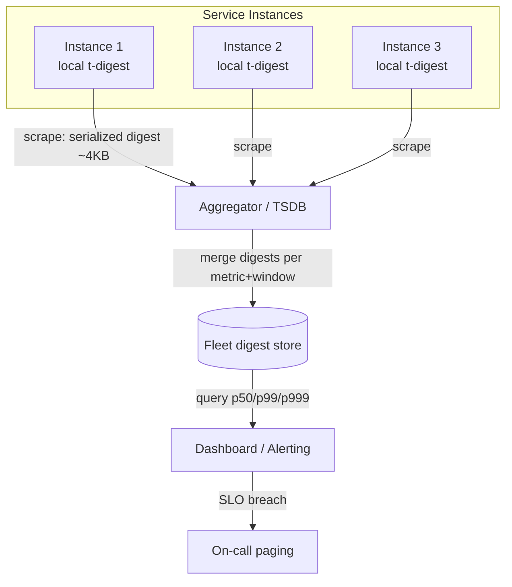
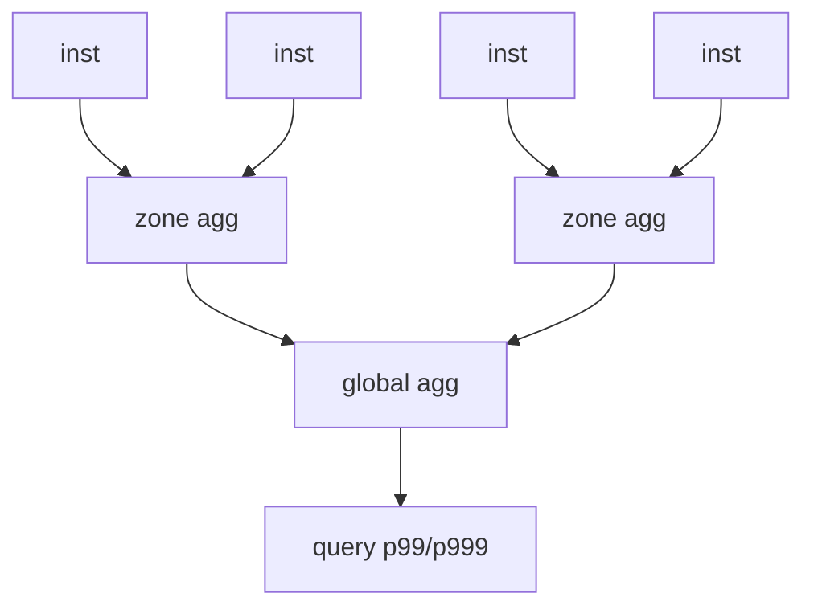
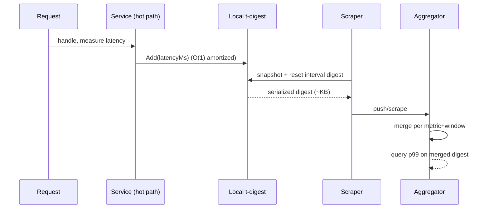

# t-digest & Streaming Quantiles — Senior Level

> **One-line summary:** In a real latency-monitoring system, every service instance keeps a small t-digest of its request latencies, ships the serialized digest (a few KB) to an aggregator on each scrape interval, and the aggregator **merges** them into one fleet-wide digest before reading p50/p99/p999 for the dashboard. The senior job is to budget accuracy against memory and network, design the merge pipeline so it is correct and cheap, and avoid the cardinal sin that quietly corrupts every percentile dashboard: **averaging percentiles instead of merging digests.**

---

## Table of Contents

1. [Introduction](#introduction)
2. [System Design: a p99 Latency Pipeline](#system-design-a-p99-latency-pipeline)
3. [Distributed Merge Architecture](#distributed-merge-architecture)
4. [The "Averaging Percentiles" Disaster, in Numbers](#the-averaging-percentiles-disaster-in-numbers)
5. [Comparison with Alternatives](#comparison-with-alternatives)
6. [Architecture Patterns](#architecture-patterns)
7. [Code Examples](#code-examples)
8. [Accuracy vs Memory Budget](#accuracy-vs-memory-budget)
9. [Sliding Windows and Retention](#sliding-windows-and-retention)
10. [SLOs, Error Budgets, and Alerting](#slos-error-budgets-and-alerting)
11. [Observability](#observability)
12. [Failure Modes & Pitfalls](#failure-modes--pitfalls)
13. [Migration & Rollout Notes](#migration--rollout-notes)
14. [Summary](#summary)

---

## Introduction

> Focus: "How to architect systems around streaming quantiles?"

Every modern observability stack answers one question constantly: *what is the p99 latency of this service right now, and over the last hour?* The naive implementations get this subtly wrong. Some compute the average latency (useless — tails vanish). Some keep a fixed histogram with badly chosen buckets (p99 lands in a 2-second-wide bucket and you cannot tell 200 ms from 1.9 s). Some compute per-instance p99 and then **average the p99s across instances** — which is mathematically meaningless and routinely under-reports real tail latency by a wide margin.

The t-digest exists to make this correct *and* cheap. Senior engineers reach for it because it satisfies three production constraints simultaneously: **bounded memory** (a few KB per metric, so you can have thousands of metrics × dimensions), **tail accuracy** (p99/p999 are where SLAs live), and **mergeability** (you can compute a fleet-wide percentile from per-node summaries without shipping raw events). This file is about wiring those properties into a working monitoring system — the data path, the merge topology, the accuracy budget, the observability of the observability system, and the failure modes that bite in production.

---

## System Design: a p99 Latency Pipeline



The data path:

1. **Record locally.** Each instance updates an in-memory t-digest on every request: `digest.Add(latencyMs)`. This is a constant-size, lock-light operation on the hot path.
2. **Roll the window.** On each scrape interval (say 15 s), the instance snapshots and resets its digest (or keeps a rolling set of per-interval digests for time-windowed queries).
3. **Ship the summary.** The instance serializes the digest (centroid array + `min`/`max`/`n`) — a few kilobytes — and the aggregator pulls it. Raw latencies never leave the box.
4. **Merge.** The aggregator merges all instances' digests for the same metric and time window into one fleet digest.
5. **Query.** The dashboard reads p50/p99/p999 from the *merged* digest; alerting compares p99 against the SLO.

The win: you carry **summaries, not events**. A service doing 1 M req/s ships kilobytes per scrape instead of gigabytes of raw timings, yet the fleet p99 is computed correctly.

---

## Distributed Merge Architecture

### Two-level (or N-level) merge tree

For very large fleets, merge hierarchically: instances → per-rack/per-zone aggregators → global aggregator. Because merge is associative and the digest is small, a merge tree scales horizontally. Each level merges a handful of digests and forwards one.



### Time-windowed merges

Dashboards ask for "p99 over the last 5 minutes / 1 hour / 1 day." Store a digest **per small base interval** (e.g. per 15 s), then merge the base digests covering the requested window at query time. This is the same mergeable property used across *time* instead of across *machines*. Coarser retention can pre-merge old base intervals into hourly digests to save space.

### Serialization

A digest serializes to a compact binary blob: `n`, `min`, `max`, and an array of `(mean, count)` pairs. With compression 100 that is ~100 pairs ≈ 1–2 KB. This is what flows over the wire and into the TSDB.

---

## The "Averaging Percentiles" Disaster, in Numbers

This pitfall is so common and so damaging that it deserves a concrete demonstration. Suppose two service instances:

```text
Instance A: 1,000,000 requests, almost all fast.   p99(A) = 40 ms
Instance B:    10,000 requests, mostly slow.       p99(B) = 900 ms

WRONG (average the percentiles):
   "fleet p99" = (40 + 900) / 2 = 470 ms          ← meaningless number

WRONG (weighted by request count, still wrong):
   (40·1e6 + 900·1e4) / 1.01e6 = 48.5 ms          ← this is a weighted MEAN of
                                                     percentiles, not a percentile

CORRECT (merge digests, then query):
   The merged distribution is dominated by A's 1M fast requests. The true
   fleet p99 is the value below which 99% of ALL 1.01M requests fall — which,
   because B is only ~1% of traffic and lands almost entirely in the top
   percentile, is around 45–120 ms depending on A's tail shape.
   Only the merged digest computes this correctly.
```

The averaged "470 ms" is between the two p99s but corresponds to *no actual quantile of the combined data*. Depending on the mix it can be wildly too high (as here) or, in other mixes, too low — masking a real regression. There is **no arithmetic on per-node percentiles** that recovers the true fleet percentile; you must merge the underlying summaries. This is not a precision nuance; it is a categorical correctness bug, and it silently ships in a large fraction of homegrown dashboards.

```mermaid
graph LR
    A[per-node p99 values] -->|average / sum / weighted-mean| X[WRONG number]
    B[per-node DIGESTS] -->|merge| M[fleet digest]
    M -->|query p99 once| C[CORRECT fleet p99]
    style X fill:#3d1418,stroke:#f85149
    style C fill:#0f2a16,stroke:#3fb950
```



---

## Comparison with Alternatives

| Attribute | t-digest | Prometheus classic histogram | Prometheus native/exponential histogram | Per-node p99 then average (ANTIPATTERN) |
|-----------|----------|------------------------------|------------------------------------------|------------------------------------------|
| Memory per metric | ~KB (bounded) | fixed buckets × series | bounded, exponential buckets | tiny |
| Tail accuracy | excellent | depends on bucket edges | good | **wrong** |
| Range needs pre-config? | no | **yes** (bucket boundaries) | no (auto exponential) | n/a |
| Mergeable across nodes? | yes (merge digests) | yes (add bucket counts) | yes | **no — produces garbage** |
| Mergeable across time? | yes | yes | yes | no |
| Arbitrary quantile after the fact? | yes | only via bucket interpolation | yes | no |
| Production examples | Elasticsearch, Druid, Prometheus client libs, Spark/Flink | Prometheus (legacy) | Prometheus (modern) | unfortunately common |

**Choose t-digest when:** you need accurate, mergeable tail percentiles over an unknown range and want to query any quantile later (analytics engines, APM).

**Choose native/exponential histograms when:** you are in a Prometheus-native stack and want first-class, bounded, mergeable histograms with automatic bucketing — these now cover many cases t-digest used to own.

**Never** compute per-node percentiles and average/sum them. That is not an optimization; it is a correctness bug.

---

## Architecture Patterns



### Pattern: lock-light hot path

The `Add` on the request path must not become a contention point. Common designs:

- **Per-thread / per-core digests** merged at scrape time (no locks on the hot path).
- A **double-buffer**: write to digest A while the scraper drains and resets digest B; swap atomically.
- A short **lock-free buffer** that a background goroutine/thread drains into the digest in batches.

---

## Code Examples

### Thread-safe digest with periodic snapshot-and-reset

#### Go

```go
package main

import (
	"sync"
)

// SnapshotDigest wraps a t-digest with a lock and supports atomic snapshot+reset
// so the hot path stays cheap and the scraper gets a consistent interval summary.
type SnapshotDigest struct {
	mu    sync.Mutex
	td    *TDigest
	delta float64
}

func NewSnapshotDigest(delta float64) *SnapshotDigest {
	return &SnapshotDigest{td: New(delta), delta: delta}
}

func (s *SnapshotDigest) Add(x float64) {
	s.mu.Lock()
	s.td.Add(x)
	s.mu.Unlock()
}

// SnapshotAndReset returns the interval's digest and starts a fresh one.
func (s *SnapshotDigest) SnapshotAndReset() *TDigest {
	s.mu.Lock()
	old := s.td
	s.td = New(s.delta)
	s.mu.Unlock()
	return old
}
```

#### Java

```java
public class SnapshotDigest {
    private TDigest td;
    private final double delta;

    public SnapshotDigest(double delta) { this.delta = delta; this.td = new TDigest(delta); }

    public synchronized void add(double x) { td.add(x); }

    /** Returns the interval digest and starts a fresh one. */
    public synchronized TDigest snapshotAndReset() {
        TDigest old = td;
        td = new TDigest(delta);
        return old;
    }
}
```

#### Python

```python
import threading

class SnapshotDigest:
    def __init__(self, delta=100):
        self._lock = threading.Lock()
        self._delta = delta
        self._td = TDigest(delta)

    def add(self, x):
        with self._lock:
            self._td.add(x)

    def snapshot_and_reset(self):
        """Return the interval digest and start a fresh one."""
        with self._lock:
            old = self._td
            self._td = TDigest(self._delta)
        return old
```

### Correct fleet aggregation (merge, do NOT average)

#### Go

```go
// FleetP99 merges per-instance digests, then reads p99 ONCE. Correct.
func FleetP99(instanceDigests []*TDigest) float64 {
	merged := New(100)
	for _, d := range instanceDigests {
		merged.Merge(d)
	}
	return merged.Quantile(0.99)
}

// WRONG: averaging per-instance p99s. Shown only to be avoided.
func WrongFleetP99(instanceDigests []*TDigest) float64 {
	sum := 0.0
	for _, d := range instanceDigests {
		sum += d.Quantile(0.99) // averaging percentiles is meaningless
	}
	return sum / float64(len(instanceDigests))
}
```

#### Java

```java
public static double fleetP99(List<TDigest> instances) {
    TDigest merged = new TDigest(100);
    for (TDigest d : instances) merged.merge(d);
    return merged.quantile(0.99); // correct
}

// WRONG: averaging per-instance p99s — do not do this.
public static double wrongFleetP99(List<TDigest> instances) {
    double sum = 0;
    for (TDigest d : instances) sum += d.quantile(0.99);
    return sum / instances.size();
}
```

#### Python

```python
def fleet_p99(instances):
    merged = TDigest(100)
    for d in instances:
        merged.merge(d)
    return merged.quantile(0.99)   # correct: merge, then query once

def wrong_fleet_p99(instances):    # WRONG: averaging percentiles
    return sum(d.quantile(0.99) for d in instances) / len(instances)
```

---

### Time-windowed query store (merge-on-read)

#### Go

```go
// WindowStore keeps one digest per base interval and answers windowed quantiles
// by merging the relevant base digests at read time.
type WindowStore struct {
	intervals map[int64]*TDigest // key: interval start (unix seconds / step)
	step      int64
	delta     float64
}

func (w *WindowStore) Add(tsSec int64, x float64) {
	key := tsSec / w.step
	d, ok := w.intervals[key]
	if !ok {
		d = New(w.delta)
		w.intervals[key] = d
	}
	d.Add(x)
}

func (w *WindowStore) QuantileOverWindow(fromSec, toSec int64, q float64) float64 {
	merged := New(w.delta)
	for k := fromSec / w.step; k <= toSec/w.step; k++ {
		if d, ok := w.intervals[k]; ok {
			merged.Merge(d)
		}
	}
	return merged.Quantile(q)
}
```

#### Java

```java
import java.util.*;

public class WindowStore {
    private final Map<Long, TDigest> intervals = new HashMap<>();
    private final long step;
    private final double delta;

    public WindowStore(long step, double delta) { this.step = step; this.delta = delta; }

    public void add(long tsSec, double x) {
        intervals.computeIfAbsent(tsSec / step, k -> new TDigest(delta)).add(x);
    }

    public double quantileOverWindow(long fromSec, long toSec, double q) {
        TDigest merged = new TDigest(delta);
        for (long k = fromSec / step; k <= toSec / step; k++) {
            TDigest d = intervals.get(k);
            if (d != null) merged.merge(d);
        }
        return merged.quantile(q);
    }
}
```

#### Python

```python
class WindowStore:
    def __init__(self, step, delta=100):
        self.intervals = {}   # key -> TDigest
        self.step = step
        self.delta = delta

    def add(self, ts_sec, x):
        key = ts_sec // self.step
        self.intervals.setdefault(key, TDigest(self.delta)).add(x)

    def quantile_over_window(self, from_sec, to_sec, q):
        merged = TDigest(self.delta)
        for k in range(from_sec // self.step, to_sec // self.step + 1):
            d = self.intervals.get(k)
            if d:
                merged.merge(d)
        return merged.quantile(q)
```

---

## Accuracy vs Memory Budget

The single tuning knob is **compression** `δ` (equivalently the centroid count `C ≈ δ`). The trade-off:

| Compression δ | Centroids | Memory/digest | Typical p99 rel. error | When |
|---------------|-----------|---------------|------------------------|------|
| 50 | ~50 | ~0.5 KB | ~1–2% | cheap, coarse dashboards |
| 100 (default) | ~100 | ~1–2 KB | ~0.5% | general latency monitoring |
| 200 | ~200 | ~3–4 KB | ~0.2% | tight p99 SLAs |
| 500 | ~500 | ~8–10 KB | ~0.05% at p999 | p999 / billing / compliance |

Sizing reasoning a senior should be able to do on a whiteboard:

```text
metrics = 2000 (services × endpoints)
dimensions = 4 (status code buckets, say)
windows kept hot = 60 (15s intervals over 15 min)
per-digest size (δ=100) ≈ 1.5 KB
total ≈ 2000 × 4 × 60 × 1.5 KB ≈ 720 MB  (hot; older windows pre-merged/evicted)
```

That fits comfortably in an aggregator's RAM — and shipping raw events for the same workload would be terabytes. The accuracy-memory lever is per-metric: spend centroids on the SLO-critical metrics, save on the rest.

---

## Sliding Windows and Retention

Dashboards almost never ask for "p99 over all time" — they ask for "p99 over the last 5 minutes / 1 hour / 1 day." The mergeable property solves this across *time* the same way it solves it across *machines*: keep many small base-interval digests and merge the ones covering the requested window.

### Tumbling base intervals + merge-on-read

```text
Keep one digest per fixed base interval (e.g. 10s). At query time:
   p99 over last 5 min = merge( the 30 base digests in that window ).quantile(0.99)
This is cheap: 30 merges of ~KB digests = sub-millisecond.
```

### Tiered retention (downsampling)

To bound storage as data ages, **pre-merge** old base intervals into coarser ones:

| Age | Resolution | Stored digests |
|-----|-----------|----------------|
| 0–1 h | 10 s | 360 per metric |
| 1–24 h | 5 min | 276 per metric |
| 1–30 d | 1 h | 720 per metric |
| > 30 d | 1 d | 30+ per metric |

Because merging is lossy-but-bounded, downsampling old data costs accuracy you no longer need (you rarely query 30-day-old p99 to 0.1%). The key invariant: **never reconstruct a window by averaging coarse percentiles** — store and merge digests at every tier.

### Sliding (overlapping) windows

True sliding windows (e.g. "last 5 minutes, updated every 10 s") are approximated by merging overlapping sets of base intervals. Exact sliding-window quantiles over a stream are expensive in the worst case; the base-interval-merge approximation is the standard, pragmatic choice and is accurate to the base-interval granularity.

---

## SLOs, Error Budgets, and Alerting

t-digest is usually the data source behind **Service Level Objectives**. A typical latency SLO: *"99% of requests complete under 300 ms over a rolling 30-day window."* Wiring this correctly:

```text
SLO: p99 latency < 300 ms (30-day window)
   -> merge the 30-day tier digests, query p99, compare to 300 ms.

Error budget: the SLO allows 1% of requests to exceed 300 ms.
   "good events" = CDF(300ms) · n   (computable directly from the digest!)
   budget burn = (1 − SLO_target) − (1 − CDF(300ms))
```

Note the digest gives you **both** framings for free: the *percentile* form (p99 value) and the *threshold* form (fraction of requests under 300 ms, via the CDF). Threshold-form SLOs ("X% under T") are often more robust to define than percentile-form ("pN under value") because the threshold T is a business-meaningful constant, while the percentile value drifts with load.

### Alert design

- Alert on the **merged** fleet p99, not per-instance p99 (per-instance is noisy and, when aggregated naively, wrong).
- Use **multi-window, multi-burn-rate** alerts (fast-burn on a 5-min window, slow-burn on a 1-h window) — both backed by merged digests — to balance sensitivity against false pages.
- Account for the digest's ~0.3% tail error in the alert threshold so a measurement-noise blip does not page on-call.

---

## Migration & Rollout Notes

Replacing a legacy percentile system (often naive averaging or coarse histograms) with t-digest is a common senior task. Sequence it safely:

1. **Shadow first.** Compute t-digest percentiles alongside the existing metric; do not switch dashboards yet.
2. **Validate.** On a few high-traffic services, compare t-digest p99 against an *exact* p99 from a sampled raw stream over the same window. Confirm sub-1% agreement.
3. **Expose the divergence.** Where the old (averaged) metric and the new (merged) metric disagree, the old one was usually wrong — quantify it; this is your justification.
4. **Standardize compression** fleet-wide before enabling cross-node merges, so merges are clean.
5. **Cut over alerts last,** after dashboards have run in parallel long enough to trust the new numbers and re-tune thresholds against the (often higher, more honest) merged p99.

---

## Observability

| Metric | Why | Alert threshold |
|--------|-----|-----------------|
| `digest_centroid_count` | Detect runaway memory (compression not firing) | > 2 × compression |
| `digest_merge_latency_ms` | Merge pipeline health | > 50 ms p99 |
| `digest_serialized_bytes` | Network/storage cost | > expected for δ |
| `quantile_query_error` (vs periodic exact sort on a sample) | Catch accuracy regressions | > 1% rel. error at p99 |
| `dropped_samples` (buffer overflow) | Hot-path back-pressure | > 0 sustained |

A useful practice: periodically compute the **exact** p99 from a small reservoir sample on a single node and compare it to the digest's p99. Sustained divergence means a bug (wrong scale function, bad merge order, or — most often — someone averaging percentiles upstream).

---

## Failure Modes & Pitfalls

- **Averaging percentiles (the cardinal sin).** Per-node p99 averaged/summed across nodes is mathematically wrong and usually *under*-reports tail latency. Always merge digests, then query once. This is the most common production defect in percentile dashboards.
- **Summing percentiles across endpoints.** "Total p99 = sum of each endpoint's p99" is equally wrong. Merge digests scoped to the dimension you want.
- **Mismatched compression across nodes.** Merging digests of different `δ` yields uneven accuracy; standardize fleet-wide.
- **Lost extremes.** If you do not track `min`/`max`, a single record-breaking latency (a real incident) can be smoothed away. Always carry true extremes.
- **Hot-path contention.** A single locked digest under millions of req/s becomes a bottleneck; use per-core digests or double-buffering.
- **Window-boundary aliasing.** Resetting the interval digest at the wrong moment can split a burst across two windows; align resets with scrape boundaries and keep enough base intervals to cover query windows.
- **Trusting estimates as exact.** Percentiles from a digest are approximate; SLO definitions and alert thresholds should account for the ~0.5% band.
- **Cardinality explosion.** One digest per metric is fine; one digest per high-cardinality label (user ID, request ID) is a memory disaster — aggregate labels you do not need.

---

## Summary

At the senior level, t-digest is the engine behind correct, cheap **p99/p999 latency monitoring**. Each instance keeps a small local digest on the hot path, ships a few-kilobyte serialized summary per scrape, and an aggregator **merges** them — across machines and across time windows — into one fleet digest that the dashboard queries. The design levers are the **accuracy-vs-memory budget** (compression `δ`, spent where SLAs demand) and a **merge topology** that scales horizontally because merge is associative and the digests are tiny. The non-negotiable rule, the one that separates a correct dashboard from a misleading one: **merge digests, never average percentiles** — and always preserve true `min`/`max` so a real outlier is never silently smoothed away.

---

## Next step:

Continue to [`professional.md`](./professional.md) for the accuracy bounds and scale-function mathematics — why arcsin gives tail-tight error, the formal complexity, and a rigorous comparison of error guarantees (GK deterministic vs KLL randomized vs t-digest empirical).
