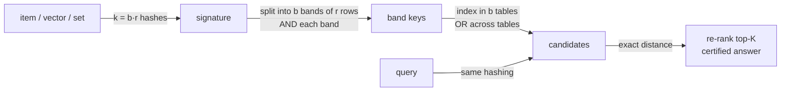

# Locality-Sensitive Hashing (LSH) — Interview Preparation

> Covers the spectrum: what LSH is and why ordinary hashing fails, the AND/OR banding and S-curve, the family-per-metric mapping, the formal (r₁,r₂,p₁,p₂)-sensitivity and ρ = O(N^ρ) bound, and production trade-offs vs HNSW/IVF. Each question lists the **expected answer focus**; two full multi-language coding challenges (hyperplane LSH and MinHash banding) are at the end.

The single mental model the questions keep returning to — keep it on the whiteboard:



The flow names every interview keyword: signature, AND (within a band), OR (across bands), candidates, and the exact re-rank that makes the final answer certified. Most questions are a probe into one box of this chain.

---

## Junior Questions

| # | Question | Expected Answer Focus |
|---|----------|-----------------------|
| 1 | What is LSH in one sentence? | A hashing scheme where *similar* items collide into the same bucket with high probability and dissimilar items rarely do. |
| 2 | How is an LSH hash different from a normal hash-map hash? | Normal hashing scatters even near-identical inputs to spread load; LSH deliberately makes similar inputs collide. |
| 3 | What problem does LSH solve? | Approximate nearest-neighbor / similarity search: find items close to a query without scanning all `N`. |
| 4 | Why not just brute-force compare the query to all items? | `O(N·d)` per query; too slow for large `N` and many queries. |
| 5 | Give the random-hyperplane hash for cosine similarity. | One bit = `sign(x·r)` for a random direction `r`; near-parallel vectors share the bit. |
| 6 | Why use many planes instead of one? | One bit barely distinguishes items; stacking `m` planes gives a signature so similar items share most bits. |
| 7 | How does a query find candidates? | Hash the query, look only in its bucket, compare exactly against the few items there. |
| 8 | What is a "candidate"? | An item sharing a bucket with the query — worth an exact comparison, not necessarily a true neighbor. |
| 9 | What is recall in LSH? | Fraction of the true near neighbors that LSH actually surfaces. |
| 10 | Why do KD-trees fail where LSH succeeds? | Curse of dimensionality: in high `d`, trees must explore nearly every branch; LSH still works. |
| 11 | Is LSH exact or approximate? | Approximate — it can miss neighbors; you trade recall for speed. |
| 12 | After getting candidates, what do you still do? | Re-rank with the exact similarity to pick the actual nearest. |
| 13 | What collides under random hyperplanes — what probability? | `P[same bit] = 1 - θ/π` where `θ` is the angle between the vectors. |

---

## Middle Questions

| # | Question | Expected Answer Focus |
|---|----------|-----------------------|
| 1 | Explain the AND-construction. | A band of `r` rows; collision needs all `r` to agree → probability `p^r`; sharpens, lowers. |
| 2 | Explain the OR-construction. | `b` bands; candidate if *any* band matches → `1 - (1 - p^r)^b`; lifts similar pairs back up. |
| 3 | Write the S-curve formula. | `P[candidate] = 1 - (1 - p^r)^b`, `p` = base collision prob (rises with similarity). |
| 4 | Where is the S-curve threshold? | `s* ≈ (1/b)^{1/r}` — where `P[candidate]` crosses ~0.5. |
| 5 | I need a threshold near 0.8 with `k=128`. How pick `(b,r)`? | Choose `(b,r)`, `b·r=128`, minimizing `|(1/b)^{1/r} - 0.8|`, e.g. `(8,16)`. |
| 6 | Effect of increasing `r`? | Higher threshold, steeper curve, higher precision, lower recall. |
| 7 | Effect of increasing `b`? | Lower threshold, more candidates, higher recall, lower precision. |
| 8 | Which family for Jaccard? cosine? Euclidean? | MinHash; SimHash/random hyperplanes; p-stable random projections. |
| 9 | Why does MinHash collision probability equal Jaccard? | The smallest combined hash falls in `A∩B` exactly with probability `|A∩B|/|A∪B|`. |
| 10 | How is the OR implemented in practice? | `b` separate hash tables (one per band); union candidate ids across tables. |
| 11 | What is multi-probe LSH and why use it? | Probe near-miss buckets (least-confident bits) to get recall from fewer tables, saving memory. |
| 12 | Does AND change ρ? | No — `ln(p^r)/ln(q^r) = ln p/ln q`; AND repositions the curve, ρ invariant. |
| 13 | Give the p-stable hash. | `h(x) = floor((a·x + c)/w)`, `a` Gaussian, `c` uniform in `[0,w)`; width `w` tunes selectivity. |
| 14 | How does recall trade against latency? | More bands/probes → more candidates → higher recall but more exact comparisons. |
| 15 | Why re-rank candidates? | Banding only selects *who to look at*; exact distance decides the winner and removes false positives. |

---

## Senior Questions

| # | Question | Expected Answer Focus |
|---|----------|-----------------------|
| 1 | Design a vector-search service over 1B embeddings. | Embed → LSH signatures → sharded index → candidate ids → exact re-rank top-K. |
| 2 | LSH vs HNSW vs IVF — when each? | HNSW best dense recall/latency; IVF-PQ best memory; LSH for sets/dedup, streaming inserts, guarantees. |
| 3 | How do you shard LSH? | Shard-by-item (fan-out all shards, easy/balanced) vs shard-by-band (less fan-out, hot-bucket skew). |
| 4 | How to handle deletes? | Tombstones filtered at query time, physically purged in compaction — LSH's edge over HNSW. |
| 5 | Memory blowing up chasing recall — what do you do? | Switch to multi-probe (recall without more tables) or migrate to IVF-PQ. |
| 6 | How do you detect recall regressions in prod? | Continuously sample queries, compute true recall against a brute-force oracle on a subset. |
| 7 | What causes a "recall cliff"? | Data drift shifts similarity distribution; S-curve threshold no longer matches; recall silently drops. |
| 8 | How do you use MinHash-LSH for dedup at scale? | As a blocker: group docs sharing any band bucket, exact-compare only within blocks → avoids `O(N²)`. |
| 9 | What is the two-stage retrieval pattern? | Cheap recall-heavy LSH/MinHash candidate generation, then precise re-ranker (cross-encoder/HNSW). |
| 10 | Hot buckets hurt p99 — fixes? | Cap candidates per bucket, increase `r`, split hot buckets. |
| 11 | Why might you still pick LSH over HNSW today? | Set/Jaccard data, cheap incremental insert/delete, provable guarantee, operational simplicity. |
| 12 | Concurrency model for an online LSH index? | RW-lock or sharded locks; reads (queries) parallel, writes (insert/tombstone) exclusive. |

---

## Professional Questions

| # | Question | Expected Answer Focus |
|---|----------|-----------------------|
| 1 | State the formal LSH family definition. | (r₁,r₂,p₁,p₂)-sensitive: `D≤r₁ ⇒ Pr[coll]≥p₁`; `D≥r₂ ⇒ Pr[coll]≤p₂`; `p₁>p₂`, `r₁<r₂`. |
| 2 | Define ρ and its range. | `ρ = ln p₁/ln p₂ ∈ (0,1)`; smaller is better (faster, less space). |
| 3 | Derive the S-curve from AND/OR. | AND: `p^r` (independence); OR: `1-(1-p^r)^b`. |
| 4 | State the Indyk–Motwani query/space bounds. | Query `O(N^ρ(log N + d))`, space `O(N^{1+ρ}+N·d)`. |
| 5 | Why `k = log_{1/p₂} N` and `L = N^ρ`? | `k` makes far pairs survive a band w.p. `1/N` (`O(L)` false candidates); near pairs then survive w.p. `N^{-ρ}`, needing `L=N^ρ` bands. |
| 6 | Prove a near pair is found with constant probability. | Miss prob `(1 - N^{-ρ})^{N^ρ} ≤ e^{-1}` ⇒ found w.p. ≥ 1−1/e. |
| 7 | What is the (r,c)-approximate near neighbor problem? | Return a point within `c·r` if one within `r` exists; the decision problem LSH solves. |
| 8 | ρ bound for Hamming/cosine? for optimal L2? | `ρ ≤ 1/c`; optimal L2 on sphere `ρ → 1/(2c²−1)` (cross-polytope LSH). |
| 9 | How get high-probability success? | `ln(1/δ)` independent copies; all-fail prob `≤ (1/e)^{ln(1/δ)} ≤ δ`. |
| 10 | Why are there no false positives in the final answer? | Re-rank computes the *exact* distance; LSH error is only missed recall. |
| 11 | Concentration of the candidate count? | `E[far candidates] ≤ L`; Markov caps at 3L; Chernoff concentrates around `N^ρ`. |
| 12 | Is AND or OR responsible for ρ? | Neither changes ρ (invariant); ρ is a property of the base family's `p₁,p₂`. |

---

## Rapid-Fire Conceptual Checks

- "Collisions are bad" — true for hash maps, **false** for LSH (collisions of similar items are the goal).
- Bigger `r` ⇒ fewer, purer candidates. Bigger `b` ⇒ more candidates, more recall.
- The threshold knob is `(1/b)^{1/r}`; the steepness knob is total `k = b·r`.
- MinHash = Jaccard family; SimHash = cosine family; p-stable = Euclidean family.
- Query time `O(N^ρ)`, space `O(N^{1+ρ})`, `ρ = ln p₁/ln p₂`.
- LSH misses neighbors (false negatives); it never returns a wrong winner (re-rank is exact).
- Multi-probe buys recall without buying memory.

---

## Coding Challenge (3 Languages)

### Challenge: Random-hyperplane LSH near-neighbor with banding

> Build a cosine LSH index over `d`-dimensional vectors using `b` bands of `r` random-hyperplane bits each (`k = b·r` total bits). Implement:
> 1. `add(id, vector)` — insert a vector into all `b` band-tables.
> 2. `query(vector)` — gather candidate ids from all bands (the OR), de-duplicate, and return the candidate with the highest exact cosine similarity.
>
> Use a fixed seed so planes are reproducible. Verify the near-duplicate is returned for the query and the unrelated vector is *not* the answer.

#### Go

```go
package main

import (
	"fmt"
	"math"
	"math/rand"
)

type LSH struct {
	b, r    int
	planes  [][]float64        // (b*r) random normals
	tables  []map[uint64][]int // one per band
	vecs    [][]float64
	ids     []int
}

func NewLSH(b, r, d int, seed int64) *LSH {
	rng := rand.New(rand.NewSource(seed))
	k := b * r
	planes := make([][]float64, k)
	for i := range planes {
		planes[i] = make([]float64, d)
		for j := range planes[i] {
			planes[i][j] = rng.NormFloat64()
		}
	}
	t := make([]map[uint64][]int, b)
	for i := range t {
		t[i] = map[uint64][]int{}
	}
	return &LSH{b: b, r: r, planes: planes, tables: t}
}

func (l *LSH) bandKey(x []float64, band int) uint64 {
	var key uint64
	for row := 0; row < l.r; row++ {
		p := l.planes[band*l.r+row]
		dot := 0.0
		for j := range x {
			dot += x[j] * p[j]
		}
		key <<= 1
		if dot >= 0 {
			key |= 1
		}
	}
	return key | (uint64(band) << 40) // namespace per band
}

func (l *LSH) Add(id int, x []float64) {
	idx := len(l.vecs)
	l.vecs = append(l.vecs, x)
	l.ids = append(l.ids, id)
	for band := 0; band < l.b; band++ {
		k := l.bandKey(x, band)
		l.tables[band][k] = append(l.tables[band][k], idx)
	}
}

func cosine(a, b []float64) float64 {
	var dot, na, nb float64
	for i := range a {
		dot += a[i] * b[i]
		na += a[i] * a[i]
		nb += b[i] * b[i]
	}
	return dot / (math.Sqrt(na) * math.Sqrt(nb))
}

func (l *LSH) Query(x []float64) (int, float64) {
	seen := map[int]bool{}
	best, bestSim := -1, -2.0
	for band := 0; band < l.b; band++ {
		k := l.bandKey(x, band)
		for _, idx := range l.tables[band][k] {
			if seen[idx] {
				continue
			}
			seen[idx] = true
			s := cosine(x, l.vecs[idx])
			if s > bestSim {
				bestSim, best = s, l.ids[idx]
			}
		}
	}
	return best, bestSim
}

func main() {
	l := NewLSH(8, 4, 5, 42) // k = 32 bits
	l.Add(1, []float64{1, 0, 0, 0, 0})
	l.Add(2, []float64{0.98, 0.05, 0.0, 0.0, 0.1}) // near-dup of id 1
	l.Add(3, []float64{0, 0, 1, 1, 0})             // unrelated
	id, sim := l.Query([]float64{0.97, 0.04, 0, 0, 0.08})
	fmt.Printf("best id=%d cosine=%.4f\n", id, sim) // expect id 2 (or 1), high cosine
}
```

#### Java

```java
import java.util.*;

public class LSH {
    private final int b, r;
    private final double[][] planes;
    private final List<Map<Long, List<Integer>>> tables = new ArrayList<>();
    private final List<double[]> vecs = new ArrayList<>();
    private final List<Integer> ids = new ArrayList<>();

    public LSH(int b, int r, int d, long seed) {
        this.b = b; this.r = r;
        Random rng = new Random(seed);
        int k = b * r;
        planes = new double[k][d];
        for (int i = 0; i < k; i++)
            for (int j = 0; j < d; j++) planes[i][j] = rng.nextGaussian();
        for (int i = 0; i < b; i++) tables.add(new HashMap<>());
    }

    private long bandKey(double[] x, int band) {
        long key = 0;
        for (int row = 0; row < r; row++) {
            double[] p = planes[band * r + row];
            double dot = 0;
            for (int j = 0; j < x.length; j++) dot += x[j] * p[j];
            key = (key << 1) | (dot >= 0 ? 1 : 0);
        }
        return key | ((long) band << 40);
    }

    public void add(int id, double[] x) {
        int idx = vecs.size();
        vecs.add(x); ids.add(id);
        for (int band = 0; band < b; band++)
            tables.get(band).computeIfAbsent(bandKey(x, band), k -> new ArrayList<>()).add(idx);
    }

    static double cosine(double[] a, double[] b) {
        double dot = 0, na = 0, nb = 0;
        for (int i = 0; i < a.length; i++) { dot += a[i]*b[i]; na += a[i]*a[i]; nb += b[i]*b[i]; }
        return dot / (Math.sqrt(na) * Math.sqrt(nb));
    }

    public int[] query(double[] x) {
        Set<Integer> seen = new HashSet<>();
        int best = -1; double bestSim = -2;
        for (int band = 0; band < b; band++)
            for (int idx : tables.get(band).getOrDefault(bandKey(x, band), List.of())) {
                if (!seen.add(idx)) continue;
                double s = cosine(x, vecs.get(idx));
                if (s > bestSim) { bestSim = s; best = ids.get(idx); }
            }
        System.out.printf("best id=%d cosine=%.4f%n", best, bestSim);
        return new int[]{best};
    }

    public static void main(String[] args) {
        LSH l = new LSH(8, 4, 5, 42);
        l.add(1, new double[]{1, 0, 0, 0, 0});
        l.add(2, new double[]{0.98, 0.05, 0.0, 0.0, 0.1});
        l.add(3, new double[]{0, 0, 1, 1, 0});
        l.query(new double[]{0.97, 0.04, 0, 0, 0.08});
    }
}
```

#### Python

```python
import math
import random


class LSH:
    def __init__(self, b, r, d, seed=42):
        self.b, self.r = b, r
        rng = random.Random(seed)
        k = b * r
        self.planes = [[rng.gauss(0, 1) for _ in range(d)] for _ in range(k)]
        self.tables = [dict() for _ in range(b)]
        self.vecs, self.ids = [], []

    def _band_key(self, x, band):
        key = 0
        for row in range(self.r):
            p = self.planes[band * self.r + row]
            dot = sum(xi * pi for xi, pi in zip(x, p))
            key = (key << 1) | (1 if dot >= 0 else 0)
        return (band, key)  # namespace per band

    def add(self, item_id, x):
        idx = len(self.vecs)
        self.vecs.append(x); self.ids.append(item_id)
        for band in range(self.b):
            self.tables[band].setdefault(self._band_key(x, band), []).append(idx)

    @staticmethod
    def cosine(a, b):
        dot = sum(p * q for p, q in zip(a, b))
        na = math.sqrt(sum(p * p for p in a))
        nb = math.sqrt(sum(q * q for q in b))
        return dot / (na * nb)

    def query(self, x):
        seen, best, best_sim = set(), -1, -2.0
        for band in range(self.b):
            for idx in self.tables[band].get(self._band_key(x, band), []):
                if idx in seen:
                    continue
                seen.add(idx)
                s = self.cosine(x, self.vecs[idx])
                if s > best_sim:
                    best_sim, best = s, self.ids[idx]
        return best, best_sim


if __name__ == "__main__":
    l = LSH(b=8, r=4, d=5, seed=42)   # k = 32 bits
    l.add(1, [1, 0, 0, 0, 0])
    l.add(2, [0.98, 0.05, 0.0, 0.0, 0.1])  # near-dup
    l.add(3, [0, 0, 1, 1, 0])              # unrelated
    print(l.query([0.97, 0.04, 0, 0, 0.08]))  # expect id 2 (or 1), high cosine
```

**Discussion points the interviewer wants to hear:**
- The OR is realized by unioning candidates across the `b` band-tables; de-dup before scoring.
- Each band-table is keyed by an `r`-bit pattern (the AND of `r` hyperplane bits).
- Re-ranking by exact cosine removes any false positives the buckets dragged in.
- Tuning `(b, r)` moves the S-curve threshold `(1/b)^{1/r}`; for higher recall, raise `b`.
- Complexity: build `O(N·b·r·d)`; query `O(b·r·d + candidates·d)` — sublinear when candidates ≪ N.

### Second Challenge: MinHash banding candidate generation (dedup)

> Build a MinHash-LSH **blocker** for near-duplicate set/document detection (see sibling [`../02-minhash`](../02-minhash) for why MinHash collision probability equals Jaccard). Each item is a set of integer shingles. Implement:
> 1. `signature(set)` — a length-`k = b·r` MinHash signature using `k` independent hash functions.
> 2. `add(id, set)` — split the signature into `b` bands of `r` rows; hash each band; index the id under each band bucket.
> 3. `candidate_pairs()` — return all pairs of ids that share at least one band bucket (the OR), the candidate near-duplicates a later exact-Jaccard step would confirm.
>
> This is the standard `O(N²) → O(N · block)` dedup blocking step. Verify that two high-Jaccard sets become a candidate pair and a disjoint set does not.

#### Go

```go
package main

import (
	"fmt"
	"hash/fnv"
)

type MinHashLSH struct {
	b, r  int
	seeds []uint64
	bands map[string][]int // band-bucket -> ids
}

func NewMinHashLSH(b, r int) *MinHashLSH {
	k := b * r
	seeds := make([]uint64, k)
	for i := range seeds {
		seeds[i] = uint64(i)*2654435761 + 1 // distinct odd multipliers
	}
	return &MinHashLSH{b: b, r: r, seeds: seeds, bands: map[string][]int{}}
}

func hashShingle(s uint64, seed uint64) uint64 {
	h := fnv.New64a()
	var buf [16]byte
	for i := 0; i < 8; i++ {
		buf[i] = byte(s >> (8 * i))
		buf[8+i] = byte(seed >> (8 * i))
	}
	h.Write(buf[:])
	return h.Sum64()
}

func (m *MinHashLSH) signature(set []uint64) []uint64 {
	k := m.b * m.r
	sig := make([]uint64, k)
	for i := range sig {
		sig[i] = ^uint64(0) // +inf
	}
	for _, sh := range set {
		for i := 0; i < k; i++ {
			if h := hashShingle(sh, m.seeds[i]); h < sig[i] {
				sig[i] = h
			}
		}
	}
	return sig
}

func (m *MinHashLSH) Add(id int, set []uint64) {
	sig := m.signature(set)
	for band := 0; band < m.b; band++ {
		key := fmt.Sprintf("%d:", band)
		for row := 0; row < m.r; row++ {
			key += fmt.Sprintf("%d,", sig[band*m.r+row])
		}
		m.bands[key] = append(m.bands[key], id)
	}
}

func (m *MinHashLSH) CandidatePairs() [][2]int {
	seen := map[[2]int]bool{}
	var pairs [][2]int
	for _, ids := range m.bands {
		for i := 0; i < len(ids); i++ {
			for j := i + 1; j < len(ids); j++ {
				p := [2]int{ids[i], ids[j]}
				if p[0] > p[1] {
					p = [2]int{ids[j], ids[i]}
				}
				if !seen[p] {
					seen[p] = true
					pairs = append(pairs, p)
				}
			}
		}
	}
	return pairs
}

func main() {
	m := NewMinHashLSH(10, 4) // k = 40
	m.Add(1, []uint64{1, 2, 3, 4, 5, 6, 7, 8})
	m.Add(2, []uint64{1, 2, 3, 4, 5, 6, 7, 99}) // high Jaccard with id 1
	m.Add(3, []uint64{100, 101, 102, 103})      // disjoint
	fmt.Println(m.CandidatePairs())             // expect [1 2], not [1 3]/[2 3]
}
```

#### Java

```java
import java.util.*;

public class MinHashLSH {
    private final int b, r;
    private final long[] seeds;
    private final Map<String, List<Integer>> bands = new HashMap<>();

    public MinHashLSH(int b, int r) {
        this.b = b; this.r = r;
        int k = b * r;
        seeds = new long[k];
        for (int i = 0; i < k; i++) seeds[i] = (long) i * 2654435761L + 1;
    }

    private long mix(long x, long seed) {     // 64-bit hash of (shingle, seed)
        long h = x * 0x9E3779B97F4A7C15L + seed;
        h ^= (h >>> 30); h *= 0xBF58476D1CE4E5B9L;
        h ^= (h >>> 27); h *= 0x94D049BB133111EBL;
        h ^= (h >>> 31);
        return h;
    }

    private long[] signature(long[] set) {
        int k = b * r;
        long[] sig = new long[k];
        Arrays.fill(sig, Long.MAX_VALUE);
        for (long sh : set)
            for (int i = 0; i < k; i++)
                sig[i] = Math.min(sig[i], mix(sh, seeds[i]));
        return sig;
    }

    public void add(int id, long[] set) {
        long[] sig = signature(set);
        for (int band = 0; band < b; band++) {
            StringBuilder key = new StringBuilder(band + ":");
            for (int row = 0; row < r; row++) key.append(sig[band * r + row]).append(',');
            bands.computeIfAbsent(key.toString(), x -> new ArrayList<>()).add(id);
        }
    }

    public List<int[]> candidatePairs() {
        Set<Long> seen = new HashSet<>();
        List<int[]> pairs = new ArrayList<>();
        for (List<Integer> ids : bands.values())
            for (int i = 0; i < ids.size(); i++)
                for (int j = i + 1; j < ids.size(); j++) {
                    int a = Math.min(ids.get(i), ids.get(j));
                    int c = Math.max(ids.get(i), ids.get(j));
                    long code = ((long) a << 32) | c;
                    if (seen.add(code)) pairs.add(new int[]{a, c});
                }
        return pairs;
    }

    public static void main(String[] args) {
        MinHashLSH m = new MinHashLSH(10, 4);
        m.add(1, new long[]{1, 2, 3, 4, 5, 6, 7, 8});
        m.add(2, new long[]{1, 2, 3, 4, 5, 6, 7, 99});
        m.add(3, new long[]{100, 101, 102, 103});
        for (int[] p : m.candidatePairs()) System.out.println(Arrays.toString(p));
    }
}
```

#### Python

```python
class MinHashLSH:
    def __init__(self, b, r):
        self.b, self.r = b, r
        k = b * r
        self.seeds = [i * 2654435761 + 1 for i in range(k)]
        self.bands = {}

    def _mix(self, x, seed):
        h = (x * 0x9E3779B97F4A7C15 + seed) & 0xFFFFFFFFFFFFFFFF
        h ^= h >> 30
        h = (h * 0xBF58476D1CE4E5B9) & 0xFFFFFFFFFFFFFFFF
        h ^= h >> 27
        return h

    def signature(self, s):
        k = self.b * self.r
        sig = [float("inf")] * k
        for sh in s:
            for i in range(k):
                v = self._mix(sh, self.seeds[i])
                if v < sig[i]:
                    sig[i] = v
        return sig

    def add(self, item_id, s):
        sig = self.signature(s)
        for band in range(self.b):
            key = (band,) + tuple(sig[band * self.r:(band + 1) * self.r])
            self.bands.setdefault(key, []).append(item_id)

    def candidate_pairs(self):
        seen, pairs = set(), []
        for ids in self.bands.values():
            for i in range(len(ids)):
                for j in range(i + 1, len(ids)):
                    p = tuple(sorted((ids[i], ids[j])))
                    if p not in seen:
                        seen.add(p)
                        pairs.append(p)
        return pairs


if __name__ == "__main__":
    m = MinHashLSH(b=10, r=4)  # k = 40
    m.add(1, {1, 2, 3, 4, 5, 6, 7, 8})
    m.add(2, {1, 2, 3, 4, 5, 6, 7, 99})  # high Jaccard with id 1
    m.add(3, {100, 101, 102, 103})       # disjoint
    print(m.candidate_pairs())           # expect [(1, 2)]
```

**Discussion points the interviewer wants to hear:**
- The signature is `k = b·r` independent min-hashes; `Pr[sig_i(A) = sig_i(B)] = J(A, B)` exactly — the property that makes the banding S-curve track Jaccard (proof in [`../02-minhash`](../02-minhash)).
- Banding turns the all-pairs `O(N²)` comparison into a *blocker*: only ids colliding in some band become candidate pairs, then a cheap exact-Jaccard step confirms.
- Choose `(b, r)` so the threshold `(1/b)^{1/r}` sits just below the duplicate cutoff, trading a few false candidates for high recall on true near-duplicates.
- Real systems do not enumerate pairs inside huge buckets blindly: cap bucket size, or emit `(bucket → ids)` to a downstream exact-compare job — otherwise one giant boilerplate bucket reintroduces an `O(N²)` blowup.
- This is the production dedup pattern for training-corpus cleaning, web near-duplicate clustering, and plagiarism detection.

---

## Scenario / Whiteboard Prompts

These open-ended prompts are how senior and staff interviews probe depth — there is no single right answer; the interviewer wants the reasoning out loud.

| # | Prompt | What strong answers cover |
|---|--------|---------------------------|
| 1 | "Recall dropped from 0.96 to 0.88 overnight, no deploy. Debug it." | Data drift (new embedding model / content), S-curve threshold mismatch; check recall canary, re-tune `(b, r, L)`, diff similarity distribution. |
| 2 | "Your LSH index is 400 GB and won't fit. Options?" | Multi-probe (recall without tables), fewer `L`, IVF-PQ migration, quantize vectors, shard across more boxes. |
| 3 | "p99 latency spikes for a subset of queries only." | Hot/oversized buckets; cap per-bucket candidates, raise `r`, split hot buckets, cache hot vectors. |
| 4 | "Pick `(b, r)` for dedup at Jaccard cutoff 0.7, `k=128`." | Solve `(1/b)^{1/r} ≈ 0.7` under `b·r=128`; e.g. `(16, 8)`; verify S-curve recall/leakage numerically. |
| 5 | "When would you *not* use LSH here?" | Dense vectors + tight recall/latency + ample RAM → HNSW; billions + RAM-bound → IVF-PQ; tiny `N` → brute force. |
| 6 | "How do you prove your ANN service is actually correct?" | Continuous recall sampling vs brute-force oracle on a subset; exact re-rank certifies the returned answer (no false positives). |
| 7 | "Design near-duplicate detection over 5B web pages." | SimHash/MinHash fingerprints → band into candidate clusters → exact confirm; blocker turns `O(N²)` into tractable; shard by item. |
| 8 | "Two replicas disagree on results for the same query." | Random planes/seeds must be pinned and shipped with the index; never derive from per-process randomness. |

---

Next step: [`tasks.md`](./tasks.md) — graded hands-on practice tasks across all levels in Go, Java, and Python.
