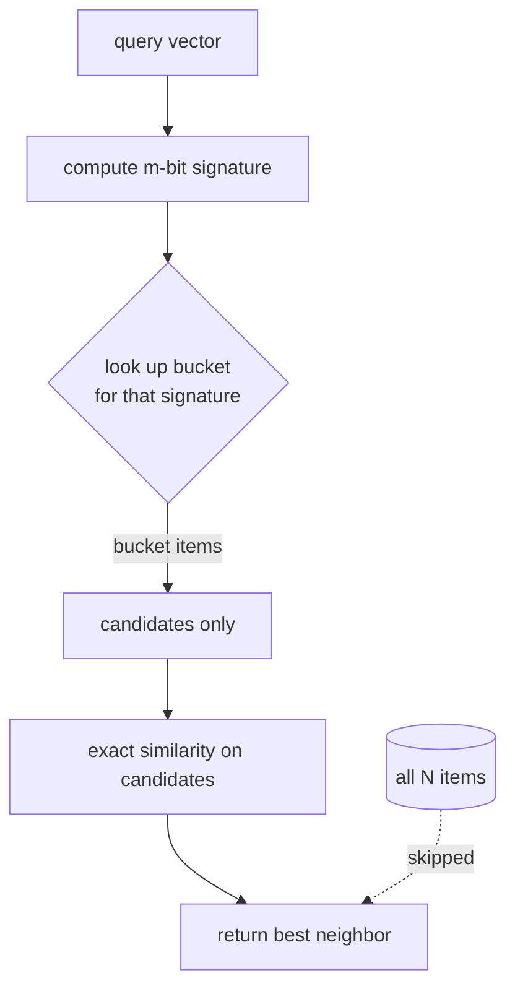

# Locality-Sensitive Hashing (LSH) — Junior Level

> **One-line summary:** A normal hash function tries to scatter *everything* into different buckets. **Locality-sensitive hashing** does the opposite on purpose: it uses special hash functions so that **similar items land in the same bucket** and **dissimilar items almost never do**. To find items close to a query, you just hash the query and look in its bucket — instead of comparing it against every item in the database.

---

## Table of Contents

1. [Introduction](#introduction)
2. [Prerequisites](#prerequisites)
3. [Glossary](#glossary)
4. [Core Concepts](#core-concepts)
5. [Big-O Summary](#big-o-summary)
6. [Real-World Analogies](#real-world-analogies)
7. [Pros & Cons](#pros--cons)
8. [Step-by-Step Walkthrough](#step-by-step-walkthrough)
9. [Code Examples](#code-examples)
10. [Coding Patterns](#coding-patterns)
11. [Error Handling](#error-handling)
12. [Performance Tips](#performance-tips)
13. [Best Practices](#best-practices)
14. [Edge Cases & Pitfalls](#edge-cases--pitfalls)
15. [Common Mistakes](#common-mistakes)
16. [Cheat Sheet](#cheat-sheet)
17. [Visual Animation](#visual-animation)
18. [Summary](#summary)
19. [Further Reading](#further-reading)

---

## Introduction

Suppose you have a million photos, songs, or documents, each turned into a list of numbers — a **vector** — that describes it. A user hands you one item and asks: *"Which of the million stored items is most like this one?"* This is the **nearest-neighbor** problem, and it shows up everywhere: "find similar products," "find duplicate documents," "find the song that sounds like this hum," "find the database row whose embedding is closest to this query."

The obvious solution is **brute force**: compare the query against all one million items, measure the distance to each, and keep the closest. That is correct but slow — it is `O(N)` distance computations *per query*. With a million items and many queries per second, and with each vector having hundreds of dimensions, this quickly becomes too expensive.

You might think a tree structure could help, the way a binary search tree speeds up lookups in one dimension. Structures like **KD-trees** do work beautifully in 2 or 3 dimensions. But in **high dimensions** (say 100+), they collapse: the "curse of dimensionality" means almost every point ends up roughly the same distance from the query, the tree has to explore nearly every branch, and you are back to scanning everything. Exact nearest neighbor in high dimensions is genuinely hard.

The key realization is that we usually do **not need the exact closest** item — a *very close* one is good enough. "Show me products similar to this" does not require the single mathematically-nearest product; any of the top handful is fine. This relaxation is called **approximate nearest neighbor (ANN)**, and it is what makes sublinear search possible.

**Locality-Sensitive Hashing** is one of the oldest and most elegant ANN methods. The whole idea rests on one twist:

> **Use a hash function whose collisions are a feature, not a bug — design it so that two items collide (hash to the same bucket) with a probability that grows as the items become more similar.**

A regular hash function (the kind in a hash map) is built so that even nearly-identical inputs scatter to unrelated buckets — that is what makes hash maps fast and uniform. LSH flips that requirement: nearby points should *prefer* the same bucket. Then, to answer "what is near my query?", you hash the query, jump straight to its bucket, and only compare against the handful of items already sitting there. You skip almost the entire database. This file builds that idea from scratch, with **random hyperplanes for cosine similarity** as the concrete, easy-to-picture example.

---

## Prerequisites

Before reading this file you should be comfortable with:

- **Vectors** — a point described by a list of numbers, e.g. `[0.2, -0.5, 0.9]`; you can think of it as an arrow from the origin.
- **Hash functions** — a function that maps any input to a bucket label; equal inputs always give equal labels.
- **Hash tables / dictionaries** — storing items under a key and looking them up in `O(1)`.
- **Basic probability** — what "probability `p`" means; that more independent tries change the odds.
- **Dot product (helpful)** — `a·b = a₁b₁ + a₂b₂ + …`; it tells you which side of a line/plane a point is on.
- **Big-O notation** — `O(N)`, `O(1)`, what "sublinear" roughly means.

Optional but helpful:

- The sibling topic [`../02-minhash`](../02-minhash) — MinHash is *the* LSH family for **set** (Jaccard) similarity, and it plugs directly into the banding scheme described here.
- A peek at **cosine similarity** — the angle between two vectors, used heavily in text/image search.

---

## Glossary

| Term | Meaning |
|------|---------|
| **Nearest neighbor (NN)** | Among stored items, the one closest to a query under some distance/similarity. |
| **Approximate NN (ANN)** | Returning an item that is *close enough*, not necessarily the exact closest — much faster. |
| **Vector / embedding** | A list of numbers describing an item (a document, image, user). |
| **Similarity / distance** | A number saying how alike (or far apart) two items are: cosine, Jaccard, Euclidean. |
| **Hash bucket** | A slot; items sharing a hash value land in the same bucket. |
| **LSH family** | A set of hash functions where similar items collide *more often* than dissimilar ones. |
| **Collision** | Two items hashing to the **same** bucket. In LSH, a *good* sign that they are similar. |
| **Candidate** | An item that shares a bucket with the query, so it is *worth* comparing exactly. |
| **Random hyperplane** | A random "wall" through the origin; which side a vector is on becomes one hash bit. |
| **Signature** | A short fixed-length code (here: a string of bits) summarizing an item for hashing. |
| **Recall** | Fraction of the true near neighbors that LSH actually finds. |
| **Curse of dimensionality** | In high dimensions, distances flatten out and tree methods stop helping. |

---

## Core Concepts

### 1. The problem: find what is near a query

We store `N` items as vectors. A query arrives, and we want the item(s) most **similar** to it. "Similar" must be made precise by a distance or similarity measure. Three common ones:

- **Cosine similarity** — the angle between two vectors (great for text/image embeddings).
- **Jaccard similarity** — overlap of two sets (great for documents-as-shingle-sets; see [`../02-minhash`](../02-minhash)).
- **Euclidean distance** — straight-line distance (great for raw coordinates/features).

Brute force compares the query to all `N` items: `O(N)` per query. We want to do far less.

### 2. Why a normal hash function does NOT help

A hash map gives `O(1)` lookup for **exact** keys: "is this *exact* item present?" But two items that are 99% similar will, under an ordinary hash, land in two completely unrelated buckets. So a hash map cannot answer "find me items *similar* to this." We need a hash function with a fundamentally different property.

### 3. The locality-sensitive property

An LSH hash function `h` is designed so that:

> **If two items are similar, `h` maps them to the same bucket with high probability. If they are dissimilar, `h` maps them to the same bucket with low probability.**

In short, `P[h(x) = h(y)]` *increases* as `x` and `y` get more similar. That is the entire trick. A regular hash makes that probability tiny no matter what; an LSH hash ties it to similarity. (The precise, formal version — the "(r₁, r₂, p₁, p₂)-sensitive family" — lives in [`professional.md`](./professional.md). For now, "similar → likely same bucket" is enough.)

### 4. Concrete example: random hyperplanes for cosine

Here is an LSH family you can picture. Take a random vector `r` (a random direction). For an item vector `x`, ask one yes/no question: *is `x·r ≥ 0`?* That splits all of space into two halves by a random plane through the origin, and the answer is **one bit**:

```
h_r(x) = 1 if x·r ≥ 0, else 0
```

Two vectors pointing in *nearly the same direction* (small angle, high cosine similarity) are very likely to fall on the **same** side of a random plane — so they get the same bit. Two vectors pointing in *opposite directions* are likely split apart. In fact the math (see `middle.md`) gives a clean rule:

```
P[ h_r(x) = h_r(y) ] = 1 - (angle between x and y) / π
```

So if the angle is tiny, the collision probability is near 1; if the angle is 90°, it is 0.5; if they point opposite ways, it is near 0. One random plane is a weak hint — but a *bundle* of them gives a strong signature.

### 5. From one bit to a signature

One bit barely distinguishes items. So we draw **several** random planes `r₁, r₂, …, r_m` and stack their bits into a short code:

```
signature(x) = [h_{r1}(x), h_{r2}(x), ..., h_{rm}(x)]   e.g. "1011"
```

Items pointing in similar directions get **similar signatures** (mostly the same bits). Now we can bucket items by their signature: matching signatures → same bucket → likely similar. The query gets a signature too; we look only in its bucket.

### 6. Querying: hash, then check only candidates

The search becomes three cheap steps:

1. Compute the query's signature.
2. Look up the bucket with that signature; the items there are **candidates**.
3. Compute the *exact* similarity only for those few candidates and return the best.

Because each bucket holds only a small slice of the database, you do a handful of exact comparisons instead of `N`. The few items you actually compare are *likely* to include the true near neighbors — that is what "locality-sensitive" buys you.

### 7. The trade-off you will tune: recall vs precision

There is no free lunch. If your signatures are **long** (many planes), only *very* similar items share a bucket — high precision (few false candidates) but you might **miss** some true neighbors (lower recall). If signatures are **short**, you catch more true neighbors (high recall) but also drag in many unrelated items (lower precision, more exact comparisons). Real LSH systems combine several hash tables to get both — the **banding** scheme — which is the heart of [`middle.md`](./middle.md).

---

## Big-O Summary

Let `N` = number of stored items, `d` = vector dimension, `m` = number of hash bits per signature, `L` = number of hash tables.

| Operation | Time | Space | Notes |
|-----------|------|-------|-------|
| Brute-force NN (one query) | **O(N·d)** | O(N·d) | Compare query to every item. Correct but slow. |
| KD-tree query (low `d`) | O(log N) | O(N·d) | Great for `d ≤ ~10`; degrades to `O(N)` in high `d`. |
| Build one LSH signature | **O(m·d)** | O(m) | `m` dot products of length `d`. |
| Insert item into LSH index | O(L·m·d) | O(N·L) | Hash into `L` tables. |
| LSH query (typical) | **~O(L·m·d + (candidates)·d)** | O(N·L) | Often **sublinear** in `N` — most items never touched. |
| Recall / precision | — | — | Tunable via `m`, `L`, and banding. |

The headline: LSH replaces an `O(N)` scan with hashing into a few buckets and comparing only the **candidates** that share a bucket. When tuned well, the candidate set is far smaller than `N`, giving sublinear query time at the cost of *approximate* (not guaranteed-exact) answers. The exact exponent — query time `O(N^ρ)` for a `ρ < 1` — is derived in [`professional.md`](./professional.md).

---

## Real-World Analogies

| Concept | Analogy |
|---------|---------|
| Locality-sensitive hash | Sorting people into rooms by rough traits ("tall + dark hair") so lookalikes end up together — unlike a random coat-check ticket that scatters everyone. |
| Random hyperplane bit | Drawing a chalk line across a plaza and asking "which side are you on?" People standing close together usually end up on the same side. |
| A signature of `m` bits | Asking `m` such yes/no questions; two people who answer almost all of them the same are standing near each other. |
| Bucket | A room holding everyone with the same answers — your shortlist of lookalikes. |
| Query = hash + check bucket | Instead of interviewing the whole stadium, you walk into the one room matching your answers and only talk to the people there. |
| Recall vs precision | Ask *too many* questions and you walk into an empty room (missed people, low recall); ask *too few* and the room is packed with strangers (low precision). |
| Multiple hash tables | Running several independent room-assignment schemes so anyone near you shows up in *at least one* of your rooms. |

Where the analogy breaks: real rooms are physical, but LSH "rooms" are just dictionary keys, and a single item lives in `L` different rooms at once (one per hash table) to boost the odds of being found.

---

## Pros & Cons

| Pros | Cons |
|------|------|
| Turns an `O(N)` scan into hashing + a small candidate check — often **sublinear**. | Returns *approximate* neighbors; can **miss** some true ones (recall < 100%). |
| Works in **high dimensions** where KD-trees fail. | Needs tuning (`m`, `L`, band sizes) to hit a target recall/precision. |
| Simple to build: random projections + dictionaries. | Uses extra memory: each item is stored in `L` hash tables. |
| Different LSH **families** cover different metrics (cosine, Jaccard, Euclidean). | A *single* family only handles *one* similarity measure. |
| Easy to distribute and update incrementally (just hash and insert). | Modern graph indexes (HNSW) often beat it on recall-vs-speed today. |

**When to use:** approximate nearest-neighbor search at scale — near-duplicate detection, recommendation, semantic/vector search, deduplication — especially with high-dimensional vectors or huge set collections where exact methods are too slow.

**When NOT to use:** small datasets (just brute-force them); low-dimensional data (use a KD-tree / ball tree); when you need the *guaranteed exact* nearest neighbor; when a graph index like HNSW (see [`senior.md`](./senior.md)) better fits your recall/latency budget.

---

## Step-by-Step Walkthrough

Let us do **random-hyperplane LSH** for cosine similarity by hand, in 2-D so we can picture it.

We store three items and one query (all 2-D vectors):

```
A = ( 1.0,  0.1)   -> points roughly "east"
B = ( 0.9,  0.2)   -> also roughly "east" (very close to A)
C = (-0.5,  0.9)   -> points "north-west" (different direction)
Q = ( 0.95, 0.15)  -> query, points "east" (should match A and B)
```

We draw `m = 3` random planes given by normal vectors `r₁, r₂, r₃`. The hash bit is `1` if `x·r ≥ 0` else `0`.

```
r1 = ( 1.0,  0.0)      ask: is the x-coordinate >= 0?
r2 = ( 0.2,  1.0)      ask: is 0.2*x + y >= 0?
r3 = (-1.0,  0.5)      ask: is -x + 0.5*y >= 0?
```

**Compute signatures (each dot product, then its sign):**

```
A·r1 = 1.0   >=0 -> 1 | A·r2 = 0.2*1.0 + 0.1 = 0.30  >=0 -> 1 | A·r3 = -1.0 + 0.05 = -0.95 <0 -> 0   => sig(A)=110
B·r1 = 0.9   >=0 -> 1 | B·r2 = 0.2*0.9 + 0.2 = 0.38  >=0 -> 1 | B·r3 = -0.9 + 0.10 = -0.80 <0 -> 0   => sig(B)=110
C·r1 = -0.5  <0  -> 0 | C·r2 = 0.2*-0.5 + 0.9= 0.80  >=0 -> 1 | C·r3 =  0.5 + 0.45 =  0.95 >=0-> 1   => sig(C)=011
Q·r1 = 0.95  >=0 -> 1 | Q·r2 = 0.2*0.95+0.15= 0.34  >=0 -> 1 | Q·r3 = -0.95+0.075= -0.875<0 -> 0   => sig(Q)=110
```

**Bucket by signature:**

```
bucket "110": { A, B }      <- A and B (both "east") share a bucket
bucket "011": { C }         <- C ("north-west") is alone
```

**Query:** `sig(Q) = "110"`. Look in bucket `"110"` → candidates `{A, B}`. We never even compare against `C`. Now compute *exact* cosine similarity only for `A` and `B`:

```
cos(Q, A) ~ 0.9989    cos(Q, B) ~ 0.9999
```

Return `B` (and `A`) as the near neighbors — correct, and we skipped `C` entirely. With three bits and three points the win is tiny, but with a million points each bucket holds a small fraction of them, and the query touches only that fraction. Notice how `A`, `B`, `Q` (similar directions) collide, while `C` (different direction) does not — exactly the locality-sensitive property at work.

---

## Code Examples

### Example: Random-hyperplane LSH for cosine similarity

We build an index that, for each item, computes an `m`-bit signature from `m` random hyperplanes, then stores items in a dictionary keyed by signature. A query hashes the same way and only compares against items in its bucket.

#### Go

```go
package main

import (
	"fmt"
	"math"
	"math/rand"
	"strings"
)

// LSHIndex stores items bucketed by their m-bit hyperplane signature.
type LSHIndex struct {
	planes  [][]float64          // m random normal vectors, each length d
	buckets map[string][]int     // signature -> list of item ids
	items   [][]float64          // stored vectors
}

func NewLSHIndex(m, d int, seed int64) *LSHIndex {
	rng := rand.New(rand.NewSource(seed))
	planes := make([][]float64, m)
	for i := range planes {
		planes[i] = make([]float64, d)
		for j := range planes[i] {
			planes[i][j] = rng.NormFloat64() // Gaussian -> uniform random direction
		}
	}
	return &LSHIndex{planes: planes, buckets: map[string][]int{}}
}

// signature returns the m-bit code "1011..." for a vector.
func (ix *LSHIndex) signature(x []float64) string {
	var sb strings.Builder
	for _, r := range ix.planes {
		dot := 0.0
		for j := range x {
			dot += x[j] * r[j]
		}
		if dot >= 0 {
			sb.WriteByte('1')
		} else {
			sb.WriteByte('0')
		}
	}
	return sb.String()
}

func (ix *LSHIndex) Add(x []float64) {
	id := len(ix.items)
	ix.items = append(ix.items, x)
	sig := ix.signature(x)
	ix.buckets[sig] = append(ix.buckets[sig], id)
}

func cosine(a, b []float64) float64 {
	var dot, na, nb float64
	for i := range a {
		dot += a[i] * b[i]
		na += a[i] * a[i]
		nb += b[i] * b[i]
	}
	return dot / (math.Sqrt(na) * math.Sqrt(nb))
}

// Query returns the best candidate from the query's bucket (-1 if none).
func (ix *LSHIndex) Query(q []float64) (int, float64) {
	cand := ix.buckets[ix.signature(q)]
	best, bestSim := -1, -1.0
	for _, id := range cand {
		s := cosine(q, ix.items[id])
		if s > bestSim {
			bestSim, best = s, id
		}
	}
	return best, bestSim
}

func main() {
	ix := NewLSHIndex(16, 2, 42)
	ix.Add([]float64{1.0, 0.1})  // id 0  (A)
	ix.Add([]float64{0.9, 0.2})  // id 1  (B)
	ix.Add([]float64{-0.5, 0.9}) // id 2  (C)
	id, sim := ix.Query([]float64{0.95, 0.15})
	fmt.Printf("best candidate id=%d  cosine=%.4f\n", id, sim)
}
```

#### Java

```java
import java.util.*;

public class LSHIndex {
    private final double[][] planes;          // m random normals, each length d
    private final Map<String, List<Integer>> buckets = new HashMap<>();
    private final List<double[]> items = new ArrayList<>();

    public LSHIndex(int m, int d, long seed) {
        Random rng = new Random(seed);
        planes = new double[m][d];
        for (int i = 0; i < m; i++)
            for (int j = 0; j < d; j++)
                planes[i][j] = rng.nextGaussian();
    }

    private String signature(double[] x) {
        StringBuilder sb = new StringBuilder();
        for (double[] r : planes) {
            double dot = 0;
            for (int j = 0; j < x.length; j++) dot += x[j] * r[j];
            sb.append(dot >= 0 ? '1' : '0');
        }
        return sb.toString();
    }

    public void add(double[] x) {
        int id = items.size();
        items.add(x);
        buckets.computeIfAbsent(signature(x), k -> new ArrayList<>()).add(id);
    }

    static double cosine(double[] a, double[] b) {
        double dot = 0, na = 0, nb = 0;
        for (int i = 0; i < a.length; i++) {
            dot += a[i] * b[i]; na += a[i] * a[i]; nb += b[i] * b[i];
        }
        return dot / (Math.sqrt(na) * Math.sqrt(nb));
    }

    public int[] query(double[] q) {        // returns {bestId, -} via printing
        List<Integer> cand = buckets.getOrDefault(signature(q), List.of());
        int best = -1; double bestSim = -1;
        for (int id : cand) {
            double s = cosine(q, items.get(id));
            if (s > bestSim) { bestSim = s; best = id; }
        }
        System.out.printf("best candidate id=%d  cosine=%.4f%n", best, bestSim);
        return new int[]{best};
    }

    public static void main(String[] args) {
        LSHIndex ix = new LSHIndex(16, 2, 42);
        ix.add(new double[]{1.0, 0.1});
        ix.add(new double[]{0.9, 0.2});
        ix.add(new double[]{-0.5, 0.9});
        ix.query(new double[]{0.95, 0.15});
    }
}
```

#### Python

```python
import math
import random


class LSHIndex:
    def __init__(self, m, d, seed=42):
        rng = random.Random(seed)
        # m random normal vectors, each of length d (Gaussian -> uniform direction)
        self.planes = [[rng.gauss(0, 1) for _ in range(d)] for _ in range(m)]
        self.buckets = {}
        self.items = []

    def signature(self, x):
        bits = []
        for r in self.planes:
            dot = sum(xi * ri for xi, ri in zip(x, r))
            bits.append('1' if dot >= 0 else '0')
        return ''.join(bits)

    def add(self, x):
        idx = len(self.items)
        self.items.append(x)
        self.buckets.setdefault(self.signature(x), []).append(idx)

    @staticmethod
    def cosine(a, b):
        dot = sum(p * q for p, q in zip(a, b))
        na = math.sqrt(sum(p * p for p in a))
        nb = math.sqrt(sum(q * q for q in b))
        return dot / (na * nb)

    def query(self, q):
        cand = self.buckets.get(self.signature(q), [])
        best, best_sim = -1, -1.0
        for idx in cand:
            s = self.cosine(q, self.items[idx])
            if s > best_sim:
                best_sim, best = s, idx
        return best, best_sim


if __name__ == "__main__":
    ix = LSHIndex(m=16, d=2, seed=42)
    ix.add([1.0, 0.1])    # A
    ix.add([0.9, 0.2])    # B
    ix.add([-0.5, 0.9])   # C
    best, sim = ix.query([0.95, 0.15])
    print(f"best candidate id={best}  cosine={sim:.4f}")
```

**What it does:** projects each vector onto `m` random directions, records the sign of each projection as one bit, and buckets items by the resulting bit-string. A query is hashed the same way; only items sharing its bucket are compared exactly. With `m=16` planes, `A` and `B` reliably share the query's bucket while `C` does not.
**Run:** `go run main.go` | `javac LSHIndex.java && java LSHIndex` | `python lsh.py`

---

## Coding Patterns

### Pattern 1: Brute-force oracle (test against this)

**Intent:** Before trusting LSH, compare its answer to the slow, obviously-correct linear scan on small data.

```python
def brute_force_nn(items, q, sim):
    best, best_s = -1, -1.0
    for i, x in enumerate(items):
        s = sim(q, x)
        if s > best_s:
            best_s, best = s, i
    return best, best_s
# LSH's candidate-based answer should usually match (or be close to) this.
```

### Pattern 2: One hyperplane = one bit

**Intent:** The atomic LSH operation for cosine is "dot with a random direction, take the sign."

```python
def hash_bit(x, r):
    return 1 if sum(xi * ri for xi, ri in zip(x, r)) >= 0 else 0
# m independent random r's give an m-bit signature.
```

### Pattern 3: Hash query, scan only the bucket

**Intent:** The whole speedup is "look in one bucket, not the whole table."



---

## Error Handling

| Error | Cause | Fix |
|-------|-------|-----|
| Query returns nothing | Query's exact signature bucket is empty (too many bits). | Use *multiple* hash tables (`L`) and merge candidates; or shorten signatures. |
| Misses obvious near neighbors | Signature too long → near items split across buckets. | Lower `m`, add tables, or use banding (see `middle.md`). |
| Buckets all huge / no speedup | Signature too short → everything collides. | Increase `m`; check that planes are random and distinct. |
| Wrong similarity used | Hyperplane LSH compares *cosine*, but you wanted Jaccard/Euclidean. | Pick the LSH family matching your metric (MinHash, p-stable). |
| Vectors not comparable | Different lengths, or zero vector (cosine undefined). | Validate dimension; handle the zero vector explicitly. |
| Same item in many buckets | Storing in `L` tables → duplicate candidates. | De-duplicate candidate ids before exact scoring. |

---

## Performance Tips

- **Hash the query into a few buckets, never the whole table** — that is the entire point; do not accidentally scan all items.
- **Reuse the random planes** — generate them once at index build, not per query.
- **De-duplicate candidates** before the exact-similarity pass when using multiple tables.
- **Pick `m` (bits) for selectivity:** more bits = smaller, purer buckets (faster but lower recall); fewer bits = bigger buckets (higher recall but more exact comparisons).
- **Use multiple tables (`L`)** to recover recall lost to long signatures — an item missed in one table is often caught in another.
- **Normalize vectors** if your similarity is cosine, so dot products are comparable.

---

## Best Practices

- Always validate LSH against a **brute-force oracle** on small data; measure actual recall before deploying.
- **Match the family to the metric:** random hyperplanes → cosine; MinHash → Jaccard; p-stable projections → Euclidean.
- Generate random planes **once**, store them, and reuse for every insert and query.
- Store each item in **`L` independent tables** to raise the chance a true neighbor is found.
- Treat the **zero vector** and **empty set** as special cases (cosine/Jaccard are undefined there).
- Document your target **recall/precision** and the `m`, `L` that achieve it, so future readers understand the trade-off.

---

## Edge Cases & Pitfalls

- **Empty bucket on query** — the exact signature matched nothing; rely on multiple tables or a fallback scan.
- **Zero vector** — cosine is undefined (division by zero); reject or special-case it.
- **All items identical** — every signature equal; one giant bucket (correct, but no speedup).
- **Very high dimension with too few planes** — buckets too coarse; recall drops or precision craters.
- **Non-normalized vectors with cosine** — still works (sign of dot product is scale-invariant), but the *exact* re-ranking step needs proper cosine.
- **Duplicate planes (bad RNG)** — repeated bits waste signature length; use a good random source.
- **Comparing the wrong metric** — hyperplane LSH will happily run on data where you actually meant Jaccard, giving meaningless results.

---

## Common Mistakes

1. **Using an ordinary hash function** and expecting similar items to collide — ordinary hashes scatter on purpose.
2. **Picking a signature length blindly** — too long misses neighbors, too short floods buckets; tune `m`.
3. **Forgetting multiple tables** — one table with long signatures has poor recall; `L` tables fix it.
4. **Mixing up the metric** — using random hyperplanes (cosine) when the data needs Jaccard (use MinHash) or Euclidean (use p-stable).
5. **Not re-ranking with the exact similarity** — buckets give *candidates*; you still compute the true distance to choose among them.
6. **Skipping the brute-force check** — never measuring recall, so silently returning poor results.
7. **Regenerating planes per query** — random planes must be fixed; otherwise an item's signature changes every call.

---

## Cheat Sheet

| Question | Tool | Key idea |
|----------|------|----------|
| Find similar items fast? | LSH | hash so similar → same bucket |
| Cosine similarity? | random hyperplanes | bit = sign of `x·r` |
| Jaccard (sets)? | MinHash | see [`../02-minhash`](../02-minhash) |
| Euclidean distance? | p-stable projections | bucketize random projections |
| One bit not enough? | `m`-bit signature | stack `m` planes |
| Missing neighbors? | more tables `L` | item found in *some* table |
| Why not a KD-tree? | curse of dimensionality | trees fail when `d` is large |

Core algorithm (random-hyperplane LSH):

```
build(items, m planes):
    for each item x:
        sig = bits[ sign(x·r) for r in planes ]
        buckets[sig].append(x)

query(q):
    sig = bits[ sign(q·r) for r in planes ]
    candidates = buckets[sig]
    return argmax over candidates of exactSimilarity(q, c)
# query touches one bucket, not all N items
```

---

## Visual Animation

> See [`animation.html`](./animation.html) for an interactive visualization.
>
> The animation demonstrates:
> - Points placed in 2-D and hashed into buckets by random hyperplanes
> - **Near points colliding** into the same bucket while far points separate
> - The **banding / S-curve** trade-off between recall and precision as you slide `b` and `r`
> - A **query** lighting up its bucket and finding candidates without scanning everything
> - Controls, an info panel, a Big-O table, and an operation log

---

## Summary

Locality-Sensitive Hashing makes "find similar items" fast by inverting the usual hashing goal: instead of scattering everything, it uses hash functions where **similar items collide and dissimilar items rarely do**. The flagship example, **random hyperplanes for cosine similarity**, turns each item into a bit-string by asking, for several random planes, "which side are you on?" — and two vectors pointing in similar directions get matching bits with probability `1 - angle/π`. Bucketing by signature lets a query jump straight to its bucket, compare only the handful of **candidates** there, and re-rank them exactly — replacing an `O(N)` scan with sublinear work. The price is approximation: you tune signature length and the number of tables to balance **recall** (finding true neighbors) against **precision** (avoiding wasted comparisons). Different metrics use different LSH **families** — MinHash for Jaccard ([`../02-minhash`](../02-minhash)), p-stable projections for Euclidean — but the locality-sensitive idea is the same everywhere.

---

## Further Reading

- *Mining of Massive Datasets* (Leskovec, Rajaraman, Ullman) — Chapter 3, "Finding Similar Items" (shingling, MinHash, LSH families, banding).
- Indyk & Motwani (1998) — the original "Approximate Nearest Neighbors" paper introducing LSH.
- Charikar (2002) — "Similarity Estimation Techniques from Rounding Algorithms" (random-hyperplane / SimHash LSH for cosine).
- Sibling topic [`../02-minhash`](../02-minhash) — the LSH family for Jaccard set similarity, feeding the banding scheme.
- Sibling topic [`../01-reservoir-sampling`](../01-reservoir-sampling) — another small-memory randomized technique.
- Wikipedia — "Locality-sensitive hashing," "Nearest neighbor search," "Cosine similarity."

---

Next step: [`middle.md`](./middle.md) — the AND/OR banding construction, the S-curve `1-(1-p^r)^b`, the LSH family per metric (MinHash / SimHash / p-stable), and how to tune `b` and `r`.
