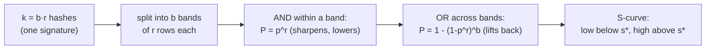
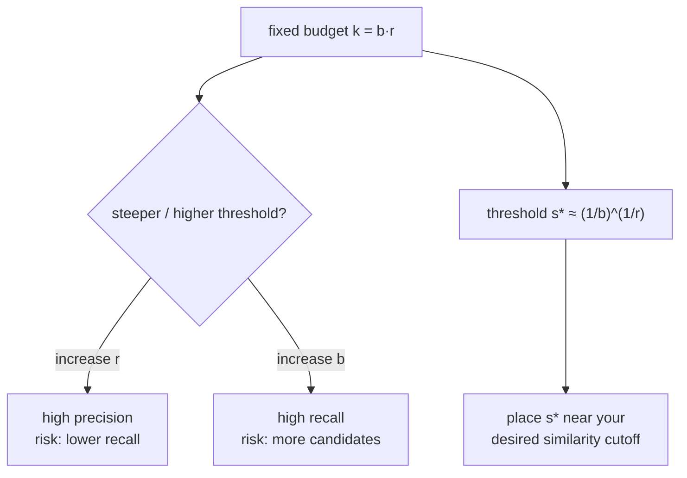

# Locality-Sensitive Hashing (LSH) — Middle Level

> **One-line summary:** A single LSH hash is a weak similarity detector. To turn it into a sharp filter, you combine many of them with **AND** (require all `r` rows in a band to match) and **OR** (succeed if *any* of `b` bands matches). The result is the tunable **S-curve** `P[candidate] = 1 - (1 - p^r)^b`, where `p` is the base collision probability: items above a similarity threshold become candidates almost always, items below it almost never. Choosing `b` and `r` is how you place that threshold and balance **recall** against **precision**.

---

## Table of Contents

1. [Introduction](#introduction)
2. [Deeper Concepts](#deeper-concepts)
3. [The AND/OR Construction and the S-Curve](#the-andor-construction-and-the-s-curve)
4. [Recall and Precision from the S-Curve](#recall-and-precision-from-the-s-curve)
5. [LSH Families per Metric](#lsh-families-per-metric)
6. [Tuning b and r](#tuning-b-and-r)
7. [Multiple Tables vs One Banded Index](#multiple-tables-vs-one-banded-index)
8. [Comparison with Alternatives](#comparison-with-alternatives)
9. [Code Examples](#code-examples)
10. [Multi-Probe LSH](#multi-probe-lsh)
11. [Error Handling](#error-handling)
12. [Performance Analysis](#performance-analysis)
13. [Best Practices](#best-practices)
14. [Visual Animation](#visual-animation)
15. [Summary](#summary)

---

## Introduction

> Focus: "Why does it work?" and "When should I choose this?"

At the junior level we saw the core promise: a locality-sensitive hash makes similar items collide. But a *single* hash is a blunt instrument. For random hyperplanes, two items at 90° still collide with probability `0.5` — half the database lands in your bucket. We need to amplify the gap between "similar" and "dissimilar" so that the collision probability jumps sharply at some similarity threshold.

The amplification trick has two halves, and both are just probability:

- **AND-construction (a band of `r` rows):** require `r` independent hashes to *all* agree. The collision probability becomes `p^r` — it crushes everything, but it crushes dissimilar pairs much harder than similar ones.
- **OR-construction (`b` bands):** declare a candidate if *any* of `b` independent bands agrees. This lifts the probability back up, but it lifts similar pairs much more than dissimilar ones.

Stack them and you get the famous **S-curve**:

```
P[ x, y become candidates ] = 1 - (1 - p^r)^b
```

where `p = P[one hash agrees]` is itself a function of similarity. This curve is nearly flat-low for dissimilar pairs, rises steeply through a **threshold**, and is nearly flat-high for similar pairs. By choosing `b` and `r` you move that threshold and control how steep it is — which directly sets your **recall** (do we catch true neighbors?) and **precision** (do we waste time on false candidates?). This file derives the S-curve, shows the LSH family for each common metric, and teaches how to pick `b` and `r`.

---

## Deeper Concepts

### Invariant: collision probability tracks similarity

Every LSH family obeys one structural promise: for a single hash `h` drawn from the family,

```
p(s) = P[ h(x) = h(y) ]   is a monotonically increasing function of similarity s(x, y)
```

If you ever build an "LSH" hash where this fails — where more-similar pairs do *not* collide more — the whole construction breaks. The amplification below assumes `p` rises with similarity; it only sharpens an existing trend, it cannot create one.

### The base collision probability per family

The exact form of `p(s)` depends on the metric:

| Family | Metric | Base collision probability `p` |
|--------|--------|--------------------------------|
| MinHash | Jaccard `J` | `p = J` (exactly) |
| Random hyperplane (SimHash) | cosine / angle `θ` | `p = 1 - θ/π` |
| p-stable projection | Euclidean / L2 | `p = f(distance, bucket width w)` (decreasing in distance) |

For MinHash this is beautifully clean: one slot agrees with probability *equal* to the Jaccard similarity (proved in [`../02-minhash`](../02-minhash)). For hyperplanes, two vectors at angle `θ` fall on the same side of a random plane with probability `1 - θ/π`. Both feed the same banding machinery.

### Why one hash is not enough

Take MinHash with `p = J`. A pair with `J = 0.8` agrees on one slot 80% of the time — but so does a pair with `J = 0.3` agree 30% of the time. If you bucket on a single slot, your `J=0.8` neighbors share a bucket only 80% of the time (missing 20% — bad recall), while `J=0.3` strangers share it 30% of the time (lots of junk — bad precision). One hash cannot separate them sharply. Banding fixes both ends at once.

### The threshold

The S-curve has an inflection region near similarity

```
s* ≈ (1/b)^(1/r)
```

This is the *rough* point where `P[candidate]` crosses `0.5`. Pairs more similar than `s*` are very likely candidates; pairs less similar are very likely filtered out. **Designing an LSH index = placing `s*` where you want the cutoff, then making the curve steep enough.** (Derived in [`professional.md`](./professional.md).)

---

## The AND/OR Construction and the S-Curve

We have `k = b · r` independent hashes, arranged as a signature of `k` rows split into `b` **bands** of `r` **rows** each.

**Step 1 — AND inside a band.** Two items are said to "match a band" only if they agree on *all `r` rows* of that band. Independence gives:

```
P[ match one band ] = p · p · ... · p (r times) = p^r
```

This is the **AND**: harder to satisfy, so it drives the probability down. Because `p < 1`, raising to the `r` power punishes small `p` (dissimilar) far more than large `p` (similar).

**Step 2 — OR across bands.** Two items become **candidates** if they match *at least one* of the `b` bands. The complement (matching *no* band) is `(1 - p^r)^b`, so:

```
P[ candidate ] = 1 - (1 - p^r)^b
```

This is the **OR**: it gives similar pairs many chances to be caught, lifting their probability back toward 1 while dissimilar pairs (already crushed by `p^r`) stay near 0.

**The shape.** Plot `P[candidate]` against similarity `s` (recall `p` rises with `s`). It is an **S-curve**: flat and low for small `s`, a steep rise around `s*`, flat and high for large `s`.



**Worked numbers.** Let `k = 20`, split as `b = 5` bands of `r = 4` rows (MinHash, so `p = J`):

| Jaccard `J = p` | `p^r = p^4` | `P[candidate] = 1 - (1 - p^4)^5` |
|-----------------|-------------|-----------------------------------|
| 0.2 | 0.0016 | 0.008 (≈ filtered out) |
| 0.4 | 0.0256 | 0.122 |
| 0.5 | 0.0625 | 0.276 |
| 0.6 | 0.1296 | 0.503 (≈ threshold) |
| 0.7 | 0.2401 | 0.747 |
| 0.8 | 0.4096 | 0.922 (≈ caught) |
| 0.9 | 0.6561 | 0.995 |

The threshold sits near `s* ≈ (1/5)^(1/4) ≈ 0.67`, matching where the table crosses `0.5`. Pairs at `J = 0.8` are caught 92% of the time; pairs at `J = 0.3` almost never. That separation is the entire value of banding.

**How banding becomes buckets.** In practice you do not compute `P` for pairs — you *implement* the OR by using `b` hash tables. For each band, hash the `r`-row sub-signature to a bucket; two items collide in that table iff their band matches. An item is inserted into all `b` tables. A query collects candidates from all `b` tables and unions them — that union *is* the OR.

**Why independence matters.** The clean `p^r` and `(1 - p^r)^b` formulas assume the `k = b·r` hashes are *mutually independent*. If two rows reuse the same hash function, agreeing on one guarantees agreeing on the other, so the AND no longer multiplies — the effective band length is smaller and the curve flattens. Always draw `k` distinct random hashes (distinct planes, distinct MinHash seeds, distinct projection vectors). A common bug is generating planes from a weak RNG that repeats; the symptom is recall that refuses to improve as you raise `r`.

---

## Recall and Precision from the S-Curve

The S-curve is not just a pretty shape — it *is* your recall and precision, read off at different similarities.

- **Recall** at a working similarity `s` is exactly `P[candidate] = 1 - (1 - p(s)^r)^b` evaluated at the similarity of your *true neighbors*. If your near-duplicates sit at `J = 0.85` and the curve gives `P = 0.92` there, your recall is ~92%.
- **Precision** (the inverse cost) is governed by `P[candidate]` evaluated at the similarity of the *non-neighbors*. If most unrelated pairs sit at `J ≈ 0.1` and the curve gives `P = 0.005` there, then only ~0.5% of unrelated items become candidates — a tiny, cheap candidate set.

So a well-placed S-curve is one whose steep transition falls **between** the typical non-neighbor similarity and the typical neighbor similarity. The wider that gap in your data, the easier LSH's job. When neighbor and non-neighbor similarities overlap heavily, *no* `(b, r)` separates them cleanly — that is a signal your features or metric, not your LSH parameters, are the problem.

```text
Reading recall/precision off one curve (b=5, r=4, MinHash so p=J):
   non-neighbors at J=0.2 -> P=0.008   => ~0.8% false candidates  (good precision)
   neighbors    at J=0.8 -> P=0.922   => ~92% caught              (good recall)
   the steep transition (~0.67) sits between the two populations  => clean separation
```

This reframing is the practical heart of LSH tuning: do not chase abstract "good parameters," *measure where your two populations sit* and place `s*` between them. A useful diagnostic is to histogram the pairwise similarities of a labelled sample (known duplicates vs known non-duplicates) and overlay your S-curve — the eyeball test tells you instantly whether the threshold is in the right place.

---

## LSH Families per Metric

LSH is not one algorithm but a recipe: plug in the right hash family for your metric, then apply the same banding.

### MinHash — Jaccard similarity (sets)

Each hash slot is the minimum of a random hash over the set's elements; `P[slot agrees] = J(A,B)` exactly. Used for documents-as-shingle-sets, near-duplicate detection, deduplication. The signature is `k` minimums; banding splits them into `b` bands of `r`. This is covered in depth in [`../02-minhash`](../02-minhash); LSH banding is what makes MinHash scale to billions of documents.

### SimHash / random hyperplanes — cosine similarity (vectors)

Each hash bit is `sign(x·r)` for a random direction `r`; `P[bit agrees] = 1 - θ/π` where `θ` is the angle. Used for text/image **embeddings**, semantic search, and Google's classic near-duplicate web-page detection (SimHash). The signature is `k` bits; a band of `r` bits is a small bit-pattern, and the OR over `b` bands gives the S-curve.

### p-stable projections — Euclidean / Lp distance (coordinates)

Project `x` onto a random Gaussian direction `a`, add a random offset `c`, and floor by a bucket width `w`:

```
h(x) = floor( (a·x + c) / w )
```

Because a Gaussian is **2-stable**, the projected gap between two points is proportional to their L2 distance, so nearby points usually land in the same integer bucket. The bucket width `w` plays the role of a tuning knob (like `r`). Used for raw feature vectors, image descriptors, and any genuine Euclidean data.

| Family | Hash of one item | `p = P[collision]` vs similarity | Typical use |
|--------|------------------|----------------------------------|-------------|
| **MinHash** | min of random hash over set | `p = J` (Jaccard) | docs, dedup, sets |
| **SimHash (hyperplane)** | `sign(x·r)` bit | `p = 1 - θ/π` (cosine) | embeddings, semantic search |
| **p-stable** | `floor((a·x + c)/w)` | decreasing in L2 distance | Euclidean feature vectors |
| **Hamming bit-sampling** | sample one bit position | `p = 1 - d_H/d` | binary codes |

---

## Tuning b and r

You have a budget `k = b · r` hashes. Choosing the split places the threshold and sets the curve's steepness.

- **Larger `r` (longer bands)** → lower threshold `s*` moves *up* (only very similar pairs pass), curve steeper. Fewer false candidates (high precision), but you risk missing borderline neighbors (lower recall).
- **Larger `b` (more bands)** → threshold `s*` moves *down* (more pairs become candidates), more chances to be caught. Higher recall, but more false candidates (lower precision, more exact comparisons).
- **More total `k = b·r`** → steeper curve (sharper separation) at the cost of more hashing and memory.

**Recipe to hit a target threshold `t`:** pick `k`, then choose `(b, r)` with `b·r = k` minimizing the distance between `(1/b)^(1/r)` and `t`. For `k = 128` and target `t = 0.8`, `(b, r) = (8, 16)` gives `s* = (1/8)^(1/16) ≈ 0.879`; `(b, r) = (16, 8)` gives `s* ≈ 0.707`. Pick the one whose curve best matches the recall/precision you can tolerate. You can also bias deliberately: for *recall-critical* near-duplicate detection, choose `(b, r)` so `s*` sits a little *below* your true cutoff (catch slightly too much, filter later); for *latency-critical* serving, push `s*` up to shrink candidate sets.



---

## Multiple Tables vs One Banded Index

There are two equivalent-looking but subtly different ways people describe LSH, and mixing them up causes confusion:

1. **One banded index (`b` bands, `r` rows).** A single signature of `k = b·r` hashes, sliced into `b` bands. The OR is over the `b` bands within that one signature. This is the *Mining of Massive Datasets* formulation and the one used for MinHash dedup.
2. **`L` independent hash tables (each with a length-`k` AND-hash).** Each table uses its *own* fresh `k` hashes; the OR is over the `L` tables. This is the *Indyk–Motwani* formulation used in the theory (see [`professional.md`](./professional.md), where `L = N^ρ`).

They are the same idea — AND to sharpen, OR to recover recall — just with the OR happening at a different granularity. In fact you can combine them: `L` tables, each banded into `b` bands of `r`, giving an OR over `b·L` chances. The collision probability generalizes to `1 - (1 - p^r)^{bL}`. The takeaway: **`b` and `L` both increase recall by adding OR-chances; `r` (and `k`) increase precision by adding AND-requirements.** Memory grows with the total number of (band, table) buckets an item occupies.

```text
Banded (MDS view):   sig of k=b·r, OR over b bands           -> P = 1 - (1-p^r)^b
L-tables (IM view):  L tables each AND-of-k,  OR over L       -> P = 1 - (1-p^k)^L
Combined:            L tables × b bands of r                 -> P = 1 - (1-p^r)^{bL}
```

When someone says "use more tables for recall" they mean increase the number of OR-chances; whether you call them bands or tables is an implementation choice.

---

## Comparison with Alternatives

| Attribute | LSH (banded) | Exact brute force | KD-tree / ball tree | HNSW (graph ANN) |
|-----------|--------------|-------------------|---------------------|------------------|
| Query time (avg) | ~O(N^ρ), ρ<1 | O(N·d) | O(log N) low-d / O(N) high-d | O(log N) empirical |
| High-dimension behavior | Good | Slow but correct | Fails (curse) | Excellent |
| Result guarantee | Approximate (tunable) | Exact | Exact | Approximate |
| Memory | O(N·L) | O(N·d) | O(N·d) | O(N·M) edges |
| Tunable recall/precision | Yes (`b`, `r`, `L`) | n/a | n/a | Yes (efSearch) |
| Incremental insert | Easy | n/a | Rebalancing needed | Easy-ish |
| Best for | huge high-d, dedup, sets | small data | low-d exact | high recall + low latency |

**Choose LSH when:** data is high-dimensional, you can accept approximate answers, you need easy incremental updates and a tunable recall/precision dial, or your similarity is set-based (Jaccard via MinHash) where graph ANN is awkward.

**Choose a KD-tree when:** dimension is small (≤ ~10) and you need exact results.

**Choose HNSW/IVF when:** you need the best recall-vs-latency on dense vectors and can afford a heavier build (see [`senior.md`](./senior.md)).

---

## Code Examples

### Full banded LSH over MinHash signatures

We assume signatures already exist (build them with MinHash, [`../02-minhash`](../02-minhash)). Banding splits each signature into `b` bands of `r`, hashes each band, and unions candidate ids across bands.

#### Go

```go
package main

import (
	"fmt"
	"hash/fnv"
)

// BandedLSH buckets signatures by b bands of r rows.
type BandedLSH struct {
	b, r    int
	tables  []map[uint64][]int // one bucket map per band
	sigs    [][]uint64
}

func NewBandedLSH(b, r int) *BandedLSH {
	t := make([]map[uint64][]int, b)
	for i := range t {
		t[i] = map[uint64][]int{}
	}
	return &BandedLSH{b: b, r: r, tables: t}
}

func hashBand(band []uint64) uint64 {
	h := fnv.New64a()
	var buf [8]byte
	for _, v := range band {
		for i := 0; i < 8; i++ {
			buf[i] = byte(v >> (8 * i))
		}
		h.Write(buf[:])
	}
	return h.Sum64()
}

func (lsh *BandedLSH) Add(sig []uint64) {
	id := len(lsh.sigs)
	lsh.sigs = append(lsh.sigs, sig)
	for band := 0; band < lsh.b; band++ {
		key := hashBand(sig[band*lsh.r : (band+1)*lsh.r])
		lsh.tables[band][key] = append(lsh.tables[band][key], id)
	}
}

// Candidates returns the OR over all bands: any item sharing a band bucket.
func (lsh *BandedLSH) Candidates(sig []uint64) []int {
	seen := map[int]bool{}
	var out []int
	for band := 0; band < lsh.b; band++ {
		key := hashBand(sig[band*lsh.r : (band+1)*lsh.r])
		for _, id := range lsh.tables[band][key] {
			if !seen[id] {
				seen[id] = true
				out = append(out, id)
			}
		}
	}
	return out
}

func main() {
	lsh := NewBandedLSH(5, 4) // k = 20
	lsh.Add([]uint64{1, 2, 3, 4, 5, 6, 7, 8, 9, 10, 11, 12, 13, 14, 15, 16, 17, 18, 19, 20})
	lsh.Add([]uint64{1, 2, 3, 4, 5, 6, 7, 8, 99, 10, 11, 12, 13, 14, 15, 16, 17, 18, 19, 20}) // near-dup
	q := []uint64{1, 2, 3, 4, 5, 6, 7, 8, 9, 10, 11, 12, 13, 14, 15, 16, 0, 0, 0, 0}
	fmt.Println("candidates:", lsh.Candidates(q))
}
```

#### Java

```java
import java.util.*;

public class BandedLSH {
    private final int b, r;
    private final List<Map<Long, List<Integer>>> tables = new ArrayList<>();
    private final List<long[]> sigs = new ArrayList<>();

    public BandedLSH(int b, int r) {
        this.b = b; this.r = r;
        for (int i = 0; i < b; i++) tables.add(new HashMap<>());
    }

    private long hashBand(long[] sig, int band) {
        long h = 1125899906842597L; // FNV-ish seed
        for (int i = band * r; i < (band + 1) * r; i++) h = 31 * h + sig[i];
        return h;
    }

    public void add(long[] sig) {
        int id = sigs.size();
        sigs.add(sig);
        for (int band = 0; band < b; band++)
            tables.get(band).computeIfAbsent(hashBand(sig, band), k -> new ArrayList<>()).add(id);
    }

    public List<Integer> candidates(long[] sig) {
        Set<Integer> seen = new LinkedHashSet<>();
        for (int band = 0; band < b; band++)
            seen.addAll(tables.get(band).getOrDefault(hashBand(sig, band), List.of()));
        return new ArrayList<>(seen);
    }

    public static void main(String[] args) {
        BandedLSH lsh = new BandedLSH(5, 4);
        lsh.add(new long[]{1,2,3,4,5,6,7,8,9,10,11,12,13,14,15,16,17,18,19,20});
        lsh.add(new long[]{1,2,3,4,5,6,7,8,99,10,11,12,13,14,15,16,17,18,19,20});
        long[] q = {1,2,3,4,5,6,7,8,9,10,11,12,13,14,15,16,0,0,0,0};
        System.out.println("candidates: " + lsh.candidates(q));
    }
}
```

#### Python

```python
class BandedLSH:
    def __init__(self, b, r):
        self.b, self.r = b, r
        self.tables = [dict() for _ in range(b)]
        self.sigs = []

    def _band_key(self, sig, band):
        return hash(tuple(sig[band * self.r:(band + 1) * self.r]))

    def add(self, sig):
        idx = len(self.sigs)
        self.sigs.append(sig)
        for band in range(self.b):
            self.tables[band].setdefault(self._band_key(sig, band), []).append(idx)

    def candidates(self, sig):
        seen = {}
        for band in range(self.b):
            for idx in self.tables[band].get(self._band_key(sig, band), []):
                seen[idx] = True
        return list(seen)


if __name__ == "__main__":
    lsh = BandedLSH(b=5, r=4)  # k = 20
    lsh.add(list(range(1, 21)))
    near = list(range(1, 21)); near[8] = 99
    lsh.add(near)
    q = list(range(1, 17)) + [0, 0, 0, 0]
    print("candidates:", lsh.candidates(q))
```

**What it does:** splits each `k`-element signature into `b` bands of `r`, hashes each band into its own table, and a query unions candidate ids across all band-tables (the OR). Two items become candidates if they agree on *all `r` rows* of *any one* band — exactly the S-curve rule.
**Run:** `go run main.go` | `javac BandedLSH.java && java BandedLSH` | `python lsh.py`

---

## Multi-Probe LSH

Plain banded LSH needs many tables (`L`) for good recall, which costs memory. **Multi-probe LSH** gets the same recall from *fewer* tables by probing not just the query's exact bucket but also its **near-miss neighbors** — buckets whose hash differs slightly.

The intuition: a true neighbor that *just barely* failed a band (one row off) lands in an adjacent bucket. Instead of hoping another table catches it, deliberately look in those adjacent buckets too. For hyperplane LSH, a "probe sequence" flips the bits whose dot products were *closest to the boundary* (the least confident bits), since those are the likeliest to differ for a near neighbor.

```text
query bucket:        1011
probes (1 bit off,   1010, 1111, 1001, 0011  (flip lowest-confidence bits first)
 most confident
 boundaries last)
```

Multi-probe trades a little extra per-query work (a few more bucket lookups) for a large memory saving (fewer tables). It is the standard way to make LSH memory-practical and is discussed for production in [`senior.md`](./senior.md).

---

## Error Handling

| Scenario | What goes wrong | Correct approach |
|----------|----------------|------------------|
| Recall too low | Threshold `s*` set above true neighbor similarity. | Increase `b` (or use multi-probe / more tables); lower `r`. |
| Candidate set huge | Threshold too low; everything qualifies. | Increase `r`; raise `s*` toward your cutoff. |
| Bands not independent | Reused hash functions across rows. | Use distinct random hashes for all `k` rows. |
| `k ≠ b·r` | Off-by-one in band slicing. | Assert `len(sig) == b*r`; slice `[band*r:(band+1)*r]`. |
| Hash-of-band collisions | Two different bands map to same key. | Use a wide (64-bit) band hash; collisions just add a few false candidates. |
| Wrong family for metric | Hyperplane LSH on Jaccard data. | Match family to metric (MinHash / SimHash / p-stable). |

---

## Performance Analysis

The expected number of **candidates** for a query drives query cost. For `N` items, banding parameters `(b, r)`, and a pair-similarity distribution, the expected candidates is roughly:

```
E[candidates] ≈ Σ over items y of (1 - (1 - p(s_qy)^r)^b)
```

You want this sum dominated by true neighbors (high `s`) and tiny for the rest. Empirically, measure: (1) **recall** = fraction of true neighbors returned, (2) **selectivity** = candidates / N, (3) **query latency**. Sweep `(b, r)` and plot recall vs selectivity — the classic LSH tuning curve.

#### Go

```go
// Compute the S-curve P[candidate] = 1 - (1 - p^r)^b for a grid of similarities.
func sCurve(b, r int, ps []float64) {
	for _, p := range ps {
		pr := 1.0
		for i := 0; i < r; i++ {
			pr *= p
		}
		notAny := 1.0
		for i := 0; i < b; i++ {
			notAny *= (1 - pr)
		}
		fmt.Printf("p=%.2f -> P=%.4f\n", p, 1-notAny)
	}
}
```

#### Java

```java
static void sCurve(int b, int r, double[] ps) {
    for (double p : ps) {
        double pr = Math.pow(p, r);
        double notAny = Math.pow(1 - pr, b);
        System.out.printf("p=%.2f -> P=%.4f%n", p, 1 - notAny);
    }
}
```

#### Python

```python
def s_curve(b, r, ps):
    for p in ps:
        pr = p ** r
        not_any = (1 - pr) ** b
        print(f"p={p:.2f} -> P={1 - not_any:.4f}")


s_curve(5, 4, [0.2, 0.4, 0.5, 0.6, 0.7, 0.8, 0.9])
```

---

## Best Practices

- Compute and **plot the S-curve** for your `(b, r)` before indexing; confirm the threshold sits where you want it.
- **Match the family to the metric** — never run hyperplane LSH on Jaccard data or vice versa.
- Use **distinct random hashes** for every one of the `k` rows; correlated rows break independence and flatten the curve.
- Implement the OR as **`b` separate hash tables**, then union and **de-duplicate** candidate ids.
- Always **re-rank candidates with the exact similarity** — banding gives candidates, not final answers.
- Prefer **multi-probe** before piling on more tables when you are memory-constrained.
- Measure **recall and selectivity on held-out queries**, not just the theoretical curve.

---

## Visual Animation

> See [`animation.html`](./animation.html) for interactive visualization.
>
> Middle-level animation includes:
> - The **S-curve** redrawing live as you slide `b` and `r` (with the threshold marked)
> - Points colliding into band-buckets; near points caught, far points filtered
> - A side-by-side view of recall (true neighbors caught) vs precision (false candidates)
> - A query unioning candidates across `b` bands

---

## Summary

At the middle level, LSH becomes a **probability-engineering** exercise. A single locality-sensitive hash has collision probability `p` that rises with similarity, but the gap between similar and dissimilar is too soft. The **AND-construction** (a band of `r` rows, probability `p^r`) sharpens and lowers it; the **OR-construction** (`b` bands, probability `1 - (1 - p^r)^b`) lifts similar pairs back up — producing an **S-curve** with a threshold near `s* ≈ (1/b)^(1/r)`. Implemented as `b` hash tables whose candidate sets you union, this lets you place the threshold and trade **recall** against **precision** by choosing `b` and `r`. The same banding works for every metric once you plug in the right **family**: MinHash for Jaccard ([`../02-minhash`](../02-minhash)), SimHash/random hyperplanes for cosine, p-stable projections for Euclidean. **Multi-probe LSH** squeezes the same recall from fewer tables by probing near-miss buckets. Always re-rank the candidates exactly — banding decides *who to look at*, not *who wins*.

---

## Further Reading

- *Mining of Massive Datasets* (Leskovec, Rajaraman, Ullman) — Chapter 3.4, the banding/S-curve analysis in full.
- Charikar (2002) — random-hyperplane (SimHash) LSH for cosine.
- Datar, Immorlica, Indyk, Mirrokni (2004) — p-stable distributions for L2 LSH.
- Lv et al. (2007) — "Multi-Probe LSH" (efficient indexing for high-dimensional similarity search).
- Sibling topic [`../02-minhash`](../02-minhash) — the Jaccard family that banding scales.
- Python `datasketch` (MinHashLSH), FAISS LSH index — production references.

---

Next step: [`senior.md`](./senior.md) — large-scale vector/dedup search systems, memory/recall/latency trade-offs, multi-probe at scale, and LSH vs HNSW/IVF.
