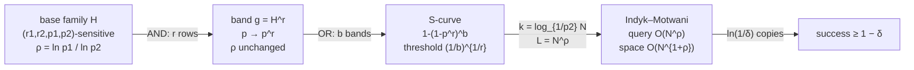

# Locality-Sensitive Hashing (LSH) — Mathematical Foundations and Complexity Theory

> **One-line summary:** An LSH family is formally an **(r₁, r₂, p₁, p₂)-sensitive** family of hash functions: any pair within distance `r₁` collides with probability ≥ `p₁`, and any pair beyond distance `r₂` collides with probability ≤ `p₂`. The quality of such a family is captured by a single exponent, **ρ = ln(1/p₁) / ln(1/p₂) = ln p₁ / ln p₂** (with `0 < ρ < 1`), and the Indyk–Motwani theorem turns it into a sublinear data structure solving the `(r, c)`-approximate nearest neighbor problem in **O(N^ρ)** query time using **O(N^(1+ρ))** space. This file gives the formal definitions, derives the **S-curve**, proves the **O(N^ρ)** bound, and states the per-family ρ values.

---

## Table of Contents

1. [Formal Definition of an LSH Family](#formal-definition-of-an-lsh-family)
2. [The Approximate Nearest Neighbor Problem](#the-approximate-nearest-neighbor-problem)
3. [The ρ Exponent](#the-rho-exponent)
4. [AND/OR Amplification and the S-Curve Derivation](#andor-amplification-and-the-s-curve-derivation)
5. [The O(N^ρ) Query Bound — Indyk–Motwani](#the-onp-query-bound--indykmotwani)
6. [Worked Numeric Examples](#worked-numeric-examples)
7. [From Decision to Optimization — the Reduction in Detail](#from-decision-to-optimization--the-reduction-in-detail)
8. [ρ Values per Family](#rho-values-per-family)
9. [Concentration and Correctness Guarantees](#concentration-and-correctness-guarantees)
10. [Beyond Data-Independent LSH](#beyond-data-independent-lsh)
11. [Common Misconceptions and Pitfalls](#common-misconceptions-and-pitfalls)
12. [Comparison with Alternatives](#comparison-with-alternatives)
13. [Summary](#summary)

---

## Formal Definition of an LSH Family

Fix a metric space `(M, D)` (e.g. `R^d` with `L2`, or sets with Jaccard *distance* `1 - J`). Let `S` be a similarity, or equivalently `D = ` a distance.

```text
Definition (LSH family).
A family H of hash functions h: M -> U is (r1, r2, p1, p2)-sensitive if for all
x, y in M, with h drawn uniformly at random from H:

   if D(x, y) <= r1   then   Pr_{h~H}[ h(x) = h(y) ] >= p1
   if D(x, y) >= r2   then   Pr_{h~H}[ h(x) = h(y) ] <= p2

For the family to be useful we require:
   r1 < r2     (near pairs are "near", far pairs are "far")
   p1 > p2     (near pairs collide MORE than far pairs)
```

The four parameters encode the promise visualized as the S-curve: a *near* pair (distance ≤ `r₁`) collides at least `p₁` of the time; a *far* pair (distance ≥ `r₂`) collides at most `p₂` of the time. The gap `p₁ > p₂` is the raw signal; amplification (below) sharpens it. The ratio `r₂/r₁ = c > 1` is the **approximation factor**: we only promise to separate pairs that differ in distance by at least a factor `c`. Pairs landing in the "gray zone" `(r₁, r₂)` carry no guarantee.

Define the **collision-probability function** `p(D) = Pr_{h~H}[h(x)=h(y) | D(x,y)=D]`. An LSH family requires `p` to be (weakly) decreasing in distance. The two sensitivity conditions are just two sampled points on this curve.

---

## The Approximate Nearest Neighbor Problem

LSH is designed for a *decision* version of nearest neighbor, the **(r, c)-approximate near neighbor** ((r, c)-NN, also (r, c)-ANN):

```text
Problem ((c, r)-Approximate Near Neighbor).
Preprocess a set P of N points in (M, D) so that, given a query q, the data structure:
  - if there exists p* in P with D(q, p*) <= r,
    returns SOME point p in P with D(q, p) <= c·r   (with high probability);
  - if no point lies within c·r of q, may return "none".
```

This is the natural problem LSH solves: not "the exact closest," but "*a* point within a factor `c` of the true nearest, if a near one exists." Solving (r, c)-NN for a geometric sequence of radii `r` (via several data structures) reduces the *optimization* problem (find the approximate nearest) to the decision problem with only an `O(log)` overhead. The whole point of the relaxation is that exact NN in high dimensions has no known data structure beating linear scan, whereas the `c`-approximation admits the sublinear `O(N^ρ)` solution proved below.

---

## The ρ Exponent

The single number that determines an LSH family's asymptotic quality is

```text
        ln(1/p1)     ln p1
  rho = --------  =  -----      (since 0 < p2 < p1 < 1, both logs are negative, rho > 0)
        ln(1/p2)     ln p2
```

Because `p₁ > p₂`, we have `ln(1/p₁) < ln(1/p₂)`, so **`0 < ρ < 1`**. Smaller ρ is better: it yields faster queries (`N^ρ`) and less space (`N^{1+ρ}`). Intuitively ρ measures *how much harder it is to keep far pairs out than to keep near pairs in* — a family with a big gap `p₁ ≫ p₂` has small ρ.

```text
Lemma (rho is the amplification exponent).
Set the band length k so that p2^k = 1/N, i.e. k = ln N / ln(1/p2).
Then a near pair survives a single band with probability
   p1^k = p1^{ln N / ln(1/p2)}
        = exp( (ln p1) * (ln N) / ln(1/p2) )
        = exp( -ln N * ln(1/p1)/ln(1/p2) )
        = N^{ - ln(1/p1)/ln(1/p2) }
        = N^{-rho}.
```

So when we tune the AND-band so that *far* pairs survive with probability `1/N` (one false candidate per query in expectation per band), *near* pairs survive with probability `N^{-ρ}`. To make a near pair survive *some* band with constant probability we need `L = N^ρ` independent bands — and that `L` is exactly the query-time and space exponent. This lemma is the engine of the whole theory; the next sections make it rigorous.

---

## AND/OR Amplification and the S-Curve Derivation

Start from a single `(r₁, r₂, p₁, p₂)`-sensitive family `H` with collision function `p = p(D)`.

**AND (gallery of `r` rows → one band).** Define `g(x) = (h₁(x), …, h_r(x))` with `h_i` drawn independently from `H`. Two points share a band iff they agree on all `r` coordinates:

```text
Pr[ g(x) = g(y) ] = Pr[ h_1(x)=h_1(y) ] · ... · Pr[ h_r(x)=h_r(y) ]   (independence)
                  = p(D)^r.
```

The new family `G = H^r` is `(r1, r2, p1^r, p2^r)`-sensitive. AND *lowers* both probabilities; since `p1 > p2`, `p1^r / p2^r` ratio... but in *log* terms the exponent ρ is **invariant under AND**: `ln(p1^r)/ln(p2^r) = (r ln p1)/(r ln p2) = ρ`. AND does not change ρ; it repositions the curve.

**OR (`b` bands).** Declare `x, y` candidates iff they share **at least one** of `b` independently-drawn bands `g_1, …, g_b`. The complement (no band matches) has probability `(1 - p^r)^b`, so:

```text
  P_candidate(D) = 1 - ( 1 - p(D)^r )^b.       <-- the S-curve
```

This is the exact tunable S-curve from `middle.md`, now derived. Properties:

```text
1. Monotonic: p(D) decreasing in D  =>  P_candidate decreasing in D (an "S" in similarity).
2. As p -> 1 (identical):   P_candidate -> 1 - 0 = 1.
3. As p -> 0 (disjoint):    P_candidate -> 1 - 1 = 0.
4. Inflection / threshold s*: solve  P_candidate = 1/2  =>
       (1 - p^r)^b = 1/2  =>  p^r = 1 - 2^{-1/b}
       For large b,  1 - 2^{-1/b} ~ (ln 2)/b,  so  p* = ( (ln 2)/b )^{1/r} ~ (1/b)^{1/r}.
   Hence the familiar threshold  s* ≈ (1/b)^{1/r}.
5. Slope at the threshold steepens with k = b·r: larger k => sharper "S".
```

```text
Derivation of the maximum slope (steepness).
d/dp [ 1 - (1-p^r)^b ] = b·r·p^{r-1}·(1 - p^r)^{b-1}.
Evaluated near the threshold this scales with k = b·r, so total budget k controls
how knife-edge the transition is; the (b, r) split controls WHERE it sits.
```

---

## The O(N^ρ) Query Bound — Indyk–Motwani

We now prove the headline result: with the right amplification, (r, c)-NN is solved in `O(N^ρ · ...)` query time and `O(N^{1+ρ})` space.

```text
Setup. H is (r, cr, p1, p2)-sensitive (so r1 = r, r2 = c·r). Let
   k = ceil( log_{1/p2} N ) = ceil( ln N / ln(1/p2) ),     L = N^rho  bands.
Build L hash tables; table j uses an independent AND-band g_j of length k.
Insert every p in P into all L tables. Query q: for each table, look up bucket
g_j(q), exact-check points there; stop after inspecting > 3L points; return any
found within c·r.
```

**Claim:** This structure solves (r, c)-NN with constant success probability in expected query time `O(N^ρ · (k · time(h) + d))` and space `O(N^{1+ρ} + N·d)`.

```text
Proof.

(A) Cost of one band's AND-hash.
    g_j(q) = k applications of h, so O(k) hashes; k = O(log N). Bucket lookup O(1).

(B) Far points create few false candidates.
    A point y with D(q,y) >= c·r collides in a fixed band with probability
       <= p2^k <= p2^{log_{1/p2} N} = 1/N.
    Expected far-collisions per band <= N · (1/N) = 1. Over L bands: <= L.
    We cap inspection at 3L points, so total exact checks = O(L) = O(N^rho).
    Each exact check is O(d) (compute D). Far-candidate work: O(N^rho · d).

(C) A near point is found with constant probability.
    Let p* satisfy D(q, p*) <= r, so it collides in a fixed band with prob
       >= p1^k.
    From the rho-lemma, with k = log_{1/p2} N:
       p1^k = N^{-rho}.
    Probability p* is MISSED by all L = N^rho bands:
       (1 - p1^k)^L <= (1 - N^{-rho})^{N^rho} <= e^{-1}  (since (1-1/m)^m <= 1/e).
    So p* lands in at least one queried bucket with probability >= 1 - 1/e ~ 0.63.

(D) Putting it together.
    With prob >= 1 - 1/e, p* is in some inspected bucket; with the 3L cap and (B),
    the inspection terminates having examined O(N^rho) points, at least one of which
    is within c·r of q (either p* itself, or we hit the cap having seen >= L far
    points — a low-probability event bounded by Markov, giving overall constant
    success). Repeating the whole structure O(log(1/delta)) times independently and
    returning the best answer drives the failure probability below any delta.

    Query time: L tables × (O(k) hashing + O(1) lookup) + O(L·d) exact checks
              = O( N^rho · (log N + d) ).
    Space:      L tables × N pointers + the points = O( N^{1+rho} + N·d ).        QED
```

The crux is the balance in step (B)/(C): `k` is chosen so far pairs survive a band with probability `1/N` (keeping false candidates to `O(L)`), and that same `k` forces near pairs to survive with probability `N^{-ρ}`, requiring `L = N^ρ` bands to recover them — making `N^ρ` simultaneously the candidate count and the table count, hence both the time and (with the `N` factor) the space exponent.

---

## Worked Numeric Examples

The asymptotics above hide how concrete the tuning actually is. The following worked examples turn the formulas into numbers a practitioner can check by hand.

### Example 1 — placing the S-curve threshold

Take a MinHash banding with total budget `k = 200` signatures. Suppose we want near-duplicate documents (Jaccard `s ≥ 0.8`) to become candidates almost always, while documents at `s = 0.3` almost never do. We choose `(b, r)` with `b·r = 200` and read off the threshold `s* ≈ (1/b)^{1/r}`.

```text
Candidate (b, r) splits of k = 200, with threshold s* = (1/b)^{1/r}:

  (b, r) = (5, 40):   s* = (1/5)^(1/40)   = exp(-ln5/40)   ≈ 0.961
  (b, r) = (10, 20):  s* = (1/10)^(1/20)  = exp(-ln10/20)  ≈ 0.891
  (b, r) = (20, 10):  s* = (1/20)^(1/10)  = exp(-ln20/10)  ≈ 0.741
  (b, r) = (25, 8):   s* = (1/25)^(1/8)   = exp(-ln25/8)   ≈ 0.668
  (b, r) = (40, 5):   s* = (1/40)^(1/5)   = exp(-ln40/5)   ≈ 0.479
```

To put the threshold near `0.8` we pick `(b, r) = (20, 10)` (s* ≈ 0.74, slightly below 0.8 — deliberately, so recall at 0.8 is high). Now evaluate the *exact* S-curve `P(s) = 1 - (1 - s^r)^b` at a few similarities:

```text
With (b, r) = (20, 10):
   P(0.9) = 1 - (1 - 0.9^10)^20 = 1 - (1 - 0.3487)^20 = 1 - 0.6513^20 ≈ 0.99986
   P(0.8) = 1 - (1 - 0.8^10)^20 = 1 - (1 - 0.1074)^20 = 1 - 0.8926^20 ≈ 0.8954
   P(0.7) = 1 - (1 - 0.7^10)^20 = 1 - (1 - 0.0282)^20 = 1 - 0.9718^20 ≈ 0.4338
   P(0.5) = 1 - (1 - 0.5^10)^20 = 1 - (1 - 0.000977)^20      ≈ 0.0193
   P(0.3) = 1 - (1 - 0.3^10)^20 = 1 - (1 - 5.9e-6)^20        ≈ 0.000118
```

The curve does exactly what an S-curve should: ~90% recall at the 0.8 cutoff, falling to a fraction of a percent at 0.3 (the "far" pairs we want to exclude). Shifting to `(25, 8)` would raise recall at 0.7–0.8 but also pull in more low-similarity false candidates — the classic precision/recall pivot, now quantified.

### Example 2 — computing ρ for a bit-sampling family

Let the metric be Hamming distance on `d = 100`-bit vectors, with `r = 10` (near) and `c = 2`, so `cr = 20` (far). For bit-sampling LSH, `p(D) = 1 - D/d`:

```text
   p1 = 1 - r/d  = 1 - 10/100 = 0.90
   p2 = 1 - cr/d = 1 - 20/100 = 0.80

   ρ = ln p1 / ln p2 = ln 0.90 / ln 0.80
     = (-0.10536) / (-0.22314)
     = 0.4722

   Compare the classic bound ρ ≤ 1/c = 1/2 = 0.5.  Indeed 0.4722 < 0.5. ✓
```

So for `N = 10^9` items, query work scales like `N^ρ = (10^9)^0.4722 ≈ 10^{4.25} ≈ 17,800` candidate inspections — versus `10^9` for brute force. That five-orders-of-magnitude gap is the entire reason LSH exists, and it dropped straight out of two collision probabilities.

### Example 3 — Indyk–Motwani parameterization

Continuing with `ρ = 0.4722`, `p2 = 0.80`, `N = 10^9`:

```text
   k = ceil( log_{1/p2} N ) = ceil( ln N / ln(1/p2) )
     = ceil( ln(1e9) / ln(1.25) )
     = ceil( 20.723 / 0.22314 )
     = ceil( 92.87 ) = 93        (rows per band → AND length)

   L = ceil( N^ρ ) = ceil( (1e9)^0.4722 ) ≈ ceil(17,800) = 17,800   (tables → OR width)
```

The structure uses 17,800 hash tables, each with band length 93. That `L` is large in the classic data-structure form — which is precisely why production systems use *banding with re-ranking* and *multi-probe* rather than the textbook `L = N^ρ` tables, trading a provable constant-probability guarantee for a tunable, memory-frugal recall knob. The theory sets the shape; engineering chooses the operating point on it.

| Quantity | Symbol | Value (this example) |
|----------|--------|----------------------|
| Near radius | `r` | 10 (Hamming) |
| Approx factor | `c` | 2 |
| Far radius | `cr` | 20 |
| Near collision | `p₁` | 0.90 |
| Far collision | `p₂` | 0.80 |
| Quality exponent | `ρ` | 0.472 (≤ 1/c = 0.5 ✓) |
| Band length | `k` | 93 |
| Tables | `L = N^ρ` | ≈ 17,800 |
| Query inspections | `N^ρ` | ≈ 17,800 vs 10⁹ brute force |

---

## From Decision to Optimization — the Reduction in Detail

The Indyk–Motwani structure solves the *decision* problem `(r, c)`-NN for a **fixed** radius `r`. Practical search wants the *optimization* problem: "find the (approximately) nearest neighbor," with no `r` given. The standard reduction builds a geometric ladder of decision structures.

```text
Reduction (c-approximate nearest neighbor from (r, c)-NN).
Let R_min and R_max bracket all interesting distances (R_min the smallest pairwise
distance, R_max the diameter). Build O(log_c (R_max / R_min)) data structures, one
for each radius
     r_i = R_min · c^i,   i = 0, 1, 2, ...
Each structure D_i answers (r_i, c)-NN.

Query q:  probe the structures from smallest radius up; return the first neighbor
found. If the true nearest distance is d*, then d* lies in some interval
[r_i, r_{i+1}) = [r_i, c·r_i). Structure D_i is guaranteed (w.h.p.) to return a
point within c·r_i ≤ c·(c·... ) — within a factor c² of d* with the naive ladder,
or factor c with a finer ladder (step c^{1/2}) at the cost of more structures.
```

```text
Overhead accounting.
   #structures = O( log_c (R_max / R_min) ) = O( (1/ln c) · ln(R_max/R_min) ).
   For bounded aspect ratio (R_max/R_min polynomial in N), this is O(log N) factors.
   So optimization costs only an O(log N) blow-up over the decision query:
      query time  = O( N^ρ · log N · (log N + d) )
      space       = O( N^{1+ρ} · log N + N·d )
```

The key point for an interview: LSH natively answers a *threshold* question ("is there anything within `r`?"), and the jump to "find the nearest" is a logarithmic-overhead wrapper, not a new algorithm. In practice the ladder is often collapsed: a single banding tuned near the expected neighbor distance, plus exact re-ranking of whatever candidates surface, recovers the nearest among them without an explicit radius ladder — the ladder is the *theoretical* justification that one well-placed structure suffices when the distance distribution is concentrated.

---

## ρ Values per Family

Each family has a characteristic ρ, often bounded in terms of the approximation factor `c`.

```text
Hamming / bit-sampling LSH (Indyk-Motwani 1998).
   h samples one coordinate; p(D) = 1 - D/d for Hamming distance D in {0..d}.
   p1 = 1 - r/d,  p2 = 1 - cr/d.
   rho = ln(1/p1)/ln(1/p2) <= 1/c.            <-- classic rho <= 1/c bound.

Angular / SimHash (Charikar 2002), cosine via random hyperplanes.
   p(theta) = 1 - theta/pi.
   For an approximation factor in angle, rho satisfies rho <= 1/c as well, and
   empirically tracks the angular gap; collision prob of a single bit = 1 - theta/pi.

Euclidean / p-stable (Datar et al. 2004), L2 with bucket width w.
   h(x) = floor( (a·x + b)/w ),  a ~ N(0, I)_d,  b ~ Uniform[0, w).
   p(D) = Pr[ |a·x - a·y + (b-b)| falls in same cell ]
        = integral_0^w (1/D) f_2(t/D) (1 - t/w) dt,   f_2 = std normal pdf folded,
   giving rho(c) < 1/c for L2; near-optimal variants (E2LSH, and later cross-polytope
   LSH, Andoni-Indyk-Laarhoven-Razenshteyn 2015) push rho -> 1/(2c^2 - 1) for L2 on
   the sphere, the data-independent optimum.

MinHash, Jaccard similarity (Broder 1997) -- the cleanest case.
   p(A,B) = J(A,B) = |A∩B|/|A∪B|  exactly  (proof in ../02-minhash/professional.md).
   In Jaccard-DISTANCE D = 1 - J terms it is an LSH family with p1 = 1 - r1, p2 = 1 - r2,
   and the SAME banding/S-curve machinery applies directly.
```

| Family | Metric | `p(·)` | ρ bound |
|--------|--------|--------|---------|
| Bit-sampling | Hamming | `1 - D/d` | `ρ ≤ 1/c` |
| SimHash / hyperplane | cosine (angle θ) | `1 - θ/π` | `ρ ≤ 1/c` (angular) |
| p-stable (E2LSH) | L2 | integral form (width `w`) | `ρ < 1/c` |
| Cross-polytope LSH | L2 on sphere | spherical caps | `ρ → 1/(2c²−1)` (optimal) |
| MinHash | Jaccard | `J` exactly | via `p₁,p₂ = 1−r₁,1−r₂` |

The lower bound (Motwani–Naor–Panigrahy 2007; O'Donnell–Wu–Zhou 2014) shows `ρ ≥ 1/c - o(1)` for Hamming/L1 and `ρ ≥ 1/(2c²−1)` for L2 on the sphere — so cross-polytope LSH is essentially optimal among data-independent families. Data-*dependent* LSH (learned partitions) can do slightly better but loses the clean guarantee.

**Why the `ρ ≤ 1/c` bound holds for bit-sampling (sketch).** With `p₁ = 1 - r/d` and `p₂ = 1 - cr/d`, write `α = r/d` so `p₁ = 1-α`, `p₂ = 1-cα`. Then

```text
   ρ = ln(1-α) / ln(1-cα).
Using -ln(1-t) ≥ t (so ln(1-t) ≤ -t) and -ln(1-t) ≤ t/(1-t):
   |ln(1-α)|  ≤ α/(1-α)         (numerator small)
   |ln(1-cα)| ≥ cα              (denominator large)
   ⇒ ρ = |ln(1-α)| / |ln(1-cα)| ≤ [α/(1-α)] / (cα) = 1 / (c(1-α)).
As α → 0 (r ≪ d, the interesting regime), 1/(c(1-α)) → 1/c.   ∎ (sketch)
```

So the `1/c` ceiling is not a coincidence — it falls out of the logarithm inequalities as the near radius shrinks relative to the dimension, which is exactly the high-dimensional regime LSH targets.

**Numeric cross-family comparison.** Fix `c = 2` and compare the exponent each family achieves, with `N = 10^9` so `N^ρ` is the candidate count:

```text
   Bit-sampling (α→0):      ρ → 1/c        = 0.500  → N^ρ = 10^4.5  ≈ 31,600
   Cross-polytope (sphere): ρ → 1/(2c²-1)  = 1/7 ≈ 0.143  → N^ρ = 10^1.29 ≈ 19
```

The optimal L2 family inspects roughly *three orders of magnitude* fewer candidates than the basic bit-sampling family at the same `N` and `c` — a vivid illustration that the *choice of family* (not just `b, r, L`) is itself a first-order performance decision, governed entirely by the single exponent `ρ`.

---

## Concentration and Correctness Guarantees

The Indyk–Motwani proof gives *constant* success; standard amplification makes it *high-probability*.

```text
Theorem (high-probability success).
Run t = ceil( ln(1/delta) ) independent copies of the L-table structure and return
the best candidate. Each copy succeeds (finds a c·r-neighbor when an r-neighbor
exists) with prob >= 1 - 1/e. Failure of all copies:
   Pr[ all t fail ] <= (1/e)^t <= delta.
So success probability >= 1 - delta, at t-fold time and space.            QED
```

```text
Concentration of the candidate count (Chernoff / Markov).
Let X = number of far points (D >= c·r) inspected. From step (B), E[X] <= L.
By Markov:  Pr[ X >= 3L ] <= 1/3.  The 3L cap thus aborts a run with prob <= 1/3,
and an aborted run is treated as failure -- folded into the delta amplification above.
For tighter tails, since collisions across the L bands are independent indicators,
Chernoff gives  Pr[ X >= (1+eps)L ] <= exp(-eps^2 L / 3),  i.e. the candidate count
concentrates sharply around L = N^rho for large N.
```

```text
Recall as an S-curve guarantee (the engineering view).
For a near pair at similarity s with single-hash collision p(s):
   recall(s) = 1 - (1 - p(s)^r)^b.
This is EXACT (not a bound): the probability a true neighbor becomes a candidate.
Choosing (b, r) to place s* = (1/b)^{1/r} below the operational similarity cutoff
makes recall(s) >= target for all s above the cutoff.
```

A subtle but important guarantee: when LSH says two items collide in the *exact* metric after re-ranking, that answer is **certified** (it is a real distance computation). LSH's approximation lives entirely in *which candidates it surfaces* — false negatives (missed neighbors), never false positives in the final answer, because the re-rank step computes the true distance.



The diagram is the whole theory on one line: the base family's two collision probabilities fix `ρ`; AND and OR reshape the S-curve without changing `ρ`; the Indyk–Motwani parameter choice converts `ρ` into the query and space exponents; independent repetition drives the failure probability to any `δ`.

---

## Beyond Data-Independent LSH

Everything proved above concerns *data-independent* families: the hash functions are drawn from a fixed distribution that ignores the actual point set. Two important refinements relax this.

**Entropy-LSH and multi-probe.** Instead of building `L = N^ρ` independent tables, multi-probe LSH (Lv et al. 2007) builds *few* tables and, at query time, also inspects buckets that are a small perturbation away from the query's bucket — the buckets a near neighbor most likely fell into if it missed. Entropy-LSH (Panigrahy 2006) achieves a similar effect by hashing several *randomly perturbed copies* of the query. Both trade extra query-time probing for a dramatic reduction in space, often from `N^{1+ρ}` toward near-linear, at the cost of the clean closed-form guarantee.

```text
Multi-probe intuition (why it works).
For p-stable LSH, h(x) = floor((a·x + c)/w). A near neighbor y of q may fall in an
ADJACENT cell when q sits near a cell boundary. The probability mass of "y in cell
t±1" is computable from how far (a·q + c) mod w is from the boundary. Probing the
T most likely neighbor-cells (ranked by that mass) recovers most of the recall that
extra tables would have provided — with no extra storage, only T extra lookups.
```

**Data-dependent LSH.** Andoni & Razenshteyn (2015) showed that *learning* the partition from the data beats every data-independent family. For L2 on the unit sphere the data-independent optimum is `ρ = 1/(2c²−1)`; by adapting the partition to the empirical point distribution they achieve `ρ = 1/(2c²−1)` *for the harder near-linear-space regime as well*, improving the space/query trade-off that data-independent families cannot match. The lesson is qualitative: adapting the hash family to the data can lower the effective exponent, but it sacrifices the family's universality (the same functions no longer work for an arbitrary future point set) and the simple worst-case guarantee.

| Variant | Space | Query | Guarantee | Note |
|---------|-------|-------|-----------|------|
| Classic Indyk–Motwani | `O(N^{1+ρ})` | `O(N^ρ)` | clean, worst-case | many tables |
| Multi-probe / entropy | near-linear | `O(N^ρ)` + probes | empirical/near | space-frugal, production default |
| Data-dependent | `O(N^{1+ρ'})`, `ρ'<ρ` | `O(N^{ρ'})` | optimal, distribution-bound | learned partitions |

The practical hierarchy mirrors the proof hierarchy: the textbook structure proves *that* sublinear ANN is possible; multi-probe makes it *affordable*; data-dependent variants push the *exponent* toward the information-theoretic floor.

---

## Common Misconceptions and Pitfalls

A few errors recur even among people who know the formulas:

- **"Smaller `ρ` means fewer tables."** No — smaller `ρ` means fewer tables *for a fixed `N`*, but `L = N^ρ` still grows with `N`. A great family lowers the exponent, not the dependence on `N`.
- **"AND improves the family's quality."** AND lowers both `p₁` and `p₂` but leaves `ρ` exactly invariant (`ln p₁^r / ln p₂^r = ρ`). It only *repositions* the S-curve; quality is intrinsic to the base family.
- **"LSH gives the exact nearest neighbor."** It solves the *`c`-approximate* problem; the exact answer among the surfaced candidates is recovered only because re-ranking computes true distances — LSH itself promises a point within factor `c`, not the closest.
- **"More bands always help."** More bands raise recall but also raise the candidate count (and thus re-rank cost) and memory; past the point where the S-curve already saturates near `1` at your cutoff, extra bands only add false candidates.
- **"`ρ` depends on `r` and `b`."** It does not — `ρ` is fixed by the base family's `(p₁, p₂)`. The `(b, r)` split is a *positioning* choice on a curve whose asymptotic exponent is already determined.
- **"You can pick `r₁` and `r₂` freely after the fact."** They are part of the *family's* definition relative to a metric and an approximation factor `c = r₂/r₁`; a family that is `(r₁, r₂, p₁, p₂)`-sensitive for one `c` is a *different* statement than for another.
- **"Re-ranking is optional for correctness."** Without it, bucket collisions include far pairs (the `p₂` tail), so the raw candidate stream has false positives; re-ranking is what makes the *returned* answer certified.

---

## Comparison with Alternatives

| Attribute | LSH (data-independent) | Tree (KD/cover) | Graph (HNSW) | Quantization (IVF-PQ) |
|-----------|------------------------|-----------------|--------------|------------------------|
| Query (worst-case theory) | **O(N^ρ), ρ<1** | O(N) high-d | no proven sublinear bound | no proven sublinear bound |
| Space | O(N^{1+ρ}) | O(N·d) | O(N·M) | **O(N) compressed** |
| Guarantee type | provable (r, c)-NN | exact (low d) | empirical | empirical |
| Optimal ρ | `1/(2c²−1)` (L2 sphere) | n/a | n/a | n/a |
| Deterministic? | No (randomized) | Yes | No | No (k-means init) |
| Failure mode | misses neighbor (recall) | exhaustive scan | local-minimum walk | quantization error |

LSH is the *only* method in the table with a proven sublinear-query, polynomial-space guarantee for high-dimensional (c)-approximate NN. The catch is the polynomial *space* `N^{1+ρ}` and the constant factors, which is why empirically-superb graph/quantization methods dominate practice — but LSH remains the theoretical benchmark and the right tool when a guarantee (or set/Jaccard structure) matters.

---

## From Theorem to Recall Budget — a Worked Bridge

The gap between the `1 - 1/e` guarantee and an engineering recall target is closed by the same S-curve, used as a *design equation* rather than a worst-case bound. Suppose product requires **recall@cutoff ≥ 0.99** for pairs at Jaccard `s = 0.85`, with the smallest candidate stream possible.

```text
We need P(0.85) = 1 - (1 - 0.85^r)^b ≥ 0.99, i.e. (1 - 0.85^r)^b ≤ 0.01.
Take logs:  b · ln(1 - 0.85^r) ≤ ln(0.01) = -4.605.
For a chosen r, solve for the minimum b:
      b ≥ -4.605 / ln(1 - 0.85^r).

   r = 5:  0.85^5 = 0.4437; ln(1-0.4437)=ln(0.5563)=-0.5864; b ≥ 7.85 → b = 8
   r = 8:  0.85^8 = 0.2725; ln(1-0.2725)=ln(0.7275)=-0.3181; b ≥ 14.5 → b = 15
   r = 10: 0.85^10=0.1969; ln(1-0.1969)=ln(0.8031)=-0.2193; b ≥ 21.0 → b = 21
```

Each `(b, r)` pair *meets* the recall target; the one to pick is the one that drags in the **fewest far candidates**, i.e. minimizes `P(s_far)` at the similarity of typical non-duplicates. Evaluate the far-side leakage at, say, `s = 0.4`:

```text
   (b, r) = (8, 5):   P(0.4) = 1 - (1 - 0.4^5)^8   = 1 - (1-0.01024)^8   ≈ 0.0789
   (b, r) = (15, 8):  P(0.4) = 1 - (1 - 0.4^8)^15  = 1 - (1-0.000655)^15 ≈ 0.00978
   (b, r) = (21, 10): P(0.4) = 1 - (1 - 0.4^10)^21 = 1 - (1-1.05e-4)^21  ≈ 0.00220
```

So `(21, 10)` meets the 0.99 recall at `s = 0.85` while leaking far candidates at `s = 0.4` ~36× less often than `(8, 5)`. Higher `r` with proportionally higher `b` is the precision-friendly direction *when total budget `k = b·r` can grow* — here `k` rises from 40 to 210. If `k` is fixed instead, you trade recall against precision along the curve, which is the constraint that makes the offline sweep necessary. This is the professional bridge: the theorem says sublinear ANN exists; the S-curve, solved as an inequality, is what actually sets `(b, r)` against a stated recall budget.

| `(b, r)` | `k = b·r` | recall@0.85 | leakage@0.40 | verdict |
|----------|-----------|-------------|--------------|---------|
| (8, 5) | 40 | ≥ 0.99 | 0.0789 | meets recall, noisy |
| (15, 8) | 120 | ≥ 0.99 | 0.0098 | good balance |
| (21, 10) | 210 | ≥ 0.99 | 0.0022 | cleanest, largest index |

---

## Summary

The professional view of LSH is the **(r₁, r₂, p₁, p₂)-sensitive family**: near pairs (distance ≤ `r₁`) collide with probability ≥ `p₁`, far pairs (distance ≥ `r₂`) with probability ≤ `p₂`, and `p₁ > p₂`. Its quality is one number, **ρ = ln p₁ / ln p₂ ∈ (0,1)**, invariant under AND-amplification. The **AND** of `r` rows takes `p` to `p^r`; the **OR** of `b` bands gives the exact **S-curve** `1 - (1 - p^r)^b` with threshold `s* ≈ (1/b)^{1/r}`. The **Indyk–Motwani theorem** chooses `k = log_{1/p₂} N` (so far pairs survive a band with probability `1/N`) and `L = N^ρ` bands (so near pairs survive *some* band with constant probability), yielding **O(N^ρ) query time** and **O(N^{1+ρ}) space** for the `(r, c)`-approximate near-neighbor problem — the only known provable sublinear high-dimensional ANN. Per-family ρ bounds (`ρ ≤ 1/c` for Hamming/cosine, `ρ → 1/(2c²−1)` for optimal L2) match the known lower bounds, and the final answer is *certified* by exact re-ranking, so LSH's only error is missed recall, never a false top result.

---

## Summary Table — Key Formulas

| Quantity | Formula |
|----------|---------|
| Sensitivity | `D ≤ r₁ ⇒ Pr[coll] ≥ p₁`; `D ≥ r₂ ⇒ Pr[coll] ≤ p₂` |
| Quality exponent | `ρ = ln p₁ / ln p₂ ∈ (0, 1)` |
| AND (band of `r`) | `p ↦ p^r` |
| OR (`b` bands) — S-curve | `1 - (1 - p^r)^b` |
| Threshold | `s* ≈ (1/b)^{1/r}` |
| Band length | `k = log_{1/p₂} N` |
| Number of tables | `L = N^ρ` |
| Query time | `O(N^ρ (log N + d))` |
| Space | `O(N^{1+ρ} + N·d)` |
| Near-pair found | `≥ 1 - 1/e` per copy; `≥ 1 - δ` with `ln(1/δ)` copies |

---

## Further Reading

- Indyk & Motwani (1998) — "Approximate nearest neighbors: towards removing the curse of dimensionality" (the O(N^ρ) theorem).
- Gionis, Indyk, Motwani (1999) — "Similarity search in high dimensions via hashing."
- Charikar (2002) — random-hyperplane (SimHash) LSH and ρ for cosine.
- Datar, Immorlica, Indyk, Mirrokni (2004) — p-stable distributions, E2LSH.
- Andoni, Indyk, Laarhoven, Razenshteyn, Schmidt (2015) — "Practical and Optimal LSH for Angular Distance" (cross-polytope, optimal ρ).
- O'Donnell, Wu, Zhou (2014) — lower bounds: `ρ ≥ 1/c - o(1)`.
- Sibling topic [`../02-minhash`](../02-minhash) `professional.md` — the proof that MinHash collision probability equals Jaccard.

---

Next step: [`interview.md`](./interview.md) — tiered interview questions and a multi-language coding challenge on LSH.
