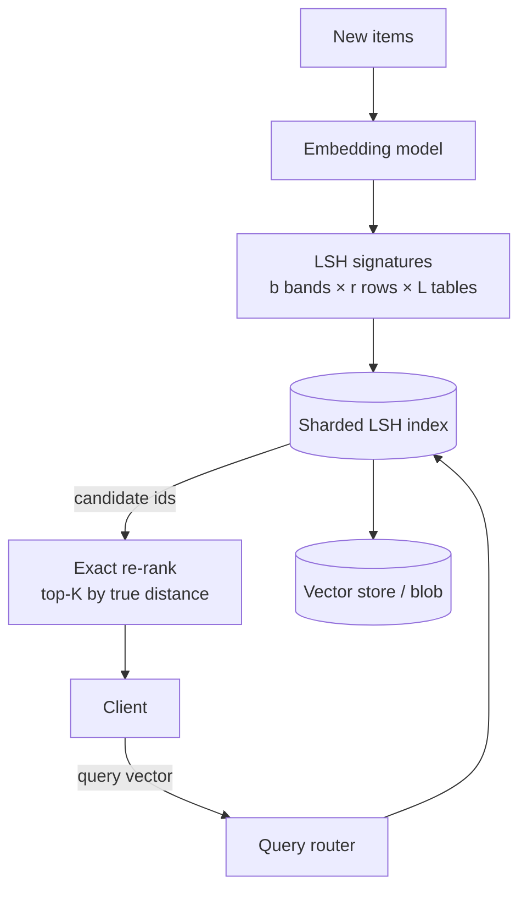
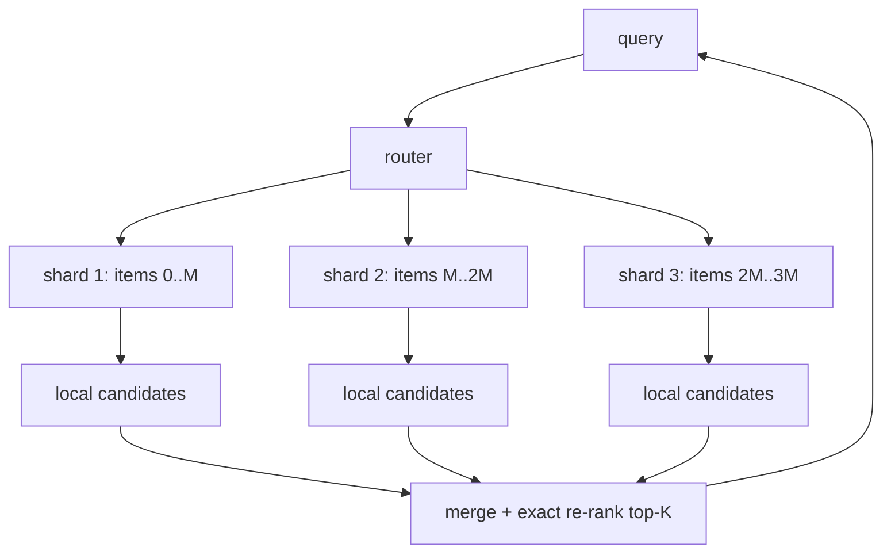
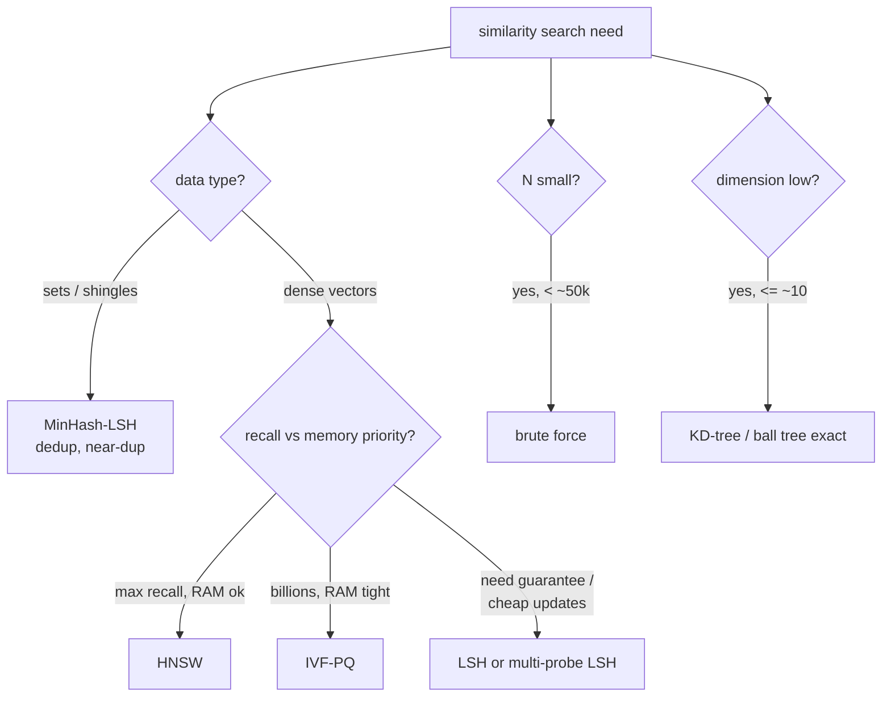
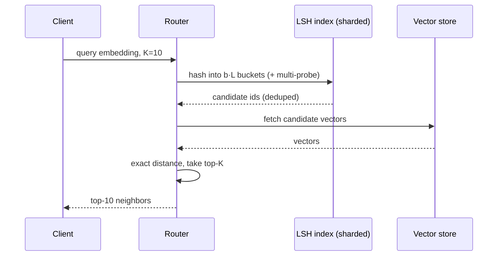

# Locality-Sensitive Hashing (LSH) — Senior Level

> **One-line summary:** At scale, LSH is one option among several for **approximate nearest-neighbor (ANN)** serving over hundreds of millions of vectors. The senior job is choosing it (or not) against **HNSW** and **IVF**, sizing the index for a **memory / recall / latency** budget, sharding it across machines, keeping it fresh under writes, and squeezing recall out of fewer tables with **multi-probe**. LSH wins on simplicity, easy incremental updates, set/Jaccard data (dedup), and provable guarantees; graph indexes usually win the raw recall-vs-latency race on dense vectors.

---

## Table of Contents

1. [Introduction](#introduction)
2. [System Design with LSH](#system-design-with-lsh)
3. [Capacity Planning and Back-of-Envelope Sizing](#capacity-planning-and-back-of-envelope-sizing)
4. [Distributed and Sharded LSH](#distributed-and-sharded-lsh)
5. [Memory / Recall / Latency Trade-offs](#memory--recall--latency-trade-offs)
6. [Multi-Probe at Scale](#multi-probe-at-scale)
7. [Comparison with HNSW and IVF](#comparison-with-hnsw-and-ivf)
8. [Architecture Patterns](#architecture-patterns)
9. [Index Freshness and Reindexing](#index-freshness-and-reindexing)
10. [Code Examples](#code-examples)
11. [Observability](#observability)
12. [Failure Modes](#failure-modes)
13. [Summary](#summary)

---

## Introduction

> Focus: "How to architect a similarity-search system around LSH?"

You are building a service that answers "give me the `K` most similar items" over 100M–10B vectors — semantic search over embeddings, a recommendation candidate generator, or a deduplication pipeline. The math from `middle.md` (the S-curve, banding, families) is settled; the senior problems are operational:

- **Which index?** LSH, IVF, HNSW, or a hybrid. The answer depends on dimensionality, the metric, the recall target, the write rate, and the memory you can afford.
- **How big?** `L` tables × `k` hashes × `N` items must fit your RAM budget while hitting the recall SLA at the latency SLA.
- **How fresh?** Embeddings change; items are added and deleted continuously. LSH's easy incremental insert is a real advantage here.
- **How distributed?** 10B vectors do not fit one box; you shard, fan out, and merge.

This file treats LSH as a *production subsystem*, compares it honestly against the graph and quantization indexes that often beat it today, and shows where it still shines: deduplication and set similarity (MinHash-LSH), streaming inserts, and any setting where you want a tunable, theoretically-grounded recall knob.

A recurring theme: the senior value-add is **honesty about trade-offs**. A junior reaches for the algorithm they know; a senior states the constraints, computes the footprint, names the alternative that might be better, and only then commits — with a recall canary in place to catch the day the assumptions stop holding. LSH is a tool with a clear sweet spot, not a default; treating it that way is the difference between a system that scales and one that quietly rots.

---

## System Design with LSH

A typical vector-search service has four layers: an **embedding** stage (turn raw items into vectors), an **index build** stage, an **online query** path, and a **re-rank** stage that computes exact distances on candidates.



The LSH index returns **candidate ids** only; the exact vectors live in a separate store (RAM, SSD, or a columnar blob). Re-ranking fetches the candidate vectors and computes true cosine/Jaccard/L2 to pick the final top-`K`. Keeping the index (just ids + bucket keys) separate from the heavy vectors keeps the hot path small.

The separation also lets the two halves scale independently: the *index* (ids + bucket maps) is small enough to fit in RAM on each shard, while the *vectors* (potentially hundreds of GB of floats) can live on SSD, in a memory-mapped file, or in a compressed columnar store fetched only for the handful of candidates a query produces. This is why LSH pairs naturally with a "fan-out-then-fetch" design: hash cheaply in RAM, fetch a few heavy vectors at the end.

---

## Capacity Planning and Back-of-Envelope Sizing

Before choosing an index type, estimate the resource footprint. Suppose `N = 200M` items, `d = 256`-dim float32 embeddings, banded LSH with `b = 16` bands and `L = 4` tables (so each item sits in `b·L = 64` buckets).

```text
Raw vectors:   N · d · 4 bytes = 200e6 · 256 · 4 = ~205 GB   (lives in the vector store)
Index entries: each item appears in b·L = 64 buckets, each entry ~ 8-byte id + overhead.
   index postings ≈ N · 64 · 8 bytes = 200e6 · 512 ≈ ~102 GB
   plus bucket-key map overhead (one hash table per (band, table)).
```

Two immediate conclusions: (1) the **index alone** (~100 GB) does not fit one commodity box, so you shard; (2) chasing recall by raising `L` from 4 to 16 would *quadruple* the index to ~400 GB — this is the memory pressure that pushes teams toward multi-probe (recall without more tables) or IVF-PQ (compress the vectors). Always do this arithmetic first; it usually decides the index type before any benchmark runs.

```text
Throughput check. Target 10k QPS, p99 < 50 ms.
   Per query: hash into b·L buckets (cheap) + fetch & score C candidates (C·d flops + C vector fetches).
   If C ≈ 2000 candidates and each score is 256 mults, that is ~0.5M flops/query — trivial CPU.
   The real cost is the C vector FETCHES from the store; keep candidates small (raise r) or cache hot vectors.
```

The dominant cost in a tuned LSH service is almost never the hashing — it is fetching and scoring candidates. Shrinking the candidate set (more rows `r`, multi-probe instead of more tables) is usually the highest-leverage latency optimization.

---

## Distributed and Sharded LSH

Two sharding strategies, with very different trade-offs:

**1. Shard by item (document-partitioned).** Each shard holds a slice of the `N` items and a *full* LSH index over its own slice. A query fans out to **all** shards, each returns its local candidates, and the router merges and re-ranks. Simple, balances storage, scales writes — but every query hits every shard (fan-out cost grows with shard count).

**2. Shard by band/table (term-partitioned).** Each shard owns some of the `b·L` band-tables for *all* items. A query only contacts the shards holding its query's band buckets. Less fan-out, but hot buckets create hot shards and re-ranking still needs the vectors gathered.

In practice **shard-by-item** dominates for ANN because it parallelizes cleanly and tolerates skew. Use a consistent-hash ring on item id so adding capacity moves minimal data.

**Cross-shard top-K merge.** With shard-by-item, each shard returns its local top-`K` (already re-ranked locally), and the router does a final `K`-way merge to produce the global top-`K`. This is correct *only if each shard returns at least `K` candidates*; under-returning shards can drop a true global neighbor. The fix is to have each shard return a slightly larger local `K' > K` (over-fetch) so the merge has enough material. Over-fetch factor is another recall knob: bigger `K'` = higher merged recall, more network and merge cost. Budget it like everything else — measure merged recall against a single-node brute-force oracle on a sampled corpus.

**Replication for availability.** Each shard is replicated; reads can go to any replica (LSH queries are read-only and idempotent), and the consistent-hash ring routes around a failed replica. Because LSH inserts are cheap and local, replicas stay in sync via the same write stream — no expensive index rebuild on replica promotion, unlike trained indexes.



| Strategy | Query fan-out | Write cost | Skew risk | Best for |
|----------|---------------|------------|-----------|----------|
| Shard by item | All shards | Local | Low | General ANN, dedup |
| Shard by band | Few shards | All band-shards | High (hot buckets) | Very read-heavy, stable data |

A practical hybrid for very large fleets: shard by item into *groups* of shards, and route a query first to a coarse layer that prunes obviously-irrelevant groups (e.g. by a single short LSH prefix), then fan out only within the surviving group. This caps fan-out at the group size instead of the total shard count, trading a small recall risk at the coarse layer for a large reduction in tail latency — essentially applying LSH's own filtering idea recursively to the routing problem.

---

## Memory / Recall / Latency Trade-offs

The three quantities trade against each other through `(b, r, L)` and multi-probe depth.

- **Memory.** Each item is inserted into `L` tables. Index memory ≈ `N · L · (id + bucket-key overhead)`, *plus* the vectors themselves in the store. More `L` = more recall but linearly more index memory. This is LSH's classic weakness vs graph indexes: to reach high recall on dense vectors, LSH often needs many tables, blowing up memory.
- **Recall.** Rises with `b` (more bands), with `L` (more tables), and with multi-probe depth. Falls as `r` grows (longer bands, higher threshold).
- **Latency.** Driven by (1) hashing the query into `b·L` buckets, (2) the number of **candidates** gathered, and (3) the exact re-rank cost over those candidates (`candidates · d`). Bigger candidate sets = higher recall but slower.

**The senior move:** fix the recall SLA (say recall@10 ≥ 0.95) and the p99 latency SLA, then find the cheapest `(b, r, L, probes)` that satisfies both on held-out queries. Plot recall vs candidates/N (selectivity) — every point is a latency cost. Multi-probe shifts the whole curve favorably (more recall per table), so it is usually the first lever.

A concrete reading of the trade-off triangle: you cannot maximize all three at once. Pushing recall up (more `b`/`L`/probes) raises *either* memory (more tables) *or* latency (more candidates/probes). Cutting latency (raise `r`, cap candidates) costs recall. Cutting memory (fewer tables) costs recall unless multi-probe compensates with latency. The art is finding the corner of this triangle your SLAs allow — and recognizing when *no* corner works, which is the honest signal to switch index types (IVF-PQ for a memory wall, HNSW for a recall-vs-latency wall).

| Lever | Recall | Memory | Latency | Notes |
|-------|--------|--------|---------|-------|
| ↑ `b` (bands) | ↑ | ↑ | ↑ | more candidates |
| ↑ `r` (rows) | ↓ | – | ↓ | purer buckets |
| ↑ `L` (tables) | ↑ | ↑↑ | ↑ | linear memory cost |
| ↑ multi-probe depth | ↑ | – | ↑ (mild) | recall without memory |
| ↑ `K` re-rank cap | ↑ slightly | – | ↑ | exact-scan cost |

In short: `b` and `L` and probes buy recall (paying memory or CPU); `r` and the candidate cap buy precision and a latency ceiling (paying recall). There is no knob that improves all three axes at once — which is exactly why the offline tuning sweep, not intuition, decides the final configuration.

---

## Multi-Probe at Scale

Multi-probe is the difference between LSH being memory-practical or not. Instead of `L = 20+` tables, you can often hit the same recall with `L = 4–8` tables by probing each table's near-miss buckets.

Implementation at scale:

- **Perturbation sequence:** for each table, generate a ranked list of bucket perturbations (which rows to "flip") ordered by how likely a true neighbor landed there. For p-stable LSH, order by how close `(a·x + c)/w` was to a bucket boundary; for hyperplane LSH, order by smallest `|x·r|` (least-confident bits).
- **Probe budget:** cap total probes per query (e.g., 50) and stop early once enough candidates are gathered. This bounds latency.
- **Adaptive probing:** probe more for queries whose initial bucket is sparse, fewer for dense ones — keeps recall uniform across queries.
- **Early termination:** once the candidate set crosses a target size (enough to satisfy recall@K with margin), stop probing — bounds the worst-case query cost regardless of how sparse the query's region is.
- **Per-table probe budgets:** allocate the global probe budget across tables proportionally to how confident each table's boundary bits are, rather than splitting evenly — squeezes more recall from the same budget.

The implementation cost is the perturbation generator: a small priority queue over bit-flip combinations ordered by estimated miss probability. It runs entirely in the index layer (no vector fetches), so it is cheap; the heavy work still only happens for the candidates it surfaces. This is why multi-probe is the default first move when memory is tight — it converts spare CPU into recall without touching the storage footprint.

The payoff: multi-probe LSH with a handful of tables can approach the recall of plain LSH with dozens of tables at a fraction of the memory, which is exactly what makes LSH viable next to IVF/HNSW.

**Worked tuning example.** Suppose plain banded LSH needs `L = 20` tables to hit recall 0.95, costing `20·N` index postings. Multi-probe with `L = 4` tables and a probe budget of 16 per table often reaches the same 0.95 — cutting index memory 5x while adding only ~16 extra cheap bucket lookups per query (no extra vector fetches until a candidate is actually found). The trade is "a little more CPU per query" for "a lot less RAM," which is almost always the right direction at scale, where RAM is the binding constraint. Tune the probe budget the same way you tune `L`: sweep it against recall on held-out queries and stop at your SLA.

---

## Comparison with HNSW and IVF

This is the central senior decision. All three are ANN indexes; they differ in structure and where they win.

**HNSW (Hierarchical Navigable Small World)** — a multi-layer proximity graph. Search greedily walks toward the query through neighbor links. Excellent recall-vs-latency on dense vectors, the de-facto default in vector databases. Cost: higher memory (graph edges), slower build, harder to delete from.

**IVF (Inverted File / coarse quantization)** — cluster all vectors with k-means into `nlist` cells; a query probes the `nprobe` nearest cells and scans their members (often with PQ compression). Great memory/recall balance at billion scale (FAISS IVF-PQ), tunable via `nprobe`. Cost: needs training (k-means), cluster imbalance, periodic retraining.

**LSH** — hashing into buckets, as covered. Simplest to implement and update, strong theoretical guarantees, natural fit for **set/Jaccard** data (MinHash-LSH), but typically needs more memory than HNSW/IVF to reach the same recall on **dense** vectors.

| Attribute | LSH | HNSW | IVF (+PQ) |
|-----------|-----|------|-----------|
| Index structure | hash tables | proximity graph | k-means cells + codes |
| Recall@latency (dense) | good | **best** | very good |
| Memory | high (many tables) | high (edges) | **low** (PQ codes) |
| Build cost | **low** | high | medium (train) |
| Incremental insert | **easy** | medium | medium |
| Delete | **easy** | hard (tombstones) | medium |
| Set / Jaccard data | **native (MinHash)** | awkward | awkward |
| Theoretical guarantee | **yes (O(N^ρ))** | empirical | empirical |
| Tuning knobs | b, r, L, probes | M, efSearch | nlist, nprobe, PQ |

**Choose LSH when:** the data is **sets** (dedup, near-duplicate documents → MinHash-LSH is unmatched); you need cheap **streaming inserts/deletes**; you want a provable approximation guarantee; or the dataset is huge and you value operational simplicity over the last few points of recall.

**Choose HNSW when:** dense embeddings, high recall + low latency are paramount, and memory/build cost are acceptable. This is the common default for semantic vector search.

**Choose IVF-PQ when:** billions of dense vectors must fit limited RAM; PQ compression and `nprobe` tuning give the best memory-for-recall trade.

**Hybrid:** many systems use LSH/MinHash as a *coarse dedup or blocking* stage feeding an HNSW/IVF re-ranker, getting cheap recall up front and sharp ranking after.

**Concrete production patterns where LSH is the right call:**

- **Web-scale near-duplicate detection.** Google's classic SimHash deployment fingerprints each crawled page into a 64-bit code and uses LSH banding over the bits to cluster near-duplicates among billions of pages — a problem where the *set/hamming* structure and the sheer scale favor hashing over graphs.
- **Document deduplication for training corpora.** MinHash-LSH is the standard tool for de-duplicating massive text datasets (filtering near-identical documents before model training): shingle, MinHash, band into candidate clusters, exact-Jaccard confirm. The blocking step turns an impossible `O(N²)` comparison into a tractable one.
- **Audio / image fingerprinting.** Perceptual hashes plus LSH find re-encoded or lightly-edited copies of media at scale, where exact match fails and full pairwise comparison is infeasible.
- **Candidate generation in recommenders.** LSH over user/item embeddings produces a recall-heavy candidate pool cheaply, which a heavier ranker then scores — the classic two-stage funnel.

In each case the deciding factors are the *same*: huge `N`, a similarity that LSH families capture cleanly (Jaccard/Hamming/cosine), tolerance for approximation, and a need for simple incremental updates.

---

## Choosing the Index — a Senior Decision Flow

The single most common senior interview/design question is "which ANN index?" Here is the reasoning, not a memorized answer:



Walk it explicitly in a design review: state `N`, the dimension, the metric, the recall SLA, the write rate, and the memory budget — those five numbers pick the index. LSH lands at the bottom-right: when you need a provable guarantee, when updates are frequent, or when the data is set-shaped. For pure dense-vector serving with generous RAM, be honest that HNSW usually wins; the senior signal is knowing *when not* to reach for LSH.

---

## Architecture Patterns



**Blocking pattern for dedup.** For near-duplicate detection over billions of documents, MinHash-LSH acts as a **blocker**: it groups documents into candidate clusters (those sharing any band bucket), and only within-block pairs are compared exactly. This converts an `O(N²)` all-pairs problem into `O(N · avg-block-size)`. Choose `(b, r)` so the S-curve threshold sits just below your duplicate cutoff to avoid missing near-dups.

**Caching the hot path.** Because re-rank work is dominated by *fetching* candidate vectors, an LRU cache of recently-fetched vectors (or keeping the hottest fraction of vectors resident in RAM while the long tail lives on SSD) directly cuts p99. Pair this with a per-bucket candidate cap so a single oversized bucket cannot blow the latency budget — the cap trades a sliver of recall for a hard latency ceiling, which is the right call for user-facing serving.

| Knob | Lever for | Cost |
|------|-----------|------|
| `b` (bands) / `L` (tables) | recall | index memory |
| `r` (rows) / `k` | precision (smaller candidate sets) | recall risk |
| multi-probe budget | recall | per-query CPU |
| per-bucket candidate cap | latency ceiling | small recall loss |
| vector cache size | p99 latency | RAM |

**Two-stage retrieval.** LSH/MinHash generates a large recall-heavy candidate set cheaply; a precise model (cross-encoder, exact distance, or HNSW) re-ranks. Common in search and recommendation.

---

## Index Freshness and Reindexing

LSH's biggest operational advantage over graph indexes is how gracefully it handles change.

- **Inserts** are trivial: compute the new item's `b·L` band keys and append its id to those buckets. No rebalancing, no graph surgery — `O(b·r·d)` work, lock only the touched buckets. Contrast HNSW, where an insert must wire the new node into the proximity graph.
- **Deletes** use tombstones: mark the id deleted, filter it out at query time, and physically remove it during periodic compaction. HNSW deletion is genuinely hard (removing a node can disconnect the graph), so teams often accumulate tombstones and rebuild — LSH avoids that.
- **Updates** (an item's embedding changed) are delete-then-insert: tombstone the old id's buckets, hash the new vector, insert. Because buckets are independent, this is local.

**When must you fully reindex?** Only when the *hash functions themselves* change — a new `(b, r)`, new planes, or a switch of LSH family. The bucket keys are then meaningless and every item must be re-hashed. To do this without downtime, build the new index in the background (a "shadow index"), backfill from the source of truth, verify recall on sampled queries, then atomically flip reads over. Keep the old index until the new one is proven.

```text
Zero-downtime reindex (new b, r, or family):
  1. spin up shadow index with new parameters
  2. stream all items through new signature builder -> shadow index
  3. mirror live inserts/deletes to BOTH indexes during backfill
  4. sample queries, compare shadow recall vs current oracle
  5. atomic read cutover; keep old index as rollback for one cycle
```

Because LSH parameters are cheap to recompute (no training, unlike IVF's k-means), reindexing is comparatively painless — another reason it suits fast-changing corpora.

---

## Code Examples

### Thread-safe, incrementally-updatable LSH index

Production LSH must handle concurrent reads (queries) and writes (inserts) and support deletes via tombstones.

#### Go

```go
package main

import (
	"sync"
)

type ConcurrentLSH struct {
	mu      sync.RWMutex
	b, r    int
	tables  []map[uint64][]int
	deleted map[int]bool
}

func NewConcurrentLSH(b, r int) *ConcurrentLSH {
	t := make([]map[uint64][]int, b)
	for i := range t {
		t[i] = map[uint64][]int{}
	}
	return &ConcurrentLSH{b: b, r: r, tables: t, deleted: map[int]bool{}}
}

func (lsh *ConcurrentLSH) Insert(id int, bandKeys []uint64) {
	lsh.mu.Lock()
	defer lsh.mu.Unlock()
	for band, key := range bandKeys { // one precomputed key per band
		lsh.tables[band][key] = append(lsh.tables[band][key], id)
	}
}

func (lsh *ConcurrentLSH) Delete(id int) {
	lsh.mu.Lock()
	defer lsh.mu.Unlock()
	lsh.deleted[id] = true // tombstone; physically purge during compaction
}

func (lsh *ConcurrentLSH) Candidates(bandKeys []uint64) []int {
	lsh.mu.RLock()
	defer lsh.mu.RUnlock()
	seen := map[int]bool{}
	var out []int
	for band, key := range bandKeys {
		for _, id := range lsh.tables[band][key] {
			if !lsh.deleted[id] && !seen[id] {
				seen[id] = true
				out = append(out, id)
			}
		}
	}
	return out
}
```

#### Java

```java
import java.util.*;
import java.util.concurrent.locks.ReentrantReadWriteLock;

public class ConcurrentLSH {
    private final ReentrantReadWriteLock lock = new ReentrantReadWriteLock();
    private final int b;
    private final List<Map<Long, List<Integer>>> tables = new ArrayList<>();
    private final Set<Integer> deleted = new HashSet<>();

    public ConcurrentLSH(int b) {
        this.b = b;
        for (int i = 0; i < b; i++) tables.add(new HashMap<>());
    }

    public void insert(int id, long[] bandKeys) {
        lock.writeLock().lock();
        try {
            for (int band = 0; band < b; band++)
                tables.get(band).computeIfAbsent(bandKeys[band], k -> new ArrayList<>()).add(id);
        } finally { lock.writeLock().unlock(); }
    }

    public void delete(int id) {
        lock.writeLock().lock();
        try { deleted.add(id); } finally { lock.writeLock().unlock(); }
    }

    public List<Integer> candidates(long[] bandKeys) {
        lock.readLock().lock();
        try {
            Set<Integer> seen = new LinkedHashSet<>();
            for (int band = 0; band < b; band++)
                for (int id : tables.get(band).getOrDefault(bandKeys[band], List.of()))
                    if (!deleted.contains(id)) seen.add(id);
            return new ArrayList<>(seen);
        } finally { lock.readLock().unlock(); }
    }
}
```

#### Python

```python
import threading


class ConcurrentLSH:
    def __init__(self, b):
        self._lock = threading.RLock()
        self.b = b
        self.tables = [dict() for _ in range(b)]
        self.deleted = set()

    def insert(self, item_id, band_keys):
        with self._lock:
            for band, key in enumerate(band_keys):
                self.tables[band].setdefault(key, []).append(item_id)

    def delete(self, item_id):
        with self._lock:
            self.deleted.add(item_id)  # tombstone

    def candidates(self, band_keys):
        with self._lock:
            seen = {}
            for band, key in enumerate(band_keys):
                for item_id in self.tables[band].get(key, []):
                    if item_id not in self.deleted:
                        seen[item_id] = True
            return list(seen)
```

**What it does:** a read/write-locked LSH index taking precomputed per-band keys, supporting concurrent queries, incremental inserts, and tombstone deletes (physically purged during periodic compaction). Deletes are LSH's quiet advantage over HNSW, where removal is genuinely hard.
**Run:** integrate with a signature builder (MinHash or hyperplane) that produces `bandKeys`.

### Production tuning workflow (offline)

The reliable way to land `(b, r, L, probes)` is an offline sweep against a labelled validation set, not intuition:

```python
def tune(items, queries, ground_truth, k_budget=64):
    """Sweep (b, r) with b*r = k_budget; pick the cheapest config hitting recall SLA."""
    best = None
    for r in range(2, k_budget + 1):
        if k_budget % r != 0:
            continue
        b = k_budget // r
        index = build_lsh(items, b, r)          # your banded builder
        total_recall, total_cands = 0.0, 0
        for q, truth in zip(queries, ground_truth):
            cands = index.candidates(q)         # OR across bands
            ranked = exact_rerank(q, cands)     # true distance
            total_recall += recall_at_10(ranked, truth)
            total_cands += len(cands)
        recall = total_recall / len(queries)
        selectivity = total_cands / (len(queries) * len(items))
        if recall >= 0.95:                      # SLA met -> prefer lowest selectivity
            cand = (selectivity, b, r, recall)
            if best is None or cand < best:
                best = cand
    return best  # (selectivity, b, r, recall) — the cheapest config meeting recall
```

Run this whenever the corpus, embedding model, or recall target changes. The output `(b, r)` plus a chosen `L`/probe budget is then frozen into config; re-tuning is just rerunning the sweep, which (unlike IVF's k-means retraining) costs nothing but CPU time.

---

## Observability

| Metric | Why it matters | Alert threshold (example) |
|--------|----------------|---------------------------|
| `recall_at_k` (sampled vs brute force) | The whole point of ANN; silently degrades. | < 0.92 |
| `candidates_per_query` (selectivity) | Drives re-rank latency. | > 5% of N |
| `query_latency_p99` | SLA. | > 50 ms |
| `bucket_size_p99` | Hot buckets → tail latency. | > 100× median |
| `empty_query_rate` | Queries whose buckets were empty (recall holes). | > 1% |
| `index_memory_bytes` | `L` tables can blow the budget. | > 80% of budget |
| `tombstone_ratio` | Deleted-but-not-purged bloat. | > 20% |
| `multi_probe_depth_p99` | Probing too deep = latency creep. | > budget |
| `cross_shard_overfetch_drop` | Global neighbors lost in merge. | > 0.5% |
| `vector_cache_hit_ratio` | Re-rank fetch cost. | < 0.7 |

Sample a small set of queries periodically and compute **true** recall against a brute-force oracle on a subset — the only way to catch silent recall regressions after data drift or a bad `(b, r, L)` change.

**Why a recall canary is non-negotiable.** Unlike a crash or a latency spike, an ANN recall regression is *invisible*: the service returns results, the latency looks fine, dashboards are green — but the answers are quietly worse. Every other failure mode below (drift, hot buckets, wrong family, tombstone bloat) surfaces first as falling recall. A continuous recall canary — re-embed a fixed query set, run both LSH and brute force on a sampled shard, alert on a recall delta — is the one metric that catches all of them. Treat it as your top-priority SLO.

---

## Failure Modes

- **Recall cliff after data drift.** Embeddings shift (new model, new content), the S-curve threshold no longer matches the new similarity distribution, recall silently drops. Mitigation: continuous recall sampling, periodic re-tuning of `(b, r, L)`.
- **Hot buckets / skew.** A few popular signatures attract huge candidate lists, spiking tail latency. Mitigation: cap candidates per bucket, add more rows `r`, or split hot buckets.
- **Memory blowup.** Chasing recall by adding tables `L` exhausts RAM. Mitigation: switch to multi-probe (recall without tables) or migrate to IVF-PQ for memory-bound scale.
- **Tombstone bloat.** Deletes accumulate, candidate lists fill with dead ids. Mitigation: scheduled compaction that physically removes tombstoned ids.
- **Wrong family in production.** Cosine data indexed with a Euclidean family (or unnormalized vectors with hyperplane LSH) gives quietly poor recall. Mitigation: assert the metric/family pairing and normalize at ingest.
- **Seed/plane mismatch across replicas.** If two replicas generate their random planes from different seeds, identical items hash to different buckets and cross-replica routing breaks. Mitigation: pin the seed in config and ship it with the index; never derive planes from wall-clock or per-process randomness.
- **Fan-out amplification.** Shard-by-item means every query hits every shard; at 1000 shards the fan-out itself becomes the bottleneck. Mitigation: hierarchical routing, or coarse pre-filtering before fan-out.
- **Empty-bucket queries (recall holes).** A query whose exact bucket happens to be empty returns nothing from that band; with too few bands/probes this leaves a query with no candidates at all. Mitigation: multi-probe to reach neighboring buckets, more bands, or a brute-force fallback for queries that come back empty.
- **Skewed shingle/feature distributions.** For MinHash dedup, a few extremely common shingles (boilerplate, headers) make unrelated documents look similar, inflating candidate sets. Mitigation: drop stop-shingles, weight features, or raise `r`.
- **Float precision near the boundary.** For hyperplane LSH, a vector whose `x·r` is essentially zero flips bits unpredictably with tiny perturbations, making its bucket assignment unstable across re-embeddings. Mitigation: consistent dtypes, and accept that boundary items are inherently ambiguous (multi-probe helps catch them).

The unifying lesson: in an ANN system, **silence is the dangerous failure**. The service keeps serving plausible-looking results while recall decays. Robust LSH operations means instrumenting recall directly, sizing for memory honestly up front, and re-tuning whenever the data distribution moves — because the math guarantees nothing once the inputs drift away from what you tuned for.

---

## Summary

At senior level, LSH is evaluated as a **production ANN subsystem**, not an algorithm. You weigh it against **HNSW** (best dense recall-vs-latency, costly memory/build, hard deletes) and **IVF-PQ** (best memory-for-recall at billion scale, needs training) — and you pick LSH when you have **set/Jaccard data** (MinHash-LSH for dedup is unmatched), need **cheap streaming inserts and deletes**, want a **provable guarantee**, or value operational simplicity. You shard **by item** for clean parallelism, size `(b, r, L)` to a joint **recall/latency/memory** budget, and lean on **multi-probe** to buy recall without multiplying tables. The recurring senior discipline is **measuring true recall continuously** against a brute-force oracle, because every other failure mode — drift, hot buckets, memory blowup, wrong family — shows up first as silent recall decay.

---

## Senior Checklist — Shipping an LSH ANN Service

Before a vector-search service backed by LSH goes to production, walk this list explicitly — it is the condensed form of everything above and a good closing artifact for a design review:

- [ ] **Five numbers stated:** `N`, dimension `d`, metric, recall SLA, write rate, RAM budget — these pick the index. If they point at HNSW or IVF-PQ, say so and do not ship LSH out of familiarity.
- [ ] **Family matches metric:** Jaccard → MinHash; cosine → hyperplane/SimHash; L2 → p-stable. Vectors normalized at ingest if the family assumes it.
- [ ] **Footprint computed on paper:** `N · L · (id + overhead)` for the index plus `N · d · 4` for the vectors; confirm it fits with headroom before benchmarking.
- [ ] **`(b, r, L, probes)` tuned offline** against a labelled validation set, not chosen by intuition; frozen into config with the random seed pinned and shipped alongside the index.
- [ ] **Multi-probe enabled** as the first recall lever so RAM is not wasted on extra tables.
- [ ] **Sharded by item** with consistent hashing and an over-fetch factor `K' > K` sized so the cross-shard merge does not drop true neighbors.
- [ ] **Deletes via tombstones** with scheduled compaction; a zero-downtime shadow-index path defined for any change to `(b, r)` or family.
- [ ] **Recall canary running continuously** against a brute-force oracle on a sampled shard — the one SLO that catches every silent failure mode.
- [ ] **Per-bucket candidate cap** in place so a single hot bucket cannot blow the p99 latency budget.

The thread running through every item is the same senior instinct that opened this file: state the constraints, size honestly, name the alternative, and instrument the thing that fails silently. LSH rewards that discipline and quietly punishes its absence.

---

## Further Reading

- Malkov & Yashunin (2016) — "Efficient and robust approximate nearest neighbor search using HNSW."
- Jégou, Douze, Schmid (2011) — "Product Quantization for Nearest Neighbor Search" (IVF-PQ foundation).
- Lv et al. (2007) — "Multi-Probe LSH."
- FAISS documentation — IVF, HNSW, and LSH index types side by side.
- Sibling topic [`../02-minhash`](../02-minhash) — MinHash-LSH for large-scale deduplication.
- *Mining of Massive Datasets*, Chapter 3 — LSH families and the banding analysis at scale.

---

Next step: [`professional.md`](./professional.md) — the formal (r₁, r₂, p₁, p₂)-sensitive family definition, the exponent ρ = ln p₁ / ln p₂, the O(N^ρ) query bound, the S-curve derivation, and the guarantees.
