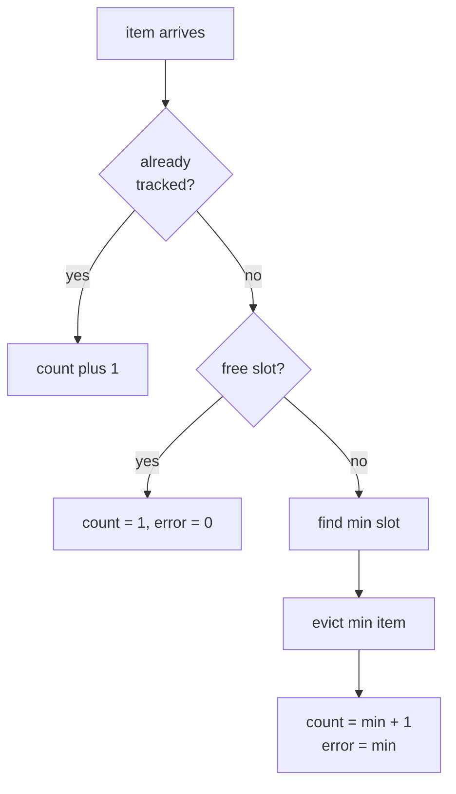

# Space-Saving Algorithm — Junior Level

> **One-line summary:** To find the most frequent items in a never-ending stream using only a small, fixed amount of memory, keep exactly `m` counters; when a new item arrives, if it already has a counter increment it, otherwise **replace the item with the smallest counter** and set that counter to `(min + 1)`, while remembering how much you might have **over-counted** it. The biggest counters are your best guesses for the top-k items.

---

## Table of Contents

1. [Introduction](#introduction)
2. [Prerequisites](#prerequisites)
3. [Glossary](#glossary)
4. [Core Concepts](#core-concepts)
5. [Big-O Summary](#big-o-summary)
6. [Real-World Analogies](#real-world-analogies)
7. [Pros & Cons](#pros--cons)
8. [Step-by-Step Walkthrough](#step-by-step-walkthrough)
9. [Code Examples](#code-examples)
10. [Coding Patterns](#coding-patterns)
11. [Error Handling](#error-handling)
12. [Performance Tips](#performance-tips)
13. [Best Practices](#best-practices)
14. [Edge Cases & Pitfalls](#edge-cases--pitfalls)
15. [Common Mistakes](#common-mistakes)
16. [Cheat Sheet](#cheat-sheet)
17. [Visual Animation](#visual-animation)
18. [Summary](#summary)
19. [Further Reading](#further-reading)

---

## Introduction

Imagine a firehose of events flying past you: every search query typed into a website, every IP address hitting a router, every product clicked in an online store. The events never stop, there are *billions* of them, and you want to answer one deceptively simple question:

> *"Which items show up most often?"*

This is the **top-k frequent items** problem (also called **heavy hitters**). The obvious solution is to keep a big hash map `{item -> count}`, increment counts as items fly by, and at the end sort the map and take the top `k`. That works perfectly... until you realize the stream has *millions of distinct items* and you only have memory for a few thousand counters. You cannot store a counter for every distinct item. You need to find the top items while **throwing most of them away**.

The **Space-Saving algorithm** (Metwally, Agrawal & El Abbadi, 2005) solves exactly this. You decide up front how many counters you can afford — call it `m` (for example `m = 1000`). You keep a small table of at most `m` pairs `(item, count)`. The rule for each arriving item is short:

1. **If the item already has a counter**, increment that counter by 1.
2. **If the item is new and there is a free slot**, give it a counter starting at 1.
3. **If the item is new and all `m` slots are full**, find the slot with the **smallest count** (`min`), **evict** that item, put the new item in its place, and set its count to `min + 1`. Remember an "error" of `min` for that slot, because the new item may have been over-counted by up to `min`.

That third rule is the clever heart of the algorithm. Instead of dropping the new item, it *inherits* the smallest existing count. This means a genuinely frequent item that keeps coming back will quickly climb above the noise, while one-off rare items keep getting evicted. The counters with the **largest values** are your estimates of the most frequent items — and Space-Saving guarantees that any item appearing more than `n / m` times (where `n` is the stream length) is **never missed**.

This file teaches the *what* and the *how*: the `m`-counter table, the replace-the-min rule, the error bookkeeping, and a small worked example you can trace by hand. The *why it works* and the comparison with other streaming algorithms come in [`middle.md`](./middle.md).

---

## Prerequisites

Before reading this file you should be comfortable with:

- **Hash maps / dictionaries** — looking up `item -> count` in roughly `O(1)`.
- **Loops and counting** — incrementing a number when something happens.
- **Finding a minimum** — scanning a small collection for the smallest value.
- **Big-O notation** — `O(1)`, `O(m)`, `O(log m)`, and what "per item" cost means.
- **The idea of a stream** — data that arrives one element at a time and is too big to store fully.

Optional but helpful:

- A glance at **frequency counting** with a plain hash map (the thing we are *approximating*).
- Familiarity with **approximate / probabilistic answers** — being "close enough" instead of exact, in exchange for tiny memory.

---

## Glossary

| Term | Meaning |
|------|---------|
| **Stream** | A sequence of items arriving one at a time, possibly endless; too large to store in full. |
| **`n`** | The number of items seen so far in the stream (the stream length). |
| **Frequency `f(x)`** | The true number of times item `x` actually appeared. |
| **Top-k / heavy hitters** | The `k` items with the highest frequencies. |
| **`m`** | The fixed number of counters you keep (the memory budget). |
| **Counter / slot** | One `(item, count)` pair in the table. |
| **`count(x)`** | The *estimated* frequency Space-Saving stores for item `x` (an over-estimate). |
| **`error(x)` / `ε(x)`** | The over-count recorded for `x`: the `min` value at the moment `x` was inserted. |
| **min counter** | The slot with the smallest `count` — the eviction victim. |
| **Eviction** | Removing the min-count item to make room for a new arrival. |
| **Stream-Summary** | The fast data structure (buckets in a linked list) that finds the min in `O(1)`. |
| **Over-estimate** | `count(x) ≥ f(x)` always; the true frequency is at most the stored count. |

---

## Core Concepts

### 1. You cannot count everything — pick `m` counters

The whole reason Space-Saving exists is that a hash map of *every* distinct item is too big. So you fix a budget `m` and promise to keep at most `m` counters. If the stream has 50 million distinct URLs but `m = 1000`, you will only ever store 1000 of them at a time. The art is making sure the 1000 you keep are (very likely) the frequent ones.

### 2. The replace-the-min rule

When a new item arrives and the table is full, you do **not** ignore it. You find the slot with the **smallest count**, throw out that item, and reuse the slot for the newcomer. Crucially, you set the new count to `min + 1` — the small existing count *plus one* for this fresh sighting. A rare new item lands at the bottom and will be evicted again soon; a truly frequent item that keeps arriving keeps getting re-inserted and incremented, so it ratchets upward and eventually stops being the minimum.

### 3. The error / over-estimate

Because the new item inherits the `min` count, its stored count may be larger than its true frequency — by up to `min`. So when we insert item `x` at `min + 1`, we also record `error(x) = min`. This says: *"the real count of `x` is somewhere between `count(x) - error(x)` and `count(x)`."* That `error` is what makes the algorithm's guarantees provable. The smaller `min` was, the smaller the possible over-count.

### 4. Counts only ever over-estimate

A key property: `count(x) ≥ f(x)` for every item still in the table. Space-Saving never *under*-counts. If anything it credits an item with a few extra hits it did not have. This one-sided error is exactly what lets it promise "no frequent item is ever missed."

### 5. The big counters are the answer

After processing the stream (or at any moment), the items with the **largest counts** are your top-k guesses. Read off the table, sort by count, take the top `k`. The guarantee: any item whose true frequency exceeds `n / m` is guaranteed to still be in the table, so it will appear in your answer.

### 6. Finding the min must be fast — the Stream-Summary

The replace-the-min rule needs the smallest counter on *every* miss. Scanning all `m` slots each time costs `O(m)` per item — too slow for a firehose. The **Stream-Summary** structure groups all items that share the same count into a "bucket," and keeps the buckets in sorted order, so the minimum is always the first bucket — found in `O(1)`. (Details in [`middle.md`](./middle.md); for the junior level a sorted structure or a min-heap is fine to picture.)

---

## Big-O Summary

| Operation | Time | Space | Notes |
|-----------|------|-------|-------|
| Process one item (naive min-scan) | O(m) | O(m) | Scan all slots for the min on a miss. |
| Process one item (Stream-Summary) | **O(1)** | O(m) | Min is the head bucket; increment relinks one node. |
| Process one item (min-heap) | O(log m) | O(m) | Heap gives the min in `O(log m)` per update. |
| Report top-k | O(m log m) | O(m) | Sort the `m` counters once at the end. |
| Total over a stream of `n` items | O(n) (Stream-Summary) | O(m) | Constant work per item, memory independent of `n`. |

The headline: **memory is `O(m)`, independent of how many distinct items the stream has or how long it runs.** That is the entire point. Whether the stream is a million items or a trillion, you use the same fixed `m` counters.

---

## Real-World Analogies

| Concept | Analogy |
|---------|---------|
| Fixed `m` counters | A "Top 40" music chart with exactly 40 slots — only 40 songs can be listed at once. |
| Replace-the-min | When a new song charts, it bumps off the current #40 (the lowest), not a popular one. |
| Inheriting `min + 1` | The new entrant debuts *just above* the song it replaced, then climbs if it stays popular. |
| The error/over-estimate | The new entry might look slightly higher than it truly earned, because it borrowed the old #40's spot. |
| Truly popular item ratchets up | A real hit keeps getting plays, climbs the chart, and stops being at risk of being bumped. |
| Rare one-hit item | A song nobody replays debuts at #40 and gets bumped off again next week. |
| Reading the top of the chart | The top of the list is a reliable view of what is actually popular. |

Where the analogy breaks: a real music chart can re-add a song that fell off (it remembers everything); Space-Saving forgets an evicted item entirely — it only keeps `m` things at any instant, which is why the count can over-estimate.

---

## Pros & Cons

| Pros | Cons |
|------|------|
| Tiny, fixed memory `O(m)` regardless of stream size or distinct-item count. | Counts are *approximate* — they over-estimate the true frequency. |
| `O(1)` per item with the Stream-Summary — keeps up with a firehose. | Cannot answer "what was the exact count of item X" — only an over-estimate with an error bound. |
| **No frequent item is missed**: anything above `n/m` is guaranteed kept. | Items below the threshold may be falsely reported (false positives possible). |
| Often the **most accurate** top-k sketch for skewed (real-world) data. | A single fixed `m` must be chosen up front; too small loses accuracy. |
| **Mergeable**: summaries from many machines can be combined. | Needs the error array as well as counts to give a tight guarantee. |

**When to use:** finding trending / most-frequent items in a huge or endless stream when you cannot store every distinct item — top searches, hot keys, heavy network flows.

**When NOT to use:** when you need *exact* counts (use a full hash map if it fits), when the stream is small enough to count exactly, or when you need *every* item's frequency rather than just the top few.

---

## Step-by-Step Walkthrough

Let us run Space-Saving by hand with `m = 3` counters on this stream:

```
A B C A A B D A B
```

We keep at most 3 slots `(item: count, error)`. Start empty.

**1. `A` arrives** — new, free slot. Table: `A:1 (err 0)`.

**2. `B` arrives** — new, free slot. Table: `A:1`, `B:1 (err 0)`.

**3. `C` arrives** — new, free slot (3rd and last). Table: `A:1`, `B:1`, `C:1 (err 0)`.

**4. `A` arrives** — already tracked, increment. Table: `A:2`, `B:1`, `C:1`.

**5. `A` arrives** — already tracked, increment. Table: `A:3`, `B:1`, `C:1`.

**6. `B` arrives** — already tracked, increment. Table: `A:3`, `B:2`, `C:1`.

**7. `D` arrives** — new, but table is full! Find the min: `C:1` (count 1). Evict `C`, insert `D` at `min + 1 = 2`, record `error(D) = 1`.
Table: `A:3`, `B:2`, `D:2 (err 1)`.

> Notice `D` arrived only once but its stored count is `2`. The error `1` records this: true count of `D` is between `2 - 1 = 1` and `2`. The over-estimate is bounded.

**8. `A` arrives** — tracked, increment. Table: `A:4`, `B:2`, `D:2`.

**9. `B` arrives** — tracked, increment. Table: `A:4`, `B:3`, `D:2`.

**Final table:**

| Item | count | error | true frequency `f` |
|------|-------|-------|--------------------|
| A | 4 | 0 | 4 (exact!) |
| B | 3 | 0 | 3 (exact!) |
| D | 2 | 1 | 1 (over-counted by 1) |

The true top-2 are `A (4)` and `B (3)` — Space-Saving nailed them exactly. `C` (true freq 1) was correctly forgotten. `D`'s count is an over-estimate, but its error field tells us the true value could be as low as `1`. With `n = 9` and `m = 3`, the threshold is `n/m = 3`: every item with frequency `> 3` (just `A`) is guaranteed present — and indeed `A` and `B` both survived.

---

## Code Examples

### Example: Space-Saving with a simple table (min by scan)

This is the clearest version: a hash map plus an explicit min-scan. It is `O(m)` per miss — fine to learn with; the `O(1)` Stream-Summary comes in [`middle.md`](./middle.md).

#### Go

```go
package main

import "fmt"

// SpaceSaving keeps at most m counters with over-estimate errors.
type SpaceSaving struct {
	m       int
	count   map[string]int // estimated frequency
	errVal  map[string]int // recorded over-count per item
}

func NewSpaceSaving(m int) *SpaceSaving {
	return &SpaceSaving{
		m:      m,
		count:  make(map[string]int),
		errVal: make(map[string]int),
	}
}

func (s *SpaceSaving) Add(item string) {
	// Case 1: already tracked -> increment.
	if _, ok := s.count[item]; ok {
		s.count[item]++
		return
	}
	// Case 2: free slot -> start at 1.
	if len(s.count) < s.m {
		s.count[item] = 1
		s.errVal[item] = 0
		return
	}
	// Case 3: full -> evict the min-count item, reuse the slot.
	minItem, minCount := "", 1<<62
	for it, c := range s.count {
		if c < minCount {
			minItem, minCount = it, c
		}
	}
	delete(s.count, minItem)
	delete(s.errVal, minItem)
	s.count[item] = minCount + 1 // inherit min + 1
	s.errVal[item] = minCount    // could be over-counted by min
}

func main() {
	ss := NewSpaceSaving(3)
	for _, it := range []string{"A", "B", "C", "A", "A", "B", "D", "A", "B"} {
		ss.Add(it)
	}
	for it, c := range ss.count {
		fmt.Printf("%s: count=%d error=%d\n", it, c, ss.errVal[it])
	}
}
```

#### Java

```java
import java.util.*;

public class SpaceSaving {
    private final int m;
    private final Map<String, Integer> count = new HashMap<>(); // estimate
    private final Map<String, Integer> error = new HashMap<>(); // over-count

    public SpaceSaving(int m) { this.m = m; }

    public void add(String item) {
        // Case 1: already tracked -> increment.
        if (count.containsKey(item)) {
            count.merge(item, 1, Integer::sum);
            return;
        }
        // Case 2: free slot -> start at 1.
        if (count.size() < m) {
            count.put(item, 1);
            error.put(item, 0);
            return;
        }
        // Case 3: full -> evict the min, reuse the slot.
        String minItem = null;
        int minCount = Integer.MAX_VALUE;
        for (Map.Entry<String, Integer> e : count.entrySet()) {
            if (e.getValue() < minCount) {
                minCount = e.getValue();
                minItem = e.getKey();
            }
        }
        count.remove(minItem);
        error.remove(minItem);
        count.put(item, minCount + 1); // inherit min + 1
        error.put(item, minCount);     // could be over-counted by min
    }

    public static void main(String[] args) {
        SpaceSaving ss = new SpaceSaving(3);
        for (String it : List.of("A","B","C","A","A","B","D","A","B")) ss.add(it);
        for (String it : ss.count.keySet())
            System.out.printf("%s: count=%d error=%d%n", it, ss.count.get(it), ss.error.get(it));
    }
}
```

#### Python

```python
class SpaceSaving:
    """Keep at most m counters; estimates over-count the true frequency."""

    def __init__(self, m):
        self.m = m
        self.count = {}   # item -> estimated frequency
        self.error = {}   # item -> recorded over-count

    def add(self, item):
        # Case 1: already tracked -> increment.
        if item in self.count:
            self.count[item] += 1
            return
        # Case 2: free slot -> start at 1.
        if len(self.count) < self.m:
            self.count[item] = 1
            self.error[item] = 0
            return
        # Case 3: full -> evict the min-count item, reuse the slot.
        min_item = min(self.count, key=self.count.get)
        min_count = self.count[min_item]
        del self.count[min_item]
        del self.error[min_item]
        self.count[item] = min_count + 1   # inherit min + 1
        self.error[item] = min_count       # could be over-counted by min


if __name__ == "__main__":
    ss = SpaceSaving(3)
    for it in ["A", "B", "C", "A", "A", "B", "D", "A", "B"]:
        ss.add(it)
    for it, c in ss.count.items():
        print(f"{it}: count={c} error={ss.error[it]}")
```

**What it does:** keeps `m` counters, increments tracked items, and evicts the smallest to make room for new ones at `min + 1` while recording the error. The min-scan makes each miss `O(m)`; the Stream-Summary in `middle.md` makes it `O(1)`.
**Run:** `go run main.go` | `javac SpaceSaving.java && java SpaceSaving` | `python space_saving.py`

---

## Coding Patterns

### Pattern 1: Hit / Free-slot / Evict three-way branch

**Intent:** Every arriving item falls into exactly one of three cases; structure the code as those three branches in order.

```python
def add(self, item):
    if item in self.count:          # 1. hit
        self.count[item] += 1
    elif len(self.count) < self.m:  # 2. free slot
        self.count[item] = 1
        self.error[item] = 0
    else:                           # 3. evict the min
        self._replace_min(item)
```

### Pattern 2: Inherit-min-plus-one on eviction

**Intent:** The newcomer does not start at 1 — it starts at the evicted minimum count plus one, and records that minimum as its error.

```python
def _replace_min(self, item):
    victim = min(self.count, key=self.count.get)
    min_count = self.count.pop(victim)
    self.error.pop(victim, None)
    self.count[item] = min_count + 1
    self.error[item] = min_count
```

### Pattern 3: Query top-k by sorting the counters

**Intent:** At report time, sort the `m` stored items by count and take the top `k`.

```python
def top_k(self, k):
    return sorted(self.count.items(), key=lambda kv: kv[1], reverse=True)[:k]
```



---

## Error Handling

| Error | Cause | Fix |
|-------|-------|-----|
| Counts much too high | Inserting new items at `min + 1` but forgetting to track the error | Always store `error = min` when evicting; report `count` and `error` together. |
| Frequent item missing from output | `m` chosen too small for the stream's diversity | Increase `m`; threshold to keep is `n/m`, so larger `m` keeps rarer items. |
| Slow processing on a firehose | Scanning all `m` slots for the min every miss (`O(m)`) | Use the Stream-Summary (buckets) or a min-heap for fast min access. |
| Wrong "new item" detection | Checking the wrong map or a stale key | Look up the count map first; treat presence there as "tracked." |
| Off-by-one in eviction | Starting the new item at `min` instead of `min + 1` | The new arrival is a real sighting: it must be `min + 1`. |
| Negative or zero counts | Bug in increment or eviction logic | Counts start at `1`+, only increase; assert `count >= 1`. |

---

## Performance Tips

- **Use the Stream-Summary** (buckets of equal-count items in a sorted list) so the min and every increment are `O(1)`.
- **Avoid the `O(m)` min-scan** in production — it makes per-item cost grow with the table size.
- **Pick `m` based on the threshold you care about:** to catch items above frequency `φ·n`, use roughly `m ≈ 1/φ` (or a few times larger for accuracy).
- **Store `item -> slot` in a hash map** so the "is it tracked?" check is `O(1)`.
- **Batch the top-k sort** — sort only when you actually report, not on every item.

---

## Best Practices

- Keep the **count** and the **error** for every slot; the error is what makes the guarantee usable.
- Validate against a **brute-force exact hash map** on small streams — they must agree on the genuinely frequent items.
- Choose `m` deliberately and document the threshold `n/m` it guarantees.
- Treat the output as **over-estimates**: report `count` as an upper bound and `count - error` as a lower bound.
- Implement the simple min-scan version first to get the logic right, then swap in the Stream-Summary for speed.
- Remember the algorithm is **deterministic** (no randomness in the core), so results are reproducible.

---

## Edge Cases & Pitfalls

- **Empty stream** — table stays empty; top-k is empty.
- **Fewer than `m` distinct items** — every item gets its own exact counter; no eviction ever happens, so counts are *exact*.
- **All items identical** — one counter climbs to `n`; trivially correct.
- **Uniform stream (no heavy hitters)** — lots of churn; many false positives, but that is expected when there are no real heavy hitters to find.
- **Ties for the minimum** — any min-count slot may be evicted; pick one consistently.
- **`m = 1`** — keeps only the single current "leader"; very lossy but legal.
- **Item appears exactly at the threshold `n/m`** — may or may not be kept; the guarantee is strict above the threshold.

---

## Common Mistakes

1. **Starting the new item at `1` instead of `min + 1`** — breaks the over-estimate property and the guarantee; the newcomer must inherit the min.
2. **Forgetting to record the error** — you lose the ability to bound how much you over-counted.
3. **Dropping new items when full** — that is a *different* (worse) algorithm; Space-Saving always replaces the min, never ignores.
4. **Scanning for the min every time** — correct but `O(m)` per item; use the Stream-Summary for `O(1)`.
5. **Treating the counts as exact** — they are upper bounds; never claim an exact frequency from a slot that has nonzero error.
6. **Choosing `m` too small** — you then miss items just above the threshold; size `m` to the smallest frequency you must catch.
7. **Confusing count vs error** — `count` is the estimate, `error` is the maximum over-count; the true value lies in `[count - error, count]`.

---

## Cheat Sheet

| Question | Tool | Key idea |
|----------|------|----------|
| Top items in a huge stream, tiny memory? | Space-Saving | `m` counters, replace the min |
| New item, table full? | evict min | new count = `min + 1`, error = `min` |
| New item, slot free? | new counter | count = `1`, error = `0` |
| Existing item? | increment | count `+= 1` (error unchanged) |
| What does count mean? | over-estimate | `f(x) ∈ [count - error, count]` |
| Which items are guaranteed kept? | heavy hitters | every item with `f > n/m` |
| Find the min fast? | Stream-Summary | buckets in sorted order → `O(1)` |

Core algorithm:

```
add(item):
    if item tracked:        count[item] += 1
    elif free slot:         count[item] = 1;        error[item] = 0
    else:                   victim = argmin(count)
                            min = count[victim]
                            remove victim
                            count[item] = min + 1;  error[item] = min
# top-k = items with the largest counts
# guarantee: every item with f > n/m is still present
```

---

## Visual Animation

> See [`animation.html`](./animation.html) for an interactive visualization.
>
> The animation demonstrates:
> - The `m` counters as a row of slots, each showing `(item, count, error)`
> - An item arriving and either **incrementing** a tracked slot or **replacing the min** slot
> - The new count set to `min + 1` and the recorded error highlighted
> - The Stream-Summary bucket list (items grouped by count, smallest first)
> - Editable stream input plus Step / Run / Reset controls and a log

---

## Summary

The Space-Saving algorithm finds the **most frequent items** in a huge or endless stream using only a **fixed `m` counters**. Each arriving item either **increments** its existing counter, takes a **free slot** starting at `1`, or — when the table is full — **replaces the slot with the smallest count**, starting the newcomer at `min + 1` and recording an **error** of `min`. The stored counts are always **over-estimates** (`count(x) ≥ f(x)`), and the error field bounds the over-count, so the true frequency lies in `[count - error, count]`. The largest counters are the top-k answer, and any item appearing more than `n/m` times is **guaranteed never to be evicted**. With the **Stream-Summary** structure, each item costs `O(1)` and memory stays `O(m)` no matter how long the stream runs. The two rules never to forget: the newcomer inherits **`min + 1`** (not `1`), and you must record the **error** to make the guarantee usable.

---

## Further Reading

- Metwally, Agrawal & El Abbadi (2005), *"Efficient Computation of Frequent and Top-k Elements in Data Streams"* — the original Space-Saving paper.
- Sibling topic `08-misra-gries-heavy-hitters` (in `22-randomized-algorithms`) — the closely related counter-based heavy-hitters method.
- Sibling topic `01-reservoir-sampling` — another fixed-memory streaming technique.
- Cormode & Hadjieleftheriou (2008), *"Finding Frequent Items in Data Streams"* — a survey comparing Space-Saving, Misra-Gries, Count-Min, and Lossy Counting.
- Go: `container/heap`; Java: `java.util.PriorityQueue`, `HashMap`; Python: `heapq`, `collections` docs.

---

Next step: [middle.md](./middle.md) — the over-estimate bound, the `O(1)` Stream-Summary structure, and how Space-Saving compares with Misra-Gries, Count-Min Sketch, and Lossy Counting.
