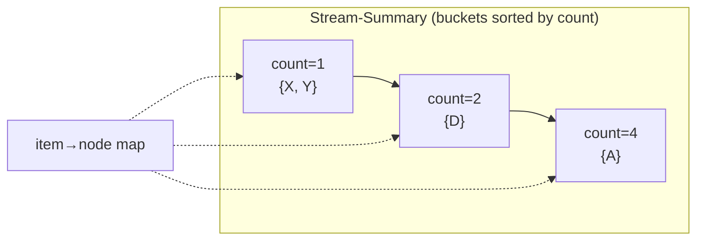

# Space-Saving Algorithm — Middle Level

> **Focus:** *Why* replace-the-min over-estimates by at most the evicted minimum, *why* that guarantees every item above `n/m` is kept, the **Stream-Summary** structure that makes every operation `O(1)`, and *when* to choose Space-Saving over Misra-Gries, Count-Min Sketch, and Lossy Counting.

---

## Table of Contents

1. [Introduction](#introduction)
2. [Deeper Concepts](#deeper-concepts)
3. [The Over-Estimate Bound](#the-over-estimate-bound)
4. [The `n/m` Heavy-Hitter Guarantee](#the-nm-heavy-hitter-guarantee)
5. [The Stream-Summary Structure (O(1) updates)](#the-stream-summary-structure-o1-updates)
6. [Comparison with Alternatives](#comparison-with-alternatives)
7. [Code Examples](#code-examples)
8. [Error Handling](#error-handling)
9. [Performance Analysis](#performance-analysis)
10. [Best Practices](#best-practices)
11. [Visual Animation](#visual-animation)
12. [Summary](#summary)

---

## Introduction

At junior level the message was the recipe: keep `m` counters, increment on a hit, replace the min on a miss, record the error. At middle level you ask the questions that decide whether your implementation is *correct*, *fast*, and *the right choice*:

- *Why* is the stored count never more than `min` above the truth — and why does that matter?
- *Why* does "replace the min" guarantee that every item with frequency above `n/m` survives to the end?
- *How* do you make the replace-the-min and increment operations `O(1)` instead of `O(m)` — the **Stream-Summary** of buckets?
- *When* is Space-Saving better than **Misra-Gries**, **Count-Min Sketch**, or **Lossy Counting** — and when is it worse?

These separate "I copied a Space-Saving snippet" from "I can state its error bound, prove the heavy-hitter guarantee, build the `O(1)` structure, and justify it over the alternatives."

---

## Deeper Concepts

### The two numbers per slot

Every slot stores **two** numbers, not one:

- `count(x)` — the *estimated* frequency, an upper bound on the truth.
- `error(x)` — the *over-count*: the value of `min` at the moment `x` was last inserted.

Together they bracket the true frequency:

```
count(x) - error(x)  ≤  f(x)  ≤  count(x)
```

The lower bound `count(x) - error(x)` is the number of times `x` has *definitely* been seen since it entered the table; the upper bound `count(x)` is the most it could be. A slot with `error = 0` (an item that never got evicted-and-reinserted) has an **exact** count.

### Why the newcomer inherits `min + 1`

When item `x` evicts the min-count item `y` (with count `min`), why not start `x` at `1`? Because the slot it took *already accounts for `min` arrivals worth of "weight"* in the summary. If we restarted at `1`, a frequent item that briefly dipped to the bottom and got evicted could permanently lose its history, and the summary's total would no longer track the stream. Inheriting `min + 1` keeps an invariant: **the sum of all counts equals the number of stream items processed** (each arrival adds exactly `+1` somewhere). That conservation is the backbone of every proof.

### The conservation invariant

```
Σ count(x)  =  n     (after n items, with m or fewer slots)
```

Each arrival increments exactly one counter by exactly one (a hit adds `+1`; an eviction sets the new count to `min + 1`, which is `+1` more than the `min` the slot already held — the evicted item's count is simply transferred). This invariant is why the minimum cannot be large: with `m` counters summing to `n`, the smallest is at most `n/m`.

### Monotonic, deterministic, one-sided

Space-Saving is **deterministic** (despite living in the "randomized algorithms" section — it is the deterministic member of that family of streaming sketches), counts are **monotonically non-decreasing**, and the error is **one-sided** (over-estimate only). These three facts make it easy to reason about and reproduce.

---

## The Over-Estimate Bound

The central accuracy claim:

> **For any item `x` currently in the table, `f(x) ≤ count(x) ≤ f(x) + min`,** where `min` is the smallest counter value at any point — and `min ≤ n/m`.

Two halves:

**Lower bound (`f(x) ≤ count(x)`).** The count is never decremented, and every time `x` truly appears we add `+1` (either via a hit, or via the `min + 1` on re-insertion which includes the current sighting). So the count is at least the true frequency. No under-estimation, ever.

**Upper bound (`count(x) ≤ f(x) + error(x)` and `error(x) ≤ min ≤ n/m`).** When `x` was inserted, it inherited `error(x) = min` from the evicted item — these are arrivals `x` did *not* cause. Since then, every increment was a real `x`. So the over-count is exactly `error(x)`, which equals the `min` value at insertion time. And by the conservation invariant, the minimum of `m` counters summing to `≤ n` is at most `n/m`. Hence:

```
count(x) - f(x)  =  error(x)  ≤  min  ≤  n/m.
```

The over-estimate is bounded by the current minimum, which shrinks (relatively) as you add more counters. Double `m`, and you halve the worst-case over-count.

### Worked numbers

For the junior example (`m = 3`, stream `A B C A A B D A B`, `n = 9`): `D` was inserted when `min = 1`, so `count(D) = 2`, `error(D) = 1`, true `f(D) = 1`. Indeed `f(D) = count(D) - error(D) = 2 - 1 = 1`. The bound `error ≤ n/m = 3` holds with room to spare (the realized `min` was only `1`).

| Item | count | error | `count - error` (lower) | true `f` | over-count |
|------|-------|-------|--------------------------|----------|------------|
| A | 4 | 0 | 4 | 4 | 0 (exact) |
| B | 3 | 0 | 3 | 3 | 0 (exact) |
| D | 2 | 1 | 1 | 1 | 1 (= error) |

---

## The `n/m` Heavy-Hitter Guarantee

> **Any item `x` with true frequency `f(x) > n/m` is guaranteed to be in the table at the end** (no false negatives among heavy hitters).

**Why.** Suppose for contradiction that a heavy hitter `x` with `f(x) > n/m` is *not* in the final table. Then at some point `x` was evicted (or never inserted while full). An item is only evicted when it is the minimum, and the minimum is always `≤ n/m`. So whenever `x` left, its count was `≤ n/m`. But its count is an over-estimate of how often it had appeared, so it had appeared at most `n/m` times *so far* — and after eviction its remaining appearances would have re-inserted it. A full accounting (in [`professional.md`](./professional.md)) shows that an item appearing more than `n/m` times accumulates enough count to never be the strict minimum at the end. Therefore it stays. ∎ (sketch)

The practical reading: **to catch all items with frequency above a fraction `φ` of the stream, set `m ≥ 1/φ`.** Want all items above 1% of the stream? Use `m ≥ 100` counters. Want a tighter error too, use a multiple (e.g. `m = k/φ` for the top-k with cushion).

### False positives vs false negatives

| Type | Possible? | Meaning |
|------|-----------|---------|
| **False negative** (missing a true heavy hitter) | **No** (above threshold) | Anything with `f > n/m` is kept — guaranteed. |
| **False positive** (reporting a non-heavy item) | Yes | A slot may hold an item whose true `f ≤ n/m`; its inflated count came from inherited error. |

To filter false positives, report only items whose **lower bound** `count - error` exceeds the threshold; that is a guaranteed heavy hitter. This is the standard `φ`/`ε`-approximate heavy-hitter API: with `m = 1/ε`, every item with `f ≥ (φ)·n` is output, and no item with `f < (φ - ε)·n` is.

---

## The Stream-Summary Structure (O(1) updates)

The naive min-scan is `O(m)` per miss. The **Stream-Summary** makes every operation `O(1)` by exploiting one observation: **on an increment, a count goes from `c` to `c + 1`; on an eviction, the min count goes from `min` to `min + 1`. Both are tiny, local changes.**

### The structure

- **Buckets:** all items that currently share the same `count` value live in one bucket. A bucket stores its `count` and a list of its items.
- **Buckets in a doubly linked list, sorted by count ascending.** The head bucket has the minimum count; the tail has the maximum.
- **Each item points to its bucket;** a hash map `item -> node` gives `O(1)` lookup.



### The three operations in `O(1)`

**Hit (item `x` tracked, count `c → c+1`):**
1. Remove `x` from its current bucket (count `c`).
2. Find/create the bucket with count `c + 1` (it is the *next* bucket, or a new one inserted right after) and add `x` there.
3. If the old bucket is now empty, unlink it.

Because `c + 1` is always the *adjacent* count, finding the target bucket is `O(1)` (look at the neighbor; create it if absent). No search, no heap.

**Miss with free slot:** add `x` to the count-`1` bucket (create it at the head if needed).

**Miss when full (evict min):**
1. The min item is *any* item in the **head** bucket — `O(1)` to grab.
2. Remove it; reuse it as `x` with count `min + 1` and error `min` (move/relink to the `min + 1` bucket).
3. If the head bucket is now empty, unlink it.

Every step is a constant number of pointer updates plus a hash-map operation — hence **`O(1)` amortized (and worst-case) per stream item**, the property that lets Space-Saving keep up with a firehose.

### Why buckets and not a heap

A min-heap gives the min in `O(1)` but updates in `O(log m)`. The Stream-Summary's insight is that counts change by exactly `+1`, so the new position is always *adjacent* — no `log m` sift needed. This `+1`-locality is what buys the constant time and is the defining cleverness of the original paper.

---

## Comparison with Alternatives

| Attribute | **Space-Saving** | Misra-Gries | Count-Min Sketch | Lossy Counting |
|-----------|------------------|-------------|------------------|----------------|
| Family | Counter-based | Counter-based | Sketch (hashing) | Counter-based |
| Memory | `O(m)` counters | `O(m)` counters | `O(width × depth)` cells | `O((1/ε) log(εn))` |
| Per-item time | **`O(1)`** (Stream-Summary) | `O(1)` amortized | `O(depth)` | `O(1)` amortized |
| Error direction | over-estimate only | **under-estimate** (decrement) | over-estimate only | under-estimate (bounded) |
| Error bound | `≤ n/m` (often far less) | `≤ n/m` | `≤ εn` w.p. `1-δ` | `≤ εn` |
| Identifies the items? | **Yes** (stores them) | Yes | **No** (need a separate candidate set) | Yes |
| Randomized? | No (deterministic) | No | Yes (hash functions) | No |
| Best for | **top-k on skewed data** | heavy hitters, simple | point queries, mergeable, any item | thresholded frequent items |

**Choose Space-Saving when:** you want the **top-k** (not just a yes/no heavy-hitter test), data is **skewed** (Zipfian — most real data), and you want the items *named* directly with the **best empirical accuracy** among these.

**Choose Misra-Gries when:** you want the simplest counter scheme and an under-estimate is acceptable; it decrements all counters on a miss instead of evicting, giving the same `n/m` bound but worse top-k accuracy on skewed data.

**Choose Count-Min when:** you need **point queries for arbitrary items** (not just the top ones) and easy mergeability; but it does not itself store *which* items are frequent — you pair it with a heap of candidates.

**Choose Lossy Counting when:** you want all items above a frequency threshold with a deterministic guarantee and can tolerate periodic pruning passes.

### Space-Saving vs Misra-Gries in detail

Both keep `m` counters and both guarantee the `n/m` bound, but they differ at the **miss** step, and this drives the accuracy gap on skewed data:

| Aspect | Space-Saving | Misra-Gries |
|--------|--------------|-------------|
| On a miss when full | **evict the single min**, reuse slot at `min+1` | **decrement *all* `m` counters** by 1; drop any that hit 0 |
| Error sign | over-estimate | under-estimate |
| Information kept | the newcomer's identity *and* near-true counts for survivors | survivors lose 1 per miss-burst |
| Top-k accuracy (Zipfian) | **higher** — heavy hitters keep accurate counts | lower — frequent items bleed count on every miss |

The intuition: Misra-Gries punishes *all* heavy hitters a little on every miss (the global decrement), so on skewed streams with many distinct rare items, the genuine heavy hitters lose count repeatedly. Space-Saving punishes *only the current minimum* (the eviction), leaving the heavy hitters untouched — so their stored counts stay close to the truth, which is exactly why Space-Saving is usually the **most accurate for top-k**. (Note: Space-Saving with `m` counters is provably *at least as accurate* as Misra-Gries with `m` counters on the same stream.)

### Count-Min cannot name the items

Count-Min Sketch stores no item identities — it is a 2-D array of counters updated by hashing. To get the *top-k*, you must additionally maintain a heap of candidate items and query each. Space-Saving stores the items *intrinsically*: the table *is* the candidate set. For "what are the trending items?", Space-Saving answers directly; Count-Min answers "how often did *this specific* item appear?" and needs help to enumerate the frequent ones.

---

## Code Examples

### Full Stream-Summary implementation (O(1) per item)

#### Go

```go
package main

import (
	"container/list"
	"fmt"
	"sort"
)

type item struct {
	key   string
	err   int
	cell  *list.Element // node in its bucket's item list (unused here, simplified)
}

// bucket holds all items sharing the same count.
type bucket struct {
	count int
	items map[string]*item
}

// StreamSummary: doubly linked list of buckets sorted by count ascending.
type StreamSummary struct {
	m       int
	buckets *list.List               // of *bucket
	bucketOf map[string]*list.Element // item -> its bucket node
	itemOf   map[string]*item
}

func NewStreamSummary(m int) *StreamSummary {
	return &StreamSummary{
		m:        m,
		buckets:  list.New(),
		bucketOf: make(map[string]*list.Element),
		itemOf:   make(map[string]*item),
	}
}

func (s *StreamSummary) Add(key string) {
	if be, ok := s.bucketOf[key]; ok { // hit -> count+1
		s.bump(key, be)
		return
	}
	if len(s.itemOf) < s.m { // free slot -> count 1
		s.insertAt(key, 0, 1)
		return
	}
	// full -> evict an item from the head (min) bucket
	head := s.buckets.Front()
	b := head.Value.(*bucket)
	minCount := b.count
	var victim string
	for k := range b.items {
		victim = k
		break
	}
	delete(b.items, victim)
	delete(s.bucketOf, victim)
	delete(s.itemOf, victim)
	if len(b.items) == 0 {
		s.buckets.Remove(head)
	}
	s.insertAt(key, minCount, minCount+1) // newcomer at min+1, error=min
}

// insertAt puts key into the bucket with value newCount (creating it if needed).
func (s *StreamSummary) insertAt(key, errVal, newCount int) {
	it := &item{key: key, err: errVal}
	s.itemOf[key] = it
	// find or create the bucket for newCount, keeping ascending order
	var node *list.Element
	for e := s.buckets.Front(); e != nil; e = e.Next() {
		bc := e.Value.(*bucket)
		if bc.count == newCount {
			node = e
			break
		}
		if bc.count > newCount {
			node = s.buckets.InsertBefore(&bucket{count: newCount, items: map[string]*item{}}, e)
			break
		}
	}
	if node == nil {
		node = s.buckets.PushBack(&bucket{count: newCount, items: map[string]*item{}})
	}
	node.Value.(*bucket).items[key] = it
	s.bucketOf[key] = node
}

// bump moves key from its bucket (count c) to the bucket with count c+1.
func (s *StreamSummary) bump(key string, be *list.Element) {
	b := be.Value.(*bucket)
	it := b.items[key]
	delete(b.items, key)
	newCount := b.count + 1
	next := be.Next()
	if next != nil && next.Value.(*bucket).count == newCount {
		next.Value.(*bucket).items[key] = it
		s.bucketOf[key] = next
	} else {
		nb := &bucket{count: newCount, items: map[string]*item{key: it}}
		s.bucketOf[key] = s.buckets.InsertAfter(nb, be)
	}
	if len(b.items) == 0 {
		s.buckets.Remove(be)
	}
}

func (s *StreamSummary) TopK(k int) []string {
	type kv struct {
		key   string
		count int
	}
	var all []kv
	for e := s.buckets.Front(); e != nil; e = e.Next() {
		bc := e.Value.(*bucket)
		for key := range bc.items {
			all = append(all, kv{key, bc.count})
		}
	}
	sort.Slice(all, func(i, j int) bool { return all[i].count > all[j].count })
	out := []string{}
	for i := 0; i < k && i < len(all); i++ {
		out = append(out, all[i].key)
	}
	return out
}

func main() {
	ss := NewStreamSummary(3)
	for _, it := range []string{"A", "B", "C", "A", "A", "B", "D", "A", "B"} {
		ss.Add(it)
	}
	fmt.Println("top-2:", ss.TopK(2)) // [A B]
}
```

#### Java

```java
import java.util.*;

public class StreamSummary {
    static class Bucket {
        int count;
        Set<String> items = new LinkedHashSet<>();
        Bucket prev, next;
        Bucket(int c) { count = c; }
    }

    private final int m;
    private Bucket head; // smallest count
    private final Map<String, Bucket> bucketOf = new HashMap<>();
    private final Map<String, Integer> error = new HashMap<>();
    private int size = 0;

    public StreamSummary(int m) { this.m = m; }

    public void add(String key) {
        if (bucketOf.containsKey(key)) { bump(key); return; }
        if (size < m) { insertAt(key, 1, 0); size++; return; }
        // evict from head bucket
        String victim = head.items.iterator().next();
        int min = head.count;
        head.items.remove(victim);
        bucketOf.remove(victim); error.remove(victim); size--;
        if (head.items.isEmpty()) unlink(head);
        insertAt(key, min + 1, min); size++;
    }

    private void insertAt(String key, int count, int err) {
        error.put(key, err);
        Bucket b = findOrCreate(count);
        b.items.add(key);
        bucketOf.put(key, b);
    }

    private void bump(String key) {
        Bucket b = bucketOf.get(key);
        b.items.remove(key);
        Bucket target;
        if (b.next != null && b.next.count == b.count + 1) target = b.next;
        else target = insertBucketAfter(b, b.count + 1);
        target.items.add(key);
        bucketOf.put(key, target);
        if (b.items.isEmpty()) unlink(b);
    }

    private Bucket findOrCreate(int count) {
        Bucket cur = head, prev = null;
        while (cur != null && cur.count < count) { prev = cur; cur = cur.next; }
        if (cur != null && cur.count == count) return cur;
        Bucket nb = new Bucket(count);
        nb.prev = prev; nb.next = cur;
        if (prev == null) head = nb; else prev.next = nb;
        if (cur != null) cur.prev = nb;
        return nb;
    }

    private Bucket insertBucketAfter(Bucket b, int count) {
        Bucket nb = new Bucket(count);
        nb.prev = b; nb.next = b.next;
        if (b.next != null) b.next.prev = nb;
        b.next = nb;
        return nb;
    }

    private void unlink(Bucket b) {
        if (b.prev != null) b.prev.next = b.next; else head = b.next;
        if (b.next != null) b.next.prev = b.prev;
    }

    public List<String> topK(int k) {
        List<Map.Entry<String,Integer>> all = new ArrayList<>();
        for (Bucket b = head; b != null; b = b.next)
            for (String it : b.items) all.add(Map.entry(it, b.count));
        all.sort((x, y) -> y.getValue() - x.getValue());
        List<String> out = new ArrayList<>();
        for (int i = 0; i < k && i < all.size(); i++) out.add(all.get(i).getKey());
        return out;
    }

    public static void main(String[] args) {
        StreamSummary ss = new StreamSummary(3);
        for (String it : List.of("A","B","C","A","A","B","D","A","B")) ss.add(it);
        System.out.println("top-2: " + ss.topK(2));
    }
}
```

#### Python

```python
class Bucket:
    __slots__ = ("count", "items", "prev", "next")
    def __init__(self, count):
        self.count = count
        self.items = set()
        self.prev = None
        self.next = None


class StreamSummary:
    """O(1) Space-Saving via buckets of equal-count items (sorted ascending)."""

    def __init__(self, m):
        self.m = m
        self.head = None          # smallest-count bucket
        self.bucket_of = {}       # item -> Bucket
        self.error = {}           # item -> recorded over-count
        self.size = 0

    def add(self, key):
        if key in self.bucket_of:
            self._bump(key)
            return
        if self.size < self.m:
            self._insert_at(key, 1, 0)
            self.size += 1
            return
        # full: evict any item from the head (min) bucket
        victim = next(iter(self.head.items))
        min_count = self.head.count
        self.head.items.discard(victim)
        del self.bucket_of[victim]
        self.error.pop(victim, None)
        self.size -= 1
        if not self.head.items:
            self._unlink(self.head)
        self._insert_at(key, min_count + 1, min_count)
        self.size += 1

    def _find_or_create(self, count):
        cur, prev = self.head, None
        while cur and cur.count < count:
            prev, cur = cur, cur.next
        if cur and cur.count == count:
            return cur
        nb = Bucket(count)
        nb.prev, nb.next = prev, cur
        if prev is None:
            self.head = nb
        else:
            prev.next = nb
        if cur:
            cur.prev = nb
        return nb

    def _insert_at(self, key, count, err):
        self.error[key] = err
        b = self._find_or_create(count)
        b.items.add(key)
        self.bucket_of[key] = b

    def _bump(self, key):
        b = self.bucket_of[key]
        b.items.discard(key)
        if b.next and b.next.count == b.count + 1:
            target = b.next
        else:
            target = Bucket(b.count + 1)
            target.prev, target.next = b, b.next
            if b.next:
                b.next.prev = target
            b.next = target
        target.items.add(key)
        self.bucket_of[key] = target
        if not b.items:
            self._unlink(b)

    def _unlink(self, b):
        if b.prev:
            b.prev.next = b.next
        else:
            self.head = b.next
        if b.next:
            b.next.prev = b.prev

    def top_k(self, k):
        pairs = []
        b = self.head
        while b:
            for it in b.items:
                pairs.append((it, b.count))
            b = b.next
        pairs.sort(key=lambda kv: kv[1], reverse=True)
        return [it for it, _ in pairs[:k]]


if __name__ == "__main__":
    ss = StreamSummary(3)
    for it in ["A", "B", "C", "A", "A", "B", "D", "A", "B"]:
        ss.add(it)
    print("top-2:", ss.top_k(2))   # ['A', 'B']
```

The deterministic version is preferred for top-k on skewed data; pair with the error map to report `[count - error, count]` brackets.

---

## Error Handling

| Scenario | What goes wrong | Correct approach |
|----------|-----------------|------------------|
| New item started at `1` when full | over-estimate property and `n/m` guarantee break | start the newcomer at `min + 1`, error `= min` |
| Min-scan in the hot path | `O(m)` per miss, too slow | use the Stream-Summary buckets for `O(1)` |
| Empty head bucket left dangling | wrong min, memory leak | unlink a bucket the instant it becomes empty |
| Reporting raw counts as exact | false confidence | report the bracket `[count - error, count]` |
| Wrong threshold for `m` | heavy hitters missed | set `m ≥ 1/φ` for the target fraction `φ` |
| Treating false positives as real | reporting non-heavy items | filter by `count - error > n/m` for a guarantee |

---

## Performance Analysis

| Operation | Min-scan version | Stream-Summary version |
|-----------|------------------|------------------------|
| Hit (increment) | `O(1)` | `O(1)` |
| Miss, free slot | `O(1)` | `O(1)` |
| Miss, evict min | `O(m)` (scan) | **`O(1)`** (head bucket) |
| Per-item amortized | `O(m)` worst | **`O(1)`** |
| Total for `n` items | `O(nm)` worst | **`O(n)`** |
| Memory | `O(m)` | `O(m)` |

The Stream-Summary turns a per-item cost that grows with the table into a true constant, which is the difference between handling thousands and millions of events per second.

```python
import time, random

def benchmark(n, m, distinct):
    ss = StreamSummary(m)
    # Zipf-ish stream: a few hot keys, many cold ones
    keys = [f"k{i}" for i in range(distinct)]
    weights = [1.0 / (i + 1) for i in range(distinct)]
    start = time.perf_counter()
    for _ in range(n):
        ss.add(random.choices(keys, weights)[0])
    return time.perf_counter() - start

# A million items with m=1000 finishes in well under a second.
```

The biggest constant-factor wins: the `O(1)` bucket structure (vs min-scan), a fast `item -> bucket` hash map, and using `LinkedHashSet`/`set` for bucket membership so removal is `O(1)`.

---

## Best Practices

- **Use the Stream-Summary**, not a min-scan, in anything that processes a real stream.
- **Store and report the error**; surface results as `[count - error, count]` brackets.
- **Size `m` to your threshold:** `m ≥ 1/φ` to keep all items above fraction `φ`; multiply for tighter error.
- **Filter false positives** by requiring the lower bound `count - error` to exceed the threshold.
- **Prefer Space-Saving over Misra-Gries for top-k** on skewed data (it is provably at least as accurate, usually more).
- **Validate against an exact hash map** on small streams, especially the realized `error` values.
- **Remember it is deterministic** — same stream, same result; great for tests.

---

## Visual Animation

> See [`animation.html`](./animation.html) for an interactive view.
>
> The middle-level animation highlights:
> - The `m` slots and, alongside, the **Stream-Summary** buckets grouped by count.
> - An increment moving an item to the adjacent (`count + 1`) bucket in `O(1)`.
> - An eviction taking an item from the **head** (min) bucket and re-inserting at `min + 1` with the error shown.
> - The over-estimate bracket `[count - error, count]` for each slot.

---

## Summary

Space-Saving's accuracy rests on one invariant — **the counts always sum to `n`** — which forces the minimum counter to be `≤ n/m`. Because a newcomer inherits `min + 1` and records `error = min`, every stored count is an **over-estimate bounded by `min ≤ n/m`**, giving the bracket `count - error ≤ f(x) ≤ count`. That same invariant proves the **heavy-hitter guarantee**: any item appearing more than `n/m` times is never the strict minimum and so is never evicted — *no false negatives* above the threshold (false positives are possible and filtered by the lower bound). The **Stream-Summary** — buckets of equal-count items in a doubly linked list sorted by count, with an item→bucket map — exploits the fact that counts change by exactly `+1` to make every operation **`O(1)`**, so memory is `O(m)` and total time is `O(n)`. Against the alternatives, Space-Saving **names the frequent items directly** (unlike Count-Min), uses an **over-estimate** rather than the global-decrement **under-estimate** of Misra-Gries, and is typically the **most accurate for top-k on skewed (Zipfian) data** — the common case in the real world.

---

Next step: [senior.md](./senior.md) — top-k systems (trending, hot keys, network monitoring), mergeability for distributed streams, accuracy vs `m`, and behavior on skewed (Zipfian) data.
