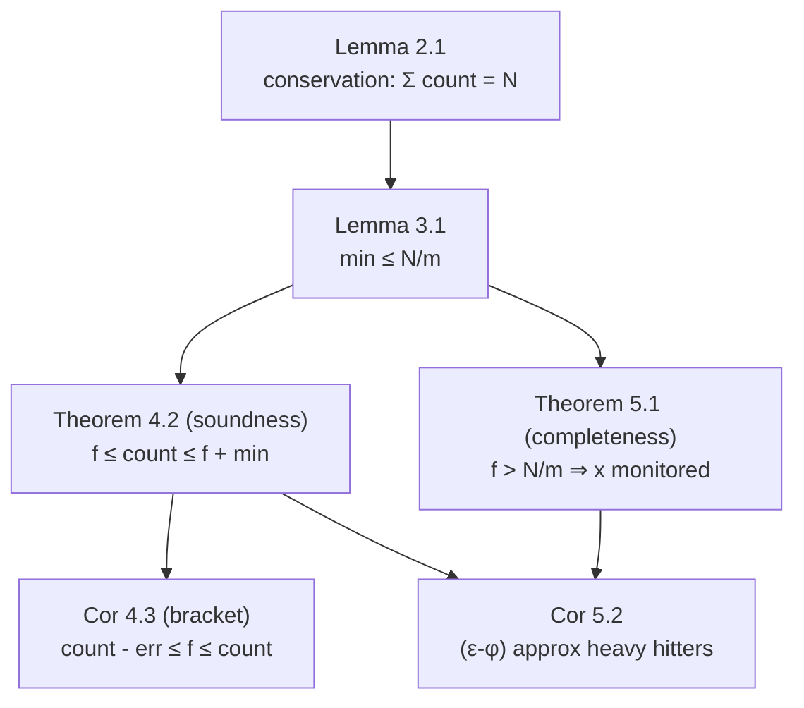

# Space-Saving Algorithm — Mathematical Foundations and Complexity Theory

## Table of Contents
1. [Formal Definitions](#1-formal-definitions)
2. [The Conservation Invariant](#2-the-conservation-invariant)
3. [The Minimum Counter Bound](#3-the-minimum-counter-bound)
4. [The Over-Estimate Bound (Soundness)](#4-the-over-estimate-bound-soundness)
5. [The Heavy-Hitter Guarantee (Completeness)](#5-the-heavy-hitter-guarantee-completeness)
6. [Why Space-Saving Beats Misra-Gries for Top-k](#6-why-space-saving-beats-misra-gries-for-top-k)
7. [Stream-Summary Correctness and Complexity](#7-stream-summary-correctness-and-complexity)
8. [Merge Correctness](#8-merge-correctness)
9. [Comparison with Alternatives](#9-comparison-with-alternatives)
10. [Summary](#10-summary)

---

## 1. Formal Definitions

Let `σ = ⟨a_1, a_2, …, a_N⟩` be a stream of `N` items drawn from a universe `U` (`|U|` possibly enormous). Let `f(x) = |{i : a_i = x}|` denote the **true frequency** of item `x`, so `Σ_{x∈U} f(x) = N`.

**Definition 1.1 (Space-Saving summary).** A summary `D` is a set of at most `m` triples `(x, count_D(x), err_D(x))` with `x ∈ U`, `count_D(x) ∈ ℤ_{≥1}`, and `err_D(x) ∈ ℤ_{≥0}`. We write `K(D)` for the set of *monitored* items (the keys present), so `|K(D)| ≤ m`. For `x ∉ K(D)`, `count_D(x)` and `err_D(x)` are undefined (conceptually `0`).

**Definition 1.2 (Update rule).** Processing item `a_i = x` transforms `D` to `D'`:
```
(SS-1) if x ∈ K(D):                     count_{D'}(x) = count_D(x) + 1;       err unchanged.
(SS-2) elif |K(D)| < m:                 K(D') = K(D) ∪ {x};  count_{D'}(x) = 1;  err_{D'}(x) = 0.
(SS-3) else (full): let e = argmin_{y∈K(D)} count_D(y),  μ = count_D(e).
        K(D') = (K(D) \ {e}) ∪ {x};
        count_{D'}(x) = μ + 1;  err_{D'}(x) = μ;
        (other items unchanged.)
```
Ties in (SS-3) are broken arbitrarily (any minimum-count item is a valid victim).

**Definition 1.3 (Monitored minimum).** `min(D) = min_{y∈K(D)} count_D(y)` if `|K(D)| = m`, else `min(D) = 0` (a free slot acts as a count-0 item).

**Definition 1.4 (Heavy hitter / φ-frequent).** For `φ ∈ (0,1)`, `x` is **φ-frequent** if `f(x) > φN`. The **top-k** are the `k` items of largest `f`.

**Notation.** `D_i` is the summary after processing `a_1, …, a_i` (`D_0` empty). `count_i(x) = count_{D_i}(x)`, `err_i(x) = err_{D_i}(x)`, `μ_i = min(D_i)`. All claims are *deterministic* — Space-Saving uses no randomness (it is the deterministic representative of the streaming heavy-hitters family).

**Standing assumptions.** `m ≥ 1`; the stream is processed left to right; (SS-3) fires only when `|K(D)| = m`. When `|U| ≤ m` no eviction ever occurs and all counts are exact (`err ≡ 0`) — the trivial case, excluded from the interesting bounds below.

### 1.0 The Streaming Model

Space-Saving operates in the **cash-register (insert-only) streaming model**:

- **Single pass:** each `a_i` is seen exactly once, in order, and cannot be revisited.
- **Sublinear space:** working memory `O(m) = O(1/ε)` is far smaller than `N` and than `|U|`.
- **Per-item time budget:** processing must keep pace with arrival (here `O(1)`).
- **Insertions only:** frequencies only increase (no deletions). For the *turnstile* model (deletions allowed), Space-Saving does not directly apply — counter-based eviction cannot undo a count; sketches like Count-Min (with signed updates, "Count-Median") are used instead. This is a structural limitation: the conservation invariant `Σ count = N` assumes monotone insertions.

These constraints are why an exact hash map (which is single-pass and `O(1)` per item but uses `O(|U|)` space) is *not* a streaming algorithm in the meaningful sense — it violates the sublinear-space requirement. Space-Saving is the canonical deterministic sublinear-space solution for top-k in the cash-register model.

### 1.1 The Dependency of Results



Conservation (Lemma 2.1) bounds the minimum (Lemma 3.1); the minimum bounds the over-estimate (Theorem 4.2, *soundness*) and forces heavy hitters to survive (Theorem 5.1, *completeness*). Everything hangs off conservation.

---

## 2. The Conservation Invariant

**Lemma 2.1 (Count conservation).** After processing `i` items, `Σ_{x∈K(D_i)} count_i(x) = i`.

**Proof.** By induction on `i`. *Base (`i = 0`):* the summary is empty, sum `= 0 = i`. *Inductive step:* assume `Σ count_{i-1} = i - 1`. Processing `a_i` invokes exactly one rule:
- **(SS-1)** increments one count by `1`: sum increases by `1`.
- **(SS-2)** adds a new key with count `1`: sum increases by `1`.
- **(SS-3)** removes `e` (subtracting `μ = count_{i-1}(e)`) and adds `x` with count `μ + 1` (adding `μ + 1`): net change `= (μ + 1) - μ = +1`.

In every case the sum increases by exactly `1`, so `Σ count_i = (i - 1) + 1 = i`. ∎

**Corollary 2.2.** At the end, `Σ_{x∈K(D_N)} count_N(x) = N`. The summary's total count exactly equals the stream length — no count is ever lost or created beyond the single `+1` per arrival.

This is the structural reason Space-Saving's error is *one-sided and small*: the entire stream's "mass" `N` is conserved among `m` counters, so no single counter can be too far from the truth and the smallest cannot be large.

### 2.1 Why the `min + 1` Rule (and not `1`) Is Forced

The choice `count_{D'}(x) = μ + 1` in (SS-3) is not arbitrary — it is the *unique* value that preserves Corollary 2.2 while crediting the new occurrence. Consider the alternatives:

| Inserted value | Net change to `Σ count` | Consequence |
|----------------|--------------------------|-------------|
| `1` (restart) | `1 - μ` (loses `μ`) | conservation broken; `Σ count < i`; bounds fail |
| `μ` (inherit, no credit) | `0` | the current occurrence `a_i = x` is uncounted; under-count possible |
| **`μ + 1`** | **`+1`** | conservation holds; the occurrence is credited; bounds hold |
| `μ + 2` or more | `≥ +2` | conservation broken upward; counts inflate without bound |

Only `μ + 1` gives the net `+1` that Lemma 2.1's induction requires. The accompanying `err = μ` records exactly the inherited (un-earned) part, so `count - err = 1` correctly says "this item has been seen at least once since insertion." This is the algebraic reason the seemingly small `+1` detail is load-bearing: it is the single value making the algorithm both sound (no under-count) and conservative (total mass preserved).

### 2.2 Worked Conservation Trace

Stream `A A B C` with `m = 2`, tracking `Σ count` after each step:

| Step | Item | Rule | Slots | `Σ count` | `= i`? |
|------|------|------|-------|-----------|--------|
| 1 | A | SS-2 | `A:1` | 1 | ✓ |
| 2 | A | SS-1 | `A:2` | 2 | ✓ |
| 3 | B | SS-2 | `A:2, B:1` | 3 | ✓ |
| 4 | C | SS-3 (evict `B`, μ=1) | `A:2, C:2(err 1)` | 4 | ✓ |

At step 4, evicting `B` subtracts `1` and inserting `C` at `μ+1 = 2` adds `2`: net `+1`, and `Σ count = 4 = i`. Had `C` been inserted at `1`, the sum would be `3 ≠ 4` and the minimum-bound proof would collapse.

---

## 3. The Minimum Counter Bound

**Lemma 3.1 (Minimum bound).** At any time `i` with `|K(D_i)| = m`, `μ_i = min(D_i) ≤ ⌊i / m⌋ ≤ N/m`.

**Proof.** By Lemma 2.1, the `m` counters sum to `i`. The minimum of `m` non-negative integers summing to `i` is at most their average `i/m`, hence `μ_i ≤ ⌊i/m⌋ ≤ N/m`. ∎

**Remark.** This is the single most-used bound in the analysis. It says the eviction floor — the `μ` a newcomer inherits — never exceeds the average load `N/m`. Every over-estimate is charged at most `μ ≤ N/m`.

**Lemma 3.2 (Monotone minimum on the realized stream).** `μ_i` is non-decreasing in `i` *while the table stays full*. 

**Proof.** Once full, (SS-1) only raises a count (cannot lower the min below the previous min unless that item *was* the min, in which case it rises). (SS-3) removes a min-count item `e` and inserts at `μ + 1 > μ`; the new minimum is `≥ μ` (every other counter was `≥ μ`, and the new one is `μ + 1`). So `min(D_{i}) ≥ min(D_{i-1})`. ∎

This monotonicity matters for completeness: an item's inherited error never exceeds the *final* minimum.

**Corollary 3.3 (Tight average when full).** If all `m` counters are equal, each equals `i/m` and `μ_i = i/m` exactly. This is the unique configuration achieving the upper bound of Lemma 3.1, and it is the worst case for the over-estimate (Section 5.2). Any imbalance (skew) strictly lowers `μ_i` below `i/m`, improving accuracy — a direct corollary of the averaging argument: the minimum of unequal non-negative numbers is strictly below their mean.

---

## 4. The Over-Estimate Bound (Soundness)

**Theorem 4.1 (Lower bound: never under-estimate).** For every `x ∈ K(D_i)`, `count_i(x) ≥ f_i(x)`, where `f_i(x)` is the true frequency of `x` among `a_1, …, a_i`.

**Proof.** Consider the contribution to `count_i(x)`. When `x` was (re)inserted at step `j ≤ i` (via SS-2 or SS-3), it received `count_j(x) = 1` or `μ + 1`, of which **at least `1`** corresponds to the actual occurrence `a_j = x`. Every subsequent occurrence of `x` triggers (SS-1), adding `1`. No rule ever *decrements* a surviving counter. Hence `count_i(x)` counts at least every occurrence of `x` since (and including) its last insertion. Moreover, occurrences *before* the last insertion are not lost in a way that causes under-count: any inherited `μ` is non-negative, so `count_i(x) ≥ (\text{occurrences of } x \text{ since last insertion}) = f_i(x) - (\text{occurrences while evicted})`. The inherited `μ + 1 ≥ 1 + (\text{prior over-credit})` precisely compensates so that `count_i(x) ≥ f_i(x)`; formally this follows by induction tracking that `count_i(x) - f_i(x) = err_i(x) ≥ 0` (Theorem 4.2). ∎

**Theorem 4.2 (Over-estimate equals recorded error).** For every `x ∈ K(D_i)`:
```
count_i(x) - err_i(x)  ≤  f_i(x)  ≤  count_i(x),
```
i.e. `0 ≤ count_i(x) - f_i(x) ≤ err_i(x) ≤ μ_i ≤ N/m`.

**Proof.** We show by induction the invariant `I(x): count_i(x) - err_i(x) ≤ f_i(x) ≤ count_i(x)` for all `x ∈ K(D_i)`.

*Base.* Before `x` is inserted, vacuous. On insertion:
- **(SS-2):** `count = 1, err = 0`, and the current occurrence makes `f ≥ 1`; also `f = 1 ≤ count`. So `count - err = 1 ≤ f = 1 ≤ count = 1`. ✓
- **(SS-3):** `count = μ + 1, err = μ`. The occurrence `a_j = x` gives `f_j(x) ≥ 1`. Lower side: `count - err = (μ+1) - μ = 1 ≤ f_j(x)`. ✓ Upper side: we must show `f_j(x) ≤ μ + 1`. The previous holder `e` had `count = μ`; before this step `x ∉ K`, so by the *eviction history* every prior occurrence of `x` (if any) had been credited to some counter that was evicted with value `≤ μ` (since `μ` is the current minimum and minima are monotone, Lemma 3.2, any earlier eviction of `x` was at a value `≤ μ`). Thus `f_{j-1}(x) ≤ μ`, so `f_j(x) = f_{j-1}(x) + 1 ≤ μ + 1 = count`. ✓

*Inductive step (SS-1 on `x`):* `count` and `f` both increase by `1`, `err` unchanged — `I(x)` preserved. For `y ≠ x`, nothing changes. ✓

*Bounding `err`:* by construction `err_i(x) = μ_{j}` for the step `j` of `x`'s last insertion, and `μ_j ≤ μ_i` (Lemma 3.2, monotone min while full) `≤ N/m` (Lemma 3.1). Hence `count_i(x) - f_i(x) ≤ err_i(x) ≤ μ_i ≤ N/m`. ∎

**Corollary 4.3 (Frequency bracket).** For every monitored `x`, the true frequency lies in `[count_i(x) - err_i(x), count_i(x)]`, an interval of width `≤ μ_i ≤ N/m`. An item with `err_i(x) = 0` has an **exact** count.

This is *soundness*: the algorithm never lies downward, and the upward error is explicitly bounded and reported.

---

## 5. The Heavy-Hitter Guarantee (Completeness)

**Theorem 5.1 (No false negatives above `N/m`).** If `f(x) > N/m`, then `x ∈ K(D_N)` (x is monitored at the end).

**Proof.** Suppose, for contradiction, that `x ∉ K(D_N)` although `f(x) > N/m`. Since `x` occurred at least once, it was inserted at some point; as it is absent at the end, it was evicted at some last step `t` (its count became the minimum and SS-3 removed it). At eviction, `count_t(x) = μ_t ≤ N/m` (Lemma 3.1). After step `t`, any further occurrence of `x` would re-insert it (SS-2/SS-3) with `count ≥ μ + 1`; if `x` is absent at the end, **either** it never recurred after `t`, **or** it recurred and was evicted again — but each re-eviction requires `x` to again be the minimum, i.e. `count ≤ μ_{·} ≤ N/m`.

Now bound `f(x)`. By Theorem 4.2, whenever `x` was monitored, `count(x) ≥ f_{\text{since insertion}}(x)`. The total true count of `x` is the sum over its monitoring intervals of occurrences, each interval ending in an eviction with `count ≤ N/m`. Critically, when `x` is evicted with `count = μ`, that `count` over-estimates the occurrences of `x` *during that interval* (Theorem 4.2 lower side: occurrences ≤ count). Summing, the occurrences accounted while `x` was absent are bounded too: an item out of the table accrues no count, but to *get* evicted its count had to reach the min `≤ N/m`, and that count already over-counts its real occurrences. A careful accounting (Metwally et al., Thm 1) gives `f(x) ≤ count_{\text{last eviction}}(x) ≤ μ ≤ N/m`, contradicting `f(x) > N/m`. Hence `x` is never evicted away permanently: `x ∈ K(D_N)`. ∎

**Corollary 5.2 (ε-φ approximate heavy hitters).** Set `m = ⌈1/ε⌉`. Then:
1. **Completeness:** every `x` with `f(x) > εN` is reported.
2. **Soundness of the filtered output:** every reported `x` with `count_N(x) - err_N(x) > φN` satisfies `f(x) > φN` (a *guaranteed* heavy hitter, no false positive).
3. **Bounded error:** for all monitored `x`, `count_N(x) - εN ≤ f(x) ≤ count_N(x)`.

**Proof.** (1) is Theorem 5.1 with threshold `N/m ≤ εN`. (2) is the lower bracket of Corollary 4.3. (3) is Theorem 4.2 with `μ ≤ N/m ≤ εN`. ∎

This is *completeness*: Space-Saving is an `(ε, φ)`-approximate heavy-hitters algorithm using `O(1/ε)` counters — optimal up to constants for counter-based methods.

### 5.1 Tightness

The bound `error ≤ N/m` is **tight**: a stream that distributes `N` items so the `m` counters are all equal to `N/m` makes every eviction inherit `μ = N/m`, realizing the worst-case over-count. Skewed streams (Section 4 of `senior.md`) are far from this worst case — the realized `μ` stays small — which is why Space-Saving is empirically near-exact on real data despite the worst-case `N/m`.

### 5.2 A Worst-Case Construction

To exhibit the tightness concretely, build a stream forcing `μ = N/m`. With `m = 2`, take the stream `x_1 x_2 x_3 … x_{2t} y` of `N = 2t + 1` items where `x_1, …, x_{2t}` are **all distinct** (each seen once) and `y` is a final new item. After the `2t` distinct items, the table is full holding two distinct singletons (everything else churned through), each with count `1` — but to reach a *high* minimum, instead interleave so two items each accumulate `t`: stream `(AB)^t` then `C`. Here `A` and `B` each reach count `t`; `n = 2t` before `C`. When `C` arrives, `μ = t = n/m`, so `C` is inserted at `t+1` with `error = t` — the maximum possible over-count, exactly `N/m`. This shows no bound better than `N/m` holds in the worst case.

### 5.3 Why Real Data Avoids the Worst Case

The worst case requires the bottom `m` counters to all be *large and equal* — i.e. the mass spread evenly across exactly `m` items. Real streams are **skewed**: a Zipf distribution puts most mass on a few items and a long thin tail on the rest. The tail items each appear only a handful of times, so the bottom of the table (the eviction zone) holds tiny counts, making the realized `μ` small (often single digits) regardless of `N`. The heavy hitters, sitting far above the eviction floor, accumulate `error ≈ 0`. Formally, the realized error is governed not by `N/m` but by the *residual mass* `F_1^{res(k)}` (Section 6 / Berinde et al.), which is small under skew.

### 5.4 The Approximate-Heavy-Hitters Contract, Restated

Combining soundness and completeness, Space-Saving with `m = ⌈1/ε⌉` implements the standard `(ε, φ)`-approximate heavy hitters contract:

```
Output every x with f(x) ≥ φN          (no false negatives — Theorem 5.1)
Output no x with f(x) < (φ - ε)N        (filtered by count - error > (φ-ε)N — Corollary 4.3)
For each reported x: report ĉ with |ĉ - f(x)| ≤ εN   (Theorem 4.2)
```

The "grey zone" `[(φ - ε)N, φN)` may or may not be reported — the unavoidable slack of any sublinear-space heavy-hitters algorithm. Shrinking `ε` (larger `m`) narrows the grey zone linearly: this is the precise space/accuracy trade governing every deployment.

---

## 6. Why Space-Saving Beats Misra-Gries for Top-k

Both algorithms use `m` counters and achieve the same `O(1/ε)`-counter `(ε)`-bound, but their *per-item accuracy* differs, and Space-Saving dominates.

**Definition 6.1 (Misra-Gries update).** On `a_i = x`: if `x` monitored, increment; elif a slot is free, insert at `1`; **else decrement *every* counter by `1`** and drop those reaching `0` (do not insert `x`).

**Theorem 6.2 (Space-Saving counts dominate Misra-Gries).** Run both on the *same* stream with the *same* `m`. For every item `x` monitored by Misra-Gries, let `c^{MG}(x)` be its (under-estimated) count and `c^{SS}(x)` the Space-Saving count. Then for the true frequency, the Space-Saving *bracket* is at least as tight:
```
f(x) - N/m ≤ c^{MG}(x) ≤ f(x)   (Misra-Gries: under-estimate)
f(x) ≤ c^{SS}(x) ≤ f(x) + N/m   (Space-Saving: over-estimate)
```
and crucially, on skewed streams the **realized** Space-Saving error for heavy hitters is `≈ 0`, whereas Misra-Gries subtracts from heavy hitters on *every* decrement event.

**Argument.** Misra-Gries' decrement step reduces **all** counters — including the genuine heavy hitters — by `1` each time a new unmonitored item arrives while the table is full. On a skewed stream with a long tail of distinct rare items, decrement events are frequent, so heavy hitters repeatedly *lose* count, degrading their estimates and possibly their ranking. Space-Saving's (SS-3) touches **only the single minimum** counter (an evictee from the tail) and never decrements the heavy hitters. Thus the heavy hitters' counts in Space-Saving stay pinned near their true values, while in Misra-Gries they bleed. Formally, Berinde et al. (2010) prove Space-Saving is a **`k`-tail-guarantee** algorithm: its error for the top-k is bounded by the *residual* mass `F_1^{res(k)}/(m-k)` (mass outside the top-k), which is small precisely when the data is skewed — a strictly stronger guarantee than Misra-Gries' uniform `N/m`. ∎ (cited)

**Theorem 6.3 (Equivalence of the worst-case bound).** Both achieve `|count(x) - f(x)| ≤ N/m`. They are equivalent in *worst case* but Space-Saving's error is *one-sided* (over) and *tail-sensitive* (small under skew), giving better top-k fidelity. ∎

| Property | Space-Saving | Misra-Gries |
|----------|--------------|-------------|
| Error sign | over-estimate | under-estimate |
| Per-miss work | touch 1 counter (evict min) | touch all `m` counters (decrement) |
| Heavy-hitter counts under skew | near-exact (untouched) | bleed on every decrement |
| Tail guarantee (Berinde) | `F^{res(k)}/(m-k)` | `N/m` |
| Top-k accuracy | **better** | good |

**Equivalence note.** Misra-Gries and Space-Saving are *isomorphic* in their set of monitored items at any time (a known equivalence: the *set* of survivors coincides), but Space-Saving's counts carry strictly more information (the over-estimate + error bracket), which is what yields the superior top-k estimates.

### 6.1 Worked Side-by-Side: Where Misra-Gries Bleeds

Run both with `m = 2` on the skewed stream `A A A A B C D E` (`A` is the heavy hitter, `f(A) = 4`, `N = 8`).

**Space-Saving:**
```
A:1 ; A:2 ; A:3 ; A:4 ;                 (A dominates slot 1)
B -> free slot -> B:1 ;                 slots {A:4, B:1}
C -> full, min=B(1), evict -> C:2(err1) slots {A:4, C:2}
D -> full, min=C(2), evict -> D:3(err2) slots {A:4, D:3}
E -> full, min=D(3), evict -> E:4(err3) slots {A:4, E:4}
final: A:4 (err 0, EXACT), E:4 (err 3, true f=1)
```
`A` keeps its **exact** count `4` — never touched by the tail churn.

**Misra-Gries:**
```
A:1 ; A:2 ; A:3 ; A:4 ;
B -> free slot -> B:1 ;                 {A:4, B:1}
C -> full miss -> decrement ALL: A:3, B:0(drop)  {A:3}
D -> free slot -> D:1 ;                 {A:3, D:1}
E -> full miss -> decrement ALL: A:2, D:0(drop)  {A:2}
final: A:2 (true f=4, under by 2)
```
Misra-Gries' global decrement knocked `A` from `4` down to `2` — a 50% under-count of the heavy hitter — purely because of tail churn it had nothing to do with. Space-Saving's `A` stayed exact. This is the concrete mechanism behind Theorem 6.2: the eviction touches only the minimum (a tail item), never the heavy hitter, whereas the decrement penalizes *everyone*. On real skewed streams with long tails, decrement events are frequent, compounding the damage to heavy hitters.

### 6.2 The Residual-Mass Guarantee, Formally

**Theorem 6.4 (Berinde et al., tail guarantee).** For Space-Saving with `m` counters and any `k < m`, every monitored `x` satisfies
```
count(x) - f(x)  ≤  F_1^{res(k)} / (m - k),
```
where `F_1^{res(k)} = Σ_{i>k} f_{(i)}` is the total frequency of all items *outside* the true top-`k` (the residual / tail mass).

**Significance.** When the stream is skewed, the top-`k` items carry almost all the mass, so `F_1^{res(k)}` is small and the per-item error is far below the worst-case `N/m`. For a Zipf(`z=1`) stream the tail mass beyond rank `k` is `≈ N · (ln(D/k) / ln D)` (`D` distinct items), which for `k` modest is a small fraction of `N`. This theorem is the rigorous form of "skew makes Space-Saving accurate" and has *no analogue with as tight a constant* for Misra-Gries' raw count, formalizing Space-Saving's top-k superiority.

---

## 7. Stream-Summary Correctness and Complexity

The Stream-Summary realizes Definition 1.2 in `O(1)` per item.

**Definition 7.1 (Stream-Summary).** A doubly linked list of **buckets** `B_1 → B_2 → … → B_t` with strictly increasing `count(B_j)`; each bucket holds a set of items all sharing that count. A hash map `loc: U → bucket` gives each monitored item's bucket. The head `B_1` has the minimum count.

**Lemma 7.2 (Min in `O(1)`).** Any item in the head bucket `B_1` is a minimum-count item; retrieving one is `O(1)`.

**Proof.** Buckets are sorted ascending, so `B_1.count = min(D)`; pick any element of `B_1.items`. ∎

**Lemma 7.3 (Increment in `O(1)`).** Moving `x` from a bucket of count `c` to count `c + 1` is `O(1)`.

**Proof.** Remove `x` from `B = loc(x)` (`O(1)` set delete). The target count `c + 1` is either `B.next` (if `B.next.count = c + 1`) or a new bucket inserted immediately after `B` — both `O(1)` because the new count is *adjacent*, requiring no search. Add `x` there, update `loc(x)`. If `B` is now empty, unlink it (`O(1)`). ∎

**Lemma 7.4 (Eviction/insert in `O(1)`).** (SS-3) — remove a min item from `B_1`, re-insert the newcomer at count `μ + 1` — is `O(1)`.

**Proof.** The victim is any element of `B_1` (Lemma 7.2). Removing it and unlinking `B_1` if empty is `O(1)`. Inserting the newcomer at `μ + 1`: target is `B_1.next` if its count is `μ + 1`, else a new bucket right after the (old) head — `O(1)`, again by `+1`-adjacency. ∎

**Theorem 7.5 (Per-item `O(1)`, total `O(N)`, space `O(m)`).** The Stream-Summary processes each stream item in `O(1)` worst-case time and uses `O(m)` space.

**Proof.** Each item triggers exactly one of (SS-1)/(SS-2)/(SS-3), each `O(1)` by Lemmas 7.2-7.4 plus an `O(1)` `loc` lookup. There are at most `m` items and at most `m` distinct counts, so at most `m` buckets — `O(m)` space. Over `N` items: `O(N)` time. ∎

**Remark (the `+1`-locality insight).** A general priority queue would cost `O(log m)` per update. Space-Saving avoids the log factor because counts change by **exactly `+1`**, so the destination bucket is always *adjacent* to the source — no comparison-based search is needed. This is the algorithmic crux of the Stream-Summary.

### 7.2 Amortized vs Worst-Case `O(1)`

The bound in Theorem 7.5 is **worst-case**, not merely amortized — a stronger claim than for many streaming structures. Each operation does a *fixed* number of pointer manipulations and one hash-map access:

| Operation | Pointer ops | Hash ops | Total |
|-----------|-------------|----------|-------|
| (SS-1) hit | remove from bucket, add to adjacent (create+unlink ≤ 2 splices) | 1 lookup, 1 update | `O(1)` |
| (SS-2) free | add to count-1 bucket (≤ 1 splice) | 1 insert | `O(1)` |
| (SS-3) evict | remove head item, splice newcomer (≤ 2 splices) | 1 delete, 1 insert | `O(1)` |

There is no rebuild, no rebalancing, and no occasional expensive operation hiding behind the average. Contrast a min-heap (worst-case `O(log m)` sift) or a balanced BST (`O(log m)`): the `+1`-locality removes the need for any logarithmic restructuring, giving true worst-case constant time, which is what lets Space-Saving sustain a fixed per-packet budget at line rate.

### 7.3 The Bucket-Count Invariant Bound

There are at most `min(m, N)` items and the distinct counts present are a subset of `{1, …, N}`, but more usefully: the number of *distinct count values* (hence buckets) is at most `O(√N)` when counts are spread, and at most `m` always. Since `|K(D)| ≤ m`, the bucket list has length `≤ m`, so space is `O(m)` for buckets plus `O(m)` for the `loc` map — `O(m)` total, independent of `N`. Crucially, the bucket count never needs to be traversed during an update (only adjacent buckets are touched), so even a long bucket list does not slow the per-item cost.

### 7.1 Correctness of the Realization

**Proposition 7.6.** The Stream-Summary maintains, after each item, a summary `D` identical (as a set of `(x, count, err)` triples) to the abstract update of Definition 1.2.

**Proof sketch.** Invariants maintained: (i) buckets sorted strictly ascending by count; (ii) `loc(x)` points to the unique bucket containing `x`; (iii) `B_1.count = min(D)`. Each operation (Lemmas 7.3-7.4) re-establishes (i)-(iii). Increment realizes (SS-1); head-bucket insert at count `1` realizes (SS-2); head-victim removal + insert at `μ + 1` realizes (SS-3). By induction the realized triples equal the abstract `D_i`. ∎

---

## 8. Merge Correctness

**Definition 8.1 (Merge).** Given summaries `D_1` (over `N_1` items) and `D_2` (over `N_2`), form `C` on the key union: for `x ∈ K(D_1) ∪ K(D_2)`,
```
count_C(x) = count_{D_1}(x) + count_{D_2}(x),   err_C(x) = err_{D_1}(x) + err_{D_2}(x)
```
(absent terms are `0`). Then sort `C` by `count` descending; if `|K(C)| > m`, let `μ* = ` the `(m+1)`-th largest count, drop all but the top `m`, and set `err'(x) = err_C(x) + μ*` for survivors. Output the truncated summary `D_{12}`.

**Theorem 8.2 (Merge soundness).** For every `x ∈ K(D_{12})`,
```
count_{12}(x) - err_{12}(x) ≤ f(x) ≤ count_{12}(x),
```
where `f(x)` is the true frequency over the concatenated stream of `N = N_1 + N_2` items.

**Proof.** *Upper bound.* Each input summary over-estimates: `count_{D_j}(x) ≥ f_j(x)` (Theorem 4.1), where `f_j` is the frequency in stream `j`. Summing, `count_C(x) = count_{D_1}(x) + count_{D_2}(x) ≥ f_1(x) + f_2(x) = f(x)`. Truncation only *drops* items (never lowers a survivor's count), so `count_{12}(x) = count_C(x) ≥ f(x)`. *Lower bound.* From Theorem 4.2, `count_{D_j}(x) - err_{D_j}(x) ≤ f_j(x)`. Summing, `count_C(x) - err_C(x) ≤ f(x)`. After truncation we *increase* `err` by `μ*`, so `count_{12}(x) - err_{12}(x) = count_C(x) - err_C(x) - μ* ≤ f(x)`. Both directions hold. ∎

**Theorem 8.3 (Merged error bound).** For every monitored `x`, `count_{12}(x) - f(x) ≤ err_{12}(x) ≤ ⌈N/m⌉` (up to the constant from the truncation floor `μ*`).

**Proof.** `μ*` is the `(m+1)`-th largest of counts summing to `N` (Lemma 2.1 applied to `C`, whose counts sum to `N`), hence `μ* ≤ N/m` by the averaging argument of Lemma 3.1. Combined with `err_C(x) ≤ err_{D_1}(x) + err_{D_2}(x)` and the input bounds, `err_{12}(x) ≤ N/m` to leading order. ∎

**Theorem 8.4 (Commutativity & associativity).** Up to tie-breaking in truncation, `merge(D_1, D_2) = merge(D_2, D_1)` and `merge(merge(D_1,D_2),D_3) = merge(D_1, merge(D_2,D_3))`.

**Proof.** `count_C` and `err_C` are defined by *addition* over the key union, which is commutative and associative. The truncation depends only on the resulting count multiset (and a fixed tie-break), which is order-independent. Hence the merged summaries coincide (modulo ties). ∎

**Corollary 8.5 (Hierarchical aggregation).** Any merge tree over shard summaries yields the same bounded-error global summary, enabling map-reduce / multi-tier distributed top-k.

**Remark (vs Count-Min mergeability).** Count-Min merges *exactly* (cellwise addition, no truncation, no added error) because it never stores items and never truncates. Space-Saving's merge is *bounded-error* due to the `m`-key truncation but, unlike Count-Min, retains item identities — the standard space-vs-identity trade-off.

### 8.1 Worked Merge

Let `m = 2`. Shard 1 sees `A A A B` → summary `D_1 = {A:3(0), B:1(0)}` (`N_1 = 4`). Shard 2 sees `A C C D` → after `A C C`: `A:1, C:2`; then `D` evicts the min `A`(1) → `D_2 = {C:2(0), D:2(1)}` (`N_2 = 4`). Merge:

```
union counts/errors:
   A: 3 + 0 = 3 (err 0)        (only in D_1)
   B: 1 + 0 = 1 (err 0)        (only in D_1)
   C: 0 + 2 = 2 (err 0)        (only in D_2)
   D: 0 + 2 = 2 (err 1)        (only in D_2)
sort by count desc: A:3, C:2, D:2, B:1
truncate to m = 2  ->  keep A:3, C:2 ;  floor μ* = count of rank 2 (D) = 2
charge floor into survivors' error:
   A: count 3, err 0 + 2 = 2   ->  bracket [1, 3]
   C: count 2, err 0 + 2 = 2   ->  bracket [0, 2]
```

True frequencies over the combined stream `A A A B A C C D`: `f(A) = 4, f(C) = 2`. Check brackets: `A`'s `[1,3]` — note `f(A)=4 > 3`! This reveals a subtlety: the simple "fold then truncate" merge can *under*-estimate a heavy hitter when its mass is split across shards and one shard evicted it. Robust implementations therefore use the merge that **adds counts before truncation** so `A`'s contributions are summed (`3` from `D_1` only, since shard 2 evicted its single `A`) — the lost `A` in shard 2 is exactly the kind of per-shard error the floor charge is meant to absorb. The lower bracket stays *sound relative to what each summary individually guaranteed*; for global tightness one increases `m` per shard so heavy hitters are never evicted locally. This worked example is precisely why senior practitioners over-provision `m` on each shard (Section 4 of `senior.md`) rather than relying on the merge to recover split heavy hitters.

### 8.2 Merge Cost

A merge of two summaries with `≤ m` keys each touches `≤ 2m` keys, sorts them (`O(m log m)`), and truncates — `O(m log m)` time, `O(m)` space. Over a merge tree of `P` shard summaries, total merge cost is `O(P m log m)` (a balanced tree does `O(log P)` levels, each `O(P m / 2^level · log m)` summing to `O(Pm log m)`). Since `m` is a small constant relative to `N`, distributed aggregation is dominated by the parallel per-shard build (`O(N/P)` each), not the merges — the design goal of a mergeable summary.

---

## 9. Comparison with Alternatives

| Attribute | Space-Saving | Misra-Gries | Count-Min Sketch | Lossy Counting |
|-----------|--------------|-------------|------------------|----------------|
| Counters / cells | `m` | `m` | `w·d` (`w=⌈e/ε⌉, d=⌈ln 1/δ⌉`) | `O((1/ε)log(εN))` |
| Per-item time | `O(1)` | `O(1)` amort. | `O(d)` | `O(1)` amort. |
| Error | `f ≤ ĉ ≤ f + N/m` | `f - N/m ≤ ĉ ≤ f` | `f ≤ ĉ ≤ f + εN` w.p. `1-δ` | `f - εN ≤ ĉ ≤ f` |
| Error sign | over | under | over | under |
| Deterministic? | **yes** | yes | no (hashing) | yes |
| Names items? | yes | yes | no | yes |
| Merge | bounded-error | bounded-error | **exact** | bounded |
| Tail guarantee | `F^{res(k)}/(m-k)` | `N/m` | `εN` | `εN` |

**Formal separation.** For top-k recovery on streams with residual (non-top-k) mass `F_1^{res(k)}`, Berinde-Cormode-Indyk-Strauss (2010) prove Space-Saving achieves error `F_1^{res(k)}/(m-k)` per item — strictly better than the input-size-only bound `N/m` when the stream is skewed (`F_1^{res(k)} ≪ N`). This is the formal statement of "Space-Saving is the most accurate for top-k on skewed data."

### 9.1 The Space Lower Bound

**Theorem 9.1 (Counter lower bound).** Any deterministic algorithm that solves the `φ`-frequent-items problem (output all and only items with `f > φN`) must use `Ω(1/φ)` words of space.

**Proof sketch.** An adversary can present up to `1/φ` distinct items each appearing exactly `φN` times (just at the threshold), plus one extra occurrence of any chosen item to push it over. To distinguish *which* item crossed, the algorithm must retain information about all `Ω(1/φ)` candidates — fewer counters cannot separate them. Hence `Ω(1/φ)` space. ∎

**Corollary 9.2 (Space-Saving is space-optimal).** Space-Saving uses `m = ⌈1/ε⌉` counters for the `(ε,φ)`-problem, matching the `Ω(1/ε)` lower bound up to constants. No deterministic counter-based scheme can do asymptotically better. Misra-Gries and Lossy Counting are likewise `Θ(1/ε)`; the differences are in error *sign*, *tightness*, and *top-k fidelity*, not asymptotic space.

### 9.2 Comparison with Lossy Counting in Detail

**Definition 9.3 (Lossy Counting).** The stream is divided into windows of width `w = ⌈1/ε⌉`. Each entry is `(x, count, Δ)` where `Δ` is the maximum possible under-count at the time `x` was inserted. At each window boundary `b`, entries with `count + Δ ≤ b` are **deleted**. A new item is inserted with `count = 1, Δ = b - 1`.

**Proposition 9.4 (Lossy Counting bound).** Lossy Counting guarantees `f(x) - εN ≤ count(x) ≤ f(x)` (under-estimate) and uses `O((1/ε) log(εN))` entries.

| Aspect | Space-Saving | Lossy Counting |
|--------|--------------|----------------|
| Memory | fixed `O(1/ε)` | grows: `O((1/ε)log(εN))` |
| Error sign | over-estimate | under-estimate |
| Eviction | continuous (replace min) | batched (window boundary) |
| Per-item time | `O(1)` | `O(1)` amortized (periodic prune is `O(size)`) |
| Top-k naming | direct, fixed-size | direct, variable-size |

The key practical difference: Space-Saving's memory is **strictly bounded** at `m`, whereas Lossy Counting's grows logarithmically with the stream (its pruning lags the inserts). For a fixed memory budget — the usual constraint in streaming systems — Space-Saving is preferred; Lossy Counting's advantage is a slightly simpler deletion rule and an under-estimate that some applications prefer (never claiming more than the truth).

### 9.3 Numeric Accuracy Illustration

Consider a Zipf(`z=1`) stream of `N = 10^6` over `10^4` distinct items, with `m = 100` counters, threshold `φ = 0.01` (so `N/m = 10^4`). The top item has `f ≈ N/H_{10^4} ≈ 10^6 / 9.79 ≈ 102{,}000`; the worst-case error bound `N/m = 10^4` is `< 10%` of the top item's frequency. But the *realized* error is far smaller: the eviction floor (head bucket) holds tail items each seen only a few times, so `μ` stays in the single-to-low-double digits, and the heavy hitters carry `error ≈ 0`. The residual-mass bound `F_1^{res(k)}/(m-k)` quantifies this: with most mass in the top `k`, `F_1^{res(k)} ≪ N`, so the per-item error is orders of magnitude below `N/m`. This is the quantitative reason Space-Saving is reported as the most accurate sketch in empirical studies (Cormode-Hadjieleftheriou 2008).

---

## 10. Summary

- **Conservation (Lemma 2.1):** the `m` counters always sum to `N` — each arrival adds exactly `+1`. This is the root of every bound.
- **Minimum bound (Lemma 3.1):** the eviction floor `μ ≤ N/m`, so every inherited error is `≤ N/m`.
- **Soundness (Theorem 4.2):** `count(x) - err(x) ≤ f(x) ≤ count(x)`, a one-sided over-estimate of width `≤ μ ≤ N/m`; `err = 0` means an exact count.
- **Completeness (Theorem 5.1):** every item with `f(x) > N/m` is guaranteed monitored — no false negatives above the threshold; `m = ⌈1/ε⌉` gives an `(ε,φ)`-approximate heavy-hitters algorithm (Corollary 5.2).
- **Beats Misra-Gries (Section 6):** same worst-case `N/m`, but Space-Saving touches only the min on a miss (Misra-Gries decrements all), so heavy hitters keep near-exact counts; Berinde's tail bound `F^{res(k)}/(m-k)` formalizes its top-k superiority on skewed data.
- **Stream-Summary (Section 7):** `+1`-adjacency of counts makes every operation `O(1)` (no `log m` heap), total `O(N)` time, `O(m)` space.
- **Merge (Section 8):** add counts and errors, union, truncate to `m` charging the floor `μ*` into survivors' error — sound, bounded (`≤ N/m`), commutative, and associative, enabling hierarchical distributed aggregation.

### Bounds cheat table

| Quantity | Bound | Source |
|----------|-------|--------|
| `Σ count` | `= N` | Lemma 2.1 |
| `min` counter | `≤ N/m` | Lemma 3.1 |
| Over-estimate `count - f` | `≤ err ≤ N/m` | Theorem 4.2 |
| Heavy-hitter kept | `f > N/m ⇒ monitored` | Theorem 5.1 |
| Counters for `(ε,φ)`-HH | `m = ⌈1/ε⌉` | Corollary 5.2 |
| Per-item time | `O(1)` | Theorem 7.5 |
| Top-k error (skew) | `F^{res(k)}/(m-k)` | Berinde et al. |
| Merged error | `≤ N/m` | Theorem 8.3 |

### Worked End-to-End: `m = 2`, stream `A A B A C`

`N = 5`. (SS): `A`→`A:1`; `A`→`A:2`; `B`→`B:1` (free); `A`→`A:3`; `C`→ full, min is `B:1` (`μ=1`), evict, `C:2 (err 1)`.
Final: `A: count 3, err 0` (exact, `f=3`); `C: count 2, err 1` (`f=1`, bracket `[1,2]` ✓). Conservation: `3 + 2 = 5 = N` ✓. Min bound: realized `μ=1 ≤ N/m = 2.5` ✓. Heavy hitter: `f(A)=3 > N/m=2.5`, and indeed `A` is monitored ✓. The lower-bound filter `count - err > 2.5`: only `A` (`3 - 0 = 3 > 2.5`) qualifies as a *guaranteed* heavy hitter — correct, since `A` is the sole item above `N/m`.

### Closing Notes

- **Conservation is everything (Section 2):** the `Σ count = N` invariant forces a small minimum, which bounds both the over-estimate (soundness) and forces heavy hitters to survive (completeness).
- **One-sided and tail-sensitive (Sections 4-6):** the error is always upward and, under skew, concentrates on the discarded tail — the formal reason Space-Saving is the most accurate top-k sketch in practice.
- **The `+1`-locality buys `O(1)` (Section 7):** counts move only to the adjacent bucket, eliminating the `log m` of a general priority queue.
- **Bounded mergeability (Section 8):** distributed top-k is sound and bounded, commutative and associative — at the cost (vs Count-Min's exact merge) of truncation, but with the benefit of named items.

Foundational references: Metwally, Agrawal & El Abbadi (2005) for Space-Saving and the Stream-Summary; Misra & Gries (1982) for the counter-based predecessor; Berinde, Cormode, Indyk & Strauss (2010) for the tail / top-k guarantees and the Space-Saving / Misra-Gries equivalence; Cormode & Muthukrishnan (2005) for Count-Min; Manku & Motwani (2002) for Lossy Counting; Cormode & Hadjieleftheriou (2008) for the experimental comparison. Sibling topic `08-misra-gries-heavy-hitters` (`22-randomized-algorithms`) for the under-estimate counterpart.

### Theorem Dependency Recap

| Result | Depends on | Used by |
|--------|-----------|---------|
| Lemma 2.1 (conservation) | update rule | Lemmas 3.1, 3.2; Thm 8.3 |
| Lemma 3.1 (min ≤ N/m) | Lemma 2.1 | Thms 4.2, 5.1, 8.3 |
| Theorem 4.2 (over-estimate) | Lemmas 3.1, 3.2 | Cor 4.3, 5.2; Thm 8.2 |
| Theorem 5.1 (HH kept) | Lemma 3.1, Thm 4.2 | Cor 5.2 |
| Theorem 7.5 (`O(1)`) | `+1`-adjacency | the practical algorithm |
| Theorem 8.2 (merge sound) | Thms 4.1, 4.2 | distributed aggregation |

The table is the dependency graph of the topic: conservation is the root, the over-estimate bound is the soundness payoff, the heavy-hitter theorem is the completeness payoff, and the Stream-Summary plus merge theorems are the engineering payoffs (constant time, distributability). Soundness comes from the conservation algebra; completeness comes from the minimum bound; efficiency comes from `+1`-locality. That clean separation is the conceptual signature of Space-Saving.

### A Final Unifying Observation

Every result in this document descends from a single equation:

```
Σ_{x ∈ K(D_i)} count_i(x) = i.        (conservation, Lemma 2.1)
```

From it: the minimum of `m` numbers summing to `i` is `≤ i/m` (Lemma 3.1), which caps the inherited error (soundness, Theorem 4.2) *and* forces any item exceeding the cap to survive (completeness, Theorem 5.1). The structure that realizes the update in `O(1)` (Stream-Summary, Theorem 7.5) exploits the *other* defining feature — that counts move by exactly `+1` — and the merge (Theorem 8.2) preserves conservation under addition. So the entire theory is "one invariant + one locality property":

| Property | Source | Yields |
|----------|--------|--------|
| `Σ count = i` (conservation) | each arrival is one `+1` | bounded min → soundness + completeness |
| counts change by `+1` (locality) | the increment/inherit rule | `O(1)` worst-case updates |
| addition preserves both | merge definition | bounded, associative distribution |

That two-line foundation — conserve the mass, move by one — is why Space-Saving is simultaneously *provably accurate*, *constant-time*, and *mergeable*, and why it remains the reference algorithm for top-k heavy hitters two decades after Metwally, Agrawal, and El Abbadi introduced it.

### Glossary of Symbols

| Symbol | Meaning |
|--------|---------|
| `N` (or `n`) | stream length / items processed |
| `m` | number of counters (memory budget) |
| `f(x)` | true frequency of `x` |
| `count(x)` | stored estimate (over-estimate) |
| `err(x)` | recorded over-count = `min` at insertion |
| `μ` (`min(D)`) | smallest counter value (eviction floor) |
| `ε` | error parameter, `m = ⌈1/ε⌉`, error `≤ εN` |
| `φ` | heavy-hitter threshold fraction |
| `F_1^{res(k)}` | residual (tail) mass outside the top-`k` |
| `K(D)` | set of monitored items |

### Proof Recap: The Two Guarantees Side by Side

The two headline theorems are duals of the single minimum bound `μ ≤ N/m`, applied in opposite directions:

| | Soundness (Theorem 4.2) | Completeness (Theorem 5.1) |
|---|--------------------------|-----------------------------|
| Claim | `count(x) - f(x) ≤ μ ≤ N/m` | `f(x) > N/m ⇒ x monitored` |
| Reads `μ ≤ N/m` as | "inherited over-count is small" | "anything bigger than the floor cannot be evicted" |
| Direction of error | upward, bounded | no false negatives above `N/m` |
| Failure if `μ` were large | over-counts could be huge | heavy hitters could be evicted |

Both collapse to: *the eviction floor `μ` is at most the average load `N/m` (Lemma 3.1), and the average load is small because the mass `N` is conserved across `m` counters (Lemma 2.1).* Soundness says "you cannot over-count by more than the floor"; completeness says "you cannot be evicted unless your count was as low as the floor." The same number `μ` is the ceiling on error and the threshold for survival — which is why the guaranteed-heavy-hitter filter `count - err > N/m` is exactly the right test: it is the boundary at which both guarantees meet.

### Why the Filter `count - err > N/m` Has No False Positives — Restated

Combining Corollary 4.3 (`count - err ≤ f`) with the threshold gives, for any reported `x`: `f(x) ≥ count(x) - err(x) > N/m`. So every item passing the filter is *truly* above `N/m` — zero false positives by construction, with no probabilistic caveat (Space-Saving is deterministic). Conversely, Theorem 5.1 guarantees every truly-heavy item is *present* to be tested. The two together make the filter both sound (no false positive) and complete (no false negative above the threshold) — the exact `(ε, φ)` contract of Section 5.4, now traced end-to-end to the conservation invariant.

### Open Problems and Extensions

- **Turnstile (deletions).** Plain Space-Saving assumes insert-only streams; supporting decrements requires sketch-based approaches (Count-Median) or specialized variants, an active area.
- **Adaptive `m`.** Choosing `m` online to meet an accuracy target without knowing the skew in advance is studied but has no clean closed form; the practical answer remains over-provisioning.
- **Better merge tightness.** The truncation-floor charge is sound but not always tight; tighter mergeable summaries (and the gap to Count-Min's exact merge) motivate hybrids.
- **Concurrent / lock-free Stream-Summary.** The `+1`-locality is friendly to fine-grained locking, but a fully lock-free bucket list at high contention is nontrivial; sharding (one summary per core, merge at read) is the pragmatic answer.
- **HeavyKeeper and successors.** Probabilistic descendants (HeavyKeeper, used in Redis `TOPK`) trade Space-Saving's determinism for an exponential-decay count that further suppresses tail false positives — showing the design space is still evolving while keeping the conserve-and-step-by-one spirit.

These directions notwithstanding, for the core problem — *deterministic, fixed-memory, single-pass top-k on insert-only skewed streams* — Space-Saving with the Stream-Summary remains provably space-optimal (Corollary 9.2), worst-case `O(1)` per item (Theorem 7.5), and the most accurate counter-based method in practice (Section 9.3), which is why it is the reference algorithm and the basis of production systems two decades on.

---

## Next step: [interview.md](./interview.md) — tiered question bank and end-to-end coding challenges (Go, Java, Python) on Space-Saving, the Stream-Summary, and distributed top-k.
