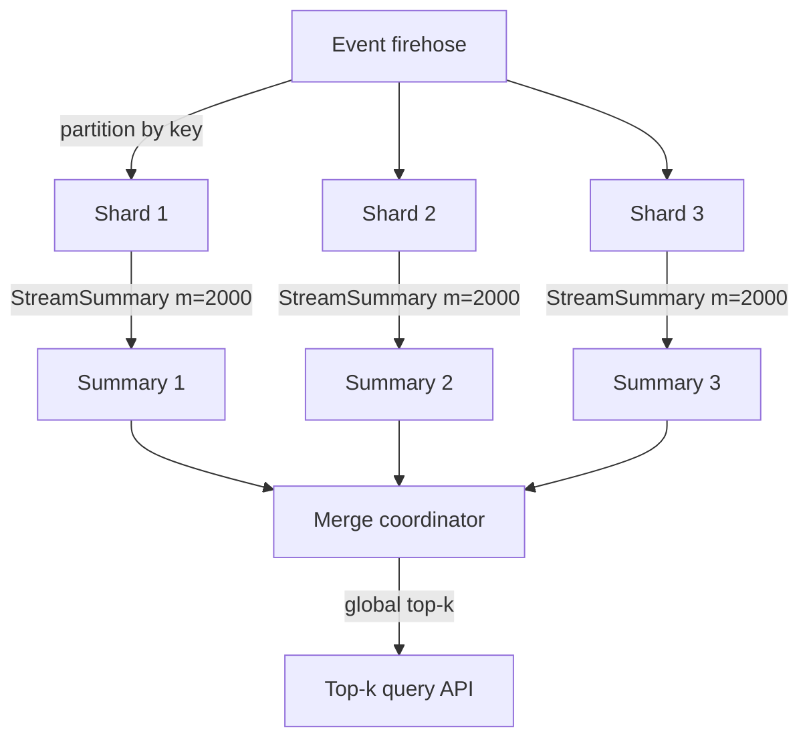
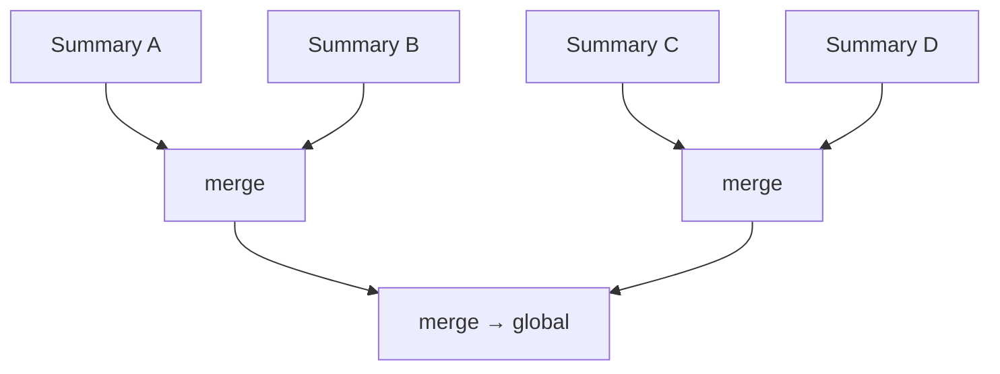
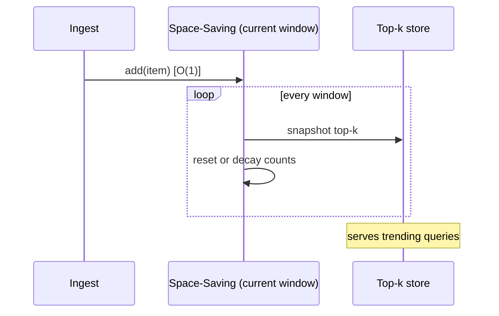

# Space-Saving Algorithm — Senior Level

> Space-Saving is rarely the bottleneck on one stream on one machine — but the moment you must find trending topics across a fleet, track hot keys to protect a cache, monitor heavy network flows at line rate, or **merge** per-shard summaries into a global top-k, every design choice (counter budget `m`, merge correctness, skew exploitation, accuracy SLOs, decay for "trending") becomes a system-correctness decision.

## Table of Contents
1. [Introduction](#1-introduction)
2. [System Design with Space-Saving](#2-system-design-with-space-saving)
3. [Mergeability for Distributed Streams](#3-mergeability-for-distributed-streams)
4. [Accuracy vs m and Skewed (Zipfian) Data](#4-accuracy-vs-m-and-skewed-zipfian-data)
5. [Comparison with Alternatives in Production](#5-comparison-with-alternatives-in-production)
6. [Architecture Patterns](#6-architecture-patterns)
7. [Code Examples](#7-code-examples)
8. [Observability](#8-observability)
9. [Failure Modes](#9-failure-modes)
10. [Summary](#10-summary)

---

## 1. Introduction

At the senior level the question is no longer "how does replace-the-min work" but "what system am I building, and what breaks when I scale it?". Space-Saving shows up in four production guises that share one engine:

1. **Trending / top-k** — "what are the most-searched queries, most-viewed videos, most-clicked products in the last window?" A few hundred to a few thousand counters per node, answered continuously.
2. **Hot-key detection for caching/sharding** — "which keys are hot right now?" so you can replicate them, give them their own cache tier, or rebalance shards to avoid a hot partition.
3. **Network / security monitoring** — "which source IPs, flows, or ports dominate traffic?" at line rate, to spot DDoS sources or heavy talkers.
4. **Distributed aggregation** — each shard keeps its own summary; a coordinator **merges** them into a global top-k without re-reading the raw stream.

All four reduce to: *keep `m` counters with the Stream-Summary, exploit data skew so a small `m` captures the heavy hitters, and (when distributed) merge summaries correctly.* This document treats those decisions in production terms.

The four senior-level decisions, recurring across all guises:

1. **Counter budget `m`** — sized to the accuracy SLO and the data skew, not guessed.
2. **Merge strategy** — how per-shard summaries combine, and what the merged error bound is.
3. **Windowing / decay** — fixed counts answer "all-time"; "trending" needs sliding windows or exponential decay.
4. **What to trust** — report guaranteed heavy hitters (`count - error > threshold`) vs raw top-k.

Get these four right and Space-Saving is fast, accurate, and distributable; get any wrong and you ship a "trending" list full of noise or a hot-key detector that misses the actual hot key.

---

## 2. System Design with Space-Saving



The pattern: shard the stream, run an independent Space-Saving summary per shard (constant memory each), and periodically merge the compact summaries — never the raw events — into a global answer. Because each summary is `O(m)` and merges are cheap, the whole pipeline's memory is bounded regardless of stream volume.

### Why Space-Saving fits streaming systems

- **Bounded memory** — a node with `m = 2000` counters uses the same RAM for a 1K/s or 1M/s stream.
- **`O(1)` per event** — keeps up with line-rate ingestion (Kafka consumers, packet capture).
- **Names the items** — the summary *is* the candidate set; no separate enumeration step (unlike Count-Min).
- **Mergeable** — the algebra of merging summaries is well-defined (Section 3), enabling map-reduce-style aggregation.

### Where it sits in a typical pipeline

In a streaming analytics stack (Kafka → stream processor → store), Space-Saving lives in the **stateful operator** layer: a Kafka consumer (or Flink/Spark Structured Streaming task) keyed by partition maintains a per-task summary, emits a top-k snapshot per window to a downstream store (Redis, a time-series DB), and a query API serves it. Because the summary is small and serializable, it checkpoints cheaply for fault tolerance — on task restart, the operator reloads the last summary rather than replaying the whole stream. This checkpoint-friendliness (bounded, serializable state) is a quiet but important reason Space-Saving suits exactly-once stream processors: large unbounded state is the enemy of fast recovery.

---

## 3. Mergeability for Distributed Streams

The killer feature for distributed systems: two Space-Saving summaries built on different parts of a stream can be **merged** into one summary that approximates the whole, without the raw data.

### The merge operation

Given summaries `S1` (over `n1` items) and `S2` (over `n2` items), each with `m` counters:

```
merge(S1, S2):
    combined = {}                        # item -> (count, error)
    for x in S1:  combined[x] = S1[x]
    for x in S2:
        if x in combined:
            combined[x].count += S2[x].count
            combined[x].error += S2[x].error
        else:
            combined[x] = S2[x]
    # keep the m items with the largest counts; the rest are folded into the floor:
    sort combined by count desc
    if len(combined) > m:
        # the (m+1)-th largest count becomes a baseline added to survivors' error
        floor = count of the (m+1)-th item
        drop everything beyond rank m
        for surviving x: x.error += ... (bound the dropped mass)
    return top-m of combined
```

The essential idea: **add per-item counts and errors where items coincide, union the rest, then truncate back to `m` counters**, charging the truncated mass into the error of the survivors so the over-estimate bound is preserved.

### The merged guarantee

A merged summary over `n = n1 + n2` items with `m` counters still satisfies:

```
f(x) ≤ count(x) ≤ f(x) + (n / m)      (approximately; the constant depends on the truncation rule)
```

So merging is **lossy but bounded** — the error grows by at most the per-summary floor, never unboundedly. Crucially, merge is **commutative and associative** (up to the truncation tie-breaking), so you can merge in any order / any tree shape — the foundation for hierarchical aggregation across racks, datacenters, or map-reduce stages.

| Merge property | Holds? | Why it matters |
|----------------|--------|----------------|
| Commutative | Yes (up to ties) | shard order does not matter |
| Associative | Yes (up to ties) | merge in any tree shape (hierarchical aggregation) |
| Bounded error growth | Yes | merged over-estimate stays `≤ ~n/m` |
| Preserves heavy hitters | Yes | global heavy hitters survive truncation |



### Sketch caveat: mergeable but not "freely" mergeable

Space-Saving merges are *bounded*, but each merge-and-truncate can lose a little accuracy that a fresh full pass would not. In contrast, a **Count-Min Sketch** merges *exactly* (just add the arrays cell-wise) with no truncation, which is why some teams pair Count-Min (for mergeable point queries) with Space-Saving (for naming the top items). Know the trade: Space-Saving names items and merges with bounded error; Count-Min merges exactly but cannot name items.

---

## 4. Accuracy vs m and Skewed (Zipfian) Data

### The skew is your friend

Real streams are **skewed**: a few items dominate (Zipf's law — the `i`-th most frequent item has frequency `∝ 1/i^z`). Search queries, web traffic, word frequencies, network flows — all heavily skewed. Space-Saving *thrives* on skew because:

- The heavy hitters quickly climb out of the eviction zone and stay there with near-exact counts.
- The churn (evictions) happens entirely among the long tail of rare items, which we do not care about.
- So a **small `m`** suffices to nail the top-k, even when distinct items number in the millions.

### Accuracy as a function of `m`

| `m` (counters) | Catches items above | Typical top-k accuracy (Zipf z≈1) |
|----------------|---------------------|-----------------------------------|
| `1/φ` | fraction `φ` of stream (guaranteed) | top items correct, some count error |
| `2/φ` … `4/φ` | same threshold, **tighter counts** | top-k order usually exact |
| `k · (1/φ)` | top-k with cushion | high-confidence top-k |

The guarantee says `m ≥ 1/φ` *keeps* every item above fraction `φ`; for accurate *counts and ordering*, over-provision (a common rule of thumb is `m ≈ 6/φ` to `10/φ`). On skewed data the realized error is far below the `n/m` worst case because the min stays tiny — the heavy hitters never near the eviction floor.

### Why skew makes the worst case irrelevant

The bound `error ≤ n/m` assumes the min could be as large as `n/m`. But under skew, the bottom `m` slots hold long-tail items each seen a handful of times, so the actual `min` is small — often single digits — making the realized over-count of the *heavy hitters* essentially zero. This is the empirical reason Space-Saving is reported as the most accurate top-k sketch on real data: the structure concentrates its (small) error on items you are discarding anyway.

### Uniform data is the adversary

If the stream is *uniform* (no heavy hitters), every item is roughly equally rare, the table churns constantly, and the output is mostly false positives. But that is the correct behavior — there *are* no heavy hitters to find. Detect this case by watching the head-bucket count: if even the max counts hover near `n/m`, there is no real skew and the top-k is not meaningful.

---

## 5. Comparison with Alternatives in Production

| Attribute | Space-Saving | Misra-Gries | Count-Min + heap | Lossy Counting |
|-----------|--------------|-------------|------------------|----------------|
| Per-event cost | `O(1)` | `O(1)` amortized | `O(depth)` | `O(1)` amortized |
| Memory | `O(m)` | `O(m)` | `O(width·depth)` + heap | `O((1/ε)log(εn))` |
| Names top items? | **Yes** | Yes | via the heap | Yes |
| Mergeable | bounded-error | bounded-error | **exact** (add arrays) | bounded |
| Top-k accuracy (skew) | **best** | good | good (heap-limited) | good |
| Point query any item? | only stored items | only stored items | **any item** | only stored |
| Production usage | Redis `TOPK` (RedisBloom), trending systems | textbook heavy hitters | DataSketches, telemetry | DB frequent-itemset |

**Choose Space-Saving when:** continuous **top-k** on skewed data with the best accuracy per byte, and you want the items named — trending, hot keys, heavy talkers.

**Choose Count-Min when:** you need point queries for *arbitrary* items and **exact** mergeability across many shards; accept that it does not name the frequent items by itself.

**Choose Misra-Gries when:** simplicity matters and an under-estimate is fine; note Space-Saving dominates it on top-k accuracy.

> Redis's `TOPK` data type (RedisBloom module) is a real-world Space-Saving-family implementation (HeavyKeeper, a Space-Saving descendant) used precisely for trending and hot-key detection — a senior signal that this is the production default for "what are the most frequent items."

---

## 6. Architecture Patterns

### Sliding window / decay for "trending"

Plain Space-Saving answers "all-time top-k." "Trending" wants *recent* top-k. Three approaches:

| Approach | How | Trade-off |
|----------|-----|-----------|
| **Tumbling windows** | reset the summary each window (e.g. hourly) | simple; loses cross-window continuity |
| **Sliding windows** | keep several sub-window summaries, merge a trailing set | smoother; more memory |
| **Exponential decay** | periodically scale all counts by a factor `< 1` | favors recent items; needs careful min/error scaling |



### Hot-key protection for caches

A cache fronting a database runs Space-Saving on the key stream. When a key's lower bound `count - error` crosses a hot-key threshold, the system **promotes** it (replicate across cache nodes, pin in a local tier, or split its shard) before it overloads a single node — turning a potential hot-partition incident into a proactive rebalance.

### Map-reduce / Spark aggregation

Each mapper/partition builds a summary (`O(m)`), reducers **merge** summaries (Section 3), and the driver reports the global top-k. Only compact summaries cross the network — the raw stream never leaves the partitions.

### Network monitoring at line rate

A packet-capture pipeline (e.g. detecting DDoS source IPs or heavy flows) runs Space-Saving on the source-IP / 5-tuple stream. The `O(1)` worst-case per-packet cost is the requirement here: a fixed per-packet budget with no occasional expensive operation (unlike a heap's `O(log m)` sift or a periodic rebuild) keeps the detector at line rate. When a flow's lower bound `count - error` crosses a threshold (e.g. > 1% of packets in the window), it is flagged as a heavy talker. Sketches are favored over exact per-flow tables because backbone routers see millions of concurrent flows — far more than any exact table could hold in fast memory (SRAM/TCAM).

### Decay correctness for "trending"

When applying exponential decay, scale **both** `count` and `error` by the same factor `λ`:

```
periodically:  for each slot x:  count(x) *= λ ;  error(x) *= λ
```

Scaling both preserves the bracket `count - error ≤ f_decayed ≤ count` for the *decayed* frequency (the time-weighted count). Scaling only `count` would break soundness. After decay the eviction floor shrinks, so a freshly trending item more easily enters and climbs — exactly the recency bias wanted. The trade-off: counts become floats (or fixed-point), and you must decide the decay cadence (per-item, per-time-tick) to match the "trending" half-life.

---

## 7. Code Examples

### 7.1 Go — mergeable summary with bracketed reporting

```go
package main

import (
	"fmt"
	"sort"
)

type slot struct{ count, err int }

// Summary is a simplified mergeable Space-Saving (map-backed for clarity).
type Summary struct {
	m     int
	slots map[string]slot
	n     int
}

func New(m int) *Summary { return &Summary{m: m, slots: map[string]slot{}} }

func (s *Summary) Add(key string) {
	s.n++
	if sl, ok := s.slots[key]; ok {
		sl.count++
		s.slots[key] = sl
		return
	}
	if len(s.slots) < s.m {
		s.slots[key] = slot{count: 1, err: 0}
		return
	}
	min, victim := 1<<62, ""
	for k, sl := range s.slots {
		if sl.count < min {
			min, victim = sl.count, k
		}
	}
	delete(s.slots, victim)
	s.slots[key] = slot{count: min + 1, err: min}
}

// Merge folds other into s, truncating back to m counters.
func (s *Summary) Merge(other *Summary) {
	combined := map[string]slot{}
	for k, v := range s.slots {
		combined[k] = v
	}
	for k, v := range other.slots {
		if c, ok := combined[k]; ok {
			combined[k] = slot{c.count + v.count, c.err + v.err}
		} else {
			combined[k] = v
		}
	}
	s.n += other.n
	type kv struct {
		key string
		sl  slot
	}
	all := make([]kv, 0, len(combined))
	for k, v := range combined {
		all = append(all, kv{k, v})
	}
	sort.Slice(all, func(i, j int) bool { return all[i].sl.count > all[j].sl.count })
	floor := 0
	if len(all) > s.m {
		floor = all[s.m].sl.count // (m+1)-th largest = truncation floor
		all = all[:s.m]
	}
	s.slots = map[string]slot{}
	for _, e := range all {
		e.sl.err += floor // charge dropped mass to survivors' error
		s.slots[e.key] = e.sl
	}
}

func (s *Summary) TopK(k int) []string {
	type kv struct {
		key string
		c   int
	}
	all := []kv{}
	for key, sl := range s.slots {
		all = append(all, kv{key, sl.count})
	}
	sort.Slice(all, func(i, j int) bool { return all[i].c > all[j].c })
	out := []string{}
	for i := 0; i < k && i < len(all); i++ {
		out = append(out, all[i].key)
	}
	return out
}

func main() {
	a, b := New(3), New(3)
	for _, x := range []string{"A", "A", "A", "B", "C"} {
		a.Add(x)
	}
	for _, x := range []string{"A", "B", "B", "D", "E"} {
		b.Add(x)
	}
	a.Merge(b)
	fmt.Println("global top-2:", a.TopK(2)) // A, B
}
```

### 7.2 Java — thread-safe per-shard summary

```java
import java.util.*;
import java.util.concurrent.locks.ReentrantLock;

public class ShardSummary {
    private final int m;
    private final Map<String, int[]> slots = new HashMap<>(); // key -> {count, error}
    private final ReentrantLock lock = new ReentrantLock();
    private long n = 0;

    public ShardSummary(int m) { this.m = m; }

    public void add(String key) {
        lock.lock();
        try {
            n++;
            int[] sl = slots.get(key);
            if (sl != null) { sl[0]++; return; }
            if (slots.size() < m) { slots.put(key, new int[]{1, 0}); return; }
            String victim = null; int min = Integer.MAX_VALUE;
            for (var e : slots.entrySet())
                if (e.getValue()[0] < min) { min = e.getValue()[0]; victim = e.getKey(); }
            slots.remove(victim);
            slots.put(key, new int[]{min + 1, min});
        } finally { lock.unlock(); }
    }

    // Returns items whose guaranteed lower bound exceeds threshold (no false positives).
    public List<String> guaranteedHeavy(long threshold) {
        lock.lock();
        try {
            List<String> out = new ArrayList<>();
            for (var e : slots.entrySet())
                if (e.getValue()[0] - e.getValue()[1] > threshold) out.add(e.getKey());
            return out;
        } finally { lock.unlock(); }
    }

    public static void main(String[] args) {
        ShardSummary s = new ShardSummary(3);
        for (String x : List.of("A","A","A","A","B","C","D")) s.add(x);
        System.out.println("guaranteed heavy (>1): " + s.guaranteedHeavy(1)); // [A]
    }
}
```

### 7.3 Python — sliding window via tumbling sub-summaries

```python
from collections import deque


class SlidingTopK:
    """Trending top-k over the last W windows using tumbling sub-summaries."""

    def __init__(self, m, windows=4):
        self.m = m
        self.windows = windows
        self.subs = deque([{}], maxlen=windows)  # each sub: key -> [count, error]

    def add(self, key):
        cur = self.subs[-1]
        if key in cur:
            cur[key][0] += 1
        elif len(cur) < self.m:
            cur[key] = [1, 0]
        else:
            victim = min(cur, key=lambda k: cur[k][0])
            mn = cur[victim][0]
            del cur[victim]
            cur[key] = [mn + 1, mn]

    def roll(self):
        """Advance to a new window; old windows fall off the deque."""
        self.subs.append({})

    def top_k(self, k):
        merged = {}
        for sub in self.subs:
            for key, (c, e) in sub.items():
                if key in merged:
                    merged[key][0] += c
                    merged[key][1] += e
                else:
                    merged[key] = [c, e]
        ranked = sorted(merged.items(), key=lambda kv: kv[1][0], reverse=True)
        return [(k_, c) for k_, (c, e) in ranked[:k]]


if __name__ == "__main__":
    s = SlidingTopK(m=3, windows=2)
    for x in "AAABC":
        s.add(x)
    s.roll()
    for x in "ABBDE":
        s.add(x)
    print("trending top-2:", s.top_k(2))
```

---

## 8. Observability

| Metric | Why / Alert threshold |
|--------|------------------------|
| `head_bucket_count` (current min) | the realized over-count bound; if it approaches `n/m`, skew is weak / `m` too small |
| `eviction_rate` | high churn → long tail dominating; expected, but spikes can mean `m` too small |
| `top_k_stability` (Jaccard vs last window) | sudden churn in the top-k may signal real trend shift or noise |
| `slot_occupancy` (`size / m`) | `< 1` means distinct items `< m` → counts are *exact* |
| `merge_error_growth` | over-count added per merge; bound it to keep global accuracy |
| `guaranteed_vs_reported` | fraction of top-k that pass `count - error > threshold` (the trustworthy ones) |

The single most useful signal is the **head-bucket (min) count vs `n/m`**: it directly bounds the error and reveals whether the data is skewed enough for the answer to be meaningful.

### Capacity planning

Sizing `m` is a memory/accuracy trade you can compute up front:

| Target | Rule | Example (`φ = 0.1%`) |
|--------|------|----------------------|
| Keep all items above fraction `φ` | `m ≥ 1/φ` | `m ≥ 1000` |
| Accurate counts for heavy hitters | `m ≈ 6/φ` to `10/φ` | `m ≈ 6000–10000` |
| Top-k with cushion | `m ≈ c · k / φ` | scale by `k` |

Each counter is a small fixed record (key + two integers + a few pointers), so even `m = 10^5` is well under a megabyte — `m` is essentially free relative to the value of an accurate top-k, which is why over-provisioning is the default senior move. The cost that *does* scale is the top-k report sort (`O(m log m)`), so report periodically, not per event.

---

## 9. Failure Modes

- **`m` too small for the skew** — heavy hitters near the threshold get evicted; symptom: noisy top-k, high min. Fix: raise `m` (cheap — `O(m)` memory).
- **Reporting raw top-k as truth** — long-tail false positives leak in. Fix: report only `count - error > threshold` for guarantees.
- **Uniform / no-skew stream** — constant churn, meaningless top-k. Fix: detect via min ≈ max and signal "no heavy hitters."
- **Merge without truncation accounting** — error bound silently violated. Fix: charge the truncation floor into survivors' error.
- **All-time counts for a "trending" use case** — old hits dominate forever. Fix: windowing or decay.
- **Hot-key feedback loop** — promoting a hot key changes the stream, which changes the detector. Fix: hysteresis / cooldown on promotion.
- **Unbounded distinct keys with tiny `m`** — everything churns. Fix: size `m` from the expected number of heavy hitters, not the distinct-item count.

---

### Per-shard over-provisioning vs merge recovery

A recurring distributed-systems mistake is to under-size `m` per shard and *hope* the merge recovers split heavy hitters. It cannot: if a globally heavy item is split thinly across many shards and falls below each shard's eviction floor, every shard evicts it and no count survives to merge. The fix is structural — size each shard's `m` so that any *globally* heavy item is also *locally* above the floor with margin:

| Scenario | Symptom | Fix |
|----------|---------|-----|
| Item heavy globally, present on one shard | merge recovers it cleanly | none needed |
| Item heavy globally, spread evenly over `P` shards | each shard sees `f/P`; may be below local floor → all evict | raise per-shard `m` to `~6·P/φ`, or pre-aggregate by partitioning on the key (route same key to same shard) |
| Item heavy on a few shards, absent on rest | recovered from the shards that hold it | none needed |

The cleanest cure is **key-affinity partitioning**: route each key to a deterministic shard (hash partitioning) so a heavy key's mass concentrates on one summary rather than diffusing — then a modest per-shard `m` suffices and the merge is near-lossless. When key-affinity is impossible (e.g. round-robin load balancers), over-provision per shard by the fan-out factor `P`.

### Comparison: where each top-k system lives

| Use case | Stream | `m` budget | Windowing | Merge needed? |
|----------|--------|-----------|-----------|---------------|
| Trending searches/videos | query/view IDs | `~6/φ` (few K) | sliding / decay | yes (per-region → global) |
| Hot-key cache protection | cache keys | `~1/φ` (hundreds) | short sliding | usually no (per-node) |
| Heavy network flows / DDoS | src IP / 5-tuple | few K | tumbling per epoch | yes (per-router → SOC) |
| Frequent log/error signatures | error templates | hundreds | tumbling | per-host → fleet |

## 10. Summary

- **System fit:** Space-Saving gives bounded `O(m)` memory and `O(1)` per-event cost, names the frequent items directly, and is the production default for **trending, hot-key detection, and network monitoring** (e.g. Redis `TOPK`).
- **Mergeability:** per-shard summaries combine by **adding counts and errors, unioning, then truncating to `m`** — commutative, associative, with bounded error growth — enabling hierarchical / map-reduce aggregation over distributed streams. Count-Min merges *exactly* but cannot name items; pair them when you need both.
- **Skew is the ally:** on Zipfian data the heavy hitters climb out of the eviction zone and the (tiny) error concentrates on the long tail you discard — so a small `m` (`~6/φ` to `10/φ`) gives near-exact top-k, far better than the `n/m` worst case.
- **Accuracy vs `m`:** `m ≥ 1/φ` *guarantees* keeping items above fraction `φ`; over-provision for accurate counts and ordering. Watch the head-bucket count as the live error bound.
- **Trust the lower bound:** report `count - error > threshold` for false-positive-free heavy hitters; raw top-k may include long-tail noise.
- **Windowing for "trending":** plain counts are all-time; use tumbling/sliding windows or exponential decay for recency.

### Decision summary

- **Continuous top-k on skewed data, name the items** → Space-Saving (Stream-Summary), `m ≈ 6/φ`.
- **Distributed top-k across shards** → per-shard Space-Saving + merge; or Count-Min for exact merge + a heap to name items.
- **Hot-key cache protection** → Space-Saving on the key stream, promote on `count - error > hot_threshold` with hysteresis.
- **Trending (recency matters)** → Space-Saving + windowing/decay.
- **Need point queries for arbitrary items** → Count-Min Sketch, not Space-Saving.

### Production checklist

- [ ] Size `m` from the accuracy SLO and data skew, not guessed.
- [ ] Report guaranteed heavy hitters via `count - error > threshold`.
- [ ] Use the Stream-Summary for `O(1)`, not a min-scan.
- [ ] Implement merge with truncation-error accounting for distributed aggregation.
- [ ] Add windowing/decay for any "trending" (recency) use case.
- [ ] Monitor head-bucket (min) count, eviction rate, and top-k stability.

---

Next step: [professional.md](./professional.md) — formal proofs of the over-estimate bound and heavy-hitter guarantee, why Space-Saving beats Misra-Gries for top-k, Stream-Summary correctness/complexity, and merge correctness.
