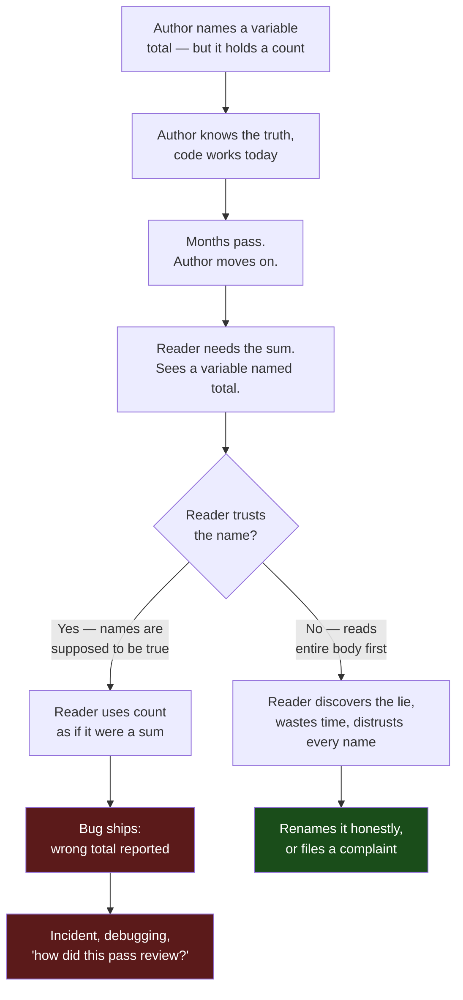

# Meaningful Names — Find the Bug

> 12 snippets where the name lies. A misleading name is not a style nit — it is a defect waiting to happen. When `total` is really a count, when `users` is silently deduped to a set, when `isEnabled` means the opposite of what it says, the compiler stays quiet and the bug ships. Read each snippet critically, decide what is wrong, then open the answer.

---

## Table of Contents

1. [How to Use](#how-to-use)
2. [The Lying-Name Failure Loop](#the-lying-name-failure-loop)
3. [Snippet 1 — `isEnabled` that means disabled (Go)](#snippet-1--isenabled-that-means-disabled-go)
4. [Snippet 2 — `total` that is really a count (Python)](#snippet-2--total-that-is-really-a-count-python)
5. [Snippet 3 — `getUser` that mutates (Java)](#snippet-3--getuser-that-mutates-java)
6. [Snippet 4 — `users` list that is silently a Set (Python)](#snippet-4--users-list-that-is-silently-a-set-python)
7. [Snippet 5 — `last` index vs `count` off-by-one (Go)](#snippet-5--last-index-vs-count-off-by-one-go)
8. [Snippet 6 — `timeout` in seconds, used as milliseconds (Java)](#snippet-6--timeout-in-seconds-used-as-milliseconds-java)
9. [Snippet 7 — `validate` that also saves (Python)](#snippet-7--validate-that-also-saves-python)
10. [Snippet 8 — `temperature` already in Fahrenheit (Go)](#snippet-8--temperature-already-in-fahrenheit-go)
11. [Snippet 9 — `copy` that aliases (Python)](#snippet-9--copy-that-aliases-python)
12. [Snippet 10 — `min` and `max` swapped at the call site (Java)](#snippet-10--min-and-max-swapped-at-the-call-site-java)
13. [Snippet 11 — `isValid` negated by accident (Go)](#snippet-11--isvalid-negated-by-accident-go)
14. [Snippet 12 — `amount` in dollars vs cents (Python)](#snippet-12--amount-in-dollars-vs-cents-python)
15. [Scorecard](#scorecard)
16. [Related Topics](#related-topics)

---

## How to Use

Each snippet is a small, self-contained piece of code. Before expanding the answer:

1. **Read the name first, the body second.** Ask what each identifier *promises*. `getX` promises no side effects. `total` promises a sum, not a count. `isEnabled` promises `true` means on.
2. **Read the body and check the promise.** Does the code keep it? A name that disagrees with its body is the bug — or it will cause one the moment a second person trusts the name without reading the body.
3. **Predict the concrete failure.** Not "this is confusing" — name the defect: the wrong number charged, the off-by-one crash, the silent data loss, the mutated input.
4. **Write the fix.** Usually rename to tell the truth, or change the code to match the honest name. Sometimes a type makes the lie impossible.

Difficulty is marked per snippet: **Warm-up** / **Standard** / **Sharp**. Snippets rotate across Go, Python, and Java. Cover the answer block and commit to a diagnosis before reading it — passive reading teaches nothing.

---

## The Lying-Name Failure Loop

A misleading name does not fail at the moment it is written. The author knows what the variable really holds. It fails later, when a second reader trusts the name and never checks the body.



The fix is always the same shape: make the name tell the truth, or change the code to match the honest name. A name is a contract. A lying contract is a liability.

---

## Snippet 1 — `isEnabled` that means disabled (Go)

**Difficulty:** Warm-up

```go
type FeatureFlag struct {
    Name      string
    isEnabled bool // set from config column "suppressed"
}

func loadFlag(row ConfigRow) FeatureFlag {
    return FeatureFlag{
        Name:      row.Name,
        isEnabled: row.Suppressed, // column is true when the feature is OFF
    }
}

func (f FeatureFlag) ShouldShow() bool {
    return f.isEnabled
}
```

**What's wrong?**

<details><summary>Answer</summary>

The field is named `isEnabled`, but it is loaded from a `Suppressed` column where `true` means the feature is **turned off**. The name asserts the exact opposite of the value it holds.

**The concrete bug:** `ShouldShow()` returns `f.isEnabled`, which is really "is suppressed." Every feature that should be hidden gets shown, and every feature that should be shown gets hidden. The flag does the reverse of its purpose — the worst possible outcome for a feature flag.

**Why it hid:** `isEnabled` reads so naturally that no reviewer questions `return f.isEnabled` in `ShouldShow()`. The lie lives at the load site (`isEnabled: row.Suppressed`), three lines away from where it does damage.

**Fix — make the name match the source of truth, then negate once, explicitly:**

```go
type FeatureFlag struct {
    Name       string
    suppressed bool
}

func loadFlag(row ConfigRow) FeatureFlag {
    return FeatureFlag{Name: row.Name, suppressed: row.Suppressed}
}

func (f FeatureFlag) ShouldShow() bool {
    return !f.suppressed
}
```

Now the single negation is visible and intentional. The name `suppressed` matches the column, and `ShouldShow` reads as "show when not suppressed." Boolean names must point the same direction as the data behind them.
</details>

---

## Snippet 2 — `total` that is really a count (Python)

**Difficulty:** Warm-up

```python
def summarize_orders(orders):
    total = 0
    for order in orders:
        if order.status == "completed":
            total += 1
    return {
        "total": total,
        "average_order_value": revenue(orders) / total,
    }
```

**What's wrong?**

<details><summary>Answer</summary>

`total` is incremented by `1` per completed order — it is a **count of completed orders**, not a sum of anything monetary. The name `total` invites every reader to treat it as a money amount.

**The concrete bug:** `average_order_value` is computed as `revenue(orders) / total`. The author may have meant "average over completed orders," which happens to be correct here — but the dashboard consuming `result["total"]` will almost certainly render it as "Total Revenue: $12" when it is really "12 completed orders." A downstream report that does `result["total"] * tax_rate` produces nonsense. The name has already caused a misuse the moment it crossed a module boundary.

**Why it hid:** `total` is one of the most overloaded names in programming. It is plausible as a sum, a count, a grand total, a running tally. Without a noun, it means nothing precise.

**Fix — name the thing it counts:**

```python
def summarize_orders(orders):
    completed_count = sum(1 for o in orders if o.status == "completed")
    return {
        "completed_count": completed_count,
        "average_order_value": revenue(orders) / completed_count if completed_count else 0,
    }
```

`completed_count` cannot be mistaken for revenue. As a bonus, the empty-orders division-by-zero becomes visible the instant you have to think about what `completed_count` means.
</details>

---

## Snippet 3 — `getUser` that mutates (Java)

**Difficulty:** Standard

```java
public class SessionManager {
    private final Map<String, User> cache = new HashMap<>();

    public User getUser(String sessionId) {
        User user = cache.get(sessionId);
        if (user == null) {
            user = database.loadUser(sessionId);
            cache.put(sessionId, user);
        }
        user.setLastAccessed(Instant.now()); // touch on every read
        return user;
    }
}

// Caller in an audit job:
for (String id : allSessionIds) {
    User u = sessionManager.getUser(id);
    auditReport.record(u.getName(), u.getLastAccessed());
}
```

**What's wrong?**

<details><summary>Answer</summary>

`getUser` looks like a pure accessor — the `get` prefix is a near-universal promise of "read, no side effects." But it **mutates**: it populates a cache, and worse, it sets `lastAccessed` to *now* on every call.

**The concrete bug:** the audit job iterates all sessions and records `u.getLastAccessed()`. Because `getUser` rewrites `lastAccessed` to the current time on read, the audit report shows every user as "last accessed = the moment the audit ran." The very act of auditing destroys the data being audited. Idle-session cleanup that relies on `lastAccessed` will also never expire anything, because reading a session keeps it alive forever.

**Why it hid:** `get` told the audit author "this is safe to call in a loop, it just reads." Nobody reads the body of a getter. The mutation hides behind a name that explicitly promises no mutation.

**Fix — split the read from the write, and name each honestly:**

```java
public User lookupUser(String sessionId) {        // pure-ish: cache fill only, no business mutation
    return cache.computeIfAbsent(sessionId, database::loadUser);
}

public void touchSession(String sessionId) {      // the side effect, named for what it does
    lookupUser(sessionId).setLastAccessed(Instant.now());
}
```

The audit job calls `lookupUser` and observes real `lastAccessed` values. Live request handling calls `touchSession`. The `get`/`lookup` family must never carry a surprise mutation; if a method changes state, its name must say so.
</details>

---

## Snippet 4 — `users` list that is silently a Set (Python)

**Difficulty:** Standard

```python
def notify_active_users(events):
    users = set()
    for event in events:
        users.add(event.user_id)

    sms_provider.send_batch(users)         # billed per recipient
    return {"users_notified": len(users)}

# events may contain the same user_id many times:
#   user 42 triggered 9 events today
```

**What's wrong?**

<details><summary>Answer</summary>

The variable is named `users`, suggesting the full list of user references from the events. It is actually a `set` of `user_id`s, which **silently deduplicates**. That dedup may be exactly right or catastrophically wrong depending on intent — and the name hides which.

**The concrete bug — two faces:**

- If the requirement is "notify each user once," the `set` is correct, but `users_notified` is a misleading key for a count of *unique* users; a billing reconciliation that compares `users_notified` against the SMS provider's per-message charges will not line up if anyone expected one message per event.
- If the requirement was "send one SMS per event" (e.g., per-order shipping alerts), the dedup is a **data-loss bug**: user 42 gets one SMS for nine shipped orders. The name `users` gave no hint that collapsing nine events into one was happening.

**Why it hid:** `users = set()` reads as "the users," and `len(users)` reads as "how many users." Neither the name nor the count signals that duplicates were dropped on the way in.

**Fix — name the collection for what it is, and make the dedup a decision, not an accident:**

```python
def notify_active_users(events):
    unique_user_ids = {event.user_id for event in events}   # dedup is now intentional and named
    sms_provider.send_batch(unique_user_ids)
    return {"unique_users_notified": len(unique_user_ids)}
```

`unique_user_ids` announces both the element type (ids, not user objects) and the dedup. A reviewer who expected one-message-per-event will now spot the mismatch immediately, instead of discovering it from an angry customer.
</details>

---

## Snippet 5 — `last` index vs `count` off-by-one (Go)

**Difficulty:** Sharp

```go
func RingBufferAverage(samples []float64) float64 {
    last := len(samples) // intended: index of the last element
    sum := 0.0
    for i := 0; i <= last; i++ {
        sum += samples[i]
    }
    return sum / float64(last)
}
```

**What's wrong?**

<details><summary>Answer</summary>

`last` is named as if it holds the **index of the last element**, but it is assigned `len(samples)`, which is the **count** of elements. For a slice of length `n`, the last valid index is `n-1`, not `n`. The name and the value describe two different quantities.

**The concrete bug:** two defects fall out of the one lie.

1. The loop `for i := 0; i <= last; i++` runs `i` from `0` to `len(samples)` inclusive. At `i == len(samples)` it does `samples[len(samples)]` — an **out-of-range panic** that crashes the program.
2. Even if the loop bound were patched to `< last`, the average is computed as `sum / float64(last)` where `last == len(samples)` — which is the correct denominator only because `last` is secretly a count. The author who later "fixes" the loop to use `last` as an index will then divide by the wrong number.

**Why it hid:** `last` strongly implies "last index." The author used it as a count. The two readings differ by exactly one — the classic off-by-one, baked into a name.

**Fix — name it for what it is, and derive the index explicitly:**

```go
func RingBufferAverage(samples []float64) float64 {
    count := len(samples)
    if count == 0 {
        return 0
    }
    sum := 0.0
    for i := 0; i < count; i++ {
        sum += samples[i]
    }
    return sum / float64(count)
}
```

`count` is the length; the loop uses `i < count`; the divisor is `count`. There is no `last` to confuse with an index. When you do need the final index, write `lastIndex := count - 1` so the subtraction — the source of every off-by-one — is named and visible.
</details>

---

## Snippet 6 — `timeout` in seconds, used as milliseconds (Java)

**Difficulty:** Standard

```java
public class HttpClientFactory {
    // default request timeout
    private static final int timeout = 30; // seconds

    public HttpClient build() {
        return HttpClient.newBuilder()
            .connectTimeout(Duration.ofMillis(timeout))
            .build();
    }
}
```

**What's wrong?**

<details><summary>Answer</summary>

`timeout` holds the value `30` and a comment says "seconds." It is then passed to `Duration.ofMillis(timeout)`, which interprets `30` as **30 milliseconds**. The name carries no unit, so nothing stops the seconds value from being read as milliseconds.

**The concrete bug:** the intended 30-second connect timeout becomes a 30-millisecond timeout. On any real network the connection cannot complete in 30 ms, so nearly every request fails with a timeout exception. The service appears completely broken under normal latency, and the cause — a unit mismatch hidden in an unnamed unit — is maddening to find because the literal `30` *looks* reasonable next to the word `timeout`.

**Why it hid:** `timeout` is a quantity with a unit, but the name omits the unit and offloads it to a comment. Comments do not participate in the call `ofMillis(timeout)`; only the bare integer does.

**Fix — put the unit in the name, or better, in the type:**

```java
private static final int connectTimeoutSeconds = 30;

public HttpClient build() {
    return HttpClient.newBuilder()
        .connectTimeout(Duration.ofSeconds(connectTimeoutSeconds))
        .build();
}
```

Best of all, hold a `Duration` directly so no unit can be misread:

```java
private static final Duration CONNECT_TIMEOUT = Duration.ofSeconds(30);
// ...
.connectTimeout(CONNECT_TIMEOUT)
```

A `Duration` is unit-safe by construction; `ofMillis` versus `ofSeconds` is decided once, at the source, where the human intent lives.
</details>

---

## Snippet 7 — `validate` that also saves (Python)

**Difficulty:** Sharp

```python
def validate_registration(form):
    if not form.email:
        raise ValueError("email required")
    if not form.password or len(form.password) < 8:
        raise ValueError("weak password")

    user = User(email=form.email)
    user.set_password(form.password)
    db.session.add(user)
    db.session.commit()   # persists immediately
    return user

# Caller: a "check before showing step 2" handler
def on_continue_clicked(form):
    try:
        validate_registration(form)   # author thinks: just checking
        show_step_two(form)
    except ValueError as e:
        show_error(e)
```

**What's wrong?**

<details><summary>Answer</summary>

`validate_registration` is named as a pure check — `validate` promises "tell me if this is OK, change nothing." But the body **creates and commits a user to the database**. The name conceals a permanent write.

**The concrete bug:** the caller `on_continue_clicked` calls `validate_registration` purely to gate a UI transition to step two, fully trusting that "validating" is harmless. In reality, every click of *Continue* inserts a new user row and commits it. The user is registered before they finish the form, before they accept terms, before the final submit. Click Continue twice and you get a duplicate-key error or two accounts. The name `validate` invited exactly this misuse.

**Why it hid:** `validate` is one of the strongest "read-only" promises in the vocabulary, right next to `get`, `is`, and `check`. No caller expects a `validate_*` function to write to the database.

**Fix — separate validation from persistence; let names tell the truth:**

```python
def validate_registration(form):
    """Pure check. Raises on invalid input. Writes nothing."""
    if not form.email:
        raise ValueError("email required")
    if not form.password or len(form.password) < 8:
        raise ValueError("weak password")

def register_user(form):
    """Validates, then persists. The name announces the write."""
    validate_registration(form)
    user = User(email=form.email)
    user.set_password(form.password)
    db.session.add(user)
    db.session.commit()
    return user
```

The UI gate calls `validate_registration` and nothing is written. Final submit calls `register_user`. A verb like `validate`, `check`, or `is_*` must never hide a mutation; if it persists, name it `save_*`, `register_*`, or `create_*`.
</details>

---

## Snippet 8 — `temperature` already in Fahrenheit (Go)

**Difficulty:** Standard

```go
func celsiusToFahrenheit(c float64) float64 {
    return c*9/5 + 32
}

func formatWeather(sensor Sensor) string {
    temperature := sensor.ReadFahrenheit() // sensor reports °F
    display := celsiusToFahrenheit(temperature)
    return fmt.Sprintf("%.0f°F", display)
}
```

**What's wrong?**

<details><summary>Answer</summary>

`temperature` holds a value that is **already in Fahrenheit** (`sensor.ReadFahrenheit()`), but the unitless name `temperature` lets it be fed into `celsiusToFahrenheit` as if it were Celsius.

**The concrete bug:** a real 72 °F reading becomes `72*9/5 + 32 = 161.6`, displayed as "162°F." The weather widget reports tropical-storm-grade heat on a mild day. Worse, the value is then labeled `°F`, so nothing looks obviously wrong until someone notices the numbers are absurd. The double-application of a conversion is invisible because `temperature` does not say which scale it is in.

**Why it hid:** `temperature` is a bare physical quantity with no unit. Both the input (`temperature`) and the converter's parameter (`c`) are plain `float64`, so the compiler is indifferent to mixing scales.

**Fix — encode the unit in the name, ideally in the type:**

```go
type Fahrenheit float64
type Celsius float64

func (c Celsius) ToFahrenheit() Fahrenheit {
    return Fahrenheit(c*9/5 + 32)
}

func formatWeather(sensor Sensor) string {
    tempF := Fahrenheit(sensor.ReadFahrenheit())
    return fmt.Sprintf("%.0f°F", float64(tempF))
}
```

With distinct types, `Fahrenheit.ToFahrenheit()` does not exist — the erroneous conversion stops compiling. Even short of full types, naming the variable `tempF` instead of `temperature` makes `celsiusToFahrenheit(tempF)` read as the contradiction it is.
</details>

---

## Snippet 9 — `copy` that aliases (Python)

**Difficulty:** Sharp

```python
def apply_discount(cart, percent):
    cart_copy = cart                 # "work on a copy, leave the original alone"
    for item in cart_copy["items"]:
        item["price"] *= (1 - percent / 100)
    return cart_copy

original = {"items": [{"name": "book", "price": 100.0}]}
discounted = apply_discount(original, 10)

print(original["items"][0]["price"])    # expected 100.0
print(discounted["items"][0]["price"])  # expected 90.0
```

**What's wrong?**

<details><summary>Answer</summary>

`cart_copy = cart` does **not** make a copy. In Python, assignment binds a new name to the same object. `cart_copy` is the same dict as `cart`, and its nested `items` are the same list of the same dicts. The name `cart_copy` promises an independent duplicate; it delivers an alias.

**The concrete bug:** mutating `item["price"]` through `cart_copy` mutates the caller's `original` too. Both prints show `90.0`. The "discounted" cart and the "original" cart are one object. Any code that later relies on `original` to hold pre-discount prices — an audit log, a "you saved $X" line, a rollback — reads corrupted data. The name `cart_copy` is precisely what lulled the author into thinking the original was safe.

**Why it hid:** the name `cart_copy` *asserts* a copy. A reader scanning the function sees "copy" and stops worrying about aliasing — which is the one thing they should worry about.

**Fix — actually copy, and let the name be true:**

```python
import copy

def apply_discount(cart, percent):
    discounted = copy.deepcopy(cart)   # real independent copy
    for item in discounted["items"]:
        item["price"] *= (1 - percent / 100)
    return discounted
```

`copy.deepcopy` produces a genuinely separate structure, so `original` is untouched. If you truly intend to mutate in place, name the variable `cart` and document the mutation — never name an alias `*_copy`.
</details>

---

## Snippet 10 — `min` and `max` swapped at the call site (Java)

**Difficulty:** Standard

```java
public List<Product> findInPriceRange(double min, double max) {
    return products.stream()
        .filter(p -> p.getPrice() >= min && p.getPrice() <= max)
        .collect(Collectors.toList());
}

// Caller — search form passes the upper bound first by mistake:
double ceiling = form.getMaxPrice();   // e.g. 500
double floor   = form.getMinPrice();   // e.g. 50
List<Product> results = findInPriceRange(ceiling, floor);
```

**What's wrong?**

<details><summary>Answer</summary>

`findInPriceRange(double min, double max)` takes two `double`s distinguished only by parameter order. The caller passes `(ceiling, floor)` — the **maximum** into the `min` slot and the **minimum** into the `max` slot. The names inside the method are correct; the names cannot defend the call site.

**The concrete bug:** the filter becomes `price >= 500 && price <= 50`, which no product satisfies. The search silently returns an empty list. The user typed a valid range (50–500) and is told "no products found." There is no exception, no log line — just a wrong, plausible-looking empty result, the hardest kind of bug to notice.

**Why it hid:** two adjacent `double` parameters are positionally interchangeable. The method's parameter names (`min`, `max`) are invisible at the call site, where only argument order matters, and the local variables (`ceiling`, `floor`) actively encourage the wrong order.

**Fix — make the order impossible to get wrong, or impossible to misorder silently:**

```java
public record PriceRange(double min, double max) {
    public PriceRange {
        if (min > max) {
            throw new IllegalArgumentException(
                "min (" + min + ") must not exceed max (" + max + ")");
        }
    }
}

public List<Product> findInPriceRange(PriceRange range) {
    return products.stream()
        .filter(p -> p.getPrice() >= range.min() && p.getPrice() <= range.max())
        .collect(Collectors.toList());
}
```

Now `new PriceRange(500, 50)` throws at construction with a clear message, turning a silent empty result into a loud, immediate failure at the exact line where the mistake was made. The named record fields also force the caller to think "which is min, which is max" instead of guessing argument order.
</details>

---

## Snippet 11 — `isValid` negated by accident (Go)

**Difficulty:** Sharp

```go
func isValidCoupon(code string, now time.Time) bool {
    coupon, err := repo.Find(code)
    if err != nil {
        return false
    }
    // expired or not yet active → still "valid" here?
    return now.Before(coupon.StartsAt) || now.After(coupon.ExpiresAt)
}

func applyCoupon(order *Order, code string) error {
    if !isValidCoupon(code, time.Now()) {
        return errors.New("coupon not valid")
    }
    order.Discount = lookupDiscount(code)
    return nil
}
```

**What's wrong?**

<details><summary>Answer</summary>

`isValidCoupon` is named to return `true` when a coupon **is valid** — i.e., currently usable. But its body returns `now.Before(coupon.StartsAt) || now.After(coupon.ExpiresAt)`, which is `true` exactly when the coupon is **outside** its active window — not yet started or already expired. The function returns "valid" for invalid coupons and "invalid" for valid ones.

**The concrete bug:** `applyCoupon` does `if !isValidCoupon(...)` and rejects when the function returns `false`. Because the logic is inverted, the function returns `false` for coupons that *are* within their window — so legitimate, in-date coupons are rejected, and expired or future coupons sail through and apply a discount. Customers lose money they were owed, and the company loses money on dead coupons. The boolean's name and its logic point in opposite directions.

**Why it hid:** the name `isValid` is so authoritative that a reviewer reads `if !isValidCoupon(...)` as obviously correct and never re-derives the boolean expression. The inverted condition is a one-line logic slip wearing a trustworthy name.

**Fix — write the predicate so the name and the logic agree:**

```go
func isCouponActive(coupon Coupon, now time.Time) bool {
    return !now.Before(coupon.StartsAt) && !now.After(coupon.ExpiresAt)
}

func applyCoupon(order *Order, code string) error {
    coupon, err := repo.Find(code)
    if err != nil || !isCouponActive(coupon, time.Now()) {
        return errors.New("coupon not valid")
    }
    order.Discount = lookupDiscount(code)
    return nil
}
```

`isCouponActive` returns `true` precisely when `now` is within `[StartsAt, ExpiresAt]`. Naming the predicate after the concrete condition it tests ("active," with a clear window) makes it far easier to verify the logic matches the name than the vague, easily-inverted `isValid`.
</details>

---

## Snippet 12 — `amount` in dollars vs cents (Python)

**Difficulty:** Standard

```python
def charge(payment_gateway, amount):
    # gateway.charge expects an integer number of cents
    return payment_gateway.charge(cents=amount)

# Caller, reading a price from the catalog:
price = product.price          # 19.99, a dollar amount as a float
receipt = charge(gateway, price)
```

**What's wrong?**

<details><summary>Answer</summary>

`amount` carries no unit. The gateway expects **cents** as an integer, but the caller passes `19.99`, a **dollar** float. The name `amount` is equally compatible with both readings, so nothing flags the mismatch.

**The concrete bug:** `payment_gateway.charge(cents=19.99)` either charges 19.99 cents (i.e., 20 cents instead of $19.99 — the company loses 99% of revenue) or, if the gateway coerces to int, charges 19 cents, or rejects the float. Run it the other way — a function expecting dollars but handed cents — and a $19.99 item bills the customer $1,999. Either direction is a financial incident, and the only thing standing between correct and catastrophic is whether everyone remembered which unit `amount` meant.

**Why it hid:** money is a quantity with a unit, and `amount` discards the unit. The float `19.99` looks like dollars to a human and gets handed to a parameter that silently means cents.

**Fix — encode the unit in the name and the type, and convert at the boundary:**

```python
def charge(payment_gateway, amount_cents: int):
    if not isinstance(amount_cents, int):
        raise TypeError("amount_cents must be an integer number of cents")
    return payment_gateway.charge(cents=amount_cents)

def dollars_to_cents(dollars: float) -> int:
    return round(dollars * 100)

# Caller:
receipt = charge(gateway, dollars_to_cents(product.price))
```

`amount_cents` states the unit, the `int` guard rejects a stray float, and `dollars_to_cents` makes the conversion an explicit, named step at the boundary. For real systems, hold money in a dedicated `Money` type (integer minor units plus currency) so a unit can never be implied by a bare number again.
</details>

---

## Scorecard

Tally how many you diagnosed correctly *before* opening the answer. A correct diagnosis means naming both the misleading identifier **and** the concrete defect it produces — "this is confusing" does not count.

| Score | Reading level | What it means |
|------:|---------------|---------------|
| 11–12 | Names are contracts to you | You instinctively check whether a name's promise matches its body. You will catch these in review before they ship. |
| 8–10 | Strong | You spot the obvious lies (`isEnabled`, `getUser` that mutates). Tighten your instinct for silent unit and dollars/cents mismatches. |
| 5–7 | Developing | You sense something is off but reach for "this is unclear" instead of predicting the failure. Practice naming the *defect*, not the discomfort. |
| 0–4 | Trusting | You read names and believe them. That is exactly how these bugs reach production. Re-read the [How to Use](#how-to-use) loop and try again. |

The skill being trained is distrust: never assume a name tells the truth until the body confirms it. Better still, write names so honest that the next reader can safely trust them — which is the entire point of the chapter.

---

## Related Topics

- [README](README.md) — the positive rules this file inverts: names that reveal intent, avoid disinformation, and make meaningful distinctions.
- [junior.md](junior.md) — the beginner-level definition of meaningful names, with the rules each snippet here violates.
- [tasks.md](tasks.md) — hands-on renaming exercises to drill the fixes shown above.
- [naming-recipes.md](naming-recipes.md) — a reusable catalog of naming patterns (booleans, units, predicates, collections) that make these bugs impossible by default.
- [Chapter README](../README.md) — Meaningful Names chapter overview and the full file set.
- [Refactoring](../../refactoring/README.md) — Rename Variable / Rename Method are the mechanical refactorings that apply every fix here safely.
- [Anti-Patterns](../../anti-patterns/README.md) — misleading names are a gateway anti-pattern; many larger smells start with one lying identifier.
