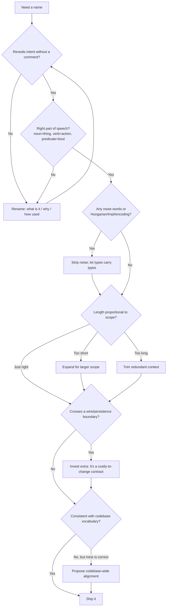

# Meaningful Names — Interview Questions

> 55+ interview-style questions on naming, grouped by tier (Junior → Mid → Senior → Staff). Each answer is folded under `
`; harder questions include a "what the interviewer is really checking" note. Use as self-review or live prep.

---

## Table of Contents

- [Junior (Q1–Q15)](#junior-q1q15)
- [Mid (Q16–Q32)](#mid-q16q32)
- [Senior (Q33–Q46)](#senior-q33q46)
- [Staff (Q47–Q56)](#staff-q47q56)
- [Rapid-Fire](#rapid-fire)
- [Summary](#summary)
- [Further Reading](#further-reading)
- [Related Topics](#related-topics)

---

## Junior (Q1–Q15)

### Q1. What makes a name "clean"?

Answer

It reveals **intent** — why the thing exists and how it's used — without requiring a comment, a type lookup, or reading the implementation. A clean name answers three questions the reader would otherwise ask: *What is this? Why does it exist? How is it used?* If the name forces the reader to chase the definition, it has failed.

### Q2. What's wrong with `int d; // elapsed time in days`?

Answer

The name `d` carries zero meaning, so it needs a comment to survive. Rename to `elapsedDays` and the comment disappears — the name *is* the documentation. A name that needs a comment to explain it is an unfinished name.

### Q3. Intention-revealing vs short — which wins?

Answer

Intention-revealing wins almost everywhere. Short names are only acceptable when scope is tiny and convention is universal (`i` in a 3-line loop, `err` in Go, `_` for an ignored value). The rule is **scope-proportional**: the larger the scope a name lives in, the more descriptive it must be. A field on a public class earns a long, precise name; a loop counter does not.

### Q4. When are single-letter names actually fine?

Answer

When all three hold: (1) the scope is a few lines, (2) the convention is universally understood, (3) a longer name would add no information. Canonical cases: `i`/`j`/`k` for loop indices, `x`/`y` for coordinates in a math-heavy block, `e` for an exception in a one-line catch, `k`/`v` when iterating map entries. Outside those, spell it out.

### Q5. What is a "noise word"? Give examples.

Answer

A word that adds length but no meaning, because it doesn't distinguish the name from any alternative. `Data`, `Info`, `Object`, `Manager`, `Processor`, `Helper`, `Util`. `ProductData` and `ProductInfo` and `Product` are indistinguishable to a reader — so the suffix is noise. Also: redundant context like `nameString` (it's obviously a string) or `theMessage` (the `the` is filler).

### Q6. What's wrong with `getActiveAccount()`, `getActiveAccounts()`, and `getActiveAccountInfo()` in the same class?

Answer

The reader cannot tell which to call without reading all three. The distinction (`Info` vs nothing, singular vs plural) is arbitrary noise. Pick names whose differences are meaningful: `getActiveAccount(id)` (one), `findActiveAccounts()` (many). Names that differ only by noise words force the reader to guess.

### Q7. Why prefer `Customer` over `CustomerObject` or `CustomerClass`?

Answer

The reader already knows it's a class — the language and IDE tell them. `Object`/`Class`/`Type` suffixes restate the type system. They're noise. The clean rule: a name should describe the *concept*, not its language-level category.

### Q8. How should you name a boolean?

Answer

As a predicate that reads true/false at the call site: `isActive`, `hasPermission`, `canRetry`, `shouldRetry`, `wasModified`. Avoid bare nouns (`status`, `flag`) and avoid negatives in the name (`isNotReady` reads terribly under negation: `if (!isNotReady)`). The test: does `if (name)` read like an English sentence?

### Q9. How should you name a collection?

Answer

Plural noun, and the name should not lie about the structure. `users` for a list of users; `userById` or `usersById` for a `Map<Id, User>`; `activeUserIds` for a set of IDs. Avoid `userList` when the type is actually a `Set` or a `Map` — that's a [misleading name](README.md). Name by *what it contains and how it's keyed*, not by the concrete collection class.

### Q10. What is Hungarian notation and why is it discouraged in modern typed languages?

Answer

Encoding the type into the name: `strName`, `iCount`, `lpszBuffer`, `bIsReady`. It dates from untyped/weakly-typed eras (C, early Win32, VB6) where the compiler couldn't help. In a modern typed language the compiler and IDE already know the type; the prefix is redundant and, worse, *lies* the moment someone changes the type but not the name (`strId` that's now an `int`). Let types carry type information; let names carry intent.

### Q11. What's the problem with `m_count`, `_count`, or `this.count` style prefixes for fields?

Answer

`m_` (member) is a flavor of Hungarian notation — it encodes scope into the name, which the language and tooling already track. A leading `_` is a softer, sometimes-conventional version (idiomatic in Python for "private", common in C#). The clean-code position: prefer no decoration; if you find yourself needing `m_` to tell fields from locals, the class or method is probably too big. (Honor the language's *idiom*, though — `_field` is normal in Python/C#.)

### Q12. Why is `IFoo` / `FooImpl` an anti-pattern in many codebases?

Answer

The `I` prefix and `Impl` suffix encode "this is an interface / this is the implementation" — facts the type system already expresses. They also signal a design smell: a one-interface-one-implementation pair often means the interface exists only for mocking, not for genuine polymorphism. Cleaner: name the interface for the *role* (`PaymentGateway`) and the implementation for the *mechanism* (`StripeGateway`, `InMemoryGateway`).

### Q13. What does "use pronounceable names" buy you?

Answer

Discussability. You cannot talk about `genymdhms` (generation date, year, month, day, hour, minute, second) in a code review without spelling it letter by letter. `generationTimestamp` can be spoken aloud. Code is a social artifact; names must survive being said in a meeting.

### Q14. What's the difference between a variable, function, and class naming part of speech?

Answer

Variables and fields are **nouns or noun phrases** (`account`, `pendingOrders`). Functions/methods that perform actions are **verbs or verb phrases** (`deletePage`, `save`, `calculateTotal`). Boolean-returning functions are **predicates** (`isEmpty`, `hasNext`). Classes are **nouns** (`Customer`, `AddressParser`), never verbs.

### Q15. Why avoid "mental mapping"?

Answer

Mental mapping is when the reader must silently translate your name into the real concept — e.g., you used `r` and they must remember "r is the lowercased, url-stripped version of the request." Every such translation is cognitive load and a chance to slip. Smart programmers sometimes show off by tracking these mappings; clarity is the professional choice. Name `r` what it is: `cleanRequestPath`.

---

## Mid (Q16–Q32)

### Q16. How do you name an async function / a function returning a future?

Answer

Name it for the *result*, not the asynchrony — the type already says "async." `fetchUser()`, `loadConfig()`, `sendEmail()` are fine whether they return `Promise<User>`, `Future<User>`, or `Task<User>`. Some ecosystems add a suffix by convention (.NET's `...Async` on `Task`-returning methods); follow the local idiom. Avoid baking the mechanism into a name where the type already conveys it (`getUserPromise` is noise).

### Q17. The "boolean parameter" naming trap — what is it and how do names help?

Answer

`render(true)` at the call site is unreadable — the reader can't see what `true` means. Naming doesn't fully fix it; the structural fix is to split into two intention-revealing methods (`renderPaginated()` / `renderUnpaginated()`) or pass a named enum (`Pagination.PAGINATED`). If the language supports named arguments (Python, Kotlin, Swift), `render(paginated=True)` rescues the call site cheaply. The lesson: a value's meaning should be visible at the *call site*, not just the definition.

### Q18. Is `getX()` always the right name for an accessor?

Answer

No — this is a trick. `get` is a JavaBeans convention implying *cheap field access with no side effects*. If the method does real work (`getUserFromDatabase()` hits the network), `get` lies about cost. Prefer `fetchUser()`, `loadUser()`, `computeTotal()` when work happens. And in languages without the beans convention (Go discourages the `Get` prefix on getters: `user.Name()` not `user.GetName()`), `get` is often wrong stylistically. Match the verb to the cost and the ecosystem.

**What the interviewer is really checking:** whether you treat conventions as cargo-cult rules or understand the *intent* behind them — names should signal cost and side-effect profile.

### Q19. Is `Manager` always a bad name?

Answer

No — another trick. `Manager`/`Processor`/`Handler` are *often* noise that hide a missing concept (a `UserManager` doing six unrelated things is a [God object](../../anti-patterns/README.md) wearing a vague label). But some frameworks use these words as genuine roles with established meaning: `EntityManager` (JPA), `ConnectionManager` (pooling), `TransactionManager`. The smell is **vagueness**, not the word itself. Ask: does the name name a real, cohesive responsibility, or is it a junk drawer? If you can't describe what the `Manager` does in one sentence without "and," it's noise.

**What the interviewer is really checking:** that you reason about cohesion and responsibility rather than blacklisting words.

### Q20. What does "use solution-domain vs problem-domain names" mean?

Answer

Use **computer-science / pattern terms** (`JobQueue`, `visitor`, `accountFactory`) when the reader is a programmer and the concept is technical — programmers know what a queue is. Use **problem-domain terms** (`policyHolder`, `escrowBalance`, `gestationPeriod`) when the concept belongs to the business and no CS term captures it. The mistake is using a vague business word where a precise pattern name exists, or a CS term where a domain expert's word is clearer.

### Q21. How do names express "add meaningful context"?

Answer

A bare `state` is ambiguous; in an address context, `addrState` or — better — placing it on an `Address` class makes `address.state` unambiguous. Context comes from (in order of preference) the enclosing **class/struct**, then the **namespace/package**, then a **prefix** as a last resort. Prefer structural context (group the fields into a type) over prefix context (`addrFirstName`, `addrState`).

### Q22. When is adding context "gratuitous" instead of meaningful?

Answer

When the context is already supplied by the enclosing scope. In a `GasStationDeluxe` app, prefixing every class `GSD` (`GSDAccountAddress`) is gratuitous — the package already says it. `accountAddress` inside an `Account` class should just be `address`. Add context to disambiguate; remove it when the surroundings already provide it.

### Q23. What's a "pun" in naming and why avoid it?

Answer

Using one word for two different concepts, or one concept under two words. Pun example: `add` means "concatenate" in one class and "insert into a set" in another and "sum" in a third — the reader's learned meaning betrays them. Same-concept-two-words example: `fetch`, `retrieve`, and `get` scattered for the identical operation. Pick one word per concept and one concept per word — consistency in vocabulary is a feature.

### Q24. Consistency vs correctness — if the codebase uniformly uses a bad convention, do you follow it?

Answer

In the small, **consistency usually wins**: a codebase that uniformly says `fetchX` is more readable than one that's "correct" in 40% of places and inconsistent overall. Matching the surrounding style lowers cognitive load. But consistency in a name that's actively *misleading* (an `accountList` that's a map) is not worth preserving — correctness of meaning beats consistency of a lie. The pragmatic move: follow convention for stylistic choices (verb vocabulary, casing), fix names that mislead, and propose a codebase-wide rename for genuinely bad conventions rather than diverging locally.

**What the interviewer is really checking:** judgment about local vs global change and the cost of inconsistency.

### Q25. How do you name things in a public API differently from internal code?

Answer

Public API names are **contracts you can't cheaply change** — they bind callers, docs, SDKs, and search results. So they need extra investment: maximal clarity, no abbreviations, no leaking of internal jargon, no implementation detail (`getUserV2`, `userImplCache`). Internal names can be terser and can evolve freely because the blast radius of a rename is the module. The asymmetry: internal rename = an IDE refactor; public rename = a deprecation cycle.

### Q26. What's the cost of a rename, and how does it shape naming decisions?

Answer

For **internal, in-process** names: nearly free — IDE rename refactoring is safe and instant. For names crossing a **serialization boundary** (JSON fields, DB columns, protobuf fields, queue message keys, URL paths): expensive — you must migrate persisted data, version the schema, or support both names during a transition. This is why the worst place for a careless name is a wire format. The principle: invest naming effort in proportion to how hard the name is to change later.

### Q27. How should temporary/loop/throwaway variables be named?

Answer

Proportional to scope. A loop index in three lines is `i`. An accumulator over a 30-line block is `runningTotal`. A temp that holds an intermediate computation deserves a name that explains *what stage* it is (`normalizedInput`, not `tmp` or `x2`). The anti-pattern is `temp`, `tmp`, `data`, `result2` surviving past the few lines where their meaning is obvious.

### Q28. What's wrong with abbreviations like `genStrCnt` or `calcAmt`?

Answer

They save a few keystrokes (which autocomplete makes free anyway) at the cost of pronounceability, searchability, and the reader having to expand them mentally. `generatedStringCount` and `calculateAmount` are unambiguous and speakable. Exceptions: abbreviations that are *more* standard than their expansion in the domain (`id`, `url`, `http`, `db` in some contexts, `max`/`min`). The test: would a new teammate need to ask what it means?

### Q29. How does "searchable names" affect your choice between `7` and `MAX_RETRIES`?

Answer

A bare literal `7` is unsearchable (it appears thousands of places) and meaningless at the use site. A named constant `MAX_RETRIES = 7` is greppable, self-documenting, and single-source-of-truth. Single-letter names share the same flaw: you can't grep for `e`. The rule scales with usage: the more places a value or variable is referenced, the more its name must be searchable.

### Q30. A field is named `flag`. Why is that bad and what's the fix?

Answer

`flag` says "this is a boolean" (which the type already says) but not *what it flags*. The reader can't tell what `if (flag)` means. Fix: name the condition — `isEligibleForDiscount`, `hasUnsavedChanges`, `requiresApproval`. Same critique applies to `status`, `mode`, `type`, `value` as standalone names: they name a category, not a meaning.

### Q31. How do you name a function that returns the same shape as its input but transformed?

Answer

Name it for the transformation, and prefer verbs that signal whether it mutates or returns a copy. `normalize(input) -> Input` (returns new), `sortInPlace(list)` (mutates), `withDiscount(order) -> Order` (immutable "copy-with" convention). The `with`/`to`/`as` prefixes are widely understood: `toJson`, `asReadOnly`, `withTimeout`. Signal mutation in the name when it isn't obvious from the return type.

### Q32. Two functions: `validate(user)` returns `boolean` vs `validate(user)` throws on failure. How do names disambiguate?

Answer

The name should reveal the failure mode. A boolean check reads as a predicate: `isValid(user)`. A function that throws/raises asserts: `validate(user)` (no return) or `requireValid(user)` / `assertValid(user)`. A function returning errors: `validationErrors(user) -> List<Error>`. The reader should know from the name whether to wrap the call in an `if`, a `try`, or to inspect a returned list.

---

## Senior (Q33–Q46)

### Q33. How do you decide the *length* of a name systematically?

Answer

Length should be proportional to the **distance between declaration and use** and inversely proportional to how constrained the context is. A variable used one line below its declaration can be short; a field referenced across a 400-line class needs a full name. Kevlin Henney's framing: a name's job is to bridge the gap between where it's defined and where it's read — bigger gap, more name. This is also why globals and exported symbols get the longest, most qualified names.

**What the interviewer is really checking:** that you have a *model* for naming, not just taste.

### Q34. How do naming conventions differ across Go, Java, and Python, and why?

Answer

- **Go:** short names favored in small scopes (`r` for reader, `i` for index); exported = `CapitalCase`, unexported = `camelCase`; no `Get` prefix on getters (`u.Name()`); package name is part of the identifier so `chunk.New` not `chunk.NewChunk`; acronyms stay uppercase (`HTTPServer`, `userID`).
- **Java:** descriptive `camelCase` methods/fields, `PascalCase` types, `UPPER_SNAKE` constants; beans `get`/`set`/`is` conventions; longer names tolerated.
- **Python:** `snake_case` for functions/variables, `PascalCase` for classes, `UPPER_SNAKE` for constants; `_leading` for "internal", `__dunder` for name-mangling; descriptive over short.

The driver is each ecosystem's idioms and the fact that the package/module already supplies context. Clean naming means *idiomatic* naming, not one universal style.

### Q35. When does the `get`/`set` convention actively harm a design?

Answer

When it encourages anemic data bags. Exposing `getBalance()`/`setBalance()` invites callers to read-modify-write outside the object, scattering business rules. A richer model exposes behavior — `withdraw(amount)` — and hides the field. Blindly generating getters/setters (Lombok `@Data`, IDE "generate accessors") names every field as a public knob and erodes encapsulation. The naming choice (`deposit` vs `setBalance`) is really a design choice.

### Q36. How do you handle a name that's correct but collides with a language keyword or stdlib type (`type`, `id`, `list`, `class`)?

Answer

Prefer a more specific name that sidesteps the collision *and* adds meaning: `userType` over `type`, `userId` over `id`, `items` over `list`, `klass` only as a last resort. Shadowing builtins (`list = [...]` in Python, `id = 5`) is legal but hides the builtin and confuses readers. The collision is usually a hint that the name was too generic anyway — specializing it solves both problems.

### Q37. You're reviewing a PR. The names are accurate but verbose (`theListOfActiveUserAccountObjects`). What's your feedback?

Answer

Verbosity that doesn't add information is its own smell — it's noise words plus over-qualification. `theListOf` (filler), `Account` and `Objects` (redundant). Suggest `activeUsers`. The goal isn't maximal length; it's maximal *information density*: every word should eliminate an alternative the reader would otherwise consider. Push back on both ends — `x` and `theListOfActiveUserAccountObjects` are both wrong.

**What the interviewer is really checking:** that you don't equate "long" with "good."

### Q38. How do names interact with refactoring safety?

Answer

Good names *enable* fearless refactoring: precise names make it obvious when a moved method no longer fits its new home, and unique searchable names make find-replace renames safe. Bad names *block* it: a `process()` that exists in 12 classes can't be safely grepped; a `data` field whose real meaning is undocumented can't be confidently moved. Renaming-to-clarity is itself the first refactoring you do before any larger change — it's how you build the understanding to refactor safely. (See [refactoring techniques](../../refactoring/README.md).)

### Q39. How should you name across a layered architecture so the same concept stays coherent?

Answer

Keep one word per concept across layers, but allow the *qualifier* to change with the layer's responsibility: `UserDto` (API edge), `User` (domain), `UserRow`/`UserRecord` (persistence). The root noun `User` stays constant so a reader tracks the concept end-to-end; the suffix names the layer's representation. The failure mode is a pun — `User` meaning the DB row in one layer and the API contract in another, silently — which produces mapping bugs.

### Q40. What's the relationship between naming and the Single Responsibility Principle?

Answer

The difficulty of naming something is a diagnostic for its cohesion. If you can't name a class without "And" or a vague catch-all (`UserManagerAndValidatorAndMailer`, `Utils`), it has more than one responsibility — the naming pain is the SRP violation surfacing. Easy, precise names are a *symptom* of good single-responsibility design. So "I can't name this well" should trigger "should I split this?" rather than "let me pick a vaguer name."

### Q41. How do you name error/exception types well?

Answer

Name them for the *condition*, not the location, and make them specific enough to be caught selectively: `InsufficientFundsError`, `OrderNotFoundError`, `RateLimitExceededError`. Avoid catch-all `AppException`/`GeneralError` that force callers to string-match the message. The suffix convention (`Error`/`Exception`) follows the language idiom. In Go, error values/vars read as `ErrNotFound`, sentinel-style. A good error name lets a handler decide what to do without parsing text.

### Q42. How do you choose between a method name and a parameter name carrying the meaning?

Answer

Distribute meaning so the call site reads as a phrase. `assertEquals(expected, actual)` puts the verb in the method and roles in parameters. Avoid duplicating: `setNameString(String nameString)` repeats. Prefer reading the call aloud: `account.transfer(to: recipient, amount: balance)` (named args) or `transferTo(recipient, balance)`. The method names the action; parameters name the roles; together they should form a readable sentence at the call site.

### Q43. A teammate insists abbreviations are fine "because everyone here knows them." Your response?

Answer

"Everyone here knows them" is a knowledge that doesn't survive onboarding, team rotation, or 2 a.m. incident response by someone from another team. Tribal abbreviations (`cust`, `acct`, `prcsr`) optimize for today's authors at the expense of every future reader. The exception is genuine domain-standard abbreviations the whole *industry* shares. The deciding question isn't "does the current team know it" but "would a competent engineer new to this code know it." Code outlives the team that wrote it.

### Q44. How do you name feature flags, config keys, and env vars?

Answer

These are long-lived, cross-boundary, often grepped under pressure — so namespace and intent matter. Use a consistent hierarchy: `billing.invoices.batch_size`, `FEATURE_NEW_CHECKOUT_ENABLED`. Booleans read as predicates even here (`...ENABLED`, `...DISABLED` — but avoid double negatives like `DISABLE_X=false`). For flags, include the *thing* and the *state* so a stale flag is self-explanatory months later. Env vars are uppercase-snake by universal convention; honor it.

### Q45. What naming pitfalls are specific to generics/type parameters?

Answer

Single letters (`T`, `K`, `V`, `E`, `R`) are the convention and are fine for simple, obvious roles — `Map<K, V>`, `List<T>`. They become a problem when there are many type params or the role is non-obvious: prefer descriptive `Map<UserId, User>` at use sites and meaningful names like `TKey`/`TValue` (C# convention) or `Element`/`Result` for declarations where `T` would be cryptic. The scope rule applies to type params too: more params or longer scope → more descriptive names.

### Q46. How do you name things to be greppable in a large monorepo?

Answer

Favor unique, specific identifiers over generic ones so a search returns the *relevant* hits, not thousands. `createStripeCharge` beats `process`; `OrderId` (a named type) beats raw `String`. Avoid names that are substrings of unrelated common words (a function named `set` matches `setup`, `subset`, `reset`). Consistent prefixes for a subsystem (`auth_`, `billing_`) make a subsystem's surface area greppable. Searchability is a first-class naming requirement at scale — it's how engineers navigate code they've never seen.

**What the interviewer is really checking:** that you think about code as something *navigated by tools and strangers*, not just read top-to-bottom.

---

## Staff (Q47–Q56)

### Q47. How do you drive a naming standard across many teams without becoming the naming police?

Answer

Encode the rules in **tooling, not opinions**: linters for casing and Hungarian/`Impl` patterns, API-style guides with concrete examples, a shared glossary/ubiquitous-language doc for domain terms, and code-review checklists. Make the easy path the correct path. Reserve human judgment for the genuinely contextual decisions (is this `Manager` cohesive?) that no linter can settle. The goal is consistency-by-default with a documented escape hatch, so engineers spend judgment on hard cases, not on bikeshedding casing.

### Q48. Explain "ubiquitous language" (DDD) and its impact on naming.

Answer

In Domain-Driven Design, the *ubiquitous language* is a shared vocabulary used identically by domain experts, code, tests, and conversation. If the business says "policy lapse," the code says `policyLapse`, not `accountDeactivation`. The payoff: no translation layer between requirements and code, fewer mapping bugs, and conversations that map directly to symbols. A staff engineer establishes and guards this vocabulary — and recognizes when two contexts use the same word differently (a *bounded context* boundary), which licenses different names on each side.

### Q49. When is renaming across a published boundary worth the migration cost?

Answer

When the bad name causes ongoing, compounding harm: repeated production incidents from confusion, onboarding drag, or a name that actively misleads about behavior (a `delete` that soft-deletes). You weigh that against the one-time cost of a deprecation cycle, dual-write/dual-read, client SDK updates, and doc churn. The decision framework: if the *accumulated* future cost of the bad name exceeds the *one-time* migration cost, rename — and do it via expand/contract (add the new name, deprecate the old, migrate callers, remove). Cosmetic renames across wire boundaries are almost never worth it.

### Q50. How do names degrade over time, and how do you fight it?

Answer

Names drift: a `UserService` accretes unrelated methods until the name lies; a `tempFix` becomes permanent; a field's meaning shifts but its name doesn't (a `count` that's now a sum). This is name rot, and it tracks responsibility creep. Fight it by treating naming as part of every change (the [Boy Scout Rule](../21-boy-scout-rule/README.md) — rename what you touch when you understand it better), by reviewing for "does the name still match what this does," and by splitting types when their names need "And." Names are a living interface, not a one-time decision.

### Q51. Argue both sides: should IDs be `String` or a dedicated `UserId` type, and how does naming factor in?

Answer

**For `String`:** zero ceremony, trivially serializable, no allocation concern in some languages, fine for tiny scripts.

**For `UserId`:** the name *is the type*, so the compiler stops you from passing a `UserId` where an `OrderId` is expected — a class of bugs a `String userId` parameter cannot prevent (you can swap two `String` args silently). It also gives validation and behavior a home. In strongly-typed languages this is usually the right call for any ID that flows across functions; the naming win (self-documenting signatures, `transfer(from: UserId, to: UserId)`) compounds with the type-safety win. The `String`-with-good-name approach is the pragmatic floor; the typed approach is the ceiling.

**What the interviewer is really checking:** that you see naming and the type system as the same tool — both encode intent the reader and compiler rely on.

### Q52. How do you name in a polyglot system so concepts stay aligned across services and languages?

Answer

Anchor on the **wire contract** (the protobuf/OpenAPI schema) as the single source of truth for the canonical concept names, then let each language render them idiomatically: `user_id` on the wire → `userId` in Java/Go, `user_id` in Python, `userId` in TS. Maintain a cross-service glossary so `chargeback` means the same thing everywhere. The anti-pattern is each service inventing its own word for a shared concept, which creates an implicit, undocumented mapping layer that breeds bugs. Canonical names live in the schema; idiomatic casing lives in each language.

### Q53. How would you measure or lint naming quality at scale?

Answer

You can't fully automate "is this name meaningful," but you can catch the mechanical failures: linters for casing/idiom violations, Hungarian-prefix and `Impl`/`I`-prefix detectors, single-character identifiers outside loops, banned vague words (`data`, `manager`, `util`) flagged for review (not blocked), and abbreviation dictionaries. Beyond linting, *proxy* signals: high rename churn on a symbol, frequent "what does X mean" review comments, and identifiers that are substrings causing grep noise. Treat these as conversation starters; the semantic judgment stays human.

### Q54. Defend a controversial position: is `data` ever an acceptable name?

Answer

Rarely, and only where it's genuinely the most precise word available — e.g., a generic serialization layer where the payload truly is opaque bytes of unknown structure (`func write(data []byte)`), or a chart library's `data` series parameter where the domain term *is* "data." In application/business code it's almost always a cop-out hiding a real concept (`userData` → `userProfile`). The defensible rule: `data` is acceptable when the code is deliberately *generic* about its content; it's a smell the moment the content has a known meaning the name omits.

**What the interviewer is really checking:** nuance — that you don't apply rules dogmatically and can identify the narrow legitimate exception.

### Q55. How do naming decisions interact with security and information leakage?

Answer

Names in URLs, error messages, and logs can leak internal structure or sensitive context: a route `/internal/admin/impersonateUser` advertises an attack surface; an error `UserNotFoundInPrimaryShard3` leaks topology; logging a field literally named `password`/`ssn` invites it into log sinks. Staff-level naming considers the *audience of the name*: external-facing names should be neutral and non-revealing, log field names should make redaction tooling's job easy (consistent `*_redacted`, tagging PII fields), and internal jargon shouldn't escape to users. Names are part of the threat model at boundaries.

### Q56. A legacy module has uniformly cryptic but *consistent* names. Big-bang rename or leave it?

Answer

Neither extreme. A big-bang rename is a large, untested, blast-radius change with no behavior improvement — high risk, easy to reject in review, and it churns blame history. Leaving it forever taxes every future reader. The staff move: rename **opportunistically and locally** as you touch code for real changes (Boy Scout Rule), starting at the boundaries new code interacts with; introduce a glossary mapping cryptic→intended names so readers aren't lost in the interim; and only schedule a coordinated rename for a module you're already refactoring heavily. Consistency of the cryptic scheme buys you time but isn't a reason to preserve it forever.

**What the interviewer is really checking:** that you weigh risk, blast radius, and incremental delivery — not just "clean code good."

---

## Rapid-Fire

Short questions, one-line answers.

| # | Question | Answer |
|---|---|---|
| 1 | Verb or noun for a class? | Noun. |
| 2 | Verb or noun for a method that acts? | Verb. |
| 3 | How do you name a boolean? | As a predicate: `isX`, `hasX`, `canX`. |
| 4 | `userList` holding a `Set` — okay? | No, it's a misleading name. |
| 5 | `strName` in Java — what smell? | Hungarian notation. |
| 6 | `IFoo`/`FooImpl` — preferred alternative? | Role name + mechanism name. |
| 7 | Single-letter loop index `i` — okay? | Yes, tiny scope + convention. |
| 8 | `get` prefix in Go getters — idiomatic? | No: `u.Name()`, not `u.GetName()`. |
| 9 | Is `Manager` always bad? | No — bad only when vague/non-cohesive. |
| 10 | Is `getX()` always right? | No — `get` implies cheap, no side effects. |
| 11 | Constant `7` vs `MAX_RETRIES`? | `MAX_RETRIES` — searchable, meaningful. |
| 12 | Hardest name to change? | One on a serialization/wire boundary. |
| 13 | `data`, `info`, `manager`, `util` — what are they? | Noise words (usually). |
| 14 | Name length should scale with…? | Scope / distance between decl and use. |
| 15 | One word per concept means…? | Don't mix `fetch`/`get`/`retrieve` for the same op. |
| 16 | Booleans with negatives in the name? | Avoid — double negatives read terribly. |
| 17 | `tmp`, `result2`, `x2` — okay long-lived? | No — name the meaning. |
| 18 | Type param `T` for `List<T>` — okay? | Yes; use descriptive names when role is non-obvious. |
| 19 | Public API name vs internal — which gets more care? | Public — it's a contract. |
| 20 | Can't name a class without "And" — signal of? | SRP violation; split it. |

---

## Summary

Naming is the highest-leverage, lowest-cost discipline in software: every name is read far more often than it's written. The through-line across tiers:

- **Junior:** intention-revealing over short; nouns for things, verbs for actions, predicates for booleans; no noise words, no Hungarian notation, no mental mapping.
- **Mid:** name for cost and side-effects (`get` vs `fetch`); make meaning visible at the *call site*; one word per concept; conventions are intent, not cargo-cult; rename cost scales with how many boundaries a name crosses.
- **Senior:** length is proportional to scope; idioms are per-language; naming difficulty diagnoses cohesion (SRP); names enable or block refactoring; searchability is a first-class requirement.
- **Staff:** enforce via tooling and ubiquitous language, not opinion; weigh migration cost against compounding harm; fight name rot continuously; treat names at boundaries as part of the security and contract surface.

The recurring trick-question lesson: never blacklist a *word* (`Manager`, `get`, `data`) — interrogate whether the name reveals a real, cohesive, accurately-described intent. The decision flow:

---

## Further Reading

- Robert C. Martin, *Clean Code*, Ch. 2 "Meaningful Names."
- Kevlin Henney, "Seven Ineffective Coding Habits of Many Programmers" (on name length and noise).
- Eric Evans, *Domain-Driven Design* (ubiquitous language).
- Steve McConnell, *Code Complete*, 2nd ed., Ch. 11 "The Power of Variable Names."

---

## Related Topics

- This chapter overview: [README.md](README.md)
- Junior-level deep dive: [junior.md](junior.md)
- Professional-level deep dive: [professional.md](professional.md)
- Naming recipes & cheat sheet: [naming-recipes.md](naming-recipes.md)
- Next chapter — functions: [../02-functions/README.md](../02-functions/README.md)
- Boy Scout Rule (fighting name rot): [../21-boy-scout-rule/README.md](../21-boy-scout-rule/README.md)
- Anti-patterns (God objects, junk-drawer `Manager`s): [../../anti-patterns/README.md](../../anti-patterns/README.md)
- Refactoring techniques (rename-driven refactoring): [../../refactoring/README.md](../../refactoring/README.md)
