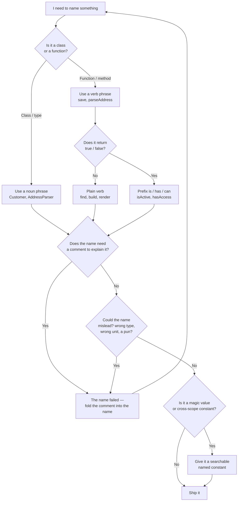

# Meaningful Names — Junior Level

> **Level:** You just learned the language's syntax. This file teaches the naming rules and shows a dirty→clean example for each one.

> **Source:** *Clean Code* (2008), Robert C. Martin — Chapter 2, "Meaningful Names" — extended with modern naming practice.

---

## Table of Contents

1. [Why names are the cheapest documentation you'll ever write](#why-names-are-the-cheapest-documentation-youll-ever-write)
2. [Real-world analogy](#real-world-analogy)
3. [Use Intention-Revealing Names](#use-intention-revealing-names)
4. [Avoid Disinformation](#avoid-disinformation)
5. [Make Meaningful Distinctions](#make-meaningful-distinctions)
6. [Use Pronounceable Names](#use-pronounceable-names)
7. [Use Searchable Names](#use-searchable-names)
8. [Avoid Mental Mapping](#avoid-mental-mapping)
9. [Class Names Are Nouns, Method Names Are Verbs](#class-names-are-nouns-method-names-are-verbs)
10. [Pick One Word Per Concept](#pick-one-word-per-concept)
11. [Don't Pun](#dont-pun)
12. [Use Solution-Domain and Problem-Domain Names](#use-solution-domain-and-problem-domain-names)
13. [Add Meaningful Context, Not Noise](#add-meaningful-context-not-noise)
14. [Drop the Gratuitous Prefixes, Suffixes, and Encodings](#drop-the-gratuitous-prefixes-suffixes-and-encodings)
15. [Common Mistakes](#common-mistakes)
16. [Decision flow: naming a thing](#decision-flow-naming-a-thing)
17. [Test Yourself](#test-yourself)
18. [Cheat Sheet](#cheat-sheet)
19. [Summary](#summary)
20. [Further Reading](#further-reading)
21. [Related Topics](#related-topics)

---

## Why names are the cheapest documentation you'll ever write

You will read code far more often than you write it — studies put the ratio around 10:1. Every time you read, you decode names. A name is a tiny contract: it promises what a variable holds, what a function does, what a class represents. When the name keeps that promise, you read at full speed. When it lies, you slow down, open the definition, trace the value, and rebuild the meaning by hand.

A good name does work that would otherwise need a comment. `int d;` needs a comment ("elapsed time in days"). `int elapsedTimeInDays;` needs none. The name *is* the documentation — and unlike a comment, the compiler carries it everywhere and it can never drift out of date.

> **Key idea:** The hardest problem in naming isn't typing fewer characters. It's choosing a name that tells the next reader *why this thing exists and how to use it* — without making them read the implementation.

This chapter is a set of rules. None are absolute, but each has a default you should follow unless you have a concrete reason not to. Junior level teaches the rule and the clean example; [`middle.md`](middle.md) covers when each rule bends.

---

## Real-world analogy

### The mislabeled spice jars

You inherit a kitchen. The previous cook filled twelve identical jars and labeled them `jar1`, `jar2`, … `jar12`. To cook anything you open each jar, smell it, taste it, and remember which is which — every single time. Worse, one jar labeled `salt` actually holds sugar. Now you don't just lack information; you've been *misled*, and your dish is ruined.

Good labels — `smoked paprika`, `flaky sea salt`, `ground cumin` — let you reach for the right jar without opening it. That's an intention-revealing name. A label that says one thing and contains another (`salt` → sugar) is disinformation: worse than no label at all, because you trusted it.

Code names work exactly the same way. `data`, `temp`, `obj`, `flag`, `manager` are the `jar7` of programming. A `list` that's actually a `Map` is the salt jar full of sugar.

---

## Use Intention-Revealing Names

### What it is

A name should answer three questions on its own: **why does this exist, what does it do, how is it used?** If a name needs a comment to explain it, the name has failed.

### Why it matters

The reader should never have to read the *implementation* to understand the *variable*. Intention-revealing names let you skim. Cryptic names force a full trace through the code every time.

### Go + Java + Python — before / after

```go
// Before — what is d? what unit? why 5?
func process(d int) bool {
    return d > 5
}

// After — the name carries the meaning
func isSubscriptionExpired(elapsedDays int) bool {
    const gracePeriodDays = 5
    return elapsedDays > gracePeriodDays
}
```

```java
// Before
List<int[]> getThem() {
    List<int[]> list1 = new ArrayList<>();
    for (int[] x : theList)
        if (x[0] == 4) list1.add(x);
    return list1;
}

// After — names reveal the domain: a game board of cells
List<Cell> getFlaggedCells() {
    List<Cell> flaggedCells = new ArrayList<>();
    for (Cell cell : gameBoard)
        if (cell.isFlagged()) flaggedCells.add(cell);
    return flaggedCells;
}
```

```python
# Before
def calc(x, y, z):
    return x * y * (1 - z)

# After
def net_price(unit_price, quantity, discount_rate):
    return unit_price * quantity * (1 - discount_rate)
```

The "after" versions are not longer because of padding — every extra word removes a question the reader would otherwise have to answer by reading the body.

---

## Avoid Disinformation

### What it is

Don't use a name that means something other than what the thing is. The worst names aren't vague — they're *wrong*: a name that actively misleads the reader into a false belief.

### Why it matters

A vague name (`data`) makes you look. A misleading name (`accountList` that's actually a `Set`, or `hp` that means "hypotenuse," not "Hewlett-Packard") makes you *stop looking* — you trust it and build on a falsehood. Bugs from disinformation are the expensive kind.

### Go + Java + Python — before / after

```go
// Before — "List" but it's a map; "valid" but it counts the invalid ones
userList := map[string]User{}      // not a list
validCount := countRejected(users) // counts the opposite

// After
usersByID := map[string]User{}
rejectedCount := countRejected(users)
```

```java
// Before — type in the name, and the type is wrong
Map<String, Account> accountList;   // it's a Map, not a List
int theListOfDaysToProcess;         // it's a single int, not a list

// After — name the role, not a fictional type
Map<String, Account> accountsById;
int daysToProcess;
```

```python
# Before — "is_" implies a boolean, but it returns a string
def is_status(order):
    return order.status   # returns "shipped", not True/False

# After
def status_of(order):
    return order.status
```

> **Rule of thumb:** Never put a collection word (`list`, `array`, `map`) in a name unless the thing *is* that collection. `accounts` is safer than `accountList` precisely because it can't lie about the container.

---

## Make Meaningful Distinctions

### What it is

If two things have different names, the names must say *how* they differ. Number-series names (`a1`, `a2`) and noise words (`Info`, `Data`, `Object`, `the…`, `…Variable`) are non-distinctions: they differ in spelling but not in meaning.

### Why it matters

`getActiveAccount()`, `getActiveAccounts()`, and `getActiveAccountInfo()` — which do you call? Nobody knows without reading all three. Names that don't distinguish force the reader to guess, and guessing wrong compiles fine.

### Go + Java + Python — before / after

```go
// Before — how does source differ from source2?
func copyChars(source, source2 []byte) { /* ... */ }

// After — the names explain direction
func copyChars(src, dst []byte) { /* ... */ }
```

```java
// Before — Product, ProductInfo, ProductData: no real distinction
class Product {}
class ProductInfo {}
class ProductData {}

// After — each name names a real, different concept
class Product {}          // the domain entity
class ProductSummary {}   // a trimmed view for lists
class ProductRow {}       // the database row mapping
```

```python
# Before — noise words add length, not meaning
def get_account():        ...
def get_account_data():   ...
def get_account_object(): ...

# After — distinguish by what's actually different
def find_account(account_id): ...   # may return None
def load_account(account_id): ...   # raises if missing
```

`Info`, `Data`, `Object`, `Manager`, and `theMessage` vs `message` are **noise words**. If removing the word doesn't change the meaning, the word was noise.

---

## Use Pronounceable Names

### What it is

If you can't say the name out loud, you can't discuss it. Names should be made of real words, not compressed vowel-free abbreviations.

### Why it matters

Code is discussed in standups, reviews, and pair sessions. "The gen-dee-em-why-em-aitch-em-ess timestamp" is not a conversation. Pronounceable names turn into shared vocabulary; unpronounceable ones force everyone to spell or point.

### Go + Java + Python — before / after

```go
// Before
var genymdhms time.Time // generation year-month-day-hour-min-sec
var modymdhms time.Time

// After
var generatedAt time.Time
var modifiedAt  time.Time
```

```java
// Before
class DtaRcrd102 {
    private Date genymdhms;
    private Date modymdhms;
    private final String pszqint = "102";
}

// After
class Customer {
    private Date generationTimestamp;
    private Date modificationTimestamp;
    private final String recordId = "102";
}
```

```python
# Before
def fmt_dt(dt): ...   # readable-ish, but say "fmt-dt" out loud
cstmr_nm = "Ada"

# After
def format_date(value): ...
customer_name = "Ada"
```

Common, well-known abbreviations (`id`, `url`, `http`, `db`, `max`) are fine — they're already part of the shared vocabulary. The test is "would a teammate know it instantly?", not "is it spelled in full?".

---

## Use Searchable Names

### What it is

A name you can `grep` for. Single letters and raw magic numbers can't be searched without drowning in false matches.

### Why it matters

When you need to find every place that uses the maximum retry count, searching `3` returns thousands of hits. Searching `MAX_RETRIES` returns exactly the ones you want. The length of a name should grow with the size of its scope: a one-line loop counter can be `i`; a constant referenced across the codebase must be a full searchable name.

### Go + Java + Python — before / after

```go
// Before — what is 7? what is 4?
for i := 0; i < 34; i++ {
    sum += (task[i] * 4) / 5
}

// After — every constant is named and searchable
const (
    workDaysPerWeek      = 5
    realDaysPerIdealDay  = 4
    numberOfTasks        = 34
)
var realTaskWeeks float64
for taskIndex := 0; taskIndex < numberOfTasks; taskIndex++ {
    realTaskDays := float64(task[taskIndex]) * realDaysPerIdealDay
    realTaskWeeks += realTaskDays / workDaysPerWeek
}
```

```java
// Before — search "5" returns 600 matches
if (attempts > 5) abort();

// After — search "MAX_ATTEMPTS" returns exactly the relevant ones
private static final int MAX_ATTEMPTS = 5;
if (attempts > MAX_ATTEMPTS) abort();
```

```python
# Before
if status == 2:   # what is 2? search "2" — good luck
    refund(order)

# After
STATUS_CANCELLED = 2
if status == STATUS_CANCELLED:
    refund(order)
```

> **Single letters are fine in one place only:** a short loop or as a local with a tiny scope (`i`, `j`, `k` for indices). The moment a name needs to be found from elsewhere, it must be searchable.

---

## Avoid Mental Mapping

### What it is

Don't make the reader hold a translation table in their head — "`r` means the URL with the host and scheme stripped," "`p` is the previous node." Single-letter names beyond loop counters force this.

### Why it matters

The reader has limited working memory. Every name they must mentally translate (`r` → "lowercased URL") is a slot used up that could have held actual logic. Smart programmers sometimes show off by tracking these mappings — but clarity is not the same as cleverness.

### Go + Java + Python — before / after

```go
// Before — reader must remember n=node, p=previous, c=current
func reverse(n *Node) *Node {
    var p *Node
    c := n
    for c != nil {
        nx := c.next
        c.next = p
        p = c
        c = nx
    }
    return p
}

// After — names carry their role
func reverse(head *Node) *Node {
    var prev *Node
    current := head
    for current != nil {
        next := current.next
        current.next = prev
        prev = current
        current = next
    }
    return prev
}
```

```java
// Before
for (int j = 0; j < n; j++) {
    String r = u.substring(u.indexOf("//") + 2);  // r = host+path
    hosts.add(r);
}

// After
for (int i = 0; i < urlCount; i++) {
    String hostAndPath = url.substring(url.indexOf("//") + 2);
    hosts.add(hostAndPath);
}
```

```python
# Before — what are e, k, v?
for e in d.items():
    k, v = e
    print(f"{k}={v}")

# After
for setting_name, setting_value in settings.items():
    print(f"{setting_name}={setting_value}")
```

`i`, `j`, `k` for loop indices are an accepted convention — readers don't need to map them. Anything else with a real role gets a real name.

---

## Class Names Are Nouns, Method Names Are Verbs

### What it is

A class or struct represents a *thing*, so its name is a noun or noun phrase: `Customer`, `Account`, `AddressParser`. A method or function *does* something, so its name is a verb or verb phrase: `save`, `deletePage`, `isPosted`, `parseAddress`.

### Why it matters

This convention lets a reader infer a name's kind from its grammar before they ever see its definition. `Customer.save()` reads as "the customer saves itself"; `Customer.salvation()` does not parse. Booleans get `is`/`has`/`can` prefixes so they read as yes/no questions.

### Go + Java + Python — before / after

```go
// Before — verb-y type, noun-y function
type Validate struct{}        // a type that's named like an action
func (v Validate) Email() {}  // a method named like a noun

// After
type EmailValidator struct{}          // noun: a thing
func (v EmailValidator) IsValid() bool // verb phrase + bool reads as a question
```

```java
// Before
class Manager {}              // vague noun
account.amountStuff();        // not a verb

// After
class Account {}              // noun
account.withdraw(amount);     // verb
boolean isOverdrawn();        // boolean reads as a question
Customer customer = factory.makeCustomer();  // factory verb: make/create/build
```

```python
# Before
class DoTheParsing: ...       # verb phrase for a class
def the_user(): ...           # noun for a function

# After
class AddressParser: ...      # noun
def parse(raw): ...           # verb
def is_complete(): ...        # boolean question
```

> **Boolean naming:** prefix with `is`, `has`, `can`, `should` so the name reads as a true/false question: `isActive`, `hasPermission`, `canRetry`. Avoid negatives like `isNotReady` — they cause double-negative bugs (`!isNotReady`).

---

## Pick One Word Per Concept

### What it is

Choose one word for one abstract concept and use it everywhere. Don't have `fetch`, `retrieve`, `get`, and `load` all meaning "read a value" across different classes.

### Why it matters

A consistent lexicon lets the reader predict the API. If "read from the data store" is always `fetch`, then seeing `fetchUser` tells you it hits the store, while `getName` (a plain `get`) is a cheap accessor. Mixing synonyms destroys that signal — now every method name is a coin flip.

### Go + Java + Python — before / after

```go
// Before — three words for one idea
func (r UserRepo) FetchUser(id int) User    { /* db read */ }
func (r OrderRepo) GetOrder(id int) Order    { /* db read */ }
func (r CartRepo) RetrieveCart(id int) Cart  { /* db read */ }

// After — one word for "read from store"
func (r UserRepo) FindUser(id int) User
func (r OrderRepo) FindOrder(id int) Order
func (r CartRepo) FindCart(id int) Cart
```

```java
// Before — controller, manager, driver all mean "the thing in charge"
class UserController {}
class OrderManager {}
class PaymentDriver {}

// After — pick one role word and keep it
class UserController {}
class OrderController {}
class PaymentController {}
```

```python
# Before
def add_item(...): ...      # appends to a list
def append_tag(...): ...    # also appends
def insert_note(...): ...   # also appends

# After — "add" everywhere for "put one into a collection"
def add_item(...): ...
def add_tag(...): ...
def add_note(...): ...
```

Keep a tiny project glossary if it helps: `find` = read or None, `load` = read or raise, `fetch` = read over the network. Whatever you pick, be consistent.

---

## Don't Pun

### What it is

The flip side of one-word-per-concept: don't use *one* word for *two different* concepts. If `add` means "arithmetic sum" in one place and "append to a list" in another, you've made a pun.

### Why it matters

A reader who has learned that `add` means "sum two numbers" will assume the list's `add` does the same and be surprised. Same word, different meaning, different layer = a trap. Use a distinct verb when the operation is genuinely different.

### Go + Java + Python — before / after

```go
// Before — Add sometimes sums, sometimes appends
func (c Calculator) Add(a, b int) int      { return a + b }      // sum
func (l *ItemList) Add(item Item)          { l.items = ... }      // append

// After — different operations, different verbs
func (c Calculator) Sum(a, b int) int
func (l *ItemList) Append(item Item)
```

```java
// Before — "add" means combine here, insert there
total.add(tax);              // numeric combine
recentItems.add(item);       // insert into collection

// After
total = total.plus(tax);     // value-combine reads as plus
recentItems.append(item);    // collection insert reads as append
```

```python
# Before
result = combine.add(other)   # merges two records
queue.add(job)                # enqueues one job

# After
result = combine.merge(other)
queue.enqueue(job)
```

---

## Use Solution-Domain and Problem-Domain Names

### What it is

Use **solution-domain** terms (the vocabulary of programmers — `Queue`, `Factory`, `Visitor`, `Observer`) when the concept is technical, and **problem-domain** terms (the vocabulary of the business — `Invoice`, `Patient`, `Trade`, `Booking`) when the concept is about the business.

### Why it matters

A reader who knows CS will instantly understand `jobQueue` or `accountFactory` — reach for the technical name when one fits, because it's precise and shared. But when there is no clean technical term, use the language of the business so a domain expert could read the code and recognize their world. Code that mirrors the problem domain is easier to verify against requirements.

### Go + Java + Python — before / after

```go
// Before — invented words for known patterns; tech jargon for business ideas
type ThingThatMakesAccounts struct{}   // it's a Factory
type DataHolder struct{}               // it's an Invoice

// After
type AccountFactory struct{}           // solution-domain: a known pattern
type Invoice struct {                  // problem-domain: a business concept
    LineItems []LineItem
    DueDate   time.Time
}
```

```java
// Before
class WorkList {}                 // it's a priority queue
class Record1 {}                  // it's a medical Visit

// After
class JobPriorityQueue {}         // solution-domain term: Queue
class PatientVisit {              // problem-domain term: Visit
    private Diagnosis diagnosis;
    private LocalDate admittedOn;
}
```

```python
# Before
class Helper: ...                 # really an Observer
class Stuff: ...                  # really a Reservation

# After
class PriceChangeObserver: ...    # solution-domain: Observer pattern
class Reservation:                # problem-domain: a booking
    guest: Guest
    check_in: date
```

> **Default:** if a programmer's term fits exactly, use it. Otherwise use the business term. Never invent a vague word (`Helper`, `Stuff`, `Thing`) when either domain already has a precise one.

---

## Add Meaningful Context, Not Noise

### What it is

A name like `state` is ambiguous on its own — is it a US state, a finite-state-machine state, a UI state? Give it context. The best context comes from a well-named *enclosing class or struct* (`Address.state`); the next best is a prefix (`addrState`). But don't bolt on context that adds no information (`Customer.customerName`).

### Why it matters

`firstName`, `lastName`, `street`, `city`, `state`, `zip` floating loose in a function are individually unclear. Wrapped in an `Address` class, `state` is obviously a postal state. Context disambiguates — but redundant context (`employeeEmployeeId`) is just noise you have to read past.

### Go + Java + Python — before / after

```go
// Before — loose fields; "state" could mean anything
func guessState(number, verb, pluralModifier string) { /* ... */ }

// After — context from a struct; "State" is now clearly postal
type Address struct {
    Street, City, State, Zip string
}
func (a Address) Format() string { /* a.State is unambiguous */ }
```

```java
// Before — redundant context: the class already says "Customer"
class Customer {
    private String customerName;     // noise: customer.customerName
    private String customerEmail;    // noise
}

// After — the class supplies the context, the field needn't repeat it
class Customer {
    private String name;             // read as customer.name
    private String email;            // read as customer.email
}
```

```python
# Before — no context: which "number"?
def print_guess_statistics(candidate, count): ...

# After — meaningful context via a small class
@dataclass
class GuessStatisticsMessage:
    candidate: str
    count: int
    def format(self) -> str: ...
```

The principle cuts both ways: **add** context when a bare name is ambiguous; **remove** context when the enclosing scope already provides it. A field named `name` inside `Customer` is clearer than `customerName` — the `customer.` prefix at every call site already says "customer."

---

## Drop the Gratuitous Prefixes, Suffixes, and Encodings

### What it is

Modern typed languages and IDEs make these once-common decorations obsolete:

- **Hungarian notation** — encoding the type in the name: `strName`, `iCount`, `bIsReady`, `lpszBuffer`.
- **Member prefixes** — `m_field`, `_field` to flag "this is a field" (Go and Python have stronger conventions; Java IDEs color fields).
- **Interface/impl decorations** — `IShape` for an interface, `ShapeImpl` for the (often only) implementation.

### Why it matters

The compiler already knows the type, and the IDE shows it on hover. When you rename `iCount` from `int` to `long`, the `i` becomes a lie you must hand-fix everywhere. `IShape`/`ShapeImpl` signals you couldn't think of two real names — usually the interface should take the clean name (`Shape`) and the implementation should be named for *how* it differs (`Circle`, `CachingShape`).

### Go + Java + Python — before / after

```go
// Before — Hungarian + redundant interface/impl naming
var strName string
var iCount int
type IReader interface{ Read() }
type ReaderImpl struct{}

// After — Go convention: clean names; -er interfaces; concrete impls named by behavior
var name string
var count int
type Reader interface{ Read() }   // Go idiom: single-method interface = "-er"
type FileReader struct{}          // named for what it is
```

```java
// Before
interface IShape { double Area(); }
class ShapeImpl implements IShape { ... }
class Account {
    private String m_accountName;   // member prefix
    private int iBalance;           // Hungarian
}

// After
interface Shape { double area(); }
class Circle implements Shape { ... }   // impl named by what it is
class Account {
    private String name;            // no prefix; the IDE shows it's a field
    private int balance;
}
```

```python
# Before — Hungarian in a duck-typed language is doubly pointless
str_name = "Ada"
i_count = 3
b_is_ready = True

# After
name = "Ada"
count = 3
is_ready = True
```

> **The one survivor:** a single leading underscore in Python (`_internal`) is a *meaningful* convention — it signals "non-public," not a type. That's information, not noise, so keep it. The rule targets decorations that merely restate what the compiler already enforces.

---

## Common Mistakes

1. **Naming for the implementation, not the intent.** `int sum` when the value is really "the running balance." Name what it *means* (`balance`), not how it's computed.
2. **Collection words that lie.** `userList` for a `Map`, `accountArray` for a `Set`. Drop the container word — `users`, `accounts` — unless the type is exactly that container and unlikely to change.
3. **Noise words.** `ProductData`, `CustomerInfo`, `OrderObject`, `ManagerHelper`. If deleting the word doesn't change the meaning, delete it.
4. **Saving keystrokes.** `genymdhms`, `cstmrNm`, `usr`. You type a name once and read it a hundred times. Optimize for reading.
5. **Magic numbers and strings.** `if (status == 2)`, `setTimeout(86400)`. Name them: `STATUS_CANCELLED`, `secondsPerDay`.
6. **Inconsistent verbs.** `getUser`, `fetchOrder`, `retrieveCart`, `loadCart` all meaning the same thing. Pick one.
7. **Same verb, different meaning (puns).** `add` meaning both "sum" and "append." Use distinct verbs.
8. **Single letters with real roles.** `r`, `p`, `n`, `d` outside a tight loop. Loop indices `i`/`j`/`k` are fine; everything else gets a name.
9. **Redundant context.** `customer.customerName`, `address.addressZip`. The enclosing scope already supplies the prefix.
10. **Negative booleans.** `isNotValid`, `disableIfNotUnready`. State booleans positively (`isValid`) so call sites don't drown in double negatives.

---

## Decision flow: naming a thing



---

## Test Yourself

**1. Why is `Map<String, Account> accountList` worse than `Map<String, Account> accounts`?**

<details><summary>Answer</summary>

`accountList` is disinformation: it claims to be a `List` when it's a `Map`. A reader trusts the name and reasons about ordering and indexing that don't exist. `accounts` makes no false claim about the container, so it can't mislead — and if you later swap the `Map` for another structure, the name stays correct.
</details>

**2. When is a single-letter variable name acceptable?**

<details><summary>Answer</summary>

For a loop index with a tiny scope (`i`, `j`, `k`) where the meaning is obvious and the variable lives for a few lines. The moment the value has a real role (a node, a URL fragment, a previous element) or must be found from elsewhere, it needs a full, searchable name.
</details>

**3. What's the difference between "one word per concept" and "don't pun"?**

<details><summary>Answer</summary>

They're two sides of one mapping. *One word per concept* says: one concept → one word (don't use `fetch`, `get`, `retrieve` for the same idea). *Don't pun* says: one word → one concept (don't let `add` mean both "sum" and "append"). Together they make the relationship between words and meanings a clean one-to-one.
</details>

**4. Your class is named `Customer`. Should a field be `customerName` or `name`?**

<details><summary>Answer</summary>

`name`. The enclosing class already supplies the `customer` context — every call site reads `customer.name`. Repeating it as `customerName` is redundant context: noise you read past with no added meaning. Add context only when a bare name would be ambiguous on its own.
</details>

**5. Is `m_count` or `iCount` ever justified in modern Go, Java, or Python?**

<details><summary>Answer</summary>

No. The `m_` member prefix and the `i` type prefix (Hungarian notation) both restate what the compiler already knows and the IDE already shows. Worse, when the type changes (`int` → `long`), the `i` becomes a lie. The one *meaningful* decoration is Python's single leading underscore (`_internal`) — it encodes visibility, not type, so it carries real information.
</details>

**6. Rename this for intent: `boolean flag` that controls whether to retry a failed request.**

<details><summary>Answer</summary>

`shouldRetry` (or `canRetry` if it expresses capability rather than intent). `flag` says nothing; `shouldRetry` reads as a yes/no question at the call site (`if (shouldRetry) ...`) and states the boolean positively, avoiding double-negative traps.
</details>

**7. A teammate names a method `getActiveAccountInfo()`. What's wrong, and how would you fix it?**

<details><summary>Answer</summary>

`Info` is a noise word — it adds length without distinguishing the method from `getActiveAccount()`. Decide what's actually different: if it returns a trimmed view, name the *return type* (`AccountSummary getActiveAccountSummary()`); if it's the same thing, delete the noise and keep one method.
</details>

---

## Cheat Sheet

| Rule | Bad | Good |
|---|---|---|
| Intention-revealing | `int d` | `int elapsedDays` |
| No disinformation | `accountList` (a `Map`) | `accountsById` |
| Meaningful distinction | `Product`, `ProductData` | `Product`, `ProductSummary` |
| Pronounceable | `genymdhms` | `generatedAt` |
| Searchable | `if (s == 2)` | `if (s == STATUS_CANCELLED)` |
| No mental mapping | `r`, `p`, `c` (with roles) | `host`, `prev`, `current` |
| Class = noun | `class Validate` | `class EmailValidator` |
| Method = verb | `account.amountStuff()` | `account.withdraw(amount)` |
| Boolean = question | `done`, `isNotReady` | `isDone`, `isReady` |
| One word / concept | `fetch`, `get`, `retrieve` | `find` everywhere |
| No pun | `add` = sum AND append | `sum` vs `append` |
| Solution domain | `ThingThatMakesAccounts` | `AccountFactory` |
| Problem domain | `Record1` | `PatientVisit` |
| Add context | loose `state` | `Address.state` |
| Remove noise | `customer.customerName` | `customer.name` |
| No encodings | `iCount`, `IShape`, `ShapeImpl` | `count`, `Shape`, `Circle` |

---

## Summary

- A name is a contract that promises *why this exists, what it does, how to use it.* Keeping that promise lets readers skim; breaking it forces a full trace through the body.
- **Reveal intent.** If a name needs a comment, the name failed — fold the comment into the name.
- **Never mislead.** A vague name makes you look; a wrong name (a `list` that's a `Map`) makes you stop looking and build on a falsehood. Disinformation is the costly kind.
- **Distinguish meaningfully.** Number series (`a1`, `a2`) and noise words (`Info`, `Data`, `Object`, `Manager`) differ in spelling, not meaning.
- **Make names pronounceable and searchable.** You discuss code out loud and `grep` for constants — `genymdhms` and bare `2` defeat both.
- **Match grammar to kind.** Classes are nouns, methods are verbs, booleans are positive yes/no questions.
- **Keep words and meanings one-to-one.** One word per concept (don't mix `fetch`/`get`/`retrieve`); no puns (don't let `add` mean two things).
- **Use the right vocabulary.** Solution-domain terms for technical concepts, problem-domain terms for business concepts — never an invented vague word.
- **Tune context.** Add it when a bare name is ambiguous; remove it when the enclosing scope already supplies it.
- **Drop dead decorations.** Hungarian notation, `m_` prefixes, and `I…`/`…Impl` restate what the compiler already enforces.

These rules are defaults, not laws. [`middle.md`](middle.md) covers when they bend and the trade-offs behind each.

---

## Further Reading

- *Clean Code* (2008), Robert C. Martin — Chapter 2, "Meaningful Names" (the source of most rules here).
- *Code Complete*, 2nd ed., Steve McConnell — Chapter 11, "The Power of Variable Names" — a deeper, evidence-based treatment.
- [Naming Recipes](naming-recipes.md) — reusable name templates for booleans, collections, async, errors, builders, events, and tests.
- [Chapter README](README.md) — the anti-patterns checklist (the inverse of these rules) and links to the rest of the 8-file suite.

---

## Related Topics

- [`middle.md`](middle.md) — why each rule exists and when it bends; trade-offs and edge cases.
- [`senior.md`](senior.md) — naming at team scale: style guides, linters, and review heuristics.
- [Functions](../02-functions/README.md) — good function names depend on small, single-purpose functions; the two chapters reinforce each other.
- [Classes](../09-classes/README.md) — class names and cohesion; a well-named class supplies context to its fields.
- [Refactoring](../../refactoring/README.md) — *Rename Variable* / *Rename Method* are the mechanical moves that apply these rules to existing code; see also the *Primitive Obsession* smell.
- [Design Patterns](../../design-patterns/README.md) — the source of solution-domain vocabulary (`Factory`, `Observer`, `Strategy`).
- [Anti-Patterns](../../anti-patterns/README.md) — names like `Manager`, `Helper`, and `Util` often signal a god-object or grab-bag anti-pattern, not just a weak name.
- [Functional Programming](../../functional-programming/README.md) — pure functions are easiest to name well, because the name need only describe the input→output mapping.

---

> **Next:** [middle.md](middle.md) — the reasons behind each rule, and the situations where a "bad" name is the right call.
