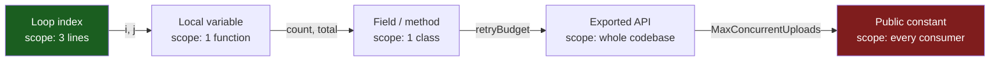
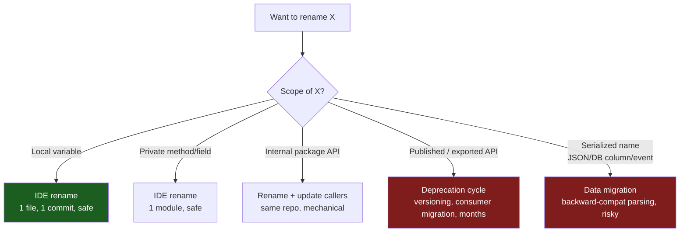

# Meaningful Names — Middle Level

> Focus: "Why does the rule exist?" and "When does it bend?" — the judgment calls behind naming, not the definitions. You already know `userCount` beats `n`; this file is about the cases where `n` actually wins.

---

## Table of Contents

1. [The one rule under all the rules: optimize for the reader](#the-one-rule-under-all-the-rules-optimize-for-the-reader)
2. [Name length should track scope](#name-length-should-track-scope)
3. [When a short name is the right name](#when-a-short-name-is-the-right-name)
4. [Domain language beats generic language](#domain-language-beats-generic-language)
5. [Naming at boundaries: APIs vs internals](#naming-at-boundaries-apis-vs-internals)
6. [Naming booleans, collections, and async](#naming-booleans-collections-and-async)
7. [The anti-patterns, at a trade-off level](#the-anti-patterns-at-a-trade-off-level)
8. [The cost of renaming](#the-cost-of-renaming)
9. [Consistency vs. correctness](#consistency-vs-correctness)
10. [Naming across Go, Java, and Python](#naming-across-go-java-and-python)
11. [Common Mistakes](#common-mistakes)
12. [Test Yourself](#test-yourself)
13. [Cheat Sheet](#cheat-sheet)
14. [Summary](#summary)
15. [Further Reading](#further-reading)
16. [Related Topics](#related-topics)

---

## The one rule under all the rules: optimize for the reader

Every naming rule in this chapter is a special case of one principle: **a name is a message to the next person who reads the code, and that person is usually you, six months from now, with no memory of today's context.**

Code is written once and read dozens of times. The asymmetry is the whole argument. Spending ten extra seconds choosing `remainingRetryBudget` over `r` is a bad trade for the writer and an excellent trade for the codebase, because the cost lands once and the benefit lands on every future read.

This reframes the rules as economics rather than etiquette:

- "Intention-revealing names" exists because a reader who must run the code in their head to learn what a variable holds is paying interpreter tax on every read.
- "Avoid disinformation" exists because a *wrong* name is worse than no name — it actively misleads, and the reader trusts it until a bug proves it false.
- "Pronounceable / searchable" exists because names live in conversations, code review, and `grep`, not just on screen.

When two rules conflict, resolve the tie by asking: *which choice costs the reader less?* That question outranks any individual guideline below.

---

## Name length should track scope

The single most useful heuristic this chapter offers and the book under-states: **the broader the scope of a name, the longer and more descriptive it should be; the narrower the scope, the shorter it may be.**

Scope is *how far the name travels* — how many lines, how many functions, how many files can see it.



The reasoning is about **distance between definition and use**. In a three-line loop, the definition of `i` is on screen at every use; the reader needs no reminder of what it means. A package-level exported function might be called from a file the reader has never opened — its name is the *only* documentation they get. So:

```go
// Narrow scope — short name is correct.
for i := 0; i < len(rows); i++ { ... }

// Wide scope — the name must carry the full meaning to a distant reader.
func ReconcileOutstandingInvoices(ctx context.Context, asOf time.Time) error { ... }
```

Inverting this rule produces two distinct smells:

- **Too short for the scope:** an exported function named `Proc` or a struct field `d`. The reader at the call site has no context. This is the common failure.
- **Too long for the scope:** `theCurrentlyIteratedCustomerRecord` as a loop variable. Verbosity in a tiny scope is noise that crowds out the logic. This is the over-correction junior developers make after being told "no single letters."

Java's convention of long names tolerates more verbosity than Go's, where the community explicitly prefers `r` over `theReader` for a receiver — *because the scope is the method body and the type already says "Reader."*

---

## When a short name is the right name

"Avoid single-letter names" is a guideline for junior readers; the middle-level truth is that several short names are not just acceptable but *preferred*. Reaching for a long name in these cases signals you haven't internalized scope.

**1. Conventional loop indices.** `i`, `j`, `k` for integer indices are a 50-year-old convention that every reader parses instantly. `customerIndex` in a five-line loop adds nothing.

**2. Mathematical / well-known formulas.** When the code transcribes a known equation, the variables should match the equation, not invent prose.

```python
# Quadratic formula — a, b, c are MORE readable than coefficientA, coefficientB.
discriminant = b**2 - 4*a*c
root1 = (-b + math.sqrt(discriminant)) / (2*a)
```

Renaming `a, b, c` to `firstCoefficient, secondCoefficient, constantTerm` makes the formula *harder* to verify against a textbook.

**3. Idiomatic receivers and short-lived bindings.** Go receivers are 1–2 letters by convention (`func (s *Server) ...`). A `lambda x: x * 2` or a comprehension `[w for w in words]` uses short names because the binding lives one line.

**4. Established domain abbreviations.** `ctx`, `id`, `url`, `db`, `tx`, `req`, `resp` are not abbreviations to the audience — they're vocabulary. Expanding `ctx` to `executionContext` everywhere is fighting the reader's expectations.

The test for "is this short name OK?" is: **can the reader resolve its meaning without scrolling?** If the definition and every use fit on one screen and the type or convention makes the meaning obvious, short is correct.

---

## Domain language beats generic language

A name like `data`, `info`, `value`, `item`, or `object` is a placeholder the writer never replaced. It tells the reader nothing the type didn't already say. The cure is **domain language** — the words your product team, your users, and your specs actually use.

```java
// Generic — every word is filler.
void process(Map<String, Object> data) { ... }

// Domain — the name carries the business concept.
void settleDisputedChargeback(Chargeback chargeback) { ... }
```

The deeper payoff is *ubiquitous language* (Eric Evans' term): when the code uses the same words as the conversation, the gap between "what the business asked for" and "what the code does" shrinks. A reviewer can read `applyGracePeriod` and check it against the policy doc without translation.

The trade-off: domain language requires you to *know* the domain. Early in a project, you may not have the right word yet — and inventing one prematurely is worse than `data`, because a wrong domain term becomes a *pun* (see below) once the real concept arrives. It's legitimate to use a provisional generic name and rename once the domain crystallizes. Just don't ship `data` to a wide scope.

---

## Naming at boundaries: APIs vs internals

The same value deserves *different* names depending on whether it crosses a boundary. A public API name is a contract you can't easily change; an internal name is private and cheap to fix.

| | Public / exported API | Private / internal |
|---|---|---|
| Audience | Strangers, other teams, future consumers | You and your immediate collaborators |
| Cost of change | High — breaks callers, needs deprecation | Low — IDE rename, one commit |
| Optimize for | Discoverability, stability, self-documentation | Local clarity, brevity |
| Example | `Repository.FindByEmail(email)` | `lookup(e)` inside a 6-line helper |

Two practical consequences:

- **Spend your naming budget at the boundary.** It's worth a 20-minute debate to name an exported method `Drain` vs `Flush` vs `Close`, because every consumer reads it and you can't rename it without a major version. It's *not* worth that debate for a private temp variable.
- **Boundary names should match the consumer's mental model, not your implementation's.** A cache that's backed by Redis should expose `Get`/`Set`, not `RedisHGetAll`. Leaking implementation vocabulary into the API name is a form of disinformation — it over-promises about how the thing works and locks you into that implementation.

---

## Naming booleans, collections, and async

These three categories have predictable failure modes worth memorizing.

**Booleans should read as assertions.** A boolean's name should make `if (name)` read like an English claim. Prefix with `is`, `has`, `should`, `can`, `was`. Avoid negatives — `isNotReady` forces the reader to double-negate at every `if (!isNotReady)`.

```go
if user.isActive && !subscription.hasExpired { ... }   // reads naturally
if user.flag && !subscription.status { ... }            // reader must guess polarity
```

**Collections should be plural and say what's inside, not how it's stored.** `accountList` is a classic misleading name — if someone later swaps the `List` for a `Set`, the name now lies, and renaming touches every use. Name it `accounts`. The container type is the variable's *type*, not its *name*. (This is the "noise word + disinformation" pair the chapter's anti-patterns warn about.)

**Async / future values should name the eventual value, optionally with the async shape.** A `Promise<User>` or `Future<User>` or Go channel is *about* a user; name it `user` if context makes the asynchrony obvious, or `userResult` / `pendingUser` when you need to flag that it isn't resolved yet. The failure is naming it for the wrapper (`userPromise` everywhere) when the wrapper is incidental — but in a function juggling resolved *and* unresolved users, `pendingUser` vs `user` is a useful, intentional distinction.

```python
# Both unresolved and resolved live here — the distinction earns the suffix.
pending_user = fetch_user(user_id)      # a coroutine / awaitable
user = await pending_user               # the resolved value
```

---

## The anti-patterns, at a trade-off level

The chapter README lists six anti-patterns. Junior-level material says "don't." Here's *why* each is harmful and where the line actually sits.

**Misleading names.** The worst category, because a wrong name is trusted until disproven. `getActiveUsers()` that also returns suspended users will cause a bug the reader can't see coming — they read the name and stop reading the body. The cost isn't aesthetic; it's a latent defect. The bar: a name must never claim something the code doesn't do.

**Noise words** (`Manager`, `Processor`, `Data`, `Info`, `Helper`, `Service`). These don't distinguish. `ProductInfo` vs `Product` — what does `Info` add? If you can delete the word and lose no meaning, it's noise. The nuance: some of these words *are* meaningful in specific architectures — `OrderService` in a layered architecture genuinely signals "application-service layer." The smell is using them as a reflex when you can't think of the real concept.

**Mental mapping** — forcing the reader to hold a translation table in their head. Single-letter names beyond conventional loops (`a`, `b`, `tmp`, `x2`) make the reader remember "x2 is the deduplicated list." That working-memory load is the cost. Allowed where the convention *is* the map (loop `i`, math `a/b/c`).

**Puns** — the same word meaning two different things across layers. If `add` means "append to a list" in one class and "sum two numbers" in another and "insert into DB" in a third, a reader moving between them carries the wrong meaning. Consistency is the cure: pick one verb per concept (`append`, `sum`, `insert`) and never reuse.

**Gratuitous affixes** (`m_field`, `_field` for non-private, `IFoo` interfaces, `FooImpl`). These encode information the language or tooling already provides. `IFoo`/`FooImpl` is a tell that you let the interface and its sole implementation drift apart — usually the interface should take the clean name and the implementation the qualified one (`Foo` interface, `InMemoryFoo` impl). The trade-off: in C# `IFoo` is a binding ecosystem convention; fighting it loses more than it gains. *Consistency with the ecosystem can outrank the rule.*

**Hungarian notation / encoded types** (`strName`, `iCount`, `arrUsers`). Born in untyped/weakly-typed eras to track types the compiler didn't. In a statically typed language it's pure redundancy that *rots*: rename `strName` to a number and the `str` prefix now lies. The compiler already knows the type; the name should carry meaning the compiler *can't* — intent.

---

## The cost of renaming

A reason names matter more than they appear to: **renaming is cheap inside one module and expensive across a boundary, and the difference is the entire argument for spending effort up front.**



The killers are the bottom two boxes. A field name that gets serialized — into a JSON API response, a database column, a Kafka event schema, a config key — is no longer just a name. It's a **data format**, and renaming it requires backward-compatible parsing, a migration, or a version bump. This is why you spend real effort on names that escape the process boundary, and why a quick "I'll fix the name later" is a trap for anything that gets persisted or published.

Practical rule: **the further a name can travel from where it's defined, the more it's worth getting right the first time** — because "rename later" stops being a refactor and becomes a migration.

---

## Consistency vs. correctness

A genuine dilemma: your codebase uses `fetch` for retrieval everywhere, but you've concluded `load` is the *better* word. Do you introduce the better name, or stay consistent with the existing (slightly worse) one?

**Default to consistency.** A reader who has learned that "fetch means retrieval" in this codebase pays a tax every time a synonym appears — now they must wonder whether `load` means something subtly different. One consistent-but-imperfect verb beats three "better" synonyms, because consistency lets the reader stop thinking about vocabulary and start thinking about logic.

**Override consistency only when the existing name is *wrong*, not merely *suboptimal*.** If `fetch` is used for a method that *deletes*, that's disinformation — fix it, consistency be damned, because a misleading name causes bugs and an inconsistent-but-honest one only causes mild friction.

The decision rule:

| Existing name is... | New name is... | Action |
|---|---|---|
| Consistent, honest | "Better" synonym | Keep existing — don't fragment the vocabulary |
| Consistent, **misleading** | Honest | Rename — correctness outranks consistency |
| Inconsistent already (3 synonyms) | Any | Pick one, converge the others |

This is also why team-wide naming conventions (a glossary of approved verbs: `get`/`create`/`update`/`delete`/`find`/`list`) pay off: they make "the consistent choice" and "the correct choice" the same choice.

---

## Naming across Go, Java, and Python

The principles are universal; the conventions diverge enough that copying one language's style into another reads as foreign.

```go
// Go: short names, scope-driven. Exported = PascalCase, unexported = camelCase.
// Visibility is encoded in the FIRST LETTER's case — no public/private keyword.
type userStore struct{ db *sql.DB }              // unexported type
func (s *userStore) ByID(id int64) (*User, error) { ... }  // exported method, short receiver
// Idiomatic: NO "Get" prefix on getters — User() not GetUser(). Initialisms stay
// upper: userID, HTTPServer, parseURL — not userId, HttpServer, parseUrl.
```

```java
// Java: longer, more descriptive names. Verbosity is idiomatic and expected.
public final class UserRepository {
    public Optional<User> findById(long id) { ... }   // get/find/load verbs are conventional
    private boolean isEligibleForRefund(Order order) { ... }  // boolean reads as a question
}
// Interfaces take the clean noun (Repository), impls get qualifiers (JdbcUserRepository) —
// NOT IRepository / RepositoryImpl, which is a C# import that Java communities reject.
```

```python
# Python: snake_case for functions/vars, PascalCase for classes, UPPER for constants.
# Leading underscore signals "internal" by convention (no enforcement).
class UserRepository:
    def find_by_id(self, user_id: int) -> User | None: ...
    def _build_query(self, filters: dict) -> str: ...    # _ = "don't touch from outside"
MAX_RETRIES = 3                                          # module-level constant
# No Hungarian, no type prefixes — type hints carry the type; the name carries intent.
```

Key cross-language divergences a 1–3-year engineer trips on:

- **Go penalizes long names** that other languages reward. A Go reviewer will flag `customerIndex` in a loop; a Java reviewer would accept it.
- **Go drops the `Get` prefix** on accessors (`obj.Name()`); Java keeps it (`obj.getName()`); Python uses `@property` so the access reads like a field (`obj.name`).
- **Initialisms:** Go keeps them uppercase (`ID`, `URL`, `HTTP`); Java treats them as words (`Id`, `Url`, `Http`); Python lowercases in snake_case (`user_id`, `url`).
- **Visibility encoding:** Go uses case, Java uses keywords, Python uses a leading-underscore convention. None of these is "Hungarian" — they're language-level signals, not name-baked type encodings.

The meta-point: **idiomatic-for-the-language beats idiomatic-in-the-abstract.** A "perfect" name that violates the host language's conventions makes every native reader stumble.

---

## Common Mistakes

1. **Treating "no single letters" as absolute.** Renaming a quadratic-formula `a, b, c` or a three-line loop `i` to verbose names makes code *less* readable. The rule is scope-relative.
2. **Naming the container, not the contents.** `userList`, `dataMap`, `resultArray` — the type is the variable's type, not its name. When the container changes, the name lies.
3. **Encoding types the compiler knows.** `strName`, `iCount`, `arrUsers` in a typed language is redundant and rots on the first type change.
4. **`IFoo` + `FooImpl` reflex.** Outside C#, give the interface the clean name and the implementation a descriptive qualifier (`InMemoryStore`, `JdbcStore`).
5. **Shipping placeholder names to wide scope.** `data`, `info`, `tmp`, `result` are fine in a two-line local scope and unacceptable on an exported API.
6. **Negated booleans.** `isNotReady`, `disableLogging=false` force double-negation at the call site. Name the positive case.
7. **Fragmenting vocabulary with synonyms.** Using `fetch`, `get`, `load`, `retrieve` interchangeably forces the reader to wonder if they differ.
8. **Renaming a serialized name casually.** A JSON field, DB column, or event key is a data contract, not just a name — renaming is a migration.
9. **Copying another language's conventions.** `userId` in Go (should be `userID`), `getName()` in Python (should be a property), `customerIndexCounter` in Go (too long).
10. **Premature domain terms.** Inventing a domain word before you understand the domain creates a pun when the real concept arrives. A provisional generic name can be safer.

---

## Test Yourself

**1. A loop variable is named `i`. A reviewer demands you rename it to `currentRowIndex`. Are they right?**

<details><summary>Answer</summary>

It depends entirely on scope. In a tight, three-line loop where `i` indexes obvious rows, `i` is correct and `currentRowIndex` is noise — the convention makes the meaning instant. If the "loop" is 60 lines with nested loops and `i` is used far from its declaration, the reviewer is right: the scope grew past what a single letter can carry. The rule is scope-relative, not absolute.
</details>

**2. You have a `List<Account>` field named `accountList`. What's wrong, and what if it becomes a `Set`?**

<details><summary>Answer</summary>

The name encodes the container type, not the contents — `List` is the variable's *type*, which the declaration already states. The intent is "the accounts," so name it `accounts`. The container-in-the-name problem becomes acute the moment someone swaps the `List` for a `Set` to dedupe: now `accountList` is a misleading name (disinformation), and fixing it touches every use site. A type-free name (`accounts`) never lies and never needs renaming when the implementation changes.
</details>

**3. Your codebase uses `fetch` for all retrieval. You think `load` is a better word. Do you switch?**

<details><summary>Answer</summary>

No. `fetch` is consistent and honest, and `load` is merely a "better" synonym. Introducing it fragments the vocabulary: every reader who has learned "fetch = retrieval here" now has to wonder whether `load` means something different. Consistency lets readers stop thinking about words and start thinking about logic. Override consistency only when the existing name is *wrong* (e.g., `fetch` on a method that deletes), not when it's merely suboptimal.
</details>

**4. Why is `getActiveUsers()` that also returns suspended users worse than a method named `getUsers()`?**

<details><summary>Answer</summary>

Because a misleading name is worse than a vague one. `getUsers()` is honest about being unspecific; the reader knows to check. `getActiveUsers()` makes a specific claim the reader will *trust and stop verifying* — they'll filter for "active" assuming it's done, and ship a bug that's invisible at the call site. A wrong name is a latent defect; a vague name is just friction.
</details>

**5. In Go you write `func GetUserId(u *User) string`. A reviewer flags two things. What?**

<details><summary>Answer</summary>

Two Go-idiom violations: (1) drop the `Get` prefix — idiomatic Go accessors are `UserID()`, not `GetUserID()`; the `Get` is noise Go reads as redundant. (2) `Id` should be `ID` — Go keeps initialisms uppercase (`ID`, `URL`, `HTTP`), so it's `UserID`, not `UserId`. The principle is universal but the convention is language-specific; the same name would be fine in Java.
</details>

**6. When is `IUserRepository` / `UserRepositoryImpl` acceptable, and when is it a smell?**

<details><summary>Answer</summary>

Acceptable in C#, where `IFoo` is a deep, binding ecosystem convention — fighting it costs more than it gains (consistency-with-ecosystem outranks the rule). A smell in Java/Go/Python, where the idiom is to give the *interface* the clean name (`UserRepository`) and the implementations descriptive qualifiers (`JdbcUserRepository`, `InMemoryUserRepository`). `FooImpl` is a tell that you have exactly one implementation and reached for an affix instead of a meaningful distinction.
</details>

**7. You want to rename a field `usr` to `user`. When is this a 30-second IDE refactor and when is it a multi-week project?**

<details><summary>Answer</summary>

30 seconds if `usr` is a local variable or private field — IDE rename, one commit, safe. Multi-week if the field is serialized: a JSON API response key, a database column, or an event-schema field. At that point the name is a *data contract*, and renaming requires backward-compatible parsing, a data migration, or an API version bump. The further a name escapes the process boundary, the more "rename later" turns into "migrate later."
</details>

**8. Is `tmp` ever an acceptable name?**

<details><summary>Answer</summary>

Yes — in a scope so narrow the definition and every use are visible at once, and the value genuinely has no better name (e.g., a swap: `tmp := a; a = b; b = tmp`). The classic swap has no meaningful concept to name. The moment `tmp` lives more than a few lines, or holds something with a real identity (a parsed config, a deduplicated list), it becomes mental-mapping debt and should carry its meaning.
</details>

---

## Cheat Sheet

| Situation | Guideline | Why |
|---|---|---|
| Loop index, 3-line scope | `i`, `j`, `k` are fine | Convention; definition visible at every use |
| Math formula | Match the equation (`a`, `b`, `c`) | Verifiability against the source |
| Exported function / type | Long, descriptive, stable | Only documentation a distant caller gets |
| Boolean | `is`/`has`/`should` + positive phrasing | Reads as an assertion; avoids double-negation |
| Collection | Plural noun, no container in name (`accounts`) | Type is the type; name survives implementation swaps |
| Async value | Name the eventual value; suffix only to disambiguate | Wrapper is incidental, not the concept |
| Interface vs impl | Interface = clean noun; impl = qualified | Avoid `IFoo`/`FooImpl` outside C# |
| Generic placeholder (`data`, `info`) | OK in tiny local scope; never on an API | Carries no meaning the type didn't |
| Synonym for an existing verb | Don't introduce it | Consistency beats a marginally "better" word |
| Misleading existing name | Rename now | Correctness outranks consistency |
| Serialized name | Treat as a data contract | Rename = migration, not refactor |
| Go vs Java vs Python | Follow host-language idiom | `userID` not `userId`, property not `getName()` |

**One-line decision rule:** *short for narrow scope, descriptive for wide scope; never encode the type or the container; never let a name claim something the code doesn't do.*

---

## Summary

Naming is economics: a name is written once and read constantly, so effort spent on it amortizes across every future read. Every rule in this chapter reduces to *cost the reader less*.

The governing heuristic is **scope**: the broader a name's reach, the more it must say. A three-line `i` and a package-exported `ReconcileOutstandingInvoices` are both correct because each matches its scope. Short names are right for conventional indices, math, idiomatic receivers, and established vocabulary (`ctx`, `id`, `url`); long names are right for anything a stranger will read.

Spend your naming budget at boundaries, where names become contracts and renaming becomes migration. Inside a module, names are cheap and clarity-local. Prefer domain language over generic placeholders, positive booleans over negated ones, and contents over containers in collection names. When consistency and a "better" synonym conflict, keep consistency; override it only when the existing name is genuinely *misleading*, because a wrong name causes bugs while an imperfect one only causes friction. And respect the host language — `userID` in Go, `getName()` in Java, a property in Python — because idiomatic-for-the-language beats idiomatic-in-the-abstract.

---

## Further Reading

- [`junior.md`](junior.md) — the rules and clean-vs-dirty examples, if you want the definitions first.
- [`senior.md`](senior.md) — team scale: naming glossaries, linters, and review heuristics that make the consistent choice and the correct choice the same.
- [`naming-recipes.md`](naming-recipes.md) — reusable name templates for booleans, async values, collections, domain types, errors, and events.
- [`../README.md`](../README.md) — chapter index and the anti-patterns checklist.

---

## Related Topics

- [`../02-functions/README.md`](../02-functions/README.md) — function names are the highest-leverage names; the scope and boundary rules apply directly.
- [`../../refactoring/README.md`](../../refactoring/README.md) — Rename Variable / Rename Method are the mechanical cures; the cost-of-renaming section explains when they're cheap.
- [`../../design-patterns/README.md`](../../design-patterns/README.md) — pattern vocabulary (`Factory`, `Strategy`, `Adapter`) is shared naming that aids communication when used precisely — and noise when used as a reflex.
- [`../../anti-patterns/README.md`](../../anti-patterns/README.md) — noise words and gratuitous affixes are naming-level anti-patterns that scale into architectural ones.
- [`../../functional-programming/README.md`](../../functional-programming/README.md) — short, scope-local names (`x`, `xs`) are idiomatic in FP for exactly the scope reasons covered here.