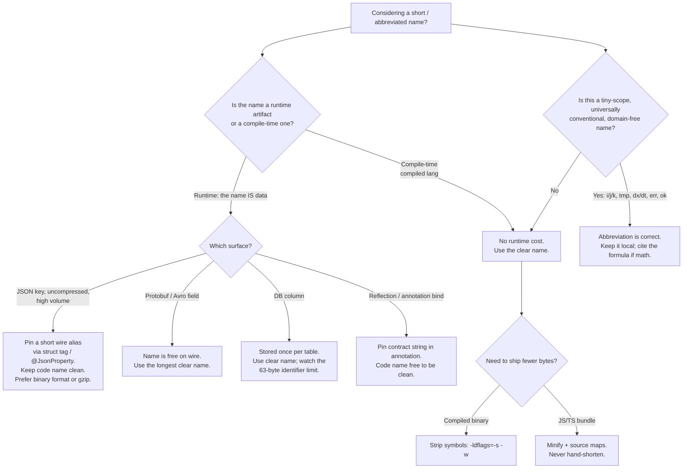

# Meaningful Names — Optimize & Reconcile

> Clean naming is a default, not an absolute. This file collects the cases where descriptive names meet a real cost — wire-format bytes, build latency, hot-loop conventions, minification — and resolves each one. The rule that survives every scenario: **clean by default; abbreviate only with a documented reason backed by a measurement.**

---

## Table of Contents

1. [Do long names cost anything at runtime? (compiled languages)](#scenario-1--do-long-names-cost-anything-at-runtime-compiled-languages)
2. [Binary size and the symbol table](#scenario-2--binary-size-and-the-symbol-table)
3. [Field names ARE the wire format — JSON](#scenario-3--field-names-are-the-wire-format--json)
4. [Protobuf — names are free on the wire, expensive in `.proto`](#scenario-4--protobuf--names-are-free-on-the-wire-expensive-in-proto)
5. [Database column names as a serialization surface](#scenario-5--database-column-names-as-a-serialization-surface)
6. [Name length vs. IDE and build performance](#scenario-6--name-length-vs-ide-and-build-performance)
7. [Identifier interning and string-pool pressure](#scenario-7--identifier-interning-and-string-pool-pressure)
8. [Naming generated code](#scenario-8--naming-generated-code)
9. [Minification — the deliberate inverse of clean naming](#scenario-9--minification--the-deliberate-inverse-of-clean-naming)
10. [When abbreviations are correct — hot loops](#scenario-10--when-abbreviations-are-correct--hot-loops)
11. [When abbreviations are correct — math and physics](#scenario-11--when-abbreviations-are-correct--math-and-physics)
12. [Searchable names vs. grep noise](#scenario-12--searchable-names-vs-grep-noise)
13. [Reflection-driven binding where the string literally matters](#scenario-13--reflection-driven-binding-where-the-string-literally-matters)

---

## Scenario 1 — Do long names cost anything at runtime? (compiled languages)

**The worry:** a junior renames `n` to `numberOfActiveSubscribers` everywhere and a reviewer objects that "long names are slower."

**Reasoning:** in a compiled language the identifier is a *compile-time* artifact. After the compiler resolves a name to a stack slot, a register, or a memory offset, the name is gone. The CPU never sees `numberOfActiveSubscribers`; it sees `mov rax, [rbp-0x18]`.

Demonstration in Go — two functions identical except for identifier length:

```go
func sumA(s []int) int { n := 0; for _, x := range s { n += x }; return n }

func sumB(theRunningAccumulatedTotalOfAllElements []int) int {
    theRunningAccumulatedTotal := 0
    for _, currentElementBeingVisited := range theRunningAccumulatedTotalOfAllElements {
        theRunningAccumulatedTotal += currentElementBeingVisited
    }
    return theRunningAccumulatedTotal
}
```

`go build -gcflags='-S'` emits **byte-for-byte identical** machine code for the loop bodies. The names exist only in DWARF debug sections.

<details><summary>Resolution</summary>

In Go, Java (post-JIT), C, C++, Rust, and Swift, identifier length has **zero** runtime cost. The only artifacts that carry the long name are debug info and (sometimes) the symbol table — see Scenario 2. Never shorten a name for "runtime speed" in a compiled language; the claim is false. Use the clear name.

</details>

---

## Scenario 2 — Binary size and the symbol table

**Scenario:** a Go service ships in a distroless container; the team is shaving image size. Someone proposes shorter exported identifiers to shrink the binary.

**Measurement:** exported symbols and function names are retained in the binary's symbol table and DWARF tables for stack traces and profiling. Long names do enlarge these sections — but the right lever is *stripping*, not renaming.

```bash
go build -o app .                 # 14.8 MB  (with symbols + DWARF)
go build -ldflags="-s -w" -o app .  # 9.6 MB  (-s strips symbol table, -w strips DWARF)
```

Renaming `numberOfActiveSubscribers` to `n` across the codebase might save tens of kilobytes in the symbol table. Stripping saves **megabytes** and is one flag.

<details><summary>Resolution</summary>

Optimize binary size with `-ldflags="-s -w"` (Go), `strip` (C/C++/Rust release builds already strip), or `R8`/ProGuard for JVM/Android. Identifier renaming is the wrong tool: it costs readability across the whole codebase to save a rounding error. Keep clean names; strip the binary. Note the trade-off: stripping removes symbolized stack traces, so keep an unstripped artifact (or upload DWARF to a symbol server / Sentry) for crash analysis.

</details>

---

## Scenario 3 — Field names ARE the wire format (JSON)

**Scenario:** a high-throughput event pipeline emits ~80,000 JSON messages/sec. Each message repeats its keys. Here the field *name* is not a compile-time artifact — it is data on the wire, transmitted and stored on every single message.

```go
type Event struct {
    NumberOfActiveSubscribersAtEventTime int    `json:"numberOfActiveSubscribersAtEventTime"`
    GeographicRegionIdentifierCode       string `json:"geographicRegionIdentifierCode"`
    Timestamp                            int64  `json:"timestamp"`
}
```

A single message serializes to ~120 bytes; the keys alone are ~70 of them. At 80k msg/sec that is **5.6 MB/sec of repeated key strings** — over a year of retention, terabytes that compress poorly when keys vary.

**The tension:** the clean rule says use the long name. The wire says every byte is paid 80,000 times per second.

<details><summary>Resolution</summary>

This is the **one** place where name length has a genuine, measurable runtime cost — but resolve it without sacrificing clean *code* identifiers. The fix is to decouple the in-memory name from the serialized name via the tag:

```go
type Event struct {
    ActiveSubscribers int    `json:"subs"`   // clean code name, terse wire name
    RegionCode        string `json:"region"`
    Timestamp         int64  `json:"ts"`
}
```

In Java use `@JsonProperty("subs")`; in Python's Pydantic use `Field(alias="subs")`. The struct field stays clean and searchable; the wire key is short. Better still: do not hand-optimize JSON for this. Switch to a schema-based binary format (Protobuf, Avro, MessagePack) where field names cost nothing on the wire (Scenario 4), or enable transport compression (gzip/zstd) which collapses repeated keys to near-zero. Hand-shortening JSON keys is a last resort for hot, uncompressed, high-volume channels — and when you do it, the abbreviation is the *documented reason* the rule allows.

</details>

---

## Scenario 4 — Protobuf — names are free on the wire, expensive in `.proto`

**Scenario:** the same pipeline migrates to Protobuf. A reviewer asks whether the verbose field names in the `.proto` will bloat messages like the JSON did.

**Reasoning:** Protobuf's wire format encodes each field by its **integer field number and wire type**, not its name. The descriptive name lives only in the `.proto` source and the generated code.

```protobuf
message Event {
  int32  number_of_active_subscribers_at_event_time = 1;  // name absent from wire
  string geographic_region_identifier_code           = 2;
  int64  timestamp                                    = 3;
}
```

On the wire, field 1 is a single tag byte `0x08` (field number 1, varint) followed by the value. The 44-character name contributes **zero bytes** to every message.

<details><summary>Resolution</summary>

In Protobuf, Cap'n Proto, FlatBuffers, and Avro (schema separate from data), field names are free on the wire — so use the **most descriptive name you can** in the schema. The cost moves to two places: (1) the field *number* is the real contract and must never be reused or reordered; (2) `proto.Marshal` reflection and any JSON-bridge (`protojson`) does pay for name strings, but in the schema/codegen path, not per message. Conclusion: with a name-free binary format, the JSON tension of Scenario 3 disappears entirely. Clean names win outright. Reserve terse wire keys for formats where the name *is* the bytes.

</details>

---

## Scenario 5 — Database column names as a serialization surface

**Scenario:** a table has 400M rows and a column proposed as `customer_lifetime_value_in_minor_currency_units`.

**Reasoning:** unlike a JSON key, a column name is stored **once** in the catalog (`pg_attribute`), not per row. The per-row storage is the value, not the name. So a long column name costs essentially nothing in storage.

What it *does* cost:
- Every query that references the column repeats the 48-char name — a network/parse cost paid per query, negligible vs. execution.
- Some engines cap identifier length: PostgreSQL truncates at **63 bytes**, Oracle historically at 30 (now 128), MySQL at 64. A name that silently truncates becomes a *misleading* name — two columns can collide after truncation.
- ORMs and code reference the column; the name leaks into application identifiers and sometimes into JSON output (Scenario 3).

```sql
-- Clear, within the 63-byte PostgreSQL limit:
ALTER TABLE customers ADD COLUMN lifetime_value_minor_units BIGINT;
-- Risky: 51 bytes is fine, but watch generated index names that append suffixes
CREATE INDEX idx_customers_lifetime_value_minor_units_desc ON ... -- may exceed 63!
```

<details><summary>Resolution</summary>

Use descriptive column names; storage is once-per-table, not per-row. Two guardrails: (1) stay clear of the engine's identifier limit — and remember generated names (indexes, constraints, foreign keys) append suffixes and overflow first; name them explicitly to control truncation; (2) decouple the column name from the API name with an explicit ORM mapping so a clean DB name does not force a verbose JSON key. The DB-side abbreviation pressure is real only at the *identifier-length limit*, not for performance.

</details>

---

## Scenario 6 — Name length vs. IDE and build performance

**Scenario:** "Our IDE feels sluggish on this 2M-line monorepo; are long, similar identifiers slowing autocomplete and indexing?"

**Reasoning:** symbol indexers (gopls, IntelliJ's stub index, clangd, rust-analyzer) key on identifiers. The cost driver is the **number of distinct symbols and their scoping**, not the character count of each name. Autocomplete ranking does prefix/fuzzy-match over the symbol set; matching `numberOfActiveSubscribers` vs `n` differs by microseconds.

Where length marginally matters:
- Fuzzy matchers score longer candidates over more positions — sub-millisecond, imperceptible.
- A pathological pattern: 500 identifiers sharing a 40-char common prefix (`getCustomerAccountManagementService...`) defeats prefix-based ranking and forces fuzzy scoring across a large candidate set. The fix is better *structure* (packages/namespaces), not shorter names.

The actual IDE/build cost drivers are: file count, dependency graph depth, macro/generic instantiation, and incremental-compilation granularity — none correlate with identifier length.

<details><summary>Resolution</summary>

Identifier length has no meaningful effect on IDE or compiler performance. If a monorepo's tooling is slow, profile the indexer and build graph (e.g., `gopls` logs, Gradle build scans, `cargo build --timings`) — the answer is dependency/codegen structure, never name length. Do not shorten names to "help the IDE"; that is a folk optimization.

</details>

---

## Scenario 7 — Identifier interning and string-pool pressure

**Scenario:** a Java service parses config keys and JSON field names into `String`s used as map keys, comparing them millions of times. Profiling shows time in `String.equals`.

**Reasoning:** this is *not* about the identifiers in your source — it is about **runtime string values that happen to be names**. When the same logical name (e.g., a JSON key `"region"`) is re-parsed into a fresh `String` per message, every map lookup pays a full character-by-character `equals` after a hash hit, because the references differ.

```java
// Each parse produces a NEW String instance for the same logical key:
String key = parser.readFieldName();         // fresh "region" each time
Object v = configMap.get(key);                // hash + full char compare
```

Interning collapses equal strings to one canonical reference, enabling identity (`==`) fast-paths and shrinking heap:

```java
String key = parser.readFieldName().intern(); // canonical reference
// or, better, a bounded app-managed cache to avoid permgen/metaspace pressure:
String key = KEY_POOL.computeIfAbsent(raw, Function.identity());
```

<details><summary>Resolution</summary>

Interning is a runtime-value optimization, orthogonal to source naming — never shorten your *code* identifiers because of it. When name-like strings dominate equality checks in a hot path, intern them (or use an app-managed canonical cache; avoid `String.intern()` at unbounded scale because it lives in native memory and is hard to evict). Even better, parse name strings into an `enum` or interned token *once at the boundary* and compare tokens by identity thereafter — the "Parse, don't validate" move applied to names.

</details>

---

## Scenario 8 — Naming generated code

**Scenario:** a codegen tool (Protobuf compiler, OpenAPI generator, sqlc, ORM scaffolder) produces identifiers. Should generated names follow the clean-naming rules a human would?

**Reasoning:** generated code is read by humans during debugging and read by *more codegen* during builds. Two distinct audiences:
- Human-facing generated API (what callers import): must be as clean as hand-written code, because it becomes the public surface. `protoc` maps `number_of_active_subscribers` to `NumberOfActiveSubscribers` (Go) — correct, idiomatic.
- Internal machine-only artifacts (mangled symbols, `__generated_field_42`, hash-suffixed CSS classes from CSS Modules): readability is irrelevant; **stability and uniqueness** are the real requirements. A generated name must be deterministic across builds (so diffs are clean) and collision-free.

```ts
// CSS Modules output — name is a stable hash, intentionally unreadable:
.button { } /* becomes */ .Button_button__3kJ2a { }
```

<details><summary>Resolution</summary>

Split by audience. Where generated code is part of the human-facing API, the generator must apply clean-naming conventions (correct casing, expand abbreviations, no noise words) — and you should *configure* the generator to do so rather than rename its output by hand (hand edits are lost on regeneration). Where the names are machine-only, optimize for determinism, uniqueness, and collision resistance, not prose. Never hand-edit generated files; fix the template or generator config. Mark generated files (`// Code generated ... DO NOT EDIT.`) so reviewers and linters skip naming critiques.

</details>

---

## Scenario 9 — Minification — the deliberate inverse of clean naming

**Scenario:** a frontend bundle ships `numberOfActiveSubscribers` and dozens of equally descriptive names. The bundle is 480 KB; mobile users on slow links abandon. Here, unlike compiled languages, **the JavaScript source IS the deliverable** — every identifier character is downloaded, parsed, and executed by the client.

**Measurement:** minifiers (Terser, esbuild, SWC) rename local identifiers to single letters and strip whitespace; this is the *intentional inverse* of clean naming, applied mechanically at build time.

```js
// Authored (clean, descriptive — what you maintain):
function calculateMonthlyRecurringRevenue(activeSubscriptions, averageRevenuePerUser) {
  return activeSubscriptions * averageRevenuePerUser;
}

// Minified (what ships — names destroyed on purpose):
function a(b,c){return b*c}
```

On a real React app, descriptive source → minified typically drops bundle size 30–60% before gzip, and gzip then collapses the now-repetitive short tokens further. esbuild's `--minify` is two passes: `--minify-identifiers` (rename), `--minify-syntax`, `--minify-whitespace`.

The key insight: minification lets you have **both**. You write the cleanest possible names; the build tool produces the terse deliverable. You never trade readability for bytes by hand.

<details><summary>Resolution</summary>

In any language where source ships to the client (JS/TS, sometimes CSS, sometimes WASM text), keep authored names maximally clean and delegate shortening to the minifier — they are complementary, not opposed. Two caveats: (1) exported/public API names and object keys accessed via strings (`obj["activeSubs"]`) are *not* renamed by default (the minifier can't prove safety) — these behave like the JSON-key case of Scenario 3; (2) ship source maps so the destroyed names are reconstructed in stack traces and debuggers. Hand-shortening JS identifiers "to reduce bundle size" is obsolete and wrong: it fights the toolchain and loses source-map fidelity.

</details>

---

## Scenario 10 — When abbreviations are correct — hot loops

**Scenario:** a reviewer flags `for i := 0; i < n; i++` and `tmp` in a tight numeric loop, demanding `for index := 0; index < numberOfElements; index++`.

**Reasoning:** here the abbreviation is not a cost optimization (it has no runtime cost — Scenario 1) but a **readability** optimization. `i`, `j`, `k` as loop indices and `tmp` for an obvious swap temporary are *established conventions* with near-universal recognition. Expanding them adds visual noise without adding information, and can *reduce* clarity by burying the loop's actual logic under boilerplate identifiers.

```go
// Idiomatic — i/j are conventional, scope is three lines, meaning is obvious:
for i := 0; i < n; i++ {
    for j := i + 1; j < n; j++ {
        if a[j] < a[i] { a[i], a[j] = a[j], a[i] }   // tmp not even needed in Go
    }
}

// Over-expanded — noise, not clarity:
for currentRowIndex := 0; currentRowIndex < numberOfRows; currentRowIndex++ {
    for currentColumnIndex := currentRowIndex + 1; ... // signal drowned
```

The conventions that earn this exemption: `i/j/k` (loop counters), `n` (count, in a local numeric context), `tmp` (short-lived swap/intermediate), `ok` (Go comma-ok), `err` (Go errors), `_` (discard), `ctx`, `db`, `tx`, `wg`, `mu` (Go idioms recognized community-wide).

<details><summary>Resolution</summary>

Short, conventional names are correct when **three conditions** all hold: the scope is tiny (a few lines), the meaning is universally understood in the language community, and the variable carries no domain meaning that a name would teach. The moment a loop index becomes a domain concept (`subscriberIndex` driving business rules across 40 lines), expand it. The principle is not "short = fast"; it is "match the name's length to the reader's need." `i` in a three-line loop needs nothing more; a field on a wire format needs a real name. This is the *documented reason* the global rule reserves for abbreviation.

</details>

---

## Scenario 11 — When abbreviations are correct — math and physics

**Scenario:** a graphics/physics routine uses `dx`, `dy`, `dt`, `v`, `a`, `theta`. A linter wants `horizontalDisplacement`, `deltaTimeInSeconds`.

**Reasoning:** in mathematics, physics, and signal processing, single letters and standard abbreviations *are* the domain's vocabulary. `dx`/`dt` is the universally understood notation for a derivative step; renaming to `changeInHorizontalPositionWithRespectToTime` discards the reader's existing fluency and makes the formula *harder* to verify against a textbook or paper.

```python
def integrate_velocity(v0: float, a: float, dt: float, steps: int) -> float:
    x, v = 0.0, v0
    for _ in range(steps):
        v += a * dt          # v = v0 + a·t  — matches kinematics directly
        x += v * dt
    return x
```

A reader who knows kinematics reads `v += a * dt` instantly; `currentVelocity += acceleration * deltaTimeInSeconds` reads slower and adds nothing a domain reader didn't already know.

<details><summary>Resolution</summary>

When the code transcribes an established formula, mirror the formula's notation — `dx`, `dt`, `theta`, `lambda`, `n`, `eps`. The audience is people fluent in that notation; matching it is *clearer*, not lazier. Anchor it with a comment citing the equation or paper (e.g., `// Euler integration; see Kinematics §2.1`) so a non-specialist has a bridge. Outside the formula's footprint — at the API boundary, in names other layers consume — switch back to descriptive names (`initialVelocity`, `accelerationMetersPerSecondSquared`). The exemption is local to the math; it does not leak into the public surface.

</details>

---

## Scenario 12 — Searchable names vs. grep noise

**Scenario:** two failure modes pull in opposite directions. A magic `7` is unsearchable — you cannot `grep` for the concept. But an over-generic constant name like `MAX` or a type named `Data` produces thousands of grep hits, which is *also* unsearchable in practice.

**Reasoning:** searchability is a *naming* property, not a runtime one. The goal is that a name maps **one concept ↔ one searchable token**.

```go
// Unsearchable magic number — concept has no name to grep:
if retries > 7 { ... }

// Searchable — grep "MaxLoginRetries" finds exactly the rule and its callers:
const MaxLoginRetries = 7
if retries > MaxLoginRetries { ... }

// Grep noise — too generic; "Manager"/"Data" match thousands of unrelated lines:
type DataManager struct { ... }   // grep "Manager" → 4,000 hits across the repo
```

The tension: long, specific names are highly searchable but verbose; short generic names are concise but produce grep noise *and* hide magic values. The win is **specific, not just long**: `MaxLoginRetries` is searchable because it is *specific*, not because it is long.

<details><summary>Resolution</summary>

Optimize names for a clean grep: each domain concept should have one distinctive, specific token that returns a focused result set. Name magic values so the concept is searchable (`MaxLoginRetries`, not `7`). Avoid generic nouns (`Manager`, `Processor`, `Data`, `Info`, `Helper`, `Util`) that flood grep with false positives — these are *anti-searchable*. The metric is not name length; it is signal-to-noise of `grep <token>`. A 12-character specific name beats a 4-character generic one and a bare literal on this axis. See `find-bug.md` for how unsearchable magic values hide defects.

</details>

---

## Scenario 13 — Reflection-driven binding where the string literally matters

**Scenario:** a Java team uses Jackson, JPA, and Spring `@Value` injection. Someone renames a field for clarity, and a deserialization breaks at runtime with no compile error.

**Reasoning:** in reflection/annotation-driven frameworks, an identifier is not purely a compile-time artifact — its **string spelling is part of a runtime contract**. The framework matches `subscriberCount` (Java field) against `subscriberCount` (JSON key, DB column, or config property) by name at runtime via reflection. Rename one side and the binding silently fails or maps to `null`.

```java
public class AccountSummary {
    // Field name is the binding key — renaming this breaks JSON/DB mapping at runtime:
    private int subscriberCount;          // matched against JSON "subscriberCount"
}
```

The cost here is not bytes or CPU — it is **coupling**: clean-renaming a field can break an external contract with no compiler safety net. Reflection also has a measurable per-access cost (cache misses on `Field.get`), but the binding fragility is the dominant concern.

<details><summary>Resolution</summary>

Where names are bound by reflection, decouple the *code* identifier from the *contract* string explicitly, so you can clean the code without breaking the wire:

```java
public class AccountSummary {
    @JsonProperty("subscriberCount")   // contract name pinned, independent of field name
    @Column(name = "subscriber_count") // DB contract pinned separately
    private int activeSubscriberCount; // code name free to be the clearest one
}
```

Now the field can be renamed for clarity without touching the JSON or DB contract. The rule survives: keep clean code names; pin the externally-visible string with an annotation so the contract is explicit and reflection-safe. For hot reflective paths, additionally cache resolved accessors (`MethodHandle`/`VarHandle`) once rather than reflecting per call.

</details>

---

## Rules of Thumb

- **Compiled-language names are free at runtime.** Identifier length never costs CPU after compilation. Never shorten a name for "speed" in Go/Java/Rust/C/C++/Swift. (Scenarios 1, 6)
- **The only true byte-cost of a name is when the name IS the data** — uncompressed JSON keys repeated per message. Resolve it with serialization aliases or a binary/compressed format, not by uglifying code identifiers. (Scenarios 3, 4)
- **Decouple the code name from the wire name.** Struct tags, `@JsonProperty`, `@Column`, Pydantic aliases — pin the external contract string so the in-memory identifier stays clean and refactorable. (Scenarios 3, 5, 13)
- **Binary format → use the longest clear name; text wire format → cost the keys.** Protobuf/Avro field names are free on the wire; JSON keys are not. (Scenarios 3, 4)
- **Shrink binaries by stripping, not renaming.** `-ldflags="-s -w"` / `strip` / R8 save megabytes; renaming saves a rounding error and costs readability. (Scenario 2)
- **Shrink JS bundles by minifying, not by hand-shortening.** Authored names stay clean; the minifier produces the terse deliverable; source maps restore names in traces. (Scenario 9)
- **Abbreviate only under three conditions, all true:** tiny scope, universally understood convention, no domain meaning lost. `i/j/k`, `tmp`, `err`, `ok`, `dx/dt/theta` qualify *inside their footprint*; they must not leak into public APIs. (Scenarios 10, 11)
- **Match notation to the audience.** Math code reads better in math notation; cite the source equation. Business logic reads better in business vocabulary. (Scenario 11)
- **Optimize for grep signal-to-noise, not length.** Specific beats long; both beat generic nouns (`Manager`, `Data`, `Helper`) and bare magic literals. (Scenario 12)
- **Generated code follows clean rules where it is human-facing; optimizes for determinism and uniqueness where it is machine-only.** Configure the generator; never hand-edit output. (Scenario 8)
- **Interning is a runtime-value optimization, orthogonal to source naming.** Parse name-strings to tokens/enums at the boundary; compare by identity in hot paths. (Scenario 7)
- **Default to clean.** Every abbreviation needs a documented reason backed by a measurement. Absent that reason, the descriptive name wins.

## Decision flow



## Related Topics

- [`README.md`](README.md) — the positive naming rules this file reconciles against constraints
- [`find-bug.md`](find-bug.md) — naming defects, including unsearchable magic values (Scenario 12)
- [`professional.md`](professional.md) — applying these trade-offs in real review and team settings
- [`naming-recipes.md`](naming-recipes.md) — concrete naming patterns and templates
- [Chapter README](../README.md) — Meaningful Names chapter overview
- [`../../functional-programming/README.md`](../../functional-programming/README.md) — naming in a value-oriented, immutable style
- [`../../refactoring/01-code-smells/01-bloaters/optimize.md`](../../refactoring/01-code-smells/01-bloaters/optimize.md) — the structural gold reference for clean-vs-cost reconciliation
