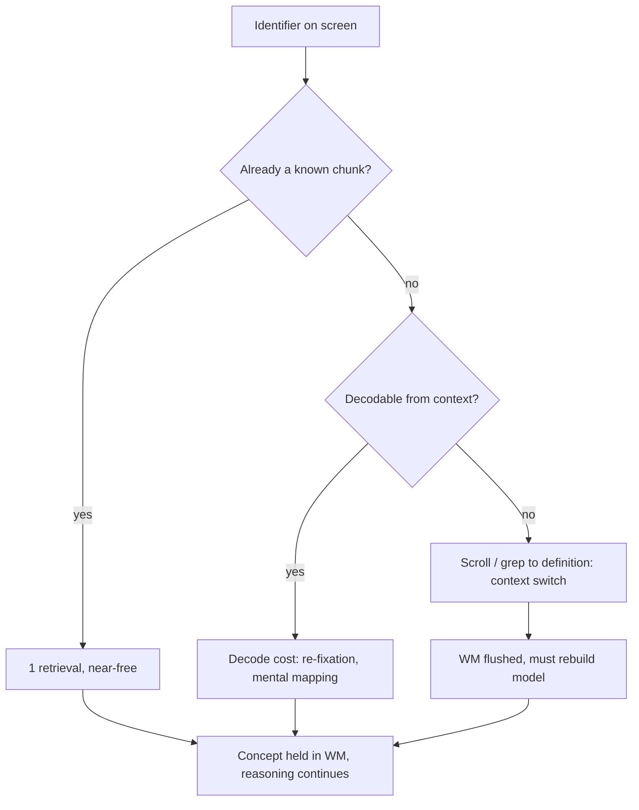

# Meaningful Names — Professional Level

> Focus: the deep end. Naming is a cognitive-science problem before it is a style problem. This level covers working-memory load and chunking, the empirical literature on identifier quality, naming across i18n and serialization boundaries, the cases where every Clean Code naming rule *correctly* breaks, and how a strong type system lets you stop naming bad states at all.

---

## Table of Contents

1. [Names as a working-memory interface](#names-as-a-working-memory-interface)
2. [The empirical record on identifier quality](#the-empirical-record-on-identifier-quality)
3. [Abbreviations: what the studies actually found](#abbreviations-what-the-studies-actually-found)
4. [Word frequency, neighborhood, and retrieval cost](#word-frequency-neighborhood-and-retrieval-cost)
5. [When a long "clean" name is wrong](#when-a-long-clean-name-is-wrong)
6. [Names under external constraints](#names-under-external-constraints)
7. [Naming across natural-language and i18n boundaries](#naming-across-natural-language-and-i18n-boundaries)
8. [Make illegal states unnameable: naming meets types](#make-illegal-states-unnameable-naming-meets-types)
9. [The limits and exceptions to every rule](#the-limits-and-exceptions-to-every-rule)
10. [Common Mistakes](#common-mistakes)
11. [Test Yourself](#test-yourself)
12. [Cheat Sheet](#cheat-sheet)
13. [Summary](#summary)
14. [Further Reading](#further-reading)
15. [Related Topics](#related-topics)

---

## Names as a working-memory interface

A name is the handle the reader's brain grabs to hold a concept in **working memory** while reasoning about the rest of the code. Miller's classic figure of "7 ± 2" items (Miller, 1956) is the popular version; the more defensible modern figure for *novel, unrehearsed* items is **about 4 chunks** (Cowan, 2001, *The magical number 4 in short-term memory*). Either way, the budget is small and fixed, and naming is the lever that controls how much of it a line of code consumes.

The mechanism that matters is **chunking**. Working memory holds chunks, not characters. `userId` is one chunk; `uid` forces the reader to *unpack* an abbreviation into the chunk it stands for, spending a retrieval cycle. A line with seven freshly-introduced single-letter variables exceeds the budget; the reader loses the earlier ones while decoding the later ones and has to re-scan — the measurable cost of a poor name is **re-fixation**, not misunderstanding.

This reframes the entire chapter. The junior rules ("intention-revealing," "pronounceable," "searchable") are not aesthetics. They are each a tactic for keeping the per-line chunk count under the working-memory ceiling:



Two engineering consequences follow:

- **Comprehension is reading, and reading dominates.** Code is read far more than written; multiple field studies of developer activity put comprehension at roughly half of maintenance effort (Minelli, Mocci & Lanza, *I Know What You Did Last Summer*, ICPC 2015, report ~50%+ of IDE time on navigation/reading). A name that saves the reader one re-fixation, multiplied across every reader for the life of the symbol, dwarfs the keystrokes it cost the author.
- **Locality of decode matters.** A name's quality is relative to the distance the reader must travel to resolve it. `i` is a *good* name inside a three-line loop (the definition is one fixation away) and a *bad* name as a struct field (the definition is a file away). This is why "long names for long scopes, short names for short scopes" is the one naming heuristic with the firmest cognitive grounding.

---

## The empirical record on identifier quality

Naming is one of the few clean-code topics with a real experimental literature. The headline results:

- **Identifier quality correlates with comprehension speed and accuracy.** Lawrie, Morrell, Feild & Binkley (*What's in a Name? A Study of Identifiers*, ICPC 2006) ran controlled experiments with hundreds of programmers across three identifier styles — single letters, abbreviations, and full words — and found full words and well-formed abbreviations produced significantly better comprehension than single letters, with full words best for retention.
- **Reading code is partly a *linguistic* act.** Siegmund et al. (*Understanding Understanding Source Code with Functional MRI*, ICSE 2014) showed program comprehension activates Brodmann areas associated with **natural-language processing and working memory**, not primarily mathematical reasoning. Good identifiers literally let the reader recruit their language faculty; bad ones force slower, deliberate decoding.
- **Eye-tracking confirms names are fixation hotspots.** Studies using eye trackers on code (e.g. Sharif & Maletic; Binkley et al.) show readers fixate disproportionately on identifiers, and that `camelCase` vs `snake_case` measurably changes fixation patterns — Binkley et al. (*The Impact of Identifier Style on Effort and Comprehension*, ESE 2013) found `snake_case` was read slightly more accurately but `camelCase` faster for the trained, with training effects dominating. Translation: pick one per language and be consistent; the *consistency* outweighs the choice.
- **Concise, descriptive names reduce defects.** Butler, Wermelinger, Yu & Sharp (*Exploring the Influence of Identifier Names on Code Quality*, CSMR 2010) found statistically significant associations between flawed identifier names (by a published quality flaw catalogue) and code quality issues such as FindBugs warnings.

The honest caveat for a senior reader: effect sizes are modest, samples are often students, and "comprehension" is operationalized differently across studies. The literature does *not* license dogma. What it robustly supports is the direction — clearer names help — and the shape — the benefit is in reading time and error rate, paid by every reader.

---

## Abbreviations: what the studies actually found

Clean Code says spell it out. The research says **it depends on whether the abbreviation is already a chunk for the reader.**

- Lawrie et al. (2006, above) and follow-ups found **well-known** abbreviations performed nearly as well as full words and *better* than single letters. The cost of an abbreviation is the decode step; if the abbreviation is already lexicalized in the reader's head, the decode is free.
- The killer is **inconsistency and ambiguity**, not brevity. `cnt`, `count`, `numItems`, and `n` for the same concept in one codebase is worse than any single choice. Schankin et al. (*Descriptive Compound Identifier Names Improve Source Code Comprehension*, ICPC 2018) found longer, more descriptive names helped — but the gain came from *disambiguation*, and over-long names showed diminishing returns.

The practical rule for a specialist:

| Abbreviation class | Verdict | Examples |
|---|---|---|
| Domain-universal | Keep — it *is* the chunk | `id`, `url`, `http`, `db`, `io`, `ctx`, `i/j/k` |
| Team-universal (in a glossary) | Keep, document once | `acct`, `txn`, `qty` *if* the glossary defines them |
| Ad-hoc / inventor-only | Expand | `usrMgrSvcImpl`, `calcTotPxs` |
| Collides with another meaning | Expand both | `temp` (temperature vs temporary) |

Go's culture is the live counter-example to spell-everything-out: idiomatic Go uses `i`, `r io.Reader`, `ctx context.Context`, `buf`, `n int` deliberately, because Go scopes are short and these are universal chunks. The Go proverb "the bigger the scope, the longer the name" is the cognitive locality rule restated.

---

## Word frequency, neighborhood, and retrieval cost

Psycholinguistics gives two more levers that rarely appear in naming guides:

- **The word-frequency effect.** High-frequency words are recognized faster and more reliably (a robust finding since Howes & Solomon, 1951). `fetch`, `build`, `find`, `send` are recognized faster than `marshal`, `coalesce`, `reify`, `hydrate`. When two words mean the same thing, prefer the higher-frequency one *unless* the rarer word carries a precise domain meaning the common one lacks (`debounce` is rare but exact).
- **Orthographic neighborhood / confusability.** Names that differ by one character (`genymdhms` vs `modymdhms`, Uncle Bob's own example) or share a long prefix (`XYZControllerForEfficientHandlingOfStrings` vs `XYZControllerForEfficientStorageOfStrings`) force a slow letter-by-letter comparison instead of fast whole-word recognition. This is why "searchable, distinct" names matter: it is the same effect that makes proofreading hard.

A concrete heuristic: a name should be **recognizable at a glance from its first and last few characters**, because that is how skilled readers actually read words. Names that fail this — long shared prefixes, near-anagrams, l/1/I and O/0 collisions — cost real fixation time.

---

## When a long "clean" name is wrong

Here is the example the rest of the chapter does not let you write: the "clean," intention-revealing long name that is **objectively worse** than a one-letter name.

Consider a numerical kernel — a Jacobi iteration step on a matrix. The domain is mathematics; the convention is the math.

**The "clean code" version (wrong here):**

```python
def jacobi_iteration(matrix, right_hand_side_vector, current_solution_estimate):
    next_solution_estimate = current_solution_estimate.copy()
    for row_index in range(len(matrix)):
        accumulated_off_diagonal_sum = 0.0
        for column_index in range(len(matrix)):
            if row_index != column_index:
                accumulated_off_diagonal_sum += (
                    matrix[row_index][column_index]
                    * current_solution_estimate[column_index]
                )
        next_solution_estimate[row_index] = (
            right_hand_side_vector[row_index] - accumulated_off_diagonal_sum
        ) / matrix[row_index][row_index]
    return next_solution_estimate
```

**The correct version (matches the textbook formula `x_i = (b_i − Σ_{j≠i} a_ij x_j) / a_ii`):**

```python
def jacobi_step(A, b, x):
    n = len(A)
    x_new = x.copy()
    for i in range(n):
        s = sum(A[i][j] * x[j] for j in range(n) if j != i)
        x_new[i] = (b[i] - s) / A[i][i]
    return x_new
```

The second version is *more* readable to its actual audience. A numerical-methods engineer holds the formula `Ax = b` in their head; `A`, `b`, `x`, `i`, `j` map one-to-one onto the math notation, so they are **maximally faithful chunks**. The verbose names break that mapping — the reader must now translate `accumulated_off_diagonal_sum` back into `Σ_{j≠i} a_ij x_j` to verify correctness against the reference. The long names *increase* working-memory load by inserting a translation layer between the code and its specification.

The principle: **the right name is the one that matches the reader's existing mental model with the least translation.** When the domain has an established, terse notation (linear algebra, physics with `c`, `E`, `m`; coordinate geometry with `x`, `y`, `z`; complex analysis with `z`, `w`), the established symbols *are* the intention-revealing names. Verbose substitutes are a clean-code anti-pattern dressed as virtue.

The same effect appears in performance code where the name's purpose is to mirror a hardware or protocol register (`rdi`, `xmm0`, `eax`), and in tight inner loops where a one-letter index is the universal chunk.

```java
// Java: a Householder-style transform. Greek/short names are correct here.
static void givensRotate(double[] v, int p, int q) {
    double a = v[p], b = v[q];
    double r = Math.hypot(a, b);
    double c = a / r, s = -b / r;   // cosine, sine — standard Givens notation
    v[p] = c * a - s * b;
    v[q] = s * a + c * b;
}
```

Naming `c` as `cosineOfRotationAngle` here would be graded *down* in a numerical-code review, because the reviewer is checking the code against the Givens rotation definition, where the symbols are `c` and `s`.

---

## Names under external constraints

Outside hand-written application logic, you frequently **do not own the name**. The name is dictated by a contract, and "clean" is whatever matches the contract exactly. Renaming for cleanliness here is a breaking change.

### Serialization and wire formats

A field that crosses a process boundary has a name that is **part of the type's public contract**. Idiomatic in-language style and on-the-wire style diverge, and the bridge is explicit mapping — never a rename.

```go
// Go: idiomatic exported Go names, but the JSON contract is fixed and snake_case.
type Account struct {
    ID        string    `json:"account_id"`   // wire name frozen by API v1
    CreatedAt time.Time `json:"created_at"`
    IsActive  bool      `json:"is_active"`     // do NOT "clean" to "active" — breaks clients
}
```

```python
# Python (Pydantic): internal snake_case, external camelCase locked by a JS client.
from pydantic import BaseModel, Field

class Account(BaseModel):
    account_id: str = Field(alias="accountId")
    created_at: str = Field(alias="createdAt")
    model_config = {"populate_by_name": True}
```

The rule: **the serialized name is data, not code.** It is governed by API-versioning discipline, not by naming taste. Changing `is_active` to `active` because the latter is "cleaner" silently breaks every deserializer in the field. If you need a better internal name, map it; keep the wire name stable until a versioned migration retires it (see [api-versioning] thinking — expand-contract: add the new field, dual-write, deprecate the old, remove on a major version).

### Database columns and generated code

- **DB columns** are a contract shared with reports, ETL jobs, DBA scripts, and downstream warehouses you cannot see. A column rename is a schema migration with a blast radius, not a refactor. Map at the ORM boundary (`@Column(name="...")`, SQLAlchemy `Column("legacy_name")`) and leave the column alone.
- **Generated code** (protobuf, gRPC, OpenAPI, ORMs, ANTLR) carries names produced by a generator. Hand-"cleaning" generated identifiers is erased on the next regen. Fix the *generator config* or the *source schema*, never the output.
- **Reflection / serialization keys.** A field renamed in Java that is read via reflection by Jackson, JPA, or a DI container will compile fine and fail at runtime. The name is load-bearing despite looking like a private detail.

> **Specialist instinct:** before renaming any symbol, ask *who else parses this string?* If the answer includes a wire, a disk, a DB, another language, or a generator, the name is a contract and the change is a migration.

---

## Naming across natural-language and i18n boundaries

English is the lingua franca of code, but teams are global. Two distinct problems:

1. **Source-identifier language.** Mixed-language identifiers (`berechneRechnung`, `计算总额`, `hisoblaSumma`) raise the decode cost for any reader who lacks that language and, worse, often *mix* — half-English, half-other — defeating both autocomplete and grep. The defensible rule: **identifiers in English, exhaustively and consistently**, even on a non-English-speaking team, because the standard library, dependencies, and the wider profession are English. Comments may be localized; identifiers should not be.

2. **Domain terms that resist translation.** Some domain words have no clean English equivalent (legal, tax, regional finance — German `Vorsteuer`, Islamic-finance `murabaha`, Brazilian `boleto`). Forcing a translation (`preInputTax`) is *less* precise than keeping the domain term. Keep the domain term as a documented loanword; it is the accurate chunk for everyone who works the domain.

i18n also bites at the **user-facing string** layer, which must never be conflated with identifiers. A message key is a stable identifier (`error.payment.declined`); its *value* is translated. Naming the key after the English text (`thePaymentWasDeclined`) couples the key to one language and breaks when the English copy is reworded.

```java
// Identifier (English, stable) vs user-facing value (localized, volatile)
String msg = bundle.getString("error.payment.declined"); // key = identifier, stays
// resource_en.properties: error.payment.declined = Your card was declined.
// resource_de.properties: error.payment.declined = Ihre Karte wurde abgelehnt.
```

A subtle trap: **homoglyphs and casing across locales.** Turkish dotless-i (`İ`/`ı`) breaks naive `toLowerCase()`-based identifier comparison; Unicode confusables let two "different" identifiers render identically. For anything security-relevant or compared as strings, normalize and prefer ASCII identifiers.

---

## Make illegal states unnameable: naming meets types

The deepest move in naming is to **stop needing a name for a bad state by making that state impossible to construct.** Naming and the type system are the same tool viewed from two angles: a good type is a name the compiler enforces.

Consider the classic boolean-soup signature:

```go
// Two booleans the caller must remember the meaning AND order of.
func sendEmail(to string, isHtml bool, isUrgent bool) error
// Call site: sendEmail(addr, true, false) — true what? false what?
```

The names `isHtml`/`isUrgent` are *correct* and still the call site is unreadable, because the boolean type erases the name at the call. Two cures, escalating:

```go
// Cure 1: named types make the call site self-documenting and prevent transposition.
type BodyFormat int
const (
    PlainText BodyFormat = iota
    HTML
)
type Priority int
const (
    Normal Priority = iota
    Urgent
)
func sendEmail(to string, format BodyFormat, prio Priority) error
// Call site: sendEmail(addr, HTML, Normal) — unambiguous, transposition is a compile error.
```

```java
// Java: an enum/sealed type names the legal set; illegal combinations cannot be expressed.
sealed interface Body permits PlainText, Html {}
record PlainText(String text) implements Body {}
record Html(String markup) implements Body {}

// You literally cannot construct a "Body that is both" — the bad state has no name.
```

This is the bridge to [13-generics-and-types] and [22-abstraction-and-information-hiding]: every time you reach for a name like `isValidatedButNotYetPersisted`, ask whether the type system can make the *unvalidated* and *validated* values **different types** so the questionable boolean never exists. `Email` (a parsed, validated value) vs `String` (anything) is naming-via-types: the name `email` no longer has to carry the warning "maybe not validated," because an `Email` *cannot* be unvalidated.

```python
# Python: NewType + a smart constructor encodes "validated" into the name's type.
from typing import NewType
Email = NewType("Email", str)

def parse_email(raw: str) -> Email | None:
    return Email(raw) if "@" in raw else None
# Downstream functions take Email, not str. The name 'email: Email' is a proof, not a hope.
```

The slogan from the typed-FP world (Yaron Minsky, "make illegal states unrepresentable") is, at root, a *naming* discipline: the names you don't have to write are the ones that can never be wrong.

---

## The limits and exceptions to every rule

A specialist knows each clean-code naming rule by its boundary conditions:

| Rule | Holds when | Correctly breaks when |
|---|---|---|
| "Spell out abbreviations" | Ad-hoc or rare abbreviations | The abbreviation is a universal chunk (`id`, `url`, `ctx`) or domain notation (`A`, `b`, `x` in linalg) |
| "No single-letter names" | Field/wide scope | Short scope (`i`, `j` in a loop; `r` for a one-line reader); math/physics symbols |
| "Long descriptive names" | Wide scope, business logic | Math kernels, hot loops, names mirroring a formula or register; diminishing returns past ~3–4 words (Schankin 2018) |
| "Names should be searchable" | Always preferred | A truly local temp where grep would only ever find the one site anyway |
| "No type encoding (Hungarian)" | Modern typed languages | OS/Win32 APIs that *are* Hungarian; systems Hungarian is dead, but **Apps Hungarian** (encoding *semantic* kind, e.g. `usName` = unsafe string) still has defenders (Spolsky, *Making Wrong Code Look Wrong*, 2005) |
| "Use intention-revealing names" | Always | When the "intention" name embeds an assumption that may change — name by *what it is*, not *what it's for*, when the use is volatile |
| "Class = noun, method = verb" | OO business code | Functional/pipeline code where a function is a value; combinators read as nouns |
| "No noise words (Manager, Data)" | Usually | A genuine GoF/role name (`ConnectionManager` where "manager" is the pattern's role) — but audit hard, most are filler |

The meta-rule: **clean-code naming rules are heuristics tuned for medium-scope business logic.** They are at their weakest in three regions — very small scopes (locality makes short names fine), formal/mathematical domains (notation beats prose), and contract boundaries (the name isn't yours to choose). Apply them with the cognitive model in mind, not as a linter does.

---

## Common Mistakes

- **Renaming a symbol that is secretly a contract.** A "harmless cleanup" rename of a JSON field, DB column, reflection key, or protobuf field breaks consumers at runtime, often silently. Check who parses the string before renaming.
- **Verbose names in mathematical/scientific code.** `accumulatedOffDiagonalSum` makes a numerical kernel *harder* to verify against its reference formula. Match the domain notation.
- **Treating brevity as the enemy.** The research blames *ambiguity and inconsistency*, not length. A consistent, well-known abbreviation beats an inconsistent mix of full words.
- **Encoding "validated/not yet" into a name instead of a type.** Names like `unvalidatedEmail`/`validatedEmail` are a smell that two *types* are hiding inside one. Let the compiler hold the invariant.
- **Long shared prefixes / near-anagrams.** `getActiveUserAccountById` vs `getActiveUserAccountByIds` defeats whole-word recognition; readers miss the `s`.
- **Localizing identifiers.** Mixed-language or non-English identifiers shrink the set of readers and break grep/autocomplete; localize comments and user strings, not symbols.
- **Naming after the *use* when the use is volatile.** `taxableAmountForUsCustomers` bakes a jurisdiction into a name that will be reused for the EU next quarter; name it `taxableAmount` and pass the jurisdiction.
- **Hand-cleaning generated code.** Erased on next regen. Fix the schema or generator config.

---

## Test Yourself

**1. A reviewer demands you rename `c` and `s` to `cosine` and `sine` in a Givens-rotation routine. Defend or comply?**

<details><summary>Answer</summary>
Defend, in numerical code. `c` and `s` are the standard symbols in the Givens-rotation definition; the reviewer of such code verifies it against the formula, where short symbols are the faithful chunks. Verbose names insert a translation layer between code and specification, *raising* working-memory load for the actual audience. The right name matches the reader's existing mental model with the least translation — here that model is the math notation. (Contrast: in business logic with no canonical notation, expand them.)
</details>

**2. Miller said 7±2. Why do we now design names around ~4 items, and what does that change?**

<details><summary>Answer</summary>
Cowan (2001) showed Miller's 7±2 reflects rehearsable/chunked items; the capacity for *novel, unrehearsed* chunks is closer to 4. Since fresh code introduces novel symbols, the relevant ceiling is ~4. The consequence: a single line that introduces more than ~4 new identifiers (or forces decoding several abbreviations at once) overflows working memory and causes re-fixation. It pushes you toward fewer, better-chunked names per line and toward short-scope locality so definitions are nearby.
</details>

**3. Your team is non-English-speaking. Justify English identifiers anyway.**

<details><summary>Answer</summary>
The standard library, your dependencies, error messages, Stack Overflow, and the wider profession are all English. Mixed-language identifiers fragment the readable surface, defeat autocomplete and grep across that boundary, and shrink the set of engineers who can maintain the code. Keep identifiers in consistent English; localize *comments* and *user-facing strings* (via resource bundles keyed by stable identifiers). The one exception: untranslatable domain terms (`murabaha`, `boleto`, `Vorsteuer`) are kept as documented loanwords because the forced translation is less precise than the term itself.
</details>

**4. A teammate "cleans up" a Pydantic model by renaming `account_id` to `id` and removing the alias. CI is green. What breaks, and when?**

<details><summary>Answer</summary>
Nothing at compile/test time if the tests use Python-side names — but every external client that sends/reads `accountId` (or the wire `account_id`) breaks in production, because the serialized name is part of the public contract. The serialized name is *data*, governed by API versioning, not naming taste. The fix is expand-contract: add the new field, dual-read/dual-write, deprecate the old, remove on a major version. Never an in-place rename of a wire/DB/reflection name.
</details>

**5. Why is `genymdhms` next to `modymdhms` worse than two longer, more different names — in terms of how reading works?**

<details><summary>Answer</summary>
Skilled readers recognize whole words by shape (first/last characters, overall outline), not letter-by-letter. Near-anagrams and long shared prefixes defeat this fast path and force slow serial comparison — the same effect that makes proofreading hard. Two names that differ early and in shape (`generationTimestamp`, `modificationTimestamp`) are recognized at a glance. The cost of confusable names is measured in fixation time and missed differences, not comprehension of either name alone.
</details>

**6. When does "make illegal states unrepresentable" replace a naming decision entirely?**

<details><summary>Answer</summary>
Whenever you find yourself encoding an invariant into a name — `validatedEmail`, `nonEmptyList`, `openConnection` — that's a signal the invariant should be a *type*. An `Email` type whose only constructor validates means the name `email` no longer needs to warn "maybe invalid"; the bad state has no value and therefore needs no name. Naming and types are the same tool: the names you don't have to write are the ones that can never be wrong.
</details>

---

## Cheat Sheet

- **Name = working-memory handle.** Budget is ~4 novel chunks (Cowan 2001), not 7±2. Keep new identifiers per line low.
- **Quality is read-time + error-rate**, paid by every reader for the symbol's life — not author keystrokes.
- **Locality rule (firmest):** short name for short scope, long name for wide scope. (Go: "bigger scope, longer name.")
- **Abbreviations:** the research blames *ambiguity/inconsistency*, not brevity. Keep universal chunks (`id`, `url`, `ctx`); expand ad-hoc ones; never mix synonyms.
- **Word frequency:** prefer the common synonym unless the rare word is more *precise* (`debounce`).
- **Confusability:** avoid long shared prefixes, near-anagrams, l/1/I and O/0 collisions — they break whole-word recognition.
- **Math/perf code:** match the domain notation. `A`, `b`, `x`, `i`, `c`, `s` are the *correct* names; verbose substitutes add a translation layer.
- **Contracts (wire/DB/reflection/generated):** the name is data, not code. Map at the boundary; rename only via versioned migration.
- **i18n:** identifiers in English; localize comments and user strings; keep untranslatable domain terms as loanwords.
- **Types over warning-names:** if a name encodes an invariant (`validated*`, `nonEmpty*`), make it a type instead.
- **Every rule has a boundary.** Clean-code naming is tuned for medium-scope business logic; it weakens in tiny scopes, formal domains, and at contracts.

---

## Summary

Naming is a cognitive-science problem wearing a style-guide costume. A name is the handle the reader uses to hold a concept in working memory, and the small, fixed capacity of that memory (~4 novel chunks) explains *why* every junior naming rule works: each one keeps the per-line chunk count under the ceiling. The empirical literature — Lawrie et al. on identifier styles, Siegmund et al.'s fMRI showing comprehension recruits the language faculty, Binkley et al. on casing, Butler et al. on names and defects — supports the *direction* (clearer names help) and the *shape* of the benefit (read-time, error-rate) without licensing dogma.

The specialist's edge is knowing the boundaries. Brevity is not the enemy — ambiguity and inconsistency are. Long descriptive names are *wrong* in mathematical, scientific, and performance code, where established notation is the faithful chunk and verbose substitutes insert a translation layer that raises working-memory load. At contract boundaries — serialization, DB columns, reflection keys, generated code — the name is not yours to choose; it is data governed by versioning, and a "cleanup" rename is a breaking change. Across i18n boundaries, identifiers stay English while comments and user strings localize. And the deepest move is to stop naming bad states at all: when a name wants to encode an invariant, promote the invariant to a type and let the compiler hold what a name could only hope for.

---

## Further Reading

- George A. Miller, *The Magical Number Seven, Plus or Minus Two* (Psychological Review, 1956) — the origin of the chunking framing.
- Nelson Cowan, *The Magical Number 4 in Short-Term Memory* (Behavioral and Brain Sciences, 2001) — the modern, smaller capacity figure for novel items.
- Lawrie, Morrell, Feild & Binkley, *What's in a Name? A Study of Identifiers* (ICPC 2006) — controlled study of single-letter vs abbreviation vs full-word identifiers.
- Siegmund et al., *Understanding Understanding Source Code with Functional MRI* (ICSE 2014) — comprehension activates language/working-memory regions.
- Binkley, Davis, Lawrie, Maletic, Morrell & Sharif, *The Impact of Identifier Style on Effort and Comprehension* (Empirical Software Engineering, 2013) — camelCase vs snake_case.
- Butler, Wermelinger, Yu & Sharp, *Exploring the Influence of Identifier Names on Code Quality* (CSMR 2010) — flawed names correlate with quality issues.
- Schankin et al., *Descriptive Compound Identifier Names Improve Source Code Comprehension* (ICPC 2018) — and the diminishing returns of over-long names.
- Joel Spolsky, *Making Wrong Code Look Wrong* (2005) — the Apps-Hungarian defense (semantic, not type, encoding).
- Robert C. Martin, *Clean Code* (2008), Ch. 2 — the canonical rule set this level qualifies.
- Yaron Minsky, *Effective ML / Make Illegal States Unrepresentable* — naming-via-types from the typed-FP tradition.

---

## Related Topics

- [senior.md](senior.md) — team-scale naming: style guides, linters, review heuristics.
- [interview.md](interview.md) — 50+ Q&A across all levels.
- [naming-recipes.md](naming-recipes.md) — reusable name templates for booleans, collections, async, errors, events.
- [Chapter README](../README.md) — the anti-patterns checklist and positive rules.
- [13 — Generics & Types](../13-generics-and-types/README.md) — "make illegal states unrepresentable" in depth.
- [22 — Abstraction & Information Hiding](../22-abstraction-and-information-hiding/README.md) — names as the surface of a module's contract.
- [Functional Programming](../../functional-programming/README.md) — naming functions-as-values and combinators.
- [Refactoring](../../refactoring/README.md) — Rename and the smells that motivate it.
