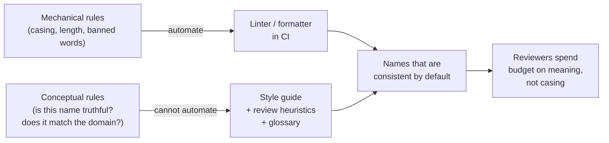
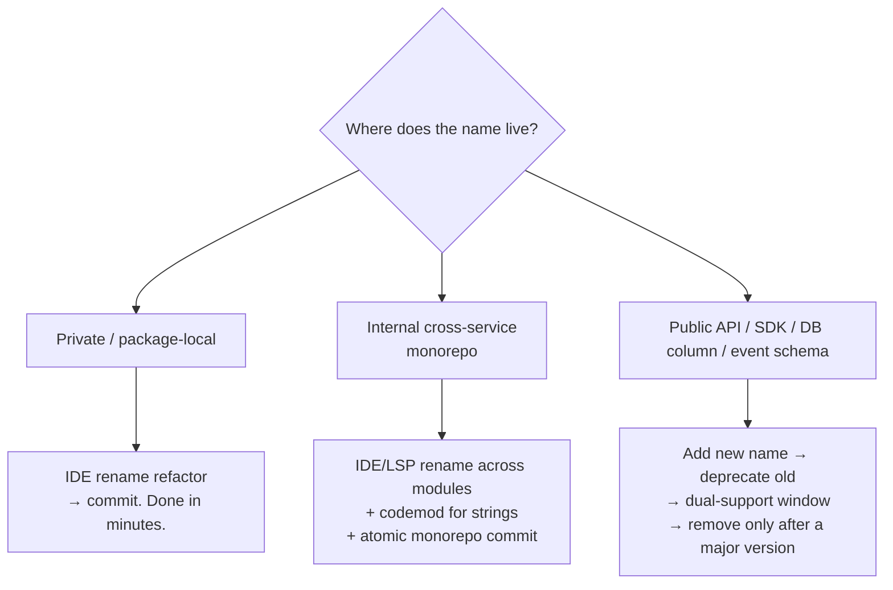

# Meaningful Names — Senior Level

> Focus: how naming stops being a personal habit and becomes a **team property** — enforced by style guides, linters, and review heuristics; preserved across a monorepo; and renamed safely at scale without breaking your consumers.

---

## Table of Contents

1. [Naming as a team property, not a personal one](#naming-as-a-team-property-not-a-personal-one)
2. [The style guide: codifying judgment](#the-style-guide-codifying-judgment)
3. [Ubiquitous language and the glossary](#ubiquitous-language-and-the-glossary)
4. [What a linter can enforce — and what it can't](#what-a-linter-can-enforce--and-what-it-cant)
5. [Linter configuration that actually ships](#linter-configuration-that-actually-ships)
6. [Naming in code review: reviewer heuristics](#naming-in-code-review-reviewer-heuristics)
7. [One word per concept across a monorepo](#one-word-per-concept-across-a-monorepo)
8. [Renaming safely at scale](#renaming-safely-at-scale)
9. [Names in public APIs and SDKs](#names-in-public-apis-and-sdks)
10. [Common Mistakes](#common-mistakes)
11. [Test Yourself](#test-yourself)
12. [Cheat Sheet](#cheat-sheet)
13. [Summary](#summary)
14. [Further Reading](#further-reading)
15. [Related Topics](#related-topics)

---

## Naming as a team property, not a personal one

At junior and middle level, a good name is something *you* choose. At team scale, the question changes: a name chosen by one engineer is *read* by twenty, *imitated* by the next person who works nearby, and *frozen* the moment it appears in a public type or a database column. Your job as a senior is to make good names the **path of least resistance** for everyone — not to be the person who renames things in review forever.

There is a spectrum from automation to judgment:



The split is the core senior insight: **push every mechanical rule into tooling so human review attention is spent only on the rules a machine cannot judge.** A reviewer who is arguing about `snake_case` vs `camelCase` is a reviewer not arguing about whether `process()` is a truthful name for a method that silently mutates global state.

---

## The style guide: codifying judgment

A naming style guide is the written contract. It should be short, opinionated, and example-driven — a 40-page document is a document nobody reads. The most influential real ones are worth studying: [Google Style Guides](https://google.github.io/styleguide/) (per-language), [Effective Go](https://go.dev/doc/effective_go#names), and [PEP 8](https://peps.python.org/pep-0008/#naming-conventions).

A good naming section answers, with concrete before/after examples:

| Decision the guide must settle | Example ruling |
|---|---|
| Casing per identifier kind | Go: `MixedCaps` exported, `mixedCaps` unexported; Python: `snake_case` funcs, `PascalCase` classes, `UPPER_SNAKE` constants; Java: `camelCase` methods, `PascalCase` types, `UPPER_SNAKE` static finals |
| Acronym casing | `userID` / `UserID` not `userId`; `HTTPClient` not `HttpClient` (Go); Java leans `HttpClient` — **pick one per language and never mix** |
| Abbreviation allow-list | `id`, `url`, `db`, `ctx`, `req`/`resp`, `cfg` permitted; `usr`, `mgr`, `tmp2`, `acc` banned |
| Banned noise words | `Manager`, `Processor`, `Data`, `Info`, `Helper`, `Util`, `Base`, `Common` — require justification |
| Boolean naming shape | predicate form: `isActive`, `hasNext`, `canRetry` — never `active` for a bool field that reads ambiguously |
| Collection naming | plural for collections (`orders`), `xByY` for maps (`orderByID`), never `orderList` when the type is a `Set` |
| Units in names | `timeoutMs`, `sizeBytes`, `priceCents` — encode the unit when the type can't |
| Context-length scaling | loop index `i` fine in a 3-line loop; a 40-line loop body needs `customer`, not `c` |

Keep the guide in the repo (`docs/style/naming.md`) so it versions with the code and shows up in PRs when it changes. A style guide that lives in a wiki nobody can diff is already dead.

---

## Ubiquitous language and the glossary

The single highest-leverage naming artifact at team scale is a **glossary of domain terms** — what Domain-Driven Design calls the *ubiquitous language*. The premise: the words in the code should be the same words the product team, the support team, and the customer use. When marketing says "subscriber," support says "member," and the code says `User`, every conversation pays a translation tax and every name is a guess.

The cure is a living glossary that fixes **one word per concept** at the *organization* level, not just the code level:

| Domain concept | Approved term | Banned synonyms | Notes |
|---|---|---|---|
| A person who pays for a plan | `Subscriber` | `User`, `Member`, `Customer`, `Account` | `User` = anyone with login; a `Subscriber` is a `User` with an active plan |
| The act of ending a plan | `Cancel` | `Terminate`, `Delete`, `Deactivate`, `Churn` | `Churn` is a metric, not an action |
| Money owed but not yet charged | `Accrued` | `Pending`, `Outstanding`, `Owed` | matches finance team's ledger term |

This is where "one word per concept" stops being a code-review nicety and becomes an architectural decision. If `Cancel` and `Terminate` are used interchangeably across services, a new engineer cannot know whether `terminateSubscription()` and `cancelSubscription()` are the same operation or two different ones — and they will eventually call the wrong one.

```go
// Aligned with the glossary: Subscriber, Cancel, effective date.
func (s *Subscriber) Cancel(effective time.Time) error {
    if s.plan == nil {
        return ErrNoActivePlan
    }
    s.cancellation = &Cancellation{EffectiveAt: effective}
    return nil
}
```

```python
# Misaligned: three words for one concept across one module is a defect.
def terminate_user(uid): ...        # "terminate"? "user"?
def deactivate_account(aid): ...    # "deactivate"? "account"?
def cancel_subscription(sid): ...   # the one the glossary blesses
```

Practical mechanics: keep the glossary in the repo (`docs/glossary.md`), require new domain terms to be added in the same PR that introduces them, and make "does this match the glossary?" an explicit review checklist item.

---

## What a linter can enforce — and what it can't

The boundary is sharp and worth stating explicitly, because teams routinely waste effort trying to make a linter judge meaning:

| A linter **can** enforce (syntactic) | A linter **cannot** enforce (semantic) |
|---|---|
| Casing per identifier kind | Whether the name is *truthful* |
| Minimum/maximum identifier length | Whether `data` should be `invoice` |
| Banned substrings (`Mgr`, `tmp`, `foo`) | Whether two names denote the same concept |
| Acronym casing consistency | Whether a boolean reads as a question |
| `I`-prefix / `Impl`-suffix bans | Whether the abstraction level of the name matches the code |
| Exported-symbol doc-comment presence | Whether the domain term is the *approved* one |

Everything in the right column is the job of the **style guide + glossary + review**. The senior mistake is over-rotating on the left column (a 200-rule linter that flags everything and gets `// nolint`'d into uselessness) and ignoring the right.

---

## Linter configuration that actually ships

Below are real, working configs for the three languages. Each enforces the *mechanical* naming rules so review attention stays on meaning.

### Go — `golangci-lint` with `revive`

`revive` is the modern replacement for `golint`. It carries the naming rules from [Effective Go](https://go.dev/doc/effective_go#names) and the [Go Code Review Comments](https://go.dev/wiki/CodeReviewComments).

```yaml
# .golangci.yml
linters:
  enable:
    - revive       # naming, style — successor to golint
    - stylecheck   # ST1003: naming conventions (var-naming on steroids)
    - varnamelen   # discourages too-short names in wide scopes
    - predeclared  # flags shadowing of len, new, error, etc.

linters-settings:
  revive:
    rules:
      - name: var-naming        # MixedCaps, no underscores, initialisms (ID/URL/HTTP)
      - name: exported          # exported symbols need a doc comment starting with the name
      - name: confusing-naming  # foo() and Foo() in the same package = flag
      - name: import-shadowing
  varnamelen:
    min-name-length: 3          # `i`, `j`, `ok`, `id` allow-listed below
    ignore-names: [i, j, k, n, w, r, ok, id, db, tx, ts, fn]
  stylecheck:
    initialisms: [ID, URL, HTTP, API, JSON, SQL, UUID, TLS, ACL]
```

`revive`'s `var-naming` rule is what catches `userId` (should be `userID`), `Http_Client` (should be `HTTPClient`), and snake_case in Go.

### Java — Checkstyle + PMD + SonarQube

Checkstyle owns the casing/format rules; PMD and SonarQube own the smell-shaped rules (short names, `Impl` suffix patterns).

```xml
<!-- checkstyle.xml — naming module excerpts -->
<module name="TypeName">
  <property name="format" value="^[A-Z][a-zA-Z0-9]*$"/>   <!-- PascalCase -->
</module>
<module name="MethodName">
  <property name="format" value="^[a-z][a-zA-Z0-9]*$"/>   <!-- camelCase  -->
</module>
<module name="ConstantName">
  <property name="format" value="^[A-Z][A-Z0-9]*(_[A-Z0-9]+)*$"/> <!-- UPPER_SNAKE -->
</module>
<module name="MemberName">
  <property name="format" value="^[a-z][a-zA-Z0-9]*$"/>   <!-- no m_ prefix, no _field -->
</module>
<module name="AbbreviationAsWordInName">
  <property name="allowedAbbreviationLength" value="1"/>   <!-- HTTPClient ok, HTTPSURLConn flagged -->
</module>
```

SonarQube adds the rules that approach meaning:

- **`S101`** — class names follow convention.
- **`S00117` / `S100`** — local-variable and method naming conventions.
- **`S1186`/`S125`** adjacent rules and **`S1612`** push toward intent-revealing replacements.
- A custom rule (or a `# noqa`-style architecture test) can ban the `Impl` suffix and `I`-prefix on interfaces.

### Python — `ruff` (recommended) or `pylint`/`flake8`

`ruff` reimplements `pep8-naming` (the `N` rule family) and runs ~100× faster — it's the current default for new projects.

```toml
# pyproject.toml
[tool.ruff.lint]
select = ["N", "E", "F"]   # N = pep8-naming
# N801 class CapWords · N802 function lowercase · N803 argument lowercase
# N806 variable in function lowercase · N815 mixedCase class attr
# N816 mixedCase global · N818 exception name ends in "Error"

[tool.ruff.lint.pep8-naming]
# allow domain initialisms so HTTPClient / UUIDStore aren't flagged
extend-ignore-names = ["HTTPClient", "DBSession"]
```

The equivalent in `pylint` if a team is already invested in it:

```ini
# .pylintrc
[BASIC]
argument-naming-style=snake_case
variable-naming-style=snake_case
class-naming-style=PascalCase
const-naming-style=UPPER_CASE
good-names=i,j,k,ex,_,id,db,fn        # short names allowed only here
bad-names=foo,bar,baz,tmp,data,mgr,toto
```

`bad-names` is the single most useful line: it lets you ban your team's recurring noise words project-wide in one place.

---

## Naming in code review: reviewer heuristics

Linters clear the mechanical rules; the reviewer is the only enforcement point for meaning. A senior reviewer applies a tight, repeatable set of heuristics so feedback is consistent across the team rather than a matter of personal taste:

- **Read the name without the code.** If `getActiveUsers()` returns inactive users too, the name lied — block it. The test is: could a caller guess wrong from the name alone?
- **Boolean reads as a yes/no question.** `if user.deleted` good; `if user.status` (a bool) bad.
- **Name matches abstraction level.** A method on a `PaymentGateway` called `runSQL()` leaks the layer below. The name belongs to the wrong altitude.
- **Glossary check.** New domain noun? Is it the approved term, or a synonym? Link the glossary entry in the comment.
- **One concept, one word.** If the PR adds `fetchOrder` next to an existing `getOrder` and `loadOrder`, ask which survives.
- **Searchability.** A bare `7` or a one-letter constant `T` can't be grepped. Magic literals get named.
- **Encoded type / scope prefixes.** `strName`, `m_count`, `IFoo`, `FooImpl` in a typed language — flag; the type system already carries that.

The discipline of *how* this feedback is delivered (nit vs blocker, tone, tempo) belongs to [Code Reviews](../17-code-reviews/README.md); the discipline of keeping the rule set small enough to hold in your head connects to [Cognitive Load](../20-cognitive-load/README.md).

A useful framing for review comments — distinguish severity so naming nits don't block a merge but naming *lies* do:

```text
nit(naming): `lst` → `pendingOrders`. Non-blocking, but please before merge.
blocker(naming): `validate()` returns the sanitized value AND mutates the
  argument — the name promises a check, not a transform. Rename or split.
```

---

## One word per concept across a monorepo

In a monorepo, "one word per concept" must hold across *services and teams*, not just within a file. This is where naming consistency becomes a tooling problem rather than a review problem — no human reviews across all of a 10-million-line tree.

Tactics that scale:

- **Banned-word grep in CI.** A cheap, language-agnostic gate: fail the build if a banned synonym appears in changed files.

  ```bash
  # ci/check-naming.sh — fail PR if a banned domain synonym is introduced
  banned='terminate_subscription|deactivate_account|customerList'
  if git diff --name-only origin/main... | xargs grep -nE "$banned" 2>/dev/null; then
    echo "Banned naming found. Use the glossary term (see docs/glossary.md)."
    exit 1
  fi
  ```

- **Shared schema as the source of truth.** When the same concept crosses a service boundary, define it once in a `.proto` / `.avsc` / `openapi.yaml` and generate the types. The generated field name becomes the canonical name in every language — you cannot drift from it without editing the schema, which is reviewed.

  ```protobuf
  // billing/v1/subscriber.proto — one definition, every service generates from it
  message Subscriber {
    string subscriber_id = 1;     // not "user_id", not "account_id"
    Plan   active_plan    = 2;
    google.protobuf.Timestamp cancelled_at = 3;  // "cancelled", per glossary
  }
  ```

- **Linter config inheritance.** A single root `.golangci.yml` / `checkstyle.xml` / `pyproject.toml` that every module extends, so initialism lists and banned words are defined once. Per-module overrides are the exception, reviewed like any other config.

- **Codeowners on the glossary.** `docs/glossary.md` gets a `CODEOWNERS` entry pointing at the domain experts, so synonym creep requires their sign-off.

---

## Renaming safely at scale

A bad name in private code is a 2-minute IDE rename. A bad name in a published API is a migration project. The cost of a name is proportional to the size of its **blast radius** — and a senior's main renaming skill is estimating that radius before touching anything.



### Private and internal code: just do it, mechanically

Use the tool, not find-and-replace. An IDE/LSP rename understands scope and won't clobber an unrelated `Order` in another package; a text replace will.

- **Java:** IntelliJ *Rename* (Shift+F6) — type-aware, updates Javadoc and reflection-string usages it can prove.
- **Python:** `ruff`/`rope` or PyCharm rename; for cross-repo string-keyed names, a `libcst` codemod (preserves formatting).
- **Go:** `gopls` rename (`gorename`'s successor) — type-aware across the module.

For names that escape the type system — string keys in config, log field names, JSON tags — an AST-based **codemod** beats `sed`, because it won't touch a substring match inside an unrelated string. Land the whole rename as **one atomic commit** in a monorepo so the tree never has a half-renamed intermediate state.

### Public APIs, SDKs, DB columns, event schemas: never rename in place

Renaming a published symbol is a **breaking change**. The discipline is *expand → migrate → contract*:

1. **Add** the new name alongside the old (a new field, a new method that the old delegates to).
2. **Deprecate** the old name with a machine-readable marker and a pointer to the replacement.
3. **Support both** for a deprecation window (often tied to a major version / SemVer boundary).
4. **Remove** the old name only in a major release, after telemetry shows usage has dropped.

```java
// Java — deprecate, don't delete. Delegate so behavior can't drift.
public final class Subscriber {
    /** @deprecated since 4.2; use {@link #cancel(Instant)}. Removed in 5.0. */
    @Deprecated(since = "4.2", forRemoval = true)
    public void terminate(Instant when) { cancel(when); }

    public void cancel(Instant effectiveAt) { /* canonical impl */ }
}
```

```go
// Go — no built-in @Deprecated; the convention is a "// Deprecated:" comment,
// which gopls and staticcheck surface as a warning at every call site.
//
// Deprecated: use Subscriber.Cancel. Terminate is removed in v5.
func (s *Subscriber) Terminate(when time.Time) error { return s.Cancel(when) }
```

```python
# Python — runtime DeprecationWarning + keep the old name delegating.
import warnings

class Subscriber:
    def cancel(self, effective_at): ...   # canonical

    def terminate(self, when):
        warnings.warn(
            "Subscriber.terminate is deprecated; use cancel(). Removed in 5.0.",
            DeprecationWarning, stacklevel=2,
        )
        return self.cancel(when)
```

**Database columns and event schemas are the hardest.** A column rename is an online migration (add column → dual-write → backfill → switch reads → drop old) — the same expand/contract shape, but with data, not just code. An event field rename ripples to every consumer that may be on an old deploy; you keep the old field populated until every consumer has migrated. This is why getting the name right *before* it ships is worth disproportionate effort: the half-life of a public name is measured in years.

---

## Names in public APIs and SDKs

A public name is a UX decision and a support-cost decision, not just a style decision. Specific senior concerns:

- **Names are the API's documentation that can't be skipped.** Developers read `client.subscriptions.cancel(id)` before they read your docs. If the name is right, the docs are confirmation; if it's wrong, the docs are damage control.
- **Consistency across the surface beats local cleverness.** If 19 endpoints use `list*` and one uses `getAll*`, the one is a bug — even though `getAll` is a defensible name in isolation. SDK ergonomics come from *predictability*: a developer who learned `list` should never have to look up the 20th resource.
- **Field names in JSON/Protobuf are the most expensive names you own.** They're serialized into customer code, logs, dashboards, and third-party integrations. A `proto` field number can be reused; a field *name* in a stable API effectively cannot.
- **Reserve room for evolution.** `status: "active"` as a string enum is friendlier than a magic int, and a typed enum in the SDK is friendlier still — but leave the *set* open so adding `"paused"` later isn't a breaking change for clients that switch exhaustively.
- **Avoid leaking implementation into the name.** `getUserFromRedis()` ties the contract to a cache that you might replace. The public name is `getUser()`; Redis is an internal detail.

The general principle that ties back to the chapter: at the public boundary, the cost of a misleading or inconsistent name is not "a confused teammate" — it's a migration, a deprecation cycle, and every customer who built on the wrong word. Spend the naming effort *up front*, where it's free.

---

## Common Mistakes

- **Trying to make the linter judge meaning.** A 300-rule config that flags everything trains engineers to `// nolint` reflexively. Automate the mechanical rules; leave meaning to review.
- **Renaming a public symbol in place** because the IDE made it a one-click operation. The IDE updated *your* repo; it didn't update your customers' code.
- **No glossary, so "one word per concept" lives only in senior heads.** When those people leave or the team grows past Dunbar's number, synonyms multiply and nobody can tell `terminate` from `cancel`.
- **Style guide in a wiki nobody diffs.** Naming rules that aren't in the repo aren't enforced and aren't versioned; they rot silently.
- **Per-module linter configs that drift.** Twelve `pyproject.toml`s with twelve different initialism lists means `userID` is correct in one service and flagged in another. Inherit from one root.
- **Bikeshedding casing in review.** If reviewers argue about `camelCase` in PRs, the formatter/linter isn't configured. Fix the tool, not the PR.
- **Encoding the type in the name in a typed language** (`strName`, `intCount`, `IFoo`/`FooImpl`). The compiler already knows the type; the prefix is noise that lies the moment the type changes.
- **Treating a DB column or event field rename as "just a rename."** It's a data migration with consumers on old deploys — plan it as expand/contract, not Shift+F6.

---

## Test Yourself

<details>
<summary>1. Your team argues about <code>camelCase</code> vs <code>snake_case</code> in three different PRs this week. What's the senior move — and is it a naming problem?</summary>

It's a *tooling* problem masquerading as a naming problem. Mechanical casing rules belong in the linter/formatter, not in human review. Configure `revive`'s `var-naming` (Go), `ruff`'s `N` rules (Python), or Checkstyle's `*Name` modules (Java) so casing is auto-enforced in CI. Then the formatter wins the argument once, permanently, and reviewers spend their attention on whether names are *truthful* — which is the part a machine can't judge.
</details>

<details>
<summary>2. A linter cannot enforce one of these. Which, and why? (a) class names are PascalCase, (b) no <code>Mgr</code> abbreviation, (c) the name <code>process()</code> truthfully describes what the method does.</summary>

(c). Casing (a) and banned substrings (b) are syntactic — a linter matches them with a regex. Whether `process()` is *truthful* is semantic: it requires understanding what the method actually does and whether the name predicts that. No linter can read intent. That's why truthfulness is enforced by the style guide, the glossary, and code review — never by tooling.
</details>

<details>
<summary>3. You want to rename a public SDK method <code>terminate()</code> to <code>cancel()</code>. Walk through the safe sequence.</summary>

Expand → deprecate → migrate → contract. (1) **Add** `cancel()` as the canonical implementation. (2) Make `terminate()` *delegate* to `cancel()` so behavior can't drift, and mark it deprecated (`@Deprecated(forRemoval=true)` in Java, `// Deprecated:` in Go, `DeprecationWarning` in Python). (3) Keep both through a deprecation window, watching telemetry for `terminate()` usage. (4) **Remove** `terminate()` only in the next major version per SemVer. Never delete the old name in a minor/patch release — that's a breaking change for every consumer.
</details>

<details>
<summary>4. In a monorepo, "one word per concept" can't be enforced by review alone. Name two tooling tactics that scale it.</summary>

Any two of: (1) a **banned-word grep gate** in CI that fails the build when a known synonym appears in changed files; (2) a **shared schema** (`.proto`/`.avsc`/`openapi.yaml`) that defines a cross-boundary concept once and generates the canonical field name into every language; (3) **linter config inheritance** from one root file so initialism/banned-word lists are defined once; (4) **CODEOWNERS on the glossary** so adding a new domain term requires domain-expert sign-off.
</details>

<details>
<summary>5. Why is renaming a database column fundamentally harder than renaming a private Java field, even though both are "renames"?</summary>

A private field rename is a type-aware IDE refactor: atomic, instantaneous, zero data involved. A column rename is an *online data migration with live consumers*: you must add the new column, dual-write to both, backfill historical rows, switch reads, and only then drop the old column — all while old application deploys may still reference the old name. It's the expand/contract pattern applied to *data and deploys*, not just code, which is why getting the column name right before it ships is worth disproportionate effort.
</details>

<details>
<summary>6. A reviewer leaves "rename <code>lst</code> to <code>orders</code>" and blocks the PR on it. Is that the right call?</summary>

Probably not a *blocker*. A short-but-clear local name is a `nit(naming):` — worth fixing, not worth blocking a merge over. Reserve blockers for names that *lie* or violate the glossary: e.g., `validate()` that also mutates its argument, or `getActiveUsers()` that returns inactive ones. Distinguishing nit from blocker keeps review velocity up and signals which feedback is mandatory — a core [Code Reviews](../17-code-reviews/README.md) discipline.
</details>

<details>
<summary>7. Where should the team naming style guide live, and why does location matter?</summary>

In the repo (`docs/style/naming.md`), not a wiki. Three reasons: it **versions with the code**, so a rule change is a reviewable diff; it **shows up in PRs** when amended, so changes get discussed; and it's **greppable and linkable** from review comments. A wiki page can't be diffed, drifts from the enforced linter rules, and rots without anyone noticing.
</details>

---

## Cheat Sheet

| Concern | Senior action |
|---|---|
| Casing, length, banned words | Automate in linter (`revive`, `ruff` N-rules, Checkstyle) — never in review |
| Truthfulness, abstraction level | Review heuristic — read the name without the code |
| One word per concept | Glossary in repo + banned-word CI grep + shared schema |
| Style guide | In-repo `docs/style/naming.md`, versioned, example-driven |
| Initialisms | One canonical list per language, inherited monorepo-wide |
| Private/internal rename | Type-aware IDE/LSP rename + codemod for strings, atomic commit |
| Public API / SDK / column / event rename | Expand → deprecate → migrate → contract; remove only at major version |
| Review feedback severity | `nit(naming)` for unclear; `blocker(naming)` for lying/glossary-violating |
| New domain term | Add to glossary in the same PR; CODEOWNERS sign-off |

**Linter rule quick-reference:**

| Language | Tool | Key naming rules |
|---|---|---|
| Go | `golangci-lint` → `revive`, `stylecheck`, `varnamelen` | `var-naming`, `exported`, `confusing-naming`, `ST1003` |
| Java | Checkstyle + PMD + SonarQube | `TypeName`, `MethodName`, `ConstantName`, `AbbreviationAsWordInName`, Sonar `S101`/`S100`/`S00117` |
| Python | `ruff` (or `pylint`) | `N801`–`N818`; `pylint` `bad-names`/`good-names` |

---

## Summary

At team scale, naming stops being a matter of taste and becomes a system with three layers. **Tooling** (linters, formatters, CI grep gates) owns every mechanical rule — casing, length, banned words, initialisms — so it's enforced for free and reviewers never argue about it. The **style guide and glossary** own the rules a machine can't judge — truthfulness, abstraction level, and the all-important "one word per concept" mapped to the ubiquitous language of the domain. **Code review** is the enforcement point for those semantic rules, applied through a small, repeatable heuristic set so feedback is consistent across the team rather than personal.

The senior's defining skill is the **automation-vs-judgment split**: push everything mechanical down into tooling so scarce human attention is spent only on meaning. And the senior's defining caution is **blast radius**: a name in private code is a free IDE refactor, but a name in a public API, SDK, database column, or event schema is a multi-year commitment that can only be changed through expand → deprecate → migrate → contract. The cheapest place to get a name right is before it ships; everywhere downstream, it gets exponentially more expensive.

---

## Further Reading

- *Clean Code* (2008), Robert C. Martin — Chapter 2, "Meaningful Names" (the source rules these practices scale up).
- *Domain-Driven Design* (2003), Eric Evans — "Ubiquitous Language," the origin of the glossary discipline.
- [Effective Go — Names](https://go.dev/doc/effective_go#names) and [Go Code Review Comments](https://go.dev/wiki/CodeReviewComments) — the canonical Go naming rules `revive` enforces.
- [PEP 8 — Naming Conventions](https://peps.python.org/pep-0008/#naming-conventions) — Python's normative casing rules, implemented by `ruff`'s `N` family.
- [Google Style Guides](https://google.github.io/styleguide/) — per-language guides worth lifting wholesale.
- [Semantic Versioning](https://semver.org/) — why renaming a public symbol is a major-version event.
- [revive rules reference](https://github.com/mgechev/revive#available-rules) and [ruff pep8-naming rules](https://docs.astral.sh/ruff/rules/#pep8-naming-n) — the exact rule codes referenced above.

---

## Related Topics

- [junior.md](junior.md) — the core naming rules: intention-revealing, pronounceable, searchable, unambiguous.
- [middle.md](middle.md) — *why* the rules exist and when they bend.
- [professional.md](professional.md) — the cognitive science of readability and the exceptions to every rule.
- [Naming Recipes](naming-recipes.md) — reusable name templates for booleans, collections, async, errors, events.
- [Chapter README](../README.md) — the naming anti-patterns checklist (what *not* to do).
- [Code Reviews](../17-code-reviews/README.md) — how naming feedback is delivered: nits vs blockers, tempo, etiquette.
- [Cognitive Load](../20-cognitive-load/README.md) — why a small, memorable rule set beats an exhaustive one.
- [Refactoring](../../refactoring/README.md) — Rename Method/Variable and the smells (e.g., misleading names) these practices prevent.
- [Anti-Patterns](../../anti-patterns/README.md) — noise-word and stringly-typed naming anti-patterns at scale.
