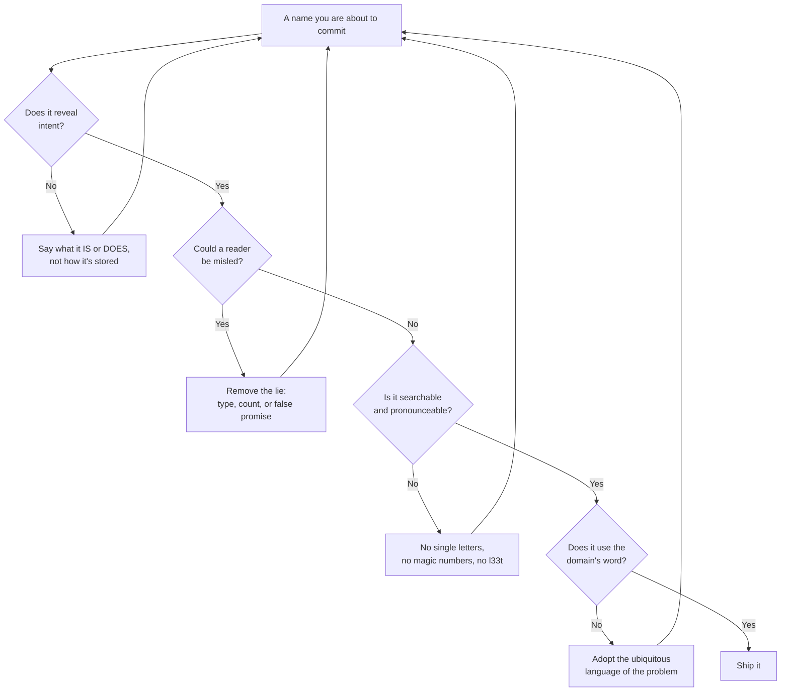

# Meaningful Names — Practice Tasks

> Twelve hands-on "rename it clean" exercises. Each gives a scenario, a code snippet riddled with bad names (Go, Java, or Python — the language varies), a precise instruction, and a collapsible solution with the cleaned code **plus a one-sentence rationale for every rename**. Difficulty climbs from spotting a single misleading variable to redesigning the vocabulary of a leaky public API.

---

## Table of Contents

1. [Task 1 — The variable that lies (Python, easy)](#task-1--the-variable-that-lies-python-easy)
2. [Task 2 — Single-letter abuse (Go, easy)](#task-2--single-letter-abuse-go-easy)
3. [Task 3 — Noise words (`Manager`, `Data`, `Info`) (Java, easy)](#task-3--noise-words-manager-data-info-java-easy)
4. [Task 4 — Collection naming that lies about its type (Java, easy-medium)](#task-4--collection-naming-that-lies-about-its-type-java-easy-medium)
5. [Task 5 — Boolean names you can read out loud (Go, medium)](#task-5--boolean-names-you-can-read-out-loud-go-medium)
6. [Task 6 — Hungarian notation in a typed language (Python, medium)](#task-6--hungarian-notation-in-a-typed-language-python-medium)
7. [Task 7 — Disambiguating near-identical names (Java, medium)](#task-7--disambiguating-near-identical-names-java-medium)
8. [Task 8 — Magic numbers and unsearchable names (Go, medium)](#task-8--magic-numbers-and-unsearchable-names-go-medium)
9. [Task 9 — Domain vocabulary over invented words (Python, medium-hard)](#task-9--domain-vocabulary-over-invented-words-python-medium-hard)
10. [Task 10 — Methods that don't match their verbs (Java, hard)](#task-10--methods-that-dont-match-their-verbs-java-hard)
11. [Task 11 — Naming a leaky public API (Go, hard)](#task-11--naming-a-leaky-public-api-go-hard)
12. [Task 12 — Naming audit, open-ended (Python, hard)](#task-12--naming-audit-open-ended-python-hard)
13. [Self-Assessment](#self-assessment)
14. [Related Topics](#related-topics)

---

## How to Use

1. Read the scenario and the snippet. Before opening the solution, write your renamed version in a scratch file.
2. For each name you change, force yourself to say *why* in one sentence. If you can't, the new name is probably no better than the old one.
3. Open the solution. Compare not just the names but the **reasoning** — a name can be different and still wrong.
4. Apply the rename in a real editor with a rename refactoring (F2 / "Rename Symbol"), never find-and-replace on text. This is the difference between a safe rename and a silent bug.
5. The naming axes you are training are summarized below — every task exercises at least one.



---

## Task 1 — The variable that lies (Python, easy)

**Scenario:** A teammate hands you this helper. It "works," but every reader stumbles on it because the names describe the wrong thing.

```python
def f(d):
    l = 0
    for x in d:
        if x[1] > 0:
            l += x[1]
    return l
```

**Instruction:** This computes the total of all positive amounts in a list of `(label, amount)` pairs. Rename the function, the parameter, the accumulator, the loop variable, and the tuple access so the body reads as English. Do not change behavior.

<details><summary>Solution</summary>

```python
def total_positive_amounts(entries):
    total = 0
    for label, amount in entries:
        if amount > 0:
            total += amount
    return total
```

- `f` → `total_positive_amounts`: a function name should state the result it produces, so the call site reads `total_positive_amounts(ledger)` instead of an opaque `f(ledger)`.
- `d` → `entries`: `d` hinted "dict," but it is a sequence of pairs; `entries` names the domain concept without implying a data structure.
- `l` → `total`: `l` is invisible next to `1` and `I` and says nothing; `total` names the accumulated value.
- `x` → unpacked into `label, amount`: tuple-indexing (`x[1]`) forces the reader to remember positional meaning; destructuring puts the meaning in the name.
- `x[1]` → `amount`: the condition now reads `if amount > 0`, which is the actual business rule.

</details>

---

## Task 2 — Single-letter abuse (Go, easy)

**Scenario:** A retry loop. The single-letter names made sense to the author at 2 a.m. and to nobody since.

```go
func retry(f func() error, n int, t time.Duration) error {
    var e error
    for i := 0; i < n; i++ {
        e = f()
        if e == nil {
            return nil
        }
        time.Sleep(t)
    }
    return e
}
```

**Instruction:** Keep the idiomatic short loop index `i`, but rename everything else to reveal intent. The signature is part of the public contract — its names show up in the caller's autocomplete and in docs.

<details><summary>Solution</summary>

```go
func retry(operation func() error, maxAttempts int, backoff time.Duration) error {
    var lastErr error
    for attempt := 0; attempt < maxAttempts; attempt++ {
        lastErr = operation()
        if lastErr == nil {
            return nil
        }
        time.Sleep(backoff)
    }
    return lastErr
}
```

- `f` → `operation`: a parameter that is "the thing we retry" should say so; `operation()` reads like a sentence.
- `n` → `maxAttempts`: `n` is a counter of nothing in particular, while `maxAttempts` states the loop's upper bound and its unit (attempts).
- `t` → `backoff`: `t` could be a timeout, a timestamp, or a temperature; `backoff` names the specific role of this duration.
- `e` → `lastErr`: this variable survives the loop to become the return value, so it is specifically the *last* error, not just "an error."
- `i` → `attempt`: even an idiomatic index reads better as `attempt` here because the count *is* a domain quantity, not a mere array offset.

</details>

---

## Task 3 — Noise words (`Manager`, `Data`, `Info`) (Java, easy)

**Scenario:** A class graduated from a tutorial. Every name carries a suffix that adds syllables but no meaning.

```java
class UserDataManager {
    private List<UserInfo> userInfoList;

    public void processUserData(UserInfo userInfoData) {
        userInfoList.add(userInfoData);
    }

    public UserInfo getUserInfoData(String idString) {
        return userInfoList.stream()
            .filter(u -> u.getIdString().equals(idString))
            .findFirst()
            .orElse(null);
    }
}
```

**Instruction:** Strip the noise words (`Data`, `Info`, `Manager`, `String` suffix) and replace the vague verb `process`. The class is an in-memory store of users keyed by id.

<details><summary>Solution</summary>

```java
class UserRepository {
    private final List<User> users = new ArrayList<>();

    public void add(User user) {
        users.add(user);
    }

    public Optional<User> findById(String id) {
        return users.stream()
            .filter(u -> u.id().equals(id))
            .findFirst();
    }
}
```

- `UserDataManager` → `UserRepository`: `Manager` and `Data` are noise; `Repository` is the recognized name for a collection-like store of domain objects, so it carries real meaning.
- `UserInfo` → `User`: `Info` adds nothing — the type *is* the user; an `Info` suffix only invites a sibling `UserInfoDetails` later.
- `userInfoList` → `users`: name the collection by what it holds, not by its implementation (`List`); if it became a `Set`, the name would still be true.
- `processUserData` → `add`: `process` is a non-verb that hides the action; the method appends a user, so it is `add`.
- `getUserInfoData` → `findById`: `get` implies the value always exists, but lookups can miss; `find` signals the `Optional`, and `ById` names the key.
- `idString` → `id`: the type is already `String`; encoding it in the name is redundant Hungarian noise (see Task 6).

</details>

---

## Task 4 — Collection naming that lies about its type (Java, easy-medium)

**Scenario:** A name claims one collection type while the code uses another — the classic "an `accountList` that is actually a `Set`" trap from the chapter.

```java
class AccessControl {
    private Map<String, String> permissionList;
    private List<String> adminArray;

    public boolean hasPermission(String user, String action) {
        return action.equals(permissionList.get(user));
    }

    public void addAdmin(String user) {
        if (!adminArray.contains(user)) {
            adminArray.add(user);
        }
    }
}
```

**Instruction:** The names encode the wrong container and bake implementation into the API. Rename so each name describes the *role*, not the type — and fix the `adminArray` whose dedup logic reveals it should be a `Set`.

<details><summary>Solution</summary>

```java
class AccessControl {
    private final Map<String, String> permissionByUser;
    private final Set<String> admins;

    public boolean hasPermission(String user, String action) {
        return action.equals(permissionByUser.get(user));
    }

    public void addAdmin(String user) {
        admins.add(user); // Set handles dedup for us
    }
}
```

- `permissionList` → `permissionByUser`: it is a `Map`, not a `List`, and the lie costs the reader a double-take; `xByY` is the idiom for "a map keyed by Y."
- `adminArray` → `admins`: the `if (!contains)` dance is a `Set` wearing a `List` costume; naming it `admins` (a plain plural) and switching to `Set<String>` makes the dedup implicit and the manual check vanishes.
- The type changes from `List` to `Set`: once the name stopped lying, the right data structure became obvious, and `addAdmin` collapses to a single line.
- Fields are now `final`: not a naming change, but naming clarity exposed that these collections are never reassigned, so the intent (`final`) can be made explicit too.

</details>

---

## Task 5 — Boolean names you can read out loud (Go, medium)

**Scenario:** A function bristling with booleans whose names invert the reader's mental model. Negative names plus a vague verb make every `if` a logic puzzle.

```go
type Account struct {
    notActive    bool
    disableEmail bool
    flag         bool
}

func canSend(a Account) bool {
    return !a.notActive && !a.disableEmail && a.flag
}
```

**Instruction:** Rename the booleans so they read as positive assertions and so `canSend` becomes a sentence. State what `flag` actually means: the account has completed email verification.

<details><summary>Solution</summary>

```go
type Account struct {
    isActive        bool
    emailEnabled    bool
    isEmailVerified bool
}

func canSendEmail(a Account) bool {
    return a.isActive && a.emailEnabled && a.isEmailVerified
}
```

- `notActive` → `isActive`: a negative boolean forces a double negation (`!a.notActive`) that reads as "not not active"; the positive form lets the predicate read plainly.
- `disableEmail` → `emailEnabled`: same trap — `!a.disableEmail` is a riddle, whereas `a.emailEnabled` is a fact, and the `is`/`-ed` form signals a boolean at a glance.
- `flag` → `isEmailVerified`: `flag` is the canonical meaningless boolean name; the new name states the precise condition so a future reader never has to chase down what it gates.
- `canSend` → `canSendEmail`: `Send` what? Naming the object of the verb makes the predicate self-contained and matches the verified-email rule it enforces.
- The body now reads as a positive conjunction, so the business rule ("active, email-enabled, verified") is visible without mentally negating anything.

</details>

---

## Task 6 — Hungarian notation in a typed language (Python, medium)

**Scenario:** Code ported from a 1990s C codebase. Every name wears its type as a prefix — useless in a language where the type is one hover away and actively harmful when the type changes.

```python
def calc(strName, intAge, lstScores, bIsAdmin, dctConfig):
    strGreeting = "Hello, " + strName
    fltAvg = sum(lstScores) / len(lstScores)
    if bIsAdmin and intAge >= 18:
        return strGreeting + dctConfig["adminSuffix"]
    return strGreeting + str(fltAvg)
```

**Instruction:** Strip the Hungarian type prefixes (`str`, `int`, `lst`, `b`, `dct`, `flt`) and let the names describe meaning. Add type hints instead — that is where type information belongs.

<details><summary>Solution</summary>

```python
def build_greeting(
    name: str,
    age: int,
    scores: list[float],
    is_admin: bool,
    config: dict[str, str],
) -> str:
    greeting = "Hello, " + name
    average_score = sum(scores) / len(scores)
    if is_admin and age >= 18:
        return greeting + config["admin_suffix"]
    return greeting + str(average_score)
```

- `calc` → `build_greeting`: `calc` describes a generic operation; the function assembles a greeting string, so name it for that result.
- `strName` → `name`, `intAge` → `age`, etc.: the type prefix duplicates the type hint and lies the moment a `str` id becomes an `int`; the hint (`name: str`) carries the type, checked by tooling, while the name carries the meaning.
- `lstScores` → `scores`: the `lst` prefix would be a maintenance bug if it ever became a tuple or generator; `scores` stays true regardless of container.
- `bIsAdmin` → `is_admin`: the `b` is redundant once the name already starts with `is_`, the standard boolean signal.
- `fltAvg` → `average_score`: `Avg` is an abbreviation and `flt` is noise; the full word names the quantity and its unit (a score).
- `dctConfig` → `config` and `adminSuffix` → `admin_suffix`: drop the `dct` prefix and adopt `snake_case` to match Python convention, so the names look native to the language.

</details>

---

## Task 7 — Disambiguating near-identical names (Java, medium)

**Scenario:** A method juggles four variables whose names differ by a single character. Reviewers keep approving bugs because `custmer` and `customr` look identical at a glance, and `data1`/`data2` carry no distinguishing meaning.

```java
void merge(Customer custmer, Customer customr, Account data1, Account data2) {
    custmer.setBalance(custmer.getBalance() + customr.getBalance());
    data1.setHistory(concat(data1.getHistory(), data2.getHistory()));
    custmer.setAccount(data1);
}
```

**Instruction:** The two customers are a survivor and a duplicate being absorbed; the two accounts are the kept account and the one being closed. Rename so the roles are obvious and no two names are near-typos of each other.

<details><summary>Solution</summary>

```java
void merge(Customer primary, Customer duplicate, Account keptAccount, Account closedAccount) {
    primary.setBalance(primary.getBalance() + duplicate.getBalance());
    keptAccount.setHistory(concat(keptAccount.getHistory(), closedAccount.getHistory()));
    primary.setAccount(keptAccount);
}
```

- `custmer` / `customr` → `primary` / `duplicate`: the originals were one-character-apart typos *and* meaningless; the new names state the role each customer plays in the merge, so swapping them would now read as obviously wrong.
- `data1` / `data2` → `keptAccount` / `closedAccount`: numeric suffixes are the laziest disambiguation — they impose mental mapping ("which was 1 again?"); role-based names make the second line read as the actual intent (history of the closed account flows into the kept one).
- Choosing *contrasting* words (`primary` vs `duplicate`, `kept` vs `closed`) is deliberate: names that differ in many letters and in meaning are hard to confuse, which is the whole point of disambiguation.

</details>

---

## Task 8 — Magic numbers and unsearchable names (Go, medium)

**Scenario:** A rate limiter. The constants are unsearchable (you can't grep for `60` and find *this* `60`) and the names are too terse to convey units.

```go
func allow(c int, t int64) bool {
    if c > 100 {
        return false
    }
    if time.Now().Unix()-t > 60 {
        return true
    }
    return c <= 100
}
```

**Instruction:** Replace the magic numbers `100` and `60` with named constants that include their units, and rename `c` and `t`. Make the window logic readable.

<details><summary>Solution</summary>

```go
const (
    maxRequestsPerWindow = 100
    windowSeconds        = 60
)

func allow(requestCount int, windowStartUnix int64) bool {
    elapsedSeconds := time.Now().Unix() - windowStartUnix
    if elapsedSeconds > windowSeconds {
        return true // window expired; the counter will reset
    }
    return requestCount <= maxRequestsPerWindow
}
```

- `100` → `maxRequestsPerWindow`: a bare `100` appears twice and is unsearchable and unexplained; the named constant states the limit and its scope (per window) and centralizes the value so both uses stay in sync.
- `60` → `windowSeconds`: the number hid its unit; the name encodes that this is seconds, preventing a future reader from treating it as minutes.
- `c` → `requestCount`: `c` could be a count, a channel, or a config; `requestCount` names the quantity and what is being counted.
- `t` → `windowStartUnix`: `t` is just "a time"; the name says it is the *start* of the window and that it is in Unix seconds, which is exactly what the subtraction assumes.
- Extracting `elapsedSeconds`: not a rename but a naming win — giving the subtraction a name turns the comparison into the readable claim "elapsed > window."

</details>

---

## Task 9 — Domain vocabulary over invented words (Python, medium-hard)

**Scenario:** A payments module written by someone unfamiliar with the domain. The names are invented synonyms ("thing," "doStuff," "money2") where the business already has precise words: *authorization*, *capture*, *refund*, *settlement*.

```python
class PaymentThing:
    def do_money(self, amount):
        self.held = amount          # reserve funds, not yet taken
        return self.held

    def take_money(self):
        self.taken = self.held      # actually move the held funds
        self.held = 0
        return self.taken

    def give_back(self, amount2):
        self.taken -= amount2       # return funds to the customer
        return amount2
```

**Instruction:** Replace the invented vocabulary with the standard payments domain terms. A payment is *authorized* (funds held), then *captured* (funds taken), and can later be *refunded*. Rename the class and all three methods and their fields.

<details><summary>Solution</summary>

```python
class Payment:
    def authorize(self, amount):
        self.authorized_amount = amount    # funds reserved, not yet captured
        return self.authorized_amount

    def capture(self):
        self.captured_amount = self.authorized_amount
        self.authorized_amount = 0
        return self.captured_amount

    def refund(self, amount):
        self.captured_amount -= amount
        return amount
```

- `PaymentThing` → `Payment`: `Thing` is a placeholder that survived into production; the class models a payment, and the domain already has that word.
- `do_money` → `authorize`: "do money" describes nothing; in payments, reserving funds without taking them is *authorization*, a term every reviewer and every gateway API uses.
- `take_money` → `capture`: moving previously authorized funds is *capture* — using the ubiquitous term lets a domain expert read the code without a translation layer.
- `give_back` → `refund`: returning captured funds is a *refund*; the precise term also signals the accounting and reconciliation implications the invented word hid.
- `held` → `authorized_amount`, `taken` → `captured_amount`: the fields now mirror the lifecycle states, so the object's data and its methods speak the same language.
- `amount2` → `amount`: a numeric-suffixed parameter is meaningless; within `refund`, it is simply the amount to refund, and the method name supplies the rest of the context.

</details>

---

## Task 10 — Methods that don't match their verbs (Java, hard)

**Scenario:** A service whose method names promise one thing and do another — the cruelest naming bug, because the names actively mislead callers into wrong assumptions.

```java
class OrderService {
    // Returns null if not found, and also writes to the DB. Surprise!
    public Order getOrder(String id) {
        Order o = repo.find(id);
        if (o == null) {
            o = new Order(id);
            repo.save(o);   // side effect inside a "get"
        }
        return o;
    }

    // Despite "is", this mutates and returns void via exception
    public void isValid(Order o) {
        if (o.total() < 0) {
            throw new IllegalStateException("invalid");
        }
        o.setValidated(true);   // mutation inside an "is" check
    }

    // "list" but returns a single count
    public int listOrders(String customerId) {
        return repo.findByCustomer(customerId).size();
    }
}
```

**Instruction:** Each method's verb lies about its behavior. Rename so the verb matches the contract: a `get` must not mutate, an `is`/predicate must be side-effect-free and return a boolean, and a `list` must return a list. Where the behavior is genuinely "create if missing" or "validate and mark," name that.

<details><summary>Solution</summary>

```java
class OrderService {
    // Honest name: it creates the order when absent.
    public Order getOrCreateOrder(String id) {
        Order order = repo.find(id);
        if (order == null) {
            order = new Order(id);
            repo.save(order);
        }
        return order;
    }

    // Honest name: it validates and records the result, returning nothing.
    public void validateAndMark(Order order) {
        if (order.total() < 0) {
            throw new IllegalStateException("invalid");
        }
        order.setValidated(true);
    }

    // Honest name: it counts.
    public int countOrders(String customerId) {
        return repo.findByCustomer(customerId).size();
    }
}
```

- `getOrder` → `getOrCreateOrder`: `get` implies a pure lookup, but this method *writes* a new order on a miss; the new name warns callers that calling it has a persistence side effect.
- `isValid` → `validateAndMark`: an `is`-prefixed method must be a side-effect-free boolean question, yet this one mutates and throws; the new name advertises both actions it actually performs and that it returns no boolean.
- `listOrders` → `countOrders`: `list` promises a collection; the method returns an `int`, so `count` matches the return type and spares the caller a surprised second look.
- `o` → `order`: a one-letter name in a service method is needless mental mapping; `order` matches the type and reads naturally in each statement.
- The deeper lesson: when a verb and a behavior disagree, you can rename the method *or* fix the behavior — here we renamed, but `getOrCreateOrder` is also a hint that the side-effecting `get` was a design smell worth revisiting.

</details>

---

## Task 11 — Naming a leaky public API (Go, hard)

**Scenario:** You are reviewing a soon-to-be-published package. The exported names leak implementation details, use inconsistent vocabulary for the same concept, and force callers to learn private jargon. Once published, every one of these names is a compatibility promise.

```go
package store

// Exported names that leak internals and use 3 words for 1 concept.
type RedisThing struct{ /* ... */ }

func NewRedisThing(s string) *RedisThing { /* connect */ return nil }

func (r *RedisThing) DoGet(k string) ([]byte, error)        { /* ... */ return nil, nil }
func (r *RedisThing) PutData(k string, v []byte) error      { /* ... */ return nil }
func (r *RedisThing) RemoveKVPair(k string) error           { /* ... */ return nil }
func (r *RedisThing) GetAllKeysSlice() []string             { /* ... */ return nil }
```

**Instruction:** Design the public vocabulary. The package is a key-value cache; callers should not care that today it is Redis. Rename the type and methods so (a) no implementation (`Redis`, `KVPair`, `Slice`) leaks, (b) the verbs are consistent (`Get`/`Set`/`Delete`/`Keys`), and (c) the constructor and type names read well at the call site (`store.New(...)`, `c.Get(...)`).

<details><summary>Solution</summary>

```go
package store

// Cache is a key-value store. The backing technology is an implementation detail.
type Cache struct{ /* ... */ }

func New(addr string) *Cache { /* connect */ return nil }

func (c *Cache) Get(key string) ([]byte, error)    { /* ... */ return nil, nil }
func (c *Cache) Set(key string, value []byte) error { /* ... */ return nil }
func (c *Cache) Delete(key string) error            { /* ... */ return nil }
func (c *Cache) Keys() []string                     { /* ... */ return nil }
```

- `RedisThing` → `Cache`: the public type must not name today's backend — if you switch to Memcached, `RedisThing` becomes a lie you cannot rename without breaking every caller; `Cache` names the role, not the vendor.
- `NewRedisThing` → `New`: Go convention is `store.New(...)`, which reads cleanly with the package qualifier; repeating the package concept in the function name (`NewRedisThing`) is stutter.
- `DoGet` → `Get`: the `Do` prefix is filler; `c.Get(key)` is the idiomatic, minimal verb.
- `PutData` → `Set`: `Data` is a noise word, and the package mixed `Put`/`Get`; standardizing on the `Get`/`Set` pair gives callers a consistent mental model.
- `RemoveKVPair` → `Delete`: `KVPair` leaks the internal representation and `Remove`/`Delete` were used interchangeably; `Delete` is the conventional counterpart to `Set`.
- `GetAllKeysSlice` → `Keys`: the `Slice` suffix is Hungarian-style type leakage (the signature already says `[]string`), and `GetAll` is verbose; `Keys()` says exactly what comes back.
- `s` → `addr`, `k` → `key`, `v` → `value`: parameter names appear in generated documentation and IDE hints, so even these deserve full words that tell the caller what to pass.

</details>

---

## Task 12 — Naming audit, open-ended (Python, hard)

**Scenario:** A real-looking module landed in code review. List **every naming problem** you can find and give a one-line fix for each, then propose the renamed signatures.

```python
class DataMgr:
    def __init__(self, l, d, flag1, flag2):
        self.l = l                 # list of orders
        self.d = d                 # dict: order_id -> status
        self.flag1 = flag1         # whether to send emails
        self.flag2 = flag2         # whether this is a dry run

    def proc(self, x):
        tmp = []
        for o in self.l:
            if o.amt > 0 and not self.flag2:
                tmp.append(o)
        return tmp

    def getStatusStr(self, intId):
        return self.d.get(intId)

    def doIt(self):
        # 40 lines that validate, charge, email, and log
        ...
```

**Instruction:** Produce a defect table (problem / where / fix) covering misleading names, noise words, single-letter abuse, Hungarian notation, boolean flags, and verbs that hide intent. Then write the corrected class skeleton.

<details><summary>Solution</summary>

| Problem | Where | Fix |
|---|---|---|
| Noise word `Mgr` | `DataMgr` | Name by role: this owns orders and charges them, so `OrderProcessor` (or split into `OrderRepository` + `BillingService`). `Data`/`Mgr` say nothing. |
| Single-letter / type-lie | `l`, `d` | `l` is a list of orders → `orders`; `d` is a status map → `status_by_order_id`. Name by content, not container. |
| Meaningless booleans | `flag1`, `flag2` | `flag1` → `send_emails`; `flag2` → `dry_run`. Numbered flags force the reader back to the comment to recover meaning. |
| Vague verb | `proc` | It selects chargeable orders → `select_chargeable_orders`. `proc` is a non-verb. |
| Single-letter param/locals | `x`, `o`, `tmp` | `x` is unused → delete it; `o` → `order`; `tmp` → `chargeable` (named by what it collects). |
| Negative-flag-in-condition | `not self.flag2` | After renaming to `dry_run`, `not self.dry_run` reads correctly; consider exposing `is_live` to avoid the negation. |
| Hungarian notation | `getStatusStr`, `intId` | Drop the `Str`/`int` prefixes; the type hints carry types. `get_status`, `order_id`. |
| `get` that can miss | `getStatusStr` | Returns `None` on a miss → `find_status` signals the optional result. |
| Verb hides 4 actions | `doIt` | "do it" names nothing; it validates, charges, emails, logs → `process_orders`, and the body should delegate to `validate`, `charge`, `notify`, `log_result` (extract methods). |

**Corrected skeleton:**

```python
class OrderProcessor:
    def __init__(
        self,
        orders: list[Order],
        status_by_order_id: dict[str, str],
        send_emails: bool,
        dry_run: bool,
    ):
        self.orders = orders
        self.status_by_order_id = status_by_order_id
        self.send_emails = send_emails
        self.dry_run = dry_run

    def select_chargeable_orders(self) -> list[Order]:
        return [
            order for order in self.orders
            if order.amount > 0 and not self.dry_run
        ]

    def find_status(self, order_id: str) -> str | None:
        return self.status_by_order_id.get(order_id)

    def process_orders(self) -> None:
        chargeable = self.select_chargeable_orders()
        for order in chargeable:
            self._validate(order)
            self._charge(order)
            if self.send_emails:
                self._notify(order)
            self._log_result(order)
```

- Every rename trades a placeholder or a type-prefix for a word that states a role, a content, or an action — the four jobs a name must do.
- Splitting `doIt` into named steps is where naming and [function design](../../design-patterns/README.md) meet: good names make the missing seams obvious.

</details>

---

## Self-Assessment

Tick each box only if you can do it without looking back at the solutions.

- [ ] I can spot a name that **lies** (claims a type, count, or behavior it doesn't have) and rewrite it to state the truth.
- [ ] I remove **noise words** (`Manager`, `Data`, `Info`, `Processor`, `Helper`) unless they carry a real, recognized meaning (e.g. `Repository`).
- [ ] I avoid **single-letter names** except for the narrowest idiomatic loop indices, and I name even those when they represent a domain quantity.
- [ ] I never add **Hungarian / type prefixes** in a typed language; I put type information in the type, and meaning in the name.
- [ ] My **booleans read as positive assertions** (`isActive`, not `notInactive`) and my predicates read as sentences.
- [ ] I name **collections by their content and role** (`permissionByUser`), never by their container (`permissionList`), and I let the name reveal the right data structure.
- [ ] I disambiguate **similar names** with contrasting words (`primary`/`duplicate`), never numeric suffixes (`data1`/`data2`).
- [ ] I replace **magic numbers** with named constants that include their units (`windowSeconds`, not `60`).
- [ ] I use the **domain's ubiquitous language** (`authorize`/`capture`/`refund`) instead of invented synonyms.
- [ ] My **verbs match behavior**: `get` doesn't mutate, `is` is side-effect-free, `list` returns a list.
- [ ] My **public API names** hide implementation (`Cache`, not `RedisThing`) and stay consistent (`Get`/`Set`/`Delete`).

---

## Related Topics

- [Meaningful Names — chapter README](../README.md) — the positive rules these tasks invert.
- [junior.md](junior.md) — the beginner-level definitions of each anti-pattern.
- [find-bug.md](find-bug.md) — buggy snippets where misleading names hide real defects.
- [optimize.md](optimize.md) — performance-flavored renaming and refactoring drills.
- [naming-recipes.md](naming-recipes.md) — a quick-reference cookbook of naming conventions by category.
- [Refactoring — code smells](../../refactoring/README.md) — many smells (Primitive Obsession, Data Clumps) are first detected through bad names.

---

> **Next:** [find-bug.md](find-bug.md) — find the defect that a misleading name is hiding in plain sight.
